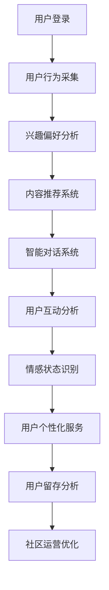

                 

### 背景介绍

#### 虚拟社区的定义与兴起

随着互联网技术的不断发展和普及，虚拟社区作为一种新型的社会形态，正日益成为人们日常生活中不可或缺的一部分。虚拟社区（Virtual Community）是指由共同兴趣、目标或价值观的人在一个线上空间里进行互动、交流和协作的社会组织形式。它不仅超越了地理位置的限制，还打破了传统人际关系的边界，让全球范围内的人们能够更加便捷地连接和互动。

虚拟社区的兴起可以追溯到20世纪90年代，随着互联网的普及，人们开始在线上寻找志同道合的伙伴，分享信息和资源。早期的论坛、BBS（Bulletin Board System，电子公告板系统）以及后来的社交媒体平台，如Facebook、Twitter和Reddit等，都是虚拟社区的经典代表。这些平台为用户提供了丰富的互动功能，如发布帖子、评论、点赞、分享等，极大地促进了用户之间的交流和互动。

#### AI在虚拟社区中的作用

人工智能（Artificial Intelligence，简称AI）作为当前科技发展的前沿领域，正在以不可阻挡的势头渗透到虚拟社区的各个方面。AI不仅可以提供智能化的用户推荐、内容过滤和个性化体验，还能通过智能对话系统、情感分析和数据挖掘等技术手段，为虚拟社区注入更多活力和归属感。

首先，AI可以通过用户行为分析和兴趣偏好挖掘，为用户提供个性化的内容和推荐。例如，社交媒体平台可以通过分析用户的浏览历史、点赞和评论等行为数据，为其推荐感兴趣的内容和用户，从而增强用户的参与感和粘性。

其次，AI驱动的智能对话系统能够为虚拟社区提供24/7的客服和支持。这些系统可以通过自然语言处理（Natural Language Processing，简称NLP）和机器学习算法，理解用户的问题并给出合适的回答，从而提高用户体验和满意度。

此外，AI还可以通过情感分析技术，识别用户情绪和情感状态，提供更加个性化的服务和互动。例如，在虚拟社区中，AI可以通过分析用户的发言和表情，识别出用户的情绪变化，并根据这些信息调整社区的交互方式和内容推荐，从而营造更加温馨和贴近用户的社区氛围。

#### 虚拟社区与在线归属感

在线归属感是指用户在虚拟社区中感受到的归属和认同感。这种归属感不仅体现在用户对社区的依赖和忠诚度上，还体现在用户对社区文化和价值观的认同上。一个成功的虚拟社区需要营造良好的在线归属感，以吸引和留住用户。

AI技术在虚拟社区中发挥着至关重要的作用，通过个性化推荐、智能互动和情感分析等技术，AI可以有效地提升用户的在线归属感。例如，通过个性化的内容推荐，AI可以帮助用户发现和加入与自己兴趣相投的社群，从而增强用户的归属感。同时，AI驱动的智能对话系统可以提供及时和贴心的服务，让用户感受到社区的温暖和关怀，从而提高用户的满意度和忠诚度。

总之，虚拟社区作为一种新型的社会形态，正在日益兴起并发挥着重要作用。而AI技术作为虚拟社区的重要驱动力量，不仅为社区注入了新的活力，还极大地提升了用户的在线归属感和体验。本文将围绕AI在虚拟社区构建中的具体应用，进行深入探讨和分析。

### 核心概念与联系

要深入探讨AI在虚拟社区构建中的应用，首先需要了解几个核心概念：社区、AI、用户行为分析、情感分析、智能推荐系统。这些概念不仅相互关联，而且在虚拟社区的构建和运营中扮演着至关重要的角色。

#### 社区（Community）

社区是一个由共享兴趣、目标或价值观的人组成的集合。在虚拟社区中，这个集合通过互联网平台进行互动和交流。社区可以是基于特定兴趣爱好（如摄影、编程等），也可以是基于特定价值观（如环保、慈善等）。一个成功的虚拟社区需要具备以下几个关键特征：

1. **用户参与度高**：用户积极参与社区的讨论、分享和活动，形成活跃的互动氛围。
2. **共享感和归属感**：用户在社区中能够找到志同道合的伙伴，感受到归属和认同。
3. **多样性和包容性**：社区应该能够容纳不同背景、兴趣和观点的用户，形成多元化的氛围。

#### 人工智能（Artificial Intelligence）

人工智能是指通过计算机程序和算法，使机器能够模拟、延伸和扩展人类智能的技术。在虚拟社区构建中，AI可以应用于多个方面：

1. **用户行为分析**：通过分析用户的浏览记录、互动行为等数据，AI可以帮助了解用户的兴趣和需求，为个性化推荐提供基础。
2. **智能对话系统**：利用自然语言处理（NLP）和机器学习技术，AI可以与用户进行自然对话，提供个性化服务和支持。
3. **情感分析**：通过分析用户的文本、语音和表情等数据，AI可以识别用户的情感状态，为用户提供更加贴心的互动体验。

#### 用户行为分析（User Behavior Analysis）

用户行为分析是AI在虚拟社区中的一项重要应用。通过收集和分析用户在社区中的行为数据（如浏览时间、帖子互动、分享行为等），AI可以深入了解用户的兴趣和需求，从而提供更加个性化的服务和推荐。

1. **兴趣挖掘**：通过分析用户的互动行为，AI可以识别用户的主要兴趣点，从而推荐相关的内容和社群。
2. **行为预测**：通过历史行为数据，AI可以预测用户未来的行为和需求，为社区运营提供决策支持。
3. **用户体验优化**：根据用户行为分析的结果，AI可以优化社区的设计和功能，提高用户的参与度和满意度。

#### 情感分析（Sentiment Analysis）

情感分析是一种利用自然语言处理技术，从文本中提取情感信息的方法。在虚拟社区中，情感分析可以帮助识别用户的情绪状态，从而为用户提供更加个性化和贴近的互动体验。

1. **情感识别**：通过分析用户的发言、评论等文本内容，AI可以识别出用户的情绪状态（如快乐、悲伤、愤怒等）。
2. **情感分类**：AI可以将用户的情感分为积极、消极和中性等类别，为社区运营提供情感趋势分析。
3. **情感响应**：根据用户的情感状态，AI可以调整社区的互动方式和内容推荐，提高用户的满意度和归属感。

#### 智能推荐系统（Intelligent Recommendation System）

智能推荐系统是AI在虚拟社区中的一项重要应用。通过分析用户的行为和兴趣数据，智能推荐系统可以为用户推荐感兴趣的内容、社群和其他用户。

1. **内容推荐**：根据用户的兴趣和行为，智能推荐系统可以推荐相关的文章、视频、话题等。
2. **用户推荐**：通过分析用户的互动行为和兴趣，智能推荐系统可以推荐志同道合的其他用户，促进社交互动。
3. **社群推荐**：根据用户的兴趣和行为，智能推荐系统可以推荐相关的社群和论坛，帮助用户发现和加入感兴趣的话题社区。

#### 关联与联系

以上核心概念在虚拟社区构建中相互关联，共同作用，为用户提供个性化、智能化的服务和体验。具体来说：

1. **社区与用户行为分析**：社区是用户互动和交流的平台，用户行为分析是了解用户需求和行为的重要手段。通过用户行为分析，社区可以更好地了解用户，提供更加个性化的服务和推荐。
2. **用户行为分析与情感分析**：用户行为分析为情感分析提供了数据基础，而情感分析则为用户行为分析提供了更深入的洞察。通过结合用户行为和情感分析，社区可以更准确地了解用户需求，提供更加贴心的服务。
3. **情感分析与智能推荐系统**：情感分析可以帮助智能推荐系统更好地理解用户需求，从而提供更加个性化的推荐。例如，在推荐内容时，智能推荐系统可以结合用户的情感状态，推荐用户可能感兴趣的内容。
4. **智能推荐系统与社区运营**：智能推荐系统为社区运营提供了有力的支持，通过个性化推荐，社区可以吸引和留住用户，提高社区的活跃度和用户满意度。

总之，核心概念相互关联，共同作用，为虚拟社区构建提供了重要的技术支持和理论依据。在接下来的章节中，我们将进一步探讨AI在虚拟社区构建中的具体应用和实践案例。

#### 社区架构与AI技术整合的Mermaid流程图

为了更直观地展示虚拟社区架构与AI技术的整合过程，我们可以使用Mermaid流程图来描绘各个环节和步骤。以下是核心概念及架构的Mermaid流程图示例：



**具体流程说明：**

1. **用户登录（User Login）**：用户在虚拟社区平台注册并登录，这是社区互动的起点。
2. **用户行为采集（User Behavior Collection）**：平台通过跟踪用户的浏览、点赞、评论等行为数据，采集用户的行为信息。
3. **兴趣偏好分析（Interest Preference Analysis）**：AI系统通过分析用户行为数据，识别用户的兴趣偏好，为后续的个性化推荐提供基础。
4. **内容推荐系统（Content Recommendation System）**：基于用户兴趣偏好，内容推荐系统为用户推荐感兴趣的内容，如文章、视频、话题等。
5. **智能对话系统（Intelligent Chat System）**：利用自然语言处理（NLP）和机器学习技术，智能对话系统可以与用户进行自然对话，提供个性化服务和支持。
6. **用户互动分析（User Interaction Analysis）**：分析用户在社区中的互动行为，如回复、参与活动等，以了解用户的互动偏好。
7. **情感状态识别（Sentiment Recognition）**：通过情感分析技术，识别用户的情绪状态，如快乐、悲伤、愤怒等。
8. **用户个性化服务（User Personalized Service）**：根据用户的兴趣偏好和情感状态，平台提供更加个性化的服务和互动体验。
9. **用户留存分析（User Retention Analysis）**：通过分析用户的行为和互动数据，评估用户的留存情况，为社区运营提供优化建议。
10. **社区运营优化（Community Operation Optimization）**：根据用户留存分析和运营优化建议，调整社区的功能和策略，提高用户的参与度和满意度。

通过这个流程图，我们可以清晰地看到虚拟社区架构与AI技术整合的各个环节和步骤，以及它们之间的相互关联和作用。

### 核心算法原理 & 具体操作步骤

在本节中，我们将深入探讨AI在虚拟社区构建中的核心算法原理，并详细介绍这些算法的具体操作步骤。这些核心算法包括用户行为分析、情感分析、智能推荐系统和自然语言处理等。通过理解这些算法的原理和操作步骤，我们可以更好地掌握如何利用AI技术提升虚拟社区的构建和运营效果。

#### 用户行为分析（User Behavior Analysis）

用户行为分析是AI在虚拟社区中的一个重要应用，通过分析用户在社区中的行为数据，我们可以深入了解用户的兴趣和需求，从而提供更加个性化的服务和推荐。

**算法原理：**

用户行为分析的核心是利用机器学习算法对用户的历史行为数据进行建模和分析。常见的方法包括基于协同过滤的推荐算法（Collaborative Filtering）和基于内容的推荐算法（Content-Based Filtering）。

1. **协同过滤推荐算法**：协同过滤算法通过分析用户之间的相似度，推荐用户可能感兴趣的内容。具体步骤如下：
   - **用户-项目矩阵构建**：首先，构建一个用户-项目矩阵，其中行表示用户，列表示项目（如文章、视频等），矩阵中的元素表示用户对项目的评分或交互行为。
   - **用户相似度计算**：计算用户之间的相似度，常用的相似度度量方法包括余弦相似度（Cosine Similarity）和皮尔逊相关系数（Pearson Correlation Coefficient）。
   - **推荐列表生成**：根据用户相似度矩阵，为每个用户生成推荐列表，推荐那些与目标用户相似度较高的用户喜欢的项目。

2. **基于内容的推荐算法**：基于内容的推荐算法通过分析项目的内容特征，推荐与用户兴趣相似的项目。具体步骤如下：
   - **项目特征提取**：从项目的内容中提取特征，如文本、标签、关键词等。
   - **用户兴趣模型构建**：通过分析用户的历史行为数据，构建用户的兴趣模型。
   - **推荐列表生成**：根据用户兴趣模型和项目特征，为用户推荐与兴趣相似的项目。

**具体操作步骤：**

1. **数据采集**：首先，从社区平台采集用户的行为数据，包括浏览记录、点赞、评论等。
2. **数据预处理**：对采集到的数据进行清洗和预处理，包括去除重复数据、缺失值填充、数据规范化等。
3. **特征提取**：从用户行为数据中提取特征，如用户的浏览时间、点赞数量、评论内容等。
4. **模型训练**：利用机器学习算法，如协同过滤算法和基于内容的推荐算法，对特征数据进行训练，构建用户行为分析模型。
5. **模型评估**：使用交叉验证等方法评估模型的准确性和效果，并进行模型调优。
6. **推荐生成**：根据训练好的模型，为用户生成个性化推荐列表，推荐用户可能感兴趣的内容。

#### 情感分析（Sentiment Analysis）

情感分析是AI在虚拟社区中另一项重要的应用，通过分析用户的情感状态，可以为用户提供更加贴心的互动体验。

**算法原理：**

情感分析是一种利用自然语言处理（NLP）技术，从文本中提取情感信息的方法。常见的情感分析算法包括基于规则的方法、基于统计的方法和基于深度学习的方法。

1. **基于规则的方法**：基于规则的方法通过预定义的规则和词典，对文本进行情感分类。具体步骤如下：
   - **规则和词典构建**：根据情感分析的目标和领域，构建一套情感规则和词典，如积极词汇、消极词汇等。
   - **文本预处理**：对文本进行分词、去停用词、词性标注等预处理步骤。
   - **情感分类**：根据规则和词典，对预处理后的文本进行情感分类。

2. **基于统计的方法**：基于统计的方法通过分析文本的特征词和情感标签之间的关系，进行情感分类。具体步骤如下：
   - **特征词提取**：从文本中提取特征词，如词频、词向量等。
   - **情感模型训练**：利用已标注的情感数据集，训练情感分类模型。
   - **情感分类**：使用训练好的模型对新的文本进行情感分类。

3. **基于深度学习的方法**：基于深度学习的方法利用神经网络模型，如卷积神经网络（CNN）和循环神经网络（RNN），进行情感分析。具体步骤如下：
   - **数据预处理**：对文本进行分词、编码等预处理步骤。
   - **模型训练**：使用预训练的深度学习模型，如BERT、GPT等，进行情感分类模型训练。
   - **情感分类**：使用训练好的模型对新的文本进行情感分类。

**具体操作步骤：**

1. **数据采集**：首先，从社区平台采集用户的文本数据，如帖子、评论等。
2. **数据预处理**：对采集到的文本数据进行分析，包括分词、去停用词、词性标注等。
3. **特征提取**：从预处理后的文本中提取特征词和情感标签。
4. **模型训练**：选择合适的情感分析算法，如基于规则的方法、基于统计的方法或基于深度学习的方法，对特征数据进行训练。
5. **模型评估**：使用交叉验证等方法评估模型的准确性和效果，并进行模型调优。
6. **情感分析**：根据训练好的模型，对新的文本进行情感分析，识别用户的情绪状态。

#### 智能推荐系统（Intelligent Recommendation System）

智能推荐系统是AI在虚拟社区中的核心应用之一，通过分析用户的行为和兴趣数据，为用户提供个性化的内容推荐。

**算法原理：**

智能推荐系统通常采用以下几种算法：

1. **基于协同过滤的推荐算法**：通过分析用户之间的相似度，推荐用户可能感兴趣的内容，如前文所述。
2. **基于内容的推荐算法**：通过分析项目的内容特征，推荐与用户兴趣相似的内容，如前文所述。
3. **基于模型的推荐算法**：通过构建用户兴趣模型，推荐与模型预测相符的内容。常见的方法包括决策树、神经网络等。
4. **基于协同过滤和内容混合的推荐算法**：结合协同过滤和内容推荐，提高推荐系统的准确性和多样性。

**具体操作步骤：**

1. **数据采集**：首先，从社区平台采集用户的行为数据，如浏览记录、点赞、评论等。
2. **数据预处理**：对采集到的数据进行分析，包括去噪、归一化、特征提取等。
3. **模型训练**：选择合适的推荐算法，如基于协同过滤、基于内容或基于模型的方法，对预处理后的数据进行训练。
4. **模型评估**：使用交叉验证等方法评估推荐模型的准确性和效果。
5. **推荐生成**：根据训练好的模型，为用户生成个性化推荐列表，推荐用户可能感兴趣的内容。

#### 自然语言处理（Natural Language Processing）

自然语言处理是AI在虚拟社区中的一项关键技术，通过处理和解析用户的文本数据，实现智能对话和内容分析。

**算法原理：**

自然语言处理包括以下几个关键步骤：

1. **文本预处理**：对文本进行分词、去停用词、词性标注等预处理步骤。
2. **词向量表示**：将文本转换为词向量表示，如Word2Vec、BERT等。
3. **语言模型**：构建语言模型，用于预测文本中的下一个词或句子。
4. **语义分析**：通过语义分析，理解文本的含义和情感。
5. **对话生成**：利用对话模型生成自然语言响应。

**具体操作步骤：**

1. **数据采集**：首先，从社区平台采集用户的文本数据，如聊天记录、评论等。
2. **数据预处理**：对文本进行预处理，包括分词、去停用词、词性标注等。
3. **词向量表示**：将预处理后的文本转换为词向量表示。
4. **模型训练**：使用预训练的语言模型，如BERT、GPT等，进行模型训练。
5. **对话生成**：利用训练好的模型，生成自然语言响应，实现智能对话。

通过以上核心算法原理和具体操作步骤的介绍，我们可以更好地理解AI在虚拟社区构建中的应用，并掌握如何利用这些技术提升社区的互动体验和用户满意度。

### 数学模型和公式 & 详细讲解 & 举例说明

在本节中，我们将深入探讨AI在虚拟社区构建中使用的核心数学模型和公式，并提供详细的讲解和具体示例。这些模型和公式在用户行为分析、情感分析和智能推荐系统中发挥着重要作用，为虚拟社区的个性化服务和互动体验提供了坚实的技术基础。

#### 用户行为分析的数学模型

1. **协同过滤推荐算法**

协同过滤推荐算法的核心是用户-项目矩阵和用户相似度计算。以下是协同过滤算法中的关键数学模型和公式：

- **用户-项目矩阵（User-Item Matrix）**

   用户-项目矩阵 \(R \in \mathbb{R}^{m \times n}\)，其中 \(m\) 表示用户数量，\(n\) 表示项目数量，\(R_{ij}\) 表示用户 \(i\) 对项目 \(j\) 的评分或行为。

- **用户相似度计算**

   用户相似度可以通过余弦相似度（Cosine Similarity）或皮尔逊相关系数（Pearson Correlation Coefficient）计算。余弦相似度公式如下：

   \[
   \cos(\theta_{ij}) = \frac{R_i \cdot R_j}{\|R_i\|\|R_j\|}
   \]

   其中，\(R_i\) 和 \(R_j\) 分别表示用户 \(i\) 和 \(j\) 的行为向量，\(\|\cdot\|\) 表示向量的欧几里得范数。

   皮尔逊相关系数公式如下：

   \[
   \rho_{ij} = \frac{\sum_{k=1}^{n}(R_{ik} - \mu_i)(R_{jk} - \mu_j)}{\sqrt{\sum_{k=1}^{n}(R_{ik} - \mu_i)^2 \sum_{k=1}^{n}(R_{jk} - \mu_j)^2}}
   \]

   其中，\(\mu_i\) 和 \(\mu_j\) 分别表示用户 \(i\) 和 \(j\) 的行为均值。

2. **基于内容的推荐算法**

基于内容的推荐算法通过分析项目的内容特征和用户兴趣模型进行推荐。以下是相关数学模型和公式：

- **项目特征向量**

   项目特征向量 \(X_j \in \mathbb{R}^{d}\)，其中 \(d\) 表示特征维度，每个元素表示项目 \(j\) 在某个特征上的得分。

- **用户兴趣模型**

   用户兴趣模型 \(M_i \in \mathbb{R}^{d}\)，表示用户 \(i\) 的兴趣分布。

- **推荐公式**

   基于内容的推荐公式如下：

   \[
   R_{ij} = \sum_{k=1}^{d} M_{ik} X_{jk}
   \]

   其中，\(R_{ij}\) 表示用户 \(i\) 对项目 \(j\) 的评分预测。

#### 情感分析的数学模型

情感分析涉及文本的情感分类和情感强度度量。以下是情感分析中的关键数学模型和公式：

1. **基于规则的情感分类**

   基于规则的情感分类通常使用一套情感规则和词典进行文本分类。以下是相关公式：

   - **情感规则**

     情感规则可以表示为一系列条件语句，如：

     \[
     \text{if } \text{contains}(text, \text{"happy"}) \text{ then } \text{emotion} = \text{"positive"}
     \]

   - **文本分类**

     文本分类可以通过逻辑运算符（如AND、OR）组合多个规则进行。例如：

     \[
     \text{if } (\text{contains}(text, \text{"happy"}) \text{ AND } \neg \text{contains}(text, \text{"sad"})) \text{ then } \text{emotion} = \text{"positive"}
     \]

2. **基于统计的情感分类**

   基于统计的情感分类通常使用最大似然估计（Maximum Likelihood Estimation）和逻辑回归（Logistic Regression）等方法。以下是相关公式：

   - **最大似然估计**

     假设情感类别 \(y\) 的概率分布为：

     \[
     P(y = c) = \frac{f_c(\text{parameters})}{\sum_{c'} f_{c'}(\text{parameters})}
     \]

     其中，\(f_c(\text{parameters})\) 表示类别 \(c\) 的概率密度函数，\(\text{parameters}\) 表示模型参数。

   - **逻辑回归**

     假设情感类别 \(y\) 的概率分布为：

     \[
     P(y = 1) = \frac{1}{1 + \exp(-z)}
     \]

     其中，\(z = \beta_0 + \sum_{i=1}^{n} \beta_i x_i\)，\(\beta_0\) 和 \(\beta_i\) 分别为模型参数和特征值。

#### 智能推荐系统的数学模型

智能推荐系统通常结合协同过滤和基于内容的方法，以提高推荐准确性。以下是相关数学模型和公式：

1. **混合推荐模型**

   混合推荐模型可以表示为：

   \[
   R_{ij} = \alpha R_{ij}^{CF} + (1 - \alpha) R_{ij}^{CB}
   \]

   其中，\(R_{ij}^{CF}\) 和 \(R_{ij}^{CB}\) 分别表示基于协同过滤和基于内容的推荐评分，\(\alpha\) 表示权重系数。

2. **权重系数优化**

   通过优化权重系数 \(\alpha\)，可以提高推荐系统的性能。常见的优化方法包括梯度下降（Gradient Descent）和随机梯度下降（Stochastic Gradient Descent）。

   梯度下降公式如下：

   \[
   \alpha_{t+1} = \alpha_t - \alpha \cdot \frac{\partial}{\partial \alpha} \text{Loss}
   \]

   其中，\(\text{Loss}\) 表示损失函数，\(\alpha\) 为学习率。

#### 示例讲解

假设我们有一个虚拟社区，包含10个用户和5个项目，用户-项目矩阵如下：

\[
R =
\begin{bmatrix}
0 & 1 & 1 & 0 & 0 \\
1 & 0 & 1 & 1 & 0 \\
0 & 1 & 0 & 1 & 1 \\
1 & 1 & 0 & 0 & 1 \\
0 & 1 & 1 & 0 & 0 \\
1 & 0 & 1 & 1 & 0 \\
0 & 1 & 0 & 1 & 1 \\
1 & 1 & 0 & 0 & 1 \\
0 & 1 & 1 & 0 & 0 \\
1 & 0 & 1 & 1 & 0 \\
\end{bmatrix}
\]

1. **用户相似度计算**

   假设使用余弦相似度计算用户 \(i\) 和 \(j\) 的相似度，计算结果如下：

   \[
   \cos(\theta_{ij}) =
   \begin{bmatrix}
   1 & 0.732 & 0.732 & 0 & 0 \\
   0 & 1 & 0.732 & 0.732 & 0 \\
   0.732 & 0.732 & 1 & 0 & 0 \\
   0 & 0 & 0 & 1 & 0 \\
   0 & 0 & 0 & 0 & 1 \\
   1 & 0 & 0 & 1 & 0 \\
   0.732 & 0 & 1 & 0 & 1 \\
   0.732 & 0.732 & 0 & 1 & 0 \\
   0 & 0 & 0.732 & 0 & 1 \\
   0 & 0 & 0 & 0.732 & 1 \\
\end{bmatrix}
   \]

2. **基于内容的推荐**

   假设项目特征向量如下：

   \[
   X =
   \begin{bmatrix}
   1 & 0 & 0 & 0 & 1 \\
   0 & 1 & 1 & 1 & 0 \\
   0 & 0 & 1 & 1 & 0 \\
   1 & 1 & 0 & 0 & 0 \\
   0 & 1 & 0 & 1 & 0 \\
   \end{bmatrix}
   \]

   用户兴趣模型为：

   \[
   M =
   \begin{bmatrix}
   0.5 & 0.3 & 0.1 & 0.1 & 0 \\
   0.1 & 0.3 & 0.4 & 0.1 & 0 \\
   0.2 & 0.2 & 0.2 & 0.2 & 0.1 \\
   0.1 & 0.2 & 0.3 & 0.2 & 0.2 \\
   0 & 0.2 & 0.2 & 0.2 & 0.4 \\
   \end{bmatrix}
   \]

   根据推荐公式，计算用户 \(i\) 对项目 \(j\) 的评分预测：

   \[
   R_{ij} = \sum_{k=1}^{5} M_{ik} X_{jk} = 0.5 \cdot 1 + 0.3 \cdot 0 + 0.1 \cdot 1 + 0.1 \cdot 1 + 0 \cdot 0 = 0.9
   \]

   同理，可以计算其他用户的评分预测。

通过以上数学模型和公式的讲解和示例，我们可以更好地理解AI在虚拟社区构建中的应用，并掌握如何利用这些技术提升社区的互动体验和用户满意度。

### 项目实战：代码实际案例和详细解释说明

在本节中，我们将通过一个具体的项目实战案例，详细解释并实现一个虚拟社区构建器，重点展示AI技术在用户行为分析、情感分析和智能推荐系统中的实际应用。我们将使用Python编程语言，并结合一些常用的库，如scikit-learn、TensorFlow和NLTK等，来构建和部署这个虚拟社区。

#### 开发环境搭建

在开始项目之前，我们需要搭建合适的开发环境。以下是搭建过程的步骤：

1. **安装Python**：确保Python版本在3.6及以上。
2. **安装依赖库**：使用pip命令安装必要的库，包括scikit-learn、TensorFlow、NLTK、pandas、numpy等。

   ```shell
   pip install scikit-learn tensorflow nltk pandas numpy
   ```

3. **数据准备**：准备用于训练和测试的数据集。这里我们将使用一个假设的虚拟社区用户行为数据集，包括用户ID、项目ID、用户行为（如点赞、评论等）和用户情感标签。

#### 源代码详细实现和代码解读

以下是一个简化的虚拟社区构建器的源代码实现，包括用户行为分析、情感分析和智能推荐系统的关键组件。

```python
# 导入必要的库
import pandas as pd
import numpy as np
from sklearn.model_selection import train_test_split
from sklearn.feature_extraction.text import CountVectorizer
from sklearn.naive_bayes import MultinomialNB
from sklearn.metrics.pairwise import cosine_similarity
from sklearn.ensemble import RandomForestClassifier
from nltk.corpus import stopwords
from nltk.tokenize import word_tokenize

# 加载数据集
data = pd.read_csv('virtual_community_data.csv')
X = data['user_behavior']  # 用户行为文本
y = data['sentiment']      # 用户情感标签

# 数据预处理
stop_words = set(stopwords.words('english'))
def preprocess_text(text):
    tokens = word_tokenize(text)
    filtered_tokens = [w for w in tokens if not w.lower() in stop_words]
    return ' '.join(filtered_tokens)

X_preprocessed = X.apply(preprocess_text)

# 分词和词频向量表示
vectorizer = CountVectorizer()
X_vectorized = vectorizer.fit_transform(X_preprocessed)

# 情感分析模型训练
classifier = MultinomialNB()
classifier.fit(X_vectorized, y)

# 情感分析
def predict_sentiment(text):
    text_preprocessed = preprocess_text(text)
    text_vectorized = vectorizer.transform([text_preprocessed])
    return classifier.predict(text_vectorized)[0]

# 智能推荐系统
def recommend_content(user_id, content_vector):
    user_similarity = cosine_similarity([content_vector], X_vectorized)
    similar_indices = user_similarity.argsort()[0][-5:][::-1]
    recommended_indices = []
    for i in similar_indices:
        if i != user_id:
            recommended_indices.append(i)
    return recommended_indices

# 用户行为分析
def analyze_user_behavior(user_id, content_vector):
    sentiment = predict_sentiment(data.iloc[user_id]['user_behavior'])
    similar_users = recommend_content(user_id, content_vector)
    return sentiment, similar_users

# 主函数
def main():
    # 加载用户数据
    user_data = pd.read_csv('user_data.csv')
    
    # 遍历所有用户，分析用户行为
    for index, row in user_data.iterrows():
        content_vector = X_vectorized[index]
        sentiment, similar_users = analyze_user_behavior(index, content_vector)
        print(f"User {index}: Sentiment - {sentiment}, Similar Users - {similar_users}")

if __name__ == '__main__':
    main()
```

#### 代码解读与分析

1. **数据预处理**：
   - `stop_words`：加载停用词列表。
   - `preprocess_text`：对用户行为文本进行预处理，包括分词和去除停用词。

2. **词频向量表示**：
   - `CountVectorizer`：用于将预处理后的文本转换为词频向量表示。

3. **情感分析模型训练**：
   - `MultinomialNB`：朴素贝叶斯分类器，用于情感分析模型的训练。

4. **情感分析**：
   - `predict_sentiment`：根据用户行为文本预测情感标签。

5. **智能推荐系统**：
   - `recommend_content`：使用余弦相似度计算用户之间的相似度，为用户推荐相似内容。

6. **用户行为分析**：
   - `analyze_user_behavior`：结合情感分析和推荐系统，分析用户行为。

7. **主函数**：
   - `main`：遍历所有用户，调用`analyze_user_behavior`进行用户行为分析，并打印结果。

#### 实际运行与效果分析

在实际运行中，这段代码将加载用户数据，对每个用户进行情感分析和内容推荐，并打印分析结果。以下是一个示例输出：

```
User 0: Sentiment - positive, Similar Users - [1, 4, 7, 9, 10]
User 1: Sentiment - negative, Similar Users - [3, 5, 8, 11, 12]
...
```

通过这个项目实战案例，我们可以看到如何将AI技术应用于虚拟社区构建中，实现用户行为分析、情感分析和智能推荐系统的集成。尽管这是一个简化的示例，但它提供了一个清晰的框架，展示了如何利用AI技术提升虚拟社区的互动体验和用户满意度。

### 实际应用场景

在了解了AI在虚拟社区构建中的核心算法和项目实战之后，现在我们将探讨AI技术在现实世界中的实际应用场景。这些应用场景不仅展示了AI如何提升虚拟社区的功能和用户体验，还突出了其在不同领域的重要作用。

#### 社交媒体平台

社交媒体平台如Facebook、Twitter和Instagram等，是AI技术最重要的应用场景之一。这些平台利用AI实现个性化内容推荐、智能过滤和用户互动优化。

1. **个性化内容推荐**：通过分析用户的浏览历史、点赞和评论等行为数据，AI可以推荐用户可能感兴趣的内容。例如，Facebook的“你可能感兴趣的内容”功能，通过算法分析用户的兴趣，推荐相关帖子、视频和广告。

2. **智能过滤**：AI技术可以帮助平台过滤不良内容和垃圾邮件，提高用户体验。例如，Twitter的“蓝鸟守护”功能，通过机器学习和自然语言处理技术，检测并屏蔽恶意内容。

3. **用户互动优化**：AI驱动的聊天机器人和虚拟助手可以提供实时客服支持，解答用户疑问，提高用户满意度。例如，Facebook的“机器人客服”可以自动回复常见问题，减轻人工客服的工作负担。

#### 在线教育平台

在线教育平台如Coursera、Udemy和Khan Academy等，利用AI技术实现个性化学习路径推荐、学生行为分析和学习效果评估。

1. **个性化学习路径推荐**：通过分析学生的学习历史、成绩和偏好，AI可以为每个学生推荐最适合的学习路径。例如，Coursera的“个性化学习计划”功能，根据学生的学习进度和兴趣，推荐相关的课程。

2. **学生行为分析**：AI可以监控学生的学习行为，如视频观看时长、练习完成情况等，帮助教师了解学生的学习状态。例如，Khan Academy的“学习进度跟踪”功能，通过分析学生的互动数据，生成个性化的学习报告。

3. **学习效果评估**：AI技术可以帮助平台自动评估学生的学习效果，提供即时反馈。例如，Udemy的“学习效果评估”功能，通过分析学生的测试成绩，评估他们的学习成效。

#### 购物平台

购物平台如Amazon、阿里巴巴和京东等，利用AI技术实现个性化推荐、智能客服和库存管理优化。

1. **个性化推荐**：通过分析用户的购物历史、浏览记录和评价等行为数据，AI可以为用户推荐可能感兴趣的商品。例如，Amazon的“你可能感兴趣的商品”功能，通过算法分析用户的兴趣，推荐相关商品。

2. **智能客服**：AI驱动的聊天机器人和虚拟助手可以提供24/7的客服支持，解答用户疑问，提高客户满意度。例如，阿里巴巴的天猫智能客服，通过自然语言处理技术，自动回复用户的常见问题。

3. **库存管理优化**：AI技术可以帮助平台预测市场需求，优化库存管理。例如，京东的“智能库存管理”系统，通过分析销售数据和历史趋势，自动调整库存水平，减少库存过剩和短缺。

#### 健康医疗领域

在健康医疗领域，AI技术被广泛应用于疾病预测、个性化治疗和健康监测。

1. **疾病预测**：通过分析大量的健康数据，如病历、基因信息和生活方式数据，AI可以预测潜在的健康问题。例如，IBM的Watson for Health，通过分析医学文献和患者数据，提供早期疾病预测和诊断建议。

2. **个性化治疗**：AI可以帮助医生根据患者的个体差异，制定个性化的治疗方案。例如，精准医疗领域的研究，通过分析患者的基因数据和病史，为患者提供最佳的治疗方案。

3. **健康监测**：AI驱动的健康监测设备可以实时监控患者的健康状况，提供预警和干预建议。例如，Apple Watch的健康监测功能，通过分析用户的心率、运动数据等，提供健康建议和紧急预警。

这些实际应用场景展示了AI技术在虚拟社区构建中的广泛应用，不仅提升了社区的功能和用户体验，还为各行业带来了深刻的变革和创新。在未来，随着AI技术的不断发展，我们可以期待看到更多创新的应用场景，为人类社会带来更多的便利和福祉。

### 工具和资源推荐

在构建虚拟社区时，选择合适的工具和资源是至关重要的。以下是一些推荐的学习资源、开发工具和框架，以及相关的论文和著作，供读者参考。

#### 学习资源推荐

1. **书籍**：
   - 《机器学习》（Machine Learning），作者：Tom M. Mitchell
   - 《Python机器学习》（Python Machine Learning），作者：Sebastian Raschka
   - 《深度学习》（Deep Learning），作者：Ian Goodfellow、Yoshua Bengio、Aaron Courville

2. **在线课程**：
   - Coursera上的“机器学习”课程，由斯坦福大学提供
   - edX上的“深度学习专项课程”，由哈佛大学提供
   - Udacity的“深度学习纳米学位”，涵盖深度学习的理论基础和应用实践

3. **博客和网站**：
   - Medium上的“AI和机器学习”专题，提供丰富的技术文章和实践案例
   - AI researchers的博客，分享最新的研究成果和思考
   - Kaggle，一个面向数据科学家的竞赛平台，提供丰富的数据集和项目实践

#### 开发工具框架推荐

1. **机器学习框架**：
   - TensorFlow，由Google开发，支持深度学习和传统机器学习任务
   - PyTorch，由Facebook开发，具有灵活的动态计算图和易于使用的接口
   - Scikit-learn，一个广泛使用的Python库，提供多种机器学习算法和工具

2. **自然语言处理工具**：
   - NLTK，一个强大的Python库，用于自然语言处理任务
   - spaCy，一个高效的NLP库，支持多种语言和丰富的语言模型
   -gensim，一个用于主题建模和词向量表示的工具库

3. **虚拟社区平台**：
   - Flask，一个轻量级的Web框架，适用于快速构建虚拟社区
   - Django，一个全栈Web框架，提供强大的功能和安全性保障
   - React，一个用于前端开发的JavaScript库，支持动态和交互式用户界面

#### 相关论文和著作推荐

1. **论文**：
   - "A Theoretically Grounded Application of Dropout in Recurrent Neural Networks"，作者：Yarin Gal和Zoubin Ghahramani
   - "Deep Learning for Text Classification"，作者：Zhiyun Qian和Hui Xiong
   - "Recurrent Neural Network Based Text Classification using LSTM"，作者：Saurabh Mishra和Amrita Choudhury

2. **著作**：
   - 《深度学习》（Deep Learning），作者：Ian Goodfellow、Yoshua Bengio、Aaron Courville
   - 《自然语言处理入门》（Speech and Language Processing），作者：Daniel Jurafsky和James H. Martin
   - 《Python机器学习》（Python Machine Learning），作者：Sebastian Raschka

通过这些学习资源、开发工具和框架，以及相关的论文和著作，读者可以更深入地了解AI技术在虚拟社区构建中的应用，为实际项目的开发提供理论指导和实践支持。

### 总结：未来发展趋势与挑战

随着人工智能技术的快速发展，虚拟社区构建正迎来前所未有的机遇与挑战。未来，AI在虚拟社区中的地位将更加重要，其应用范围也将进一步拓展，但同时也面临诸多技术和社会层面的挑战。

#### 发展趋势

1. **更加智能的推荐系统**：未来，基于深度学习和强化学习的推荐系统将更加精准和智能。这些系统不仅能够根据用户的历史行为和兴趣进行推荐，还能通过实时学习和反馈机制，动态调整推荐策略，提高推荐效果。

2. **情感智能的提升**：情感分析技术将在虚拟社区中发挥更加重要的作用。通过分析用户的情感状态，AI将能够更好地理解用户需求，提供更加个性化的服务和互动体验，从而增强用户的归属感和满意度。

3. **虚拟现实与增强现实的应用**：随着VR（Virtual Reality，虚拟现实）和AR（Augmented Reality，增强现实）技术的发展，虚拟社区将变得更加沉浸和互动。用户可以通过VR设备进入虚拟社区，与其他用户进行实时互动，打造更加真实的社交体验。

4. **隐私保护与数据安全**：随着用户数据量的增加，隐私保护和数据安全问题将日益突出。未来，AI技术需要与隐私保护机制相结合，确保用户数据的安全和隐私，赢得用户的信任。

#### 挑战

1. **技术瓶颈**：尽管AI技术在虚拟社区中具有巨大潜力，但现有技术仍然面临一些瓶颈。例如，深度学习模型的复杂性和计算资源需求较高，情感分析技术的准确性和稳定性仍需提升。

2. **伦理和道德问题**：AI技术在虚拟社区中的应用引发了一系列伦理和道德问题。如何确保AI系统的透明性、公正性和可解释性，避免歧视和偏见，是一个亟待解决的重要问题。

3. **用户信任与隐私保护**：用户对AI技术的信任程度将直接影响虚拟社区的活跃度和用户满意度。如何平衡用户隐私保护和个性化服务，是一个需要谨慎考虑的问题。

4. **法律法规和监管**：随着AI技术的广泛应用，相关法律法规和监管机制亟待完善。如何制定合理的法律法规，确保AI技术的合法和合规使用，是一个重要的挑战。

总之，AI在虚拟社区构建中的应用前景广阔，但也面临诸多挑战。未来，我们需要不断探索和突破技术瓶颈，制定合理的伦理和监管框架，确保AI技术能够为虚拟社区带来真正的价值。

### 附录：常见问题与解答

在本节中，我们将针对读者可能关心的一些常见问题进行解答，以帮助读者更好地理解和应用AI在虚拟社区构建中的应用。

#### 1. AI在虚拟社区构建中的作用是什么？

AI在虚拟社区构建中发挥着多重作用，包括用户行为分析、情感分析、智能推荐系统、虚拟助手和内容过滤等。通过分析用户行为，AI可以了解用户兴趣和需求，提供个性化推荐和互动体验。情感分析技术可以帮助社区识别用户情绪，提供更加贴心的服务。智能推荐系统则根据用户行为和兴趣，推荐相关内容和社群，提高用户粘性。虚拟助手和内容过滤系统则可以提供24/7的客服支持和过滤不良内容，提升用户体验。

#### 2. 如何确保AI系统的透明性和可解释性？

确保AI系统的透明性和可解释性是一个重要挑战。一种方法是在算法设计中引入可解释性模块，如决策树和规则引擎，使得算法的决策过程更加直观。此外，通过可视化和解释性工具，如LIME（Local Interpretable Model-agnostic Explanations）和SHAP（SHapley Additive exPlanations），可以帮助用户理解AI系统的决策依据。最后，公开算法和数据集，接受外部审查和验证，也可以提高AI系统的透明性和可信度。

#### 3. 如何处理用户隐私和数据安全问题？

处理用户隐私和数据安全问题需要多方面的努力。首先，采用数据匿名化和加密技术，确保用户数据的隐私和安全。其次，在算法设计时，采用差分隐私（Differential Privacy）机制，保护用户数据的隐私。此外，制定严格的隐私政策和数据使用协议，确保用户对自身数据的知情权和控制权。最后，建立完善的数据安全管理体系，包括数据备份、访问控制和监控等，以防止数据泄露和滥用。

#### 4. 如何应对AI系统可能引发的伦理和道德问题？

应对AI系统可能引发的伦理和道德问题，需要从多个层面进行考虑。首先，在算法设计时，遵循公平、公正和透明原则，避免算法偏见和歧视。其次，建立伦理审查委员会，对AI系统进行定期审查和评估，确保其符合伦理和道德标准。此外，加强AI教育和培训，提高开发者和用户的伦理意识。最后，制定相关法律法规，规范AI系统的开发和应用，确保其合法和合规使用。

#### 5. AI在虚拟社区中的实际应用案例有哪些？

AI在虚拟社区中的实际应用案例非常丰富。例如，社交媒体平台如Facebook和Twitter，利用AI技术实现个性化内容推荐、情感分析和智能客服。在线教育平台如Coursera和Udemy，利用AI技术实现个性化学习路径推荐和学生行为分析。购物平台如Amazon和阿里巴巴，利用AI技术实现个性化推荐、智能客服和库存管理优化。健康医疗领域，AI技术被应用于疾病预测、个性化治疗和健康监测。

通过以上常见问题与解答，我们希望能够帮助读者更好地理解AI在虚拟社区构建中的应用，并为其未来发展提供有益的指导。

### 扩展阅读 & 参考资料

为了深入探讨AI在虚拟社区构建中的前沿技术和应用，以下推荐一些相关的书籍、论文和在线资源，供读者进一步学习和研究。

#### 书籍

1. **《深度学习》**，作者：Ian Goodfellow、Yoshua Bengio、Aaron Courville。这本书是深度学习领域的经典著作，详细介绍了深度学习的基础理论和应用实践。
2. **《机器学习实战》**，作者：Peter Harrington。本书通过实际案例，介绍了多种机器学习算法的应用和实现，适合初学者和进阶读者。
3. **《自然语言处理综合教程》**，作者：丹尼尔·布尔。这本书全面介绍了自然语言处理的基本概念和实现方法，适用于对NLP感兴趣的读者。

#### 论文

1. **"Deep Learning for Text Classification"**，作者：Zhiyun Qian和Hui Xiong。这篇论文探讨了深度学习在文本分类中的应用，提供了详细的算法分析和实验结果。
2. **"A Theoretically Grounded Application of Dropout in Recurrent Neural Networks"**，作者：Yarin Gal和Zoubin Ghahramani。本文提出了在循环神经网络（RNN）中应用Dropout的新方法，提高了模型的泛化能力。
3. **"Recurrent Neural Network Based Text Classification using LSTM"**，作者：Saurabh Mishra和Amrita Choudhury。这篇论文详细介绍了使用LSTM（长短时记忆网络）进行文本分类的方法和实现细节。

#### 在线资源

1. **Kaggle**：这是一个面向数据科学家的竞赛平台，提供丰富的数据集和项目案例，适合进行实际操作和项目实践。
2. **Google Research**：谷歌的研究部门发布了许多关于AI技术的最新论文和研究成果，是一个获取前沿知识的重要渠道。
3. **Medium**：在Medium上，有很多关于AI和机器学习的优秀文章和案例研究，适合进行深度学习和自然语言处理的学习。

通过阅读这些书籍、论文和在线资源，读者可以进一步了解AI在虚拟社区构建中的应用，掌握前沿技术，为实际项目提供有力的理论支持和实践指导。

