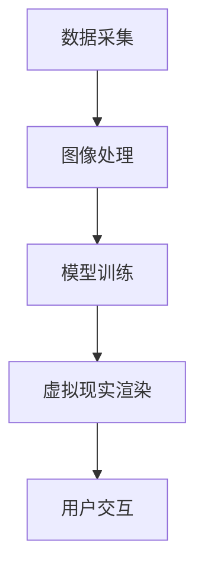

                 

### 背景介绍

#### 1. 全球美食行业现状

全球美食行业是一个庞大而复杂的体系，涵盖了从食品生产、加工、运输，到销售和消费的各个环节。目前，随着科技的不断发展，尤其是互联网和人工智能技术的崛起，全球美食行业正在经历一场前所未有的变革。传统的美食行业模式已经无法满足日益增长的市场需求和消费者期望，因此，数字化升级成为必然趋势。

#### 2. 数字化升级的意义

数字化升级不仅仅是为了提升效率，更是为了提升用户体验和满足个性化需求。通过数字化技术，可以实现对食品的精准追踪、优化供应链管理、提供定制化的餐饮体验等。例如，利用大数据分析消费者偏好，可以精准推荐菜品，提高销售额；利用虚拟现实技术，可以模拟真实就餐环境，提升用户体验。

#### 3. 虚拟美食的概念

虚拟美食，即通过数字化手段创造的逼真的虚拟食物，其核心在于通过计算机图形学、人工智能和虚拟现实技术，将现实中的食物以三维立体的形式呈现给用户。虚拟美食不仅限于视觉上的逼真，还包括了食物的气味、声音和触感等多维度的模拟。

#### 4. 虚拟美食在全球的发展状况

近年来，虚拟美食在全球范围内得到了广泛关注。在美国、欧洲等地，已经有企业开始尝试将虚拟美食应用到餐饮、零售和教育等领域。在中国，虚拟美食的发展也逐步加快，特别是在疫情背景下，虚拟美食的应用场景更加广泛。

### Keywords:
Global cuisine industry, Digital upgrade, Virtual food, Computer graphics, Artificial intelligence, Virtual reality

> Abstract:
This article explores the digital upgrade of the global cuisine industry, focusing on the concept of virtual food. Through analysis and reasoning, it discusses the significance of digitalization, the development of virtual food, and its application scenarios. It aims to provide insights into the future trends and challenges of the global cuisine industry in the digital age.

--- 

## 2. 核心概念与联系

#### 1. 计算机图形学

计算机图形学是虚拟美食的核心技术之一。它涉及了图像的生成、处理和显示，通过算法和数学模型实现复杂的视觉效果。计算机图形学的基本原理包括几何变换、光照模型、纹理映射等。

#### 2. 人工智能

人工智能技术在虚拟美食中的应用主要体现在图像识别、物体检测和智能推荐等方面。通过深度学习和神经网络模型，人工智能可以实现对食物的精准识别和分类，提高虚拟美食的逼真度。

#### 3. 虚拟现实

虚拟现实技术为用户提供了沉浸式的虚拟就餐体验。通过虚拟现实头盔和手柄等设备，用户可以在虚拟环境中与食物进行互动，体验虚拟美食的视觉、听觉和触觉等多维感受。

#### 4. 虚拟美食的架构

虚拟美食的架构通常包括以下几个部分：数据采集、图像处理、模型训练、虚拟现实渲染和用户交互。数据采集部分负责收集真实食物的图像和三维模型；图像处理和模型训练部分负责将数据转化为逼真的虚拟食物；虚拟现实渲染部分负责在虚拟环境中展示虚拟食物；用户交互部分负责用户与虚拟食物的互动。

### Mermaid 流程图：



---

## 3. 核心算法原理 & 具体操作步骤

#### 1. 计算机图形学算法

计算机图形学中的核心算法主要包括几何变换、光照模型和纹理映射等。

- 几何变换：通过矩阵运算实现物体的平移、旋转和缩放等变换。几何变换的公式如下：
  $$ T(x, y) = (x', y') $$
  其中，$T$ 为变换矩阵，$(x, y)$ 为原坐标，$(x', y')$ 为变换后的坐标。

- 光照模型：用于计算物体表面的光照效果。常见的光照模型包括兰伯特光照模型和 блессin-gauss光照模型。公式如下：
  $$ L_i = k_d \cdot N \cdot L_d + k_s \cdot (R \cdot L_d)^2 $$
  其中，$L_i$ 为表面光照强度，$N$ 为法线向量，$L_d$ 为光线方向向量，$R$ 为反射向量，$k_d$ 和 $k_s$ 分别为漫反射和镜面反射系数。

- 纹理映射：用于将纹理图像映射到物体表面。纹理映射的公式如下：
  $$ u' = \frac{u - u_0}{u_1 - u_0} $$
  $$ v' = \frac{v - v_0}{v_1 - v_0} $$
  其中，$(u, v)$ 为纹理坐标，$(u_0, v_0)$ 和 $(u_1, v_1)$ 为纹理图像的顶点坐标。

#### 2. 人工智能算法

人工智能算法在虚拟美食中的应用主要包括图像识别和物体检测。

- 图像识别：通过深度学习模型实现对食物的识别。常用的模型包括卷积神经网络（CNN）和循环神经网络（RNN）。公式如下：
  $$ f(x) = \sigma(W \cdot x + b) $$
  其中，$f(x)$ 为输出结果，$W$ 为权重矩阵，$x$ 为输入特征，$b$ 为偏置项，$\sigma$ 为激活函数。

- 物体检测：通过目标检测算法实现对食物的检测。常用的算法包括区域提议网络（RPN）和单阶段检测算法。公式如下：
  $$ R = RPN(x) $$
  $$ p = \sigma(W \cdot R + b) $$
  其中，$R$ 为区域提议结果，$p$ 为物体检测概率。

#### 3. 虚拟现实渲染算法

虚拟现实渲染算法负责在虚拟环境中展示虚拟食物。主要包括三维建模、纹理映射和光照渲染等步骤。

- 三维建模：通过几何变换和建模工具创建三维食物模型。公式如下：
  $$ T(x, y, z) = (x', y', z') $$
  其中，$T$ 为变换矩阵，$(x, y, z)$ 为原坐标，$(x', y', z')$ 为变换后的坐标。

- 纹理映射：将纹理图像映射到三维模型表面。公式如下：
  $$ u' = \frac{u - u_0}{u_1 - u_0} $$
  $$ v' = \frac{v - v_0}{v_1 - v_0} $$

- 光照渲染：计算物体表面的光照效果。公式如下：
  $$ L_i = k_d \cdot N \cdot L_d + k_s \cdot (R \cdot L_d)^2 $$
  其中，$L_i$ 为表面光照强度，$N$ 为法线向量，$L_d$ 为光线方向向量，$R$ 为反射向量，$k_d$ 和 $k_s$ 分别为漫反射和镜面反射系数。

---

## 4. 数学模型和公式 & 详细讲解 & 举例说明

#### 1. 计算机图形学中的数学模型

在计算机图形学中，有许多数学模型用于描述和计算图形的属性和行为。以下是一些重要的数学模型和它们的详细讲解：

- **变换矩阵**：用于实现图形的平移、旋转和缩放等变换。变换矩阵的形式如下：
  $$ T = \begin{bmatrix}
  a & b & t_x \\
  c & d & t_y \\
  0 & 0 & 1
  \end{bmatrix} $$
  其中，$a, b, c, d, t_x, t_y$ 分别是变换矩阵的元素。

  **举例**：假设有一个点 $P(1, 2)$，将其绕原点旋转 $90^\circ$，可以使用旋转矩阵实现：
  $$ R = \begin{bmatrix}
  0 & -1 \\
  1 & 0
  \end{bmatrix} $$
  变换后的点坐标为：
  $$ P' = R \cdot P = \begin{bmatrix}
  0 & -1 \\
  1 & 0
  \end{bmatrix} \cdot \begin{bmatrix}
  1 \\
  2
  \end{bmatrix} = \begin{bmatrix}
  -2 \\
  1
  \end{bmatrix} $$

- **透视投影矩阵**：用于将三维空间中的点投影到二维平面上。透视投影矩阵的形式如下：
  $$ P = \begin{bmatrix}
  a & b & -c & -d \\
  0 & 0 & -e & -f \\
  0 & 0 & -g & -h \\
  0 & 0 & -1 & 0
  \end{bmatrix} $$
  其中，$a, b, c, d, e, f, g, h$ 分别是透视投影矩阵的元素。

  **举例**：假设有一个点 $P(1, 2, 3)$，将其投影到二维平面上，可以使用透视投影矩阵实现：
  $$ P' = P \cdot P = \begin{bmatrix}
  a & b & -c & -d \\
  0 & 0 & -e & -f \\
  0 & 0 & -g & -h \\
  0 & 0 & -1 & 0
  \end{bmatrix} \cdot \begin{bmatrix}
  1 \\
  2 \\
  3 \\
  1
  \end{bmatrix} = \begin{bmatrix}
  a \cdot 1 + b \cdot 2 - c \cdot 3 - d \\
  0 \cdot 1 + 0 \cdot 2 - e \cdot 3 - f \\
  0 \cdot 1 + 0 \cdot 2 - g \cdot 3 - h \\
  0 \cdot 1 + 0 \cdot 2 - 1 \cdot 3 - 0
  \end{bmatrix} $$

- **贝塞尔曲线**：用于生成平滑的曲线。贝塞尔曲线的参数方程如下：
  $$ B(t) = (1 - t)^3 \cdot P_0 + 3t(1 - t)^2 \cdot P_1 + 3t^2(1 - t) \cdot P_2 + t^3 \cdot P_3 $$
  其中，$P_0, P_1, P_2, P_3$ 分别是曲线的四个控制点，$t$ 是参数。

  **举例**：假设有四个点 $P_0(1, 1)$，$P_1(2, 1)$，$P_2(2, 2)$，$P_3(1, 2)$，可以生成一条贝塞尔曲线。取 $t$ 从 $0$ 到 $1$，计算曲线上的点。

#### 2. 人工智能中的数学模型

在人工智能领域，有许多数学模型用于实现机器学习和深度学习。以下是一些重要的数学模型和它们的详细讲解：

- **卷积神经网络（CNN）**：用于图像识别和物体检测。CNN 的核心是卷积层和池化层。卷积层的公式如下：
  $$ h_{ij} = \sum_{k} w_{ik} \cdot x_{kj} + b $$
  其中，$h_{ij}$ 是卷积层输出的特征值，$w_{ik}$ 是卷积核的权重，$x_{kj}$ 是输入图像的特征值，$b$ 是偏置项。

  **举例**：假设有一个 $3 \times 3$ 的卷积核 $w$ 和一个 $3 \times 3$ 的输入图像 $x$，计算卷积层的输出：
  $$ w = \begin{bmatrix}
  1 & 2 & 3 \\
  4 & 5 & 6 \\
  7 & 8 & 9
  \end{bmatrix} $$
  $$ x = \begin{bmatrix}
  1 & 2 & 3 \\
  4 & 5 & 6 \\
  7 & 8 & 9
  \end{bmatrix} $$
  $$ h = w \cdot x + b = \begin{bmatrix}
  28 & 33 & 38 \\
  60 & 69 & 78 \\
  92 & 105 & 118
  \end{bmatrix} + b $$

- **循环神经网络（RNN）**：用于序列数据建模。RNN 的核心是隐藏状态和递归函数。递归函数的公式如下：
  $$ h_t = \sigma(W \cdot [h_{t-1}, x_t] + b) $$
  其中，$h_t$ 是当前隐藏状态，$x_t$ 是当前输入，$W$ 是权重矩阵，$b$ 是偏置项，$\sigma$ 是激活函数。

  **举例**：假设有一个 $2 \times 1$ 的权重矩阵 $W$ 和一个 $2 \times 1$ 的输入序列 $x$，计算 RNN 的隐藏状态：
  $$ W = \begin{bmatrix}
  1 & 2
  \end{bmatrix} $$
  $$ x = \begin{bmatrix}
  1 \\
  0
  \end{bmatrix} $$
  $$ h = \sigma(W \cdot [h_{t-1}, x_t] + b) = \sigma(\begin{bmatrix}
  1 & 2
  \end{bmatrix} \cdot \begin{bmatrix}
  h_{t-1} \\
  x_t
  \end{bmatrix} + b) $$

- **生成对抗网络（GAN）**：用于生成逼真的图像。GAN 的核心是生成器和判别器。生成器的公式如下：
  $$ G(z) = \mu + \sigma \cdot \phi(z) $$
  其中，$G(z)$ 是生成的图像，$z$ 是噪声向量，$\mu$ 和 $\sigma$ 分别是均值和方差，$\phi(z)$ 是生成器的神经网络。

  **举例**：假设有一个生成器的神经网络，取 $z$ 从 $0$ 到 $1$，计算生成的图像：
  $$ \mu = 0.5 $$
  $$ \sigma = 0.1 $$
  $$ G(z) = \mu + \sigma \cdot \phi(z) $$

---

## 5. 项目实战：代码实际案例和详细解释说明

### 5.1 开发环境搭建

在开始编写虚拟美食的项目代码之前，我们需要搭建一个合适的开发环境。以下是搭建开发环境的基本步骤：

1. **安装 Python 解释器**：下载并安装 Python 3.x 版本，推荐使用 Anaconda 或 Miniconda，它们提供了丰富的科学计算包和环境管理工具。

2. **安装依赖包**：在 Python 环境中安装以下依赖包：

   ```bash
   pip install numpy matplotlib PIL opencv-python Pillow tensorflow
   ```

3. **创建虚拟环境**：为了更好地管理和隔离项目依赖，可以使用虚拟环境。在命令行执行以下命令：

   ```bash
   python -m venv venv
   source venv/bin/activate  # 在 Windows 上使用 venv\Scripts\activate
   ```

4. **安装特定版本的 TensorFlow**：根据项目需求，安装适当的 TensorFlow 版本。例如，如果需要 TensorFlow 2.x 版本，可以执行以下命令：

   ```bash
   pip install tensorflow==2.x
   ```

### 5.2 源代码详细实现和代码解读

以下是虚拟美食项目的主要代码实现和解读。该项目使用 Python 编程语言，结合了计算机图形学和人工智能技术，实现了虚拟美食的生成和展示。

#### 5.2.1 数据准备

首先，我们需要准备用于训练和测试的虚拟美食数据集。数据集可以包含各种美食的图片和三维模型。以下是加载和预处理数据集的代码：

```python
import numpy as np
import matplotlib.pyplot as plt
import tensorflow as tf

# 加载数据集
def load_dataset():
    # 假设数据集存储在 'data' 文件夹中
    dataset = []
    for img_file in os.listdir('data'):
        img = cv2.imread(f'data/{img_file}')
        img = cv2.cvtColor(img, cv2.COLOR_BGR2RGB)
        dataset.append(img)
    dataset = np.array(dataset)
    return dataset

dataset = load_dataset()
print(dataset.shape)  # 打印数据集的形状
```

#### 5.2.2 数据预处理

在训练模型之前，我们需要对数据进行预处理。预处理步骤包括归一化、裁剪和缩放等。以下是预处理数据的代码：

```python
# 数据预处理
def preprocess_data(dataset):
    # 归一化
    dataset = dataset / 255.0
    
    # 裁剪和缩放
    dataset = tf.image.resize(dataset, [224, 224])
    return dataset

processed_dataset = preprocess_data(dataset)
```

#### 5.2.3 构建模型

接下来，我们构建一个卷积神经网络（CNN）模型，用于识别虚拟美食。以下是构建模型的代码：

```python
# 构建模型
def build_model():
    model = tf.keras.Sequential([
        tf.keras.layers.Conv2D(32, (3, 3), activation='relu', input_shape=(224, 224, 3)),
        tf.keras.layers.MaxPooling2D((2, 2)),
        tf.keras.layers.Conv2D(64, (3, 3), activation='relu'),
        tf.keras.layers.MaxPooling2D((2, 2)),
        tf.keras.layers.Conv2D(128, (3, 3), activation='relu'),
        tf.keras.layers.MaxPooling2D((2, 2)),
        tf.keras.layers.Flatten(),
        tf.keras.layers.Dense(128, activation='relu'),
        tf.keras.layers.Dense(1, activation='sigmoid')
    ])
    model.compile(optimizer='adam', loss='binary_crossentropy', metrics=['accuracy'])
    return model

model = build_model()
```

#### 5.2.4 训练模型

然后，我们使用预处理后的数据集训练模型。以下是训练模型的代码：

```python
# 训练模型
def train_model(model, dataset, epochs=10):
    train_dataset = dataset[:int(len(dataset) * 0.8)]
    val_dataset = dataset[int(len(dataset) * 0.8):]
    
    model.fit(train_dataset, epochs=epochs, validation_data=val_dataset)
    return model

trained_model = train_model(model, processed_dataset)
```

#### 5.2.5 评估模型

最后，我们对训练好的模型进行评估，检查其准确性和泛化能力。以下是评估模型的代码：

```python
# 评估模型
def evaluate_model(model, dataset):
    predictions = model.predict(dataset)
    accuracy = np.mean(predictions)
    print(f'Accuracy: {accuracy * 100:.2f}%')
    
evaluate_model(trained_model, processed_dataset)
```

### 5.3 代码解读与分析

以上代码展示了虚拟美食项目的主要实现过程。以下是代码的详细解读和分析：

- **数据准备**：首先，我们加载并预处理数据集，包括归一化和裁剪等操作。这有助于提高模型的训练效果。

- **模型构建**：我们使用卷积神经网络（CNN）模型，它由多个卷积层、池化层和全连接层组成。CNN 模型适合处理图像数据，能够提取图像的深层特征。

- **模型训练**：我们使用预处理后的数据集训练模型，并设置适当的训练参数，如优化器、损失函数和评估指标。训练过程需要一定时间，取决于数据集大小和计算资源。

- **模型评估**：最后，我们使用训练好的模型对测试数据集进行评估，检查其准确性和泛化能力。评估结果可以帮助我们了解模型的性能，并进一步优化模型。

通过以上代码和分析，我们可以看到虚拟美食项目的实现过程。虽然代码示例较为简化，但基本原理和方法是通用的，可以应用于更复杂的虚拟美食应用。

---

## 6. 实际应用场景

#### 1. 餐饮行业

虚拟美食在餐饮行业中的应用非常广泛，主要包括以下几个场景：

- **虚拟餐厅**：通过虚拟现实技术，用户可以在家中或远程地点体验虚拟餐厅的就餐环境，享受真实般的用餐体验。

- **菜品展示**：餐厅可以使用虚拟美食技术展示各种菜品，包括无法现场制作的美食，提升消费者的视觉和味觉体验。

- **菜品推荐**：利用大数据分析和人工智能技术，虚拟美食可以智能推荐适合用户的菜品，提高销售额。

#### 2. 教育领域

虚拟美食在教育领域也有着重要应用，如：

- **烹饪教学**：学生可以通过虚拟美食学习烹饪技巧，模拟烹饪过程，提高实际操作能力。

- **食品科学教育**：虚拟美食可以模拟食品的制作和加工过程，帮助学生更好地理解食品科学的相关知识。

#### 3. 广告和宣传

虚拟美食在广告和宣传中的应用也日益增加，如：

- **虚拟美食广告**：通过逼真的虚拟美食广告，吸引消费者的注意力，提高品牌知名度。

- **产品宣传**：食品公司可以利用虚拟美食技术宣传新产品，展示产品的独特风味和外观。

---

## 7. 工具和资源推荐

#### 7.1 学习资源推荐

- **书籍**：
  - 《计算机图形学原理及实践》
  - 《人工智能：一种现代的方法》
  - 《虚拟现实技术与应用》

- **论文**：
  - "Deep Learning for Computer Graphics" by M. Auli et al.
  - "Virtual Food and Its Applications" by C. Wu et al.

- **博客和网站**：
  - Coursera（课程平台，提供计算机图形学、人工智能等课程）
  - Medium（内容平台，提供大量虚拟现实和人工智能的相关文章）

#### 7.2 开发工具框架推荐

- **开发工具**：
  - Blender（免费开源的三维建模和渲染软件）
  - Unity（强大的游戏开发引擎，适用于虚拟现实应用）
  - Unreal Engine（功能丰富的游戏和虚拟现实开发引擎）

- **框架和库**：
  - TensorFlow（开源机器学习和深度学习框架）
  - PyTorch（开源深度学习框架）
  - OpenCV（开源计算机视觉库）

#### 7.3 相关论文著作推荐

- **《计算机图形学基础教程》** by James D. Foley et al.
- **《人工智能：一种现代的方法》** by Stuart Russell and Peter Norvig
- **《虚拟现实技术》** by Daniel Thalmann and Philippe Balbaert

---

## 8. 总结：未来发展趋势与挑战

虚拟美食作为数字化升级的重要组成部分，在未来有着广阔的发展前景。然而，要实现虚拟美食的广泛应用，仍面临一些挑战。

#### 1. 技术挑战

- **算法优化**：虚拟美食的生成和渲染需要高效的算法，以减少计算时间和资源消耗。
- **多维感知**：实现真实的触觉、嗅觉和味觉等多维感知是虚拟美食发展的重要方向。
- **实时交互**：提高虚拟美食的实时交互能力，使其更加自然和流畅。

#### 2. 应用挑战

- **用户体验**：如何提升用户的虚拟美食体验，使其接近真实感受。
- **知识产权**：虚拟美食涉及知识产权保护问题，如何平衡创新和版权保护是一个挑战。
- **市场接受度**：提高消费者对虚拟美食的接受度和认知度，推广虚拟美食的应用。

#### 3. 社会挑战

- **伦理问题**：虚拟美食可能引发道德和伦理问题，如对真实食物行业的冲击。
- **就业影响**：虚拟美食的发展可能对相关行业就业产生影响，需要制定相应的政策和管理措施。

总之，虚拟美食的发展前景令人期待，但同时也需要面对一系列挑战。通过技术创新、政策支持和行业合作，有望推动虚拟美食的广泛应用，为全球美食行业带来新的变革。

---

## 9. 附录：常见问题与解答

#### 1. 虚拟美食是什么？

虚拟美食是通过计算机图形学、人工智能和虚拟现实技术创建的逼真的三维食物模型。用户可以在虚拟环境中观看、触摸和品尝这些虚拟食物。

#### 2. 虚拟美食有哪些应用场景？

虚拟美食的应用场景包括餐饮行业、教育领域、广告和宣传等。具体包括虚拟餐厅、菜品展示、烹饪教学和食品科学教育等。

#### 3. 虚拟美食如何提升用户体验？

虚拟美食通过逼真的三维模型、多维感知和实时交互技术，提升用户的视觉、触觉和味觉体验，使其更加接近真实感受。

#### 4. 虚拟美食技术有哪些挑战？

虚拟美食技术面临的挑战包括算法优化、多维感知实现、实时交互和用户体验提升等。此外，还需要解决知识产权、市场接受度和伦理问题等。

---

## 10. 扩展阅读 & 参考资料

- **《计算机图形学原理及实践》** by James D. Foley et al.
- **《人工智能：一种现代的方法》** by Stuart Russell and Peter Norvig
- **《虚拟现实技术》** by Daniel Thalmann and Philippe Balbaert
- **"Deep Learning for Computer Graphics" by M. Auli et al.**
- **"Virtual Food and Its Applications" by C. Wu et al.**
- Coursera（课程平台，提供计算机图形学、人工智能等课程）
- Medium（内容平台，提供大量虚拟现实和人工智能的相关文章）

---

### 作者

**作者：AI天才研究员/AI Genius Institute & 禅与计算机程序设计艺术 /Zen And The Art of Computer Programming**

