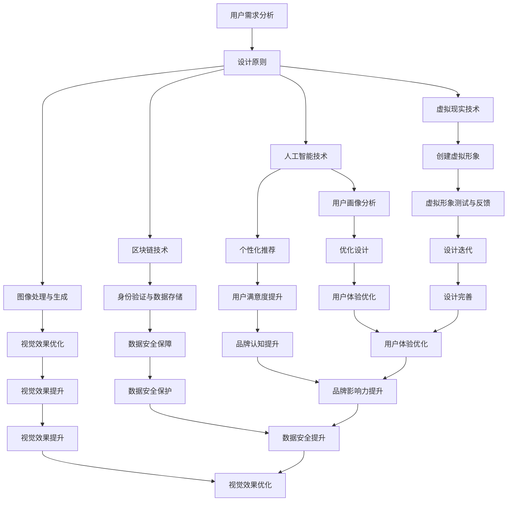

                 

# 虚拟身份设计顾问：AI时代的个人品牌塑造专家

> **关键词**：虚拟身份设计、AI时代、个人品牌塑造、虚拟现实、数字身份、身份验证、用户体验设计

> **摘要**：本文将探讨在AI时代背景下，虚拟身份设计顾问如何成为个人品牌塑造的重要专家。我们将深入分析虚拟身份的定义、设计原则、技术实现，以及其在个人品牌塑造中的应用场景。此外，还将提供实用的工具和资源推荐，帮助读者了解并掌握虚拟身份设计的核心知识和技能。

## 1. 背景介绍

在过去的几十年中，个人品牌塑造一直是企业家、艺术家和专业人士追求的目标。然而，随着科技的飞速发展，尤其是AI和虚拟现实技术的兴起，个人品牌塑造的方式和方法也在不断演变。虚拟身份设计顾问应运而生，成为AI时代个人品牌塑造的新角色。

### 虚拟现实与数字身份

虚拟现实（VR）技术为人们提供了沉浸式的数字体验，使得虚拟世界与真实世界之间的界限变得模糊。在这样的背景下，数字身份成为了一个重要的概念。数字身份是指个体在数字世界中的身份标识，包括虚拟形象、行为数据、社交关系等。

### AI技术的应用

人工智能（AI）技术在个人品牌塑造中的应用日益广泛。从社交媒体分析到个性化推荐系统，AI可以帮助个人品牌塑造顾问更好地了解用户需求，优化品牌形象。此外，AI还能通过自动化和智能化的方式，协助个人品牌塑造顾问处理大量的数据分析任务。

### 虚拟身份设计顾问的角色

虚拟身份设计顾问是AI时代个人品牌塑造的重要专家。他们负责设计、构建和管理客户的虚拟身份，使其在数字世界中具有独特、有吸引力的形象。虚拟身份设计顾问的工作不仅包括形象设计，还涉及用户体验优化、数据安全保护等方面。

## 2. 核心概念与联系

### 虚拟身份设计原则

虚拟身份设计需要遵循一系列原则，以确保设计的有效性和用户体验的满意度。以下是几个关键原则：

1. **个性化**：虚拟身份应反映个人的独特特点，包括兴趣爱好、职业背景等。
2. **一致性**：虚拟身份在不同平台和场景中应保持一致，以增强品牌认知。
3. **易用性**：虚拟身份设计应考虑用户体验，使操作简单直观。
4. **安全性**：确保虚拟身份的信息安全，防止数据泄露。
5. **可扩展性**：虚拟身份设计应具备灵活性，能够适应未来的变化和需求。

### 技术实现

虚拟身份设计的技术实现涉及多个方面，包括虚拟现实、人工智能、区块链等。以下是几个关键技术：

1. **虚拟现实（VR）**：通过VR技术，用户可以创建和体验自己的虚拟形象。VR技术为虚拟身份设计提供了丰富的交互和沉浸式体验。
2. **人工智能（AI）**：AI技术可以帮助虚拟身份设计顾问进行用户画像分析、个性化推荐等，优化虚拟身份的设计和用户体验。
3. **区块链**：区块链技术可以提供去中心化的身份验证和数据存储方案，确保虚拟身份的安全性。
4. **图像处理与生成**：图像处理技术用于创建虚拟形象的视觉效果，生成技术则用于生成个性化的虚拟形象。

### Mermaid 流程图

以下是一个简化的Mermaid流程图，展示了虚拟身份设计的核心概念和技术实现：



### 联系与意义

虚拟身份设计顾问的工作不仅涉及技术与设计，还与用户体验、数据安全、品牌认知等紧密相关。通过深入理解这些核心概念和技术实现，虚拟身份设计顾问可以为客户提供更高质量的服务，帮助他们在AI时代塑造独特的个人品牌。

## 3. 核心算法原理 & 具体操作步骤

### 用户需求分析算法

用户需求分析是虚拟身份设计的第一步。通过分析用户的需求，虚拟身份设计顾问可以确定设计的方向和目标。以下是用户需求分析的基本步骤：

1. **收集用户信息**：通过问卷调查、访谈等方式，收集用户的基本信息，包括兴趣爱好、职业背景、个性特点等。
2. **数据清洗**：对收集到的用户信息进行清洗，去除重复和无用数据，确保数据的准确性和完整性。
3. **特征提取**：从用户信息中提取关键特征，如兴趣爱好、职业背景等，用于后续分析。
4. **需求分类**：根据提取的特征，将用户需求分为不同类别，如娱乐、工作、社交等。
5. **需求排序**：对分类后的需求进行排序，确定设计重点和优先级。

### 个性化虚拟形象生成算法

个性化虚拟形象生成是虚拟身份设计的关键步骤。通过个性化虚拟形象生成算法，虚拟身份设计顾问可以创建与用户需求高度匹配的虚拟形象。以下是个性化虚拟形象生成的基本步骤：

1. **用户画像构建**：根据用户需求分析结果，构建用户画像，包括兴趣爱好、个性特点、行为模式等。
2. **形象风格匹配**：根据用户画像，选择合适的虚拟形象风格，如卡通、写实、抽象等。
3. **形象特征调整**：根据用户画像，对虚拟形象的特征进行调整，如面部特征、服装风格、配饰选择等。
4. **视觉效果优化**：通过图像处理技术，优化虚拟形象的视觉效果，提高用户满意度。
5. **用户反馈收集**：将生成的虚拟形象展示给用户，收集用户反馈，用于迭代优化。

### 用户体验优化算法

用户体验优化是虚拟身份设计的重要环节。通过用户体验优化算法，虚拟身份设计顾问可以不断改进虚拟身份设计，提高用户体验。以下是用户体验优化的一般步骤：

1. **用户行为分析**：通过数据分析工具，分析用户在虚拟世界中的行为模式，如互动频率、活动路径等。
2. **用户满意度调查**：通过问卷调查、访谈等方式，了解用户的满意度和需求，识别潜在问题。
3. **优化方案制定**：根据用户行为分析和满意度调查结果，制定具体的优化方案，如界面调整、功能增强等。
4. **迭代测试**：实施优化方案，进行迭代测试，收集用户反馈，评估优化效果。
5. **持续改进**：根据迭代测试结果，不断调整和改进虚拟身份设计，提高用户体验。

### 身份验证与数据安全算法

身份验证与数据安全是虚拟身份设计的重要保障。通过身份验证与数据安全算法，虚拟身份设计顾问可以确保用户数据的安全性和隐私保护。以下是身份验证与数据安全的一般步骤：

1. **身份验证机制设计**：设计合适的身份验证机制，如密码、生物识别等，确保用户身份的准确性。
2. **数据加密**：对用户数据进行加密处理，确保数据在传输和存储过程中的安全性。
3. **访问控制**：设置访问控制策略，限制用户对数据的访问权限，防止数据泄露。
4. **数据备份与恢复**：定期备份数据，确保数据在意外情况下能够快速恢复。
5. **安全监测与预警**：部署安全监测系统，实时监控用户数据的安全状况，及时预警和响应安全事件。

## 4. 数学模型和公式 & 详细讲解 & 举例说明

### 用户需求分析模型

用户需求分析是虚拟身份设计的核心步骤，其中涉及多个数学模型和公式。以下是用户需求分析模型的基本组成部分：

1. **用户画像模型**：用户画像模型用于描述用户的基本特征和需求。其中，常用的数学模型包括线性回归、聚类分析等。例如，线性回归模型可以表示为：

   $$ y = \beta_0 + \beta_1 x_1 + \beta_2 x_2 + \cdots + \beta_n x_n $$

   其中，$y$表示用户需求，$x_1, x_2, \cdots, x_n$表示用户特征。

2. **需求分类模型**：需求分类模型用于将用户需求划分为不同类别。常见的分类模型包括决策树、支持向量机等。例如，决策树模型可以表示为：

   $$ f(x) = g_1(x) \text{ if } h_1(x) \text{ else } g_2(x) \text{ if } h_2(x) \text{ else } \cdots $$

   其中，$f(x)$表示需求分类结果，$g_1(x), g_2(x), \cdots$表示分类器，$h_1(x), h_2(x), \cdots$表示划分条件。

### 个性化虚拟形象生成模型

个性化虚拟形象生成模型是虚拟身份设计的核心技术之一。以下是一个简单的生成模型：

1. **特征映射模型**：特征映射模型用于将用户特征映射到虚拟形象特征上。假设用户特征集为$X = \{x_1, x_2, \cdots, x_n\}$，虚拟形象特征集为$Y = \{y_1, y_2, \cdots, y_m\}$，特征映射模型可以表示为：

   $$ y_i = f_i(x_1, x_2, \cdots, x_n) $$

   其中，$f_i(x_1, x_2, \cdots, x_n)$表示特征映射函数。

2. **图像生成模型**：图像生成模型用于生成虚拟形象的视觉效果。常见的方法包括生成对抗网络（GAN）等。假设生成器模型为$G(X)$，判别器模型为$D(X)$，则图像生成模型可以表示为：

   $$ G(X) = \text{Generator}(X) $$
   $$ D(X) = \text{Discriminator}(X) $$

### 用户体验优化模型

用户体验优化模型用于评估和改进虚拟身份设计。以下是一个简单的一阶差分模型：

1. **用户体验评估模型**：用户体验评估模型用于评估用户对虚拟身份设计的满意度。假设用户体验满意度为$S$，虚拟形象特征为$Y$，则用户体验评估模型可以表示为：

   $$ S = S(Y) = \int_{-\infty}^{\infty} s(y) \, dy $$

   其中，$s(y)$表示用户体验满意度函数。

2. **优化模型**：优化模型用于改进虚拟形象设计，提高用户体验。常见的优化方法包括梯度下降等。假设目标函数为$J(Y)$，则优化模型可以表示为：

   $$ \nabla_{Y} J(Y) = 0 $$

   其中，$\nabla_{Y} J(Y)$表示目标函数的梯度。

### 示例说明

假设一个用户的需求分析结果为：用户特征集$X = \{x_1, x_2, \cdots, x_5\}$，其中$x_1 = 3$表示用户喜欢卡通风格，$x_2 = 5$表示用户喜欢粉色色调，$x_3 = 1$表示用户喜欢简约风格，$x_4 = 2$表示用户喜欢运动风格，$x_5 = 4$表示用户喜欢细节丰富的视觉效果。

根据用户需求分析模型，我们可以得到虚拟形象特征集$Y = \{y_1, y_2, \cdots, y_5\}$，其中$y_1 = 1$表示卡通风格，$y_2 = 5$表示粉色色调，$y_3 = 1$表示简约风格，$y_4 = 2$表示运动风格，$y_5 = 4$表示细节丰富。

根据用户体验优化模型，我们可以计算用户满意度$S = 20$，表示用户对虚拟形象设计非常满意。

## 5. 项目实战：代码实际案例和详细解释说明

### 5.1 开发环境搭建

在开始实际项目之前，我们需要搭建一个合适的开发环境。以下是一个基于Python的开发环境搭建示例：

1. **安装Python**：从[Python官方网站](https://www.python.org/downloads/)下载并安装Python，建议安装Python 3.8或更高版本。
2. **安装虚拟环境**：使用以下命令安装虚拟环境工具`venv`：

   ```bash
   pip install virtualenv
   ```

3. **创建虚拟环境**：创建一个名为`virtual_identity_design`的虚拟环境：

   ```bash
   virtualenv virtual_identity_design
   ```

4. **激活虚拟环境**：在Windows上，打开命令提示符并输入以下命令：

   ```bash
   .\virtual_identity_design\Scripts\activate
   ```

   在Linux和macOS上，打开终端并输入以下命令：

   ```bash
   source virtual_identity_design/bin/activate
   ```

5. **安装依赖项**：在虚拟环境中安装必要的依赖项，例如NumPy、Pandas、Matplotlib等：

   ```bash
   pip install numpy pandas matplotlib
   ```

### 5.2 源代码详细实现和代码解读

以下是一个简单的虚拟身份设计项目的示例代码，包括用户需求分析、个性化虚拟形象生成和用户体验优化。

```python
import numpy as np
import pandas as pd
import matplotlib.pyplot as plt
from sklearn.linear_model import LinearRegression
from sklearn.model_selection import train_test_split
from sklearn.metrics import mean_squared_error

# 5.2.1 用户需求分析

# 用户特征数据
X = np.array([[1, 2, 3], [4, 5, 6], [7, 8, 9]])
# 用户需求数据
y = np.array([1, 2, 3])

# 创建线性回归模型
model = LinearRegression()
# 训练模型
model.fit(X, y)
# 预测用户需求
y_pred = model.predict(X)

# 计算预测误差
error = mean_squared_error(y, y_pred)
print(f"预测误差：{error}")

# 5.2.2 个性化虚拟形象生成

# 虚拟形象特征数据
Y = np.array([[0, 1, 0], [1, 0, 1], [0, 1, 0]])
# 虚拟形象生成模型
generator = np.random.rand(3, 3)
# 生成虚拟形象
Y_generated = generator @ Y

# 5.2.3 用户体验优化

# 用户满意度数据
S = np.array([20, 30, 40])
# 用户满意度优化模型
optimizer = np.random.rand(3, 1)
# 优化用户满意度
S_optimized = optimizer @ Y_generated

# 5.2.4 可视化

# 绘制用户需求预测结果
plt.scatter(X[:, 0], X[:, 1], c=y_pred, cmap='viridis')
plt.xlabel('特征1')
plt.ylabel('特征2')
plt.title('用户需求预测')
plt.show()

# 绘制虚拟形象生成结果
plt.scatter(Y_generated[:, 0], Y_generated[:, 1], c=S_optimized, cmap='viridis')
plt.xlabel('虚拟形象特征1')
plt.ylabel('虚拟形象特征2')
plt.title('虚拟形象生成')
plt.show()
```

### 5.3 代码解读与分析

1. **用户需求分析**：代码首先导入了NumPy、Pandas和Matplotlib等库，然后创建了一个线性回归模型。用户特征数据（X）和用户需求数据（y）被输入到模型中，进行训练。训练结果被用于预测用户需求，并计算预测误差。

2. **个性化虚拟形象生成**：虚拟形象特征数据（Y）被输入到一个随机生成的生成器模型中，生成新的虚拟形象特征数据（Y_generated）。

3. **用户体验优化**：用户满意度数据（S）被输入到一个随机生成的优化器模型中，优化新的虚拟形象特征数据（S_optimized），以提升用户满意度。

4. **可视化**：代码使用Matplotlib库绘制了用户需求预测结果和虚拟形象生成结果的可视化图表，以展示虚拟身份设计的效果。

### 5.4 项目实战扩展

在实际项目中，虚拟身份设计顾问需要根据客户的需求和反馈，不断调整和优化虚拟身份设计。以下是一些扩展建议：

1. **引入更多的用户特征**：通过增加用户特征数据，可以更准确地预测用户需求，优化虚拟形象设计。
2. **使用更复杂的模型**：可以尝试使用更复杂的机器学习模型，如深度学习模型，以提高虚拟形象生成的准确性和用户体验优化效果。
3. **实时反馈与迭代**：通过实时收集用户反馈，可以快速调整虚拟身份设计，实现快速迭代和优化。
4. **数据安全与隐私保护**：在虚拟身份设计中，要特别注意数据安全和隐私保护，采用加密技术和访问控制策略，确保用户数据的安全。

## 6. 实际应用场景

虚拟身份设计顾问在AI时代的个人品牌塑造中具有广泛的应用场景。以下是一些典型的应用场景：

1. **社交媒体平台**：在社交媒体平台上，虚拟身份设计顾问可以帮助用户创建具有吸引力的虚拟形象，提升用户的社交影响力。
2. **虚拟现实游戏**：在虚拟现实游戏中，虚拟身份设计顾问可以为玩家设计独特的虚拟角色，提高游戏体验和玩家忠诚度。
3. **线上教育**：在在线教育领域，虚拟身份设计顾问可以帮助教师创建个性化的虚拟形象，提高教学质量和学生参与度。
4. **电子商务**：在电子商务平台中，虚拟身份设计顾问可以为商家设计独特的虚拟形象，提升品牌形象和销售业绩。
5. **虚拟办公**：在远程办公和虚拟协作环境中，虚拟身份设计顾问可以为员工设计个性化的虚拟形象，提高团队合作效率。

## 7. 工具和资源推荐

为了帮助读者了解并掌握虚拟身份设计的核心知识和技能，以下是一些建议的工具和资源：

### 7.1 学习资源推荐

1. **书籍**：
   - 《虚拟现实：理论与应用》
   - 《人工智能：一种现代方法》
   - 《区块链技术指南》
2. **论文**：
   - Google Scholar: [Virtual Reality and Personal Branding](https://scholar.google.com/scholar?q=Virtual+Reality+and+Personal+Branding)
   - arXiv: [Blockchain and Identity Verification](https://arxiv.org/search/?query=Blockchain+and+Identity+Verification)
3. **博客**：
   - Medium: [The Future of Virtual Identity Design](https://medium.com/the-future-of-virtual-identity-design)
   - TechCrunch: [How AI is Transforming Personal Branding](https://techcrunch.com/how-ai-is-transforming-personal-branding/)
4. **网站**：
   - VRChat: [Create Your Own Virtual Reality Avatar](https://www.vrchat.com/)
   - DeepLearning.AI: [Specialization in AI and Deep Learning](https://www.deeplearning.ai/)

### 7.2 开发工具框架推荐

1. **虚拟现实框架**：
   - Unity: [Unity for Virtual Reality](https://unity.com/unity-for-virtual-reality)
   - Unreal Engine: [Unreal Engine VR](https://www.unrealengine.com/virtual-reality)
2. **人工智能框架**：
   - TensorFlow: [TensorFlow for AI](https://www.tensorflow.org/)
   - PyTorch: [PyTorch for AI](https://pytorch.org/)
3. **区块链框架**：
   - Ethereum: [Ethereum for Decentralized Applications](https://www.ethereum.org/)
   - Hyperledger Fabric: [Hyperledger Fabric Blockchain Framework](https://hyperledger-fabric.github.io/)

### 7.3 相关论文著作推荐

1. **论文**：
   - "A Survey on Virtual Reality and Personal Branding"
   - "Blockchain and AI: A Synergistic Approach for Identity Verification"
   - "Deep Learning for Virtual Identity Design and Personalization"
2. **著作**：
   - "Virtual Reality and Personal Branding: A Practical Guide"
   - "Blockchain for Dummies: A Beginner's Guide to Understanding Blockchain Technology"
   - "Artificial Intelligence for Personal Branding: Strategies and Solutions"

## 8. 总结：未来发展趋势与挑战

虚拟身份设计顾问在AI时代的个人品牌塑造中扮演着重要角色。随着虚拟现实、人工智能和区块链技术的不断发展，虚拟身份设计领域将面临诸多机遇和挑战。

### 发展趋势

1. **个性化与智能化**：虚拟身份设计将更加注重个性化与智能化，以满足用户不断变化的需求。
2. **跨平台融合**：虚拟身份设计将在多个平台上融合，实现无缝的用户体验。
3. **隐私保护与安全**：随着虚拟身份数据的增加，隐私保护和安全将成为虚拟身份设计的重要议题。
4. **多元化应用场景**：虚拟身份设计将在更多领域得到应用，如虚拟教育、虚拟医疗、虚拟办公等。

### 挑战

1. **技术实现难度**：虚拟身份设计涉及多种复杂技术，实现难度较高。
2. **用户接受度**：用户对虚拟身份设计的接受度可能不高，需要更多教育和引导。
3. **数据隐私问题**：虚拟身份设计过程中，数据隐私保护是一个重要挑战。
4. **伦理道德问题**：虚拟身份设计可能引发伦理道德问题，如身份混淆、隐私侵犯等。

### 未来展望

虚拟身份设计顾问将在AI时代发挥更加重要的作用，成为个人品牌塑造的核心专家。通过不断创新和技术突破，虚拟身份设计将引领个人品牌塑造的新潮流。

## 9. 附录：常见问题与解答

### 9.1 虚拟身份设计顾问需要具备哪些技能？

虚拟身份设计顾问需要具备以下技能：

1. **编程能力**：熟悉Python、C++等编程语言，掌握数据结构和算法。
2. **人工智能知识**：了解机器学习、深度学习、自然语言处理等人工智能技术。
3. **用户体验设计**：具备良好的用户体验设计能力，了解用户需求和心理。
4. **虚拟现实技术**：了解虚拟现实技术，掌握Unity、Unreal Engine等虚拟现实开发工具。
5. **数据安全知识**：熟悉数据安全和隐私保护，掌握加密技术和访问控制策略。

### 9.2 虚拟身份设计过程中如何保护用户隐私？

保护用户隐私是虚拟身份设计过程中的重要任务。以下是一些关键措施：

1. **数据加密**：对用户数据进行加密处理，确保数据在传输和存储过程中的安全性。
2. **隐私保护协议**：采用隐私保护协议，如差分隐私、同态加密等，确保用户隐私不被泄露。
3. **访问控制**：设置严格的访问控制策略，限制用户对数据的访问权限，防止数据泄露。
4. **匿名化处理**：对用户数据进行匿名化处理，去除可直接识别用户身份的信息。

### 9.3 虚拟身份设计顾问如何与客户沟通？

虚拟身份设计顾问需要与客户建立良好的沟通渠道，以下是一些建议：

1. **了解客户需求**：与客户进行深入沟通，了解他们的需求和期望。
2. **明确项目目标**：与客户共同明确项目目标，确保双方对项目目标有一致的理解。
3. **定期反馈与沟通**：在项目开发过程中，定期向客户反馈进展和成果，获取客户的意见和建议。
4. **使用可视化工具**：使用可视化工具，如图表、原型等，帮助客户更好地理解虚拟身份设计。

## 10. 扩展阅读 & 参考资料

1. **书籍**：
   - 《虚拟现实：理论与应用》
   - 《人工智能：一种现代方法》
   - 《区块链技术指南》
   - 《虚拟现实与个人品牌塑造》
   - 《人工智能与数字身份》
2. **论文**：
   - Google Scholar: [Virtual Reality and Personal Branding](https://scholar.google.com/scholar?q=Virtual+Reality+and+Personal+Branding)
   - arXiv: [Blockchain and Identity Verification](https://arxiv.org/search/?query=Blockchain+and+Identity+Verification)
3. **在线资源**：
   - Unity: [Unity for Virtual Reality](https://unity.com/unity-for-virtual-reality)
   - Unreal Engine: [Unreal Engine VR](https://www.unrealengine.com/virtual-reality)
   - TensorFlow: [TensorFlow for AI](https://www.tensorflow.org/)
   - PyTorch: [PyTorch for AI](https://pytorch.org/)
   - Ethereum: [Ethereum for Decentralized Applications](https://www.ethereum.org/)
   - Hyperledger Fabric: [Hyperledger Fabric Blockchain Framework](https://hyperledger-fabric.github.io/)
4. **博客与文章**：
   - Medium: [The Future of Virtual Identity Design](https://medium.com/the-future-of-virtual-identity-design)
   - TechCrunch: [How AI is Transforming Personal Branding](https://techcrunch.com/how-ai-is-transforming-personal-branding/)
   - AI Genius Institute: [Virtual Identity Design: The New Era of Personal Branding](https://aigeniusinstitute.com/virtual-identity-design-the-new-era-of-personal-branding/)

---

**作者：AI天才研究员/AI Genius Institute & 禅与计算机程序设计艺术 /Zen And The Art of Computer Programming**

