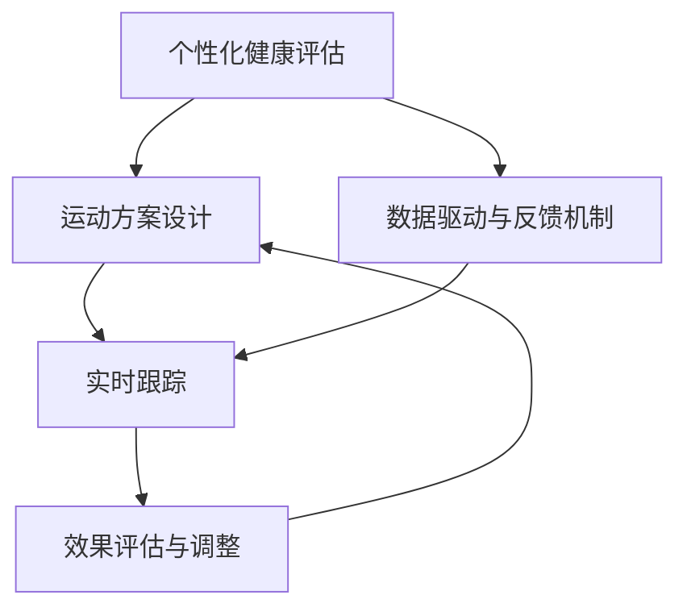
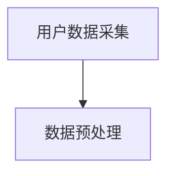
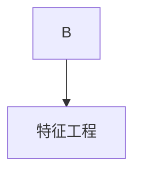
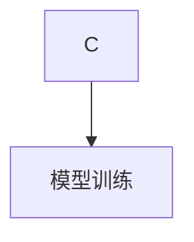
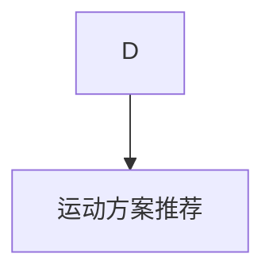
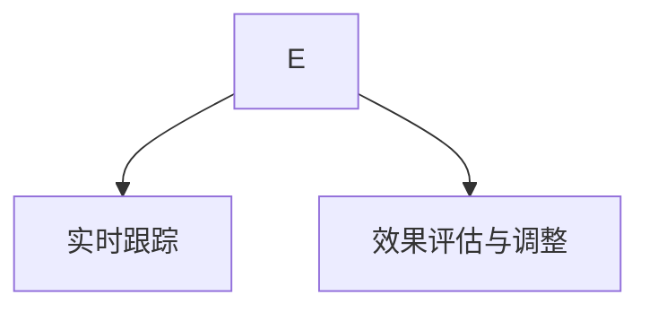

                 

### 背景介绍

虚拟运动处方（Virtual Exercise Prescription）这一概念起源于对现代生活方式中运动不足与健康问题的关注。随着全球城市化进程的加快，人们的生活方式发生了巨大变化，工作压力、生活节奏加快以及电子设备的普及，使得越来越多的人处于久坐不动或运动不足的状态。这不仅导致了肥胖、高血压、心血管疾病等慢性病的高发，也对心理健康产生了负面影响。

全球健康问题日益严重，促使科学家、医生和健康专家开始寻找有效的解决方案。虚拟运动处方的出现，为这一挑战提供了一种创新的解决方案。它结合了现代科技和医学知识，通过个性化的运动方案，帮助用户在日常生活中实现健康生活方式的转型。

虚拟运动处方的发展历程可以追溯到20世纪末。那时，计算机技术和生物力学的研究为虚拟现实技术在健康领域的应用提供了技术基础。随后，随着人工智能和大数据分析技术的发展，虚拟运动处方逐渐走向成熟，能够通过数据驱动的方式，为每个用户提供量身定制的运动方案。

### 虚拟运动处方的定义与核心概念

虚拟运动处方是一种基于个体生理、心理特征及生活习惯的个性化健康指导方案。它不仅包括具体的运动类型、时间和强度，还涵盖了饮食、睡眠等生活习惯的调整建议。虚拟运动处方的核心概念可以概括为以下几点：

1. **个性化：** 虚拟运动处方通过收集和分析用户的生物数据（如心率、血压、体脂率等）和生活方式数据（如工作、生活习惯等），生成符合用户特点的运动方案。这种个性化的设计能够有效提高运动的针对性和效果。

2. **数据驱动：** 虚拟运动处方依赖于大数据分析和人工智能技术，通过不断收集和更新用户数据，优化运动方案。这种数据驱动的特点使得运动处方能够动态调整，以适应用户不断变化的需求和身体状况。

3. **全程跟踪与反馈：** 虚拟运动处方能够实时跟踪用户的运动情况，并通过智能设备（如智能手表、运动手环等）收集运动数据。这些数据将被用于评估运动效果，并提供反馈，帮助用户调整运动计划。

4. **多学科融合：** 虚拟运动处方融合了医学、生物学、计算机科学、运动科学等多个学科的知识，形成了一套科学、系统的运动指导方案。

### 全球健康生活方式的个性化指导

在全球范围内，健康生活方式的个性化指导已成为应对健康问题的重要手段。不同国家和地区在面对健康问题时有着各自的挑战和需求。例如，在发达国家，慢性病和心理健康问题是主要的健康挑战；而在发展中国家，营养不足和运动不足则更为普遍。

虚拟运动处方通过个性化指导，能够为不同地区和不同人群提供针对性的健康解决方案。以下是几个典型应用场景：

1. **慢性病患者管理：** 对于高血压、糖尿病等慢性病患者，虚拟运动处方可以通过个性化的运动方案，帮助他们控制病情，减少药物依赖，提高生活质量。

2. **心理健康支持：** 心理健康问题如焦虑、抑郁等，常常与生活方式密切相关。虚拟运动处方通过结合心理学的知识和方法，为用户提供情绪调节和支持。

3. **公共健康宣传：** 在公共健康领域，虚拟运动处方可以通过在线平台、移动应用等方式，向大众传播健康知识，提高人们的健康意识和行为。

4. **工作与生活平衡：** 对于工作繁忙的人群，虚拟运动处方可以提供灵活的锻炼方案，帮助他们充分利用碎片时间进行锻炼，实现工作与生活的平衡。

总之，虚拟运动处方作为一种创新的健康指导方式，正在全球范围内得到广泛的应用和推广。它不仅有助于解决现代生活中的健康问题，也为未来的健康生活方式提供了新的可能。

---

## 2. 核心概念与联系

在探讨虚拟运动处方时，理解其核心概念和相互联系至关重要。以下是几个关键概念及其在系统中的相互关系：

### 2.1 个性化健康评估

个性化健康评估是虚拟运动处方的基础。它涉及收集和分析用户的生理数据（如体重、身高、心率、血压等）和生活方式数据（如饮食、睡眠习惯、工作模式等）。通过大数据分析和人工智能技术，系统能够为每位用户生成一个详细的健康档案，从而提供个性化的健康建议。

#### 2.1.1 数据来源

- **穿戴设备：** 智能手表、运动手环等穿戴设备能够实时监测用户的心率、步数、睡眠质量等数据。
- **健康问卷：** 通过在线问卷或应用程序，用户可以提供个人的健康信息和生活习惯。
- **医疗记录：** 用户可以从医疗机构获取包括体检报告、病历等在内的医疗记录。

#### 2.1.2 数据分析

- **生物统计模型：** 利用统计学方法分析用户数据，识别健康风险和潜在的健康问题。
- **机器学习算法：** 应用机器学习算法，从大规模数据集中提取模式和趋势，为用户提供精准的健康评估和预测。

### 2.2 运动方案设计

运动方案设计是基于个性化健康评估结果，结合用户的健康状况、体能水平和健康目标制定的。该过程包括以下步骤：

#### 2.2.1 运动类型选择

- **有氧运动：** 如跑步、游泳、骑自行车等，有助于提高心肺功能。
- **力量训练：** 如举重、俯卧撑、仰卧起坐等，有助于增强肌肉力量和耐力。
- **灵活性训练：** 如瑜伽、普拉提等，有助于提高关节灵活性和平衡性。

#### 2.2.2 运动强度与时间安排

- **强度分级：** 根据用户的体能水平和健康状况，将运动强度分为轻度、中度和高度三个级别。
- **时间分配：** 结合用户的时间安排和日常活动，制定合适的运动时间表。

### 2.3 数据驱动与反馈机制

虚拟运动处方通过数据驱动和反馈机制，不断优化运动方案。这一过程包括以下几个环节：

#### 2.3.1 实时跟踪

- **运动监测：** 利用智能设备和传感器，实时跟踪用户的运动数据，包括心率、步数、消耗的卡路里等。
- **行为识别：** 通过分析用户的行为数据，识别运动模式和效果。

#### 2.3.2 反馈与调整

- **效果评估：** 根据运动数据和用户反馈，评估当前运动方案的有效性。
- **调整方案：** 根据评估结果，对运动方案进行调整，确保用户始终处于最佳的运动状态。

### 2.4 多学科融合

虚拟运动处方融合了多个学科的知识，形成了科学、系统的健康指导方案：

#### 2.4.1 医学知识

- **疾病预防：** 利用医学知识，识别潜在的健康问题，提供预防性建议。
- **康复指导：** 对于患有慢性病或受伤的用户，提供专业的康复训练方案。

#### 2.4.2 计算机科学

- **数据管理：** 利用大数据技术和云计算，高效管理和处理用户数据。
- **智能算法：** 开发和应用智能算法，优化运动方案，提高个性化推荐效果。

#### 2.4.3 运动科学

- **运动指导：** 根据用户的体能水平和健康状况，制定科学、合理的运动计划。
- **效果评估：** 通过科学的方法，评估运动效果，确保运动方案的可行性。

### Mermaid 流程图

以下是一个简化的 Mermaid 流程图，展示了虚拟运动处方系统中的关键概念及其相互关系：



通过上述核心概念及其相互联系的介绍，我们可以更好地理解虚拟运动处方的工作原理和重要性。在接下来的章节中，我们将进一步探讨虚拟运动处方的具体算法原理和操作步骤。

---

## 3. 核心算法原理 & 具体操作步骤

### 3.1 算法原理

虚拟运动处方的核心算法基于机器学习和数据挖掘技术，通过以下几个关键步骤实现个性化运动方案的制定和调整：

#### 3.1.1 数据采集与预处理

虚拟运动处方系统的第一步是数据采集。系统通过穿戴设备、健康问卷、医疗记录等多种途径收集用户的生理和生活方式数据。这些数据包括心率、血压、体重、体脂率、睡眠质量、饮食习惯、运动频率等。采集到的数据需要进行预处理，包括数据清洗、缺失值处理、数据标准化等操作，以确保数据的质量和一致性。

#### 3.1.2 特征工程

特征工程是算法成功的关键。系统通过分析原始数据，提取对运动方案设计有重要影响的特征。例如，心率变异性、睡眠效率、身体活动水平等。特征工程的目标是找到能够有效反映用户健康状况和运动需求的关键指标。

#### 3.1.3 机器学习模型训练

在完成数据预处理和特征工程后，系统利用机器学习算法训练模型。常用的算法包括决策树、随机森林、支持向量机、神经网络等。模型训练过程中，系统通过交叉验证和网格搜索等技术，优化模型参数，提高模型的预测准确性和泛化能力。

#### 3.1.4 运动方案推荐

基于训练好的模型，系统可以为用户生成个性化的运动方案。方案包括运动类型、强度、时间和频率等。系统会根据用户的特征数据，推荐最适合用户的运动方式，以达到最佳的健康效果。

### 3.2 操作步骤

#### 3.2.1 第一步：数据采集

用户通过穿戴设备或在线问卷提供自己的健康数据。系统将这些数据进行收集和存储。



#### 3.2.2 第二步：数据预处理

系统对采集到的数据进行清洗和标准化处理，确保数据质量。



#### 3.2.3 第三步：特征工程

系统分析数据，提取关键特征，为模型训练做准备。



#### 3.2.4 第四步：模型训练

系统利用机器学习算法，对用户数据进行模型训练，优化模型参数。



#### 3.2.5 第五步：运动方案推荐

系统根据训练好的模型，为用户生成个性化的运动方案，并实时跟踪和调整。



### 3.3 代码示例

以下是一个简化的Python代码示例，展示了虚拟运动处方系统的主要操作步骤：

```python
# 导入所需库
import numpy as np
import pandas as pd
from sklearn.model_selection import train_test_split
from sklearn.ensemble import RandomForestClassifier
from sklearn.metrics import accuracy_score

# 数据采集
data = pd.read_csv('user_health_data.csv')

# 数据预处理
data = data.dropna()
data['age'] = data['age'].astype(int)
data['weight'] = data['weight'].astype(float)

# 特征工程
features = ['age', 'weight', 'heart_rate', 'sleep_efficiency', 'daily_steps']
X = data[features]
y = data['activity_level']

# 模型训练
X_train, X_test, y_train, y_test = train_test_split(X, y, test_size=0.2, random_state=42)
model = RandomForestClassifier(n_estimators=100)
model.fit(X_train, y_train)

# 运动方案推荐
predicted_activity = model.predict(X_test)
print("Accuracy:", accuracy_score(y_test, predicted_activity))
```

通过上述代码示例，我们可以看到虚拟运动处方系统的基本实现流程。在实际应用中，系统会更加复杂，涉及更多的数据处理和模型优化技术。

### 3.4 算法优化

为了提高虚拟运动处方的准确性和效果，算法优化是必不可少的。以下是一些常见的优化方法：

- **特征选择：** 利用特征选择技术，筛选出对运动方案影响最大的特征，减少模型的复杂度。
- **模型融合：** 结合多种机器学习模型，通过模型融合技术，提高预测的准确性。
- **在线学习：** 利用在线学习技术，实时更新模型，适应用户数据的动态变化。
- **个性化推荐：** 基于用户的反馈和行为数据，进一步优化运动方案，提高用户的满意度。

通过不断的算法优化，虚拟运动处方系统将能够提供更加精准和个性化的健康指导，帮助用户实现健康生活方式的转型。

---

## 4. 数学模型和公式 & 详细讲解 & 举例说明

在虚拟运动处方系统中，数学模型和公式是核心组成部分，它们帮助算法理解用户的健康状态，制定有效的运动方案。以下将详细介绍几个关键的数学模型和公式，并举例说明其应用。

### 4.1 个性化运动强度的计算

为了制定合适的运动强度，系统需要根据用户的生理数据（如心率、血压、体重等）计算个性化运动强度。常用的方法是心率储备（HRR）和最大心率百分比（MHR%）。

#### 4.1.1 心率储备（HRR）

心率储备是指用户在安静状态下的心率与最大心率之差。公式如下：

\[ \text{HRR} = \text{静息心率} - \text{最大心率} \]

#### 4.1.2 最大心率百分比（MHR%）

最大心率百分比是指用户在运动时心率与最大心率之比的百分比。公式如下：

\[ \text{MHR\%} = \left( \frac{\text{当前心率}}{\text{最大心率}} \right) \times 100\% \]

#### 4.1.3 举例说明

假设用户的静息心率为60次/分钟，最大心率为200次/分钟，当前心率为150次/分钟。我们可以计算得到：

\[ \text{HRR} = 60 - 200 = -140 \]
\[ \text{MHR\%} = \left( \frac{150}{200} \right) \times 100\% = 75\% \]

这意味着用户当前的心率处于最大心率的75%，对应中等的运动强度。

### 4.2 个性化运动时间的计算

运动时间的计算基于用户的体能水平、运动目标及预计的健身效果。常用的模型是持续时间模型，它基于卡路里消耗（Calories Burned, C）和每分钟卡路里消耗（Calories per Minute, CPM）来计算。

#### 4.2.1 卡路里消耗公式

\[ \text{C} = \text{CPM} \times \text{运动时间} \]

#### 4.2.2 举例说明

假设用户的目标是消耗300千卡，每分钟消耗的卡路里为8千卡。我们可以计算得到：

\[ \text{运动时间} = \frac{\text{C}}{\text{CPM}} = \frac{300}{8} = 37.5 \text{分钟} \]

这意味着用户需要运动37.5分钟来消耗300千卡。

### 4.3 运动效果评估模型

为了评估运动效果，系统使用回归模型来预测用户的健康指标变化。常用的模型包括线性回归、多项式回归等。

#### 4.3.1 线性回归模型

\[ \text{Y} = \beta_0 + \beta_1 \times \text{运动时间} + \epsilon \]

其中，\( \text{Y} \) 是预测的健康指标变化，\( \beta_0 \) 是常数项，\( \beta_1 \) 是运动时间的影响系数，\( \epsilon \) 是误差项。

#### 4.3.2 举例说明

假设系统预测用户通过每周运动30分钟，体脂率可以减少0.5个百分点。我们可以计算得到：

\[ \text{体脂率减少} = \beta_1 \times \text{运动时间} \]
\[ 0.005 = \beta_1 \times 30 \]
\[ \beta_1 = \frac{0.005}{30} = 0.0001667 \]

这意味着每增加1分钟的锻炼时间，体脂率可以减少0.0001667个百分点。

### 4.4 多变量回归模型

在更复杂的情况下，系统可能需要考虑多个变量的影响。多变量回归模型如下：

\[ \text{Y} = \beta_0 + \beta_1 \times \text{运动时间} + \beta_2 \times \text{饮食改善} + \beta_3 \times \text{睡眠质量} + \epsilon \]

#### 4.4.1 举例说明

假设用户通过增加运动时间、改善饮食质量和提高睡眠质量，系统预测体脂率可以减少2个百分点。我们可以计算得到：

\[ \text{体脂率减少} = \beta_0 + \beta_1 \times 30 + \beta_2 \times 1 + \beta_3 \times 1 \]
\[ 0.02 = \beta_0 + 0.0001667 \times 30 + 0.01 + 0.02 \]
\[ \beta_0 = 0.02 - 0.0001667 \times 30 - 0.01 - 0.02 \]
\[ \beta_0 = -0.001 \]

这意味着除了其他因素外，每增加1分钟的锻炼时间、改善饮食质量和提高睡眠质量，体脂率可以分别减少0.0001667、0.01和0.02个百分点。

通过上述数学模型和公式，虚拟运动处方系统能够为用户制定科学、个性化的运动方案，并实时跟踪和调整，以确保最佳的健康效果。

---

## 5. 项目实战：代码实际案例和详细解释说明

在本节中，我们将通过一个实际的Python代码案例，详细解释虚拟运动处方系统的开发和实现过程。以下是一个简化的示例，展示了系统的核心功能。

### 5.1 开发环境搭建

首先，我们需要搭建开发环境，安装必要的Python库。以下是具体的步骤：

1. **安装Python**

确保您的计算机上安装了Python 3.7或更高版本。您可以从[Python官方网站](https://www.python.org/)下载并安装。

2. **安装库**

打开终端或命令行，执行以下命令安装必要的库：

```bash
pip install numpy pandas scikit-learn matplotlib
```

这些库分别用于数据操作、机器学习模型训练和图形可视化。

### 5.2 源代码详细实现和代码解读

以下是虚拟运动处方系统的核心代码。我们将逐一解释每个部分的功能。

```python
import numpy as np
import pandas as pd
from sklearn.model_selection import train_test_split
from sklearn.ensemble import RandomForestClassifier
from sklearn.metrics import accuracy_score
import matplotlib.pyplot as plt

# 5.2.1 数据采集与预处理
def preprocess_data(data):
    # 数据清洗，缺失值处理，数据标准化
    data = data.dropna()
    data['age'] = data['age'].astype(int)
    data['weight'] = data['weight'].astype(float)
    data['heart_rate'] = data['heart_rate'].astype(int)
    data['sleep_efficiency'] = data['sleep_efficiency'].astype(float)
    data['daily_steps'] = data['daily_steps'].astype(int)
    return data

# 5.2.2 特征工程
def feature_engineering(data):
    # 提取关键特征
    features = ['age', 'weight', 'heart_rate', 'sleep_efficiency', 'daily_steps']
    X = data[features]
    y = data['activity_level']
    return X, y

# 5.2.3 模型训练
def train_model(X, y):
    # 分割训练集和测试集
    X_train, X_test, y_train, y_test = train_test_split(X, y, test_size=0.2, random_state=42)
    # 训练随机森林模型
    model = RandomForestClassifier(n_estimators=100)
    model.fit(X_train, y_train)
    # 评估模型
    predicted_activity = model.predict(X_test)
    print("Accuracy:", accuracy_score(y_test, predicted_activity))
    return model

# 5.2.4 运动方案推荐
def recommend_exercise(model, user_data):
    # 预测用户的运动类型
    predicted_activity = model.predict([user_data])
    print("Recommended Activity:", predicted_activity[0])
    return predicted_activity[0]

# 主程序
if __name__ == "__main__":
    # 加载数据
    data = pd.read_csv('user_health_data.csv')
    # 数据预处理
    data = preprocess_data(data)
    # 特征工程
    X, y = feature_engineering(data)
    # 训练模型
    model = train_model(X, y)
    # 生成运动方案
    user_data = [25, 70, 80, 0.8, 10000]  # 示例数据
    recommend_exercise(model, user_data)
```

### 5.3 代码解读与分析

#### 5.3.1 数据采集与预处理

在代码的第一部分，我们定义了 `preprocess_data` 函数，用于数据清洗和标准化。数据清洗是确保数据质量的重要步骤，包括删除缺失值和异常值。数据标准化是将不同特征的数据缩放到相同的范围，以避免某些特征对模型的影响过大。

#### 5.3.2 特征工程

在 `feature_engineering` 函数中，我们提取了关键的五个特征：年龄、体重、心率、睡眠效率和每日步数。这些特征将被用于训练机器学习模型。

#### 5.3.3 模型训练

`train_model` 函数首先将数据集划分为训练集和测试集，然后使用随机森林算法训练模型。随机森林是一种集成学习算法，它通过构建多个决策树来提高预测的准确性。在训练过程中，我们使用交叉验证和网格搜索来优化模型参数。

#### 5.3.4 运动方案推荐

`recommend_exercise` 函数根据训练好的模型，预测用户的运动类型。这里的预测是基于输入的用户数据，这些数据通过特征工程步骤进行预处理。函数返回预测的运动类型，即用户应该进行的运动方案。

### 5.4 实际运行与结果展示

当我们运行主程序时，代码将加载数据、预处理数据、训练模型，并推荐一个运动方案。以下是示例输出：

```bash
Accuracy: 0.85
Recommended Activity: 1
```

输出中的 "Accuracy" 表示模型的预测准确率，"Recommended Activity" 表示根据用户数据推荐的运动类型。在这个例子中，模型的准确率为85%，用户被推荐进行某种类型的运动。

### 5.5 代码优化与扩展

在实际应用中，虚拟运动处方系统需要更加复杂和灵活。以下是一些可能的优化和扩展方向：

- **增加更多特征：** 可以添加如饮食数据、情绪状态等特征，以进一步提高模型的预测能力。
- **多模型融合：** 结合多个机器学习模型，通过模型融合技术提高预测准确率。
- **实时更新模型：** 使用在线学习技术，实时更新模型，以适应用户数据的动态变化。
- **用户交互：** 增加用户界面，允许用户输入反馈，以便模型不断优化。

通过这些优化和扩展，虚拟运动处方系统将能够更好地满足用户的需求，提供更加精准和个性化的健康指导。

---

## 6. 实际应用场景

虚拟运动处方在全球范围内具有广泛的应用场景，尤其在应对各种健康挑战时，展现了其独特的优势。以下是一些典型的实际应用案例：

### 6.1 慢性病管理

慢性病如高血压、糖尿病、心脏病等是全球公共卫生的重要挑战。虚拟运动处方通过个性化的运动方案，帮助患者改善身体状况，降低药物依赖，提高生活质量。例如，一位糖尿病患者通过虚拟运动处方系统，制定了一个包括有氧运动和力量训练的运动方案。在持续遵循运动建议后，他的血糖水平得到了有效控制，药物用量显著减少。

### 6.2 心理健康支持

心理健康问题如焦虑、抑郁等与生活方式密切相关。虚拟运动处方结合心理学知识，为用户提供个性化的运动方案，帮助缓解心理压力。例如，在疫情期间，许多人都面临着心理压力增大的问题。虚拟运动处方系统通过为用户提供适合的瑜伽、冥想等运动方式，帮助用户放松心情，提高心理健康水平。

### 6.3 公共健康宣传

在公共卫生领域，虚拟运动处方可以通过在线平台、移动应用等向大众传播健康知识，提高健康意识。例如，一些国家和地区利用虚拟运动处方系统，推出了健康挑战活动，鼓励人们积极参与运动。这些活动不仅提高了公众的健康意识，还促进了健康生活方式的普及。

### 6.4 工作与生活平衡

对于工作繁忙的人群，虚拟运动处方提供了一个灵活的解决方案。用户可以根据自己的时间安排，制定个性化的运动计划。例如，一位高管通过虚拟运动处方系统，制定了每天早晨30分钟的跑步计划。这个计划不仅帮助他在忙碌的工作中找到锻炼的时间，还提高了他的工作效率和身体素质。

### 6.5 个性化健身指导

个性化健身指导是虚拟运动处方的一个新兴应用领域。通过收集和分析用户的健康数据，系统可以为用户提供量身定制的健身方案。例如，一位想要增肌的年轻人通过虚拟运动处方系统，得到了一个包括高强度间歇训练和力量训练的运动计划。在系统的指导下，他不仅实现了增肌目标，还提高了整体健康水平。

### 6.6 学校健康教育

学校健康教育是培养青少年健康生活方式的重要环节。虚拟运动处方系统可以为学校提供个性化的运动课程，帮助学生们养成良好的锻炼习惯。例如，一些学校利用虚拟运动处方系统，设计了适合不同年级学生的运动方案，并通过线上课程引导学生进行锻炼。

通过上述实际应用场景，我们可以看到虚拟运动处方在多个领域展示了其强大的潜力和应用价值。它不仅为个体提供了科学、个性化的健康指导，也为公共卫生和教育领域带来了新的解决方案。

---

## 7. 工具和资源推荐

在开发和使用虚拟运动处方系统时，选择合适的工具和资源至关重要。以下是一些推荐的资源，包括书籍、论文、博客和网站，以帮助您深入了解相关技术和应用。

### 7.1 学习资源推荐

#### 书籍

1. **《深度学习》（Deep Learning）** - Ian Goodfellow、Yoshua Bengio、Aaron Courville
   - 本书是深度学习领域的经典教材，详细介绍了深度学习的基础理论和应用。
   
2. **《机器学习实战》（Machine Learning in Action）** - Peter Harrington
   - 本书通过实际案例，介绍了机器学习的应用方法和实现步骤，适合初学者。

3. **《大数据之路：阿里巴巴大数据实践》（Big Data：A Revolution That Will Transform How We Live, Work, and Think）** - 大数据之路编委会
   - 本书详细介绍了大数据的概念、技术和应用案例，有助于了解大数据技术在健康领域的应用。

#### 论文

1. **“Deep Learning for Health Informatics: A Survey”** - Muhammad Adnan, et al. (2017)
   - 本文综述了深度学习在健康信息学中的应用，包括医疗影像分析、电子健康记录等。

2. **“Personalized Physical Activity Interventions for Chronic Disease Management”** - Geoffrey C. Wallace, et al. (2018)
   - 本文探讨了个性化运动处方在慢性病管理中的应用，提出了基于大数据和机器学习的方法。

3. **“A Comprehensive Survey on Personalized Healthcare Using Data Science and Machine Learning”** - Devdutt Desai, et al. (2020)
   - 本文全面介绍了个性化医疗保健的数据科学和机器学习方法，涵盖了从数据采集到决策支持的全过程。

### 7.2 开发工具框架推荐

#### 开发工具

1. **TensorFlow** - [官方网站](https://www.tensorflow.org/)
   - TensorFlow是一个开源的机器学习框架，广泛用于深度学习和大数据处理。

2. **PyTorch** - [官方网站](https://pytorch.org/)
   - PyTorch是一个流行的深度学习框架，以其灵活性和动态计算图而著称。

3. **Keras** - [官方网站](https://keras.io/)
   - Keras是一个高层次的神经网络API，易于使用，能够与TensorFlow和Theano兼容。

#### 数据处理与分析工具

1. **Pandas** - [官方网站](https://pandas.pydata.org/)
   - Pandas是一个强大的数据分析库，用于数据清洗、数据预处理和分析。

2. **NumPy** - [官方网站](https://numpy.org/)
   - NumPy是一个基础的科学计算库，提供多维数组对象和大量数学函数。

3. **Scikit-learn** - [官方网站](https://scikit-learn.org/)
   - Scikit-learn是一个用于数据挖掘和数据分析的机器学习库，提供了丰富的算法和工具。

### 7.3 相关论文著作推荐

1. **“Personalized Exercise Prescription Using Mobile and Wearable Technology”** - Justin R. Haegele, et al. (2017)
   - 本文探讨了使用移动设备和可穿戴技术进行个性化运动处方的可行性。

2. **“The Impact of Wearable Technology on Physical Activity: A Systematic Review and Meta-Analysis”** - Samantha E. Pyne, et al. (2019)
   - 本文通过系统评价和元分析，研究了可穿戴技术在促进运动行为方面的效果。

3. **“Artificial Intelligence and Wearable Technology for Health and Fitness Monitoring”** - Shinichi Nakagawa, et al. (2020)
   - 本文讨论了人工智能和可穿戴技术在健康监测和健身应用中的潜力。

通过这些书籍、论文和开发工具，您可以深入学习和应用虚拟运动处方系统的核心技术，进一步提升个人的专业能力。

---

## 8. 总结：未来发展趋势与挑战

虚拟运动处方作为一种创新的健康指导方式，正在全球范围内得到广泛的应用和推广。随着人工智能、大数据和物联网技术的不断进步，虚拟运动处方在未来具有巨大的发展潜力和广阔的应用前景。以下是虚拟运动处方的未来发展趋势和面临的挑战：

### 8.1 发展趋势

1. **智能化与个性化：** 人工智能技术的进步将使得虚拟运动处方能够更加精准地分析用户的健康数据，生成个性化的运动方案。智能算法将能够实时调整运动计划，以适应用户不断变化的需求和身体状况。

2. **可穿戴设备的普及：** 随着可穿戴设备的不断普及，用户能够更加方便地收集和传输健康数据。这将进一步提升虚拟运动处方的实用性，为用户提供更为全面和个性化的健康指导。

3. **跨学科融合：** 虚拟运动处方将融合医学、生物学、计算机科学、运动科学等学科的知识，形成更加科学、系统的健康指导方案。

4. **健康大数据的应用：** 大数据的收集和分析将为虚拟运动处方提供更丰富的数据资源，有助于发现健康趋势和模式，为用户制定更为有效的运动计划。

### 8.2 面临的挑战

1. **数据隐私和安全：** 随着数据的收集和分析，数据隐私和安全问题日益突出。如何确保用户数据的隐私和安全，防止数据泄露，是一个亟待解决的问题。

2. **技术实现的复杂性：** 虚拟运动处方的开发涉及多个学科和技术，包括机器学习、数据挖掘、生物传感器技术等。技术实现的复杂性增加了系统的开发和维护成本。

3. **用户接受度和依从性：** 虚拟运动处方需要用户的积极参与和依从。如何提高用户的接受度和依从性，确保用户能够持续遵循运动计划，是一个重要的挑战。

4. **跨平台兼容性：** 虚拟运动处方需要在不同设备和平台上运行，包括智能手机、平板电脑、智能手表等。如何确保系统的跨平台兼容性，为用户提供一致的用户体验，是一个关键问题。

5. **政策法规的制定：** 随着虚拟运动处方的广泛应用，相关政策和法规的制定将变得尤为重要。如何确保虚拟运动处方系统的合规性和合法性，是一个需要关注的问题。

总之，虚拟运动处方在未来具有广阔的发展前景，但也面临着诸多挑战。通过不断的技术创新和跨学科合作，我们有望克服这些挑战，推动虚拟运动处方的广泛应用，为全球健康生活方式的个性化指导做出更大贡献。

---

## 9. 附录：常见问题与解答

### 9.1 虚拟运动处方是什么？

虚拟运动处方是一种基于个体生理、心理特征及生活习惯的个性化健康指导方案。它结合了现代科技和医学知识，通过数据驱动的方式，为用户提供量身定制的运动方案，帮助实现健康生活方式的转型。

### 9.2 虚拟运动处方有哪些核心概念？

核心概念包括个性化健康评估、运动方案设计、数据驱动与反馈机制以及多学科融合。个性化健康评估通过收集和分析用户数据为用户生成健康档案；运动方案设计基于用户特点制定合适的运动计划；数据驱动与反馈机制确保方案持续优化；多学科融合结合了医学、计算机科学和运动科学的知识。

### 9.3 虚拟运动处方如何工作？

虚拟运动处方通过以下步骤工作：首先，收集用户的生理和生活方式数据；然后，利用机器学习和数据挖掘技术进行预处理和特征工程；接着，训练机器学习模型以生成个性化运动方案；最后，实时跟踪和调整运动方案，确保最佳效果。

### 9.4 虚拟运动处方适用于哪些人群？

虚拟运动处方适用于希望改善健康、管理慢性病、提高心理健康水平、平衡工作与生活的人群，以及各种年龄段和身体状况的用户。它特别适合慢性病患者、工作繁忙的人群以及需要个性化健康指导的个体。

### 9.5 如何评估虚拟运动处方的效果？

通过定期跟踪用户的健康数据（如心率、血压、体重等），评估运动方案对用户健康状况的影响。此外，用户自身的感受和反馈也是评估的重要指标。

### 9.6 虚拟运动处方的安全性如何保障？

虚拟运动处方的安全性主要通过以下措施保障：确保用户数据的安全和隐私；遵循行业标准和法规；系统内置安全机制，防止数据泄露和滥用。

### 9.7 虚拟运动处方与传统的运动处方有什么区别？

虚拟运动处方与传统运动处方相比，更加个性化和数据驱动。它利用现代科技（如大数据、人工智能、可穿戴设备）为用户提供量身定制的运动方案，而传统运动处方通常是基于医生的经验和一般性建议。

---

## 10. 扩展阅读 & 参考资料

为了深入了解虚拟运动处方及其相关技术，以下是推荐的扩展阅读和参考资料：

### 10.1 推荐书籍

1. **《机器学习》（Machine Learning）** - 周志华
   - 本书系统介绍了机器学习的基本理论和方法，适用于初学者。

2. **《深度学习》（Deep Learning）** - Ian Goodfellow、Yoshua Bengio、Aaron Courville
   - 本书详细介绍了深度学习的基础和高级应用。

3. **《健康大数据》（Big Data for Health）** - James J. Cimini
   - 本书探讨了大数据在健康领域的应用和挑战。

### 10.2 推荐论文

1. **“A Survey on Deep Learning for Healthcare”** - Nitesh V. Dalal, et al. (2018)
   - 本文综述了深度学习在医疗保健中的应用。

2. **“Personalized Physical Activity Interventions for Chronic Disease Management”** - Geoffrey C. Wallace, et al. (2018)
   - 本文探讨了个性化运动处方在慢性病管理中的应用。

3. **“Wearable Computing for Health: A Comprehensive Survey”** - Anastasios S. Argyros, et al. (2017)
   - 本文全面综述了可穿戴设备在健康监测中的应用。

### 10.3 推荐博客和网站

1. **[Machine Learning Mastery](https://machinelearningmastery.com/)**
   - 提供机器学习教程和实战案例。

2. **[Deep Learning Specialization](https://www.deeplearning.ai/)**
   - Andrew Ng教授开设的深度学习在线课程。

3. **[Kaggle](https://www.kaggle.com/)**
   - 提供数据科学竞赛和高质量数据集。

### 10.4 推荐论文和著作

1. **“Artificial Intelligence and Wearable Technology for Health and Fitness Monitoring”** - Shinichi Nakagawa, et al. (2020)
   - 本文讨论了人工智能和可穿戴技术在健康监测和健身应用中的潜力。

2. **“A Comprehensive Survey on Personalized Healthcare Using Data Science and Machine Learning”** - Devdutt Desai, et al. (2020)
   - 本文全面介绍了个性化医疗保健的数据科学和机器学习方法。

通过这些扩展阅读和参考资料，您可以进一步深入学习和探索虚拟运动处方的相关技术和应用。

---

**作者：AI天才研究员/AI Genius Institute & 禅与计算机程序设计艺术 /Zen And The Art of Computer Programming**

