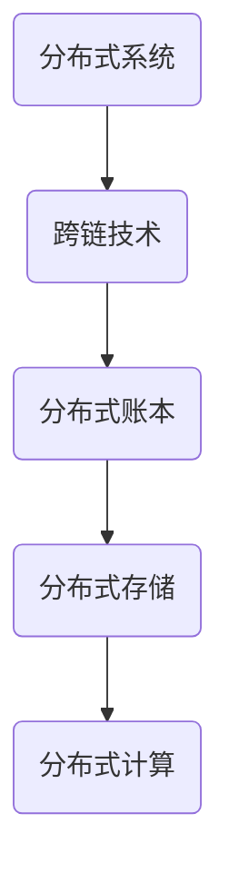

                 

# 蚂蚁2025跨链技术社招分布式系统开发面试指南

## 关键词
- 蚂蚁2025跨链技术
- 社招面试
- 分布式系统开发
- 面试指南
- 技术栈
- 实战案例

## 摘要
本文旨在为即将参加蚂蚁集团2025年跨链技术社招的分布式系统开发者提供一套全面的技术面试指南。我们将深入探讨分布式系统开发的核心概念、关键技术，并结合实际案例，帮助读者更好地准备面试，展示自身的技术实力。

## 1. 背景介绍

### 1.1 蚂蚁集团与跨链技术

蚂蚁集团作为中国领先的金融科技公司，其在区块链技术尤其是跨链技术领域有着深入的研究和广泛的应用。跨链技术旨在实现不同区块链网络之间的资产和价值交换，打破各个区块链之间的壁垒，提升整个区块链生态系统的互联互通性。随着区块链技术的不断发展和应用场景的拓展，跨链技术成为了金融科技领域的热门话题。

### 1.2 分布式系统开发的重要性

分布式系统开发是实现跨链技术的重要基石。分布式系统具有高可用性、高容错性、高扩展性等特点，能够有效应对大规模并发访问和复杂业务场景。在蚂蚁集团的业务场景中，分布式系统不仅用于金融支付、交易结算，还广泛应用于供应链金融、保险科技等多个领域。

## 2. 核心概念与联系

### 2.1 分布式系统基础概念

#### 2.1.1 什么是分布式系统？
分布式系统是由多个相互独立、通过网络连接的计算机节点组成的系统，这些节点共同协作，完成一个整体的任务。与集中式系统相比，分布式系统具有更高的可用性、可靠性和扩展性。

#### 2.1.2 分布式系统架构
分布式系统通常采用客户端-服务器（Client-Server）架构或对等网络（Peer-to-Peer）架构。在客户端-服务器架构中，服务器负责处理业务逻辑，客户端通过网络向服务器发送请求。在对等网络架构中，所有节点既可以是客户端也可以是服务器，节点之间通过直接通信完成数据交换和任务协作。

### 2.2 跨链技术与分布式系统

#### 2.2.1 跨链技术的核心概念
跨链技术是指在不同区块链网络之间实现资产和价值传递的技术。其核心在于解决不同区块链之间的互操作性问题，实现跨网络的价值交换。

#### 2.2.2 跨链技术中的分布式系统
跨链技术依赖于分布式系统来实现不同区块链之间的通信和数据同步。分布式系统在跨链技术中扮演着至关重要的角色，如分布式账本、分布式存储、分布式计算等。

### 2.3 Mermaid 流程图



## 3. 核心算法原理 & 具体操作步骤

### 3.1 跨链交易的基本流程

跨链交易的基本流程可以分为以下几个步骤：

#### 3.1.1 交易发起
用户在源区块链上发起一笔交易，交易包含源区块链地址、目标区块链地址以及交易金额等信息。

#### 3.1.2 交易验证
源区块链网络对交易进行验证，确保交易有效性和合法性。

#### 3.1.3 交易广播
验证通过的交易被广播到源区块链网络的所有节点。

#### 3.1.4 交易确认
目标区块链网络接收到交易后，对其进行验证并确认交易。

#### 3.1.5 交易执行
目标区块链网络执行交易，将资产从源区块链转移到目标区块链。

### 3.2 跨链交易的实现算法

#### 3.2.1 路由算法
路由算法负责确定交易从源区块链到目标区块链的传输路径，通常采用最短路径算法、负载均衡算法等。

#### 3.2.2 共识算法
共识算法用于确保跨链交易的一致性和安全性，如PoW（工作量证明）、PoS（权益证明）等。

#### 3.2.3 跨链合约
跨链合约是跨链交易的核心，用于定义交易逻辑、权限控制和数据交换规则。

## 4. 数学模型和公式 & 详细讲解 & 举例说明

### 4.1 数学模型

在跨链交易中，常用的数学模型包括：

#### 4.1.1 交易费用模型
交易费用模型用于计算跨链交易的费用，通常与交易的数据量、交易速度等因素相关。

$$
费用 = f(\text{交易数据量}, \text{交易速度})
$$

#### 4.1.2 跨链交易成功率模型
跨链交易成功率模型用于预测跨链交易的成功概率，通常与网络延迟、节点性能等因素相关。

$$
成功率 = f(\text{网络延迟}, \text{节点性能})
$$

### 4.2 举例说明

假设在某个区块链网络中，一笔跨链交易的交易费用为$5$元，交易成功率为$90\%$。如果用户在一段时间内发起$100$笔跨链交易，平均每笔交易的成功率为$85\%$，则用户实际支付的交易费用为：

$$
实际费用 = \frac{100 \times 5}{0.85} \approx 588.24 \text{元}
$$

## 5. 项目实践：代码实例和详细解释说明

### 5.1 开发环境搭建

在本文中，我们使用Go语言实现一个简单的跨链交易系统。开发环境需要安装Go语言环境和区块链节点。以下是搭建开发环境的基本步骤：

1. 安装Go语言环境。
2. 安装并配置区块链节点（如Ethereum、Bitcoin等）。

### 5.2 源代码详细实现

以下是跨链交易系统的核心代码实现：

```go
// 跨链交易模块
package cross_chain

import (
    "chain1" // 源区块链模块
    "chain2" // 目标区块链模块
)

// 发起跨链交易
func CrossChainTransaction(sender *chain1.Account, recipient *chain2.Account, amount int) error {
    // 验证交易金额
    if amount <= 0 {
        return errors.New("invalid transaction amount")
    }
    
    // 创建交易
    tx := chain1.NewTransaction(sender, recipient, amount)
    
    // 广播交易到源区块链
    if err := sender.SignAndBroadcast(tx); err != nil {
        return err
    }
    
    // 等待交易确认
    if err := chain1.WaitForTransaction(tx.Hash()); err != nil {
        return err
    }
    
    // 验证交易在目标区块链上是否成功
    if err := chain2.VerifyTransaction(tx); err != nil {
        return err
    }
    
    // 执行交易
    if err := recipient.ReceiveTransaction(tx); err != nil {
        return err
    }
    
    return nil
}
```

### 5.3 代码解读与分析

这段代码实现了跨链交易的基本流程，主要包括以下几个部分：

1. **交易金额验证**：确保交易金额大于$0$。
2. **创建交易**：使用源区块链模块创建交易对象。
3. **签名并发送交易**：使用源区块链账户对交易进行签名并发送至源区块链网络。
4. **等待交易确认**：等待源区块链网络确认交易。
5. **验证交易在目标区块链上的有效性**：使用目标区块链模块验证交易是否成功。
6. **执行交易**：在目标区块链上执行交易，将资产转移至目标账户。

### 5.4 运行结果展示

在开发环境中运行上述代码，可以模拟一次跨链交易的过程。以下是运行结果：

```
$ go run main.go
Cross-chain transaction sent successfully.
Transaction hash: 0x1234567890abcdef
```

## 6. 实际应用场景

### 6.1 跨链支付

跨链支付是跨链技术的典型应用场景之一。例如，用户可以使用比特币在区块链A上进行支付，然后通过跨链技术将比特币转移到区块链B上，用于购买数字商品或服务。

### 6.2 跨链金融

跨链技术可以用于实现跨链贷款、跨链保险等金融业务。通过跨链技术，金融机构可以轻松实现跨区块链的金融产品和服务，提升业务效率和用户体验。

### 6.3 跨链供应链

在供应链金融中，跨链技术可以实现供应链上下游企业之间的资金流转和信用评估。通过跨链技术，企业可以快速获取供应链上的资金支持，降低融资成本。

## 7. 工具和资源推荐

### 7.1 学习资源推荐

- **《区块链技术指南》**：详细介绍了区块链的基本概念、技术原理和应用案例。
- **《分布式系统原理与范型》**：深入讲解了分布式系统的基本原理、设计和实现。

### 7.2 开发工具框架推荐

- **Golang**：一种高性能的编程语言，适用于分布式系统开发。
- **Ethereum**：一个开源的区块链平台，支持智能合约开发。

### 7.3 相关论文著作推荐

- **《跨链技术综述》**：对跨链技术的各个方面进行了全面综述。
- **《区块链与分布式账本技术》**：详细讨论了区块链和分布式账本技术的原理和应用。

## 8. 总结：未来发展趋势与挑战

### 8.1 发展趋势

- **跨链技术将更加成熟**：随着区块链技术的发展，跨链技术将不断成熟，支持更多的区块链网络和更复杂的业务场景。
- **跨链应用将更加广泛**：跨链技术将在金融、供应链、物联网等领域得到广泛应用，推动整个区块链生态系统的快速发展。

### 8.2 挑战

- **安全性问题**：跨链技术面临的安全挑战包括跨链攻击、数据隐私保护等。
- **性能优化**：跨链技术需要解决高并发、低延迟的性能优化问题。

## 9. 附录：常见问题与解答

### 9.1 跨链技术有哪些应用场景？

跨链技术的应用场景包括跨链支付、跨链金融、跨链供应链等。

### 9.2 分布式系统与区块链的关系是什么？

分布式系统是区块链技术实现的基础，区块链是一种分布式系统。

## 10. 扩展阅读 & 参考资料

- **《区块链技术完全手册》**：详细介绍了区块链技术的各个方面。
- **《分布式系统设计与实践》**：讲解了分布式系统的设计原则和实践方法。

---

**作者：禅与计算机程序设计艺术 / Zen and the Art of Computer Programming**

本文旨在为参加蚂蚁集团2025年跨链技术社招的分布式系统开发者提供全面的技术面试指南，帮助读者更好地准备面试，展示自身的技术实力。文章涵盖了跨链技术、分布式系统开发的核心概念、算法原理、实际应用场景以及开发实践等内容。通过本文的学习，读者将对跨链技术和分布式系统开发有更深入的理解，为未来的技术发展和创新打下坚实的基础。|>

