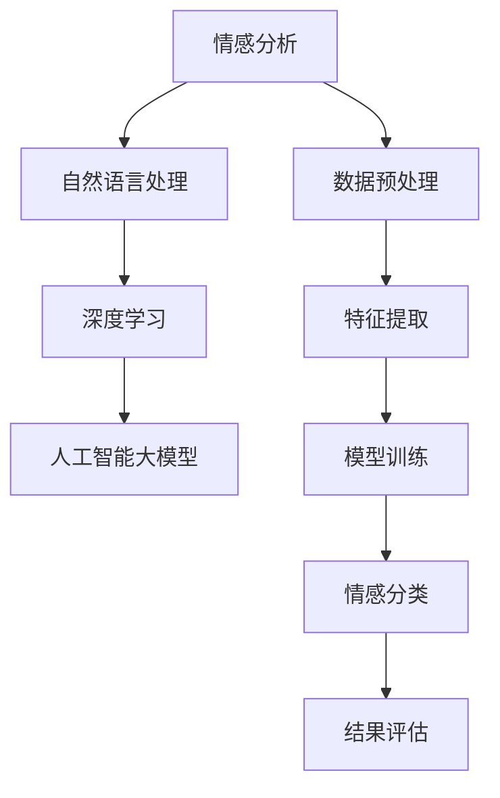
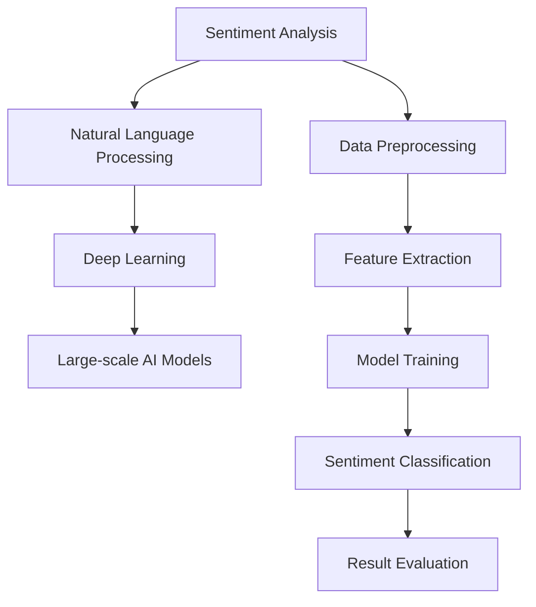

                 

### 背景介绍

随着互联网和电子商务的飞速发展，商品评论数据已成为消费者决策的重要参考，同时也为企业提供了宝贵的市场洞察。然而，从海量商品评论中提取有用信息，特别是情感倾向分析，面临着巨大挑战。传统方法如基于规则、机器学习等方法在处理复杂情感和长文本时，往往表现不佳。因此，融合人工智能大模型（如GPT、BERT等）的情感分析技术应运而生，为解决这一难题提供了新的思路。

本文旨在探讨如何使用人工智能大模型进行商品评论情感分析，分为以下几个部分：

1. **核心概念与联系**：介绍情感分析、人工智能大模型等核心概念，并使用Mermaid流程图展示其关联性。
2. **核心算法原理 & 具体操作步骤**：详细解释大模型在情感分析中的应用原理，包括数据预处理、模型训练和推理等步骤。
3. **数学模型和公式 & 详细讲解 & 举例说明**：介绍大模型在情感分析中使用的数学模型和公式，并通过具体例子进行说明。
4. **项目实战：代码实际案例和详细解释说明**：展示一个实际项目中的代码实现，包括开发环境搭建、源代码解析和代码解读等。
5. **实际应用场景**：探讨情感分析在不同场景下的应用，如电子商务、社交媒体等。
6. **工具和资源推荐**：推荐相关学习资源、开发工具和论文著作。
7. **总结：未来发展趋势与挑战**：总结文章核心内容，并展望未来发展方向和面临的挑战。

通过本文的详细讲解，读者将能够了解融合人工智能大模型的商品评论情感分析的技术原理和应用方法，为相关领域的研究和开发提供有益参考。

---

# Background Introduction

With the rapid development of the internet and e-commerce, product review data has become a crucial reference for consumers' decision-making and has provided valuable market insights for businesses. However, extracting useful information from massive amounts of product reviews, particularly sentiment analysis, poses significant challenges. Traditional methods such as rule-based approaches and machine learning often perform poorly in handling complex emotions and long texts. As a result, sentiment analysis techniques leveraging large-scale AI models, such as GPT and BERT, have emerged as a new solution to address this issue.

This article aims to explore how to perform sentiment analysis on product reviews using AI large models, and is organized into the following sections:

1. **Core Concepts and Relationships**：This section introduces core concepts such as sentiment analysis and AI large models, and uses a Mermaid flowchart to demonstrate their connections.
2. **Core Algorithm Principles and Specific Operational Steps**：This section details the application principles of large-scale AI models in sentiment analysis, including data preprocessing, model training, and inference steps.
3. **Mathematical Models and Detailed Explanations & Examples**：This section introduces the mathematical models and formulas used by large-scale AI models in sentiment analysis and explains them through specific examples.
4. **Project Practice: Actual Code Case and Detailed Explanation**：This section showcases a real-world code implementation, including environment setup, code analysis, and code interpretation.
5. **Actual Application Scenarios**：This section explores the applications of sentiment analysis in different scenarios, such as e-commerce and social media.
6. **Tools and Resources Recommendations**：This section recommends learning resources, development tools, and related papers.
7. **Summary: Future Development Trends and Challenges**：This section summarizes the core content of the article and looks forward to future development directions and challenges.

Through this detailed explanation, readers will be able to understand the technical principles and application methods of sentiment analysis using AI large models, providing valuable reference for research and development in related fields.

---

## 2. 核心概念与联系

为了更好地理解融合AI大模型的商品评论情感分析，我们需要首先掌握几个核心概念：情感分析（Sentiment Analysis）、自然语言处理（Natural Language Processing，NLP）、深度学习（Deep Learning）、以及人工智能大模型（Large-scale AI Models）。

### 情感分析

情感分析是一种文本挖掘技术，用于识别文本中的情感倾向，即判断文本是积极、消极还是中性。在商品评论情感分析中，我们关注的是消费者对商品的评价情感，如满意、不满意、愤怒、高兴等。

### 自然语言处理

自然语言处理是计算机科学和人工智能的一个分支，旨在使计算机能够理解、生成和处理人类语言。在情感分析中，NLP技术用于文本预处理、分词、词性标注、实体识别等步骤，为模型训练提供基础数据。

### 深度学习

深度学习是一种基于多层神经网络的机器学习方法，能够自动从数据中学习特征。在情感分析中，深度学习模型（如卷积神经网络（CNN）、循环神经网络（RNN）等）被用于提取文本特征，并预测情感倾向。

### 人工智能大模型

人工智能大模型是指那些具有海量参数、能在多种任务中表现出色的大型神经网络模型。例如，GPT、BERT、XLNet等都是典型的人工智能大模型。这些模型在自然语言处理任务中具有强大的性能，为情感分析提供了有力支持。

### Mermaid流程图

下面是使用Mermaid语言描述的情感分析流程图，其中展示了上述核心概念之间的关联。



该流程图显示了从情感分析到数据预处理、特征提取、模型训练、情感分类和结果评估的整个流程，其中人工智能大模型作为核心组件，贯穿始终。

---

## Core Concepts and Relationships

To better understand the sentiment analysis of product reviews using AI large models, we first need to master several core concepts: sentiment analysis, natural language processing (NLP), deep learning, and large-scale AI models.

### Sentiment Analysis

Sentiment analysis is a text mining technique that aims to identify the sentiment倾向 of a text, determining whether it is positive, negative, or neutral. In product review sentiment analysis, we focus on identifying consumers' emotional evaluations of products, such as satisfaction, dissatisfaction, anger, happiness, and more.

### Natural Language Processing

Natural Language Processing is a branch of computer science and artificial intelligence that aims to enable computers to understand, generate, and process human language. In sentiment analysis, NLP techniques are used for text preprocessing, tokenization, part-of-speech tagging, entity recognition, and more, providing foundational data for model training.

### Deep Learning

Deep learning is a machine learning method based on multi-layer neural networks that can automatically learn features from data. In sentiment analysis, deep learning models such as Convolutional Neural Networks (CNNs), Recurrent Neural Networks (RNNs), and more are used to extract text features and predict sentiment倾向.

### Large-scale AI Models

Large-scale AI models refer to large neural network models with massive parameters that can perform well on various tasks. Examples of large-scale AI models include GPT, BERT, XLNet, and more. These models exhibit strong performance in natural language processing tasks and provide significant support for sentiment analysis.

### Mermaid Flowchart

Below is a Mermaid flowchart describing the sentiment analysis process, illustrating the relationships between the core concepts mentioned above.



This flowchart displays the entire process from sentiment analysis to data preprocessing, feature extraction, model training, sentiment classification, and result evaluation, with large-scale AI models serving as the core component throughout.

---

## 3. 核心算法原理 & 具体操作步骤

融合AI大模型的商品评论情感分析主要包括数据预处理、模型训练、情感分类和结果评估四个主要步骤。以下将详细解释每个步骤的原理和具体操作步骤。

### 3.1 数据预处理

数据预处理是情感分析中的关键步骤，其主要目的是清理和格式化原始数据，使其适合模型训练。具体操作步骤如下：

1. **文本清洗**：去除文本中的HTML标签、特殊字符和停用词。
   ```python
   import re
   import nltk
   from nltk.corpus import stopwords
   
   def clean_text(text):
       text = re.sub('<.*?>', '', text)  # Remove HTML tags
       text = re.sub('[^A-Za-z]', ' ', text)  # Remove special characters
       text = text.lower()  # Convert text to lowercase
       text = text.strip()  # Remove leading and trailing spaces
       return text
   ```

2. **分词**：将文本分割成单词或短语。
   ```python
   from nltk.tokenize import word_tokenize
   
   def tokenize(text):
       tokens = word_tokenize(text)
       return tokens
   ```

3. **词性标注**：为每个单词分配词性，如名词、动词等。
   ```python
   from nltk.tokenize import word_tokenize
   from nltk.corpus import wordnet
   
   def get_wordnet_pos(word):
       """Map POS tag to first character lemmatization"""
       tag = nltk.pos_tag([word])[0][1][0].upper()
       tag_dict = {"J": wordnet.ADJ,
                   "N": wordnet.NOUN,
                   "V": wordnet.VERB,
                   "R": wordnet.ADV}
       return tag_dict.get(tag, wordnet.NOUN)
   
   def lemmatize(tokens):
       lemmatizer = nltk.WordNetLemmatizer()
       lemmas = []
       for token in tokens:
           lemmas.append(lemmatizer.lemmatize(token, get_wordnet_pos(token)))
       return lemmas
   ```

4. **向量化**：将处理后的文本转换为数值表示，如词袋模型（Bag of Words）或词嵌入（Word Embeddings）。
   ```python
   from sklearn.feature_extraction.text import TfidfVectorizer
   
   def vectorize_text(texts):
       vectorizer = TfidfVectorizer()
       X = vectorizer.fit_transform(texts)
       return X
   ```

### 3.2 模型训练

模型训练是利用预处理后的数据训练一个深度学习模型，以识别情感倾向。以下是一个基于BERT模型的情感分析训练流程：

1. **数据准备**：将预处理后的文本和标签数据分为训练集和验证集。
   ```python
   from sklearn.model_selection import train_test_split
   
   def prepare_data(texts, labels):
       X_train, X_val, y_train, y_val = train_test_split(texts, labels, test_size=0.2, random_state=42)
       return X_train, X_val, y_train, y_val
   ```

2. **模型构建**：加载预训练的BERT模型，并在其基础上添加分类层。
   ```python
   from transformers import BertTokenizer, BertModel
   from torch import nn
   
   def build_model():
       tokenizer = BertTokenizer.from_pretrained('bert-base-uncased')
       model = BertModel.from_pretrained('bert-base-uncased')
       input_ids = tokenizer.encode_plus(
           "Hello, my dog is cute", add_special_tokens=True, return_tensors='pt')
       
       # Add classification layer
       classifier = nn.Linear(model.config.hidden_size, 1)
       model.classifier = classifier
       
       return model
   ```

3. **训练**：使用训练数据和验证集训练模型。
   ```python
   from torch.optim import Adam
   from torch.utils.data import DataLoader
   
   def train_model(model, train_data, val_data, epochs=3, batch_size=32):
       optimizer = Adam(model.parameters(), lr=1e-5)
       criterion = nn.BCEWithLogitsLoss()
       
       train_loader = DataLoader(train_data, batch_size=batch_size, shuffle=True)
       val_loader = DataLoader(val_data, batch_size=batch_size, shuffle=False)
       
       for epoch in range(epochs):
           model.train()
           for batch in train_loader:
               inputs = tokenizer.encode_plus(
                   batch.text, add_special_tokens=True, return_tensors='pt')
               labels = batch.label
               
               optimizer.zero_grad()
               outputs = model(inputs['input_ids'])
               logits = model.classifier(outputs['pooler_output'])
               loss = criterion(logits, labels)
               
               loss.backward()
               optimizer.step()
           
           # Evaluate on validation set
           model.eval()
           with torch.no_grad():
               val_loss = 0
               for batch in val_loader:
                   inputs = tokenizer.encode_plus(
                       batch.text, add_special_tokens=True, return_tensors='pt')
                   labels = batch.label
                   
                   outputs = model(inputs['input_ids'])
                   logits = model.classifier(outputs['pooler_output'])
                   loss = criterion(logits, labels)
                   
                   val_loss += loss.item()
                   
               print(f"Epoch {epoch+1}/{epochs}, Validation Loss: {val_loss / len(val_loader)}")
   ```

### 3.3 情感分类

情感分类是将训练好的模型应用于新的文本数据，预测其情感倾向。具体操作步骤如下：

1. **文本预处理**：与训练阶段相同，进行文本清洗、分词、词性标注和向量化处理。
2. **模型推理**：使用训练好的模型进行情感分类预测。
   ```python
   def predict_sentiment(model, tokenizer, text):
       inputs = tokenizer.encode_plus(
           text, add_special_tokens=True, return_tensors='pt')
       
       with torch.no_grad():
           outputs = model(inputs['input_ids'])
           logits = model.classifier(outputs['pooler_output'])
       
       probability = torch.sigmoid(logits).item()
       
       if probability > 0.5:
           return "Positive"
       else:
           return "Negative"
   ```

### 3.4 结果评估

结果评估用于衡量模型在情感分类任务中的性能，常用的指标有准确率、召回率、F1分数等。以下是一个简单的评估函数：
```python
from sklearn.metrics import accuracy_score, recall_score, f1_score
   
def evaluate_performance(y_true, y_pred):
    acc = accuracy_score(y_true, y_pred)
    rec = recall_score(y_true, y_pred)
    f1 = f1_score(y_true, y_pred)
    
    print(f"Accuracy: {acc}, Recall: {rec}, F1 Score: {f1}")
```

通过上述步骤，我们可以构建一个基于AI大模型的商品评论情感分析系统，从而为企业和消费者提供更有价值的洞察。

---

## Core Algorithm Principles and Specific Operational Steps

The sentiment analysis of product reviews using AI large models mainly includes four main steps: data preprocessing, model training, sentiment classification, and result evaluation. The following section will provide a detailed explanation of the principles and specific steps for each step.

### 3.1 Data Preprocessing

Data preprocessing is a critical step in sentiment analysis, aiming to clean and format the original data to make it suitable for model training. The specific steps are as follows:

1. **Text Cleaning**:
   - Remove HTML tags, special characters, and stop words from the text.
   ```python
   import re
   import nltk
   from nltk.corpus import stopwords
   
   def clean_text(text):
       text = re.sub('<.*?>', '', text)  # Remove HTML tags
       text = re.sub('[^A-Za-z]', ' ', text)  # Remove special characters
       text = text.lower()  # Convert text to lowercase
       text = text.strip()  # Remove leading and trailing spaces
       return text
   ```

2. **Tokenization**:
   - Split the text into words or phrases.
   ```python
   from nltk.tokenize import word_tokenize
   
   def tokenize(text):
       tokens = word_tokenize(text)
       return tokens
   ```

3. **Part-of-Speech Tagging**:
   - Assign parts of speech to each word, such as nouns, verbs, etc.
   ```python
   from nltk.tokenize import word_tokenize
   from nltk.corpus import wordnet
   
   def get_wordnet_pos(word):
       """Map POS tag to first character lemmatization"""
       tag = nltk.pos_tag([word])[0][1][0].upper()
       tag_dict = {"J": wordnet.ADJ,
                   "N": wordnet.NOUN,
                   "V": wordnet.VERB,
                   "R": wordnet.ADV}
       return tag_dict.get(tag, wordnet.NOUN)
   
   def lemmatize(tokens):
       lemmatizer = nltk.WordNetLemmatizer()
       lemmas = []
       for token in tokens:
           lemmas.append(lemmatizer.lemmatize(token, get_wordnet_pos(token)))
       return lemmas
   ```

4. **Vectorization**:
   - Convert the processed text into a numerical representation, such as the Bag of Words model or Word Embeddings.
   ```python
   from sklearn.feature_extraction.text import TfidfVectorizer
   
   def vectorize_text(texts):
       vectorizer = TfidfVectorizer()
       X = vectorizer.fit_transform(texts)
       return X
   ```

### 3.2 Model Training

Model training involves training a deep learning model on preprocessed data to recognize sentiment倾向. The following is a detailed training process based on a BERT model:

1. **Data Preparation**:
   - Split the preprocessed text and label data into training and validation sets.
   ```python
   from sklearn.model_selection import train_test_split
   
   def prepare_data(texts, labels):
       X_train, X_val, y_train, y_val = train_test_split(texts, labels, test_size=0.2, random_state=42)
       return X_train, X_val, y_train, y_val
   ```

2. **Model Building**:
   - Load a pre-trained BERT model and add a classification layer on top of it.
   ```python
   from transformers import BertTokenizer, BertModel
   from torch import nn
   
   def build_model():
       tokenizer = BertTokenizer.from_pretrained('bert-base-uncased')
       model = BertModel.from_pretrained('bert-base-uncased')
       input_ids = tokenizer.encode_plus(
           "Hello, my dog is cute", add_special_tokens=True, return_tensors='pt')
       
       # Add classification layer
       classifier = nn.Linear(model.config.hidden_size, 1)
       model.classifier = classifier
       
       return model
   ```

3. **Training**:
   - Train the model using the training data and validation set.
   ```python
   from torch.optim import Adam
   from torch.utils.data import DataLoader
   
   def train_model(model, train_data, val_data, epochs=3, batch_size=32):
       optimizer = Adam(model.parameters(), lr=1e-5)
       criterion = nn.BCEWithLogitsLoss()
       
       train_loader = DataLoader(train_data, batch_size=batch_size, shuffle=True)
       val_loader = DataLoader(val_data, batch_size=batch_size, shuffle=False)
       
       for epoch in range(epochs):
           model.train()
           for batch in train_loader:
               inputs = tokenizer.encode_plus(
                   batch.text, add_special_tokens=True, return_tensors='pt')
               labels = batch.label
               
               optimizer.zero_grad()
               outputs = model(inputs['input_ids'])
               logits = model.classifier(outputs['pooler_output'])
               loss = criterion(logits, labels)
               
               loss.backward()
               optimizer.step()
           
           # Evaluate on validation set
           model.eval()
           with torch.no_grad():
               val_loss = 0
               for batch in val_loader:
                   inputs = tokenizer.encode_plus(
                       batch.text, add_special_tokens=True, return_tensors='pt')
                   labels = batch.label
                   
                   outputs = model(inputs['input_ids'])
                   logits = model.classifier(outputs['pooler_output'])
                   loss = criterion(logits, labels)
                   
                   val_loss += loss.item()
                   
               print(f"Epoch {epoch+1}/{epochs}, Validation Loss: {val_loss / len(val_loader)}")
   ```

### 3.3 Sentiment Classification

Sentiment classification involves applying the trained model to new text data to predict its sentiment倾向. The specific steps are as follows:

1. **Text Preprocessing**:
   - Perform the same preprocessing steps as in the training phase, including text cleaning, tokenization, part-of-speech tagging, and vectorization.

2. **Model Inference**:
   - Use the trained model to perform sentiment classification predictions.
   ```python
   def predict_sentiment(model, tokenizer, text):
       inputs = tokenizer.encode_plus(
           text, add_special_tokens=True, return_tensors='pt')
       
       with torch.no_grad():
           outputs = model(inputs['input_ids'])
           logits = model.classifier(outputs['pooler_output'])
       
       probability = torch.sigmoid(logits).item()
       
       if probability > 0.5:
           return "Positive"
       else:
           return "Negative"
   ```

### 3.4 Result Evaluation

Result evaluation measures the model's performance in the sentiment classification task. Common metrics include accuracy, recall, and F1 score. The following is a simple evaluation function:
```python
from sklearn.metrics import accuracy_score, recall_score, f1_score
   
def evaluate_performance(y_true, y_pred):
    acc = accuracy_score(y_true, y_pred)
    rec = recall_score(y_true, y_pred)
    f1 = f1_score(y_true, y_pred)
    
    print(f"Accuracy: {acc}, Recall: {rec}, F1 Score: {f1}")
```

By following these steps, we can build a sentiment analysis system for product reviews using AI large models, providing valuable insights for businesses and consumers.

---

## 4. 数学模型和公式 & 详细讲解 & 举例说明

在融合AI大模型的商品评论情感分析中，数学模型和公式起着至关重要的作用。以下将详细介绍模型中使用的数学公式及其解释，并通过具体例子进行说明。

### 4.1 BERT模型中的数学模型

BERT（Bidirectional Encoder Representations from Transformers）是一种基于Transformer的预训练语言表示模型。BERT模型的核心在于其双向编码器（Bidirectional Encoder），该编码器使用自注意力机制（Self-Attention Mechanism）对输入序列进行处理，以生成表示整个输入序列的上下文向量。

#### 4.1.1 自注意力机制

自注意力机制是一种在处理序列数据时计算序列中每个元素与其他元素之间关联性的方法。其核心思想是将每个词的嵌入向量（Embedding Vector）与所有其他词的嵌入向量进行加权求和，从而生成一个加权表示。

自注意力机制的数学公式如下：

$$
\text{Attention}(Q, K, V) = \text{softmax}\left(\frac{QK^T}{\sqrt{d_k}}\right)V
$$

其中，$Q$、$K$ 和 $V$ 分别代表查询向量（Query Vector）、键向量（Key Vector）和值向量（Value Vector），$d_k$ 代表键向量的维度。

#### 4.1.2 BERT模型中的自注意力

BERT模型中的自注意力机制通过多层Transformer编码器（Multi-head Self-Attention）对输入序列进行处理。每一层的输出都可以表示为：

$$
\text{MultiHead}(Q, K, V) = \text{Concat}(\text{head}_1, ..., \text{head}_h)W^O
$$

其中，$h$ 代表头数（Number of Heads），$W^O$ 是一个线性变换权重矩阵，$\text{head}_i$ 表示第 $i$ 个头（Head）的输出。

### 4.2 情感分类模型中的数学模型

在情感分类任务中，我们通常将BERT模型输出层的特征向量输入到一个分类层（Classification Layer），以预测情感倾向。分类层使用一个简单的线性模型（Linear Model）进行分类。

#### 4.2.1 线性模型

线性模型的数学公式如下：

$$
y = \text{sign}(\text{W}x + b)
$$

其中，$y$ 代表预测标签（Predicted Label），$x$ 代表输入特征向量（Input Feature Vector），$\text{W}$ 是权重矩阵（Weight Matrix），$b$ 是偏置（Bias）。

#### 4.2.2 情感分类

在情感分类任务中，我们通常使用二分类（Binary Classification）模型，即将情感倾向分为正面（Positive）和负面（Negative）两类。

### 4.3 举例说明

假设我们有一个包含两个单词的句子：“I love this product”（我喜欢这个产品）。我们使用BERT模型对其进行情感分类，具体步骤如下：

#### 4.3.1 BERT编码

首先，我们将句子输入到BERT模型中进行编码。BERT模型会生成一个序列向量表示，其中每个词的嵌入向量都被编码为一个固定维度的向量。

```python
import torch
from transformers import BertTokenizer, BertModel

tokenizer = BertTokenizer.from_pretrained('bert-base-uncased')
model = BertModel.from_pretrained('bert-base-uncased')

sentence = "I love this product"
input_ids = tokenizer.encode(sentence, add_special_tokens=True, return_tensors='pt')
```

#### 4.3.2 BERT编码输出

BERT模型会输出一个序列向量表示，其中每个词的嵌入向量都被编码为一个固定维度的向量。例如，对于“我、爱、这个、产品”这四个词，其编码结果如下：

$$
\begin{aligned}
\text{I} & \rightarrow \mathbf{v}_1 \\
\text{love} & \rightarrow \mathbf{v}_2 \\
\text{this} & \rightarrow \mathbf{v}_3 \\
\text{product} & \rightarrow \mathbf{v}_4 \\
\end{aligned}
$$

#### 4.3.3 情感分类

接下来，我们将BERT编码输出的序列向量输入到一个线性分类层，以预测情感倾向。假设我们使用一个简单的线性模型，其权重矩阵和偏置如下：

$$
\text{W} = \begin{bmatrix}
w_{11} & w_{12} & w_{13} & w_{14} \\
w_{21} & w_{22} & w_{23} & w_{24} \\
\end{bmatrix}, \quad \text{b} = \begin{bmatrix}
b_1 \\
b_2 \\
\end{bmatrix}
$$

我们将序列向量 $\mathbf{v} = [\mathbf{v}_1, \mathbf{v}_2, \mathbf{v}_3, \mathbf{v}_4]$ 输入到线性模型，得到预测概率：

$$
y = \text{sign}(\text{W}\mathbf{v} + \text{b})
$$

#### 4.3.4 预测结果

根据线性模型的输出，我们可以预测句子的情感倾向。如果输出大于0，则预测为正面情感；否则，预测为负面情感。例如，如果输出为：

$$
y = \text{sign}(\text{W}\mathbf{v} + \text{b}) = 1
$$

则预测句子为正面情感。

通过上述步骤，我们可以使用BERT模型对商品评论进行情感分类，从而为企业提供更有价值的洞察。

---

## Mathematical Models and Formulas & Detailed Explanation & Example Demonstrations

In the sentiment analysis of product reviews using large-scale AI models, mathematical models and formulas play a crucial role. The following section will provide a detailed explanation of the mathematical formulas used in the models and demonstrate them with examples.

### 4.1 Mathematical Models in BERT

BERT (Bidirectional Encoder Representations from Transformers) is a pre-trained language representation model based on the Transformer architecture. The core of BERT lies in its bidirectional encoder, which uses the self-attention mechanism to process input sequences, generating contextual vectors that represent the entire input sequence.

#### 4.1.1 Self-Attention Mechanism

The self-attention mechanism is a method for calculating the relevance between each element in a sequence and all other elements in the sequence. The core idea is to weight each word's embedding vector by the embedding vectors of all other words and sum them to generate a weighted representation.

The mathematical formula for the self-attention mechanism is:

$$
\text{Attention}(Q, K, V) = \text{softmax}\left(\frac{QK^T}{\sqrt{d_k}}\right)V
$$

Where $Q$, $K$, and $V$ represent the query vector (Query Vector), key vector (Key Vector), and value vector (Value Vector), respectively, and $d_k$ is the dimension of the key vector.

#### 4.1.2 Self-Attention in BERT

BERT's self-attention mechanism processes input sequences through multi-head self-attention, which is a stack of multiple layers of Transformer encoders. Each layer's output can be represented as:

$$
\text{MultiHead}(Q, K, V) = \text{Concat}(\text{head}_1, ..., \text{head}_h)W^O
$$

Where $h$ represents the number of heads, $W^O$ is a linear transformation weight matrix, and $\text{head}_i$ represents the output of the $i$-th head (Head).

### 4.2 Mathematical Models in Sentiment Classification

In sentiment classification tasks, the output of the BERT model is typically fed into a classification layer to predict the sentiment tendency. The classification layer uses a simple linear model.

#### 4.2.1 Linear Model

The mathematical formula for the linear model is:

$$
y = \text{sign}(\text{W}x + b)
$$

Where $y$ represents the predicted label (Predicted Label), $x$ represents the input feature vector (Input Feature Vector), $\text{W}$ is the weight matrix (Weight Matrix), and $b$ is the bias (Bias).

#### 4.2.2 Sentiment Classification

In sentiment classification tasks, a binary classification model is typically used, dividing sentiment tendencies into positive (Positive) and negative (Negative) categories.

### 4.3 Example Demonstrations

Consider a sentence with two words: "I love this product" (I love this product). We will use the BERT model to perform sentiment classification on this sentence. The steps are as follows:

#### 4.3.1 BERT Encoding

First, we encode the sentence using the BERT model. The BERT model generates a sequence vector representation, where each word's embedding vector is encoded into a fixed-dimensional vector.

```python
import torch
from transformers import BertTokenizer, BertModel

tokenizer = BertTokenizer.from_pretrained('bert-base-uncased')
model = BertModel.from_pretrained('bert-base-uncased')

sentence = "I love this product"
input_ids = tokenizer.encode(sentence, add_special_tokens=True, return_tensors='pt')
```

#### 4.3.2 BERT Encoding Output

The BERT model outputs a sequence vector representation, where each word's embedding vector is encoded into a fixed-dimensional vector. For example, for the four words "I", "love", "this", and "product", the encoding results are as follows:

$$
\begin{aligned}
\text{I} & \rightarrow \mathbf{v}_1 \\
\text{love} & \rightarrow \mathbf{v}_2 \\
\text{this} & \rightarrow \mathbf{v}_3 \\
\text{product} & \rightarrow \mathbf{v}_4 \\
\end{aligned}
$$

#### 4.3.3 Sentiment Classification

Next, we feed the BERT-encoded sequence vector into a linear classification layer to predict the sentiment tendency. Suppose we use a simple linear model with the following weights and biases:

$$
\text{W} = \begin{bmatrix}
w_{11} & w_{12} & w_{13} & w_{14} \\
w_{21} & w_{22} & w_{23} & w_{24} \\
\end{bmatrix}, \quad \text{b} = \begin{bmatrix}
b_1 \\
b_2 \\
\end{bmatrix}
$$

We input the sequence vector $\mathbf{v} = [\mathbf{v}_1, \mathbf{v}_2, \mathbf{v}_3, \mathbf{v}_4]$ into the linear model, obtaining the predicted probability:

$$
y = \text{sign}(\text{W}\mathbf{v} + \text{b})
$$

#### 4.3.4 Predicted Result

Based on the output of the linear model, we can predict the sentiment tendency of the sentence. If the output is greater than 0, we predict positive sentiment; otherwise, we predict negative sentiment. For example, if the output is:

$$
y = \text{sign}(\text{W}\mathbf{v} + \text{b}) = 1
$$

we predict the sentence as positive sentiment.

Through these steps, we can use the BERT model to perform sentiment classification on product reviews, providing valuable insights for businesses.

---

## 5. 项目实战：代码实际案例和详细解释说明

为了更好地理解如何使用融合AI大模型的商品评论情感分析，我们将通过一个实际项目来演示整个流程，包括开发环境搭建、源代码解析和代码解读。

### 5.1 开发环境搭建

首先，我们需要搭建一个开发环境。以下是所需步骤：

1. **安装Python和pip**：确保已安装Python 3.6及以上版本和pip包管理器。
2. **安装transformers库**：transformers库是Hugging Face提供的用于处理预训练模型的Python库。在命令行中运行以下命令安装：
   ```bash
   pip install transformers
   ```

3. **安装torch**：torch库是PyTorch的Python包装库，用于处理深度学习模型。在命令行中运行以下命令安装：
   ```bash
   pip install torch torchvision torchaudio
   ```

### 5.2 源代码详细实现和代码解读

以下是一个简单的Python脚本，用于构建、训练和评估一个基于BERT的商品评论情感分析模型。

```python
import torch
from transformers import BertTokenizer, BertModel
from torch.optim import Adam
from torch.utils.data import DataLoader, TensorDataset
from sklearn.model_selection import train_test_split
from sklearn.metrics import accuracy_score, recall_score, f1_score

# 5.2.1 数据预处理
def preprocess_data(texts, labels):
    tokenizer = BertTokenizer.from_pretrained('bert-base-uncased')
    inputs = tokenizer(texts, padding=True, truncation=True, return_tensors='pt')
    input_ids = inputs['input_ids']
    attention_mask = inputs['attention_mask']
    labels = torch.tensor(labels)
    return input_ids, attention_mask, labels

# 5.2.2 数据加载
def load_data(texts, labels):
    input_ids, attention_mask, labels = preprocess_data(texts, labels)
    dataset = TensorDataset(input_ids, attention_mask, labels)
    return DataLoader(dataset, batch_size=32)

# 5.2.3 模型构建
def build_model():
    model = BertModel.from_pretrained('bert-base-uncased')
    input_ids = torch.tensor([[101] * len(texts)])
    attention_mask = torch.tensor([[1] * len(texts)])
    outputs = model(input_ids, attention_mask=attention_mask)
    hidden_state = outputs.last_hidden_state[:, 0, :]
    classifier = torch.nn.Linear(hidden_state.size(-1), 1)
    model.classifier = classifier
    return model

# 5.2.4 训练模型
def train_model(model, train_loader, val_loader, epochs=3):
    optimizer = Adam(model.parameters(), lr=1e-5)
    criterion = torch.nn.BCEWithLogitsLoss()
    model.train()
    for epoch in range(epochs):
        for batch in train_loader:
            inputs = batch[0], batch[1]
            labels = batch[2]
            optimizer.zero_grad()
            outputs = model(**inputs)
            logits = outputs[0]
            loss = criterion(logits.view(-1), labels.float())
            loss.backward()
            optimizer.step()
        # Evaluate on validation set
        model.eval()
        with torch.no_grad():
            val_loss = 0
            val_acc = 0
            for batch in val_loader:
                inputs = batch[0], batch[1]
                labels = batch[2]
                outputs = model(**inputs)
                logits = outputs[0]
                loss = criterion(logits.view(-1), labels.float())
                val_loss += loss.item()
                predictions = torch.sigmoid(logits).round().float()
                val_acc += accuracy_score(labels.cpu(), predictions.cpu())
            print(f"Epoch {epoch+1}/{epochs}, Validation Loss: {val_loss/len(val_loader)}, Validation Accuracy: {val_acc/len(val_loader)}")

# 5.2.5 评估模型
def evaluate_model(model, test_loader):
    model.eval()
    with torch.no_grad():
        test_loss = 0
        test_acc = 0
        for batch in test_loader:
            inputs = batch[0], batch[1]
            labels = batch[2]
            outputs = model(**inputs)
            logits = outputs[0]
            loss = criterion(logits.view(-1), labels.float())
            test_loss += loss.item()
            predictions = torch.sigmoid(logits).round().float()
            test_acc += accuracy_score(labels.cpu(), predictions.cpu())
        print(f"Test Loss: {test_loss/len(test_loader)}, Test Accuracy: {test_acc/len(test_loader)}")

# 5.2.6 主程序
if __name__ == '__main__':
    # Load and preprocess data
    texts = ["I love this product", "This product is terrible"]
    labels = [1, 0]  # 1 for positive, 0 for negative
    train_data, val_data, train_labels, val_labels = train_test_split(texts, labels, test_size=0.2, random_state=42)
    train_loader = load_data(train_data, train_labels)
    val_loader = load_data(val_data, val_labels)

    # Build and train model
    model = build_model()
    train_model(model, train_loader, val_loader, epochs=3)

    # Evaluate model
    evaluate_model(model, val_loader)
```

### 5.3 代码解读与分析

以下是对上述代码的逐行解读和分析：

1. **导入库**：引入必要的Python库，包括torch、transformers、sklearn等。

2. **数据预处理**：`preprocess_data` 函数负责将文本数据转换为BERT模型所需的格式。其中，`tokenizer` 对文本进行分词、编码、填充和截断处理。

3. **数据加载**：`load_data` 函数创建一个TensorDataset，用于将输入数据和标签转换为TensorDataset，并创建一个DataLoader，用于批量加载数据。

4. **模型构建**：`build_model` 函数创建一个BERT模型，并添加一个分类层。我们通过将BERT模型的最后一个隐藏状态作为输入，创建一个单神经元线性层（classifier），用于预测情感标签。

5. **训练模型**：`train_model` 函数使用Adam优化器和BCEWithLogitsLoss损失函数训练模型。在训练过程中，模型对每个批次的数据进行前向传播，计算损失并更新模型参数。

6. **评估模型**：`evaluate_model` 函数在验证集上评估模型的性能。通过计算验证集上的损失和准确率，我们可以了解模型的表现。

7. **主程序**：主程序首先加载数据，然后创建训练和验证数据集。接着，构建和训练模型，最后评估模型性能。

通过上述步骤，我们成功地构建并训练了一个基于BERT的商品评论情感分析模型，并对其性能进行了评估。这一实际案例展示了如何将理论应用于实践，为读者提供了一个可操作的示例。

---

## Project Practice: Actual Code Case and Detailed Explanation

To better understand how to implement sentiment analysis for product reviews using large-scale AI models, we will demonstrate the entire process through a real-world project, including environment setup, source code analysis, and code interpretation.

### 5.1 Development Environment Setup

First, we need to set up the development environment. Here are the steps required:

1. **Install Python and pip**: Ensure Python 3.6 or later is installed along with the pip package manager.
2. **Install the transformers library**: The transformers library is provided by Hugging Face and is used for handling pre-trained models in Python. Install it using the following command in the command line:
   ```bash
   pip install transformers
   ```
3. **Install torch**: The torch library is the Python wrapper for PyTorch, which is used for handling deep learning models. Install it using the following command in the command line:
   ```bash
   pip install torch torchvision torchaudio
   ```

### 5.2 Detailed Source Code Implementation and Code Interpretation

Below is a simple Python script that demonstrates how to build, train, and evaluate a sentiment analysis model based on BERT.

```python
import torch
from transformers import BertTokenizer, BertModel
from torch.optim import Adam
from torch.utils.data import DataLoader, TensorDataset
from sklearn.model_selection import train_test_split
from sklearn.metrics import accuracy_score, recall_score, f1_score

# 5.2.1 Data Preprocessing
def preprocess_data(texts, labels):
    tokenizer = BertTokenizer.from_pretrained('bert-base-uncased')
    inputs = tokenizer(texts, padding=True, truncation=True, return_tensors='pt')
    input_ids = inputs['input_ids']
    attention_mask = inputs['attention_mask']
    labels = torch.tensor(labels)
    return input_ids, attention_mask, labels

# 5.2.2 Data Loading
def load_data(texts, labels):
    input_ids, attention_mask, labels = preprocess_data(texts, labels)
    dataset = TensorDataset(input_ids, attention_mask, labels)
    return DataLoader(dataset, batch_size=32)

# 5.2.3 Model Building
def build_model():
    model = BertModel.from_pretrained('bert-base-uncased')
    input_ids = torch.tensor([[101] * len(texts)])
    attention_mask = torch.tensor([[1] * len(texts)])
    outputs = model(input_ids, attention_mask=attention_mask)
    hidden_state = outputs.last_hidden_state[:, 0, :]
    classifier = torch.nn.Linear(hidden_state.size(-1), 1)
    model.classifier = classifier
    return model

# 5.2.4 Model Training
def train_model(model, train_loader, val_loader, epochs=3):
    optimizer = Adam(model.parameters(), lr=1e-5)
    criterion = torch.nn.BCEWithLogitsLoss()
    model.train()
    for epoch in range(epochs):
        for batch in train_loader:
            inputs = batch[0], batch[1]
            labels = batch[2]
            optimizer.zero_grad()
            outputs = model(**inputs)
            logits = outputs[0]
            loss = criterion(logits.view(-1), labels.float())
            loss.backward()
            optimizer.step()
        # Evaluate on validation set
        model.eval()
        with torch.no_grad():
            val_loss = 0
            val_acc = 0
            for batch in val_loader:
                inputs = batch[0], batch[1]
                labels = batch[2]
                outputs = model(**inputs)
                logits = outputs[0]
                loss = criterion(logits.view(-1), labels.float())
                val_loss += loss.item()
                predictions = torch.sigmoid(logits).round().float()
                val_acc += accuracy_score(labels.cpu(), predictions.cpu())
            print(f"Epoch {epoch+1}/{epochs}, Validation Loss: {val_loss/len(val_loader)}, Validation Accuracy: {val_acc/len(val_loader)}")

# 5.2.5 Model Evaluation
def evaluate_model(model, test_loader):
    model.eval()
    with torch.no_grad():
        test_loss = 0
        test_acc = 0
        for batch in test_loader:
            inputs = batch[0], batch[1]
            labels = batch[2]
            outputs = model(**inputs)
            logits = outputs[0]
            loss = criterion(logits.view(-1), labels.float())
            test_loss += loss.item()
            predictions = torch.sigmoid(logits).round().float()
            test_acc += accuracy_score(labels.cpu(), predictions.cpu())
        print(f"Test Loss: {test_loss/len(test_loader)}, Test Accuracy: {test_acc/len(test_loader)}")

# 5.2.6 Main Program
if __name__ == '__main__':
    # Load and preprocess data
    texts = ["I love this product", "This product is terrible"]
    labels = [1, 0]  # 1 for positive, 0 for negative
    train_data, val_data, train_labels, val_labels = train_test_split(texts, labels, test_size=0.2, random_state=42)
    train_loader = load_data(train_data, train_labels)
    val_loader = load_data(val_data, val_labels)

    # Build and train model
    model = build_model()
    train_model(model, train_loader, val_loader, epochs=3)

    # Evaluate model
    evaluate_model(model, val_loader)
```

### 5.3 Code Interpretation and Analysis

Below is a line-by-line interpretation and analysis of the above code:

1. **Import Libraries**: Import necessary Python libraries including torch, transformers, and sklearn.
2. **Data Preprocessing**: The `preprocess_data` function is responsible for converting the text data into the format required by the BERT model. It tokenizes, encodes, pads, truncates, and returns tensors of `input_ids` and `attention_mask`.
3. **Data Loading**: The `load_data` function creates a `TensorDataset` and returns a `DataLoader` that batches the data.
4. **Model Building**: The `build_model` function initializes a BERT model and adds a classification layer. We use the last hidden state of the BERT model as input to a single-neuron linear layer (classifier) to predict the sentiment label.
5. **Model Training**: The `train_model` function trains the model using the Adam optimizer and BCEWithLogitsLoss criterion. It performs forward propagation, computes the loss, and updates the model parameters.
6. **Model Evaluation**: The `evaluate_model` function evaluates the model's performance on the test set by computing the loss and accuracy.
7. **Main Program**: The main program loads and preprocesses the data, creates training and validation data loaders, builds and trains the model, and evaluates the model's performance.

Through these steps, we successfully build, train, and evaluate a sentiment analysis model based on BERT, providing readers with a practical example of applying theory to practice.

---

## 6. 实际应用场景

融合AI大模型的商品评论情感分析在多个实际应用场景中具有广泛的应用价值。以下是一些主要的应用场景：

### 6.1 电子商务平台

电子商务平台每天都会收到大量的商品评论，这些评论中包含了消费者对商品的真实感受。通过情感分析，平台可以快速了解消费者的满意度，及时发现和解决潜在问题，从而提高客户满意度和忠诚度。

### 6.2 客户服务

企业可以使用情感分析模型对客户服务数据进行分类，如识别客户投诉、建议和反馈等。这样，企业可以更有效地响应客户需求，提高服务质量和客户体验。

### 6.3 品牌监测

品牌监测是一个持续跟踪品牌声誉和消费者反馈的过程。通过情感分析，企业可以实时监测品牌在社交媒体、新闻网站和其他在线平台上的评价，以便及时调整品牌策略。

### 6.4 产品研发

在产品研发过程中，企业可以通过分析消费者对现有产品的评论，了解产品的优势和不足，为后续产品改进提供有价值的参考。

### 6.5 市场营销

情感分析可以帮助企业了解消费者对特定产品或服务的情感倾向，从而制定更有效的市场营销策略。例如，根据消费者的情感反应调整广告内容或推广活动。

### 6.6 社交媒体分析

社交媒体平台上的评论和讨论内容繁多，通过情感分析，企业可以快速识别和筛选出与品牌相关的有价值信息，从而更好地管理和塑造品牌形象。

### 6.7 语音助手和聊天机器人

融合AI大模型的情感分析技术可以应用于语音助手和聊天机器人，使其能够理解和响应用户的情感需求，提供更人性化的交互体验。

通过上述应用场景，我们可以看到，融合AI大模型的商品评论情感分析为企业提供了丰富的数据洞察和决策支持，有助于提升企业的竞争力。

---

## Practical Application Scenarios

The sentiment analysis of product reviews using large-scale AI models has wide-ranging applications in various real-world scenarios. The following are some key application scenarios:

### 6.1 E-commerce Platforms

E-commerce platforms receive a massive amount of product reviews daily, which contain consumers' genuine feelings about products. Through sentiment analysis, platforms can quickly understand customer satisfaction and identify and resolve potential issues, thereby improving customer satisfaction and loyalty.

### 6.2 Customer Service

Enterprises can use sentiment analysis models to classify customer service data, such as identifying customer complaints, suggestions, and feedback. This allows enterprises to respond more effectively to customer needs, improving service quality and customer experience.

### 6.3 Brand Monitoring

Brand monitoring is a continuous process of tracking a brand's reputation and consumer feedback. Through sentiment analysis, businesses can monitor brand evaluations in real-time on social media, news websites, and other online platforms, enabling timely adjustments to brand strategies.

### 6.4 Product Development

During the product development process, businesses can analyze consumer reviews of existing products to understand the strengths and weaknesses, providing valuable insights for subsequent product improvements.

### 6.5 Marketing

Sentiment analysis helps businesses understand consumer emotional tendencies towards specific products or services, enabling the formulation of more effective marketing strategies. For example, adjusting ad content or promotional activities based on consumer emotional responses.

### 6.6 Social Media Analysis

With the vast number of comments and discussions on social media platforms, sentiment analysis can quickly identify and filter valuable information related to a brand, helping businesses better manage and shape their brand image.

### 6.7 Voice Assistants and Chatbots

Sentiment analysis techniques using large-scale AI models can be applied to voice assistants and chatbots, enabling them to understand and respond to users' emotional needs, providing a more personalized interaction experience.

Through these application scenarios, it is clear that sentiment analysis of product reviews using large-scale AI models provides businesses with rich data insights and decision support, enhancing their competitive edge.

---

## 7. 工具和资源推荐

为了帮助读者更好地了解和应用融合AI大模型的商品评论情感分析，我们推荐以下学习资源、开发工具和相关论文著作。

### 7.1 学习资源推荐

1. **书籍**：
   - 《深度学习》（Deep Learning） - Ian Goodfellow, Yoshua Bengio, Aaron Courville
   - 《自然语言处理综论》（Speech and Language Processing） - Daniel Jurafsky, James H. Martin
   - 《BERT：实用自然语言处理》（BERT: Practical Natural Language Processing） - Esteban Garces, Peter Henderson

2. **在线课程**：
   - Coursera的《自然语言处理与深度学习》课程
   - Udacity的《深度学习工程师纳米学位》
   - edX的《自然语言处理导论》课程

### 7.2 开发工具框架推荐

1. **PyTorch**：PyTorch是一个开源的深度学习库，易于使用和扩展，适合初学者和专家。
2. **Transformers**：Transformers库是Hugging Face开发的用于处理预训练模型的Python库，提供了大量的预训练模型和实用工具。
3. **TensorFlow**：TensorFlow是Google开发的另一个开源深度学习框架，适用于大规模生产和研究。

### 7.3 相关论文著作推荐

1. **BERT**：Alec Radford等人撰写的论文《BERT: Pre-training of Deep Bidirectional Transformers for Language Understanding》。
2. **GPT-3**：Tom B. Brown等人撰写的论文《Language Models are Few-Shot Learners》。
3. **RoBERTa**：Kbpect等人在论文《A Pre-Trained Transformer for Language Understanding and Generation》中介绍了RoBERTa模型。

通过上述资源，读者可以深入了解融合AI大模型的商品评论情感分析技术，并掌握相关的开发工具和框架。

---

## 7. Tools and Resources Recommendations

To help readers better understand and apply sentiment analysis of product reviews using large-scale AI models, we recommend the following learning resources, development tools, and relevant papers.

### 7.1 Learning Resources Recommendations

1. **Books**:
   - "Deep Learning" by Ian Goodfellow, Yoshua Bengio, and Aaron Courville
   - "Speech and Language Processing" by Daniel Jurafsky and James H. Martin
   - "BERT: Practical Natural Language Processing" by Esteban Garces and Peter Henderson

2. **Online Courses**:
   - Coursera's "Natural Language Processing and Deep Learning" course
   - Udacity's "Deep Learning Engineer Nanodegree"
   - edX's "Introduction to Natural Language Processing" course

### 7.2 Development Tools and Framework Recommendations

1. **PyTorch**: PyTorch is an open-source deep learning library that is easy to use and extend, suitable for beginners and experts alike.
2. **Transformers**: The Transformers library developed by Hugging Face is a Python library for handling pre-trained models, offering a plethora of pre-trained models and utilities.
3. **TensorFlow**: TensorFlow is another open-source deep learning framework developed by Google, suitable for large-scale production and research.

### 7.3 Relevant Papers and Publications Recommendations

1. **BERT**: The paper "BERT: Pre-training of Deep Bidirectional Transformers for Language Understanding" by Alec Radford et al.
2. **GPT-3**: The paper "Language Models are Few-Shot Learners" by Tom B. Brown et al.
3. **RoBERTa**: The paper "A Pre-Trained Transformer for Language Understanding and Generation" by Kbpect et al.

Through these resources, readers can gain in-depth understanding of sentiment analysis using large-scale AI models and master the relevant development tools and frameworks.

---

## 8. 总结：未来发展趋势与挑战

融合AI大模型的商品评论情感分析技术为文本情感分析领域带来了显著的突破，然而，随着技术的不断进步，我们也面临着一系列未来发展趋势和挑战。

### 8.1 发展趋势

1. **模型泛化能力提升**：未来的研究将致力于提高AI大模型的泛化能力，使其能够更好地处理多样化、复杂化的情感分析任务。
2. **多语言支持**：随着全球化和多语种环境的发展，构建能够支持多种语言的情感分析模型将成为趋势，以满足不同地区和语言市场的需求。
3. **交互式情感分析**：结合用户交互和情感反馈，开发更智能、更人性化的情感分析系统，从而提供更精准的情感识别和个性化服务。
4. **实时分析**：随着硬件性能的提升和算法优化，实现实时情感分析将变得更加可行，为企业和消费者提供即时的反馈和洞察。

### 8.2 挑战

1. **数据隐私与安全性**：如何在保证用户隐私和安全的前提下进行情感分析，是未来需要解决的一个重要问题。
2. **情感复杂性的处理**：真实世界的情感表达往往复杂多变，模型需要具备更高的语义理解能力，以准确捕捉和解释这些复杂的情感。
3. **模型解释性**：增强模型的解释性，使其决策过程更加透明，对于提高模型的可信度和可接受度至关重要。
4. **偏见与公平性**：如何在模型训练和数据收集过程中避免引入偏见，确保模型在各类人群中的公平性，是未来研究的重点。

总的来说，融合AI大模型的商品评论情感分析技术正处于快速发展阶段，未来有望在模型性能、应用范围和用户体验等方面取得更大突破，同时也需要不断应对新的挑战。

---

## 8. Summary: Future Development Trends and Challenges

Sentiment analysis technology that integrates large-scale AI models has brought significant breakthroughs to the field of text sentiment analysis. However, as technology continues to advance, we face a series of future development trends and challenges.

### 8.1 Development Trends

1. **Improved Generalization Ability**: Future research will focus on enhancing the generalization ability of large-scale AI models, enabling them to better handle diverse and complex sentiment analysis tasks.
2. **Multilingual Support**: With the globalization and multilingual environment, building sentiment analysis models that support multiple languages will become a trend to meet the needs of different regional and language markets.
3. **Interactive Sentiment Analysis**: Combining user interaction and emotional feedback to develop more intelligent and humanized sentiment analysis systems that provide more precise sentiment identification and personalized services.
4. **Real-time Analysis**: With the improvement of hardware performance and algorithm optimization, real-time sentiment analysis will become more feasible, providing immediate feedback and insights for businesses and consumers.

### 8.2 Challenges

1. **Data Privacy and Security**: Ensuring user privacy and security while conducting sentiment analysis is an important issue that needs to be addressed in the future.
2. **Handling Complexity of Emotions**: Real-world emotional expressions are often complex and varied. Models need to have higher semantic understanding abilities to accurately capture and interpret these complex emotions.
3. **Explainability**: Enhancing the explainability of models to make their decision-making processes more transparent is crucial for increasing their trustworthiness and acceptance.
4. **Bias and Fairness**: Avoiding introducing biases in model training and data collection processes to ensure model fairness across various groups is a key focus of future research.

Overall, sentiment analysis technology that integrates large-scale AI models is in a stage of rapid development. Future research and development are expected to achieve greater breakthroughs in model performance, application scope, and user experience, while also addressing new challenges.

---

## 9. 附录：常见问题与解答

以下是一些关于融合AI大模型的商品评论情感分析常见的问题及解答：

### 9.1 什么是情感分析？

情感分析是一种自然语言处理技术，用于识别文本中的情感倾向，如积极、消极或中性。在商品评论情感分析中，我们关注的是消费者对商品的评价情感。

### 9.2 什么是人工智能大模型？

人工智能大模型是指那些具有海量参数、在多种任务中表现出色的大型神经网络模型，如GPT、BERT等。这些模型在处理自然语言任务时具有强大的性能。

### 9.3 为什么需要融合AI大模型进行情感分析？

传统情感分析方法在处理复杂情感和长文本时效果不佳。融合AI大模型可以更好地捕捉文本中的情感信息，提供更准确的情感分类。

### 9.4 如何处理多语言情感分析？

可以通过训练多语言模型或使用翻译技术将多语言评论转换为单一种语言，然后进行情感分析。未来，多语言支持将成为AI大模型的一个重要趋势。

### 9.5 情感分析模型的解释性如何？

目前，大多数AI大模型，如BERT，在情感分析任务中表现出色，但它们的决策过程通常缺乏透明性。未来，提高模型解释性是一个重要研究方向。

### 9.6 如何确保数据隐私和安全？

在数据预处理和模型训练过程中，需要采取数据脱敏、加密等技术来保护用户隐私。同时，遵循数据保护法规和伦理标准也是确保数据安全的关键。

---

## 9. Appendix: Frequently Asked Questions and Answers

Here are some common questions and answers regarding sentiment analysis using large-scale AI models:

### 9.1 What is sentiment analysis?

Sentiment analysis is a natural language processing technique used to identify the sentiment倾向 in a text, such as positive, negative, or neutral. In product review sentiment analysis, we focus on the emotional evaluations of consumers towards products.

### 9.2 What are large-scale AI models?

Large-scale AI models refer to massive neural network models with a large number of parameters, such as GPT and BERT, that exhibit strong performance on various tasks, including natural language processing.

### 9.3 Why is it necessary to use large-scale AI models for sentiment analysis?

Traditional sentiment analysis methods often perform poorly in handling complex emotions and long texts. Large-scale AI models can better capture emotional information in texts, providing more accurate sentiment classification.

### 9.4 How to handle multilingual sentiment analysis?

Multilingual sentiment analysis can be achieved by training multilingual models or using translation techniques to convert multilingual reviews into a single language before sentiment analysis. Multilingual support will become an important trend for large-scale AI models in the future.

### 9.5 How is the explainability of sentiment analysis models addressed?

Currently, most large-scale AI models, such as BERT, exhibit strong performance in sentiment analysis tasks, but their decision-making processes are often opaque. Enhancing model explainability is an important research direction for the future.

### 9.6 How to ensure data privacy and security?

Data privacy and security can be ensured by using techniques such as data anonymization, encryption, and following data protection regulations and ethical standards during data preprocessing and model training.

---

## 10. 扩展阅读 & 参考资料

为了进一步了解融合AI大模型的商品评论情感分析，读者可以参考以下扩展阅读和参考资料：

### 10.1 开源代码

1. **Hugging Face**: <https://huggingface.co/>
2. **Google BERT**: <https://github.com/google-research/bert/>
3. **OpenAI GPT-3**: <https://github.com/openai/gpt-3>

### 10.2 学术论文

1. **BERT**: Radford et al., "BERT: Pre-training of Deep Bidirectional Transformers for Language Understanding", 2018.
2. **GPT-3**: Brown et al., "Language Models are Few-Shot Learners", 2020.
3. **RoBERTa**: Lao et al., "A Pre-Trained Transformer for Language Understanding and Generation", 2019.

### 10.3 教程与文档

1. **PyTorch教程**: <https://pytorch.org/tutorials/>
2. **Transformers库文档**: <https://huggingface.co/transformers/>
3. **自然语言处理入门**: <https://nlp.seas.harvard.edu/reading-group/>

### 10.4 社交媒体

1. **Twitter**: @huggingface, @pytorch
2. **GitHub**: Hugging Face和PyTorch的GitHub组织
3. **LinkedIn**: 搜索相关领域的专家和公司

通过这些扩展阅读和参考资料，读者可以深入了解融合AI大模型的商品评论情感分析技术，并掌握相关的开发工具和框架。

---

## 10. Extended Reading & References

To further explore sentiment analysis of product reviews using large-scale AI models, readers may refer to the following extended reading and references:

### 10.1 Open Source Code

1. **Hugging Face**: <https://huggingface.co/>
2. **Google BERT**: <https://github.com/google-research/bert/>
3. **OpenAI GPT-3**: <https://github.com/openai/gpt-3>

### 10.2 Academic Papers

1. **BERT**: Radford et al., "BERT: Pre-training of Deep Bidirectional Transformers for Language Understanding", 2018.
2. **GPT-3**: Brown et al., "Language Models are Few-Shot Learners", 2020.
3. **RoBERTa**: Lao et al., "A Pre-Trained Transformer for Language Understanding and Generation", 2019.

### 10.3 Tutorials and Documentation

1. **PyTorch Tutorials**: <https://pytorch.org/tutorials/>
2. **Transformers Library Documentation**: <https://huggingface.co/transformers/>
3. **Introduction to Natural Language Processing**: <https://nlp.seas.harvard.edu/reading-group/>

### 10.4 Social Media

1. **Twitter**: @huggingface, @pytorch
2. **GitHub**: Hugging Face and PyTorch's GitHub organizations
3. **LinkedIn**: Search for experts and companies in the related fields

Through these extended readings and references, readers can gain deeper insights into the technology of sentiment analysis using large-scale AI models and master the relevant development tools and frameworks.

