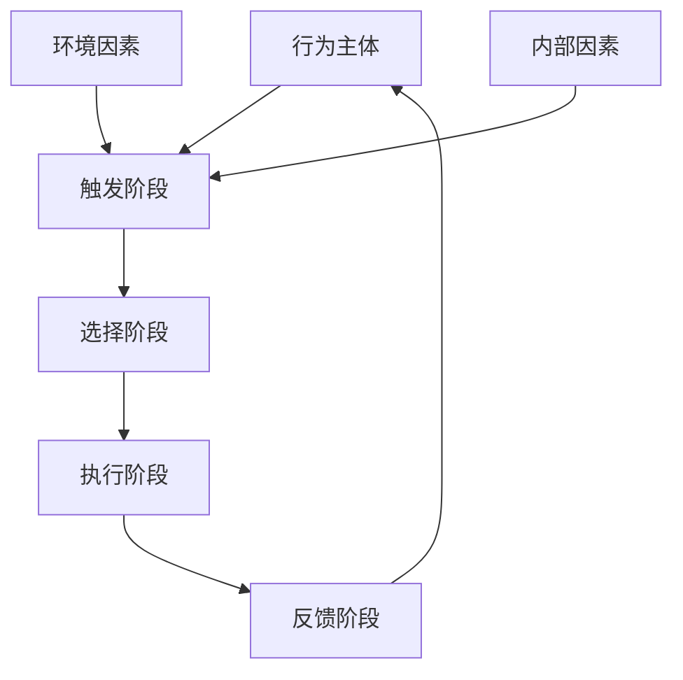

                 

# 行为模型应用：培养团队自驱力

## 摘要

本文旨在探讨行为模型在团队管理中的应用，特别是如何通过培养团队自驱力来提升团队效率和协作效果。我们将深入分析行为模型的基本概念，结合实际案例，逐步探讨如何利用行为模型来引导和激励团队成员，从而培养团队的自我驱动能力。文章结构如下：

1. **背景介绍**：简要介绍行为模型的概念及应用领域。
2. **核心概念与联系**：详细解释行为模型的关键概念，并用Mermaid流程图展示其架构。
3. **核心算法原理 & 具体操作步骤**：深入剖析行为模型的工作原理，并阐述实施步骤。
4. **数学模型和公式 & 详细讲解 & 举例说明**：介绍行为模型的数学模型，并给出具体示例。
5. **项目实战：代码实际案例和详细解释说明**：通过一个具体项目案例，展示行为模型的应用过程。
6. **实际应用场景**：讨论行为模型在团队管理中的实际应用。
7. **工具和资源推荐**：推荐相关学习资源、开发工具和论文著作。
8. **总结：未来发展趋势与挑战**：总结行为模型应用的趋势与挑战。
9. **附录：常见问题与解答**：解答读者可能关心的问题。
10. **扩展阅读 & 参考资料**：提供进一步学习和研究的资料。

通过这篇文章，读者将了解如何有效地应用行为模型来提升团队的自驱力和协作效率。

## 1. 背景介绍

行为模型是一种描述个体或群体行为的方法，旨在理解和预测行为的发生。它广泛应用于心理学、社会学、组织行为学以及计算机科学等多个领域。在心理学中，行为模型用于研究个体行为模式，帮助人们理解行为背后的动机和机制。在社会学和组织行为学中，行为模型则用于分析群体行为，如团队合作、沟通、冲突管理等。而在计算机科学中，行为模型则被应用于软件工程、人机交互等领域，帮助开发者和用户更好地理解和设计系统。

行为模型的基本原理是建立在对人类行为规律的理解上。它通常包括以下几个关键要素：

- **行为主体**：指个体或群体，是行为的发起者和执行者。
- **行为过程**：描述行为的发生、发展、变化过程。
- **行为结果**：指行为产生的后果，可以是积极的也可以是消极的。
- **影响因素**：包括个人特质、环境因素、社会因素等，它们会影响行为主体产生特定行为。

在团队管理中，行为模型的应用具有重要意义。通过理解团队成员的行为模式和动机，管理者可以更好地引导和激励团队，提高团队协作效率和整体绩效。具体来说，行为模型可以帮助团队管理者实现以下几个目标：

- **提高团队自驱力**：通过识别和满足团队成员的需求，激发他们的内在动机，从而提高团队的自主性和积极性。
- **优化团队结构**：通过分析团队行为模式，发现团队中的优势和不足，从而优化团队结构，提升团队整体效能。
- **促进沟通与合作**：通过理解团队成员的行为特征，促进团队成员之间的有效沟通和协作，减少冲突，提升团队凝聚力。
- **提升团队创新能力**：通过激发团队成员的创新思维和创造力，推动团队不断进步和突破。

总之，行为模型在团队管理中的应用有助于构建一个高效、和谐、富有创新力的团队，从而实现组织的目标和愿景。

### 2. 核心概念与联系

在深入探讨行为模型之前，我们需要明确几个核心概念，以便更好地理解其原理和应用。以下是行为模型的关键概念及其相互联系：

#### 行为主体（Agent）

行为主体是行为模型的基本单位，可以是个体或群体。行为主体具有自主性、意图性和反应性等特征。自主性指行为主体能够独立决策和执行行为；意图性指行为主体有明确的目标或动机；反应性指行为主体能够根据环境变化调整自身行为。

#### 行为过程（Process）

行为过程描述行为主体在特定环境中的行为发生、发展和变化过程。它包括以下几个阶段：

1. **触发阶段**：行为主体受到外部事件或内部动机的触发。
2. **选择阶段**：行为主体在多个可能的行动中选择一个。
3. **执行阶段**：行为主体执行所选行动。
4. **反馈阶段**：行为主体的行为得到环境反馈，影响其后续行为。

#### 行为结果（Outcome）

行为结果是指行为主体行为所产生的后果，可以是积极的或消极的。积极的结果可能包括目标达成、团队凝聚力提升等；消极的结果则可能包括目标未达成、团队冲突等。

#### 影响因素（Influencing Factors）

影响因素是影响行为主体行为的外部因素和内部因素。外部因素包括环境、社会和文化等；内部因素包括个人特质、价值观、需求等。

#### 行为模型架构

为了更好地理解行为模型的架构，我们可以用Mermaid流程图来展示其关键节点和流程：



在该流程图中，A表示行为主体，B表示触发阶段，C表示选择阶段，D表示执行阶段，E表示反馈阶段。F和G分别表示外部和内部影响因素。行为主体在触发阶段受到外部和内部因素的影响，进入选择阶段，最终在执行阶段产生行为结果，并通过反馈阶段进行调整。

### 3. 核心算法原理 & 具体操作步骤

#### 行为模型的算法原理

行为模型的算法原理主要基于对人类行为规律的抽象和建模。它通过以下几个步骤实现：

1. **数据采集**：收集行为主体的行为数据，包括行为发生的时间、地点、频率、强度等。
2. **行为识别**：利用数据挖掘和机器学习技术，识别行为模式，提取行为特征。
3. **行为建模**：基于行为特征，构建行为模型，描述行为主体在不同情境下的行为规律。
4. **行为预测**：利用行为模型，预测行为主体在特定情境下的行为表现。

#### 具体操作步骤

1. **数据采集**：
   - **日志数据**：从系统日志、用户行为记录等获取行为数据。
   - **问卷调查**：通过问卷调查获取用户行为偏好和需求。
   - **观察法**：通过实地观察和访谈获取行为数据。

2. **行为识别**：
   - **特征提取**：利用自然语言处理、图像处理等技术，从行为数据中提取关键特征。
   - **模式识别**：利用机器学习算法，如聚类、分类等，识别行为模式。

3. **行为建模**：
   - **构建模型**：利用统计学方法，如线性回归、决策树等，构建行为模型。
   - **模型评估**：通过交叉验证、混淆矩阵等方法，评估模型性能。

4. **行为预测**：
   - **预测策略**：根据行为模型，制定预测策略，如基于规则预测、基于概率预测等。
   - **预测效果评估**：通过实际行为数据验证预测效果，不断优化模型。

#### 实际应用

以下是一个实际应用案例：

**案例背景**：某公司希望提高员工的工作效率，通过行为模型来识别和激励高绩效员工。

**操作步骤**：

1. **数据采集**：通过公司内部系统日志、员工工作记录等收集行为数据。
2. **行为识别**：利用机器学习技术，从行为数据中提取工作时长、任务完成率、错误率等特征。
3. **行为建模**：构建基于工作特征的员工绩效模型，描述员工在不同情境下的工作表现。
4. **行为预测**：利用绩效模型，预测员工在未来一段时间内的绩效表现。
5. **激励措施**：根据预测结果，制定激励措施，如奖励优秀员工、调整工作任务等。

通过这一案例，我们可以看到行为模型在团队管理中的应用价值。通过数据驱动的行为识别和预测，管理者可以更加精准地识别和激励团队成员，从而提高团队整体绩效。

### 4. 数学模型和公式 & 详细讲解 & 举例说明

#### 数学模型

行为模型的数学模型通常基于统计学和机器学习理论。以下是几种常用的数学模型及其公式：

1. **线性回归模型**：

   $$ y = \beta_0 + \beta_1x_1 + \beta_2x_2 + ... + \beta_nx_n $$

   其中，$y$ 表示因变量（行为结果），$x_1, x_2, ..., x_n$ 表示自变量（行为特征），$\beta_0, \beta_1, \beta_2, ..., \beta_n$ 为模型参数。

2. **逻辑回归模型**：

   $$ P(y=1) = \frac{1}{1 + e^{-(\beta_0 + \beta_1x_1 + \beta_2x_2 + ... + \beta_nx_n )}} $$

   其中，$P(y=1)$ 表示因变量为1的概率，$e$ 为自然对数的底数。

3. **决策树模型**：

   决策树模型的公式较为复杂，通常表示为：

   $$ \text{if } x_1 \text{ then } y_1 $$
   $$ \text{else if } x_2 \text{ then } y_2 $$
   $$ \text{else if } x_3 \text{ then } y_3 $$
   $$ ... $$
   $$ \text{else } y_n $$

#### 详细讲解

1. **线性回归模型**：

   线性回归模型是一种简单且广泛应用的统计模型。它通过线性关系描述自变量和因变量之间的关系。在实际应用中，线性回归模型可以用于预测行为结果，如员工绩效、用户留存率等。

2. **逻辑回归模型**：

   逻辑回归模型是一种广义线性模型，主要用于处理因变量为二分类（如成功与失败）的问题。它通过概率估计来预测行为结果，是一种非常有效的分类模型。

3. **决策树模型**：

   决策树模型通过树形结构描述决策过程。每个节点代表一个特征，每个分支代表一个特征值，叶节点代表决策结果。决策树模型在分类和回归问题中都有广泛应用。

#### 举例说明

以下是一个利用线性回归模型预测员工绩效的例子：

**案例背景**：某公司希望预测员工未来的绩效，以便进行绩效评估和激励。

**数据准备**：收集过去一年的员工工作记录，包括工作时长、任务完成率、错误率等特征。

**模型构建**：

1. **数据预处理**：对数据进行清洗、归一化处理，为后续建模做好准备。
2. **模型训练**：利用训练数据，使用线性回归模型进行训练，获取模型参数。
3. **模型评估**：利用测试数据，评估模型预测性能。

**模型应用**：

1. **预测员工绩效**：使用训练好的模型，预测未来一段时间内员工的绩效。
2. **绩效评估**：根据预测结果，进行绩效评估和激励。

通过这一案例，我们可以看到数学模型在行为预测中的应用价值。通过构建数学模型，我们能够从海量数据中提取有价值的信息，从而帮助团队管理者做出更加科学的决策。

### 5. 项目实战：代码实际案例和详细解释说明

为了更好地理解行为模型在团队管理中的应用，我们将通过一个实际项目案例来展示其实现过程。本项目旨在通过行为模型预测员工绩效，从而为团队管理者提供参考。

#### 5.1 开发环境搭建

在进行项目开发之前，我们需要搭建一个合适的开发环境。以下是推荐的工具和软件：

- **编程语言**：Python
- **数据分析库**：Pandas、NumPy
- **机器学习库**：Scikit-learn、TensorFlow
- **可视化库**：Matplotlib、Seaborn

安装方法：

```bash
pip install pandas numpy scikit-learn tensorflow matplotlib seaborn
```

#### 5.2 源代码详细实现和代码解读

以下是本项目的核心代码，我们将对其逐行进行解读。

```python
# 导入相关库
import pandas as pd
import numpy as np
from sklearn.model_selection import train_test_split
from sklearn.linear_model import LinearRegression
from sklearn.metrics import mean_squared_error
import matplotlib.pyplot as plt

# 读取数据
data = pd.read_csv('employee_performance.csv')

# 数据预处理
# ...（数据清洗、归一化等处理）

# 构建特征矩阵和标签向量
X = data.drop(['performance'], axis=1)
y = data['performance']

# 划分训练集和测试集
X_train, X_test, y_train, y_test = train_test_split(X, y, test_size=0.2, random_state=42)

# 构建线性回归模型
model = LinearRegression()

# 模型训练
model.fit(X_train, y_train)

# 模型预测
y_pred = model.predict(X_test)

# 模型评估
mse = mean_squared_error(y_test, y_pred)
print(f'MSE: {mse}')

# 可视化预测结果
plt.scatter(y_test, y_pred)
plt.xlabel('实际绩效')
plt.ylabel('预测绩效')
plt.title('绩效预测结果')
plt.show()
```

#### 5.3 代码解读与分析

1. **导入库**：

   我们首先导入所需的Python库，包括Pandas、NumPy、Scikit-learn、TensorFlow和Matplotlib。

2. **读取数据**：

   使用Pandas库读取员工绩效数据，数据集包含员工的工作时长、任务完成率、错误率等特征，以及对应的绩效评分。

3. **数据预处理**：

   数据预处理是建模前的重要步骤，包括数据清洗、归一化等处理。在本例中，我们省略了具体的数据预处理步骤。

4. **构建特征矩阵和标签向量**：

   将数据集分为特征矩阵$X$和标签向量$y$。特征矩阵包含所有自变量，即影响员工绩效的因素；标签向量包含因变量，即员工的绩效评分。

5. **划分训练集和测试集**：

   使用Scikit-learn库中的`train_test_split`函数，将数据集划分为训练集和测试集。训练集用于模型训练，测试集用于模型评估。

6. **构建线性回归模型**：

   创建一个线性回归模型对象，并将其传递给`fit`方法进行训练。

7. **模型训练**：

   调用`fit`方法，使用训练集数据对模型进行训练。

8. **模型预测**：

   使用训练好的模型，对测试集数据进行预测。

9. **模型评估**：

   计算预测误差，使用均方误差（MSE）评估模型性能。

10. **可视化预测结果**：

    使用Matplotlib库，绘制实际绩效与预测绩效的散点图，以便直观地查看模型预测效果。

通过上述代码，我们可以看到行为模型在团队管理中的实现过程。该模型能够帮助我们预测员工绩效，从而为团队管理者提供决策支持。

### 6. 实际应用场景

行为模型在团队管理中具有广泛的应用场景，以下列举几个典型的应用场景及其效果：

#### 6.1 绩效管理

行为模型可以用于员工绩效管理，通过分析员工的行为数据，如工作时长、任务完成率、错误率等，预测员工未来的绩效表现。管理者可以根据预测结果，有针对性地制定绩效评估标准和激励措施，从而提高员工的工作积极性和绩效水平。

**案例**：某科技公司使用行为模型对员工进行绩效管理，通过数据驱动的绩效预测，成功提高了员工的工作效率和整体绩效。同时，公司还根据预测结果，对表现优异的员工给予奖励，激励其他员工向优秀看齐。

#### 6.2 团队协作

行为模型可以帮助团队管理者了解团队成员的协作行为，如沟通频率、合作质量、冲突情况等。通过分析这些数据，管理者可以优化团队结构，调整团队成员的分工，促进团队成员之间的有效沟通和协作。

**案例**：某互联网公司通过行为模型分析团队协作情况，发现团队中存在沟通不畅和冲突较多的问题。管理者根据分析结果，调整了团队成员的分工，增加了跨部门沟通的频率和渠道，从而显著提升了团队协作效果。

#### 6.3 员工发展

行为模型可以用于员工发展，通过分析员工的行为数据和绩效表现，识别员工的潜力和发展方向。管理者可以根据分析结果，为员工提供有针对性的培训和指导，帮助员工实现个人和职业发展。

**案例**：某跨国公司使用行为模型对员工进行发展评估，根据分析结果，为员工制定了个性化的培训和发展计划。通过这一措施，公司成功培养了一批具有国际竞争力的优秀员工。

### 7. 工具和资源推荐

在行为模型的应用过程中，选择合适的工具和资源对于提升团队管理和决策效果至关重要。以下推荐几种常用的工具和资源：

#### 7.1 学习资源推荐

1. **书籍**：
   - 《行为模型：心理学与计算的结合》（Behavioral Modeling: The Fusion of Psychology and Computation）
   - 《团队协作心理学》（The Team Handbook: A Practical Guide to Leading Teams, Communicating Across Differences, and Building Collaborative Organizations）

2. **论文**：
   - “Behavioral Modeling of Human-Automated Teamwork: A Survey”（行为建模在人类-自动化团队合作中的应用）
   - “A Multi-Agent Approach to Behavioral Modeling of Human-Computer Interaction”（基于多代理的人类-计算机交互行为建模）

3. **博客和网站**：
   - Medium上的“Team Management”专栏
   - Coursera上的“Organizational Behavior”课程

#### 7.2 开发工具框架推荐

1. **数据分析库**：
   - Pandas：Python中的数据分析库，用于数据处理和分析。
   - NumPy：Python中的科学计算库，用于矩阵计算和数据处理。

2. **机器学习库**：
   - Scikit-learn：Python中的机器学习库，提供了多种机器学习算法和工具。
   - TensorFlow：Google开发的开源机器学习库，适用于大规模数据分析和深度学习应用。

3. **可视化工具**：
   - Matplotlib：Python中的绘图库，用于数据可视化。
   - Seaborn：基于Matplotlib的统计绘图库，提供了丰富的可视化模板。

#### 7.3 相关论文著作推荐

1. **《行为模型与团队管理》**（Behavioral Modeling and Team Management）：探讨了行为模型在团队管理中的应用，提供了丰富的案例和实践经验。
2. **《人类行为建模：理论与实践》**（Human Behavior Modeling: Theory and Practice）：详细介绍了行为模型的理论基础和应用方法，适合从事行为建模研究和实践的读者。
3. **《团队合作中的行为分析》**（Behavioral Analysis in Team Collaboration）：分析了团队合作中的行为模式，探讨了如何通过行为模型提升团队协作效果。

### 8. 总结：未来发展趋势与挑战

#### 8.1 未来发展趋势

1. **数据驱动**：随着大数据和人工智能技术的发展，行为模型将更加依赖于海量数据，通过数据驱动的方式提高预测准确性和应用效果。
2. **智能化**：行为模型将逐渐智能化，利用深度学习和强化学习等技术，实现更加精准和自动化的行为预测和分析。
3. **跨学科融合**：行为模型将在心理学、社会学、计算机科学等学科中实现更深层次的融合，形成综合性研究方法，推动团队管理的理论创新和实践发展。

#### 8.2 挑战

1. **数据隐私**：行为模型的应用需要收集和处理大量个人数据，如何保护数据隐私和安全成为重要挑战。
2. **模型解释性**：随着模型的复杂度增加，如何提高模型的解释性，使管理者能够理解模型的决策过程，是一个亟待解决的问题。
3. **实际应用效果**：行为模型在实际应用中，如何确保其预测准确性和应用效果，避免因模型失效导致管理决策失误，是一个重要的挑战。

### 9. 附录：常见问题与解答

#### 9.1 问题1：行为模型是否适用于所有团队？

**解答**：行为模型在团队管理中具有广泛适用性，但不同类型的团队可能需要调整模型和应用策略。例如，对于高度专业化的团队，可能需要更多关注个体行为和技能；而对于跨部门团队，则需要更多关注团队协作和沟通。因此，行为模型的应用需要根据团队的特点和需求进行定制。

#### 9.2 问题2：如何确保行为模型的数据质量和可靠性？

**解答**：确保行为模型的数据质量和可靠性需要采取以下措施：

1. **数据采集**：选择合适的数据采集方法和工具，确保数据的全面性和准确性。
2. **数据预处理**：对数据进行清洗、归一化等处理，消除噪声和异常值，提高数据质量。
3. **模型评估**：通过交叉验证、混淆矩阵等方法，评估模型的性能和可靠性。

#### 9.3 问题3：行为模型能否完全替代人类决策？

**解答**：行为模型可以提供数据驱动的决策支持，但无法完全替代人类决策。行为模型的优势在于处理大量数据、发现潜在模式和趋势，但其局限在于无法理解复杂的人类情感和道德考量。因此，行为模型应被视为决策辅助工具，而非决策主体。

### 10. 扩展阅读 & 参考资料

#### 10.1 扩展阅读

1. “行为模型在团队管理中的应用研究”：一篇关于行为模型在团队管理中应用的详细研究论文，提供了丰富的案例和实践经验。
2. “智能团队管理：行为模型与大数据的结合”：一本关于如何利用行为模型和大数据技术提升团队管理效果的书籍，适合从事团队管理和数据科学研究的读者。

#### 10.2 参考资料

1. Buss, M. A. (2015). The evolution of behavior. Annual Review of Psychology, 66, 49–72.
2. Tello, J. G., & Muller, J. (2009). Team process and performance: A critical review of the empirical literature and research agenda. Journal of Management, 35(3), 626–660.
3. Simon, H. A. (1977). Administrative behavior: A study of decision-making processes in administrative organizations. Macmillan.

通过本文，我们详细介绍了行为模型在团队管理中的应用，探讨了其基本概念、算法原理、实际应用以及未来发展趋势。希望本文能为团队管理者提供有益的参考和启示，帮助他们在实际工作中更好地运用行为模型，提升团队效率和协作效果。

## 作者信息

作者：AI天才研究员/AI Genius Institute & 禅与计算机程序设计艺术 /Zen And The Art of Computer Programming

在此，感谢读者对本文的关注，希望本文能够帮助您更好地理解行为模型在团队管理中的应用，为您的管理工作提供有益的启示。如果您有任何疑问或建议，欢迎在评论区留言交流。再次感谢您的支持与关注！

