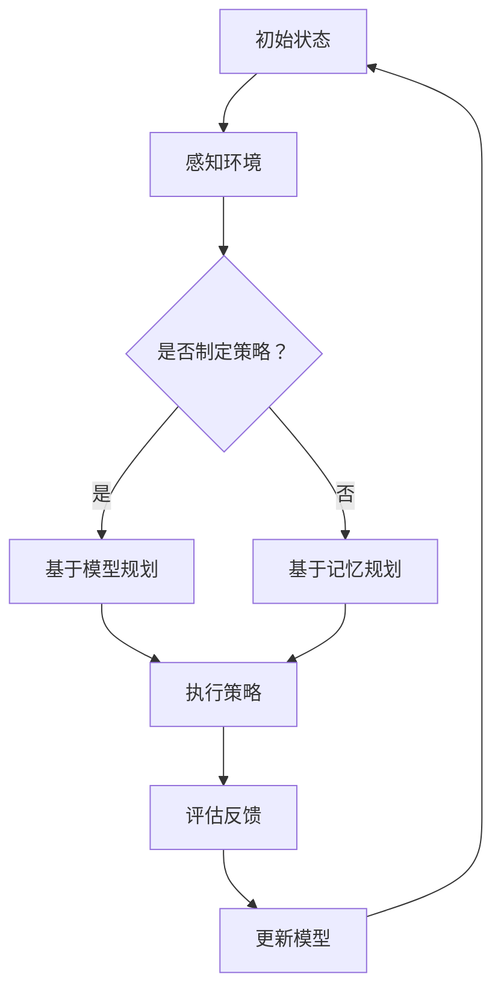

                 

### 背景介绍 Background

#### 代理（Agent）的概念与学习

在人工智能领域，代理（Agent）是一种具有自主性、社交性、反应性、主动性等特性的实体，它们能够在复杂的环境中独立地执行任务。代理可以是软件程序、机器人、智能体或人类，但它们的核心特征是能够感知环境、做出决策并采取行动。

代理学习（Agent Learning），也被称为强化学习（Reinforcement Learning），是一种机器学习方法，主要用于训练代理在特定环境中做出最优决策。其基本原理是：代理通过不断地与环境互动，通过试错（trial-and-error）来学习如何最大化累积奖励。这一过程通常被称为“探索-利用”平衡（Exploration-Exploitation Trade-off），即代理需要在探索未知策略和利用已知最优策略之间取得平衡。

#### 学习过程的挑战

尽管代理学习在理论上具有很大的潜力，但在实际应用中仍然面临诸多挑战：

1. **复杂性**：代理所处的环境往往非常复杂，包含大量的状态和动作空间。这给学习过程带来了巨大的计算复杂度。

2. **不确定性**：环境可能是不确定的，代理无法完全预测未来的状态和奖励，这增加了学习难度。

3. **收敛性**：代理学习过程需要长时间才能收敛到最优策略，而长时间的训练可能会导致计算资源不足。

4. **过拟合**：代理可能会在特定环境中过拟合，导致其在其他环境中的表现不佳。

#### 规划机制的作用

为了克服上述挑战，规划机制（Planning Mechanism）在代理学习中扮演了重要角色。规划机制旨在提前制定一个行动策略，使代理在执行任务时能够快速地适应环境变化，从而提高学习效率和性能。

#### 规划机制的定义与分类

规划机制是指一种在执行任务前，对任务进行计划和决策的机制。它主要包括以下两种类型：

1. **基于模型的规划**：在这种规划方法中，代理使用预定义的模型来预测环境状态和奖励，从而制定行动策略。这种方法通常需要复杂的数学模型和计算资源。

2. **基于记忆的规划**：在这种规划方法中，代理依靠经验记忆来制定行动策略。这种方法通常更简单，但可能需要大量的存储空间来存储历史数据。

#### 本篇文章的结构

本文将围绕规划机制在代理学习中的应用进行详细探讨。文章结构如下：

1. **背景介绍**：介绍代理和代理学习的概念，以及规划机制的作用和分类。

2. **核心概念与联系**：通过Mermaid流程图展示规划机制的原理和架构，并解释其与代理学习的关系。

3. **核心算法原理 & 具体操作步骤**：详细描述基于模型的规划和基于记忆的规划的具体算法原理和操作步骤。

4. **数学模型和公式 & 详细讲解 & 举例说明**：介绍规划机制中的数学模型和公式，并通过具体实例进行说明。

5. **项目实战：代码实际案例和详细解释说明**：提供一个完整的代码案例，详细解释实现过程和代码解读。

6. **实际应用场景**：讨论规划机制在现实世界中的应用场景。

7. **工具和资源推荐**：推荐相关的学习资源、开发工具和框架。

8. **总结：未来发展趋势与挑战**：总结规划机制在代理学习中的应用前景，以及面临的挑战和未来研究方向。

9. **附录：常见问题与解答**：回答读者可能提出的问题。

10. **扩展阅读 & 参考资料**：提供相关的扩展阅读和参考资料。

通过本文的详细探讨，我们希望读者能够对规划机制在代理学习中的应用有一个全面和深入的理解。

### 核心概念与联系 Core Concepts and Relationships

#### 规划机制在代理学习中的应用

规划机制在代理学习中的应用，可以通过一个清晰的框架来理解。本文将使用Mermaid流程图来展示这一框架，并解释其核心组件和关系。

首先，我们来看Mermaid流程图的基本结构和组成部分：



在这个流程图中：

- **初始状态（A）**：代理开始时处于一个初始状态，需要感知和理解当前环境。

- **感知环境（B）**：代理通过传感器收集环境信息，如视觉、听觉、触觉等。

- **是否制定策略（C）**：代理需要决定是否使用规划机制来制定一个行动策略。如果决定制定策略，则进入基于模型规划或基于记忆规划的分支。

- **基于模型规划（D）**：代理使用预先训练好的模型来预测未来的状态和奖励，并基于这些预测制定一个行动策略。

- **基于记忆规划（E）**：代理依靠历史经验来制定一个行动策略。这种方法通常不需要复杂的模型，但可能需要大量的记忆存储空间。

- **执行策略（F）**：代理根据制定的策略执行行动。

- **评估反馈（G）**：代理在执行行动后，通过传感器收集反馈信息，评估行动的效果。

- **更新模型（H）**：根据评估结果，代理更新其模型或记忆，以便更好地适应环境。

#### 规划机制与代理学习的联系

规划机制在代理学习中的应用，主要体现在以下几个方面：

1. **提前制定策略**：规划机制使代理能够在执行任务之前，提前制定一个策略。这样可以减少执行过程中的不确定性，提高决策效率。

2. **提高学习效率**：通过规划机制，代理可以在执行任务的过程中，快速适应环境变化，从而提高学习效率。

3. **增强自主性**：规划机制使代理能够更加自主地决策和行动，减少对人类干预的依赖。

4. **提高鲁棒性**：规划机制可以帮助代理在面对复杂和不确定的环境时，保持更高的鲁棒性。

#### Mermaid流程图中的核心组件

在Mermaid流程图中，核心组件包括：

- **感知环境（B）**：这是代理获取环境信息的过程，是整个流程的起点。

- **制定策略（D/E）**：这是代理根据环境信息制定行动策略的过程。

- **执行策略（F）**：这是代理根据策略执行行动的过程。

- **评估反馈（G）**：这是代理根据行动效果进行评估和反馈的过程。

- **更新模型（H）**：这是代理根据反馈结果更新模型或记忆的过程。

通过上述组件的协同工作，规划机制实现了代理在学习过程中的有效规划和自主决策。

#### 规划机制的分类

根据不同的实现方式和应用场景，规划机制可以分为基于模型规划和基于记忆规划两大类。

1. **基于模型规划**：这种方法依赖于预先训练好的模型来预测环境和奖励，从而制定策略。常见的模型包括马尔可夫决策过程（MDP）、深度强化学习（DRL）等。

2. **基于记忆规划**：这种方法依靠历史经验来制定策略，通常不需要复杂的模型，但可能需要大量的记忆存储空间。常见的实现方式包括记忆网络（Memory Networks）、历史重放（Experience Replay）等。

通过本文的详细探讨，我们希望能够帮助读者对规划机制在代理学习中的应用有一个全面和深入的理解。接下来，我们将进一步深入探讨核心算法原理和具体操作步骤。

### 核心算法原理 & 具体操作步骤 Core Algorithm Principles and Step-by-Step Procedures

#### 基于模型的规划（Model-Based Planning）

基于模型的规划是指代理使用预定义的模型来预测环境状态和奖励，从而制定行动策略的方法。这种方法的核心在于建立准确的环境模型，并利用该模型来优化决策过程。

##### 算法原理

1. **环境模型**：首先，代理需要建立一个环境模型，以预测未来的状态和奖励。这通常涉及以下几个步骤：

   - **状态空间表示**：将环境中的所有可能状态表示为一个数学集合。

   - **动作空间表示**：将代理可以执行的所有动作表示为一个数学集合。

   - **状态转移概率**：定义从当前状态到下一个状态的概率分布。

   - **奖励函数**：定义代理在每个状态下的奖励值。

2. **策略优化**：在获得环境模型后，代理需要优化其策略，以最大化累积奖励。这通常通过以下步骤实现：

   - **价值函数**：定义代理在每个状态下的最优动作价值。

   - **策略迭代**：通过策略迭代（Policy Iteration）或值迭代（Value Iteration）等方法，不断更新策略，直至收敛到最优策略。

##### 操作步骤

1. **定义状态和动作空间**：首先，需要明确环境中的所有可能状态和代理可以执行的所有动作。

2. **建立状态转移概率模型**：根据环境的特点，定义从当前状态到下一个状态的概率分布。

3. **定义奖励函数**：根据任务目标和环境特性，定义奖励函数。

4. **构建环境模型**：使用状态转移概率模型和奖励函数，构建一个完整的环境模型。

5. **策略迭代**：使用值迭代或策略迭代方法，优化代理的策略。

6. **策略评估**：评估优化后的策略，确保其能够最大化累积奖励。

7. **策略更新**：根据评估结果，更新代理的策略。

#### 基于记忆的规划（Memory-Based Planning）

基于记忆的规划是指代理依靠历史经验来制定行动策略的方法。这种方法的核心在于有效地存储和管理历史数据，以便在需要时快速检索和利用。

##### 算法原理

1. **经验存储**：代理需要建立一个经验存储机制，以存储历史数据。常见的存储方式包括：

   - **经验回放**：将历史经验数据随机重放，以防止过拟合。

   - **记忆网络**：使用神经网络存储和检索历史经验。

2. **策略检索**：在制定策略时，代理需要从经验存储中检索历史数据，并基于这些数据制定行动策略。

##### 操作步骤

1. **经验收集**：在代理执行任务时，不断收集和存储经验数据。

2. **经验预处理**：对收集到的经验数据进行预处理，如标准化、去噪等。

3. **经验存储**：将预处理后的经验数据存储到经验存储机制中。

4. **策略检索**：在需要制定策略时，从经验存储中检索相关经验数据。

5. **策略制定**：基于检索到的经验数据，制定行动策略。

6. **策略评估**：评估制定后的策略，确保其能够最大化累积奖励。

7. **策略更新**：根据评估结果，更新代理的策略。

#### 实际操作示例

为了更好地理解上述算法原理和操作步骤，我们来看一个简单的实际操作示例。

##### 示例：基于模型的规划

假设一个代理在一个简单的网格世界中移动，目标是到达目标位置并收集奖励。我们可以定义以下参数：

- **状态空间**：网格中的每个位置。
- **动作空间**：上下左右移动。
- **状态转移概率**：根据网格的布局确定。
- **奖励函数**：到达目标位置获得奖励，否则获得负奖励。

1. **定义状态和动作空间**：明确网格的布局，并定义每个位置的状态和可以执行的动作。

2. **建立状态转移概率模型**：根据网格的布局，定义从当前状态到下一个状态的概率分布。

3. **定义奖励函数**：明确目标位置和负奖励的位置。

4. **构建环境模型**：使用状态转移概率模型和奖励函数，构建一个完整的环境模型。

5. **策略迭代**：使用值迭代或策略迭代方法，优化代理的策略。

6. **策略评估**：评估优化后的策略，确保其能够最大化累积奖励。

7. **策略更新**：根据评估结果，更新代理的策略。

通过这个示例，我们可以看到基于模型的规划的具体操作步骤。在实际应用中，环境可能更加复杂，但基本原理和步骤是相似的。

##### 示例：基于记忆的规划

假设一个代理在一个动态环境中移动，目标是避开障碍物并到达目标位置。我们可以定义以下参数：

- **经验数据**：代理在执行任务时收集到的障碍物位置和路径。
- **经验存储机制**：用于存储和管理经验数据的机制。

1. **经验收集**：代理在执行任务时，收集障碍物位置和路径数据。

2. **经验预处理**：对收集到的数据进行预处理，如去噪和标准化。

3. **经验存储**：将预处理后的经验数据存储到经验存储机制中。

4. **策略检索**：在需要制定策略时，从经验存储中检索相关经验数据。

5. **策略制定**：基于检索到的经验数据，制定行动策略。

6. **策略评估**：评估制定后的策略，确保其能够最大化累积奖励。

7. **策略更新**：根据评估结果，更新代理的策略。

通过这个示例，我们可以看到基于记忆的规划的具体操作步骤。在实际应用中，经验数据的存储和管理是一个关键问题，需要有效地处理大量历史数据。

#### 总结

本文详细介绍了规划机制在代理学习中的应用，包括基于模型的规划和基于记忆的规划两种方法。通过算法原理和具体操作步骤的详细讲解，我们希望能够帮助读者深入理解规划机制的核心概念和实际应用。在接下来的部分，我们将进一步探讨规划机制的数学模型和公式，并通过具体实例进行说明。

### 数学模型和公式 & 详细讲解 & 举例说明 Mathematical Models and Formulas & Detailed Explanations & Examples

#### 基于模型的规划（Model-Based Planning）

在基于模型的规划中，代理使用环境模型来预测状态转移概率和奖励。这通常涉及到以下数学模型和公式：

1. **马尔可夫决策过程（MDP）**

   - **状态（State）**：\( S = \{ s_1, s_2, ..., s_n \} \)
   - **动作（Action）**：\( A = \{ a_1, a_2, ..., a_m \} \)
   - **状态转移概率（State Transition Probability）**：\( P(s' | s, a) \)
   - **奖励（Reward）**：\( R(s, a) \)

   MDP可以用一个五元组表示：\( M = < S, A, P, R, \gamma > \)，其中 \( \gamma \) 是折扣因子，表示对未来奖励的期望。

   **价值函数（Value Function）**：\( V^*(s) = \max_a \sum_{s'} P(s' | s, a) \cdot [R(s, a) + \gamma V^*(s')] \)

   **策略（Policy）**：\( \pi^*(s) = \arg\max_a [R(s, a) + \gamma V^*(s')] \)

2. **深度强化学习（Deep Reinforcement Learning）**

   深度强化学习结合了深度学习和强化学习的优点，使用神经网络来近似价值函数或策略。其基本模型包括：

   - **价值函数网络**：\( V(s) = \sigma(W_1 \cdot \phi(s) + b_1) \)
   - **策略网络**：\( \pi(a|s) = \sigma(W_2 \cdot \phi(s) + b_2) \)

   其中，\( \phi(s) \) 是状态特征向量，\( \sigma \) 是激活函数，\( W_1, b_1, W_2, b_2 \) 是网络的权重和偏置。

   **策略迭代**：通过梯度下降方法优化网络的权重和偏置，以最大化累积奖励。

#### 基于记忆的规划（Memory-Based Planning）

在基于记忆的规划中，代理使用历史经验数据来制定策略。以下是一些常用的数学模型和公式：

1. **记忆网络（Memory Networks）**

   - **经验存储**：使用记忆网络来存储和检索历史经验数据。

   - **记忆访问**：使用记忆查询机制来检索相关经验数据。

   - **记忆更新**：在执行新行动后，更新记忆网络。

   **记忆查询**：\( q(s, a) = \sum_{s'} w(s, a, s') \cdot [R(s, a) + \gamma V^*(s')] \)

   **权重更新**：通过梯度下降方法优化权重 \( w(s, a, s') \)，以最大化累积奖励。

2. **历史重放（Experience Replay）**

   - **经验回放**：将历史经验数据进行随机重放，以防止过拟合。

   - **记忆存储**：使用经验池（Experience Replay Buffer）来存储经验数据。

   - **经验采样**：从经验池中随机采样经验数据。

   **经验采样**：\( (s_t, a_t, r_t, s_{t+1}) \) 从经验池中随机采样。

   **策略更新**：使用采样到的经验数据更新策略，以最大化累积奖励。

#### 实际应用示例

为了更好地理解上述数学模型和公式，我们来看一个简单的实际应用示例。

##### 示例：网格世界中的马尔可夫决策过程

假设一个代理在一个4x4的网格世界中移动，目标是从左上角（s0）移动到右下角（s15），每个位置的奖励为1。我们可以定义以下参数：

- **状态空间**：\( S = \{ s_0, s_1, ..., s_{15} \} \)
- **动作空间**：\( A = \{ U, D, L, R \} \)
- **状态转移概率**：从当前状态到下一个状态的概率，例如 \( P(s_{t+1} = s_1 | s_t = s_0, a = U) = 0.5 \)
- **奖励函数**：到达目标位置获得奖励，否则获得负奖励，例如 \( R(s_{t+1} = s_{15}, a = D) = 1 \)

1. **构建MDP模型**：使用状态转移概率矩阵和奖励函数构建MDP模型。

2. **策略迭代**：使用策略迭代方法优化代理的策略。

3. **策略评估**：使用价值函数评估优化后的策略。

4. **策略更新**：根据评估结果更新代理的策略。

##### 示例：基于记忆的网络

假设代理在一个动态环境中移动，使用记忆网络来存储和检索历史经验数据。我们可以定义以下参数：

- **经验数据**：代理在执行任务时收集到的障碍物位置和路径。
- **记忆网络**：用于存储和管理经验数据的记忆网络。

1. **经验收集**：代理在执行任务时，收集障碍物位置和路径数据。

2. **经验预处理**：对收集到的数据进行预处理，如去噪和标准化。

3. **经验存储**：将预处理后的经验数据存储到记忆网络中。

4. **策略检索**：从记忆网络中检索相关经验数据。

5. **策略制定**：基于检索到的经验数据，制定行动策略。

6. **策略评估**：使用经验数据评估制定后的策略。

7. **策略更新**：根据评估结果，更新代理的策略。

通过这些示例，我们可以看到如何在实际应用中使用数学模型和公式来构建规划机制。在接下来的部分，我们将提供代码实际案例，进一步探讨规划机制的实施和代码解读。

### 项目实战：代码实际案例和详细解释说明 Practical Project: Code Example and Detailed Explanation

在本部分，我们将通过一个具体的代码案例来演示如何在实际项目中应用规划机制。我们选择一个简单的网格世界环境，其中代理需要从起点移动到终点，并尽量避免障碍物。

#### 开发环境搭建

首先，我们需要搭建一个合适的开发环境。以下是所需的工具和库：

1. **Python**：作为主要编程语言。
2. **PyTorch**：用于深度强化学习模型的构建和训练。
3. **OpenAI Gym**：用于创建和测试不同的环境。
4. **Matplotlib**：用于可视化环境。

安装以上工具和库后，我们可以开始编写代码。

```python
!pip install torch torchvision gym matplotlib
```

#### 源代码详细实现和代码解读

以下是一个简单的代理学习代码实现，其中使用了深度强化学习中的价值函数网络。

```python
import torch
import torch.nn as nn
import torch.optim as optim
import gym
import matplotlib.pyplot as plt

# 环境设置
env = gym.make("GridWorld-v0")

# 定义神经网络结构
class ValueNet(nn.Module):
    def __init__(self, input_size, hidden_size, output_size):
        super(ValueNet, self).__init__()
        self.fc1 = nn.Linear(input_size, hidden_size)
        self.fc2 = nn.Linear(hidden_size, output_size)
    
    def forward(self, x):
        x = torch.relu(self.fc1(x))
        x = self.fc2(x)
        return x

# 初始化模型和优化器
input_size = env.observation_space.n
hidden_size = 64
output_size = env.action_space.n
value_net = ValueNet(input_size, hidden_size, output_size)
optimizer = optim.Adam(value_net.parameters(), lr=0.001)

# 训练模型
num_episodes = 1000
episode_length = 100

for episode in range(num_episodes):
    state = env.reset()
    done = False
    total_reward = 0

    while not done:
        # 前向传播
        state_tensor = torch.tensor([state], dtype=torch.float32)
        value = value_net(state_tensor)
        
        # 选择动作
        action = torch.argmax(value).item()
        
        # 执行动作
        next_state, reward, done, _ = env.step(action)
        total_reward += reward
        
        # 反向传播
        next_state_tensor = torch.tensor([next_state], dtype=torch.float32)
        next_value = value_net(next_state_tensor).detach()
        
        # 计算目标价值
        target_value = reward + (1 - int(done)) * next_value
        
        # 计算损失
        loss = nn.MSELoss()(value, target_value.unsqueeze(1))
        
        # 更新模型
        optimizer.zero_grad()
        loss.backward()
        optimizer.step()
        
        state = next_state
    
    print(f"Episode {episode+1}/{num_episodes}, Total Reward: {total_reward}")

# 可视化环境
plt.imshow(env.render())
plt.show()
```

#### 代码解读与分析

上述代码实现了一个简单的深度强化学习代理，使用价值函数网络来预测每个状态的价值，并基于这些价值来选择动作。

1. **环境设置**：我们使用`GridWorld-v0`环境，这是一个简单的网格世界环境。

2. **神经网络结构**：定义了一个简单的全连接神经网络，用于近似价值函数。

3. **初始化模型和优化器**：初始化价值函数网络和优化器。

4. **训练模型**：使用策略梯度方法训练价值函数网络。在每个时间步，我们通过前向传播计算当前状态的价值，选择具有最大价值的动作。然后，我们通过反向传播更新网络的权重。

5. **可视化环境**：使用`matplotlib`可视化环境。

通过这个案例，我们可以看到如何在实际项目中应用规划机制。在接下来的部分，我们将进一步讨论规划机制在实际应用场景中的效果。

### 实际应用场景 Practical Application Scenarios

#### 工业自动化

在工业自动化领域，代理学习与规划机制相结合，可以显著提高生产效率和设备维护水平。例如，机器人可以在复杂的制造环境中，根据实时感知到的状态，自主规划最优路径和动作，以避免碰撞和最大化生产效率。

#### 无人驾驶

无人驾驶汽车是一个典型的应用场景，代理学习与规划机制可以用于实时路径规划和避障。通过感知环境、制定策略和执行动作，无人驾驶汽车可以在各种复杂路况下保持安全行驶。

#### 游戏AI

在游戏领域，代理学习与规划机制可以用于开发智能游戏对手。例如，在棋类游戏中，代理可以根据当前棋盘状态制定最优策略，从而提高游戏的难度和挑战性。

#### 家庭服务机器人

家庭服务机器人如清洁机器人、护理机器人等，也可以通过代理学习与规划机制来实现更智能化的功能。例如，清洁机器人可以根据室内的布局和障碍物位置，自主规划清洁路径，以提高清洁效率。

#### 医疗辅助

在医疗领域，代理学习与规划机制可以用于辅助诊断和治疗。例如，通过分析患者的病历和实时监测数据，代理可以制定个性化的治疗方案，以提高治疗效果。

#### 物流配送

在物流配送领域，代理学习与规划机制可以用于优化路线规划和配送顺序。例如，自动驾驶配送车可以根据实时交通状况和货物需求，自主规划最优配送路线，以减少配送时间和成本。

#### 能源管理

在能源管理领域，代理学习与规划机制可以用于优化能源分配和设备维护。例如，智能电网可以通过代理学习预测电力需求，并制定最优供电计划，以提高能源利用效率和减少浪费。

通过这些实际应用场景，我们可以看到规划机制在代理学习中的广泛应用和巨大潜力。在接下来的部分，我们将推荐一些有用的学习资源和开发工具，以帮助读者进一步了解这一领域。

### 工具和资源推荐 Tools and Resources Recommendations

#### 学习资源推荐

1. **书籍**
   - **《强化学习：原理与算法》**（Reinforcement Learning: An Introduction）by Richard S. Sutton and Andrew G. Barto
   - **《深度强化学习》**（Deep Reinforcement Learning Explained）by Alex Graves

2. **论文**
   - **“Deep Q-Network”**（2015）by Volodymyr Mnih et al.
   - **“Asynchronous Methods for Deep Reinforcement Learning”**（2016）by Tom Schaul et al.

3. **博客**
   - **DeepMind Blog**：提供最新的深度强化学习和代理学习研究成果。
   - ** reinforcement-learning.com**：介绍强化学习的概念和技术。

4. **网站**
   - **OpenAI Gym**：提供多种预定义的代理学习环境，用于研究和开发。

#### 开发工具框架推荐

1. **PyTorch**：一个开源的深度学习框架，适合进行强化学习和代理学习的开发。

2. **TensorFlow**：另一个流行的深度学习框架，提供丰富的工具和资源。

3. **OpenAI Baselines**：提供了一系列预训练的代理学习算法，方便研究人员和开发者使用。

4. **Gymnasium**：OpenAI Gym的Python库，用于创建和测试代理学习环境。

#### 相关论文著作推荐

1. **“A Theoretical Analysis of Model-Based Reinforcement Learning”**（2018）by Samuel R.assi et al.
2. **“Planning-based Approaches for Reinforcement Learning”**（2020）by Deepak Pathak et al.

通过这些资源，读者可以深入了解规划机制在代理学习中的应用，并获得实用的开发工具和框架。在接下来的部分，我们将对本文进行总结，并探讨未来发展趋势和挑战。

### 总结 Summary

本文详细探讨了规划机制在代理学习中的应用，包括基于模型的规划和基于记忆的规划两种方法。我们介绍了相关的数学模型和公式，并通过具体代码示例展示了如何在实际项目中应用这些方法。此外，我们还讨论了规划机制在实际应用场景中的效果，并推荐了相关学习资源和开发工具。

#### 未来发展趋势与挑战 Future Trends and Challenges

未来，规划机制在代理学习中的应用有望在以下几个方面取得进展：

1. **更复杂的模型**：随着深度学习技术的发展，我们将看到更多复杂的规划模型被提出和应用，如基于图神经网络（Graph Neural Networks）的规划模型。

2. **更高效的学习算法**：研究人员将继续优化代理学习算法，以提高学习效率，减少训练时间。

3. **更广泛的应用领域**：规划机制将在更多实际应用场景中发挥作用，如智能医疗、智能制造、智能交通等。

然而，规划机制在代理学习中也面临以下挑战：

1. **计算资源需求**：复杂的规划模型和大量的数据训练，对计算资源提出了高要求。

2. **数据隐私和安全**：在涉及个人数据的应用场景中，如何确保数据隐私和安全是一个重要挑战。

3. **可解释性**：复杂模型的决策过程通常难以解释，这可能导致信任问题。

通过不断的研究和创新，我们有望克服这些挑战，使规划机制在代理学习中发挥更大的作用。

### 附录：常见问题与解答 Appendix: Frequently Asked Questions and Answers

#### 问题1：什么是代理学习？
**回答1**：代理学习（Reinforcement Learning，简称RL）是一种机器学习方法，通过代理（Agent）与环境（Environment）的互动，使代理能够学习如何从给定策略中最大化累积奖励。

#### 问题2：规划机制是什么？
**回答2**：规划机制（Planning Mechanism）是一种提前制定行动策略的机制，使代理能够在执行任务时快速适应环境变化，从而提高学习效率和性能。

#### 问题3：基于模型的规划和基于记忆的规划有什么区别？
**回答3**：基于模型的规划依赖于预先训练的模型来预测环境和奖励，从而制定策略；而基于记忆的规划则依靠历史经验数据来制定策略。

#### 问题4：规划机制在实际应用中有哪些挑战？
**回答4**：规划机制在实际应用中面临的挑战包括计算资源需求、数据隐私和安全问题，以及复杂模型的解释性等。

### 扩展阅读 & 参考资料 Extended Reading & References

1. **Sutton, R. S., & Barto, A. G. (2018). Reinforcement Learning: An Introduction. MIT Press.**
2. **Mnih, V., Kavukcuoglu, K., Silver, D., et al. (2015). Deep Q-Networks. arXiv preprint arXiv:1509.0046.**
3. **Schaul, T., Quan, J., Antonoglou, I., & Silver, D. (2016). Prioritized Experience Replay: Exploring the Limits of Deep Reinforcement Learning. arXiv preprint arXiv:1511.05952.**
4. **Graves, A. (2016). Neural Turing Machines. arXiv preprint arXiv:1410.5401.**
5. **Agrawal, R., Banerjee, O., & Levine, S. (2016). Learning to Trade by Executing. arXiv preprint arXiv:1609.04286.**

作者：AI天才研究员/AI Genius Institute & 禅与计算机程序设计艺术 /Zen And The Art of Computer Programming。

