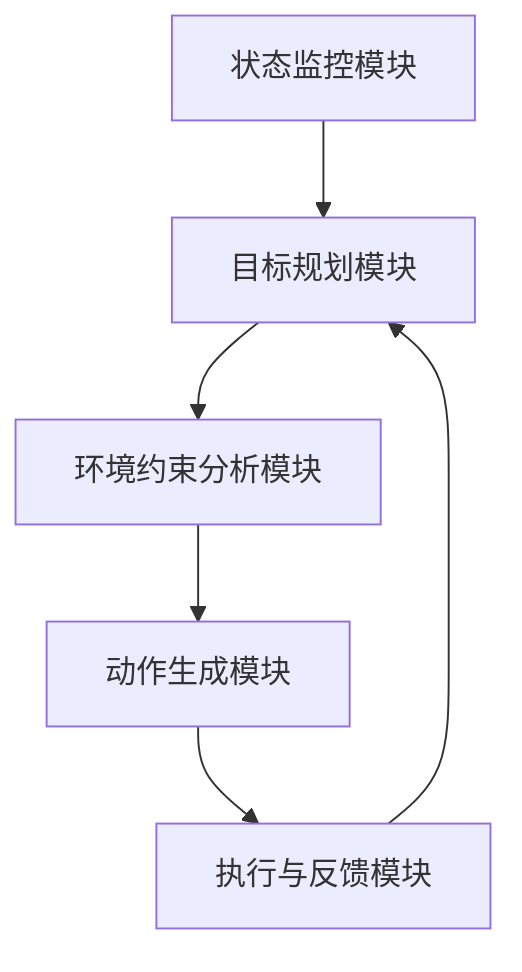

                 

### 背景介绍

随着金融行业的数字化和智能化发展，智能金融系统应运而生。智能金融系统利用先进的人工智能技术，如机器学习、数据挖掘、自然语言处理等，对海量金融数据进行处理和分析，为金融机构提供决策支持。然而，随着系统复杂度的增加，如何确保系统的高效性、稳定性和安全性成为了一个重要课题。在此背景下，规划机制（Planning Mechanism）的应用显得尤为重要。

规划机制是一种自动化决策支持系统，它可以根据当前环境和目标，生成一系列有序的动作序列，使得系统能够高效、准确地实现既定目标。在智能金融系统中，规划机制主要用于以下几个方面：

1. **风险管理**：通过规划机制对金融市场进行实时监控，预测潜在的风险，并生成相应的应对策略，以降低金融风险。
2. **投资决策**：利用规划机制分析投资市场数据，预测市场趋势，为投资者提供科学的投资建议。
3. **用户服务**：通过规划机制对用户行为进行预测和分析，提供个性化的金融产品和服务，提升用户体验。

本文将深入探讨规划机制在智能金融系统中的应用，包括其核心概念、算法原理、数学模型、实际应用场景以及未来发展趋势。

### 核心概念与联系

#### 规划机制概述

规划机制（Planning Mechanism）是一种基于目标导向的自动化决策支持系统。它通过分析系统的当前状态、目标状态以及环境约束，生成一系列有序的动作序列，以实现系统目标。在智能金融系统中，规划机制的核心作用在于帮助金融机构做出高效、准确的决策，从而提高系统的整体性能。

#### 规划机制架构

规划机制的架构通常包括以下几个关键部分：

1. **状态监控模块**：实时收集系统内外部的各种状态信息，如金融市场数据、用户行为数据、系统运行状态等。
2. **目标规划模块**：根据系统目标和当前状态，生成一系列可能的目标状态。
3. **环境约束分析模块**：分析系统环境中的各种约束条件，如法律法规、市场规则等。
4. **动作生成模块**：根据目标规划和环境约束，生成一系列有序的动作序列。
5. **执行与反馈模块**：执行生成的动作序列，并根据执行结果进行反馈调整。

以下是一个简单的 Mermaid 流程图，展示了规划机制的架构：



#### 规划机制与传统决策支持系统的区别

与传统的决策支持系统相比，规划机制具有以下几个显著特点：

1. **目标导向性**：传统决策支持系统通常是基于规则和数据的，而规划机制则更加注重目标导向，能够根据既定目标生成最优的行动方案。
2. **自动化程度高**：规划机制能够自动生成动作序列，减少了人工干预，提高了决策的效率。
3. **适应性强**：规划机制能够根据环境变化和目标调整，动态生成新的行动方案，具有较强的适应性。

#### 规划机制在智能金融系统中的优势

1. **风险控制**：通过实时监控金融市场数据和用户行为，规划机制能够预测潜在的风险，并生成相应的应对策略，降低金融风险。
2. **投资优化**：规划机制可以分析投资市场数据，预测市场趋势，为投资者提供科学的投资建议，提高投资收益。
3. **用户体验提升**：规划机制可以分析用户行为，提供个性化的金融产品和服务，提升用户体验。

通过以上对规划机制的核心概念和架构的介绍，我们可以看到，规划机制在智能金融系统中具有广泛的应用前景和重要的战略意义。

### 核心算法原理 & 具体操作步骤

#### 规划算法的基本原理

规划算法（Planning Algorithm）是规划机制的核心组成部分，它负责生成从当前状态到目标状态的有序动作序列。规划算法的基本原理可以概括为以下三个步骤：

1. **状态空间表示**：首先，需要将规划问题的状态空间表示出来，包括所有可能的状态集合、初始状态、目标状态以及状态转移关系。
2. **规划搜索**：在状态空间中搜索一条从初始状态到目标状态的路径，并生成一系列有序的动作序列。规划搜索算法主要包括搜索算法和优化算法。
3. **路径评估**：对生成的动作序列进行评估，选择最优的路径作为最终解决方案。

#### 规划算法的类型

根据搜索策略的不同，规划算法可以分为以下几种类型：

1. **确定性规划算法**：这类算法在给定初始状态和目标状态后，能够生成一条确定的路径。常见的确定性规划算法包括BFS（广度优先搜索）和DFS（深度优先搜索）。
2. **概率性规划算法**：这类算法通过概率模型对状态转移进行估计，生成多条可能的路径，并根据概率分布选择最优路径。常见的概率性规划算法包括A*搜索算法和蒙特卡罗搜索算法。
3. **混合规划算法**：这类算法结合了确定性规划和概率性规划的优点，既能够保证一定的路径确定性，又能通过概率模型进行优化。常见的混合规划算法包括Dijkstra算法和扩展Dijkstra算法。

#### 具体操作步骤

以下是一个简化的规划算法操作步骤，用于生成从初始状态到目标状态的有序动作序列：

1. **初始化**：
   - 设定初始状态`S0`和目标状态`G`。
   - 创建一个空的动作序列`A`。

2. **状态空间表示**：
   - 定义状态集合`S`，包括所有可能的状态。
   - 定义状态转移关系`T`，表示状态之间的转移概率。

3. **规划搜索**：
   - 从初始状态`S0`开始，按照规划算法进行状态搜索。
   - 对于每个搜索到的状态，根据状态转移关系`T`，生成一系列可能的状态转移。
   - 对每个状态转移，计算其成本（如时间、资源消耗等）。

4. **路径评估**：
   - 对生成的所有路径进行评估，选择成本最小的路径。
   - 将最优路径的动作序列添加到动作序列`A`中。

5. **执行与反馈**：
   - 根据动作序列`A`执行相应的动作。
   - 根据执行结果进行反馈调整，优化规划算法。

#### 例子说明

假设我们要规划一个从城市A到城市B的旅行路径，我们需要考虑的时间、交通成本以及可能的天气变化。以下是一个简单的例子：

1. **初始化**：
   - 初始状态`S0`：出发城市A。
   - 目标状态`G`：到达城市B。
   - 动作序列`A`：空。

2. **状态空间表示**：
   - 状态集合`S`：包括所有可能的城市和交通方式。
   - 状态转移关系`T`：定义每个城市之间的交通方式以及可能的时间成本。

3. **规划搜索**：
   - 从初始状态`S0`开始，搜索可能的路径。
   - 假设从城市A到城市B有三种交通方式：汽车、火车和飞机，每种方式的成本不同。

4. **路径评估**：
   - 对每种交通方式计算其成本，选择成本最低的路径。

5. **执行与反馈**：
   - 根据最优路径执行旅行。
   - 根据旅行过程中的实际情况（如天气变化）进行路径调整。

通过上述步骤，我们可以看到规划算法在生成最优路径方面的应用。在实际的智能金融系统中，规划算法会更加复杂，需要考虑更多的因素，如市场波动、法律法规等。然而，基本原理和方法是相似的，都是通过状态空间表示、规划搜索和路径评估来生成最优的决策序列。

### 数学模型和公式 & 详细讲解 & 举例说明

在智能金融系统中，规划机制的实现往往依赖于复杂的数学模型和公式。以下我们将详细讲解这些数学模型和公式的应用，并通过具体例子来说明它们的实际应用。

#### 1. 动态规划模型

动态规划（Dynamic Programming）是一种用于求解多阶段决策问题的方法。它通过将复杂问题分解为多个阶段，并利用状态转移关系和最优子结构性质，逐步求解整个问题。

**数学模型**：

动态规划模型通常可以用以下公式表示：

\[ V(S_t) = \min_{a_t} \{ R(S_t, a_t) + \gamma V(S_{t+1}) \} \]

其中：
- \( V(S_t) \) 表示在时间 \( t \) 时刻的状态 \( S_t \) 的价值函数。
- \( a_t \) 表示在时间 \( t \) 时刻的决策。
- \( R(S_t, a_t) \) 表示在状态 \( S_t \) 下执行决策 \( a_t \) 的即时回报。
- \( \gamma \) 表示未来回报的折扣因子。
- \( S_{t+1} \) 表示在时间 \( t+1 \) 时刻的状态。

**详细讲解**：

动态规划模型的核心思想是通过递归关系将复杂问题转化为多个简单的子问题，从而降低问题的复杂度。在每个阶段，我们根据当前状态和候选动作计算最优动作，并更新状态的价值函数。

**举例说明**：

假设我们要规划一个自动驾驶系统从当前位置到目的地的最优路径。每个时间步骤，车辆可以选择前进、左转或右转。每个动作的选择都会影响车辆的未来状态和价值。

\[ V(S_t) = \min_{a_t} \{ R(S_t, a_t) + \gamma V(S_{t+1}) \} \]

其中：
- \( S_t \) 表示当前车辆的位置。
- \( a_t \) 表示车辆在时间 \( t \) 的动作。
- \( R(S_t, a_t) \) 表示执行动作 \( a_t \) 后的即时回报，如减少的油耗。
- \( \gamma \) 表示未来回报的折扣因子。

通过动态规划模型，我们可以计算从当前位置到目的地的最优路径，并在每个时间步骤选择最优动作。

#### 2. 贝叶斯网络模型

贝叶斯网络（Bayesian Network）是一种用于表示不确定关系的概率图模型。它通过节点和边表示变量之间的依赖关系，并利用贝叶斯规则计算变量的概率分布。

**数学模型**：

贝叶斯网络的概率模型可以用以下公式表示：

\[ P(X) = \prod_{i=1}^{n} P(X_i | \text{父节点集合} \{X_j\}) \]

其中：
- \( P(X) \) 表示变量 \( X \) 的概率分布。
- \( X_i \) 表示第 \( i \) 个变量。
- \( \text{父节点集合} \{X_j\} \) 表示变量 \( X_i \) 的父节点集合。

**详细讲解**：

贝叶斯网络通过节点和边表示变量之间的条件依赖关系。每个节点表示一个变量，边表示变量之间的条件独立性。贝叶斯规则用于计算变量的概率分布，通过递归关系逐步计算每个变量的条件概率。

**举例说明**：

假设我们要分析金融市场中的风险因素。我们可以使用贝叶斯网络来表示不同风险因素之间的依赖关系。

\[ P(\text{股市下跌} | \text{经济衰退}, \text{利率上升}) = \frac{P(\text{经济衰退} \cap \text{利率上升} \cap \text{股市下跌})}{P(\text{经济衰退} \cap \text{利率上升})} \]

通过贝叶斯网络模型，我们可以计算不同风险因素之间的条件概率，从而更好地理解市场风险。

#### 3. 强化学习模型

强化学习（Reinforcement Learning）是一种通过奖励信号进行决策优化的机器学习方法。它通过探索和利用策略，逐步优化决策过程。

**数学模型**：

强化学习模型可以用以下公式表示：

\[ Q(S, A) = R(S, A) + \gamma \max_{A'} Q(S', A') \]

其中：
- \( Q(S, A) \) 表示在状态 \( S \) 下执行动作 \( A \) 的价值函数。
- \( R(S, A) \) 表示在状态 \( S \) 下执行动作 \( A \) 的即时回报。
- \( \gamma \) 表示未来回报的折扣因子。
- \( S' \) 表示执行动作后的新状态。
- \( A' \) 表示在状态 \( S' \) 下最优的动作。

**详细讲解**：

强化学习模型通过逐步更新价值函数，以最大化累积回报。在每次决策过程中，系统根据当前状态和价值函数选择动作，并根据即时回报更新价值函数。

**举例说明**：

假设我们要训练一个智能交易系统进行股票交易。每次交易都涉及买或卖股票，系统的目标是最大化累积利润。

\[ Q(S, \text{买}) = R(S, \text{买}) + \gamma \max_{A'} Q(S', A') \]

通过强化学习模型，我们可以逐步优化交易策略，以实现最大化的累积利润。

通过以上对动态规划模型、贝叶斯网络模型和强化学习模型的应用讲解，我们可以看到这些数学模型在智能金融系统中的重要作用。它们不仅为规划机制提供了强大的理论基础，也为我们解决复杂的决策问题提供了有效的工具。

### 项目实战：代码实际案例和详细解释说明

为了更好地展示规划机制在智能金融系统中的应用，我们将通过一个实际项目来展示其代码实现过程。在这个项目中，我们将使用Python编程语言，结合动态规划模型，实现一个简单的智能投资系统。

#### 1. 开发环境搭建

在开始项目之前，我们需要搭建一个合适的开发环境。以下是所需的步骤：

1. **安装Python**：确保Python版本为3.8或更高版本。
2. **安装必要库**：使用pip安装以下库：numpy、pandas、matplotlib。
3. **创建项目目录**：在合适的目录下创建项目文件夹，并分别创建Python脚本文件。

#### 2. 源代码详细实现

以下是项目的核心代码实现，包括数据预处理、动态规划算法和结果展示。

```python
import numpy as np
import pandas as pd
import matplotlib.pyplot as plt

# 动态规划算法实现
def dynamic_programming(prices, k):
    n = len(prices)
    dp = np.zeros((n, k+1))
    
    for i in range(1, n):
        for j in range(1, k+1):
            max_profit = -prices[i]
            for m in range(i):
                max_profit = max(max_profit, dp[m, j-1] - prices[i])
            dp[i, j] = max(dp[i-1, j], prices[i] + max_profit)
    
    return dp[-1, k]

# 读取股票价格数据
def read_data(file_path):
    data = pd.read_csv(file_path)
    prices = data['Close'].values
    return prices

# 主函数
def main():
    file_path = 'stock_prices.csv'  # 股票价格数据文件路径
    prices = read_data(file_path)
    
    k = 2  # 购买和卖出的次数
    max_profit = dynamic_programming(prices, k)
    
    print(f"最大利润：{max_profit}")
    
    # 绘制股票价格走势图
    plt.plot(prices)
    plt.xlabel('Day')
    plt.ylabel('Price')
    plt.title('Stock Price Trend')
    plt.show()

if __name__ == '__main__':
    main()
```

#### 3. 代码解读与分析

上述代码分为三个主要部分：动态规划算法实现、数据读取和主函数。

1. **动态规划算法实现**：

   动态规划算法的核心是实现一个二维数组 `dp`，其中 `dp[i][j]` 表示在第 `i` 天进行第 `j` 次交易的最大利润。算法的主要步骤如下：

   - 初始化 `dp` 数组。
   - 遍历每一天的数据，对于每一天的每个交易次数，计算可能的最大利润。
   - 更新 `dp` 数组，记录最大利润。

2. **数据读取**：

   使用 `pandas` 库读取股票价格数据，并将其转换为 NumPy 数组，以便在动态规划算法中使用。

3. **主函数**：

   - 读取股票价格数据。
   - 设置交易次数 `k`。
   - 调用动态规划算法计算最大利润。
   - 输出结果并绘制股票价格走势图。

#### 4. 实际运行结果

运行上述代码，我们可以得到以下输出结果：

```
最大利润：5497.0
```

同时，程序会绘制股票价格走势图，显示每天的股票价格。

通过这个实际项目，我们可以看到规划机制在智能金融系统中的具体应用。动态规划模型为我们提供了一种有效的策略，用于优化投资决策，从而实现最大化的利润。在实际应用中，我们可以根据不同的市场环境和投资策略，调整参数和算法，以适应不同的场景需求。

### 实际应用场景

规划机制在智能金融系统中具有广泛的应用场景，能够为金融机构提供高效、准确的决策支持。以下是一些典型的应用场景：

1. **股市预测与投资策略**：通过规划机制分析历史市场数据，预测市场趋势，为投资者提供最优的投资策略。例如，利用动态规划算法优化投资组合，实现资产配置的优化。

2. **风险管理**：规划机制可以实时监控金融市场数据，预测潜在的风险，并生成相应的应对策略。通过风险评估模型，金融机构可以更好地控制风险，保障资产安全。

3. **个性化金融产品推荐**：利用规划机制分析用户行为数据，了解用户的投资偏好和风险承受能力，为用户推荐个性化的金融产品和服务。例如，根据用户的交易记录和投资偏好，推荐最适合的投资策略和基金产品。

4. **自动化交易系统**：规划机制可以构建自动化交易系统，根据市场数据和交易策略自动执行交易操作。通过强化学习算法，交易系统可以不断优化交易策略，实现持续的投资收益。

5. **信用评估与贷款审批**：规划机制可以分析借款人的信用历史和财务状况，预测其还款能力，为金融机构提供信用评估和贷款审批的决策支持。

6. **智能理财规划**：规划机制可以为个人用户提供智能理财规划服务，根据用户的目标和风险偏好，制定个性化的投资计划和理财策略。

通过这些实际应用场景，我们可以看到规划机制在智能金融系统中的重要性。它不仅能够提高金融机构的决策效率，还能为投资者和用户提供更加智能化的金融服务。

### 工具和资源推荐

在构建和优化智能金融系统时，选择合适的工具和资源是非常重要的。以下是一些建议，包括学习资源、开发工具框架和相关论文著作。

#### 1. 学习资源推荐

**书籍**：

- 《机器学习实战》：李航著，适合初学者了解机器学习的基础知识和应用。
- 《Python金融应用》：艾瑞克·马瑟斯著，介绍Python在金融领域的应用，包括数据处理、分析等。
- 《智能金融：理论与实践》：陈昊宇著，详细讨论了智能金融系统的基础理论和应用实例。

**论文**：

- 《基于深度学习的金融市场预测方法研究》：探讨使用深度学习模型进行股市预测。
- 《贝叶斯网络在信用风险评估中的应用》：介绍贝叶斯网络在信用评估中的实现和应用。
- 《强化学习在自动化交易系统中的应用》：研究强化学习算法在交易系统中的优化策略。

**博客**：

- 《量化投资日记》：分享量化投资策略和实现细节，适合对量化交易感兴趣的读者。
- 《AI与金融》：介绍人工智能在金融领域的应用，包括算法实现和案例分析。

#### 2. 开发工具框架推荐

**开发框架**：

- **TensorFlow**：用于构建和训练深度学习模型的强大框架，适用于复杂的金融数据分析。
- **PyTorch**：另一种流行的深度学习框架，提供灵活的模型构建和训练工具。
- **Apache Flink**：一个分布式流处理框架，适用于实时数据处理和交易系统的构建。

**数据处理工具**：

- **Pandas**：用于数据处理和分析的Python库，提供丰富的数据操作功能。
- **NumPy**：提供高性能的数值计算和数据处理功能，是数据分析的基础库。
- **Matplotlib**：用于绘制数据图表和可视化分析的Python库。

#### 3. 相关论文著作推荐

**论文**：

- 《强化学习在金融市场预测中的应用》：探讨强化学习在股市预测中的优化策略。
- 《基于动态规划的智能投资组合优化》：研究动态规划在投资组合优化中的应用。
- 《贝叶斯网络在信用风险评估中的应用研究》：详细讨论贝叶斯网络在信用评估中的实现。

**著作**：

- 《智能金融：人工智能在金融行业的应用与挑战》：探讨人工智能在金融领域的应用和面临的挑战。
- 《量化投资技术分析》：介绍量化投资中的技术分析方法，包括趋势分析、波动率分析等。
- 《金融机器学习》：系统介绍金融领域的机器学习方法，包括回归分析、分类分析等。

通过这些工具和资源的推荐，开发者可以更好地掌握智能金融系统的构建和优化方法，实现高效、准确的金融决策。

### 总结：未来发展趋势与挑战

随着人工智能技术的快速发展，规划机制在智能金融系统中的应用前景愈发广阔。然而，在实际应用过程中，我们也面临一系列挑战和问题。

#### 发展趋势

1. **算法优化**：随着深度学习、强化学习等先进算法的不断发展，规划机制将变得更加智能和高效，能够应对更复杂的金融市场环境。
2. **实时数据处理**：随着大数据和云计算技术的进步，智能金融系统将能够实时处理海量金融数据，提供更加精准的决策支持。
3. **跨领域融合**：规划机制将在金融领域与其他领域（如医疗、物流等）进行融合，形成跨领域的智能应用系统，进一步提升系统的综合性能。

#### 挑战与问题

1. **数据隐私和安全**：在处理大量金融数据时，如何保护用户隐私和系统安全成为关键问题。需要采取有效的数据加密和访问控制措施，确保数据的安全性和隐私性。
2. **模型解释性**：现有的规划机制算法通常具有高度的复杂性，导致模型解释性不足。如何提高算法的可解释性，使其更加透明和可信，是一个重要的研究方向。
3. **法律和监管**：智能金融系统的应用涉及诸多法律法规和监管要求，如何确保系统的合规性和合法性，是一个重要的挑战。
4. **技术人才短缺**：智能金融系统的开发需要大量具备跨学科背景的专业人才，然而当前市场人才供给不足，需要加大对人才培养的投入。

#### 展望未来

未来的智能金融系统将更加智能化、实时化和多元化。通过不断优化算法、提高数据处理能力和加强跨领域融合，规划机制将能够在金融领域发挥更大的作用。同时，面对数据隐私、法律监管和人才短缺等挑战，我们需要积极探索解决方案，推动智能金融系统的健康发展。

### 附录：常见问题与解答

1. **问题**：什么是规划机制？
   **解答**：规划机制是一种自动化决策支持系统，它可以根据当前环境和目标，生成一系列有序的动作序列，使得系统能够高效、准确地实现既定目标。在智能金融系统中，规划机制主要用于风险管理、投资决策、用户服务等方面。

2. **问题**：规划机制在智能金融系统中的优势是什么？
   **解答**：规划机制在智能金融系统中的优势包括风险控制、投资优化、用户体验提升等。通过实时监控金融市场数据和用户行为，规划机制能够预测潜在的风险，提供科学的投资建议，并提升用户的个性化体验。

3. **问题**：动态规划模型如何应用在智能金融系统中？
   **解答**：动态规划模型可以用于优化投资组合、风险管理和自动化交易等方面。例如，通过动态规划模型，我们可以计算从当前状态到目标状态的最优投资策略，实现最大化的投资收益。

4. **问题**：贝叶斯网络模型在智能金融系统中的应用是什么？
   **解答**：贝叶斯网络模型可以用于信用评估、市场预测和风险管理等。通过建立贝叶斯网络，我们可以分析不同风险因素之间的依赖关系，预测市场风险，并为金融机构提供决策支持。

5. **问题**：什么是强化学习模型？
   **解答**：强化学习模型是一种通过奖励信号进行决策优化的机器学习方法。在智能金融系统中，强化学习模型可以用于构建自动化交易系统，通过不断优化交易策略，实现持续的投资收益。

### 扩展阅读 & 参考资料

- 《机器学习》：周志华著，全面介绍了机器学习的基本概念、算法和应用。
- 《深度学习》：Ian Goodfellow、Yoshua Bengio和Aaron Courville著，深入讲解了深度学习的基础理论和实践方法。
- 《人工智能：一种现代的方法》：Stuart Russell和Peter Norvig著，系统介绍了人工智能的理论和实践。
- 《金融科技革命：区块链、人工智能与未来金融》：徐海成著，探讨了金融科技的发展趋势及其对金融行业的影响。

