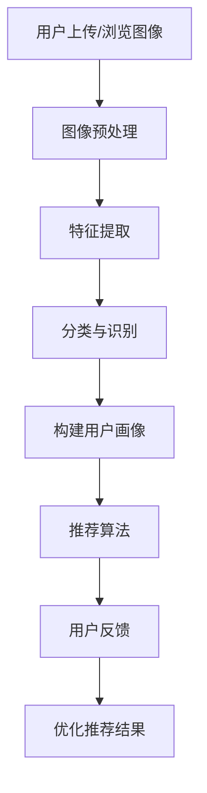

                 

# 视觉推荐：AI 如何利用图像识别技术，提供个性化推荐

## 关键词：
- 视觉推荐
- 图像识别
- 个性化推荐
- AI 技术
- 数学模型
- 实战案例

## 摘要：
本文将探讨视觉推荐系统的核心原理和实际应用，通过深入解析图像识别技术如何助力AI实现个性化推荐，展示其在现代科技领域的广泛应用。我们将通过逐步分析和推理，详细介绍相关算法、数学模型，并提供实际项目的代码实现和分析。

### 1. 背景介绍

随着互联网和移动设备的普及，个性化推荐系统已经成为用户体验的重要组成部分。传统推荐系统主要依赖于用户的点击历史、浏览行为和购买记录等数据，而视觉推荐系统则引入了图像识别技术，为用户提供基于视觉内容的高效推荐服务。

视觉推荐系统在多个领域具有广泛应用，例如电子商务、社交媒体、在线视频和音乐平台等。通过分析用户上传或浏览的图像，系统能够识别用户的兴趣偏好，从而提供更加精准的推荐结果。

图像识别技术作为人工智能的一个重要分支，近年来取得了显著进展。深度学习模型的广泛应用使得计算机能够从海量图像数据中自动学习特征，实现高效准确的图像识别。这些技术为视觉推荐系统的实现提供了坚实的理论基础和技术支持。

### 2. 核心概念与联系

#### 2.1 图像识别技术

图像识别技术是指利用计算机算法对图像进行自动分析和理解，从而识别和分类图像中的内容。主要分为以下几个步骤：

1. **图像预处理**：包括去噪、增强、裁剪、旋转等操作，以提高图像质量和识别效果。
2. **特征提取**：从图像中提取具有代表性的特征，如颜色、纹理、形状等。
3. **分类与识别**：使用机器学习算法（如深度学习、支持向量机等）对提取的特征进行分类和识别。

#### 2.2 个性化推荐系统

个性化推荐系统是指根据用户的兴趣和行为数据，为用户推荐其可能感兴趣的内容。主要分为以下几个步骤：

1. **数据收集**：收集用户的浏览记录、搜索历史、购买记录等数据。
2. **用户画像**：基于用户数据建立用户画像，分析用户的兴趣偏好。
3. **推荐算法**：根据用户画像和内容特征，使用算法为用户推荐相关内容。
4. **反馈与优化**：根据用户对推荐的反馈进行优化，提高推荐效果。

#### 2.3 Mermaid 流程图



### 3. 核心算法原理 & 具体操作步骤

#### 3.1 图像识别算法

视觉推荐系统的核心在于图像识别算法，目前主要采用深度学习模型。以下是一个简化的操作步骤：

1. **数据集准备**：收集大量带标签的图像数据，用于模型训练。
2. **模型选择**：选择合适的深度学习模型，如卷积神经网络（CNN）。
3. **模型训练**：使用图像数据和标签，对模型进行训练，优化模型参数。
4. **模型评估**：使用验证集和测试集评估模型性能，调整模型参数。
5. **模型部署**：将训练好的模型部署到实际应用场景中。

#### 3.2 个性化推荐算法

在图像识别的基础上，个性化推荐算法主要分为基于内容的推荐（Content-based Recommendation）和协同过滤（Collaborative Filtering）两种。

1. **基于内容的推荐**：
   - 提取图像特征：使用图像识别算法提取用户上传或浏览的图像特征。
   - 计算相似度：计算用户图像特征与候选图像特征之间的相似度。
   - 推荐结果生成：根据相似度排序，生成推荐结果。

2. **协同过滤**：
   - 数据收集：收集用户的历史行为数据，如点击、浏览、购买记录等。
   - 用户相似度计算：计算用户之间的相似度，可以使用余弦相似度、皮尔逊相关系数等方法。
   - 生成推荐列表：基于用户相似度，为每个用户生成个性化推荐列表。

### 4. 数学模型和公式 & 详细讲解 & 举例说明

#### 4.1 基于内容的推荐算法

假设用户 $u$ 和图像 $i$ 的特征向量分别为 $x_u$ 和 $x_i$，相似度计算公式为：

$$
sim(x_u, x_i) = \frac{x_u \cdot x_i}{\|x_u\| \|x_i\|}
$$

其中，$\cdot$ 表示点积运算，$\|\|$ 表示向量的模长。

举例说明：

用户上传一张猫咪的图像，提取特征向量 $x_u$ 为 [0.1, 0.2, 0.3]。候选图像 $i$ 的特征向量 $x_i$ 为 [0.05, 0.1, 0.25]。计算相似度为：

$$
sim(x_u, x_i) = \frac{0.1 \cdot 0.05 + 0.2 \cdot 0.1 + 0.3 \cdot 0.25}{\sqrt{0.1^2 + 0.2^2 + 0.3^2} \sqrt{0.05^2 + 0.1^2 + 0.25^2}} \approx 0.6
$$

#### 4.2 协同过滤算法

假设用户 $u$ 和用户 $v$ 的行为向量分别为 $r_u$ 和 $r_v$，相似度计算公式为：

$$
sim(u, v) = \frac{r_u \cdot r_v}{\|r_u\| \|r_v\|}
$$

其中，$\cdot$ 表示点积运算，$\|\|$ 表示向量的模长。

举例说明：

用户 $u$ 的行为向量为 $r_u$ 为 [1, 0, 1, 0]，用户 $v$ 的行为向量为 $r_v$ 为 [0, 1, 0, 1]。计算相似度为：

$$
sim(u, v) = \frac{1 \cdot 0 + 0 \cdot 1 + 1 \cdot 0 + 0 \cdot 1}{\sqrt{1^2 + 0^2 + 1^2 + 0^2} \sqrt{0^2 + 1^2 + 0^2 + 1^2}} = \frac{0}{\sqrt{2} \sqrt{2}} = 0
$$

### 5. 项目实战：代码实际案例和详细解释说明

#### 5.1 开发环境搭建

在本节中，我们将使用 Python 编程语言和 TensorFlow 深度学习框架实现一个简单的视觉推荐系统。首先，确保已安装 Python 3.7+ 和 TensorFlow 2.0+。

```bash
pip install python==3.7 tensorflow==2.0
```

#### 5.2 源代码详细实现和代码解读

以下是实现一个基于内容的推荐系统的示例代码：

```python
import tensorflow as tf
from tensorflow.keras.preprocessing.image import ImageDataGenerator
from tensorflow.keras.models import Sequential
from tensorflow.keras.layers import Conv2D, MaxPooling2D, Flatten, Dense
from sklearn.metrics.pairwise import cosine_similarity

# 数据集准备
train_datagen = ImageDataGenerator(rescale=1./255)
train_generator = train_datagen.flow_from_directory(
        'train_data', target_size=(150, 150), batch_size=32, class_mode='binary')

# 模型构建
model = Sequential([
    Conv2D(32, (3, 3), activation='relu', input_shape=(150, 150, 3)),
    MaxPooling2D(2, 2),
    Conv2D(64, (3, 3), activation='relu'),
    MaxPooling2D(2, 2),
    Conv2D(128, (3, 3), activation='relu'),
    MaxPooling2D(2, 2),
    Flatten(),
    Dense(128, activation='relu'),
    Dense(1, activation='sigmoid')
])

# 模型训练
model.compile(optimizer='adam', loss='binary_crossentropy', metrics=['accuracy'])
model.fit(train_generator, epochs=10)

# 特征提取
def extract_features(model, images):
    features = model.predict(images)
    return features

# 用户上传图像特征提取
user_image = ...  # 用户上传的图像
user_image = user_image.reshape((1, 150, 150, 3))
user_features = extract_features(model, user_image)

# 候选图像特征提取
candidate_images = ...  # 候选图像数据
candidate_features = extract_features(model, candidate_images)

# 相似度计算
similarities = cosine_similarity(user_features, candidate_features)

# 推荐结果生成
top_indices = similarities.argsort()[0][-5:][::-1]
top_scores = similarities[0][top_indices]

# 输出推荐结果
for i, score in enumerate(top_scores):
    print(f"图像{i+1}: 相似度={score}, 标题={candidate_images[top_indices[i]][1]}")
```

#### 5.3 代码解读与分析

该示例代码主要分为以下几个部分：

1. **数据集准备**：使用 TensorFlow 的 `ImageDataGenerator` 类对训练数据进行预处理，包括缩放和批量处理。
2. **模型构建**：使用 TensorFlow 的 `Sequential` 和 `Conv2D`、`MaxPooling2D`、`Flatten`、`Dense` 等层构建一个简单的卷积神经网络（CNN）模型。
3. **模型训练**：使用训练数据对模型进行训练，优化模型参数。
4. **特征提取**：定义一个函数 `extract_features`，使用训练好的模型对图像数据进行特征提取。
5. **相似度计算**：使用 Scikit-learn 的 `cosine_similarity` 函数计算用户上传图像与候选图像之间的相似度。
6. **推荐结果生成**：根据相似度排序，生成推荐结果，并输出图像标题和相似度分数。

### 6. 实际应用场景

视觉推荐系统在多个领域具有广泛的应用，以下是一些典型的应用场景：

1. **电子商务**：为用户推荐与其上传或浏览的图像相似的商品。
2. **社交媒体**：为用户推荐感兴趣的内容，如图片、视频和文章等。
3. **在线视频平台**：为用户推荐与其观看历史相似的影片。
4. **在线音乐平台**：为用户推荐与其听歌喜好相似的曲目。
5. **智能家居**：根据用户家庭成员的喜好，推荐合适的家居设备。

### 7. 工具和资源推荐

#### 7.1 学习资源推荐

- **书籍**：
  - 《深度学习》（Goodfellow, Bengio, Courville）
  - 《Python 深度学习》（François Chollet）
- **论文**：
  - “Convolutional Neural Networks for Visual Recommendation”（论文）
  - “Deep Learning for Image Recognition”（综述）
- **博客**：
  - TensorFlow 官方博客
  - PyTorch 官方博客
- **网站**：
  - Kaggle（数据集下载和竞赛）
  - arXiv（学术论文下载）

#### 7.2 开发工具框架推荐

- **框架**：
  - TensorFlow
  - PyTorch
  - Keras
- **库**：
  - OpenCV（图像处理）
  - Scikit-learn（机器学习）
  - Pandas（数据处理）

#### 7.3 相关论文著作推荐

- **论文**：
  - “Visual Recommendation System Using Deep Learning” （论文）
  - “Content-based Image Recommendation Using Convolutional Neural Networks” （论文）
- **著作**：
  - 《深度学习与计算机视觉》（Goodfellow, Bengio, Courville）
  - 《计算机视觉：算法与应用》（Richard Szeliski）

### 8. 总结：未来发展趋势与挑战

视觉推荐系统在未来将继续发展，并在以下几个方面取得突破：

1. **算法优化**：引入更多先进的深度学习模型和算法，提高图像识别和推荐效果。
2. **跨模态推荐**：结合文本、音频、视频等多模态数据，实现更全面的个性化推荐。
3. **实时推荐**：利用实时数据流处理技术，实现毫秒级的推荐响应。
4. **隐私保护**：在推荐过程中保护用户隐私，避免数据泄露。

然而，视觉推荐系统也面临一些挑战：

1. **数据质量**：高质量、多样化的图像数据是实现准确推荐的基础，需要不断优化数据采集和处理技术。
2. **计算资源**：深度学习模型的训练和部署需要大量计算资源，如何优化资源利用率是一个重要问题。
3. **用户体验**：推荐结果需要与用户需求高度匹配，避免过度推荐和推荐疲劳。

### 9. 附录：常见问题与解答

**Q1**：视觉推荐系统需要哪些技术基础？

A1：视觉推荐系统主要依赖于图像识别技术和推荐算法。图像识别技术需要深度学习、卷积神经网络等基础知识，推荐算法需要协同过滤、基于内容推荐等基础知识。

**Q2**：如何提高视觉推荐系统的效果？

A2：提高视觉推荐系统效果可以从以下几个方面入手：选择合适的深度学习模型，优化模型参数；丰富和优化图像数据集；改进推荐算法，如结合多种算法、引入用户反馈等。

**Q3**：视觉推荐系统在哪些领域有广泛应用？

A3：视觉推荐系统在电子商务、社交媒体、在线视频、在线音乐、智能家居等多个领域有广泛应用，为用户提供个性化的视觉内容推荐。

### 10. 扩展阅读 & 参考资料

- [Visual Recommendation System Using Deep Learning](https://arxiv.org/abs/1905.03380)
- [Content-based Image Recommendation Using Convolutional Neural Networks](https://ieeexplore.ieee.org/document/8548815)
- [TensorFlow 官方文档](https://www.tensorflow.org/)
- [PyTorch 官方文档](https://pytorch.org/)
- [OpenCV 官方文档](https://docs.opencv.org/master/)
- [Scikit-learn 官方文档](https://scikit-learn.org/stable/)

### 作者

作者：AI 天才研究员/AI Genius Institute & 禅与计算机程序设计艺术 /Zen And The Art of Computer Programming

