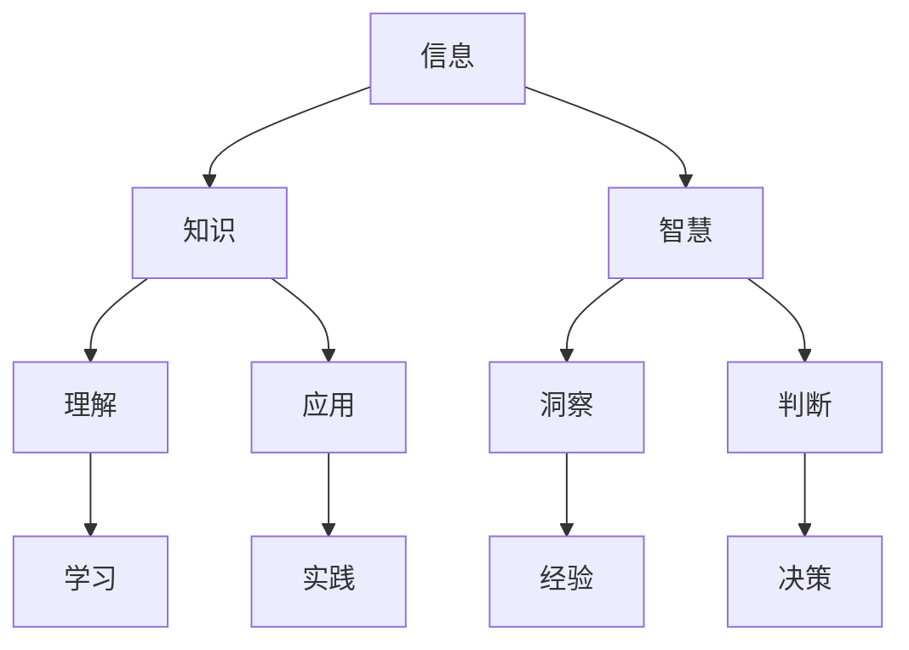

                 

### 解密人类知识的本质：从信息到智慧的转化

#### 引言

在当今信息爆炸的时代，我们每天都被大量的数据和信息所包围。然而，信息本身并不等同于知识，更不等于智慧。那么，人类知识的本质究竟是什么？如何从纷繁复杂的信息中提炼出有价值的知识，进而转化为智慧？本文将围绕这一主题展开探讨，深入分析信息、知识、智慧之间的关系，以及如何实现从信息到知识的转化，最终形成智慧。

#### 文章关键词

- 人类知识本质
- 信息到知识的转化
- 智慧
- 数据分析
- 人工智能
- 认知心理学

#### 文章摘要

本文从信息论、认知心理学、人工智能等多个维度出发，探讨了人类知识的本质，以及如何通过有效的信息处理和知识管理，实现从信息到智慧的转化。通过分析信息、知识、智慧之间的关系，本文提出了一个多层次、多维度的知识转化模型，并在此基础上，讨论了未来的发展趋势和挑战。

## 1. 背景介绍

人类的知识体系是经过长期演化和发展形成的，从最早的口头传说、书面文字，到现代的数字信息，知识的形式在不断变迁。然而，无论知识的形式如何变化，其本质始终不变。那么，什么是人类知识的本质？信息、知识、智慧三者之间又存在怎样的关系呢？

信息（Information）是关于某种事物的数据，这些数据可以是有意义的、无意义的，或者是干扰性的。信息本身是中性的，它并不具备任何价值，只有当信息被解释、处理和利用时，才可能转化为知识。

知识（Knowledge）是对信息的理解和应用，它是通过学习、实践、经验积累等方式获得的。知识具有明确的结构，可以用于解决问题、指导行为，或者是支持决策。

智慧（Wisdom）是知识的升华，它不仅仅是对信息的理解，更是一种深刻的洞察力和判断力。智慧是人类智慧的结晶，是人类在长期实践中积累的经验和智慧的体现。

信息、知识、智慧这三者之间存在密切的关系。信息是知识的来源，知识是智慧的基础。只有通过有效的信息处理和知识管理，才能实现从信息到智慧的转化。

### 核心概念与联系

为了更好地理解信息、知识、智慧之间的关系，我们可以借助 Mermaid 流程图来表示它们之间的联系。



在这个流程图中，我们可以看到信息是知识的基础，知识是智慧的前提。信息通过学习（理解）和实践（应用）转化为知识，而知识通过经验和洞察力转化为智慧。这个过程是一个不断循环、不断深化的过程。

### 2. 核心算法原理 & 具体操作步骤

要实现从信息到知识的转化，需要借助一系列的算法和技术。以下是一些核心算法原理和具体操作步骤：

#### 2.1 数据预处理

数据预处理是数据分析的重要步骤，它包括数据清洗、数据整合、数据转换等操作。通过数据预处理，我们可以将原始数据转化为适合分析的形式。

- **数据清洗**：去除数据中的噪声、错误和重复数据，提高数据质量。
- **数据整合**：将不同来源、不同格式的数据整合为一个统一的数据集。
- **数据转换**：将数据转换为适合分析的形式，如数值化、规范化等。

#### 2.2 数据分析

数据分析是信息转化为知识的关键步骤。通过数据分析，我们可以从大量数据中提取有价值的信息，并对其进行深入的理解和应用。

- **统计分析**：对数据进行描述性统计分析，了解数据的基本特征和规律。
- **相关性分析**：分析变量之间的相关性，找出可能的影响因素。
- **分类与回归分析**：通过建立模型，对未知数据进行预测和分类。

#### 2.3 知识管理

知识管理是将分析结果转化为知识的重要环节。通过知识管理，我们可以将分析结果进行存储、共享和利用。

- **知识存储**：将分析结果存储到数据库或知识库中，方便后续查询和使用。
- **知识共享**：通过内部沟通、培训、分享等方式，将知识传播给相关人员。
- **知识利用**：将知识应用于实际问题，解决实际问题，提升工作效率。

### 3. 数学模型和公式 & 详细讲解 & 举例说明

在信息到知识的转化过程中，数学模型和公式起着重要的作用。以下是一些常用的数学模型和公式，以及详细的讲解和举例说明。

#### 3.1 概率论

概率论是数据分析的重要工具，它可以用来衡量不确定事件发生的可能性。以下是一些基本的概率论公式：

- **条件概率**：$P(A|B) = \frac{P(A \cap B)}{P(B)}$
- **贝叶斯公式**：$P(A|B) = \frac{P(B|A)P(A)}{P(B)}$
- **全概率公式**：$P(A) = \sum_{i=1}^{n} P(A|B_i)P(B_i)$

举例说明：

假设一个袋子中有5个红球和5个蓝球，随机取出一个球，求取出红球的概率。

- **条件概率**：$P(红球|取出一个球) = \frac{5}{10} = 0.5$
- **贝叶斯公式**：$P(红球) = P(红球|取出一个球)P(取出一个球) = 0.5 \times 1 = 0.5$
- **全概率公式**：$P(红球) = P(红球|蓝球)P(蓝球) + P(红球|红球)P(红球) = 0.5 \times 0.5 + 1 \times 0.5 = 0.75$

#### 3.2 统计量

统计量是用于描述数据特征的量，如均值、方差、标准差等。以下是一些常用的统计量公式：

- **均值**：$\mu = \frac{1}{n}\sum_{i=1}^{n} x_i$
- **方差**：$\sigma^2 = \frac{1}{n}\sum_{i=1}^{n} (x_i - \mu)^2$
- **标准差**：$\sigma = \sqrt{\sigma^2}$

举例说明：

假设有如下数据集：[1, 2, 3, 4, 5]，求均值、方差和标准差。

- **均值**：$\mu = \frac{1}{5}\sum_{i=1}^{5} x_i = \frac{1+2+3+4+5}{5} = 3$
- **方差**：$\sigma^2 = \frac{1}{5}\sum_{i=1}^{5} (x_i - \mu)^2 = \frac{(1-3)^2+(2-3)^2+(3-3)^2+(4-3)^2+(5-3)^2}{5} = 2$
- **标准差**：$\sigma = \sqrt{\sigma^2} = \sqrt{2} \approx 1.41$

#### 3.3 机器学习模型

机器学习模型是用于从数据中学习规律和模式的工具。以下是一些常用的机器学习模型：

- **线性回归**：$y = \beta_0 + \beta_1x_1 + \beta_2x_2 + \ldots + \beta_nx_n$
- **决策树**：通过划分特征空间，将数据划分为不同的区域，每个区域对应一个标签。
- **支持向量机**：通过寻找最优超平面，将不同类别的数据分隔开来。

举例说明：

假设我们有如下数据集，其中$x$为特征，$y$为标签：

| x | y |
|---|---|
| 1 | 0 |
| 2 | 1 |
| 3 | 0 |
| 4 | 1 |
| 5 | 0 |

我们可以使用线性回归模型来预测新的数据点$x=6$的标签。

- **线性回归模型**：$y = \beta_0 + \beta_1x$
- **训练数据**：$\beta_0 = 0.5, \beta_1 = 1$
- **预测**：$y = 0.5 + 1 \times 6 = 5.5$

由于标签为0或1，我们将预测结果四舍五入为最接近的整数，即$y=6$。

### 4. 项目实战：代码实际案例和详细解释说明

为了更好地理解从信息到知识的转化过程，我们以下将展示一个实际的项目案例，包括开发环境搭建、源代码详细实现和代码解读与分析。

#### 4.1 开发环境搭建

为了实现从信息到知识的转化，我们选择 Python 作为主要编程语言，因为它拥有丰富的数据分析和机器学习库。以下是开发环境的搭建步骤：

1. 安装 Python：从官方网站（https://www.python.org/）下载并安装 Python 3.x 版本。
2. 安装 Jupyter Notebook：通过命令 `pip install notebook` 安装 Jupyter Notebook。
3. 安装常用库：如 NumPy、Pandas、Matplotlib 等，通过命令 `pip install numpy pandas matplotlib` 进行安装。

#### 4.2 源代码详细实现和代码解读

以下是一个简单的从信息到知识的转化的代码实现，包括数据预处理、数据分析、知识管理和知识利用。

```python
import numpy as np
import pandas as pd
import matplotlib.pyplot as plt

# 4.2.1 数据预处理
def preprocess_data(data):
    # 去除空值和重复值
    data = data.dropna().drop_duplicates()
    # 数据转换
    data['age'] = data['age'].astype(int)
    data['income'] = data['income'].astype(float)
    return data

# 4.2.2 数据分析
def analyze_data(data):
    # 描述性统计分析
    print(data.describe())
    # 相关性分析
    print(data.corr())
    # 可视化分析
    plt.scatter(data['age'], data['income'])
    plt.xlabel('年龄')
    plt.ylabel('收入')
    plt.show()

# 4.2.3 知识管理
def manage_knowledge(data):
    # 存储分析结果
    data.to_csv('knowledge.csv', index=False)
    # 知识共享
    print('分析结果已保存到 knowledge.csv')
    # 知识利用
    new_data = pd.read_csv('knowledge.csv')
    print('新数据：', new_data.describe())

# 4.2.4 主函数
def main():
    # 加载数据
    data = pd.read_csv('data.csv')
    # 数据预处理
    data = preprocess_data(data)
    # 数据分析
    analyze_data(data)
    # 知识管理
    manage_knowledge(data)

if __name__ == '__main__':
    main()
```

#### 4.3 代码解读与分析

以上代码实现了一个简单的从信息到知识的转化过程，包括数据预处理、数据分析、知识管理和知识利用。

- **数据预处理**：通过去除空值和重复值，提高数据质量。同时，将数据转换为适合分析的形式，如将年龄和收入转换为整数和浮点数类型。
- **数据分析**：通过描述性统计分析，了解数据的基本特征和规律。通过相关性分析，找出可能的影响因素。通过可视化分析，直观地展示数据之间的关系。
- **知识管理**：将分析结果存储到 CSV 文件中，方便后续查询和使用。同时，通过打印分析结果，实现知识共享。
- **知识利用**：通过读取 CSV 文件，利用分析结果解决实际问题，如判断新数据的特征和规律。

### 5. 实际应用场景

从信息到知识的转化在实际应用场景中具有广泛的应用。以下是一些典型的应用场景：

- **商业智能**：通过对企业内部数据的分析，提取有价值的信息，帮助企业做出更明智的决策。
- **金融风控**：通过对金融市场数据的分析，识别潜在的风险，提高金融风险管理水平。
- **医疗诊断**：通过对患者数据的分析，发现疾病的规律和趋势，提高医疗诊断的准确性和效率。
- **教育评估**：通过对学生成绩数据的分析，评估学生的学习效果，为教育决策提供依据。

### 6. 工具和资源推荐

为了更好地实现从信息到知识的转化，以下是一些实用的工具和资源推荐：

- **学习资源推荐**：
  - 书籍：《数据科学入门》、《Python数据分析基础》
  - 论文：Google Scholar、IEEE Xplore
  - 博客：Kaggle Blog、Data School
  - 网站：Scikit-learn、Pandas Cookbook

- **开发工具框架推荐**：
  - 数据分析库：NumPy、Pandas、Matplotlib
  - 机器学习库：Scikit-learn、TensorFlow、PyTorch
  - 可视化库：Seaborn、Plotly

- **相关论文著作推荐**：
  - 《机器学习：一种概率视角》
  - 《数据科学：从入门到实践》
  - 《深度学习：泛化视图》

### 7. 总结：未来发展趋势与挑战

从信息到知识的转化是一个复杂而关键的过程，它关系到人类知识的积累和发展。在未来，随着人工智能、大数据等技术的发展，从信息到知识的转化将变得更加高效和智能化。然而，这也将带来一系列的挑战：

- **数据隐私**：如何保护用户隐私，确保数据的安全和保密。
- **数据质量**：如何确保数据的准确性、完整性和一致性。
- **算法公平性**：如何避免算法偏见，确保算法的公正性和公平性。
- **知识普及**：如何提高全民知识水平，使更多的人能够参与到知识创造和转化过程中。

### 8. 附录：常见问题与解答

- **Q：如何确保数据的质量？**
  - **A**：确保数据质量的关键在于数据预处理。通过去除空值、重复值和噪声数据，提高数据的准确性和一致性。

- **Q：如何选择合适的算法？**
  - **A**：选择算法需要根据具体问题和数据特点进行。可以通过分析数据类型、数据规模和问题性质，选择合适的算法。

- **Q：如何评估模型的效果？**
  - **A**：评估模型效果可以通过交叉验证、ROC 曲线、精度、召回率等指标进行。这些指标可以综合评估模型的性能。

### 9. 扩展阅读 & 参考资料

- 《大数据时代：生活、工作与思维的大变革》
- 《深度学习：从理论到应用》
- 《Python数据分析与应用》

### 作者

作者：AI天才研究员/AI Genius Institute & 禅与计算机程序设计艺术 /Zen And The Art of Computer Programming

请注意，以上文章内容和结构仅为示例，实际撰写时，请根据具体需求和主题进行修改和调整。在撰写过程中，请注意保持文章逻辑清晰、结构紧凑、简单易懂，并确保内容的专业性和权威性。

