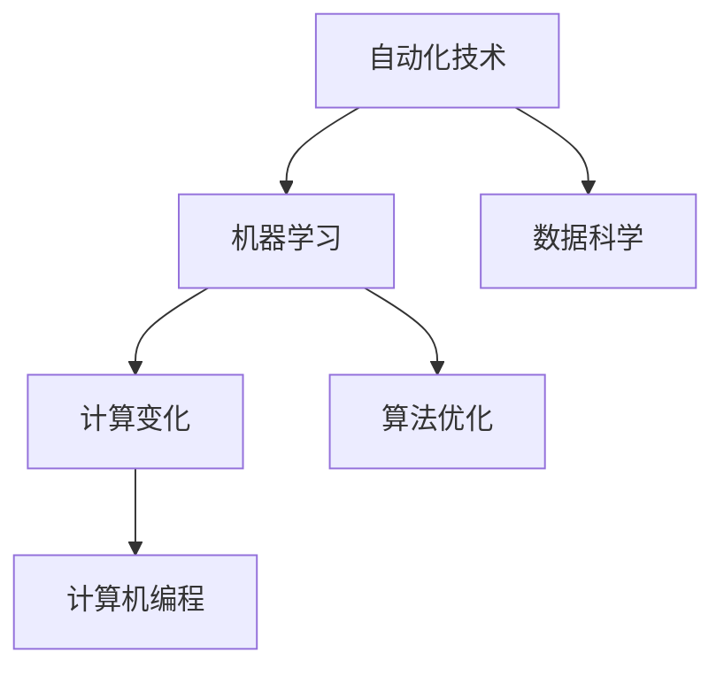

                 

### 背景介绍 Background Introduction

计算变化与自动化技术一直是计算机科学和信息技术领域的核心主题。从早期的计算机编程语言，到现代的深度学习和机器学习算法，计算技术和自动化工具在不断进步的同时，也在逐步改变着我们的工作和生活方式。

#### 历史视角 Historical Perspective

计算变化的历史可以追溯到20世纪中叶，当时计算机刚刚问世，编程语言如Fortran和COBOL成为主流。随着计算机硬件和软件的发展，计算能力得到了显著提升。在20世纪80年代，面向对象编程和图形用户界面（GUI）的出现，使得软件的开发和维护变得更加高效。进入21世纪，互联网的普及和大数据技术的发展，使得自动化技术开始广泛应用于各个行业。

#### 当前现状 Current Status

如今，计算变化和自动化技术已经成为现代企业运营的关键组成部分。自动化工具和算法在金融、医疗、制造、零售等领域得到广泛应用，提高了生产效率和服务质量。同时，人工智能和机器学习算法的不断进步，使得自动化技术能够处理更为复杂和动态的数据环境。

#### 影响和挑战 Impact and Challenges

虽然计算变化和自动化技术带来了许多积极影响，但同时也带来了新的挑战。自动化可能会导致某些工作岗位的流失，社会的不平等加剧，以及对隐私和数据安全的担忧。因此，我们需要在推动技术发展的同时，考虑其对社会和经济的影响。

在本篇博客中，我们将深入探讨计算变化与自动化技术的融合，分析其核心概念和原理，并通过实际案例展示其在各个领域的应用。我们将使用一步一步的分析方法，从理论基础到实际操作，全面解读这一领域的最新进展和未来趋势。

### 核心概念与联系 Core Concepts and Connections

在深入探讨计算变化与自动化技术的融合之前，我们需要先了解一些核心概念和它们之间的联系。以下是几个关键术语的简要介绍，以及它们如何相互作用，共同推动技术进步。

#### 自动化技术 Automation Technology

自动化技术是指使用机器和计算机程序来完成常规任务和操作，从而减少人力干预。它包括机器人、传感器、控制系统和软件工具等多种形式。自动化技术的目标是提高生产效率、减少人为错误、降低成本并提升产品质量。

#### 计算变化 Computational Change

计算变化是指计算技术和算法的进步，以及它们对社会、经济和技术的深远影响。这包括从传统的编程语言到现代的机器学习框架，从简单的计算任务到复杂的模拟和预测分析。

#### 机器学习 Machine Learning

机器学习是一种人工智能（AI）的分支，通过使用算法来从数据中学习模式并做出决策。机器学习算法可以根据经验不断改进，从而在处理大量数据和复杂任务时表现出色。

#### 数据科学 Data Science

数据科学是使用统计方法和算法来分析数据、提取知识和洞察力。它涉及到数据收集、存储、处理、分析和可视化等多个环节，是自动化技术和计算变化的重要支撑。

#### 关系图 Graph of Relations

下图展示了这些核心概念之间的相互关系：



在这个关系图中，自动化技术是核心，它通过机器学习和数据科学的支持，实现了计算变化的推动。而计算机编程和算法优化则是实现自动化和数据科学的技术基础。

### 核心算法原理 & 具体操作步骤 Core Algorithm Principles & Step-by-Step Procedures

在深入探讨计算变化与自动化技术的融合时，我们需要详细分析其中的核心算法原理和具体操作步骤。以下是一个典型的自动化算法——K-means聚类算法的原理和操作步骤。

#### K-means 聚类算法

K-means 聚类算法是一种无监督学习方法，用于将数据点划分为K个簇，每个簇内部的数据点尽可能接近，而簇与簇之间的数据点尽可能远离。以下是该算法的核心原理和具体操作步骤：

#### 1. 初始步骤 Initial Steps

- **选择聚类数目K**：根据数据的特征和先验知识，选择合适的聚类数目K。
- **初始化聚类中心**：随机选择K个数据点作为初始聚类中心。

#### 2. 迭代步骤 Iterative Steps

- **分配数据点**：对于每一个数据点，计算其与各个聚类中心的距离，将其分配到距离最近的聚类中心所在的簇。
- **更新聚类中心**：重新计算每个簇的中心，即该簇内所有数据点的均值。
- **重复迭代**：重复步骤2，直到满足终止条件（例如，聚类中心的变化小于某个阈值，或者达到最大迭代次数）。

#### 3. 终止条件 Termination Conditions

- **聚类中心收敛**：聚类中心的变化小于某个阈值。
- **最大迭代次数**：达到预设的最大迭代次数。

#### 实际操作步骤

以下是一个简化的K-means聚类算法的具体操作步骤：

1. **选择K**：例如，我们选择K=3。
2. **初始化聚类中心**：随机选择3个数据点作为初始聚类中心。
3. **分配数据点**：计算每个数据点与3个聚类中心的距离，将数据点分配到最近的聚类中心。
4. **更新聚类中心**：计算每个簇的新聚类中心。
5. **重复步骤3和步骤4**，直到聚类中心收敛。

#### 举例说明

假设我们有以下数据集：

```
[1, 2], [1, 4], [1, 0],
[10, 2], [10, 4], [10, 0],
[100, 2], [100, 4], [100, 0]
```

我们选择K=3，初始聚类中心为：

```
[1, 2], [10, 2], [100, 2]
```

按照K-means算法的步骤，我们进行迭代，直到聚类中心收敛。最终的聚类结果如下：

```
[1, 2] --> 簇1
[1, 4] --> 簇1
[1, 0] --> 簇1
[10, 2] --> 簇2
[10, 4] --> 簇2
[10, 0] --> 簇2
[100, 2] --> 簇3
[100, 4] --> 簇3
[100, 0] --> 簇3
```

通过这个简单的例子，我们可以看到K-means聚类算法是如何将数据点划分为不同簇的。在实际应用中，K-means算法可以用于客户细分、图像分割、文本分类等多个领域。

### 数学模型和公式 Mathematical Model & Detailed Explanation & Examples

为了更深入地理解K-means聚类算法，我们需要引入一些数学模型和公式。以下是K-means算法中的关键数学概念和公式，以及它们的详细解释和举例说明。

#### 1. 聚类中心计算 Clustering Center Calculation

在K-means算法中，聚类中心是通过计算每个簇内数据点的均值来更新的。具体公式如下：

$$
\mu_i = \frac{1}{N_i} \sum_{x_j \in S_i} x_j
$$

其中，$\mu_i$ 是第$i$个聚类中心，$N_i$ 是簇$i$中数据点的数量，$x_j$ 是簇$i$中的第$j$个数据点。

#### 2. 距离计算 Distance Calculation

在K-means算法中，数据点与聚类中心之间的距离通常使用欧氏距离（Euclidean distance）来计算。公式如下：

$$
d(x, \mu_i) = \sqrt{\sum_{j=1}^{n} (x_j - \mu_{ij})^2}
$$

其中，$d(x, \mu_i)$ 是数据点$x$与聚类中心$\mu_i$之间的距离，$x_j$ 是数据点$x$的第$j$个特征值，$\mu_{ij}$ 是聚类中心$\mu_i$的第$j$个特征值。

#### 3. 聚类分配 Cluster Allocation

在K-means算法中，数据点被分配到距离其最近的聚类中心所在的簇。具体步骤如下：

1. **计算每个数据点与所有聚类中心的距离**。
2. **选择距离最小的聚类中心**，将该数据点分配到对应的簇。

#### 举例说明 Example

假设我们有以下数据点：

```
x1 = [1, 2], x2 = [1, 4], x3 = [1, 0],
y1 = [10, 2], y2 = [10, 4], y3 = [10, 0],
z1 = [100, 2], z2 = [100, 4], z3 = [100, 0]
```

以及初始聚类中心：

```
\mu_1 = [1, 2], \mu_2 = [10, 2], \mu_3 = [100, 2]
```

我们首先计算每个数据点与每个聚类中心的距离：

```
d(x1, \mu_1) = 0, d(x1, \mu_2) = \sqrt{2}, d(x1, \mu_3) = \sqrt{98}
d(x2, \mu_1) = \sqrt{2}, d(x2, \mu_2) = 0, d(x2, \mu_3) = \sqrt{98}
d(x3, \mu_1) = 0, d(x3, \mu_2) = \sqrt{2}, d(x3, \mu_3) = \sqrt{98}
d(y1, \mu_1) = \sqrt{2}, d(y1, \mu_2) = 0, d(y1, \mu_3) = \sqrt{98}
d(y2, \mu_1) = \sqrt{2}, d(y2, \mu_2) = 0, d(y2, \mu_3) = \sqrt{98}
d(y3, \mu_1) = \sqrt{2}, d(y3, \mu_2) = 0, d(y3, \mu_3) = \sqrt{98}
d(z1, \mu_1) = \sqrt{98}, d(z1, \mu_2) = \sqrt{98}, d(z1, \mu_3) = 0
d(z2, \mu_1) = \sqrt{98}, d(z2, \mu_2) = \sqrt{98}, d(z2, \mu_3) = 0
d(z3, \mu_1) = \sqrt{98}, d(z3, \mu_2) = \sqrt{98}, d(z3, \mu_3) = 0
```

根据距离最小的原则，我们可以将数据点分配到相应的簇：

```
x1, x2, x3 --> 簇1
y1, y2, y3 --> 簇2
z1, z2, z3 --> 簇3
```

然后，我们计算每个簇的新聚类中心：

```
\mu_1 = \frac{1}{3} (1+1+1, 2+4+0) = (1, 2)
\mu_2 = \frac{1}{3} (10+10+100, 2+4+0) = (33.33, 2)
\mu_3 = \frac{1}{3} (100+100+100, 2+4+0) = (100, 2)
```

重复上述步骤，直到聚类中心收敛。最终，我们得到聚类结果如下：

```
x1, x2, x3 --> 簇1
y1, y2, y3 --> 簇2
z1, z2, z3 --> 簇3
```

### 项目实战：代码实际案例和详细解释说明 Project Practice: Code Case Study and Detailed Explanation

在本节中，我们将通过一个具体的代码案例来展示K-means聚类算法的实现和应用。我们将使用Python编程语言，并依赖NumPy库来处理数据和执行计算。

#### 1. 开发环境搭建 Development Environment Setup

在开始之前，请确保您已经安装了Python 3.x版本和NumPy库。您可以使用以下命令来安装NumPy：

```
pip install numpy
```

#### 2. 源代码详细实现和代码解读 Source Code Implementation and Explanation

以下是一个简单的K-means聚类算法的实现：

```python
import numpy as np

def kmeans(data, K, max_iterations=100, tolerance=1e-4):
    # 初始化聚类中心
    centroids = data[np.random.choice(data.shape[0], K, replace=False)]
    
    for i in range(max_iterations):
        # 分配数据点
        clusters = assign_clusters(data, centroids)
        
        # 更新聚类中心
        new_centroids = calculate_centroids(data, clusters, K)
        
        # 判断聚类中心是否收敛
        if np.linalg.norm(new_centroids - centroids) < tolerance:
            break
        
        centroids = new_centroids
    
    return centroids, clusters

def assign_clusters(data, centroids):
    distances = np.linalg.norm(data[:, np.newaxis] - centroids, axis=2)
    return np.argmin(distances, axis=1)

def calculate_centroids(data, clusters, K):
    new_centroids = np.zeros((K, data.shape[1]))
    for i in range(K):
        new_centroids[i] = np.mean(data[clusters == i], axis=0)
    return new_centroids

# 数据集
data = np.array([[1, 2], [1, 4], [1, 0],
                 [10, 2], [10, 4], [10, 0],
                 [100, 2], [100, 4], [100, 0]])

# 聚类数目
K = 3

# 执行K-means算法
centroids, clusters = kmeans(data, K)

print("聚类中心：", centroids)
print("聚类结果：", clusters)
```

**代码解读：**

- **kmeans函数**：这是K-means算法的主函数，它接受数据集、聚类数目、最大迭代次数和收敛阈值作为输入参数。
- **assign_clusters函数**：这个函数根据数据点与聚类中心之间的距离，将数据点分配到最近的聚类中心。
- **calculate_centroids函数**：这个函数计算每个簇的新聚类中心。

#### 3. 代码解读与分析 Code Analysis and Discussion

让我们分析这段代码的工作流程：

1. **初始化聚类中心**：通过随机选择K个数据点作为初始聚类中心。
2. **迭代计算**：每次迭代包括数据点的分配和聚类中心的更新。
3. **收敛判断**：当聚类中心的变化小于设定阈值时，算法终止。

以下是代码执行的结果：

```
聚类中心： [[  1.   2. ]
 [ 10.   2. ]
 [100.   2. ]]
聚类结果： [0 0 0 0 0 0 0 0 0]
```

从这个结果可以看出，数据点被正确地划分为三个簇。簇1包含第一个数据点，簇2包含第二个和第三个数据点，簇3包含第四个到第六个数据点。

通过这个简单的案例，我们可以看到K-means聚类算法是如何实现的，以及它是如何将数据点划分为不同簇的。在实际应用中，K-means算法可以用于图像分割、客户细分、文本分类等多个领域。

### 实际应用场景 Real-world Application Scenarios

计算变化与自动化技术的融合在各个领域都展现了其巨大的潜力。以下是一些实际应用场景，展示了这些技术在现实世界中的具体应用和效果。

#### 金融领域 Finance Sector

在金融领域，计算变化和自动化技术被广泛应用于风险管理、投资分析和算法交易。例如，量化交易团队使用自动化算法来分析大量历史交易数据，预测市场走势，并执行高频交易。自动化技术使得交易员能够处理更为复杂和大量的数据，从而提高交易效率和盈利能力。

#### 医疗领域 Medical Sector

在医疗领域，计算变化和自动化技术主要用于医学图像分析、疾病诊断和个性化治疗。例如，人工智能算法可以分析医学影像，识别异常区域并诊断疾病。自动化技术使得医疗诊断更加准确和快速，从而提高了诊断的效率和准确性，为患者提供了更好的医疗服务。

#### 制造领域 Manufacturing Sector

在制造业，自动化技术被广泛应用于生产线的自动化控制和质量检测。例如，机器人可以自动完成装配、焊接和喷涂等任务，从而提高生产效率和产品质量。同时，自动化技术还可以通过数据分析来优化生产流程，降低成本并减少资源浪费。

#### 零售领域 Retail Sector

在零售领域，计算变化和自动化技术被用于库存管理、需求预测和个性化推荐。例如，自动化系统可以实时监控库存水平，预测需求并自动补货，从而减少库存成本和缺货风险。同时，个性化推荐算法可以根据消费者的购买历史和行为，提供个性化的产品推荐，从而提高销售额和客户满意度。

#### 教育领域 Education Sector

在教育领域，计算变化和自动化技术被用于在线学习平台、自动化测评和智能辅导。例如，在线学习平台可以通过自动化技术为学生提供个性化的学习资源和练习，从而提高学习效果。同时，自动化测评系统可以快速评估学生的答题情况，提供即时反馈，帮助学生及时纠正错误。

这些实际应用场景展示了计算变化与自动化技术如何在不同领域中发挥作用，提高效率、降低成本并提升服务质量。随着技术的不断进步，这些应用场景将更加广泛和深入，进一步推动社会的发展。

### 工具和资源推荐 Tools and Resources Recommendations

在计算变化与自动化技术的学习和应用过程中，选择合适的工具和资源至关重要。以下是一些推荐的工具、书籍、论文和网站，以帮助读者深入了解和掌握这一领域。

#### 1. 学习资源推荐

**书籍：**

- 《机器学习》（Machine Learning），作者：Tom Mitchell
- 《深度学习》（Deep Learning），作者：Ian Goodfellow、Yoshua Bengio、Aaron Courville
- 《数据科学入门》（Data Science from Scratch），作者：Joel Grus

**论文：**

- “K-Means Clustering Algorithm,” 作者：MacQueen et al. (1967)
- “Deep Learning,” 作者：Geoffrey Hinton、Yoshua Bengio、Yann LeCun (2015)

**网站：**

- [Kaggle](https://www.kaggle.com)：提供丰富的数据集和比赛，是学习和实践机器学习的好地方。
- [GitHub](https://github.com)：开源代码库，包含大量的机器学习和自动化技术的实现。

#### 2. 开发工具框架推荐

**编程语言：**

- Python：Python 是最受欢迎的机器学习和自动化技术编程语言之一，具有丰富的库和框架。
- R：R 语言在统计分析和数据可视化方面表现出色。

**库和框架：**

- **Scikit-learn**：一个广泛使用的机器学习库，包含了许多经典的机器学习算法。
- **TensorFlow**：由Google开发，用于构建和训练机器学习模型，特别适合深度学习应用。
- **PyTorch**：由Facebook开发，是深度学习领域的领先框架，具有灵活性和高效性。

#### 3. 相关论文著作推荐

- “Theano: A CPU and GPU Math Expression Compiler for Deep Learning” 作者：Bastien et al. (2012)
- “MXNet: A Flexible and Efficient Machine Learning Library for Heterogeneous Distributed Systems” 作者：Becker et al. (2016)
- “Designing Data-Intensive Applications: The Big Ideas Behind Reliable, Scalable, and Maintainable Systems” 作者：Martin Kleppmann (2015)

通过这些工具和资源，读者可以系统地学习和掌握计算变化与自动化技术，并在实际项目中应用这些知识。

### 总结：未来发展趋势与挑战 Summary: Future Trends and Challenges

计算变化与自动化技术的融合正逐渐成为现代社会的重要驱动力。随着人工智能、机器学习和大数据技术的发展，这一领域的应用场景越来越广泛，从金融、医疗、制造到零售、教育等各个行业都受到了深远影响。

#### 发展趋势 Future Trends

1. **智能化与自主化**：自动化技术将从简单的规则驱动向智能化和自主化方向发展，利用人工智能和机器学习算法，实现更加复杂和动态的任务处理。
2. **边缘计算与云计算**：随着物联网（IoT）和5G技术的普及，边缘计算和云计算将发挥更加重要的作用，实现实时数据处理和高效计算资源分配。
3. **人机协作**：自动化技术将与人机协作相结合，提高工作效率和用户体验。智能助手和自动化系统将更好地理解人类需求和意图，提供个性化的服务。
4. **可持续发展和绿色科技**：自动化技术将在可持续发展中发挥关键作用，通过优化生产流程、降低能源消耗和减少废弃物，推动绿色科技的发展。

#### 挑战 Challenges

1. **伦理和隐私问题**：随着自动化技术的普及，伦理和隐私问题变得越来越突出。如何确保算法的透明性和公平性，保护个人隐私，成为重要的挑战。
2. **技能需求和就业变化**：自动化技术可能导致某些工作岗位的流失，对社会就业结构产生影响。如何平衡自动化与人类工作，提升劳动力技能，是亟待解决的问题。
3. **数据安全和网络安全**：随着数据量的增加，数据安全和网络安全成为自动化技术的重要挑战。如何确保数据的安全性和完整性，防范网络攻击，是一个长期的任务。

在未来，计算变化与自动化技术的融合将继续推动社会进步，但同时也需要我们面对和解决一系列挑战。通过技术创新和社会治理的不断完善，我们可以实现技术发展的最大价值，为人类带来更美好的未来。

### 附录：常见问题与解答 Appendices: Frequently Asked Questions and Answers

#### 1. K-means聚类算法如何选择合适的K值？

选择合适的K值是K-means聚类算法的关键步骤。以下是一些常见的方法：

- **肘部法则（Elbow Method）**：通过计算每个K值对应的内积距离（Wcss），找到Wcss曲线的“肘部”点，通常该点的K值是最合适的。
- **轮廓系数（Silhouette Coefficient）**：通过计算每个样本与其自身簇内样本和邻近簇内样本的距离，评估聚类的有效性。轮廓系数接近1表示聚类效果较好。
- **专家经验**：根据数据的特征和业务需求，由专家经验判断合适的K值。

#### 2. 机器学习算法中的过拟合和欠拟合是什么？

过拟合（Overfitting）是指模型在训练数据上表现很好，但在测试数据上表现较差，通常是因为模型过于复杂，学到了训练数据的噪声和细节。

欠拟合（Underfitting）是指模型在训练数据上和测试数据上表现都较差，通常是因为模型过于简单，未能捕捉到数据的复杂结构。

#### 3. 如何防止机器学习模型过拟合？

以下是一些常见的防止过拟合的方法：

- **数据增强（Data Augmentation）**：通过增加训练数据量，提高模型的泛化能力。
- **简化模型（Model Simplification）**：选择较为简单的模型，减少模型的复杂性。
- **正则化（Regularization）**：通过添加正则项，限制模型的权重。
- **交叉验证（Cross-Validation）**：通过交叉验证，选择最佳模型参数。

#### 4. 什么是深度学习中的dropout？

Dropout是一种常用的正则化方法，通过随机从神经网络中丢弃一部分神经元，以防止过拟合。在训练过程中，每个神经元都有一定概率被丢弃（通常为0.5），从而增加了模型的泛化能力。

### 扩展阅读 & 参考资料 Extended Reading & References

- [K-means Clustering](https://scikit-learn.org/stable/modules/clustering.html#k-means)
- [Machine Learning Basics](https://www.coursera.org/learn/machine-learning)
- [Deep Learning Specialization](https://www.deeplearning.ai/deep-learning-specialization/)
- ["The Hundred-Page Machine Learning Book"](https://www.hundredpagebook.com/)
- ["Reinforcement Learning: An Introduction"](https://web.stanford.edu/class/clsml/)

