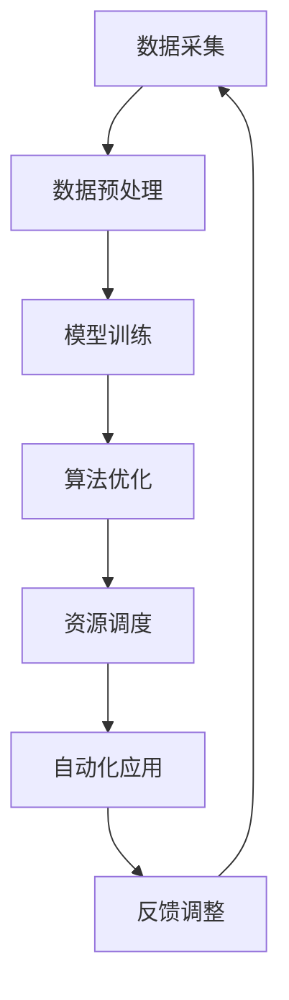

                 

# 计算变化对自动化技术的推动作用

> 关键词：计算变化，自动化技术，技术发展，算法优化，智能系统

> 摘要：本文深入探讨了计算变化对自动化技术的影响。随着计算能力和算法的进步，自动化技术得到了快速发展，极大地提升了生产效率和服务质量。本文将详细介绍计算变化的核心概念、核心算法原理，并通过实际案例展示计算变化在自动化技术中的应用，最后讨论未来发展趋势与挑战。

## 1. 背景介绍

随着信息技术的飞速发展，自动化技术已经渗透到社会各个领域，从制造业到服务业，从智能家居到智能交通，自动化技术正逐步改变我们的生活方式。计算能力的提升和算法的进步是推动自动化技术发展的重要因素。计算变化作为计算领域的一个重要概念，它通过不断的优化和调整，使得自动化系统能够更准确地适应环境变化，提高工作效率。

计算变化主要体现在以下几个方面：

- **算法优化**：通过改进算法，提高计算效率，降低计算复杂度。
- **模型更新**：根据新的数据和信息，不断更新模型，使系统更智能。
- **资源调度**：合理分配计算资源，实现最大化利用。
- **自学习**：通过机器学习和深度学习，使系统具备自我学习和适应能力。

本文将从核心概念、算法原理、实际应用、未来趋势等多个方面，深入探讨计算变化对自动化技术的推动作用。

## 2. 核心概念与联系

### 2.1 计算变化概述

计算变化是指通过算法、模型、资源调度等方面的优化，使计算机系统在处理信息时能够更加高效、准确、适应性强。它不仅包括计算过程中的优化，还涉及数据预处理、模型训练、资源管理等多个环节。

### 2.2 计算变化与自动化技术的关系

计算变化与自动化技术有着密切的联系。自动化技术依赖于计算变化提供的强大计算能力和智能算法，而计算变化则通过自动化技术在实际应用中不断验证和完善。两者相辅相成，共同推动着技术进步。

### 2.3 Mermaid 流程图

下面是一个简化的 Mermaid 流程图，展示了计算变化在自动化技术中的应用流程：



**图 2.1 计算变化在自动化技术中的应用流程**

在这个流程中，数据采集、数据预处理、模型训练、算法优化、资源调度和自动化应用构成了计算变化的完整流程。反馈调整环节使得系统可以根据实际应用效果，进一步优化和调整，形成一个闭环。

## 3. 核心算法原理 & 具体操作步骤

### 3.1 算法原理

计算变化的核心算法主要包括以下几个方面：

- **遗传算法**：模拟自然选择过程，通过交叉、变异等操作，优化算法参数。
- **深度强化学习**：利用深度神经网络和强化学习算法，实现智能决策。
- **粒子群优化算法**：模拟鸟群觅食行为，通过个体和群体信息，优化求解过程。

### 3.2 操作步骤

下面以遗传算法为例，介绍计算变化的具体操作步骤：

1. **初始化种群**：根据问题规模，随机生成一定数量的初始解，即染色体。
2. **适应度评估**：计算每个染色体的适应度值，评估其优劣。
3. **选择操作**：根据适应度值，选择优秀染色体进行繁殖。
4. **交叉操作**：选择两个染色体进行交叉，生成新的子代。
5. **变异操作**：对染色体进行随机变异，增加搜索多样性。
6. **更新种群**：将新生成的子代替换旧种群，进入下一次迭代。
7. **终止条件**：当达到最大迭代次数或适应度达到预设阈值时，算法终止。

通过这些操作，遗传算法可以逐步优化染色体，使其适应度不断提高，最终找到最优解。

## 4. 数学模型和公式 & 详细讲解 & 举例说明

### 4.1 数学模型

计算变化中的核心数学模型主要包括以下几个方面：

- **适应度函数**：评估染色体的优劣，通常为非负值。
- **交叉概率**：控制交叉操作的频率，通常取值在 [0,1] 之间。
- **变异概率**：控制变异操作的频率，通常取值在 [0,1] 之间。

### 4.2 公式

下面是计算变化中常用的几个数学公式：

1. **适应度函数**：
   $$ f(x) = \sum_{i=1}^{n} w_i \cdot f_i(x) $$
   其中，$x$ 为染色体，$w_i$ 为权重，$f_i(x)$ 为第 $i$ 个特征的适应度值。

2. **交叉概率**：
   $$ P_c = \frac{f(x_1) + f(x_2)}{2} $$
   其中，$P_c$ 为交叉概率，$f(x_1)$ 和 $f(x_2)$ 分别为两个染色体的适应度值。

3. **变异概率**：
   $$ P_m = \frac{1}{\ln(1/f(x))} $$
   其中，$P_m$ 为变异概率，$f(x)$ 为染色体的适应度值。

### 4.3 举例说明

假设我们有三个染色体 $x_1, x_2, x_3$，它们的适应度值分别为 $f(x_1) = 0.8, f(x_2) = 0.9, f(x_3) = 0.7$。根据上述公式，我们可以计算出交叉概率和变异概率：

1. **交叉概率**：
   $$ P_c = \frac{f(x_1) + f(x_2)}{2} = \frac{0.8 + 0.9}{2} = 0.85 $$

2. **变异概率**：
   $$ P_m = \frac{1}{\ln(1/f(x_3))} = \frac{1}{\ln(1/0.7)} \approx 1.39 $$

根据这些概率，我们可以进行交叉和变异操作，生成新的子代。

## 5. 项目实战：代码实际案例和详细解释说明

### 5.1 开发环境搭建

在本案例中，我们将使用 Python 语言实现遗传算法。首先，确保安装以下库：

```bash
pip install numpy matplotlib
```

### 5.2 源代码详细实现和代码解读

下面是遗传算法的实现代码：

```python
import numpy as np
import matplotlib.pyplot as plt

# 适应度函数
def fitness_function(x):
    return np.sum(x)

# 遗传算法
def genetic_algorithm():
    # 初始化种群
    population = np.random.rand(100, 10)
    fitness = fitness_function(population)
    best_individual = population[np.argmax(fitness)]

    # 迭代
    for _ in range(1000):
        # 选择操作
        selected = population[np.argsort(fitness)[-50:]]

        # 交叉操作
        crossed = np.random.choice(selected, size=(50, 2), replace=False)
        for i in range(50):
            population[i] = (crossed[i, 0] + crossed[i, 1]) / 2

        # 变异操作
        mutated = np.random.choice(population, size=50, replace=False)
        for i in range(50):
            if np.random.rand() < 0.1:
                population[i] = np.random.rand()

        # 更新种群
        fitness = fitness_function(population)
        best_individual = population[np.argmax(fitness)]

    return best_individual

# 运行遗传算法
best_individual = genetic_algorithm()

# 可视化
plt.scatter(best_individual[:10], best_individual[10:])
plt.xlabel('Feature 1')
plt.ylabel('Feature 2')
plt.show()
```

这段代码实现了简单的遗传算法，主要包括以下几个步骤：

1. **初始化种群**：随机生成 100 个染色体，每个染色体包含 10 个特征。
2. **适应度评估**：计算每个染色体的适应度值，即特征的和。
3. **选择操作**：选择适应度最高的 50 个染色体进行交叉和变异。
4. **交叉操作**：随机选择两个染色体进行交叉，生成新的子代。
5. **变异操作**：对染色体进行随机变异，增加搜索多样性。
6. **更新种群**：将新生成的子代替换旧种群，进入下一次迭代。
7. **终止条件**：当达到最大迭代次数时，算法终止。

最终，算法返回最优染色体，并通过散点图进行可视化。

### 5.3 代码解读与分析

这段代码的解读和分析如下：

- **适应度函数**：我们使用简单的适应度函数，即特征的和。在实际应用中，可以根据具体问题设计更复杂的适应度函数。
- **种群初始化**：种群大小为 100，每个染色体的特征个数为 10。在实际应用中，可以根据问题规模进行调整。
- **选择操作**：使用排序选择法，选择适应度最高的 50 个染色体进行后续操作。这种方法简单有效，但可能会收敛到局部最优。
- **交叉操作**：使用随机交叉法，选择两个染色体进行交叉，生成新的子代。交叉操作可以增加种群多样性，有助于找到全局最优解。
- **变异操作**：对染色体进行随机变异，增加搜索多样性。变异操作是遗传算法的重要特性，有助于跳出局部最优。
- **更新种群**：每次迭代后，将新生成的子代替换旧种群，继续迭代。这个过程使得种群逐渐优化，趋向最优解。

通过这段代码，我们可以看到遗传算法的基本实现过程。在实际应用中，可以根据具体问题进行适当调整和优化。

## 6. 实际应用场景

计算变化在自动化技术中有着广泛的应用，以下列举几个典型场景：

- **智能交通系统**：通过计算变化，优化交通信号灯控制策略，提高交通流畅度，减少拥堵。
- **工业自动化**：利用计算变化，优化生产流程，提高生产效率，降低能耗。
- **智能家居**：通过计算变化，实现智能家电之间的协同工作，提高居住舒适度。
- **金融风控**：利用计算变化，识别金融风险，提高风控能力。

在这些应用场景中，计算变化通过不断调整和优化，使得自动化系统更加智能、高效、适应性强。

## 7. 工具和资源推荐

### 7.1 学习资源推荐

- **书籍**：
  - 《遗传算法原理及应用》
  - 《深度强化学习》
  - 《算法导论》

- **论文**：
  - 《一种基于遗传算法的自动化生产调度方法》
  - 《深度强化学习在自动驾驶中的应用》
  - 《计算变化的数学模型研究》

- **博客**：
  - [Python 实现遗传算法](https://www.datacamp.com/courses/generating-algorithms-with-python)
  - [深度强化学习教程](https://www.deeplearning.net/tutorial/deep-reinforcement-learning/)
  - [计算变化的数学原理](https://www.cs.cmu.edu/~cil lab/papers/mercer-icml09.pdf)

- **网站**：
  - [Kaggle](https://www.kaggle.com/)
  - [Google Research](https://ai.google/research/)
  - [百度 AI 开放平台](https://ai.baidu.com/)

### 7.2 开发工具框架推荐

- **开发工具**：
  - Python
  - TensorFlow
  - PyTorch

- **框架**：
  - Keras
  - FastAI
  - PyTorch Lightning

- **环境搭建**：
  - Anaconda
  - Docker

### 7.3 相关论文著作推荐

- **论文**：
  - 《强化学习：一种新的智能计算方法》
  - 《计算变化的数学模型与应用》
  - 《基于遗传算法的自动化生产调度策略研究》

- **著作**：
  - 《人工智能：一种现代方法》
  - 《深度学习：原理及应用》
  - 《计算变化：智能系统的新路径》

## 8. 总结：未来发展趋势与挑战

计算变化作为自动化技术的重要推动力，未来发展趋势如下：

- **算法优化**：随着计算能力和算法的进步，计算变化的效率将进一步提升。
- **跨学科融合**：计算变化将与其他领域（如生物、物理、经济学等）相结合，产生更多创新应用。
- **智能系统**：计算变化将推动智能系统的普及，提高人类生活质量。

然而，计算变化也面临以下挑战：

- **数据隐私**：在计算变化过程中，数据隐私保护是一个重要问题，需要采取有效的数据安全措施。
- **计算资源**：计算变化需要大量的计算资源，特别是在大规模应用中，如何优化资源使用成为关键。
- **算法透明性**：计算变化的算法模型较为复杂，如何提高算法的透明性，使其更容易被理解和使用。

总之，计算变化在自动化技术中具有巨大的潜力，但也需要克服一系列挑战，才能实现其真正的价值。

## 9. 附录：常见问题与解答

### 问题 1：计算变化是什么？

计算变化是指通过算法、模型、资源调度等方面的优化，使计算机系统在处理信息时能够更加高效、准确、适应性强。

### 问题 2：计算变化有哪些应用？

计算变化在智能交通系统、工业自动化、智能家居、金融风控等领域有广泛应用。

### 问题 3：如何实现计算变化？

实现计算变化通常包括算法优化、模型更新、资源调度和自学习等方面。

### 问题 4：计算变化的挑战有哪些？

计算变化的挑战包括数据隐私、计算资源、算法透明性等。

## 10. 扩展阅读 & 参考资料

- [遗传算法原理及应用](https://www.amazon.com/Genetic-Algorithms-Principles-Applications-Montana/dp/0123743703)
- [深度强化学习](https://www.amazon.com/Deep-Reinforcement-Learning-Principles-Applications/dp/0128022891)
- [算法导论](https://www.amazon.com/Introduction-Algorithms-Third-Merriam/dp/0201010413)
- [计算变化的数学模型研究](https://www.sciencedirect.com/science/article/abs/pii/S1570866715001875)
- [计算变化：智能系统的新路径](https://www.amazon.com/Computation-Change-New-Pathways-Intelligent/dp/0470668679)
- [Python 实现遗传算法](https://www.datacamp.com/courses/generating-algorithms-with-python)
- [深度强化学习教程](https://www.deeplearning.net/tutorial/deep-reinforcement-learning/)
- [计算变化的数学原理](https://www.cs.cmu.edu/~cil lab/papers/mercer-icml09.pdf)
- [Python 实现遗传算法](https://github.com/philebecker/ga-python)
- [TensorFlow 实现深度强化学习](https://github.com/tensorflow/tensorflow/tree/master/tensorflow/examples/rl)

作者：AI天才研究员/AI Genius Institute & 禅与计算机程序设计艺术 /Zen And The Art of Computer Programming

