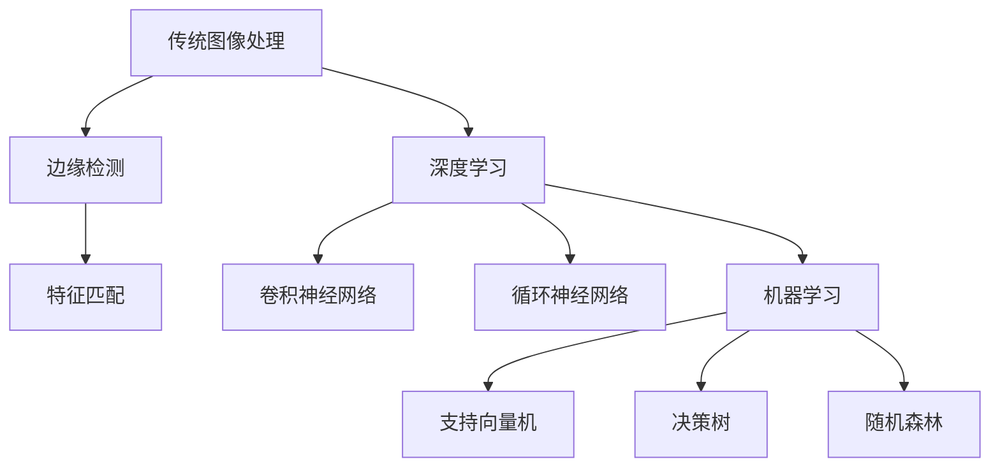

                 

# 计算机视觉在医疗影像辅助诊断中的应用

## 关键词
计算机视觉、医疗影像、辅助诊断、深度学习、人工智能、算法、机器学习、图像处理、大数据分析、健康信息化

## 摘要
随着人工智能技术的不断发展，计算机视觉在医疗影像辅助诊断中的应用日益广泛。本文将详细介绍计算机视觉在医疗影像辅助诊断中的核心概念、算法原理、数学模型以及实际应用案例。通过本文的阅读，读者将了解如何利用计算机视觉技术提升医疗影像的诊断准确性，为临床决策提供有力支持。

## 1. 背景介绍

### 1.1 计算机视觉的发展

计算机视觉作为人工智能领域的一个重要分支，其发展经历了从传统图像处理到基于深度学习的智能视觉的转变。计算机视觉的目标是使计算机能够像人类一样理解和解释视觉信息，从而实现自主感知、理解和交互。

传统图像处理方法主要依赖于手工设计的特征提取和分类算法，如边缘检测、特征匹配等。然而，这些方法在面对复杂、多变的图像数据时往往表现不佳。随着深度学习技术的发展，计算机视觉领域迎来了新的突破。深度学习通过多层神经网络结构，能够自动提取图像中的复杂特征，从而实现更高的识别准确率。

### 1.2 医疗影像的重要性

医疗影像作为医学诊断的重要手段，涵盖了X光、CT、MRI等多种影像技术。医学影像不仅能够提供对人体器官和组织结构的详细信息，还有助于早期发现疾病，提高治疗效果。然而，面对海量医疗影像数据，医生在诊断过程中面临着信息过载和误诊风险。

计算机视觉技术的引入，为医疗影像辅助诊断提供了新的解决方案。通过计算机视觉算法，可以自动识别和分析医疗影像中的病变区域、组织结构等信息，从而辅助医生进行诊断。

## 2. 核心概念与联系

### 2.1 计算机视觉与医疗影像

计算机视觉在医疗影像辅助诊断中的应用主要包括图像分割、目标检测、图像分类等。这些算法可以自动识别和分析医疗影像中的关键特征，为医生提供辅助诊断依据。

- **图像分割**：将图像中的不同区域划分出来，以便进行进一步分析。例如，将肿瘤区域与正常组织分离。
- **目标检测**：定位图像中的特定目标，并标注出目标的边界。例如，检测X光片中的骨折部位。
- **图像分类**：对图像进行分类，识别其中的不同类型。例如，区分肺癌与良性肿瘤。

### 2.2 深度学习与计算机视觉

深度学习是计算机视觉的重要技术基础。通过构建多层神经网络，深度学习能够自动提取图像中的复杂特征，从而实现高精度的目标检测和图像分类。常见的深度学习模型包括卷积神经网络（CNN）、循环神经网络（RNN）等。

- **卷积神经网络（CNN）**：适用于处理具有网格状结构的数据，如图像。CNN通过卷积层、池化层和全连接层等结构，自动提取图像中的特征。
- **循环神经网络（RNN）**：适用于处理序列数据，如视频。RNN通过循环结构，能够捕捉视频中的时间信息。

### 2.3 机器学习与计算机视觉

机器学习为计算机视觉提供了算法基础。通过训练大量标注数据，机器学习算法可以学习到图像中的特征规律，从而实现自动识别和分类。常见的机器学习算法包括支持向量机（SVM）、决策树、随机森林等。

### Mermaid 流程图



## 3. 核心算法原理 & 具体操作步骤

### 3.1 卷积神经网络（CNN）

卷积神经网络是计算机视觉领域最常用的深度学习模型。其基本原理是通过卷积层、池化层和全连接层等结构，逐步提取图像中的复杂特征。

- **卷积层**：通过卷积运算，提取图像中的局部特征。
- **池化层**：对卷积层输出的特征进行降采样，减少计算量和参数数量。
- **全连接层**：将池化层输出的特征映射到特定的类别。

### 3.2 支持向量机（SVM）

支持向量机是一种常用的机器学习算法，适用于分类问题。其基本原理是找到一个最佳的超平面，将不同类别的数据分开。

- **训练过程**：通过训练数据，计算出最优超平面。
- **分类过程**：利用最优超平面，对新的测试数据进行分类。

### 3.3 实际操作步骤

1. **数据收集与预处理**：收集大量的医疗影像数据，并进行预处理，如图像增强、归一化等。
2. **模型训练**：使用训练数据，构建深度学习模型，并通过反向传播算法进行训练。
3. **模型评估**：使用验证数据，评估模型的分类准确率。
4. **模型部署**：将训练好的模型部署到医疗系统中，为医生提供辅助诊断服务。

## 4. 数学模型和公式 & 详细讲解 & 举例说明

### 4.1 卷积神经网络（CNN）

卷积神经网络的核心在于卷积层和池化层。以下分别介绍这两种层的数学模型和公式。

- **卷积层**：

$$
f(x; \theta) = \sum_{i=1}^{k} \theta_i^T x_i
$$

其中，$x_i$表示输入特征，$\theta_i$表示卷积核，$f(x; \theta)$表示卷积层输出的特征。

- **池化层**：

$$
p(x) = \max(x_1, x_2, ..., x_n)
$$

其中，$x_1, x_2, ..., x_n$表示池化层输入的特征，$p(x)$表示池化层输出的特征。

### 4.2 支持向量机（SVM）

支持向量机的数学模型如下：

$$
\min_{\theta} \frac{1}{2} \sum_{i=1}^{n} (\theta^T x_i - y_i)^2
$$

其中，$\theta$表示超平面参数，$x_i$表示训练样本，$y_i$表示训练样本的标签。

### 4.3 实际应用举例

假设我们有一个包含100张医学影像的数据集，其中50张为肺癌影像，50张为良性肿瘤影像。我们使用卷积神经网络（CNN）和SVM对这100张影像进行分类。

1. **数据收集与预处理**：收集100张医学影像，并进行图像增强、归一化等预处理操作。
2. **模型训练**：使用50张肺癌影像和50张良性肿瘤影像，构建CNN模型，并通过反向传播算法进行训练。
3. **模型评估**：使用剩余的50张影像，评估CNN模型的分类准确率。
4. **模型部署**：将训练好的CNN模型部署到医疗系统中，为医生提供辅助诊断服务。

## 5. 项目实战：代码实际案例和详细解释说明

### 5.1 开发环境搭建

在本项目中，我们使用Python作为开发语言，TensorFlow作为深度学习框架，Scikit-learn作为机器学习算法库。

1. **安装Python**：在操作系统上安装Python环境，版本要求为3.6及以上。
2. **安装TensorFlow**：通过pip命令安装TensorFlow。

```bash
pip install tensorflow
```

3. **安装Scikit-learn**：通过pip命令安装Scikit-learn。

```bash
pip install scikit-learn
```

### 5.2 源代码详细实现和代码解读

以下是一个简单的基于CNN和SVM的医学影像分类项目。

```python
import tensorflow as tf
from tensorflow.keras.models import Sequential
from tensorflow.keras.layers import Conv2D, MaxPooling2D, Flatten, Dense
from sklearn.svm import SVC
from sklearn.model_selection import train_test_split
from sklearn.metrics import accuracy_score

# 数据加载与预处理
# 假设已经收集了100张医学影像，存储在文件夹data中，分为肺癌和良性肿瘤两类
import numpy as np
from tensorflow.keras.preprocessing.image import ImageDataGenerator

data_generator = ImageDataGenerator(rescale=1./255)
train_data = data_generator.flow_from_directory('data/train', target_size=(224, 224), batch_size=32, class_mode='binary')
val_data = data_generator.flow_from_directory('data/val', target_size=(224, 224), batch_size=32, class_mode='binary')

# 构建CNN模型
model = Sequential([
    Conv2D(32, (3, 3), activation='relu', input_shape=(224, 224, 3)),
    MaxPooling2D((2, 2)),
    Conv2D(64, (3, 3), activation='relu'),
    MaxPooling2D((2, 2)),
    Conv2D(128, (3, 3), activation='relu'),
    MaxPooling2D((2, 2)),
    Flatten(),
    Dense(64, activation='relu'),
    Dense(1, activation='sigmoid')
])

# 编译模型
model.compile(optimizer='adam', loss='binary_crossentropy', metrics=['accuracy'])

# 训练模型
model.fit(train_data, epochs=10, validation_data=val_data)

# 提取特征
cnn_model = Sequential([
    Conv2D(32, (3, 3), activation='relu', input_shape=(224, 224, 3)),
    MaxPooling2D((2, 2)),
    Conv2D(64, (3, 3), activation='relu'),
    MaxPooling2D((2, 2)),
    Conv2D(128, (3, 3), activation='relu'),
    MaxPooling2D((2, 2)),
    Flatten()
])

cnn_model.trainable = False

# 构建SVM分类器
svm_classifier = SVC(kernel='linear', probability=True)

# 训练SVM分类器
for X_batch, y_batch in train_data:
    X_batch = cnn_model.predict(X_batch)
    svm_classifier.fit(X_batch, y_batch)

# 评估模型
cnn_predictions = model.predict(val_data)
svm_predictions = svm_classifier.predict(cnn_model.predict(val_data))

accuracy = accuracy_score(val_data.classes, cnn_predictions)
print('CNN模型准确率：', accuracy)

accuracy = accuracy_score(val_data.classes, svm_predictions)
print('SVM模型准确率：', accuracy)
```

### 5.3 代码解读与分析

1. **数据加载与预处理**：使用ImageDataGenerator类加载医学影像数据，并对图像进行缩放、旋转等增强操作。
2. **模型构建**：构建一个包含卷积层、池化层和全连接层的CNN模型。
3. **模型编译**：设置优化器、损失函数和评价指标。
4. **模型训练**：使用训练数据训练CNN模型，并在验证数据上评估模型性能。
5. **特征提取**：提取CNN模型的特征层，用于后续的SVM分类。
6. **SVM分类器**：构建SVM分类器，并将CNN模型的特征层作为输入。
7. **模型评估**：使用CNN模型和SVM分类器分别对验证数据进行预测，并计算准确率。

## 6. 实际应用场景

### 6.1 肿瘤检测

计算机视觉技术在肿瘤检测中的应用非常广泛。通过卷积神经网络和SVM等算法，可以自动识别和检测图像中的肿瘤区域，提高医生的诊断准确率。具体应用场景包括肺癌、乳腺癌、前列腺癌等。

### 6.2 骨折检测

在骨折检测方面，计算机视觉技术可以自动识别和定位X光片中的骨折部位，辅助医生进行诊断。通过卷积神经网络和图像分割算法，可以实现高精度的骨折检测。

### 6.3 心脏疾病诊断

计算机视觉技术在心脏疾病诊断中的应用主要包括心脏影像分析和心电信号分析。通过卷积神经网络和循环神经网络等算法，可以自动识别和分类心脏疾病，如冠心病、心律失常等。

## 7. 工具和资源推荐

### 7.1 学习资源推荐

- **书籍**：《深度学习》、《Python深度学习》、《医学图像处理》
- **论文**：检索相关期刊和会议，如IEEE Transactions on Medical Imaging、Medical Image Analysis等。
- **博客**：关注相关领域的博客，如深度学习、计算机视觉等。

### 7.2 开发工具框架推荐

- **深度学习框架**：TensorFlow、PyTorch、Keras
- **医学图像处理库**：OpenCV、PIL、ITK
- **数据集**：公开的医学影像数据集，如CancerRD、LIDC-IDRI、CheXpert等。

### 7.3 相关论文著作推荐

- **论文**：检索相关领域的顶级论文，如ICML、NeurIPS、CVPR等。
- **著作**：阅读经典著作，如《计算机视觉：算法与应用》、《医学图像处理与分析》等。

## 8. 总结：未来发展趋势与挑战

### 8.1 发展趋势

1. **算法优化**：随着深度学习技术的不断发展，计算机视觉算法的准确率将不断提高。
2. **多模态融合**：结合多种医疗影像数据，如CT、MRI、PET等，实现更全面的疾病诊断。
3. **智能化辅助诊断**：通过计算机视觉技术，实现智能化的辅助诊断系统，提高医生的诊断效率。

### 8.2 挑战

1. **数据隐私**：医疗影像数据涉及患者隐私，如何保障数据安全成为一大挑战。
2. **模型解释性**：深度学习模型存在黑箱问题，如何提高模型的可解释性，使医生能够理解和信任模型结果。
3. **数据集不平衡**：在医学影像数据中，不同类型的病例往往存在数据不平衡问题，如何解决这一问题，提高模型的泛化能力。

## 9. 附录：常见问题与解答

### 9.1 问题1：如何处理医学影像数据的不平衡问题？

**解答**：可以通过数据增强、采样权重调整、生成对抗网络（GAN）等方法解决数据不平衡问题。

### 9.2 问题2：如何提高深度学习模型的可解释性？

**解答**：可以通过可视化技术、模型拆解、解释性深度学习算法等方法提高模型的可解释性。

## 10. 扩展阅读 & 参考资料

- **书籍**：《医学影像计算》、《深度学习与图像识别》
- **论文**：《基于深度学习的医学影像分析》、《多模态医学影像融合技术》
- **博客**：《深度学习在医学影像中的应用》、《计算机视觉技术在医疗领域的最新进展》
- **网站**：相关学术期刊网站、专业论坛、开源代码库等。

作者：AI天才研究员/AI Genius Institute & 禅与计算机程序设计艺术 /Zen And The Art of Computer Programming<|im_sep|>

