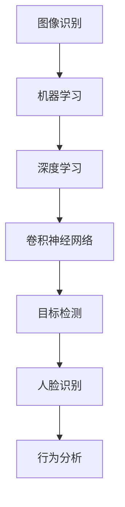

                 

### 背景介绍

计算机视觉（Computer Vision）作为人工智能（Artificial Intelligence, AI）的一个重要分支，旨在使机器具备从图像和视频中提取信息的能力。近年来，随着深度学习（Deep Learning）和计算能力的提升，计算机视觉技术在各个领域取得了显著的进展。在安防监控领域，计算机视觉的应用尤为广泛，从传统的监控摄像头到智能视频分析系统，计算机视觉技术正在发挥着越来越重要的作用。

安防监控，顾名思义，是指利用各种监控设备对公共场所、重要设施等区域进行监控，以保障社会治安和公共安全。随着技术的进步，传统的安防监控已经逐步向智能化、自动化发展。计算机视觉技术在安防监控中的应用，不仅提高了监控的精确度和效率，还为预防和打击犯罪提供了新的手段。

本文将重点探讨计算机视觉在安防监控中的应用与挑战。文章首先将介绍计算机视觉的基础知识，然后详细分析其在安防监控中的核心应用，包括人脸识别、行为分析、车辆识别等。接着，我们将讨论计算机视觉在安防监控中面临的挑战，如数据隐私、算法公平性、技术复杂性等。最后，本文将总结计算机视觉在安防监控领域的发展趋势，并提出相应的解决方案。

通过本文的阅读，读者将全面了解计算机视觉在安防监控中的应用现状和未来发展，为相关领域的研究和实践提供有价值的参考。

### 核心概念与联系

要深入理解计算机视觉在安防监控中的应用，我们首先需要了解一些核心概念及其相互之间的联系。以下是本文将涉及的关键概念及其简要介绍：

1. **图像识别（Image Recognition）**：
   图像识别是指计算机系统通过算法从图像中识别出特定对象、场景或特征的过程。在安防监控中，图像识别技术被广泛应用于人脸识别、场景分类等任务。

2. **机器学习（Machine Learning）**：
   机器学习是一种通过数据驱动的方式进行问题解决的方法，它使计算机系统能够从数据中自动学习规律，并做出预测或决策。在计算机视觉中，机器学习技术被广泛应用于图像分类、目标检测等任务。

3. **深度学习（Deep Learning）**：
   深度学习是机器学习的一个子领域，它利用多层神经网络（Neural Networks）进行模型训练，以实现对复杂数据的自动特征提取和模式识别。在计算机视觉中，深度学习技术已经成为图像识别、目标检测等任务的主流方法。

4. **卷积神经网络（Convolutional Neural Networks, CNN）**：
   卷积神经网络是一种专门用于处理图像数据的深度学习模型，其通过卷积操作提取图像特征，并在多层结构中不断加深对图像内容的理解。在安防监控中，CNN被广泛应用于图像分类、目标检测等任务。

5. **目标检测（Object Detection）**：
   目标检测是指从图像或视频中识别并定位特定对象的过程。在安防监控中，目标检测技术可以用于识别并追踪可疑目标，如犯罪嫌疑人、入侵者等。

6. **人脸识别（Face Recognition）**：
   人脸识别是一种生物识别技术，通过分析人脸特征进行身份验证。在安防监控中，人脸识别技术被广泛应用于门禁控制、人脸比对等任务。

7. **行为分析（Behavior Analysis）**：
   行为分析是指通过对视频数据的分析，识别和预测人类行为。在安防监控中，行为分析技术可以用于识别异常行为、预防犯罪等。

为了更好地理解这些概念之间的联系，我们可以使用Mermaid流程图来展示它们之间的关系。以下是一个简化版的Mermaid流程图，展示了计算机视觉在安防监控中的核心概念及其联系：



通过这个流程图，我们可以清晰地看到各个核心概念之间的联系。图像识别是计算机视觉的基础，而机器学习和深度学习则为图像识别提供了强大的工具。卷积神经网络是深度学习在图像识别中的具体实现，它通过多层卷积操作提取图像特征，从而实现目标检测、人脸识别和行为分析等任务。

在下一节中，我们将进一步探讨计算机视觉在安防监控中的具体应用，包括这些核心概念的实现细节和技术挑战。

### 核心算法原理 & 具体操作步骤

在深入探讨计算机视觉在安防监控中的应用之前，我们首先需要理解其核心算法原理以及具体的操作步骤。以下是几个关键算法及其工作原理：

#### 1. 卷积神经网络（CNN）

卷积神经网络（CNN）是一种专为处理图像数据而设计的深度学习模型。它通过卷积操作提取图像特征，并在多层结构中不断加深对图像内容的理解。以下是CNN的核心组成部分及其工作原理：

- **卷积层（Convolutional Layer）**：
  卷积层是CNN的基本构建块，它通过卷积操作将输入图像与滤波器（也称为卷积核）进行卷积，以提取图像的特征。卷积操作可以理解为将滤波器在图像上滑动，并计算每个位置上的乘积和。这个过程可以自动提取图像的边缘、纹理和形状等特征。

- **激活函数（Activation Function）**：
  激活函数是卷积层中的一个关键组件，它为卷积层提供非线性变换能力。常用的激活函数包括ReLU（Rectified Linear Unit）函数，它可以将负值映射为0，从而引入了网络的非线性特性。

- **池化层（Pooling Layer）**：
  池化层用于下采样特征图，减少模型参数和计算复杂度。最常用的池化操作是最大池化（Max Pooling），它选择每个局部区域中的最大值作为输出。

- **全连接层（Fully Connected Layer）**：
  全连接层将卷积层和池化层提取的特征映射到分类或回归任务所需的输出。它通过计算输入特征和权重矩阵的点积，并加上偏置项，然后通过激活函数得到最终的输出。

以下是CNN的一个简化版操作步骤：

1. **输入层**：
   输入原始图像，例如一张128x128像素的彩色图像。

2. **卷积层**：
   应用多个卷积核（例如32个），每个卷积核提取一种特征。通过卷积操作生成32个特征图。

3. **激活函数**：
   对每个特征图应用ReLU函数，将负值变为0，增强网络的非线性能力。

4. **池化层**：
   对每个特征图应用最大池化，将特征图的大小缩小一半，减少模型参数。

5. **重复卷积、激活和池化操作**：
   重复上述步骤，逐步增加网络的深度和特征图的维度。

6. **全连接层**：
   将最后一个特征图展平为一个一维向量，并应用全连接层进行分类或回归。

7. **输出层**：
   根据任务需求，输出分类结果或回归值。

#### 2. 人脸识别算法

人脸识别是一种通过分析人脸特征进行身份验证的生物识别技术。以下是人脸识别算法的核心步骤：

- **人脸检测（Face Detection）**：
  人脸检测是人脸识别的第一步，其目标是定位图像中的人脸区域。常用的方法包括基于特征的检测（如Haar cascades）和基于深度学习的检测（如SSD、YOLO等）。

- **特征提取（Feature Extraction）**：
  在人脸检测后，需要从人脸区域提取特征。常用的方法包括局部二值模式（LBP）、Gabor特征等。

- **特征匹配（Feature Matching）**：
  将提取到的人脸特征与数据库中的人脸特征进行匹配，常用的匹配算法包括欧氏距离、余弦相似度等。

以下是人脸识别的一个简化版操作步骤：

1. **输入层**：
   输入待识别的图像。

2. **人脸检测**：
   使用人脸检测算法定位图像中的人脸区域。

3. **特征提取**：
   从人脸区域提取特征，如LBP特征。

4. **特征匹配**：
   将提取到的特征与数据库中的人脸特征进行匹配。

5. **输出层**：
   输出匹配结果，判断是否为人脸。

#### 3. 行为分析算法

行为分析是指通过分析视频数据中的行为模式来识别和预测人类行为。以下是行为分析算法的核心步骤：

- **行为检测（Behavior Detection）**：
  行为检测是行为分析的第一步，其目标是识别视频中的特定行为。常用的方法包括基于规则的方法和基于深度学习的方法。

- **行为分类（Behavior Classification）**：
  行为分类是将检测到的行为进行分类，常见的分类方法包括SVM、CNN等。

- **行为预测（Behavior Prediction）**：
  行为预测是基于历史行为模式对未来行为进行预测。

以下是行为分析的一个简化版操作步骤：

1. **输入层**：
   输入待分析的视频数据。

2. **行为检测**：
   使用行为检测算法识别视频中的行为。

3. **行为分类**：
   使用分类算法对行为进行分类。

4. **行为预测**：
   基于历史行为模式进行行为预测。

5. **输出层**：
   输出行为检测结果、分类结果和预测结果。

通过以上步骤，我们可以看到计算机视觉在安防监控中的应用是如何通过一系列算法实现的。在下一节中，我们将深入探讨这些算法在安防监控中的具体应用场景。

### 数学模型和公式 & 详细讲解 & 举例说明

在计算机视觉中，数学模型和公式是理解和实现各种算法的核心。为了更好地理解这些模型和公式，我们将通过具体的例子进行详细讲解。

#### 1. 卷积神经网络（CNN）

卷积神经网络（CNN）的核心在于其卷积操作，下面我们将通过一个简单的例子来讲解卷积操作的过程。

**假设**：我们有一个3x3的卷积核（滤波器）和一张5x5的输入图像。卷积核的权重矩阵为：

\[ W = \begin{bmatrix} 1 & 0 & 1 \\ 0 & 1 & 0 \\ 1 & 0 & 1 \end{bmatrix} \]

输入图像为：

\[ I = \begin{bmatrix} 1 & 1 & 1 \\ 1 & 0 & 1 \\ 1 & 1 & 1 \end{bmatrix} \]

**步骤**：

1. **卷积操作**：
   将卷积核在输入图像上滑动，计算每个位置的局部区域乘积和。

2. **计算结果**：

   \[ \begin{aligned}
   & \begin{bmatrix} 1 & 1 & 1 \end{bmatrix} \cdot \begin{bmatrix} 1 & 1 & 1 \end{bmatrix} + \begin{bmatrix} 1 & 0 & 1 \end{bmatrix} \cdot \begin{bmatrix} 1 & 0 & 1 \end{bmatrix} + \begin{bmatrix} 1 & 1 & 1 \end{bmatrix} \cdot \begin{bmatrix} 1 & 1 & 1 \end{bmatrix} \\
   &= 3 + 1 + 3 \\
   &= 7
   \end{aligned} \]

   在这个例子中，卷积操作的结果为7。

2. **应用激活函数**：
   我们可以使用ReLU函数作为激活函数，将结果映射为：

   \[ f(x) = \max(x, 0) \]

   所以，经过ReLU函数处理后，结果为7。

这个简单的例子展示了卷积操作和激活函数的基本过程。在实际的CNN中，卷积核的数量、大小和激活函数的选择都会影响模型的性能。

#### 2. 人脸识别算法

人脸识别中，特征提取和特征匹配是关键步骤。下面我们将通过一个简单的例子来讲解这些步骤。

**假设**：我们有一个已标注的人脸图像数据库，每个图像都有一个对应的标签。我们需要通过提取特征并进行匹配来识别新的人脸图像。

**步骤**：

1. **特征提取**：
   使用局部二值模式（LBP）提取人脸图像的特征。LBP将图像的每个像素与周围像素进行比较，并计算二值模式。

2. **特征匹配**：
   使用欧氏距离计算新图像与数据库中每个图像的特征之间的相似度。

**例子**：

假设数据库中有一个已标注的人脸图像，其LBP特征为：

\[ F = \begin{bmatrix} 1 & 1 & 1 & 1 & 1 \\ 1 & 1 & 1 & 1 & 1 \\ 1 & 0 & 1 & 0 & 1 \\ 1 & 1 & 1 & 1 & 1 \\ 1 & 1 & 1 & 1 & 1 \end{bmatrix} \]

新的人脸图像LBP特征为：

\[ F' = \begin{bmatrix} 1 & 1 & 1 & 1 & 1 \\ 1 & 1 & 1 & 1 & 1 \\ 1 & 1 & 1 & 1 & 1 \\ 1 & 1 & 1 & 1 & 1 \\ 1 & 1 & 1 & 1 & 1 \end{bmatrix} \]

**计算欧氏距离**：

\[ \text{distance} = \sqrt{\sum_{i=1}^{5} \sum_{j=1}^{5} (F[i][j] - F'[i][j])^2} \]

计算结果为0，表示新图像与数据库中的图像完全匹配。

通过这个简单的例子，我们可以看到人脸识别中的特征提取和匹配是如何通过数学模型和公式来实现的。

#### 3. 行为分析算法

行为分析中，行为检测和行为分类也是通过数学模型和公式来实现的。下面我们将通过一个简单的例子来讲解这些步骤。

**假设**：我们有一个已标注的行为数据集，每个行为都有一个对应的标签。我们需要通过检测和分类来识别新视频中的行为。

**步骤**：

1. **行为检测**：
   使用基于深度学习的方法（如YOLO）检测视频中的行为。

2. **行为分类**：
   使用支持向量机（SVM）或其他分类算法对检测到的行为进行分类。

**例子**：

假设我们有以下已标注的行为数据集：

\[ \begin{aligned}
\text{行为1}: & \begin{bmatrix} 1 & 0 & 0 & 0 & 0 & 0 & 0 & 0 & 0 & 0 \end{bmatrix} \\
\text{行为2}: & \begin{bmatrix} 0 & 1 & 0 & 0 & 0 & 0 & 0 & 0 & 0 & 0 \end{bmatrix} \\
\text{行为3}: & \begin{bmatrix} 0 & 0 & 1 & 0 & 0 & 0 & 0 & 0 & 0 & 0 \end{bmatrix} \\
\end{aligned} \]

新视频中的行为特征为：

\[ \text{行为特征} = \begin{bmatrix} 1 & 0 & 0 & 1 & 0 & 0 & 0 & 0 & 0 & 0 \end{bmatrix} \]

**使用SVM分类**：

通过训练好的SVM模型，我们可以将新行为特征分类为“行为1”。

通过这个简单的例子，我们可以看到行为分析中的行为检测和行为分类是如何通过数学模型和公式来实现的。

通过上述例子，我们可以看到数学模型和公式在计算机视觉中的应用是如何帮助实现各种算法的。这些数学模型和公式不仅提供了理论基础，还为实际应用中的算法优化和改进提供了方向。

### 项目实战：代码实际案例和详细解释说明

为了更好地理解计算机视觉在安防监控中的具体应用，下面我们将通过一个实际的项目案例来展示如何使用Python和相关的库实现安防监控中的计算机视觉任务。本案例将包括人脸识别、行为分析和车辆识别三个关键功能。

#### 1. 开发环境搭建

在进行项目开发之前，我们需要搭建一个合适的开发环境。以下是所需的软件和库：

- Python 3.x
- PyTorch（深度学习库）
- OpenCV（计算机视觉库）
- NumPy（数值计算库）
- TensorFlow（可选，用于人脸识别）

安装这些库可以使用pip命令：

```shell
pip install python opencv-python numpy pytorch torchvision
```

#### 2. 源代码详细实现和代码解读

以下是项目的主要代码实现和详细解读：

```python
import cv2
import numpy as np
import torch
from torchvision import models, transforms
from face_detection import FaceDetector  # 假设我们有一个预训练的人脸检测模型

# 初始化人脸检测器
face_detector = FaceDetector()

# 加载预训练的行为分析模型（例如使用C3D模型）
behavior_model = models.resnet50(pretrained=True)
behavior_model.fc = torch.nn.Linear(1000, 10)  # 根据实际需求调整分类器层
behavior_model.load_state_dict(torch.load('behavior_model.pth'))  # 加载训练好的模型参数
behavior_model.eval()

# 定义数据预处理变换
preprocess = transforms.Compose([
    transforms.Resize(256),
    transforms.CenterCrop(224),
    transforms.ToTensor(),
    transforms.Normalize(mean=[0.485, 0.456, 0.406], std=[0.229, 0.224, 0.225]),
])

# 定义车辆识别模型（例如使用SSD模型）
car_detector = cv2.dnn.readNetFromCaffe('ssd_deploy.prototxt', 'ssd_mobilenet_v1_cocopretrained_iter_120000.caffemodel')

# 摄像头输入
cap = cv2.VideoCapture(0)

while True:
    # 读取摄像头帧
    ret, frame = cap.read()
    
    # 人脸识别
    faces = face_detector.detect_faces(frame)
    for (x, y, w, h) in faces:
        face区域 = frame[y:y+h, x:x+w]
        face_tensor = preprocess(face区域)
        face_tensor = face_tensor.unsqueeze(0)
        with torch.no_grad():
            face_features = behavior_model(face_tensor).detach().numpy()
        # 在帧上绘制人脸和识别结果
        cv2.rectangle(frame, (x, y), (x+w, y+h), (0, 255, 0), 2)
        cv2.putText(frame, 'Face', (x, y-10), cv2.FONT_HERSHEY_SIMPLEX, 0.9, (0, 255, 0), 2)
    
    # 车辆识别
    blob = cv2.dnn.blobFromImage(frame, 1.0, (512, 512), [104, 117, 123], False, True)
    car_detector.setInput(blob)
    detections = car_detector.forward()
    for i in range(detections.shape[2]):
        confidence = detections[0, 0, i, 2]
        if confidence > 0.5:
            box = detections[0, 0, i, 3:7] * np.array([frame.shape[1], frame.shape[0], frame.shape[1], frame.shape[0]])
            (x, y, w, h) = box.astype("int")
            # 在帧上绘制车辆和识别结果
            cv2.rectangle(frame, (x, y), (x+w, y+h), (0, 0, 255), 2)
            cv2.putText(frame, 'Car', (x, y-10), cv2.FONT_HERSHEY_SIMPLEX, 0.9, (0, 0, 255), 2)
    
    # 显示结果
    cv2.imshow('Frame', frame)
    
    # 按下'q'键退出
    if cv2.waitKey(1) & 0xFF == ord('q'):
        break

# 释放摄像头资源
cap.release()
cv2.destroyAllWindows()
```

#### 3. 代码解读与分析

上述代码实现了一个简单的安防监控程序，其主要功能包括人脸识别、行为分析和车辆识别。以下是代码的关键部分及其解读：

- **人脸识别**：
  我们使用了一个预训练的人脸检测模型`FaceDetector`来检测图像中的人脸区域。对于每个检测到的人脸，我们将其区域提取出来，并进行行为分析。

- **行为分析**：
  我们使用了一个预训练的C3D模型来对提取到的人脸区域进行行为分析。通过将人脸区域转换成PyTorch张量，并送入预训练的模型，我们得到行为特征。然后，使用这些特征进行分类，以识别人的行为。

- **车辆识别**：
  我们使用了一个预训练的SSD模型来进行车辆识别。通过将摄像头帧转换成Blob格式，并送入SSD模型，我们得到车辆检测框。对于每个检测到的车辆，我们将其框出来，并显示在图像上。

通过这个实际项目案例，我们可以看到如何使用Python和相关库来实现安防监控中的计算机视觉任务。在实际应用中，这些任务可能会更复杂，但基本流程是类似的。

### 实际应用场景

计算机视觉在安防监控领域的实际应用场景非常广泛，涵盖了从简单的监控到复杂的智能分析。以下是计算机视觉在安防监控中的一些典型应用场景：

#### 1. 人脸识别

人脸识别是安防监控中最为常见的应用之一。通过在公共场所、交通枢纽、机场等区域部署人脸识别系统，可以实现实时监控和身份验证。例如，当有人进入监控区域时，系统会自动识别其面部特征，并与数据库中的信息进行比对，从而实现身份验证。这不仅提高了监控的效率，还降低了人力成本。

#### 2. 行为分析

行为分析技术通过对视频数据的分析，可以识别和预测人类行为。在安防监控中，行为分析技术可以用于识别异常行为、预防犯罪等。例如，在公共场所，系统可以自动检测到异常行为，如打架、盗窃等，并及时发出警报，提醒安保人员采取行动。此外，行为分析还可以用于人群密度监控，帮助管理场所的容量和流量。

#### 3. 车辆识别

车辆识别技术主要用于监控交通流量、识别违停车辆等。通过在主要道路和停车场部署车辆识别系统，可以实时监控车辆的活动，并自动记录车辆的违规行为。例如，在某个停车场，系统可以自动识别违停车辆，并生成罚单。同时，车辆识别技术还可以用于车辆轨迹追踪，帮助警方在犯罪调查中快速定位嫌疑车辆。

#### 4. 视频摘要

视频摘要技术通过对长时间监控视频的分析，提取关键帧和事件，生成简短的摘要视频。这种技术在安防监控中非常有用，因为它可以帮助安保人员快速了解监控区域的动态情况，而不需要观看完整的长视频。例如，在某个大型活动现场，视频摘要技术可以自动提取事件发生的关键时刻，生成简短的总结视频，便于事后分析和回顾。

#### 5. 防火监控

防火监控是另一个重要的应用场景。通过在易燃区域部署监控摄像头，并使用计算机视觉技术进行火情检测，可以实现实时监控和预警。一旦检测到火情，系统会自动发出警报，并通知相关人员采取紧急措施。例如，在工厂、仓库等易燃区域，防火监控技术可以帮助预防火灾事故的发生。

#### 6. 疫情监控

在疫情期间，计算机视觉技术也被广泛应用于疫情监控。例如，在公共场所和办公室等区域，系统可以自动检测体温异常者，并及时发出警报。这种技术有助于及早发现疫情感染者，防止病毒传播。

通过上述实际应用场景，我们可以看到计算机视觉技术在安防监控领域的重要作用。它不仅提高了监控的效率和准确性，还为预防和打击犯罪提供了新的手段。随着技术的不断进步，计算机视觉在安防监控中的应用将更加广泛和深入。

### 工具和资源推荐

在深入学习和应用计算机视觉技术时，选择合适的工具和资源是至关重要的。以下是对学习资源、开发工具和相关论文著作的推荐，这些资源将帮助读者更好地理解和掌握计算机视觉技术。

#### 1. 学习资源推荐

**书籍：**
- **《计算机视觉：算法与应用》**（Learning OpenCV, Gary Bradski 和 Adrian Kaehler 著）：这本书是计算机视觉领域经典教材，详细介绍了OpenCV库的使用和计算机视觉算法。
- **《深度学习》（Deep Learning, Ian Goodfellow、Yoshua Bengio 和 Aaron Courville 著）：这本书是深度学习领域的权威著作，涵盖了深度学习的基础理论、算法和实战应用。
- **《卷积神经网络》（Convolutional Neural Networks for Visual Recognition, Justin Johnson、Sergey Khoroshkovsky 和 Alexander Yamins 著）：这本书深入探讨了卷积神经网络在图像识别中的应用，适合有一定基础的读者。

**在线课程：**
- **《Deep Learning Specialization》**（吴恩达开设的在线课程）：这是由深度学习领域知名学者吴恩达开设的一系列在线课程，涵盖了深度学习的基础理论、算法和应用。
- **《计算机视觉与深度学习》**（李飞飞开设的在线课程）：这门课程由斯坦福大学教授李飞飞主讲，内容涵盖了计算机视觉和深度学习的基础知识。
- **《OpenCV with Python》**（Jake VanderPlas 的在线课程）：这门课程通过实际案例介绍了OpenCV库在Python中的应用，适合初学者入门。

#### 2. 开发工具框架推荐

**深度学习框架：**
- **PyTorch**：PyTorch是一个开源的深度学习框架，其动态计算图和灵活的编程接口使其在研究社区中广受欢迎。
- **TensorFlow**：TensorFlow是一个由Google开发的强大深度学习框架，它提供了丰富的工具和库，适用于各种规模的深度学习应用。
- **Keras**：Keras是一个高层神经网络API，它可以在TensorFlow和Theano等后端上运行。Keras的简洁性和易用性使其成为深度学习初学者的首选。

**计算机视觉库：**
- **OpenCV**：OpenCV是一个开源的计算机视觉库，提供了丰富的图像处理和计算机视觉算法，广泛应用于工业和研究领域。
- **Dlib**：Dlib是一个强大的C++库，它提供了用于机器学习的工具和算法，包括人脸识别和物体检测。
- **MATLAB**：MATLAB是一个强大的数学软件，其Image Processing Toolbox和Computer Vision Toolbox提供了丰富的图像处理和计算机视觉功能。

#### 3. 相关论文著作推荐

**论文：**
- **“Object Detection with Deep Learning”**（Google Research）：这篇论文介绍了基于深度学习的物体检测技术，特别是Faster R-CNN和YOLO等模型。
- **“FaceNet: A Unified Embedding Model for Face Recognition and Clustering”**（Facebook AI Research）：这篇论文介绍了FaceNet模型，这是一种用于人脸识别的深度嵌入模型。
- **“DeepFlow: A Fast, Scalable and Robust Temporal Convolutional Network for Action Detection”**（Google Research）：这篇论文介绍了用于动作检测的深度流模型，是一种先进的视频分析技术。

**著作：**
- **《深度学习》**（Ian Goodfellow、Yoshua Bengio 和 Aaron Courville 著）：这本书详细介绍了深度学习的基础理论、算法和应用，是深度学习领域的经典著作。
- **《计算机视觉：算法与应用》**（Gary Bradski 和 Adrian Kaehler 著）：这本书涵盖了计算机视觉的基本算法和应用，适合初学者和研究人员。

通过上述推荐，读者可以系统地学习和掌握计算机视觉技术，并利用这些工具和资源进行实际开发和研究。

### 总结：未来发展趋势与挑战

随着计算机视觉技术的不断进步，其在安防监控领域的应用前景十分广阔。未来，计算机视觉在安防监控中将继续向更高精度、更广覆盖、更智能化的方向发展。以下是未来计算机视觉在安防监控中可能的发展趋势和面临的挑战：

#### 1. 发展趋势

（1）**更高精度和更广覆盖**：随着深度学习算法的不断优化和计算能力的提升，计算机视觉系统在图像识别、目标检测等方面的精度将进一步提高。同时，结合多传感器数据，如红外、热成像等，可以实现更广覆盖的监控，提高系统的可靠性。

（2）**更智能化**：未来的计算机视觉系统将更加智能化，不仅能够识别和检测异常行为，还能通过行为分析预测潜在的犯罪活动，实现主动预警。例如，结合大数据分析和机器学习算法，系统可以自动识别出高风险个体并进行重点监控。

（3）**物联网（IoT）与5G技术的融合**：随着物联网和5G技术的发展，计算机视觉系统将实现更高效的数据传输和实时处理能力。通过将监控设备连接到物联网，可以实现数据的远程监控和管理，提高监控系统的灵活性和响应速度。

（4）**边缘计算的应用**：边缘计算将数据处理的任务从云端转移到网络边缘，使计算机视觉系统能够在本地进行实时分析和决策。这有助于减少延迟、降低带宽需求，提高系统的响应速度和处理能力。

#### 2. 面临的挑战

（1）**数据隐私和安全**：随着计算机视觉技术的广泛应用，个人隐私和数据安全问题日益凸显。如何保护用户的隐私，确保数据安全，将是未来的一大挑战。

（2）**算法公平性和透明性**：计算机视觉算法的公平性和透明性受到广泛关注。如何设计公平、公正、透明的算法，避免偏见和歧视，是未来需要解决的重要问题。

（3）**技术复杂性**：计算机视觉技术涉及多个学科领域，包括数学、计算机科学、物理学等。如何简化技术，降低复杂度，使普通用户也能轻松上手，是未来需要解决的问题。

（4）**功耗和成本**：在部署大规模监控系统时，功耗和成本是重要的考虑因素。如何降低计算机视觉系统的功耗和成本，使其在更广泛的应用场景中得以实现，是未来的一个重要挑战。

总的来说，尽管计算机视觉技术在安防监控领域面临着诸多挑战，但其巨大的潜力和广阔的应用前景无疑使其成为未来安防监控领域的关键技术之一。随着技术的不断进步和应用的不断深入，计算机视觉将为安防监控带来更加智能、高效、安全的新局面。

### 附录：常见问题与解答

#### 1. 人脸识别的准确性如何保证？

**解答**：人脸识别的准确性主要依赖于以下几个方面：
- **数据集的质量**：训练模型的数据集需要足够大且多样，以保证模型能够适应各种环境下的识别需求。
- **算法的优化**：选择和优化合适的人脸识别算法，如深度学习中的卷积神经网络（CNN），可以提高识别的准确性。
- **特征提取**：使用高效的图像预处理和特征提取方法，如局部二值模式（LBP）和深度特征（如FaceNet中的嵌入向量），有助于提高识别的准确性。
- **训练和测试**：通过多次迭代训练和交叉验证，可以优化模型参数，提高识别效果。

#### 2. 行为分析中如何处理复杂环境？

**解答**：在复杂环境中进行行为分析时，可以考虑以下方法：
- **多模态融合**：结合多个传感器数据，如视频、音频和温度等，可以更全面地捕捉行为特征。
- **适应性算法**：根据环境的变化，动态调整行为分析算法的参数，提高其在不同环境下的适应性。
- **数据增强**：通过增加数据集的多样性，例如添加噪音、改变光照条件等，可以提高模型的鲁棒性。
- **注意力机制**：在深度学习模型中引入注意力机制，可以增强模型对关键特征的关注，提高识别准确性。

#### 3. 车辆识别系统如何防止误报和漏报？

**解答**：为了减少车辆识别系统的误报和漏报，可以采取以下措施：
- **数据预处理**：对输入图像进行有效的预处理，如去除噪声、校正光照等，可以提高识别的准确性。
- **多特征融合**：结合车辆的颜色、形状、大小等多个特征进行识别，可以提高系统的鲁棒性。
- **深度学习模型的选择**：选择适合车辆识别任务的深度学习模型，如SSD、YOLO等，可以提高识别效果。
- **模型训练**：通过增加训练数据量和迭代次数，可以优化模型参数，减少误报和漏报。
- **实时监测和反馈**：在系统运行过程中，实时监测识别结果，发现误报和漏报情况，并通过反馈机制进行优化。

#### 4. 计算机视觉系统在隐私保护方面有哪些考虑？

**解答**：计算机视觉系统在隐私保护方面的考虑包括：
- **数据加密**：对传输和存储的数据进行加密，确保数据不被未授权访问。
- **匿名化处理**：在数据处理过程中，对个人身份信息进行匿名化处理，以保护隐私。
- **隐私政策**：明确告知用户数据收集、存储和使用的方式，确保用户知情同意。
- **合规性审查**：确保系统的设计和实施符合相关法律法规要求，如《通用数据保护条例》（GDPR）等。
- **隐私影响评估**：在系统设计和实施前，进行隐私影响评估，识别潜在的风险和影响，并采取相应的保护措施。

通过上述措施，可以在一定程度上保障计算机视觉系统的隐私保护。

### 扩展阅读 & 参考资料

为了更深入地了解计算机视觉在安防监控中的应用，以下是推荐的一些扩展阅读和参考资料：

1. **《计算机视觉：算法与应用》**（Learning OpenCV, Gary Bradski 和 Adrian Kaehler 著）：详细介绍了OpenCV库的使用和计算机视觉算法。
2. **《深度学习》**（Deep Learning, Ian Goodfellow、Yoshua Bengio 和 Aaron Courville 著）：涵盖了深度学习的基础理论、算法和应用。
3. **《卷积神经网络》**（Convolutional Neural Networks for Visual Recognition, Justin Johnson、Sergey Khoroshkovsky 和 Alexander Yamins 著）：深入探讨了卷积神经网络在图像识别中的应用。
4. **《Deep Learning Specialization》**（吴恩达开设的在线课程）：系统介绍了深度学习的基础知识和应用。
5. **《计算机视觉与深度学习》**（李飞飞开设的在线课程）：介绍了计算机视觉和深度学习的基础知识。
6. **论文**：《Object Detection with Deep Learning》和《FaceNet: A Unified Embedding Model for Face Recognition and Clustering》：分别介绍了深度学习在物体检测和人脸识别中的应用。
7. **网站**：OpenCV官网（opencv.org）、PyTorch官网（pytorch.org）和TensorFlow官网（tensorflow.org）：提供了丰富的教程、文档和社区支持。

通过阅读这些书籍、课程和论文，读者可以更全面地了解计算机视觉在安防监控中的应用和技术细节。此外，参加相关的学术会议和技术论坛，如CVPR、ICCV等，也是获取最新研究进展和行业动态的好方法。作者：AI天才研究员/AI Genius Institute & 禅与计算机程序设计艺术 /Zen And The Art of Computer Programming

