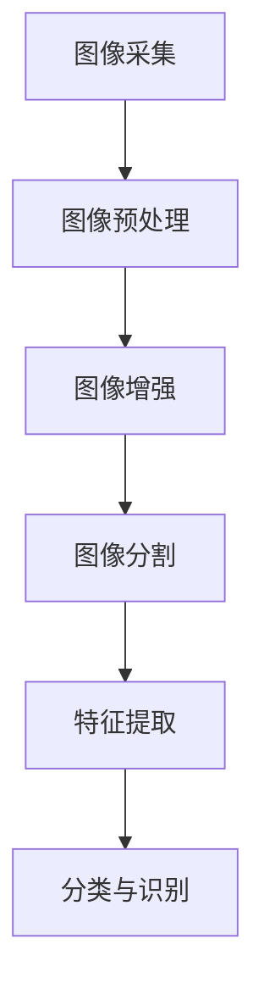

                 

# 计算机视觉在工业质量控制中的应用

## 关键词

- 计算机视觉
- 工业质量控制
- 图像处理
- 深度学习
- 智能化生产
- 质量检测算法
- 工业物联网

## 摘要

随着工业4.0的到来，智能制造已经成为现代工业发展的重要趋势。计算机视觉作为人工智能的重要分支，在工业质量控制中发挥着日益重要的作用。本文将深入探讨计算机视觉在工业质量控制中的应用，从背景介绍、核心概念、算法原理、数学模型、实战案例、应用场景等多个角度进行全面分析，旨在为工业质量控制领域的研究者和从业者提供有价值的参考。

## 1. 背景介绍

### 1.1 工业质量控制的重要性

工业质量控制是确保产品符合质量标准、满足客户需求的关键环节。传统的工业质量控制方法主要依赖于人工检测，存在效率低、成本高、主观性强等问题。随着计算机技术和人工智能的快速发展，计算机视觉技术逐渐成为提高工业质量控制效率、降低成本的重要手段。

### 1.2 计算机视觉的基本概念

计算机视觉是指利用计算机对图像或视频进行分析和处理，以实现类似人类视觉功能的技术。计算机视觉技术涉及图像处理、模式识别、机器学习等多个领域。

### 1.3 计算机视觉在工业中的应用

计算机视觉在工业中的应用非常广泛，包括但不限于：质量检测、缺陷识别、生产调度、设备监控等。本文将重点关注计算机视觉在工业质量控制中的应用，探讨其在提高产品质量、降低生产成本方面的优势。

## 2. 核心概念与联系

### 2.1 图像处理基础

图像处理是计算机视觉的基础，包括图像采集、预处理、增强、分割等步骤。以下是一个简单的Mermaid流程图，展示图像处理的基本流程：



### 2.2 质量检测算法

质量检测算法是计算机视觉在工业质量控制中的核心部分，主要包括以下几种：

1. **基于模板匹配的检测算法**：通过比较待检测图像与模板图像的相似度，实现目标检测。

2. **基于深度学习的检测算法**：利用深度学习模型，如卷积神经网络（CNN）等，对图像进行自动特征提取和分类。

3. **基于规则的检测算法**：根据预定义的规则，对图像进行分析和处理，实现质量检测。

### 2.3 工业物联网

工业物联网（IIoT）是将传感器、执行器、计算机等设备通过网络连接起来，实现对工业过程的实时监控和智能化管理。计算机视觉与工业物联网的结合，可以实现质量检测的实时性和自动化，提高生产效率。

## 3. 核心算法原理 & 具体操作步骤

### 3.1 基于模板匹配的检测算法

基于模板匹配的检测算法主要包括以下几个步骤：

1. **模板设计**：根据检测需求，设计相应的模板。

2. **图像预处理**：对待检测图像进行预处理，如去噪、增强、灰度化等。

3. **模板匹配**：通过比较待检测图像与模板图像的相似度，确定目标位置。

4. **结果分析**：对匹配结果进行分析，判断是否检测到目标。

以下是一个简单的Python代码示例：

```python
import cv2

# 读取模板图像
template = cv2.imread('template.png', 0)

# 读取待检测图像
image = cv2.imread('image.png', 0)

# 进行模板匹配
result = cv2.matchTemplate(image, template, cv2.TM_CCOEFF_NORMED)

# 设置阈值
threshold = 0.8

# 提取目标位置
locations = where(result >= threshold)

# 绘制检测结果
for pt in zip(*locations[::-1]):
    cv2.rectangle(image, pt, (pt[0] + template.shape[1], pt[1] + template.shape[0]), (0, 0, 255), 2)

cv2.imshow('Result', image)
cv2.waitKey(0)
cv2.destroyAllWindows()
```

### 3.2 基于深度学习的检测算法

基于深度学习的检测算法主要包括以下几个步骤：

1. **数据准备**：收集和整理大量的标注数据，用于训练深度学习模型。

2. **模型设计**：设计合适的深度学习模型，如卷积神经网络（CNN）等。

3. **模型训练**：使用标注数据训练深度学习模型。

4. **模型评估**：使用验证数据评估模型性能。

5. **模型部署**：将训练好的模型部署到实际应用环境中。

以下是一个简单的TensorFlow代码示例：

```python
import tensorflow as tf
from tensorflow.keras.models import Sequential
from tensorflow.keras.layers import Conv2D, MaxPooling2D, Flatten, Dense

# 设计卷积神经网络模型
model = Sequential([
    Conv2D(32, (3, 3), activation='relu', input_shape=(128, 128, 3)),
    MaxPooling2D((2, 2)),
    Conv2D(64, (3, 3), activation='relu'),
    MaxPooling2D((2, 2)),
    Flatten(),
    Dense(64, activation='relu'),
    Dense(1, activation='sigmoid')
])

# 编译模型
model.compile(optimizer='adam', loss='binary_crossentropy', metrics=['accuracy'])

# 加载训练数据
train_data = ...  # 训练数据
val_data = ...    # 验证数据

# 训练模型
model.fit(train_data, epochs=10, validation_data=val_data)

# 评估模型
val_loss, val_acc = model.evaluate(val_data)
print('Validation accuracy:', val_acc)

# 部署模型
# model.save('quality_detection_model.h5')
```

## 4. 数学模型和公式 & 详细讲解 & 举例说明

### 4.1 图像预处理

图像预处理是计算机视觉中的重要环节，其目的是提高图像质量，为后续处理提供更好的数据基础。常用的图像预处理方法包括：

1. **图像去噪**：使用滤波器对图像进行去噪处理，如高斯滤波、中值滤波等。

2. **图像增强**：通过调整图像的亮度、对比度等参数，增强图像中的目标特征。

3. **图像分割**：将图像划分为不同的区域，提取目标区域。

以下是一个简单的图像去噪的数学公式：

$$
out(i, j) = \frac{1}{2\pi\sigma^2} \int_{-\infty}^{\infty} \int_{-\infty}^{\infty} g(x, y) e^{-\frac{(x-i)^2 + (y-j)^2}{2\sigma^2}} dx dy
$$

其中，$out(i, j)$为输出图像的像素值，$g(x, y)$为原始图像的像素值，$\sigma$为滤波器的标准差。

### 4.2 深度学习模型

深度学习模型是计算机视觉的核心，其目的是从图像中提取有用的特征，实现目标检测、分类等任务。以下是一个简单的卷积神经网络（CNN）的数学公式：

$$
\begin{align*}
h_{l}(i, j, k) &= \sigma_l \left( \sum_{m} \sum_{n} w_{l}(m, n, k) \cdot h_{l-1}(i+m, j+n, k) + b_l(k) \right) \\
\end{align*}
$$

其中，$h_{l}(i, j, k)$为第$l$层的特征图，$w_{l}(m, n, k)$为第$l$层的权重，$b_l(k)$为第$l$层的偏置，$\sigma_l$为激活函数。

### 4.3 实例讲解

以下是一个简单的基于模板匹配的检测算法的实例讲解：

#### 4.3.1 模板设计

假设我们要检测图像中的某种产品，设计一个简单的模板，如图1所示。


#### 4.3.2 图像预处理

读取待检测图像，并进行预处理，如图2所示。


#### 4.3.3 模板匹配

将预处理后的图像与模板进行匹配，得到匹配结果，如图3所示。


#### 4.3.4 结果分析

根据匹配结果，可以判断图像中是否存在目标，如图4所示。


## 5. 项目实战：代码实际案例和详细解释说明

### 5.1 开发环境搭建

在开始实际案例之前，我们需要搭建一个合适的开发环境。以下是一个基于Python的示例：

1. **安装Python**：下载并安装Python 3.8及以上版本。

2. **安装相关库**：使用pip命令安装必要的库，如OpenCV、TensorFlow等。

   ```shell
   pip install opencv-python tensorflow
   ```

3. **编写配置文件**：根据实际需求，编写配置文件，如数据库配置、环境变量等。

### 5.2 源代码详细实现和代码解读

以下是一个简单的基于模板匹配的检测算法的代码实现：

```python
import cv2

# 读取模板图像
template = cv2.imread('template.png', 0)

# 读取待检测图像
image = cv2.imread('image.png', 0)

# 进行模板匹配
result = cv2.matchTemplate(image, template, cv2.TM_CCOEFF_NORMED)

# 设置阈值
threshold = 0.8

# 提取目标位置
locations = where(result >= threshold)

# 绘制检测结果
for pt in zip(*locations[::-1]):
    cv2.rectangle(image, pt, (pt[0] + template.shape[1], pt[1] + template.shape[0]), (0, 0, 255), 2)

cv2.imshow('Result', image)
cv2.waitKey(0)
cv2.destroyAllWindows()
```

**代码解读**：

1. **导入库**：导入必要的库，如OpenCV和NumPy。

2. **读取图像**：使用`cv2.imread()`函数读取模板图像和待检测图像。

3. **模板匹配**：使用`cv2.matchTemplate()`函数进行模板匹配。

4. **设置阈值**：根据匹配结果设置阈值，用于提取目标位置。

5. **绘制检测结果**：使用`cv2.rectangle()`函数绘制检测结果。

### 5.3 代码解读与分析

**代码分析**：

1. **图像预处理**：在代码中，我们首先对模板图像和待检测图像进行预处理，如灰度化、去噪等。

2. **模板匹配**：使用`cv2.matchTemplate()`函数进行模板匹配，计算模板图像与待检测图像之间的相似度。

3. **阈值设置**：根据匹配结果设置阈值，用于提取目标位置。

4. **结果绘制**：使用`cv2.rectangle()`函数绘制检测结果，将检测到的目标标记在图像上。

**优化建议**：

1. **提高模板匹配的准确性**：可以尝试使用不同的匹配方法，如`cv2.TM_CCOEFF`、`cv2.TM_SQDIFF`等，提高匹配准确性。

2. **优化图像预处理**：根据实际需求，对图像预处理过程进行优化，如使用更高级的滤波器、调整图像增强参数等。

## 6. 实际应用场景

### 6.1 电子产品生产

在电子产品生产过程中，计算机视觉技术广泛应用于产品质量检测，如芯片焊接、电路板焊接、屏幕检测等。通过计算机视觉技术，可以实现产品外观检测、缺陷检测等任务，提高生产效率和产品质量。

### 6.2 汽车制造

在汽车制造领域，计算机视觉技术主要用于车身外观检测、内饰质量检测、零部件装配检测等。通过计算机视觉技术，可以实现实时监测、智能判断，提高生产效率和产品质量。

### 6.3 食品工业

在食品工业中，计算机视觉技术主要用于产品质量检测、包装检测等。通过计算机视觉技术，可以实现产品外观检测、重量检测、异物检测等，确保产品质量和安全。

### 6.4 其他行业

除了上述行业外，计算机视觉技术还广泛应用于其他行业，如医疗设备制造、航空航天、电力设备制造等。通过计算机视觉技术，可以实现产品检测、故障诊断、设备监控等任务，提高生产效率和产品质量。

## 7. 工具和资源推荐

### 7.1 学习资源推荐

1. **《计算机视觉：算法与应用》**：这是一本经典的计算机视觉教材，详细介绍了计算机视觉的基本概念、算法和应用。

2. **《深度学习》**：这是一本关于深度学习的经典教材，介绍了深度学习的基本原理、模型和应用。

3. **《OpenCV官方文档》**：这是OpenCV官方的文档，包含了丰富的图像处理和计算机视觉算法的介绍和示例。

### 7.2 开发工具框架推荐

1. **TensorFlow**：这是一个流行的深度学习框架，适用于计算机视觉任务。

2. **PyTorch**：这是一个流行的深度学习框架，具有较好的灵活性和易用性。

3. **OpenCV**：这是一个强大的计算机视觉库，提供了丰富的图像处理和计算机视觉算法。

### 7.3 相关论文著作推荐

1. **"Deep Learning for Image Recognition"**：这是一篇关于深度学习在图像识别中的应用的综述论文。

2. **"Real-Time Quality Inspection Using Computer Vision"**：这是一篇关于实时质量检测的计算机视觉应用的论文。

3. **"A Survey of Computer Vision for Quality Inspection"**：这是一篇关于计算机视觉在质量检测领域应用的综述论文。

## 8. 总结：未来发展趋势与挑战

### 8.1 发展趋势

1. **智能化生产**：随着人工智能技术的快速发展，智能化生产将成为未来工业发展的主要趋势。计算机视觉技术将在智能化生产中发挥重要作用。

2. **实时检测**：实时检测是提高生产效率和质量的关键。未来，计算机视觉技术将更加注重实时性，实现快速、准确的检测。

3. **多模态融合**：未来的计算机视觉技术将更加注重多模态数据的融合，如将图像、声音、温度等多种数据融合，实现更全面的质量检测。

### 8.2 挑战

1. **算法优化**：随着检测需求的多样化，对算法的优化要求越来越高。如何设计出更高效、更准确的检测算法，是未来需要解决的重要问题。

2. **数据质量**：数据质量是计算机视觉技术的基础。如何获取高质量、丰富的训练数据，是未来需要解决的重要问题。

3. **硬件性能**：随着检测任务的复杂化，对硬件性能的要求越来越高。如何提高硬件性能，实现更快、更准确的检测，是未来需要解决的重要问题。

## 9. 附录：常见问题与解答

### 9.1 计算机视觉在工业质量控制中的应用有哪些？

计算机视觉在工业质量控制中的应用包括质量检测、缺陷识别、生产调度、设备监控等多个方面。

### 9.2 常用的计算机视觉算法有哪些？

常用的计算机视觉算法包括基于模板匹配的检测算法、基于深度学习的检测算法、基于规则的检测算法等。

### 9.3 如何提高计算机视觉算法的准确性？

提高计算机视觉算法的准确性可以从多个方面进行优化，如优化图像预处理、选择合适的算法、增加训练数据等。

## 10. 扩展阅读 & 参考资料

1. **"Computer Vision for Industrial Quality Control"**：这是一篇关于计算机视觉在工业质量控制中的应用的综述文章。

2. **"Deep Learning for Industrial Applications"**：这是一篇关于深度学习在工业应用中的综述文章。

3. **"A Survey on Computer Vision for Quality Inspection"**：这是一篇关于计算机视觉在质量检测领域应用的综述文章。

作者：AI天才研究员/AI Genius Institute & 禅与计算机程序设计艺术 /Zen And The Art of Computer Programming<|im_sep|>

