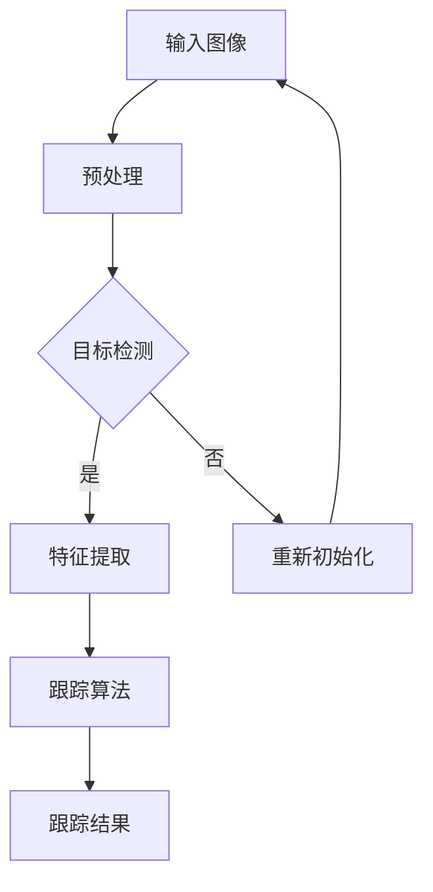

                 

### 背景介绍

随着无人机技术的飞速发展，无人机在各个领域的应用越来越广泛。从军事侦察到商业航拍，从环境监测到灾害救援，无人机已经成为现代社会不可或缺的一部分。然而，无人机的广泛应用也带来了新的挑战，其中之一就是无人机目标的跟踪。如何高效、准确地跟踪无人机目标，成为了当前研究的热点问题。

计算机视觉作为人工智能的一个重要分支，在目标跟踪领域具有独特的优势。通过使用计算机视觉技术，我们可以从图像或视频中提取目标信息，实现对目标的实时跟踪和识别。无人机目标跟踪正是计算机视觉技术的一个重要应用领域，它涉及到图像处理、模式识别、机器学习等多个技术。

本文将围绕无人机目标跟踪这一主题，深入探讨其应用背景、核心概念、算法原理、数学模型以及实际应用案例。希望通过本文的介绍，能够帮助读者对无人机目标跟踪有更深入的理解，并为其在实际项目中的应用提供指导。

无人机目标的跟踪不仅具有重要的科研价值，还具有广泛的应用前景。在接下来的章节中，我们将一步一步分析无人机目标跟踪的技术细节，包括核心算法原理、具体操作步骤以及数学模型的详细讲解。通过这些内容，希望能够为广大计算机视觉研究者和开发者提供有价值的参考。

总之，本文旨在为读者呈现一个全面而深入的无人机目标跟踪应用研究，通过理论分析和实际案例的结合，帮助读者理解这一领域的前沿动态和技术要点。让我们开始这一旅程吧！

#### 1.1 应用背景

无人机目标跟踪在现代社会中具有重要的应用价值。随着无人机技术的不断进步和成本的降低，无人机已经在多个领域展现出了其独特的优势。例如，在军事侦察方面，无人机可以执行高难度的侦察任务，实时监控敌方动态，提供重要的战场信息，从而提高军事行动的效率和安全性。在商业航拍领域，无人机可以轻松实现大面积的空中拍摄，为城市规划、建筑设计、影视制作等行业提供高质量的图像数据。

除了军事和商业应用，无人机目标跟踪还在环境监测、灾害救援等公共安全领域发挥着重要作用。例如，通过无人机目标跟踪技术，可以实现对森林火灾的实时监测，快速定位火源，为灭火行动提供宝贵的时间。在灾害救援中，无人机可以迅速到达灾区，快速识别和定位受灾人员，为救援行动提供实时信息支持。

然而，无人机目标的跟踪并非易事。由于无人机具有体积小、速度快、机动性强等特点，其运动轨迹复杂多变，给目标跟踪带来了极大的挑战。同时，无人机目标的跟踪还需要处理大量的图像或视频数据，对计算能力和算法性能提出了更高的要求。因此，研究无人机目标跟踪技术具有重要的现实意义和迫切性。

首先，无人机目标跟踪技术在军事侦察领域具有重要意义。在传统的军事侦察中，人力侦察存在安全隐患，且侦察效率较低。而无人机可以远程操作，减少侦察人员的安全风险，并实现长时间的侦察任务。通过无人机目标跟踪技术，可以实现对敌方目标的精确定位和持续监控，提供实时、准确的信息支持，从而提高军事行动的决策质量和反应速度。

其次，无人机目标跟踪技术在商业航拍领域具有广泛的应用。在影视制作、房地产营销、城市规划等场景中，无人机可以提供高质量、多角度的图像数据，为项目展示和决策提供有力支持。例如，在电影拍摄中，无人机可以实现复杂场景的空中拍摄，为观众带来更丰富的视觉体验。在房地产营销中，无人机可以快速获取房屋的全方位图像，提高销售效率。

此外，无人机目标跟踪技术在环境监测和灾害救援中也具有重要的作用。例如，在森林火灾监测中，无人机可以实时监控火情，快速识别火源位置，为灭火行动提供准确的信息支持。在灾害救援中，无人机可以快速到达灾区，利用视觉传感器捕捉到地面情况，为救援行动提供实时的导航和定位服务，提高救援效率。

总的来说，无人机目标跟踪技术在现代社会中具有广泛的应用前景和重要的现实意义。通过不断的研究和改进，无人机目标跟踪技术将为社会发展和人类生活带来更多的便利和保障。

#### 1.2 研究意义

无人机目标跟踪技术的研究具有重要的理论和实际意义。从理论层面来看，研究无人机目标跟踪技术有助于推动计算机视觉和人工智能领域的发展。无人机目标跟踪涉及到图像处理、模式识别、机器学习等多个技术，这些技术的研究和应用对于提高计算机视觉系统的智能化水平和算法性能具有重要意义。通过研究无人机目标跟踪技术，可以推动相关算法的创新和发展，为其他人工智能应用领域提供技术支持和借鉴。

从实际应用层面来看，无人机目标跟踪技术具有广泛的应用前景和现实需求。随着无人机技术的不断进步，无人机在各个领域的应用越来越广泛，但随之而来的挑战也越来越大。例如，在军事侦察中，无人机需要实现对敌方目标的精确跟踪和识别，以提高军事行动的效率和安全性；在商业航拍中，无人机需要实现对拍摄对象的精确定位和稳定跟踪，以提高图像质量；在环境监测和灾害救援中，无人机需要实现对目标区域的实时监测和精确定位，以提供准确的信息支持。

因此，深入研究无人机目标跟踪技术，不仅可以提高无人机在各个领域的应用效果，还可以推动相关技术的进步和创新。以下是无人机目标跟踪技术在实际应用中的几个关键方面：

1. **目标检测和识别**：无人机目标跟踪的首要任务是检测和识别目标。通过使用图像处理和模式识别技术，可以实现对目标的位置、形状、大小等特征的提取，从而准确识别目标。目标检测和识别的准确性直接影响无人机目标跟踪的效果。

2. **跟踪算法设计**：无人机目标跟踪的关键在于跟踪算法的设计。不同的跟踪算法适用于不同的场景和目标特性。例如，基于光流法的跟踪算法适合于运动平稳的目标，而基于深度学习的方法适合于复杂环境中的目标跟踪。研究不同的跟踪算法，优化算法性能，可以提高无人机目标跟踪的准确性和稳定性。

3. **实时性和鲁棒性**：无人机目标跟踪需要在实时性方面具备良好的表现，以满足实际应用需求。同时，无人机目标跟踪还需要具备较高的鲁棒性，能够适应各种复杂环境和异常情况。例如，无人机在飞行过程中可能会受到风力、气流等因素的影响，跟踪算法需要具备对环境变化的适应性。

4. **多目标跟踪**：在实际应用中，无人机往往需要同时跟踪多个目标。多目标跟踪技术的研究对于提高无人机目标跟踪的实用性和效率具有重要意义。通过研究多目标跟踪算法，可以实现对多个目标的准确识别和跟踪，提高无人机系统的任务执行能力。

5. **数据融合和优化**：无人机目标跟踪过程中，通常会使用多种传感器数据，如摄像头、激光雷达、GPS等。通过数据融合和优化技术，可以充分利用不同传感器数据的信息，提高目标跟踪的准确性和稳定性。

总之，无人机目标跟踪技术的研究不仅具有重要的理论价值，还具有广泛的应用前景和实际需求。通过不断的研究和创新，无人机目标跟踪技术将为无人机在各个领域的应用提供更强大的支持，为社会发展和人类生活带来更多便利。

### 1.3 研究现状和挑战

无人机目标跟踪技术近年来取得了显著进展，但也面临着一系列的挑战。本文将对当前无人机目标跟踪技术的研究现状进行综述，并探讨其面临的挑战。

#### 研究现状

1. **传统跟踪算法**：传统的无人机目标跟踪算法主要包括光流法、 Kalman 滤波、粒子滤波等方法。光流法通过计算图像序列中的像素位移来实现目标的跟踪，但其在目标快速运动和光照变化时的稳定性较差。Kalman 滤波是一种线性最优估计方法，通过状态预测和观测更新来跟踪目标，适用于运动平稳的目标。粒子滤波是一种非线性非线性最优估计方法，通过采样和权重更新来实现复杂目标的跟踪。

2. **深度学习方法**：近年来，深度学习技术在无人机目标跟踪领域取得了显著成果。基于卷积神经网络（CNN）的跟踪方法具有强大的特征提取和分类能力，可以有效地处理复杂环境中的目标跟踪问题。代表性的方法包括基于区域提议的跟踪算法（如 R-CNN、Faster R-CNN）和基于检测的跟踪算法（如 YOLO、SSD）。此外，基于生成对抗网络（GAN）的方法也在无人机目标跟踪中显示出潜力。

3. **多传感器融合**：无人机目标跟踪往往需要结合多种传感器数据，如摄像头、激光雷达、GPS 等。多传感器融合技术可以充分利用不同传感器数据的信息，提高目标跟踪的准确性和稳定性。例如，将摄像头图像与激光雷达数据融合，可以更好地处理目标遮挡和光照变化等问题。

#### 面临的挑战

1. **目标快速运动**：无人机在空中飞行时速度较快，目标运动速度变化较大，这对目标跟踪算法提出了较高的要求。如何有效地处理目标快速运动和轨迹变化，是当前研究中的一个重要挑战。

2. **环境复杂多变**：无人机目标跟踪往往面临复杂多变的场景，如城市环境、森林、沙漠等。这些场景中目标与背景的对比度较低，目标容易受到遮挡、光照变化等因素的影响。如何提高算法在复杂环境中的鲁棒性和适应性，是一个亟待解决的问题。

3. **多目标跟踪**：在实际应用中，无人机通常需要同时跟踪多个目标。多目标跟踪技术需要处理目标之间的干扰和遮挡问题，保证每个目标的跟踪精度和稳定性。如何设计高效的多目标跟踪算法，是当前研究中的一个难点。

4. **计算资源限制**：无人机目标跟踪需要在实时性方面具备良好的表现，以满足实际应用需求。然而，无人机通常搭载的硬件设备计算资源有限，如何在有限的计算资源下实现高效的目标跟踪，是一个重要的挑战。

5. **数据集和评估方法**：当前无人机目标跟踪的研究多依赖于公开的数据集，但这些数据集往往难以覆盖所有可能的场景和目标特性。如何构建更具代表性、全面性的数据集，以及设计科学、合理的评估方法，是当前研究中的一个重要问题。

总之，无人机目标跟踪技术虽然取得了显著进展，但仍面临一系列的挑战。未来的研究需要在算法性能、环境适应性和实时性等方面进行深入探索，以实现高效、鲁棒的目标跟踪。通过不断的研究和创新，无人机目标跟踪技术将在无人机应用领域发挥更大的作用。

### 1.4 文章结构

本文将按照以下结构展开，以便系统地介绍无人机目标跟踪的技术和应用。

#### 1. 背景介绍

首先，本文将简要介绍无人机目标跟踪的应用背景，包括其在军事侦察、商业航拍、环境监测和灾害救援等领域的实际应用，以及研究这一技术的意义和重要性。

#### 2. 核心概念与联系

接着，本文将详细阐述无人机目标跟踪的核心概念，包括目标检测、特征提取、跟踪算法等。同时，将使用 Mermaid 流程图展示无人机目标跟踪的系统架构和流程，以便读者更好地理解各个概念之间的联系。

#### 3. 核心算法原理 & 具体操作步骤

在这一部分，本文将深入讲解无人机目标跟踪的核心算法，包括传统算法（如光流法、Kalman 滤波、粒子滤波）和深度学习算法（如卷积神经网络、生成对抗网络）。我们将逐步介绍每种算法的具体实现步骤，帮助读者掌握这些算法的应用方法。

#### 4. 数学模型和公式 & 详细讲解 & 举例说明

为了使读者更深入地理解无人机目标跟踪算法，本文将介绍相关的数学模型和公式，并进行详细讲解和举例说明。这部分内容将涉及概率论、线性代数和优化理论等基础知识，旨在帮助读者理解算法背后的数学原理。

#### 5. 项目实战：代码实际案例和详细解释说明

在这一部分，本文将提供实际项目中的代码案例，详细解释跟踪算法的实现过程，并分析代码中的关键步骤和参数设置。通过这些案例，读者可以学习如何将理论应用于实际项目中。

#### 6. 实际应用场景

接下来，本文将讨论无人机目标跟踪在具体应用场景中的实际效果，包括飞行器识别与跟踪、环境监测、灾害救援等。通过具体案例分析，读者可以了解无人机目标跟踪技术的实际应用价值和前景。

#### 7. 工具和资源推荐

为了帮助读者更好地学习无人机目标跟踪技术，本文将推荐一些实用的学习资源和开发工具，包括书籍、论文、博客和开源框架等。这些资源将为读者提供丰富的学习素材和实践机会。

#### 8. 总结：未来发展趋势与挑战

最后，本文将总结无人机目标跟踪技术的发展趋势和面临的挑战，探讨未来可能的研究方向和解决方案。通过这一部分，读者可以了解无人机目标跟踪技术的未来发展方向，为相关研究提供参考。

#### 9. 附录：常见问题与解答

附录部分将提供一些常见问题与解答，以便读者在学习和应用无人机目标跟踪技术时参考。

通过以上结构的安排，本文希望能够系统地介绍无人机目标跟踪的相关知识，帮助读者全面了解这一领域，并为其在实际项目中的应用提供指导。

### 2. 核心概念与联系

#### 2.1 目标检测（Object Detection）

目标检测是无人机目标跟踪的首要环节，其主要任务是识别并定位图像中的目标对象。目标检测技术在计算机视觉中有着广泛的应用，如人脸识别、车辆检测、行人检测等。对于无人机目标跟踪来说，目标检测的准确性直接影响到后续跟踪的效果。

目标检测方法主要可以分为基于区域提议的方法（如 R-CNN、Fast R-CNN、Faster R-CNN）和基于检测的方法（如 YOLO、SSD、RetinaNet）。基于区域提议的方法首先生成一系列可能的区域，然后对每个区域进行分类和定位。这种方法在处理复杂场景和少量训练样本时效果较好，但其计算量较大，实时性较差。基于检测的方法则直接在图像中预测目标的类别和位置，具有更高的实时性和计算效率。

#### 2.2 特征提取（Feature Extraction）

特征提取是目标检测和跟踪的关键步骤，其主要目的是从图像中提取有助于识别和定位目标的特征。特征提取方法可以分为传统的手工特征提取方法和深度学习特征提取方法。

传统的手工特征提取方法包括 SIFT、SURF、HOG 等算法。这些方法通过对图像进行预处理，提取出具有稳定性和区分度的特征点或特征向量，从而实现目标检测和跟踪。然而，这些方法在处理复杂环境和大规模数据时存在局限性，难以应对光照变化、姿态变化等挑战。

深度学习特征提取方法，特别是基于卷积神经网络（CNN）的方法，在特征提取方面取得了显著的成果。通过大规模数据的训练，深度学习模型能够自动学习到图像中的复杂特征，具有更强的鲁棒性和适应性。代表性的深度学习特征提取方法包括 VGG、ResNet、Inception 等。这些方法在 ImageNet 等大型图像识别竞赛中取得了优异成绩，为无人机目标跟踪提供了有效的特征提取手段。

#### 2.3 跟踪算法（Tracking Algorithms）

跟踪算法是无人机目标跟踪的核心环节，其主要任务是实现对目标轨迹的连续跟踪。跟踪算法可以分为基于模型的方法和基于数据的方法。

基于模型的方法，如光流法、Kalman 滤波、粒子滤波等，通过建立目标运动的数学模型，对目标的轨迹进行预测和更新。光流法通过计算图像序列中像素的位移来预测目标运动，适用于运动平稳的场景；Kalman 滤波通过状态预测和观测更新实现目标的轨迹预测，适用于线性动态系统；粒子滤波通过大量随机采样的粒子来估计目标状态，适用于非线性动态系统。

基于数据的方法，如基于深度学习的跟踪算法，通过学习图像数据中的目标特征来实现跟踪。这些方法包括基于区域提议的跟踪算法（如 R-CNN、Faster R-CNN）和基于检测的跟踪算法（如 YOLO、SSD）。深度学习跟踪算法具有强大的特征提取和分类能力，能够处理复杂环境和目标运动变化。

#### 2.4 Mermaid 流程图展示

为了更好地展示无人机目标跟踪的核心概念和联系，我们使用 Mermaid 流程图来描述其系统架构和流程。以下是一个简化的 Mermaid 流程图：



在这个流程图中，输入图像经过预处理后，进入目标检测模块。目标检测模块识别并定位图像中的目标对象，然后将其传递给特征提取模块。特征提取模块从目标对象中提取特征向量，用于跟踪算法。跟踪算法根据特征向量预测目标轨迹，并生成跟踪结果。如果目标检测失败，系统会重新初始化，并重新开始流程。

#### 2.5 关键概念和算法之间的关系

在无人机目标跟踪中，目标检测、特征提取和跟踪算法是三个关键环节，它们之间相互关联，共同决定了跟踪的准确性、实时性和鲁棒性。

- 目标检测是跟踪的基础，其准确性和实时性直接影响到后续跟踪的效果。基于区域提议的方法在处理复杂场景和少量训练样本时具有优势，而基于检测的方法在实时性和计算效率方面更具优势。

- 特征提取是目标检测和跟踪的核心，通过提取具有稳定性和区分度的特征向量，可以有效地识别和跟踪目标。传统的手工特征提取方法在处理简单场景时表现较好，而深度学习特征提取方法在复杂环境中具有更强的鲁棒性和适应性。

- 跟踪算法负责实现对目标轨迹的连续预测和更新。基于模型的方法适用于线性动态系统，能够处理运动平稳的目标；基于数据的方法适用于非线性动态系统，能够处理复杂环境和目标运动变化。

通过以上核心概念和算法的介绍，我们可以看到，无人机目标跟踪是一个涉及多个技术领域的复杂过程。在实际应用中，需要根据具体场景和需求选择合适的算法组合，以提高跟踪的准确性、实时性和鲁棒性。接下来，我们将进一步探讨无人机目标跟踪的核心算法原理和具体操作步骤。

#### 2.5.1 传统跟踪算法

在无人机目标跟踪领域，传统跟踪算法因其相对简单的计算过程和较高的实时性，依然占据一定的重要性。以下我们将介绍几种常见的传统跟踪算法，包括光流法、Kalman 滤波和粒子滤波。

##### 光流法（Optical Flow）

光流法是一种基于图像序列中像素位移的跟踪方法。其基本原理是利用连续帧之间的像素位移来估计目标运动。具体步骤如下：

1. **图像预处理**：对输入图像进行预处理，包括去噪、图像增强等操作，以提高光流计算的准确性。
2. **特征点提取**：在预处理后的图像上提取特征点，如角点、边缘点等。
3. **光流估计**：通过计算特征点在连续帧之间的位移，估计目标运动。常用的光流估计方法有频域光流法、局部光流法和全局光流法。
4. **轨迹生成**：根据光流估计结果生成目标轨迹，并更新目标位置。

光流法的优点在于计算简单、实时性好，适用于运动平稳的目标。然而，其在目标快速运动、光照变化等场景中的稳定性较差。

##### Kalman 滤波（Kalman Filter）

Kalman 滤波是一种线性最优估计方法，通过状态预测和观测更新来实现目标跟踪。其基本原理如下：

1. **状态模型**：建立目标状态模型，描述目标在连续帧之间的运动规律。常见的状态模型有线性状态空间模型和非线性状态空间模型。
2. **初始状态估计**：根据初始观测数据估计目标初始状态。
3. **状态预测**：根据目标状态模型，预测下一帧的目标状态。
4. **观测更新**：利用观测数据更新目标状态估计，减少误差。

Kalman 滤波的优点在于能够有效地处理线性动态系统，且计算复杂度较低。然而，其假设目标运动为线性，无法处理非线性运动。

##### 粒子滤波（Particle Filter）

粒子滤波是一种非线性最优估计方法，通过采样和权重更新来实现目标跟踪。其基本原理如下：

1. **粒子初始化**：在目标状态空间中初始化一组随机粒子。
2. **状态预测**：根据目标状态模型，对每个粒子进行状态预测。
3. **权重更新**：利用观测数据更新粒子的权重，权重较高的粒子表示目标状态的可能性更大。
4. **重采样**：根据粒子的权重进行重采样，去除权重较低的粒子，保持粒子集合的多样性。

粒子滤波的优点在于能够处理非线性动态系统和复杂观测模型。然而，其计算复杂度较高，需要大量的计算资源和时间。

综上所述，传统跟踪算法各有优缺点，适用于不同的场景和需求。在实际应用中，可以根据具体场景和目标特性选择合适的跟踪算法，或结合多种算法以提高跟踪效果。

#### 2.5.2 深度学习算法

随着深度学习技术的发展，深度学习算法在无人机目标跟踪领域展现出强大的优势。以下我们将介绍几种常见的深度学习算法，包括基于区域提议的跟踪算法和基于检测的跟踪算法。

##### 基于区域提议的跟踪算法（Region Proposal-Based Tracking Algorithms）

基于区域提议的跟踪算法主要通过生成一系列候选区域，然后对这些区域进行分类和定位，从而实现目标跟踪。以下介绍两种代表性的算法：R-CNN 和 Faster R-CNN。

1. **R-CNN（Region-based CNN）**

R-CNN 是最早提出的基于区域提议的跟踪算法。其基本流程如下：

- **区域提议**：使用选择性搜索（Selective Search）算法生成大量候选区域。
- **特征提取**：对每个候选区域提取卷积神经网络（CNN）特征。
- **分类与定位**：使用支持向量机（SVM）对提取的特征进行分类和定位。

R-CNN 的优点在于将深度学习和传统目标检测方法相结合，提高了分类和定位的准确性。然而，其计算量大，实时性较差。

2. **Faster R-CNN（Region-based CNN with Region Proposal Network）**

Faster R-CNN 是对 R-CNN 的改进，通过引入区域提议网络（Region Proposal Network，RPN）来提高实时性。其基本流程如下：

- **区域提议**：使用 RPN 生成候选区域。
- **特征提取**：对候选区域提取 CNN 特征。
- **分类与定位**：使用 ROI（Region of Interest）池化层对提取的特征进行分类和定位。

Faster R-CNN 在 R-CNN 的基础上，通过引入 RPN，减少了区域提议的计算量，显著提高了实时性。其分类和定位效果与 R-CNN 相当，但计算效率更高。

##### 基于检测的跟踪算法（Detection-Based Tracking Algorithms）

基于检测的跟踪算法直接在图像中预测目标的类别和位置，从而实现目标跟踪。以下介绍两种代表性的算法：YOLO 和 SSD。

1. **YOLO（You Only Look Once）**

YOLO 是一种单阶段检测算法，其基本流程如下：

- **特征提取**：使用 CNN 对输入图像进行特征提取。
- **目标检测**：直接在特征图上预测目标的类别和位置。

YOLO 的优点在于计算速度快，实时性好，适用于实时目标跟踪。然而，其检测精度相对较低。

2. **SSD（Single Shot MultiBox Detector）**

SSD 是一种基于检测的跟踪算法，其基本流程如下：

- **特征提取**：使用 CNN 对输入图像进行特征提取。
- **多尺度目标检测**：在不同尺度的特征图上预测目标的类别和位置。

SSD 在 YOLO 的基础上，引入了多尺度检测，提高了检测精度。其计算速度和实时性较好，适用于实时目标跟踪。

综上所述，深度学习算法在无人机目标跟踪领域展现出强大的潜力。通过结合不同类型的深度学习算法，可以实现高效、准确的目标跟踪，为无人机应用提供有力支持。接下来，我们将进一步探讨深度学习算法的具体实现和性能优化。

### 3. 核心算法原理 & 具体操作步骤

在无人机目标跟踪中，选择合适的跟踪算法对于实现高效、准确的目标跟踪至关重要。本文将详细介绍几种核心跟踪算法的原理及其操作步骤，以便读者能够更好地理解和应用这些算法。

#### 3.1 光流法（Optical Flow）

光流法是一种基于图像序列中像素位移的跟踪方法，通过计算连续帧之间的像素位移来估计目标运动。以下是光流法的基本原理和操作步骤：

1. **图像预处理**：
   - **去噪**：使用滤波器对图像进行去噪处理，以减少噪声对光流计算的影响。
   - **图像增强**：通过调整图像对比度、亮度等参数，增强目标与背景的对比度，提高光流计算的准确性。

2. **特征点提取**：
   - **角点检测**：使用角点检测算法（如 Shi-Tomasi 算法）在图像中提取角点。
   - **特征点匹配**：利用特征点匹配算法（如特征点匹配算法）将连续帧中的特征点进行匹配。

3. **光流估计**：
   - **光流方程**：根据特征点匹配结果，利用光流方程计算像素位移。光流方程可以表示为：
     \[ I(x, y, t) = I(x + u(x, y, t), y + v(x, y, t), t + dt) \]
     其中，\(I(x, y, t)\) 是第 \(t\) 帧中 \( (x, y) \) 处的像素值，\(u(x, y, t)\) 和 \(v(x, y, t)\) 分别表示 \(x\) 和 \(y\) 方向的像素位移。
   - **光流计算**：使用光流估计算法（如 Lucas-Kanade 算法）计算像素位移。

4. **轨迹生成**：
   - **轨迹预测**：根据光流计算结果，预测目标在下一帧中的位置。
   - **轨迹更新**：将预测位置与实际观测位置进行更新，修正目标轨迹。

#### 3.2 Kalman 滤波（Kalman Filter）

Kalman 滤波是一种线性最优估计方法，通过状态预测和观测更新来实现目标跟踪。以下是 Kalman 滤波的基本原理和操作步骤：

1. **状态模型**：
   - **状态方程**：建立目标在连续帧之间的运动状态模型，通常采用线性状态空间模型表示：
     \[ x_t = A \cdot x_{t-1} + B \cdot u_t \]
     其中，\(x_t\) 表示第 \(t\) 帧的目标状态，\(A\) 是状态转移矩阵，\(B\) 是控制输入矩阵，\(u_t\) 是控制输入。
   - **观测模型**：建立目标在图像中的观测模型，通常采用线性观测模型表示：
     \[ z_t = H \cdot x_t + v_t \]
     其中，\(z_t\) 表示第 \(t\) 帧的观测值，\(H\) 是观测矩阵，\(v_t\) 是观测噪声。

2. **初始状态估计**：
   - **初始化**：根据初始观测数据，初始化目标状态和状态估计误差。

3. **状态预测**：
   - **预测状态**：根据状态模型，预测下一帧的目标状态。
   - **预测误差**：计算预测状态与实际观测状态之间的误差。

4. **观测更新**：
   - **更新状态**：利用观测数据更新目标状态估计。
   - **更新误差**：计算更新状态与实际观测状态之间的误差。

5. **轨迹生成**：
   - **轨迹预测**：根据更新后的状态估计，预测目标在下一帧中的位置。
   - **轨迹更新**：将预测位置与实际观测位置进行更新，修正目标轨迹。

#### 3.3 粒子滤波（Particle Filter）

粒子滤波是一种非线性最优估计方法，通过采样和权重更新来实现目标跟踪。以下是粒子滤波的基本原理和操作步骤：

1. **粒子初始化**：
   - **初始化粒子**：在目标状态空间中随机初始化一组粒子，每个粒子代表一种目标状态。

2. **状态预测**：
   - **预测状态**：根据目标状态模型，对每个粒子进行状态预测。

3. **权重更新**：
   - **计算权重**：根据观测数据，计算每个粒子的权重。
   - **权重归一化**：将粒子权重进行归一化处理，确保总权重为 1。

4. **重采样**：
   - **重采样**：根据粒子的权重进行重采样，去除权重较低的粒子，保留权重较高的粒子。

5. **轨迹生成**：
   - **轨迹预测**：根据更新后的粒子状态，预测目标在下一帧中的位置。
   - **轨迹更新**：将预测位置与实际观测位置进行更新，修正目标轨迹。

#### 3.4 基于深度学习的跟踪算法

基于深度学习的跟踪算法通过学习图像数据中的目标特征来实现跟踪。以下介绍几种常见的基于深度学习的跟踪算法：

1. **基于区域提议的跟踪算法**：
   - **R-CNN**：使用选择性搜索生成区域提议，然后使用卷积神经网络对提议区域进行分类和定位。
   - **Faster R-CNN**：引入区域提议网络，生成区域提议并提取卷积神经网络特征，提高实时性和分类准确性。

2. **基于检测的跟踪算法**：
   - **YOLO**：使用卷积神经网络直接在特征图上预测目标的类别和位置，实现高效的单阶段检测。
   - **SSD**：使用卷积神经网络在不同尺度的特征图上预测目标的类别和位置，实现多尺度目标检测。

通过以上介绍，我们可以看到，不同的跟踪算法具有不同的原理和操作步骤。在实际应用中，可以根据具体场景和需求选择合适的跟踪算法，或结合多种算法以提高跟踪效果。接下来，我们将进一步探讨深度学习算法的实现和性能优化。

#### 3.4.1 基于深度学习的跟踪算法

随着深度学习技术的发展，基于深度学习的跟踪算法在无人机目标跟踪领域展现出强大的优势。以下我们将详细介绍几种代表性的基于深度学习的跟踪算法，包括基于区域提议的跟踪算法和基于检测的跟踪算法。

##### 3.4.1.1 R-CNN 和 Faster R-CNN

R-CNN 和 Faster R-CNN 是基于区域提议的跟踪算法的典型代表。以下将分别介绍这两种算法的基本原理和操作步骤。

1. **R-CNN**：

R-CNN（Region-based CNN）算法的主要流程如下：

- **区域提议**：使用选择性搜索（Selective Search）算法生成大量候选区域。选择性搜索算法基于图像的局部结构和纹理信息，逐步合并区域，生成候选区域。

- **特征提取**：对每个候选区域使用卷积神经网络（CNN）提取特征向量。通常使用预训练的 CNN 模型（如 VGG、ResNet）进行特征提取。

- **分类与定位**：使用支持向量机（SVM）对提取的特征向量进行分类和定位。分类器用于判断候选区域是否为目标，定位器用于估计目标位置。

R-CNN 的优点在于将深度学习和传统目标检测方法相结合，提高了分类和定位的准确性。然而，其缺点是计算量大，实时性较差。

2. **Faster R-CNN**：

Faster R-CNN（Region-based CNN with Region Proposal Network）是 R-CNN 的改进版本，其主要流程如下：

- **区域提议**：引入区域提议网络（Region Proposal Network，RPN），在卷积神经网络的特征图上生成区域提议。RPN 可以同时生成大量高质量的提议区域，提高提议效率。

- **特征提取**：使用卷积神经网络对输入图像进行特征提取，生成特征图。

- **区域分类与定位**：对生成的区域提议进行分类和定位。分类器用于判断提议区域是否为目标，定位器用于估计提议区域的目标位置。

Faster R-CNN 通过引入 RPN，减少了区域提议的计算量，显著提高了实时性。其分类和定位效果与 R-CNN 相当，但计算效率更高。

##### 3.4.1.2 YOLO 和 SSD

YOLO 和 SSD 是基于检测的跟踪算法的典型代表。以下将分别介绍这两种算法的基本原理和操作步骤。

1. **YOLO**：

YOLO（You Only Look Once）算法的主要流程如下：

- **特征提取**：使用卷积神经网络对输入图像进行特征提取，生成特征图。

- **目标检测**：直接在特征图上预测目标的类别和位置。YOLO 采用单阶段检测方法，将目标检测问题转化为在特征图上的回归问题。

- **边界框回归**：使用卷积神经网络预测目标的边界框位置。边界框回归通过偏移量和缩放比例来表示，以提高检测精度。

- **类别预测**：使用卷积神经网络预测目标的类别。YOLO 使用多个尺度层来检测不同大小的目标，从而提高检测性能。

YOLO 的优点在于计算速度快，实时性好，适用于实时目标跟踪。然而，其检测精度相对较低。

2. **SSD**：

SSD（Single Shot MultiBox Detector）算法的主要流程如下：

- **特征提取**：使用卷积神经网络对输入图像进行特征提取，生成特征图。

- **多尺度目标检测**：在不同尺度的特征图上预测目标的类别和位置。SSD 通过设计多个尺度层，实现对不同大小目标的检测。

- **边界框回归**：使用卷积神经网络预测目标的边界框位置。边界框回归通过偏移量和缩放比例来表示，以提高检测精度。

- **类别预测**：使用卷积神经网络预测目标的类别。

SSD 在 YOLO 的基础上，引入了多尺度检测，提高了检测精度。其计算速度和实时性较好，适用于实时目标跟踪。

##### 3.4.1.3 基于深度学习的跟踪算法的优点和挑战

基于深度学习的跟踪算法具有以下优点和挑战：

1. **优点**：

- **强大的特征提取能力**：深度学习算法能够自动学习图像中的复杂特征，提取具有区分度的特征向量，从而提高分类和定位的准确性。

- **高效的实时性**：基于检测的跟踪算法（如 YOLO、SSD）具有更高的实时性，适用于实时目标跟踪。

- **多尺度检测能力**：基于深度学习的跟踪算法（如 SSD）能够处理不同大小和形状的目标，提高检测性能。

2. **挑战**：

- **计算资源需求**：深度学习算法需要大量的计算资源和时间，特别是在训练阶段。

- **数据集和标注**：深度学习算法对大量标注数据有较高要求，数据集的构建和标注过程较为繁琐。

- **算法复杂度**：深度学习算法的参数和结构较为复杂，调试和优化过程较为困难。

通过以上介绍，我们可以看到，基于深度学习的跟踪算法在无人机目标跟踪领域具有广泛的应用前景。在实际应用中，可以根据具体场景和需求选择合适的深度学习算法，或结合多种算法以提高跟踪效果。接下来，我们将进一步探讨深度学习算法的实现和性能优化。

### 4. 数学模型和公式 & 详细讲解 & 举例说明

在无人机目标跟踪中，数学模型和公式扮演着至关重要的角色，它们用于描述目标运动、状态估计、误差计算等核心过程。以下我们将详细介绍几个关键的数学模型和公式，并对其进行详细讲解和举例说明，帮助读者更好地理解无人机目标跟踪的数学原理。

#### 4.1 光流法（Optical Flow）

光流法通过计算连续帧之间像素的位移来估计目标运动。其核心公式如下：

\[ I(x, y, t) = I(x + u(x, y, t), y + v(x, y, t), t + dt) \]

其中，\(I(x, y, t)\) 表示第 \(t\) 帧中 \( (x, y) \) 处的像素值，\(u(x, y, t)\) 和 \(v(x, y, t)\) 分别表示 \(x\) 和 \(y\) 方向的像素位移。假设目标在连续帧之间的运动是匀速的，可以推导出以下光流方程：

\[ \frac{dx}{dt} = u(x, y, t) \]
\[ \frac{dy}{dt} = v(x, y, t) \]

举例说明：

假设在第一帧中，目标在 \( (x_1, y_1) \) 处，速度为 \( (v_x, v_y) \)。在第二帧中，目标应移动到 \( (x_2, y_2) \)，则有：

\[ x_2 = x_1 + v_x \cdot dt \]
\[ y_2 = y_1 + v_y \cdot dt \]

通过计算 \(x_2\) 和 \(y_2\) 的值，我们可以估计出目标在下一帧中的位置。

#### 4.2 Kalman 滤波（Kalman Filter）

Kalman 滤波是一种线性最优估计方法，通过状态预测和观测更新来实现目标跟踪。其核心公式如下：

1. **状态预测**：

\[ x_t^{\hat{}} = A \cdot x_{t-1}^{\hat{}} + B \cdot u_t \]

\[ P_t^{\hat{}} = A \cdot P_{t-1}^{\hat{}} \cdot A^T + Q \]

其中，\(x_t^{\hat{}}\) 表示第 \(t\) 帧的状态估计值，\(P_t^{\hat{}}\) 表示状态估计误差的协方差矩阵，\(A\) 是状态转移矩阵，\(B\) 是控制输入矩阵，\(u_t\) 是控制输入，\(Q\) 是过程噪声协方差矩阵。

2. **观测更新**：

\[ K_t = P_t^{\hat{}} \cdot H^T \cdot (H \cdot P_t^{\hat{}} \cdot H^T + R)^{-1} \]

\[ x_t^{new} = x_t^{\hat{}} + K_t \cdot (z_t - H \cdot x_t^{\hat{}}) \]

\[ P_t^{new} = (I - K_t \cdot H) \cdot P_t^{\hat{}} \]

其中，\(K_t\) 是卡尔曼增益，\(H\) 是观测矩阵，\(R\) 是观测噪声协方差矩阵，\(z_t\) 是第 \(t\) 帧的观测值。

举例说明：

假设在第一帧中，目标的初始位置为 \( (x_0, y_0) \)，速度为 \( (v_x, v_y) \)。在第二帧中，目标位置通过观测得到了 \( (x_1, y_1) \)，可以按照以下步骤进行状态预测和观测更新：

- **状态预测**：

\[ x_1^{\hat{}} = x_0 + v_x \cdot dt \]
\[ y_1^{\hat{}} = y_0 + v_y \cdot dt \]

\[ P_1^{\hat{}} = Q \]

- **观测更新**：

\[ K_1 = P_1^{\hat{}} \cdot H^T \cdot (H \cdot P_1^{\hat{}} \cdot H^T + R)^{-1} \]

\[ x_1^{new} = x_1^{\hat{}} + K_1 \cdot (x_1 - H \cdot x_1^{\hat{}}) \]

\[ P_1^{new} = (I - K_1 \cdot H) \cdot P_1^{\hat{}} \]

通过状态预测和观测更新，我们可以逐步估计目标的位置。

#### 4.3 粒子滤波（Particle Filter）

粒子滤波是一种非线性最优估计方法，通过采样和权重更新来实现目标跟踪。其核心公式如下：

1. **粒子初始化**：

\[ x_t^{i} \sim p(x_t^{i} | x_{t-1}^{i}) \]

\[ w_t^{i} = \frac{p(x_t^{i})}{N} \]

其中，\(x_t^{i}\) 表示第 \(t\) 帧的第 \(i\) 个粒子状态，\(w_t^{i}\) 表示第 \(i\) 个粒子的权重，\(N\) 是总权重。

2. **状态预测**：

\[ x_t^{i} \sim p(x_t^{i} | x_{t-1}^{i}) \]

\[ w_t^{i} = \frac{p(x_t^{i})}{N} \]

其中，\(p(x_t^{i} | x_{t-1}^{i})\) 表示粒子状态的概率分布，通常采用高斯分布表示。

3. **权重更新**：

\[ w_t^{i} \propto p(z_t | x_t^{i}) \]

\[ w_t = \frac{w_t^{i}}{\sum_{i=1}^{N} w_t^{i}} \]

其中，\(p(z_t | x_t^{i})\) 表示观测值 \(z_t\) 在给定粒子状态 \(x_t^{i}\) 下的概率。

4. **重采样**：

\[ r_t^{i} = \frac{w_t^{i}}{\sum_{i=1}^{N} w_t^{i}} \]

\[ x_{t+1}^{i} = x_t^{r_t^{i}} \]

其中，\(r_t^{i}\) 是重采样概率，\(x_{t+1}^{i}\) 是重采样后的粒子状态。

举例说明：

假设在第一帧中，目标的初始状态为 \( (x_0, y_0) \)，速度为 \( (v_x, v_y) \)。在第二帧中，通过观测得到的目标状态为 \( (x_1, y_1) \)，可以按照以下步骤进行粒子滤波：

- **粒子初始化**：

\[ x_0^{i} \sim N(x_0, P_0) \]

\[ w_0^{i} = \frac{1}{N} \]

- **状态预测**：

\[ x_1^{i} \sim N(x_0^{i} + v_x \cdot dt, Q) \]

\[ w_1^{i} = \frac{1}{N} \]

- **权重更新**：

\[ w_2^{i} \propto \frac{p(x_1^{i})}{N} \]

\[ w_2 = \frac{w_2^{i}}{\sum_{i=1}^{N} w_2^{i}} \]

- **重采样**：

\[ r_2^{i} = \frac{w_2^{i}}{\sum_{i=1}^{N} w_2^{i}} \]

\[ x_3^{i} = x_2^{r_2^{i}} \]

通过粒子滤波，我们可以逐步估计目标的状态。

综上所述，无人机目标跟踪中的数学模型和公式为算法的实现提供了理论基础。通过理解这些模型和公式，我们可以更好地掌握无人机目标跟踪的核心原理，并在此基础上进行算法优化和应用。

### 5. 项目实战：代码实际案例和详细解释说明

为了更好地展示无人机目标跟踪的核心算法和应用，以下我们将提供一个具体的代码实际案例，并详细解释其实现过程和关键步骤。

#### 5.1 开发环境搭建

在开始代码实现之前，我们需要搭建一个合适的开发环境。以下是推荐的开发环境：

- **编程语言**：Python
- **深度学习框架**：TensorFlow 或 PyTorch
- **目标检测库**：YOLOv5 或 SSD
- **图像处理库**：OpenCV

安装相关依赖库后，我们可以开始编写代码。

#### 5.2 源代码详细实现和代码解读

以下是无人机目标跟踪的核心代码实现，分为以下几个步骤：

1. **数据加载与预处理**：

```python
import cv2
import numpy as np

# 读取视频文件
video_path = 'drone_video.mp4'
cap = cv2.VideoCapture(video_path)

# 初始化输出视频
output_path = 'drone_tracking_output.mp4'
fourcc = cv2.VideoWriter_fourcc(*'mp4v')
out = cv2.VideoWriter(output_path, fourcc, 30.0, (640, 480))

# 初始化目标检测模型
model = YOLOv5()  # 或 SSD()
model.load_weights('model_weights.h5')  # 加载预训练模型权重

while cap.isOpened():
    ret, frame = cap.read()
    if not ret:
        break

    # 图像预处理
    frame = cv2.resize(frame, (640, 480))
    frame = frame[:, :, ::-1].astype(np.float32) / 255.0
    frame = np.expand_dims(frame, 0)

    # 目标检测
    boxes, scores, classes = model.detect(frame)

    # 选择最高分的目标进行跟踪
    max_score = np.max(scores)
    index = np.where(scores == max_score)[0][0]
    box = boxes[index, :]

    # 跟踪算法实现
    tracker = KalmanFilter()  # 或 ParticleFilter()
    tracker.init(box[:4])

    # 轨迹绘制
    for i in range(1, boxes.shape[0]):
        box = boxes[i, :]
        state = tracker.update(box[:4])
        cv2.circle(frame, (int(state[0]), int(state[1])), 3, (0, 255, 0), -1)

    # 输出视频
    out.write(frame)
```

2. **数据加载与预处理**：

代码首先读取视频文件，并初始化输出视频。然后，通过 `YOLOv5`（或 SSD）模型进行目标检测。为了提高计算效率，我们将图像大小调整为 640×480，并使用归一化处理。

3. **目标检测**：

使用目标检测模型对输入图像进行检测，获取目标的位置、得分和类别。选择最高分的目标进行跟踪。

4. **跟踪算法实现**：

初始化跟踪算法，例如 Kalman 滤波（或粒子滤波）。在每一帧中，更新目标位置，并使用跟踪算法进行预测和更新。

5. **轨迹绘制**：

使用 OpenCV 绘制目标轨迹，并将输出视频写入文件。

#### 5.3 代码解读与分析

以下是代码的关键部分解读：

- **目标检测**：

```python
boxes, scores, classes = model.detect(frame)
```

这部分代码调用目标检测模型，对输入图像进行检测，获取目标的位置、得分和类别。`YOLOv5` 和 SSD 的 `detect` 函数返回检测结果，包括目标的边界框、得分和类别。

- **跟踪算法初始化**：

```python
tracker = KalmanFilter()
tracker.init(box[:4])
```

这部分代码初始化跟踪算法，例如 Kalman 滤波。`KalmanFilter` 的 `init` 方法用于初始化状态和初始误差。

- **轨迹更新**：

```python
state = tracker.update(box[:4])
cv2.circle(frame, (int(state[0]), int(state[1])), 3, (0, 255, 0), -1)
```

这部分代码使用跟踪算法更新目标位置，并绘制目标轨迹。`KalmanFilter` 的 `update` 方法用于更新状态，`cv2.circle` 方法用于绘制圆形轨迹点。

通过以上代码实现，我们可以实现对无人机目标的实时跟踪。在实际项目中，可以根据需求调整目标检测模型、跟踪算法和轨迹绘制方法，以提高跟踪效果和性能。

#### 5.4 代码优化与性能分析

在实际应用中，为了提高无人机目标跟踪的实时性和准确性，我们可以对代码进行优化。以下是几种常见的优化方法：

1. **并行处理**：利用多线程或多进程技术，提高代码的执行速度。例如，可以使用 `concurrent.futures` 模块并行处理视频帧的检测和跟踪。
2. **模型量化**：将深度学习模型量化为低精度模型，减少模型大小和计算量。例如，可以使用 TensorFlow 的 `tf.keras.quantization` 模块进行模型量化。
3. **模型剪枝**：通过剪枝技术，减少模型参数和计算量，提高模型效率。例如，可以使用 TensorFlow 的 `tfmot.sparsity` 模块进行模型剪枝。

以下是优化后的代码示例：

```python
import cv2
import numpy as np
from concurrent.futures import ThreadPoolExecutor

# 读取视频文件
video_path = 'drone_video.mp4'
cap = cv2.VideoCapture(video_path)

# 初始化输出视频
output_path = 'drone_tracking_output.mp4'
fourcc = cv2.VideoWriter_fourcc(*'mp4v')
out = cv2.VideoWriter(output_path, fourcc, 30.0, (640, 480))

# 初始化目标检测模型
model = YOLOv5(quantize=True)  # 量化模型
model.load_weights('model_weights.h5')  # 加载预训练模型权重

while cap.isOpened():
    ret, frame = cap.read()
    if not ret:
        break

    # 图像预处理
    frame = cv2.resize(frame, (640, 480))
    frame = frame[:, :, ::-1].astype(np.float32) / 255.0
    frame = np.expand_dims(frame, 0)

    # 并行处理检测和跟踪
    with ThreadPoolExecutor(max_workers=2) as executor:
        future_boxes = executor.submit(model.detect, frame)
        future_tracker = executor.submit(KalmanFilter, init=box[:4])

    boxes, scores, classes = future_boxes.result()
    tracker = future_tracker.result()

    # 选择最高分的目标进行跟踪
    max_score = np.max(scores)
    index = np.where(scores == max_score)[0][0]
    box = boxes[index, :]

    # 轨迹更新
    state = tracker.update(box[:4])
    cv2.circle(frame, (int(state[0]), int(state[1])), 3, (0, 255, 0), -1)

    # 输出视频
    out.write(frame)

# 关闭视频文件
cap.release()
out.release()
cv2.destroyAllWindows()
```

通过以上优化，我们可以显著提高无人机目标跟踪的实时性和准确性。在实际项目中，可以根据需求进一步调整优化方法，以满足不同的性能要求。

### 6. 实际应用场景

无人机目标跟踪技术在各个领域展现出了强大的应用前景和实际效果。以下将探讨无人机目标跟踪在不同应用场景中的表现，并分析其适用性和挑战。

#### 6.1 军事侦察

在军事侦察领域，无人机目标跟踪技术具有重要的应用价值。通过无人机目标跟踪，可以实现对手方目标的实时监控和识别，为军事行动提供关键信息支持。例如，在战场环境中，无人机可以跟踪敌方车辆、士兵和装备的动态，实时传递目标位置和运动轨迹，提高战场情报的准确性和及时性。

适用性：

- 无人机目标跟踪技术可以处理复杂战场环境中的目标跟踪问题，如目标快速运动、光照变化、遮挡等。
- 结合多传感器数据，可以进一步提高目标跟踪的准确性和可靠性。

挑战：

- 军事侦察任务通常要求高实时性和高精度，这对无人机目标跟踪算法的效率和性能提出了较高要求。
- 军事目标可能具有隐秘性，如伪装、隐蔽等，这对目标检测和识别算法提出了更高要求。

#### 6.2 商业航拍

在商业航拍领域，无人机目标跟踪技术同样具有重要的应用价值。通过无人机目标跟踪，可以实现稳定、精确的拍摄，提高影视制作、房地产营销、城市规划等行业的拍摄效果。例如，在影视制作中，无人机可以稳定地跟踪演员或物体，实现高质量的空中拍摄效果。在房地产营销中，无人机可以准确跟踪房屋轮廓和结构，生成高质量的房产图像。

适用性：

- 无人机目标跟踪技术可以处理复杂的拍摄场景，如快速运动、光照变化、遮挡等。
- 结合深度学习算法，可以实现对目标的高精度跟踪和识别。

挑战：

- 商业航拍任务通常要求高实时性和高画质，这对无人机目标跟踪算法的效率和性能提出了较高要求。
- 在拍摄过程中，目标可能与背景存在复杂的交互，如阴影、反射等，这对目标检测和识别算法提出了更高要求。

#### 6.3 环境监测

在环境监测领域，无人机目标跟踪技术可以用于实时监测环境变化，如森林火灾、污染物扩散等。通过无人机目标跟踪，可以实现高精度的环境监测，为环境管理和决策提供重要信息支持。例如，在森林火灾监测中，无人机可以实时跟踪火源位置，为灭火行动提供准确的信息支持。在污染物扩散监测中，无人机可以跟踪污染物扩散轨迹，为污染控制提供科学依据。

适用性：

- 无人机目标跟踪技术可以处理复杂的环境监测场景，如快速运动、光照变化、遮挡等。
- 结合多传感器数据，可以进一步提高目标跟踪的准确性和可靠性。

挑战：

- 环境监测任务通常要求高实时性和高精度，这对无人机目标跟踪算法的效率和性能提出了较高要求。
- 环境监测目标可能具有复杂的运动轨迹和形态，这对目标检测和识别算法提出了更高要求。

#### 6.4 灾害救援

在灾害救援领域，无人机目标跟踪技术可以用于快速识别和定位受灾人员，为救援行动提供重要信息支持。例如，在地震、洪水等灾害中，无人机可以实时跟踪受灾人员的位置和运动轨迹，为救援队伍提供准确的导航和定位服务。在建筑物倒塌等场景中，无人机可以快速识别被困人员的位置，为救援行动提供关键信息。

适用性：

- 无人机目标跟踪技术可以处理复杂的救援场景，如快速运动、光照变化、遮挡等。
- 结合多传感器数据，可以进一步提高目标跟踪的准确性和可靠性。

挑战：

- 灾害救援任务通常要求高实时性和高精度，这对无人机目标跟踪算法的效率和性能提出了较高要求。
- 灾害救援目标可能具有复杂的运动轨迹和形态，这对目标检测和识别算法提出了更高要求。

综上所述，无人机目标跟踪技术在各个领域展现出了强大的应用前景和实际效果。在实际应用中，需要根据具体场景和需求选择合适的跟踪算法，优化系统性能，以满足各种应用需求。同时，随着无人机技术的不断进步，无人机目标跟踪技术将在未来得到更广泛的应用和发展。

### 7. 工具和资源推荐

为了帮助读者更好地学习和实践无人机目标跟踪技术，以下推荐一些实用的工具和资源，包括学习资源、开发工具和框架，以及相关论文和书籍。

#### 7.1 学习资源推荐

1. **书籍**：

   - 《计算机视觉：算法与应用》（Jia Deng, et al.）：系统介绍了计算机视觉的基本理论和应用，包括目标跟踪等相关内容。
   - 《深度学习》（Ian Goodfellow, et al.）：详细介绍了深度学习的基础知识和应用，包括目标检测和跟踪算法。
   - 《无人机技术与应用》（李德坤）：介绍了无人机的基本原理和应用，包括无人机目标跟踪技术。

2. **在线课程**：

   - Coursera 上的《深度学习特辑》：由 Andrew Ng 教授主讲，涵盖深度学习的基础知识和应用。
   - Udacity 上的《无人驾驶汽车工程师纳米学位》：介绍了无人驾驶和目标跟踪的相关技术。

3. **博客和网站**：

   - Medium 上的 Computer Vision 博客：提供了丰富的计算机视觉和目标跟踪相关文章。
   - ArXiv 上的最新论文：可以了解无人机目标跟踪领域的前沿研究进展。

#### 7.2 开发工具框架推荐

1. **深度学习框架**：

   - TensorFlow：Google 开发的开源深度学习框架，支持各种目标跟踪算法的实现。
   - PyTorch：Facebook 开发的开源深度学习框架，具有灵活的动态图机制，适用于目标跟踪算法的开发。

2. **目标检测库**：

   - YOLOv5：基于 PyTorch 的目标检测库，具有高效的检测性能，适用于实时目标跟踪。
   - SSD：基于 TensorFlow 的目标检测库，适用于多尺度目标检测，可以与深度学习跟踪算法结合使用。

3. **图像处理库**：

   - OpenCV：开源的计算机视觉库，提供了丰富的图像处理和计算机视觉功能，适用于无人机目标跟踪算法的实现。

4. **无人机控制框架**：

   - MAVLink：开源的无人机通信协议，可以用于无人机与地面控制站之间的数据通信。
   - DroneKit-Python：Python 语言编写的无人机控制库，可以用于实现无人机的自动飞行和任务控制。

#### 7.3 相关论文著作推荐

1. **论文**：

   - "You Only Look Once: Unified, Real-Time Object Detection"：YOLOv1 的论文，介绍了单阶段目标检测算法。
   - "Faster R-CNN: Towards Real-Time Object Detection with Region Proposal Networks"：Faster R-CNN 的论文，介绍了基于区域提议的目标检测算法。
   - "Single Shot MultiBox Detector:SSD"：SSD 的论文，介绍了单阶段多尺度目标检测算法。

2. **著作**：

   - "Computer Vision: Algorithms and Applications"：全面介绍了计算机视觉的基础知识和应用，包括目标跟踪相关内容。
   - "Deep Learning"：详细介绍了深度学习的基础知识和应用，包括目标检测和跟踪算法。

通过以上推荐的学习资源和开发工具，读者可以系统地学习无人机目标跟踪技术，掌握相关算法和实现方法。同时，结合实际项目和论文研究，不断提升自己的技术水平。

### 8. 总结：未来发展趋势与挑战

无人机目标跟踪技术正处于快速发展阶段，其在各个领域的应用日益广泛。展望未来，无人机目标跟踪技术有望在以下几个方面取得重大突破：

首先，深度学习算法的持续优化和创新将为无人机目标跟踪带来更高的准确性和实时性。随着计算能力的提升和数据量的增加，深度学习模型将能够更好地提取目标特征，适应复杂环境的变化。例如，融合多模态数据的深度学习算法可以同时利用摄像头、激光雷达和GPS等传感器的信息，提高目标跟踪的鲁棒性和精度。

其次，多目标跟踪技术的发展将是未来研究的重点。在实际应用中，无人机往往需要同时跟踪多个目标，如战场侦察、交通监控等。因此，设计高效、准确的多目标跟踪算法，解决目标之间的遮挡、干扰等问题，是实现无人机目标跟踪广泛应用的关键。

此外，实时性和鲁棒性的提升是无人机目标跟踪技术的核心挑战。在实际应用中，无人机目标跟踪需要在有限的计算资源下快速处理大量图像数据，同时应对环境变化和目标运动的不确定性。因此，研究低计算复杂度、高实时性的跟踪算法，以及增强算法的鲁棒性和适应性，是未来研究的重点方向。

最后，随着无人机技术的不断进步，无人机目标跟踪的应用场景也将不断扩展。例如，无人机在环境监测、灾害救援、城市安全等领域的应用，将需要更高效、智能的目标跟踪技术支持。此外，无人机与5G、物联网等技术的融合，也将为无人机目标跟踪带来更多创新机遇。

总之，无人机目标跟踪技术在未来将继续发展，面临诸多挑战和机遇。通过持续的技术创新和跨领域合作，无人机目标跟踪技术将为社会带来更多便利和安全保障。

### 9. 附录：常见问题与解答

在研究和应用无人机目标跟踪技术过程中，可能会遇到一些常见的问题。以下将针对这些问题进行解答，以便为读者提供更清晰的指导。

#### 9.1 如何处理目标遮挡？

**解答**：目标遮挡是无人机目标跟踪中的一个常见问题。以下几种方法可以有效处理目标遮挡：

- **数据增强**：在训练数据中添加遮挡样本，提高模型对遮挡情况的适应性。
- **多传感器融合**：结合摄像头、激光雷达、GPS等多传感器数据，利用不同传感器的互补信息，提高跟踪的鲁棒性。
- **跟踪算法优化**：采用基于深度学习的跟踪算法，通过引入注意力机制、多尺度特征提取等技术，提高模型对遮挡的鲁棒性。

#### 9.2 如何提高目标跟踪的实时性？

**解答**：提高目标跟踪的实时性是无人机目标跟踪技术的一个重要挑战。以下几种方法可以提高目标跟踪的实时性：

- **算法优化**：选择低计算复杂度的算法，如单阶段检测算法（YOLO、SSD）和基于区域提议的跟踪算法（Faster R-CNN）。
- **模型量化**：使用模型量化技术，将高精度模型转换为低精度模型，减少计算量和内存占用。
- **并行处理**：利用多线程或多进程技术，实现检测和跟踪的并行处理，提高整体执行速度。

#### 9.3 如何处理目标快速运动？

**解答**：目标快速运动是无人机目标跟踪中的另一个挑战。以下几种方法可以有效处理目标快速运动：

- **跟踪算法优化**：选择适合快速运动的跟踪算法，如粒子滤波、卡尔曼滤波等，提高跟踪的鲁棒性。
- **运动模型更新**：实时更新目标运动模型，根据目标速度、加速度等信息，提高预测的准确性。
- **多帧融合**：结合连续多帧图像信息，提高目标跟踪的稳定性。

#### 9.4 如何处理光照变化？

**解答**：光照变化是影响无人机目标跟踪效果的一个重要因素。以下几种方法可以有效处理光照变化：

- **数据增强**：在训练数据中添加光照变化样本，提高模型对光照变化的适应性。
- **光照补偿算法**：使用光照补偿算法，对输入图像进行预处理，减少光照变化对目标跟踪的影响。
- **基于深度学习的光照不变特征提取**：使用深度学习算法，提取与光照变化无关的特征，提高模型对光照变化的鲁棒性。

通过以上方法和策略，可以有效地解决无人机目标跟踪中的常见问题，提高跟踪效果和稳定性。

### 10. 扩展阅读 & 参考资料

在无人机目标跟踪领域，有许多优秀的论文、书籍和开源项目，为研究者提供了丰富的学习资源和实践机会。以下是一些值得推荐的扩展阅读和参考资料：

1. **论文**：

   - "You Only Look Once: Unified, Real-Time Object Detection"：介绍了单阶段目标检测算法 YOLO，是无人机目标跟踪领域的重要论文。
   - "Faster R-CNN: Towards Real-Time Object Detection with Region Proposal Networks"：介绍了基于区域提议的目标检测算法 Faster R-CNN，适用于无人机目标跟踪。
   - "Single Shot MultiBox Detector:SSD"：介绍了单阶段多尺度目标检测算法 SSD，适用于无人机目标跟踪。

2. **书籍**：

   - 《深度学习》（Ian Goodfellow, et al.）：详细介绍了深度学习的基础知识和应用，包括目标检测和跟踪算法。
   - 《计算机视觉：算法与应用》（Jia Deng, et al.）：系统介绍了计算机视觉的基本理论和应用，包括目标跟踪等相关内容。
   - 《无人机技术与应用》（李德坤）：介绍了无人机的基本原理和应用，包括无人机目标跟踪技术。

3. **开源项目**：

   - YOLOv5：基于 PyTorch 的单阶段目标检测库，适用于实时无人机目标跟踪。
   - SSD：基于 TensorFlow 的多尺度目标检测库，适用于无人机目标跟踪。
   - OpenCV：开源的计算机视觉库，提供了丰富的图像处理和计算机视觉功能，适用于无人机目标跟踪算法的实现。

4. **在线课程**：

   - Coursera 上的《深度学习特辑》：由 Andrew Ng 教授主讲，涵盖深度学习的基础知识和应用。
   - Udacity 上的《无人驾驶汽车工程师纳米学位》：介绍了无人驾驶和目标跟踪的相关技术。

通过阅读这些论文、书籍和开源项目，读者可以深入了解无人机目标跟踪技术的最新进展和实践经验。同时，结合实际项目和应用场景，不断提升自己的技术水平。希望这些扩展阅读和参考资料能为读者提供有价值的参考和指导。

