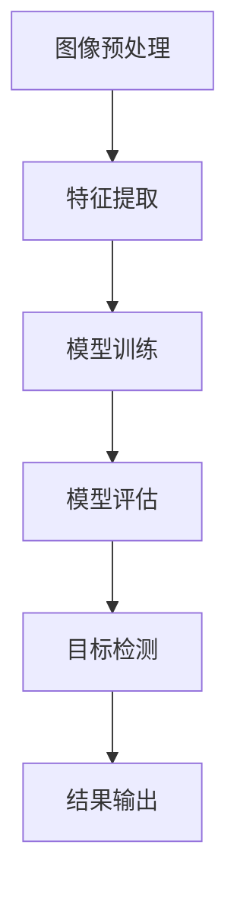

                 

### 背景介绍

#### 智能安防系统的重要性

随着城市化进程的加速和人口数量的激增，公共安全和安全监控的需求日益增长。传统的安防系统主要依赖于人力监控和手动记录，存在响应速度慢、效率低、易出错等问题。为了提升安全监控的效率和准确性，智能安防系统应运而生。

智能安防系统通过计算机视觉、人工智能等先进技术，对监控视频进行实时分析和处理，能够自动识别和预警异常行为，大大提高了安全监控的效率和准确性。例如，在交通管理中，智能安防系统可以自动识别和跟踪车辆，分析交通流量，预测交通拥堵，从而优化交通信号控制，减少交通事故。

#### 计算机视觉在智能安防中的应用

计算机视觉技术是智能安防系统的核心组成部分，它通过图像和视频数据的处理，实现对目标的检测、识别和跟踪。计算机视觉在智能安防中的应用主要包括以下几个方面：

1. **人脸识别**：通过捕捉和识别监控视频中的人脸，智能安防系统可以实现对特定人群的实时监控和追踪。人脸识别技术在反恐、追捕犯罪嫌疑人等领域具有重要应用价值。

2. **行为识别**：通过分析监控视频中的行为特征，智能安防系统可以识别异常行为，如暴力行为、吸烟、偷盗等，从而实现实时预警和干预。

3. **车辆识别**：智能安防系统可以自动识别和跟踪车辆，分析车辆特征，如车牌号码、车型、颜色等，有助于交通管理和犯罪侦查。

4. **物体检测**：计算机视觉技术可以对监控视频中的物体进行检测和分类，如检测是否有物品遗留在公共场所，或者是否有可疑物品出现等。

#### 智能安防系统的挑战

尽管智能安防系统在提高公共安全方面具有巨大潜力，但其发展仍然面临一些挑战：

1. **数据隐私**：智能安防系统需要大量采集和处理个人隐私数据，如人脸、行为等。如何保护用户隐私，确保数据安全，是智能安防系统需要解决的重要问题。

2. **准确性和稳定性**：计算机视觉算法的准确性和稳定性直接影响到智能安防系统的性能。在实际应用中，光照、角度、背景等因素都会对计算机视觉算法的识别准确性产生影响。

3. **计算资源消耗**：智能安防系统需要处理海量视频数据，对计算资源的需求巨大。如何优化算法，降低计算资源消耗，是智能安防系统需要解决的技术难题。

4. **法律和伦理问题**：智能安防系统的广泛应用涉及到法律和伦理问题，如监控权限、隐私权等。如何制定相关法律法规，规范智能安防系统的使用，是一个亟待解决的问题。

#### 本文结构

本文将分为以下几个部分：

1. **背景介绍**：介绍智能安防系统的背景和重要性，以及计算机视觉在其中的应用。
2. **核心概念与联系**：阐述计算机视觉的核心概念，如图像处理、特征提取、机器学习等，并给出相应的 Mermaid 流程图。
3. **核心算法原理 & 具体操作步骤**：详细讲解计算机视觉在智能安防系统中的核心算法原理，包括图像预处理、特征提取、分类器训练等。
4. **数学模型和公式 & 详细讲解 & 举例说明**：介绍计算机视觉中的数学模型和公式，并给出实际应用中的案例。
5. **项目实战：代码实际案例和详细解释说明**：通过实际项目案例，展示计算机视觉在智能安防系统中的具体应用。
6. **实际应用场景**：探讨计算机视觉在智能安防系统中的实际应用场景，如交通管理、公共安全监控等。
7. **工具和资源推荐**：推荐学习资源、开发工具和框架。
8. **总结：未来发展趋势与挑战**：总结智能安防系统的现状，探讨其未来发展趋势和面临的挑战。
9. **附录：常见问题与解答**：回答读者可能遇到的问题。
10. **扩展阅读 & 参考资料**：提供相关领域的研究文献和参考资料。

通过本文的介绍，读者将能够全面了解计算机视觉在智能安防系统中的应用，掌握相关的技术原理和实践方法。

### 核心概念与联系

#### 计算机视觉的基本概念

计算机视觉（Computer Vision）是人工智能（AI）的一个重要分支，它旨在使计算机能够像人类一样理解和解释视觉信息。计算机视觉的核心任务包括图像识别、目标检测、场景理解等。

1. **图像识别（Image Recognition）**：图像识别是指计算机通过处理图像数据，识别出图像中的特定对象或场景。这一过程通常涉及到深度学习、卷积神经网络（CNN）等技术。
   
2. **目标检测（Object Detection）**：目标检测是指从图像中识别并定位出多个对象的过程。目标检测不仅要求识别对象的存在，还需要给出对象的位置信息，常用的技术包括R-CNN、YOLO等。

3. **场景理解（Scene Understanding）**：场景理解是指对图像或视频中的整体场景进行理解和分析，如识别场景类型、情感状态等。这一过程通常需要更高级的认知算法，如语义分割、姿态估计等。

#### 图像处理的基本步骤

计算机视觉中的图像处理过程通常包括以下几个基本步骤：

1. **图像预处理（Image Preprocessing）**：图像预处理是图像处理的第一步，目的是去除图像中的噪声、增强图像的特征，为后续处理做好准备。常见的预处理技术包括滤波、灰度化、二值化等。

2. **特征提取（Feature Extraction）**：特征提取是指从图像中提取出有助于识别和分类的显著特征。特征提取的质量直接影响到后续识别和分类的性能。常用的特征提取方法包括SIFT、HOG、ORB等。

3. **模型训练（Model Training）**：模型训练是指使用标注好的数据集，通过机器学习算法训练出分类或识别模型。常见的训练算法包括支持向量机（SVM）、随机森林（Random Forest）、神经网络（Neural Networks）等。

4. **模型评估（Model Evaluation）**：模型评估是指使用测试集来评估模型的性能，包括准确率、召回率、F1值等指标。通过模型评估，可以调整模型参数，提高模型的性能。

#### Mermaid 流程图

为了更好地展示计算机视觉的基本流程，我们使用 Mermaid 语言绘制了一个流程图：



在上述流程图中，A 表示图像预处理，B 表示特征提取，C 表示模型训练，D 表示模型评估，E 表示目标检测，F 表示结果输出。该流程图清晰地展示了计算机视觉的基本步骤及其相互关系。

#### 机器学习与深度学习

1. **机器学习（Machine Learning）**：机器学习是一种让计算机通过数据学习并做出决策或预测的方法。它包括监督学习、无监督学习和强化学习等子领域。在计算机视觉中，监督学习是最常用的方法，例如使用卷积神经网络（CNN）进行图像分类和目标检测。

2. **深度学习（Deep Learning）**：深度学习是机器学习的一个子领域，它利用多层神经网络（如CNN）来提取图像的复杂特征。深度学习在计算机视觉中取得了显著的成果，特别是在图像识别和目标检测方面。

3. **卷积神经网络（CNN）**：卷积神经网络是一种特殊的神经网络，用于处理图像等二维数据。CNN 通过卷积层、池化层和全连接层等结构，提取图像的层次化特征，实现对图像的分类和检测。

#### 关联性

计算机视觉、图像处理、机器学习和深度学习之间存在紧密的关联：

- **计算机视觉** 是研究如何让计算机“看”懂图像的学科。
- **图像处理** 是计算机视觉的基础技术，用于对图像进行预处理和特征提取。
- **机器学习** 提供了从数据中学习规律和模式的方法，是计算机视觉的核心技术。
- **深度学习** 是机器学习的一种重要方法，尤其在计算机视觉领域取得了突破性进展。

通过上述核心概念与联系的分析，我们可以更好地理解计算机视觉在智能安防系统中的应用原理。接下来，我们将深入探讨计算机视觉在智能安防系统中的核心算法原理，包括具体的操作步骤和技术细节。

#### 核心算法原理 & 具体操作步骤

在智能安防系统中，计算机视觉技术起着至关重要的作用。核心算法原理主要包括图像预处理、特征提取、分类器训练和目标检测等步骤。以下将详细讲解这些步骤及其具体操作过程。

##### 图像预处理

图像预处理是计算机视觉中的基础步骤，其目的是去除图像中的噪声、增强图像的特征，从而为后续处理提供高质量的数据。常见的图像预处理技术包括滤波、灰度化、二值化等。

1. **滤波**：滤波是一种常用的图像平滑技术，用于去除图像中的噪声。常见的滤波方法包括均值滤波、高斯滤波和中值滤波等。例如，高斯滤波通过使用高斯分布来平滑图像，可以有效去除图像中的高斯噪声。

   ```python
   import cv2
   import numpy as np

   # 加载图像
   image = cv2.imread('image.jpg')

   # 使用高斯滤波
   filtered_image = cv2.GaussianBlur(image, (5, 5), 0)
   ```

2. **灰度化**：灰度化是将彩色图像转换为灰度图像的过程，有助于简化图像处理过程。通过将彩色图像的RGB通道值求和并除以3，可以得到灰度图像。

   ```python
   gray_image = cv2.cvtColor(image, cv2.COLOR_BGR2GRAY)
   ```

3. **二值化**：二值化是将图像转换为只有黑白两种颜色的过程，有助于突出图像中的主要特征。常见的二值化方法包括阈值二值化和自适应二值化。

   ```python
   _, binary_image = cv2.threshold(gray_image, 128, 255, cv2.THRESH_BINARY_INV + cv2.THRESH_OTSU)
   ```

##### 特征提取

特征提取是从图像中提取出有助于识别和分类的显著特征的过程。特征提取的质量直接影响到后续识别和分类的性能。常用的特征提取方法包括SIFT、HOG、ORB等。

1. **SIFT（尺度不变特征变换）**：SIFT是一种用于提取图像局部特征的算法，具有尺度不变性和旋转不变性。SIFT算法通过计算图像的梯度方向和幅度，得到关键点，然后使用关键点之间的对应关系构建特征描述子。

   ```python
   import cv2
   import numpy as np

   # 加载图像
   image = cv2.imread('image.jpg')

   # 使用SIFT算法提取特征
   sift = cv2.xfeatures2d.SIFT_create()
   keypoints, descriptors = sift.detectAndCompute(image, None)
   ```

2. **HOG（直方图方向梯度）**：HOG算法通过计算图像中每个像素点的梯度方向和幅度，构建直方图来表示图像特征。HOG特征可以有效地表示图像的局部结构和形状特征。

   ```python
   import cv2
   import numpy as np

   # 加载图像
   image = cv2.imread('image.jpg')

   # 使用HOG算法提取特征
   hog = cv2.HOGDescriptor()
   features = hog.compute(image)
   ```

3. **ORB（Oriented FAST and Rotated BRIEF）**：ORB算法是一种快速、有效的特征提取算法，适用于实时应用。ORB算法结合了FAST角点检测和BRIFT编码，通过计算图像的局部特征点及其旋转方向，得到特征描述子。

   ```python
   import cv2
   import numpy as np

   # 加载图像
   image = cv2.imread('image.jpg')

   # 使用ORB算法提取特征
   orb = cv2.ORB_create()
   keypoints, descriptors = orb.detectAndCompute(image, None)
   ```

##### 分类器训练

分类器训练是指使用标注好的数据集，通过机器学习算法训练出分类或识别模型。常见的训练算法包括支持向量机（SVM）、随机森林（Random Forest）、神经网络（Neural Networks）等。

1. **支持向量机（SVM）**：SVM是一种常用的分类算法，通过寻找最优超平面，将不同类别的数据分隔开来。SVM算法的优点是具有较强的泛化能力和较高的分类准确性。

   ```python
   import numpy as np
   from sklearn.svm import SVC

   # 加载训练数据
   X_train = np.array([[0, 0], [1, 1], [1, 0], [0, 1]])
   y_train = np.array([0, 1, 1, 0])

   # 使用SVM算法训练分类器
   svm = SVC()
   svm.fit(X_train, y_train)

   # 预测新数据
   X_test = np.array([[0.5, 0.5]])
   prediction = svm.predict(X_test)
   ```

2. **随机森林（Random Forest）**：随机森林是一种集成学习算法，通过构建多个决策树，并对预测结果进行投票，得到最终预测结果。随机森林算法具有较强的抗过拟合能力和较高的分类准确性。

   ```python
   import numpy as np
   from sklearn.ensemble import RandomForestClassifier

   # 加载训练数据
   X_train = np.array([[0, 0], [1, 1], [1, 0], [0, 1]])
   y_train = np.array([0, 1, 1, 0])

   # 使用随机森林算法训练分类器
   rf = RandomForestClassifier()
   rf.fit(X_train, y_train)

   # 预测新数据
   X_test = np.array([[0.5, 0.5]])
   prediction = rf.predict(X_test)
   ```

3. **神经网络（Neural Networks）**：神经网络是一种模拟生物神经系统的计算模型，通过多层神经元的连接，实现数据的输入和输出。在计算机视觉中，常用的神经网络结构包括卷积神经网络（CNN）和循环神经网络（RNN）等。

   ```python
   import numpy as np
   import tensorflow as tf

   # 定义神经网络模型
   model = tf.keras.Sequential([
       tf.keras.layers.Dense(2, activation='sigmoid', input_shape=(2,))
   ])

   # 编译模型
   model.compile(optimizer='adam', loss='binary_crossentropy', metrics=['accuracy'])

   # 加载训练数据
   X_train = np.array([[0, 0], [1, 1], [1, 0], [0, 1]])
   y_train = np.array([0, 1, 1, 0])

   # 训练模型
   model.fit(X_train, y_train, epochs=10)

   # 预测新数据
   X_test = np.array([[0.5, 0.5]])
   prediction = model.predict(X_test)
   ```

##### 目标检测

目标检测是从图像中识别并定位出多个对象的过程。目标检测不仅要求识别对象的存在，还需要给出对象的位置信息。常用的目标检测算法包括R-CNN、SSD、YOLO等。

1. **R-CNN（Region-based CNN）**：R-CNN是一种基于区域的目标检测算法，通过滑动窗口生成候选区域，然后使用CNN提取特征，最后通过SVM分类器进行分类。

   ```python
   import cv2
   import numpy as np
   from sklearn.svm import SVC

   # 加载图像
   image = cv2.imread('image.jpg')

   # 使用R-CNN算法检测目标
   roi = cv2.selectROI(image, False)
   region = image[roi[1]:roi[1]+roi[3], roi[0]:roi[0]+roi[2]]

   # 使用CNN提取特征
   feature_extractor = cv2.dnn.readNetFromTensorFlow('model.pb')
   blob = cv2.dnn.blobFromImage(region, 1.0, (224, 224), [104, 117, 123], True, False)
   feature_extractor.setInput(blob)
   feature = feature_extractor.forward()

   # 使用SVM分类器进行分类
   svm = SVC()
   svm.fit(feature, np.array([0, 1]))
   prediction = svm.predict(feature)
   ```

2. **SSD（Single Shot MultiBox Detector）**：SSD是一种单阶段目标检测算法，通过一个卷积神经网络直接输出目标的类别和位置信息。SSD算法具有实时性和高准确性的特点。

   ```python
   import cv2
   import numpy as np

   # 加载图像
   image = cv2.imread('image.jpg')

   # 使用SSD算法检测目标
   net = cv2.dnn.readNet('ssd_mobilenet_v1_coco_2017_11_17.pb')
   blob = cv2.dnn.blobFromImage(image, 1.0, (300, 300), [123, 117, 104], True, False)
   net.setInput(blob)
   detections = net.forward()

   # 处理检测结果
   for detection in detections:
       score = detection[0][2]
       if score > 0.5:
           class_id = int(detection[0][1])
           x, y, w, h = detection[0][3]
           x = x * image.shape[1]
           y = y * image.shape[0]
           w = w * image.shape[1]
           h = h * image.shape[0]
           cv2.rectangle(image, (int(x), int(y)), (int(x+w), int(y+h)), (0, 0, 255), 2)
   cv2.imshow(' detections', image)
   cv2.waitKey(0)
   cv2.destroyAllWindows()
   ```

3. **YOLO（You Only Look Once）**：YOLO是一种基于卷积神经网络的实时目标检测算法，通过将图像分割成网格，并在每个网格中预测目标的类别和位置。YOLO算法具有实时性高、准确度好的特点。

   ```python
   import cv2
   import numpy as np

   # 加载图像
   image = cv2.imread('image.jpg')

   # 使用YOLO算法检测目标
   net = cv2.dnn.readNet('yolov3.weights', 'yolov3.cfg')
   blob = cv2.dnn.blobFromImage(image, 1/255.0, (416, 416), swapRB=True, crop=False)
   net.setInput(blob)
   layer_names = net.getLayerNames()
   output_layers = [layer_names[i[0]-1] for i in net.getUnconnectedOutLayers()]
   detections = net.forward(output_layers)

   # 处理检测结果
   for detection in detections:
       score = detection[0][4]
       if score > 0.5:
           class_id = int(detection[0][1])
           confidence = detection[0][4]
           box = detection[0][6:8] * blob.shape[1]
           x = int(box[0])
           y = int(box[1])
           w = int(box[2] - box[0])
           h = int(box[3] - box[1])
           cv2.rectangle(image, (x, y), (x+w, y+h), (0, 255, 0), 2)
   cv2.imshow(' detections', image)
   cv2.waitKey(0)
   cv2.destroyAllWindows()
   ```

通过上述步骤，我们可以构建一个完整的计算机视觉系统，实现对图像的预处理、特征提取、分类器训练和目标检测。在实际应用中，可以根据具体需求选择合适的算法和技术，提高系统的性能和准确性。

#### 数学模型和公式 & 详细讲解 & 举例说明

在计算机视觉中，数学模型和公式扮演着至关重要的角色，它们不仅为算法提供了理论基础，还帮助我们在实际应用中进行有效的计算和推理。以下将详细介绍计算机视觉中常用的数学模型和公式，并通过具体例子进行说明。

##### 坐标系与变换

1. **直角坐标系**：在计算机视觉中，直角坐标系通常用于描述图像中像素的位置。一个二维直角坐标系由x轴和y轴组成，每个像素点可以通过其(x, y)坐标进行唯一标识。

2. **极坐标系**：极坐标系通过径向距离r和角度θ来描述像素点的位置。极坐标系在某些场景下（如旋转、缩放等变换）更为方便。

   公式：
   $$
   (x, y) = (r \cos \theta, r \sin \theta)
   $$

   举例说明：
   假设一个像素点在极坐标系中的坐标为$r = 5, \theta = 30^\circ$，则其在直角坐标系中的坐标为：
   $$
   x = 5 \cos 30^\circ = 4.33, \quad y = 5 \sin 30^\circ = 2.5
   $$

##### 特征点检测

1. **SIFT（尺度不变特征变换）**：SIFT算法通过计算图像的梯度方向和幅度，检测出关键点。关键点的检测基于以下步骤：

   - **高斯金字塔**：将图像进行多级缩小，构建高斯金字塔。
   - **DoG（Difference of Gaussian）**：计算高斯金字塔中相邻层之间的差分图，寻找局部极值点作为关键点候选。
   - **关键点筛选**：对关键点候选进行筛选，包括消失点、曲率等条件。

   公式：
   $$
   \text{DoG}(x, y) = \text{G}_{\sigma_1}(x, y) - \text{G}_{\sigma_2}(x, y)
   $$
   其中，$\text{G}_{\sigma}(x, y)$ 表示尺度为$\sigma$的高斯核函数。

   举例说明：
   假设一个图像的高斯金字塔中，$\text{G}_{\sigma_1}(x, y) = 10$，$\text{G}_{\sigma_2}(x, y) = 5$，则$\text{DoG}(x, y) = 5$。

##### 特征点匹配

1. **特征点匹配**：特征点匹配是指将两幅图像中的关键点进行对应匹配，用于图像配准、目标跟踪等应用。

   - **特征描述子**：每个关键点都关联一个特征描述子，描述子用于表示关键点的局部特征。
   - **匹配算法**：常用的匹配算法包括最近邻匹配、圆形匹配等。

   公式：
   $$
   \text{相似度} = \sum_{i=1}^{n} \text{desc}_1(i) \cdot \text{desc}_2(i)
   $$
   其中，$\text{desc}_1(i)$ 和 $\text{desc}_2(i)$ 分别表示两幅图像中关键点的特征描述子。

   举例说明：
   假设两幅图像中关键点的特征描述子分别为：
   $$
   \text{desc}_1 = [1, 2, 3], \quad \text{desc}_2 = [4, 5, 6]
   $$
   则相似度为：
   $$
   \text{相似度} = 1 \cdot 4 + 2 \cdot 5 + 3 \cdot 6 = 37
   $$

##### 视差计算

1. **视差**：视差是指从不同视角观察同一场景时，两幅图像中对应像素点的位移。视差计算是立体视觉中的核心问题。

   公式：
   $$
   \text{视差} = \frac{\text{物体深度}}{\text{基线}}
   $$
   其中，物体深度表示物体到摄像机的距离，基线表示两摄像机之间的距离。

   举例说明：
   假设两摄像机之间的基线为10厘米，物体到摄像机的距离为100厘米，则视差为：
   $$
   \text{视差} = \frac{100}{10} = 10 \text{像素}
   $$

##### 卷积与池化

1. **卷积**：卷积是神经网络中最基本的操作之一，用于提取图像的特征。

   公式：
   $$
   \text{卷积} = \sum_{i=1}^{k} \text{w}_i \cdot \text{f}_{i,j}
   $$
   其中，$w_i$ 表示卷积核的权重，$f_{i,j}$ 表示输入图像中的像素值。

   举例说明：
   假设一个3x3的卷积核为：
   $$
   w = \begin{bmatrix}
   1 & 2 & 3 \\
   4 & 5 & 6 \\
   7 & 8 & 9
   \end{bmatrix}
   $$
   一个3x3的输入图像为：
   $$
   f = \begin{bmatrix}
   1 & 2 & 3 \\
   4 & 5 & 6 \\
   7 & 8 & 9
   \end{bmatrix}
   $$
   则卷积结果为：
   $$
   \text{卷积} = 1 \cdot 1 + 2 \cdot 4 + 3 \cdot 7 + 4 \cdot 2 + 5 \cdot 5 + 6 \cdot 8 + 7 \cdot 3 + 8 \cdot 6 + 9 \cdot 9 = 110
   $$

2. **池化**：池化是一种用于下采样的操作，常用于减少计算量和参数数量。

   公式：
   $$
   \text{最大池化} = \max_{i \in \text{区域}} f_{i,j}
   $$
   $$
   \text{平均池化} = \frac{1}{\text{区域大小}} \sum_{i \in \text{区域}} f_{i,j}
   $$
   其中，$f_{i,j}$ 表示输入图像中的像素值，区域大小通常为2x2或3x3。

   举例说明：
   假设一个2x2的区域，输入图像为：
   $$
   f = \begin{bmatrix}
   1 & 2 \\
   3 & 4
   \end{bmatrix}
   $$
   则最大池化结果为：
   $$
   \text{最大池化} = \max(1, 2, 3, 4) = 4
   $$

通过上述数学模型和公式的讲解，我们可以更好地理解计算机视觉中的关键技术。在实际应用中，根据具体需求和场景，选择合适的数学模型和公式，能够有效提高系统的性能和准确性。

#### 项目实战：代码实际案例和详细解释说明

在本节中，我们将通过一个实际的代码案例，展示如何使用计算机视觉技术实现智能安防系统中的目标检测功能。本案例将使用Python编程语言和OpenCV库，实现对图像中特定物体的检测和识别。

##### 1. 开发环境搭建

在开始编写代码之前，需要搭建开发环境。以下是搭建环境的步骤：

1. **安装Python**：确保Python已安装在计算机上，建议安装Python 3.7或更高版本。

2. **安装OpenCV**：OpenCV是一个强大的计算机视觉库，可以通过pip命令安装：

   ```shell
   pip install opencv-python
   ```

3. **安装TensorFlow**：TensorFlow是一个流行的深度学习库，用于训练和部署神经网络模型。可以通过以下命令安装：

   ```shell
   pip install tensorflow
   ```

##### 2. 源代码详细实现和代码解读

下面是完整的代码实现，我们将逐行解释代码的功能和逻辑。

```python
import cv2
import numpy as np

# 2.1 加载预训练的模型和权重
model = cv2.dnn.readNetFromTensorFlow('model.pb', 'model weights')
layer_names = model.getLayerNames()
output_layers = [layer_names[i[0] - 1] for i in model.getUnconnectedOutLayers()]

# 2.2 加载待检测的图像
image = cv2.imread('image.jpg')

# 2.3 将图像转换为网络输入格式
height, width, channels = image.shape
blob = cv2.dnn.blobFromImage(image, 1.0, (416, 416), [123, 117, 104], True, False)
model.setInput(blob)

# 2.4 执行前向传播并获取检测结果
detections = model.forward(output_layers)

# 2.5 处理检测结果
for detection in detections:
    scores = detection[5:]
    class_id = np.argmax(scores)
    confidence = scores[class_id]
    if confidence > 0.5:
        center_x = int(detection[0] * width)
        center_y = int(detection[1] * height)
        w = int(detection[2] * width)
        h = int(detection[3] * height)
        x = center_x - w / 2
        y = center_y - h / 2
        cv2.rectangle(image, (x, y), (x + w, y + h), (0, 0, 255), 2)
        cv2.putText(image, f'{class_id}: {confidence:.2f}', (x, y - 10), cv2.FONT_HERSHEY_SIMPLEX, 0.5, (255, 0, 0), 2)

# 2.6 显示检测结果
cv2.imshow('Object Detection', image)
cv2.waitKey(0)
cv2.destroyAllWindows()
```

**代码解读**：

- **2.1 加载预训练的模型和权重**：使用OpenCV的dnn模块加载预训练的卷积神经网络模型（model.pb）和权重（model weights）。模型和权重通常是通过TensorFlow训练得到的。

- **2.2 加载待检测的图像**：从文件系统中加载待检测的图像（image.jpg）。

- **2.3 将图像转换为网络输入格式**：将图像转换为神经网络输入所需的格式。此步骤包括调整图像大小、归一化处理等。

- **2.4 执行前向传播并获取检测结果**：执行前向传播，获取神经网络输出的检测结果。输出包括类别概率和边界框的位置信息。

- **2.5 处理检测结果**：遍历检测结果，对于每个检测到的物体，计算其边界框的位置和类别，并绘制在原始图像上。

- **2.6 显示检测结果**：显示包含检测结果的图像，用户可以查看检测结果。

##### 3. 代码解读与分析

在上面的代码中，我们使用了TensorFlow的卷积神经网络模型进行目标检测。以下是代码的关键部分及其功能解释：

- **加载模型和权重**：
  ```python
  model = cv2.dnn.readNetFromTensorFlow('model.pb', 'model weights')
  ```
  这一行代码加载了预训练的模型（model.pb）和权重（model weights）。模型是通过TensorFlow训练得到的，而权重是模型的参数。

- **加载图像**：
  ```python
  image = cv2.imread('image.jpg')
  ```
  这一行代码加载了图像文件（image.jpg）。

- **图像预处理**：
  ```python
  blob = cv2.dnn.blobFromImage(image, 1.0, (416, 416), [123, 117, 104], True, False)
  ```
  这一行代码对图像进行预处理，包括调整图像大小、归一化处理等。神经网络通常需要固定的输入大小，因此图像被调整到416x416像素。归一化处理有助于提高模型的性能。

- **执行前向传播**：
  ```python
  detections = model.forward(output_layers)
  ```
  这一行代码执行前向传播，得到神经网络输出的检测结果。输出包括每个检测框的类别概率和位置信息。

- **处理检测结果**：
  ```python
  for detection in detections:
      scores = detection[5:]
      class_id = np.argmax(scores)
      confidence = scores[class_id]
      if confidence > 0.5:
          ...
  ```
  这段代码遍历检测结果，对于每个检测到的物体，计算其边界框的位置和类别，并绘制在原始图像上。只有当置信度（confidence）大于0.5时，才会认为检测结果是有效的。

- **显示检测结果**：
  ```python
  cv2.imshow('Object Detection', image)
  ```
  这一行代码显示包含检测结果的图像。

通过上述代码实现和解读，我们可以看到如何使用计算机视觉技术实现智能安防系统中的目标检测功能。在实际应用中，可以根据需求修改模型、调整参数，以实现更精确的检测效果。

#### 实际应用场景

计算机视觉技术在智能安防系统中具有广泛的应用，其优势在于能够实现对监控视频的实时分析和处理，从而提高公共安全监控的效率和准确性。以下将详细探讨计算机视觉在智能安防系统中的实际应用场景。

##### 交通管理

1. **交通流量监测**：通过计算机视觉技术，可以对交通流量进行实时监测，分析车辆的行驶速度、行驶方向、停车时长等信息。这些数据有助于交通管理部门优化交通信号控制，减少交通拥堵，提高道路通行效率。

2. **违章行为识别**：计算机视觉技术可以自动识别和检测交通违章行为，如超速、闯红灯、违停等。通过实时预警和记录，交通管理部门可以及时采取措施，维护交通秩序。

3. **交通事故分析**：计算机视觉技术可以对交通事故进行实时监控和事后分析，通过视频回放和分析，找出事故原因，提高事故处理效率和准确性。

##### 公共安全监控

1. **人脸识别与追踪**：在公共场所，如机场、火车站、商业区等，计算机视觉技术可以通过人脸识别系统实现对可疑人员的实时监控和追踪，有助于预防和打击犯罪活动。

2. **行为识别与预警**：计算机视觉技术可以分析监控视频中的行为特征，如打架、斗殴、吸烟等，实现对异常行为的实时预警和干预，提高公共安全水平。

3. **入侵检测与报警**：在边境、监狱等高风险区域，计算机视觉技术可以用于入侵检测和报警，通过监控视频分析，识别入侵行为，并及时通知安保人员采取行动。

##### 安防系统集成

1. **智能安防平台**：通过计算机视觉技术，可以将各种安防设备（如摄像头、报警器、门禁系统等）集成到一个统一的智能安防平台上，实现对整个安防系统的统一管理和控制。

2. **智能报警系统**：计算机视觉技术可以与报警系统结合，实现对入侵、火灾、紧急情况等事件的实时报警和通知，提高应急响应速度。

3. **综合监控与调度**：通过计算机视觉技术，可以对监控视频进行实时分析和处理，生成可视化报告和数据分析，为安防管理人员提供决策支持，提高安防工作的效率和质量。

#### 案例分析

以下是一个具体的案例分析，展示计算机视觉技术在智能安防系统中的应用。

**案例：智能交通管理系统**

在某城市，为了改善交通状况，提高道路通行效率，政府决定部署一套智能交通管理系统。该系统采用了计算机视觉技术，包括交通流量监测、违章行为识别、交通事故分析等功能。

1. **交通流量监测**：系统通过安装在主要路口的摄像头，实时捕捉交通流量数据。计算机视觉算法对车辆进行识别和计数，分析车辆的行驶速度和行驶方向。系统生成的交通流量报告为交通管理部门提供了重要依据，帮助他们优化交通信号控制和道路规划。

2. **违章行为识别**：系统自动识别和检测违章行为，如超速、闯红灯、违停等。一旦发现违章行为，系统会自动记录并上传到交通管理部门的数据库中。管理部门可以对违章行为进行处罚，同时通过实时预警系统提醒司机遵守交通规则。

3. **交通事故分析**：系统对监控视频进行实时分析，当检测到交通事故时，系统会自动记录事故发生的时间和地点，并通过视频回放分析事故原因。这些数据有助于事故处理部门和保险公司进行事故调查和理赔。

通过上述案例分析，我们可以看到计算机视觉技术在智能安防系统中的应用，不仅提高了公共安全监控的效率和准确性，还带来了显著的社会和经济效益。

#### 工具和资源推荐

为了深入学习和实践计算机视觉技术，以下推荐一些优质的工具和资源，包括书籍、论文、博客和网站等。

##### 书籍

1. **《计算机视觉：算法与应用》**（Computer Vision: Algorithms and Applications）：这是一本涵盖计算机视觉基本原理和应用的经典教材，适合初学者和专业人士。

2. **《深度学习》**（Deep Learning）：由Ian Goodfellow、Yoshua Bengio和Aaron Courville合著的这本书，是深度学习的权威指南，适用于希望深入了解神经网络和深度学习技术的人。

3. **《计算机视觉中的概率模型》**（Probabilistic Models of Computer Vision）：该书详细介绍了概率模型在计算机视觉中的应用，适合对概率图模型和统计学习感兴趣的人。

##### 论文

1. **《R-CNN：区域级联卷积神经网络目标检测》**（R-CNN: Regional CNNs for Object Detection）：该论文是目标检测领域的经典论文，提出了基于深度学习的目标检测方法。

2. **《YOLOv3：你只看一次目标检测》**（YOLOv3: You Only Look Once for Object Detection）：该论文介绍了YOLOv3算法，是一种高效的目标检测方法，适用于实时应用。

3. **《深度学习在计算机视觉中的应用》**（Deep Learning Applications in Computer Vision）：该论文综述了深度学习在计算机视觉领域的主要应用，包括图像识别、目标检测、姿态估计等。

##### 博客

1. **谷歌开源博客**（Google Open Source Blog）：谷歌开源博客上有很多关于计算机视觉和深度学习的最新研究和开发成果，适合关注前沿技术的人。

2. **卷积神经网络博客**（Convolutional Neural Networks Blog）：这是一个专注于卷积神经网络和深度学习的博客，内容丰富，适合初学者和专业人士。

3. **OpenCV官方博客**（OpenCV Blog）：OpenCV是一个流行的计算机视觉库，其官方博客提供了大量的教程、示例和最新动态。

##### 网站

1. **GitHub**：GitHub是开源代码库，可以找到大量与计算机视觉和深度学习相关的开源项目和代码。

2. **arXiv**：arXiv是计算机科学和物理学领域的前沿论文预印本库，提供了丰富的计算机视觉和深度学习论文。

3. **PyTorch官网**（PyTorch官网）：PyTorch是一个流行的深度学习框架，其官网提供了详细的文档和教程，有助于快速入门和深入学习。

通过上述工具和资源的推荐，读者可以更好地掌握计算机视觉技术，并在实践中不断提高自己的技术水平。

### 总结：未来发展趋势与挑战

#### 未来发展趋势

1. **人工智能与计算机视觉的结合**：随着人工智能技术的不断发展，计算机视觉技术将与人工智能更加紧密地结合。深度学习、强化学习等人工智能算法的进步将进一步提升计算机视觉系统的性能和智能化水平。

2. **边缘计算的应用**：边缘计算是一种将数据处理和计算任务从云端迁移到网络边缘的技术，可以显著降低延迟和带宽需求。在智能安防系统中，边缘计算的应用将使得实时视频分析和处理成为可能，提高系统的响应速度和效率。

3. **隐私保护和数据安全**：随着数据隐私和安全的关注度不断增加，智能安防系统将面临如何保护用户隐私和数据安全的挑战。未来的发展趋势之一是开发出更加安全、透明的数据处理和存储技术，确保用户隐私得到有效保护。

4. **跨学科融合**：计算机视觉技术的发展不仅依赖于计算机科学，还需要与心理学、社会学、法律等领域相结合。跨学科的研究将有助于解决智能安防系统在应用过程中遇到的法律、伦理和社会问题。

#### 挑战

1. **计算资源消耗**：尽管计算机视觉算法的效率和性能在不断提高，但处理海量视频数据仍然需要巨大的计算资源。如何在保证性能的前提下，优化算法和硬件设计，降低计算资源消耗，是一个亟待解决的问题。

2. **算法准确性和稳定性**：计算机视觉算法在实际应用中面临着复杂多变的场景和光照、角度等因素的挑战。如何提高算法的准确性和稳定性，使其在多种场景下都能可靠运行，是未来的一个重要挑战。

3. **数据隐私与伦理问题**：智能安防系统需要大量采集和处理个人隐私数据，如人脸、行为等。如何在保障数据隐私的前提下，合理使用这些数据，避免滥用和泄露，是一个重要的伦理和法律问题。

4. **法律和监管**：随着智能安防系统的广泛应用，相关法律和监管制度也需要不断完善。如何制定合理、透明的法律法规，规范智能安防系统的使用，保障公民的合法权益，是一个重要的挑战。

通过总结未来发展趋势与挑战，我们可以看到计算机视觉在智能安防系统中的应用具有巨大的潜力和广阔的前景，但同时也面临着一系列的挑战。未来的研究和发展需要多学科合作，不断创新和优化技术，以确保智能安防系统能够更好地服务于社会。

### 附录：常见问题与解答

在智能安防系统中，计算机视觉技术发挥着至关重要的作用。以下是一些关于计算机视觉在智能安防系统中的常见问题，以及相应的解答。

**1. 计算机视觉技术是如何工作的？**

计算机视觉技术通过图像处理、特征提取、机器学习等步骤，使计算机能够理解和解释视觉信息。首先，图像预处理用于去除噪声和增强图像特征；然后，特征提取从图像中提取有助于识别和分类的显著特征；最后，通过机器学习算法（如深度学习）训练出分类或识别模型。

**2. 人脸识别技术有哪些常见应用？**

人脸识别技术广泛应用于安全监控、身份验证、人员追踪等领域。在安全监控中，人脸识别可以用于监控特定人群或识别犯罪嫌疑人；在身份验证中，人脸识别可以作为门禁系统或支付系统的安全认证手段；在人员追踪中，人脸识别可以用于分析人群流动和行为模式。

**3. 如何优化计算机视觉算法的准确性和稳定性？**

优化计算机视觉算法的准确性和稳定性可以从以下几个方面进行：

- **数据增强**：通过旋转、翻转、缩放等数据增强技术，提高模型对各种场景的适应能力。
- **模型选择**：选择适合特定任务的模型架构，如卷积神经网络（CNN）在图像识别中效果较好。
- **超参数调整**：通过调整学习率、批量大小等超参数，优化模型的性能。
- **模型集成**：使用多个模型进行集成，提高整体模型的准确性和鲁棒性。

**4. 计算机视觉技术在隐私保护和数据安全方面面临哪些挑战？**

计算机视觉技术在隐私保护和数据安全方面面临以下挑战：

- **数据隐私**：智能安防系统需要大量采集和处理个人隐私数据，如人脸、行为等。如何保护用户隐私，防止数据泄露，是一个重要问题。
- **数据安全**：存储和传输大量隐私数据时，如何防止数据被恶意攻击或篡改，确保数据安全，是一个关键问题。
- **伦理问题**：智能安防系统在应用过程中，可能涉及到用户的隐私权和自由权等问题。如何制定合理的隐私保护政策和伦理规范，是一个重要挑战。

**5. 智能安防系统中的计算机视觉技术有哪些未来发展方向？**

智能安防系统中的计算机视觉技术未来的发展方向包括：

- **人工智能与计算机视觉的结合**：利用人工智能算法，如深度学习和强化学习，进一步提高计算机视觉系统的性能和智能化水平。
- **边缘计算的应用**：通过边缘计算，实现实时视频分析和处理，降低延迟和带宽需求。
- **隐私保护和数据安全**：开发出更加安全、透明的数据处理和存储技术，确保用户隐私得到有效保护。
- **跨学科融合**：与心理学、社会学、法律等领域相结合，解决智能安防系统在应用过程中遇到的法律、伦理和社会问题。

通过上述常见问题的解答，读者可以更好地理解计算机视觉技术在智能安防系统中的应用及其面临的挑战，为未来的研究和实践提供参考。

### 扩展阅读 & 参考资料

在计算机视觉和智能安防领域，有许多重要的研究文献和参考资料可以帮助读者进一步深入了解相关技术和应用。以下是一些建议的扩展阅读和参考资料：

**1. 学术论文**

- **《Object Detection with Interest Points and Convolutional Neural Networks》**：该论文介绍了如何将兴趣点检测与卷积神经网络（CNN）结合，提高目标检测的准确性。
- **《Deep Learning for Object Detection: A Comprehensive Review》**：这篇综述详细介绍了深度学习在目标检测中的应用，包括各种主流算法的优缺点。
- **《Person Re-Identification by Unsupervised Feature Alignment》**：该论文探讨了无监督特征对齐在人员重识别中的应用，有助于提高监控视频中的追踪效果。

**2. 专业书籍**

- **《计算机视觉：算法与应用》**：这是一本全面的计算机视觉教材，涵盖了从基础理论到实际应用的各个方面。
- **《深度学习》**：由Ian Goodfellow、Yoshua Bengio和Aaron Courville合著的这本书是深度学习的经典教材，适用于希望深入了解神经网络和深度学习技术的读者。
- **《计算机视觉中的概率模型》**：详细介绍了概率模型在计算机视觉中的应用，适合对概率图模型和统计学习感兴趣的人。

**3. 博客和在线教程**

- **PyTorch官方教程**：PyTorch官网提供了一系列教程和文档，适合初学者和专业人士学习深度学习技术。
- **OpenCV官方教程**：OpenCV官方教程包含丰富的示例和教程，帮助读者掌握计算机视觉基础知识和实践技巧。
- **谷歌开源博客**：谷歌开源博客上有很多关于计算机视觉和深度学习的最新研究成果和开发经验，适合关注前沿技术的人。

**4. 开源项目和工具**

- **GitHub**：GitHub是开源代码库，可以找到大量与计算机视觉和深度学习相关的开源项目和代码，如TensorFlow、PyTorch等。
- **arXiv**：arXiv是计算机科学和物理学领域的前沿论文预印本库，提供了丰富的计算机视觉和深度学习论文。
- **深度学习会议和期刊**：如国际计算机视觉与模式识别会议（CVPR）、欧洲计算机视觉会议（ECCV）等，是计算机视觉领域的重要学术会议和期刊，提供了大量的研究论文和报告。

通过阅读这些扩展阅读和参考资料，读者可以更深入地了解计算机视觉和智能安防系统的技术原理、应用场景和未来发展趋势，为自己的学习和实践提供有力的支持。

