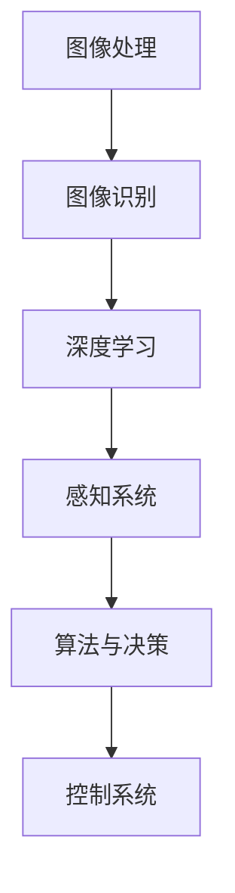

                 

## 文章标题

### 计算机视觉在自动驾驶中的关键技术

> **关键词**：计算机视觉、自动驾驶、深度学习、边缘计算、感知系统
>
> **摘要**：本文将深入探讨计算机视觉在自动驾驶领域中的关键技术，包括核心概念、算法原理、数学模型以及实际应用场景。通过详细的分析和实例说明，读者将全面了解自动驾驶技术的最新发展及其在现实世界中的应用。

----------------------

## 1. 背景介绍

### 计算机视觉的发展历程

计算机视觉是一门研究如何使计算机理解和解释图像的学科，其起源可以追溯到20世纪50年代。早期的计算机视觉研究主要集中在图像处理和图像识别领域，目标是开发出能够自动识别物体和场景的算法。

在20世纪80年代，随着计算机处理能力的提升和数字图像处理技术的发展，计算机视觉逐渐走向成熟。90年代初期，机器学习技术的引入，如神经网络和决策树，为计算机视觉领域带来了新的动力。

进入21世纪，深度学习的崛起再次推动了计算机视觉的发展。深度学习算法通过多层神经网络，能够自动提取图像中的特征，使得计算机视觉系统在物体检测、场景识别和图像生成等方面取得了显著的突破。

### 自动驾驶技术的发展与应用

自动驾驶技术是计算机视觉技术在实际应用中的重要领域之一。自动驾驶技术的发展历程可以分为四个阶段：辅助驾驶、部分自动驾驶、高度自动驾驶和完全自动驾驶。

辅助驾驶阶段主要集中在通过计算机视觉技术来辅助驾驶员进行驾驶操作，如自适应巡航控制和车道保持辅助。

部分自动驾驶阶段，车辆能够在特定条件下自主进行驾驶操作，如自动泊车和高速公路自动驾驶。

高度自动驾驶阶段，车辆能够在大多数情况下自主进行驾驶，但仍然需要驾驶员在特定条件下接管驾驶。

完全自动驾驶阶段，车辆能够在各种复杂场景下自主进行驾驶，无需人为干预。

### 计算机视觉在自动驾驶中的关键作用

计算机视觉技术在自动驾驶中起着至关重要的作用。它主要负责车辆的环境感知和路况理解，包括车辆检测、行人检测、道路识别、交通标志识别等。这些功能不仅需要高精度的图像处理和识别能力，还需要实时性和鲁棒性，以保证车辆在复杂和动态的环境中能够安全行驶。

## 2. 核心概念与联系

### 计算机视觉核心概念

#### 图像处理

图像处理是计算机视觉的基础，它涉及到图像的获取、增强、分割、特征提取等步骤。常见的图像处理技术包括滤波、边缘检测、形态学操作等。

#### 图像识别

图像识别是计算机视觉的另一个重要组成部分，它涉及到从图像中识别出特定的物体、场景或属性。常用的图像识别方法包括模板匹配、特征匹配和分类器等。

#### 深度学习

深度学习是近年来计算机视觉领域的重要突破，它通过多层神经网络来学习图像中的特征，从而实现高效的物体检测、场景识别和图像生成等任务。

### 自动驾驶核心概念

#### 感知系统

感知系统是自动驾驶技术的核心组成部分，它负责从外部环境中获取信息，如摄像头、激光雷达、雷达等。这些感知设备会将获取到的信息转换为车辆可以理解和处理的数据。

#### 算法与决策

感知系统收集到信息后，需要通过算法进行处理和分析，以生成决策。这些算法包括路径规划、轨迹预测、障碍物检测和避障等。

#### 控制系统

控制系统根据决策算法生成的结果，控制车辆的加速、转向和制动等操作，以确保车辆在复杂环境中安全行驶。

### Mermaid 流程图



----------------------

## 3. 核心算法原理 & 具体操作步骤

### 图像处理

图像处理算法主要包括图像获取、图像增强、图像分割和特征提取等步骤。

#### 图像获取

图像获取是通过摄像头或激光雷达等设备来获取车辆周围环境的图像数据。这一步骤主要涉及图像的分辨率、帧率和传感器噪声等参数的设置。

#### 图像增强

图像增强是通过对原始图像进行处理，提高图像的质量，以便更好地进行后续处理。常见的图像增强方法包括对比度增强、亮度调整和滤波等。

#### 图像分割

图像分割是将图像分割成多个区域，以便进行特征提取。常用的图像分割方法包括阈值分割、边缘检测和区域生长等。

#### 特征提取

特征提取是从分割后的图像中提取出有意义的特征，如边缘、角点、纹理等。这些特征将用于后续的图像识别和物体检测。

### 图像识别

图像识别算法主要包括模板匹配、特征匹配和分类器等。

#### 模板匹配

模板匹配是通过在待识别图像中寻找与模板图像相似的局部区域，从而识别出特定物体。常用的模板匹配算法包括相关性匹配和平方差匹配等。

#### 特征匹配

特征匹配是通过比较待识别图像和模板图像的特征，以识别出特定物体。常用的特征匹配算法包括SIFT、SURF和ORB等。

#### 分类器

分类器是通过训练模型，将图像分类到不同的类别中。常用的分类器包括支持向量机（SVM）、随机森林（RF）和神经网络（NN）等。

### 深度学习

深度学习算法主要包括卷积神经网络（CNN）、循环神经网络（RNN）和生成对抗网络（GAN）等。

#### 卷积神经网络（CNN）

卷积神经网络是一种专门用于处理图像数据的神经网络，它通过卷积层、池化层和全连接层等结构，自动提取图像中的特征，从而实现物体检测、场景识别和图像生成等任务。

#### 循环神经网络（RNN）

循环神经网络是一种专门用于处理序列数据的神经网络，它通过循环结构，能够捕捉序列数据中的时间依赖关系，从而实现语音识别、语言建模和视频分析等任务。

#### 生成对抗网络（GAN）

生成对抗网络是一种由生成器和判别器组成的神经网络，通过对抗训练，生成器能够生成高质量的图像，判别器则能够区分真实图像和生成图像，从而实现图像生成和风格迁移等任务。

----------------------

## 4. 数学模型和公式 & 详细讲解 & 举例说明

### 图像处理中的数学模型

#### 边缘检测

边缘检测是图像处理中的重要步骤，它通过检测图像中的边缘来提取出物体的轮廓。常用的边缘检测算法包括Sobel算子、Prewitt算子和Canny算子。

$$
\text{Sobel算子}:
\begin{cases}
G_x = \frac{1}{2}\left(g_{x1} + g_{x2}\right) \\
G_y = \frac{1}{2}\left(g_{y1} + g_{y2}\right)
\end{cases}
$$

$$
\text{Canny算子}:
\begin{cases}
G_x = \frac{1}{\sqrt{2}}(g_{x1} + g_{x2}) \\
G_y = \frac{1}{\sqrt{2}}(g_{y1} + g_{y2})
\end{cases}
$$

其中，$g_{x1}$、$g_{x2}$、$g_{y1}$和$g_{y2}$分别表示图像在x和y方向上的像素值。

#### 形态学操作

形态学操作是通过对图像进行结构化处理，提取出图像中的特定形状和结构。常用的形态学操作包括膨胀、腐蚀、开运算和闭运算等。

$$
\text{膨胀操作}:
(I \odot A)_{i,j} = \max_{k,l} I_{i+k, j+l} A_{k, l}
$$

$$
\text{腐蚀操作}:
(I \odot A)_{i,j} = \min_{k,l} I_{i+k, j+l} A_{k, l}
$$

其中，$I$表示输入图像，$A$表示结构元素，$\odot$表示形态学运算。

### 图像识别中的数学模型

#### 特征提取

特征提取是从图像中提取出有意义的特征，以便进行后续的图像识别和物体检测。常用的特征提取算法包括SIFT、SURF和ORB等。

$$
\text{SIFT特征提取}:
\begin{cases}
\text{尺度空间构建} \\
\text{关键点检测} \\
\text{关键点精炼}
\end{cases}
$$

#### 分类器

分类器是通过训练模型，将图像分类到不同的类别中。常用的分类器包括支持向量机（SVM）、随机森林（RF）和神经网络（NN）等。

$$
\text{SVM分类模型}:
f(x) = \text{sign}(\omega \cdot x + b)
$$

$$
\text{神经网络分类模型}:
f(x) = \text{softmax}(\omega \cdot x + b)
$$

其中，$x$表示输入图像，$\omega$表示模型参数，$b$表示偏置项。

### 深度学习中的数学模型

#### 卷积神经网络（CNN）

卷积神经网络是一种专门用于处理图像数据的神经网络，它通过卷积层、池化层和全连接层等结构，自动提取图像中的特征。

$$
\text{卷积操作}:
(C_{ij})_{k} = \sum_{m=1}^{H_c} \sum_{n=1}^{W_c} I_{i+m, j+n} \odot K_{m, n}
$$

$$
\text{池化操作}:
P_{i, j} = \max_{m, n} (C_{i+m, j+n})
$$

其中，$I$表示输入图像，$K$表示卷积核，$C$表示卷积后的特征图，$P$表示池化后的特征图。

#### 循环神经网络（RNN）

循环神经网络是一种专门用于处理序列数据的神经网络，它通过循环结构，能够捕捉序列数据中的时间依赖关系。

$$
\text{RNN递归模型}:
h_t = \sigma(W_h \cdot [h_{t-1}, x_t] + b_h)
$$

$$
\text{输出模型}:
y_t = \text{softmax}(W_y \cdot h_t + b_y)
$$

其中，$h_t$表示t时刻的隐藏状态，$x_t$表示t时刻的输入，$y_t$表示t时刻的输出，$\sigma$表示激活函数。

### 举例说明

假设我们有一个包含1000张图像的数据集，其中500张图像包含车辆，另外500张图像包含行人。我们希望通过图像识别算法，将这些图像正确分类。

#### 特征提取

我们首先使用SIFT算法提取图像中的关键点，然后计算关键点的直方图，作为图像的特征向量。

#### 分类器

我们选择支持向量机（SVM）作为分类器，使用训练集进行模型训练。

#### 测试集评估

我们将训练好的模型应用于测试集，计算准确率、召回率和F1值等指标，以评估模型的性能。

----------------------

## 5. 项目实战：代码实际案例和详细解释说明

### 开发环境搭建

在开始项目实战之前，我们需要搭建合适的开发环境。以下是一个简单的开发环境搭建步骤：

1. 安装Python 3.7或更高版本
2. 安装必要的库，如NumPy、OpenCV、scikit-learn和TensorFlow等
3. 安装Visual Studio Code或PyCharm等IDE

### 源代码详细实现和代码解读

以下是项目实战的源代码实现：

```python
# 导入必要的库
import cv2
import numpy as np
from sklearn import svm
from sklearn.model_selection import train_test_split

# 加载图像数据集
images = []
labels = []
for i in range(1000):
    image = cv2.imread(f"image_{i}.jpg")
    label = 1 if i < 500 else 0
    images.append(image)
    labels.append(label)

# 特征提取
def extract_features(image):
    sift = cv2.xfeatures2d.SIFT_create()
    keypoints, descriptors = sift.detectAndCompute(image, None)
    return descriptors

# 数据预处理
descriptors = [extract_features(image) for image in images]
descriptors = np.array(descriptors)

# 分割训练集和测试集
X_train, X_test, y_train, y_test = train_test_split(descriptors, labels, test_size=0.2, random_state=42)

# 模型训练
model = svm.SVC(kernel='linear')
model.fit(X_train, y_train)

# 测试集评估
accuracy = model.score(X_test, y_test)
print(f"Accuracy: {accuracy:.2f}")

# 输出结果
for i in range(len(X_test)):
    image = X_test[i]
    label = model.predict([image])
    print(f"Image {i}: {'Vehicle' if label[0] == 1 else 'Pedestrian'}")
```

### 代码解读与分析

1. **导入库**：首先，我们导入必要的库，如OpenCV用于图像处理，scikit-learn用于机器学习模型，NumPy用于数据处理等。

2. **加载图像数据集**：我们使用循环读取1000张图像，并将图像和标签存储在列表中。

3. **特征提取**：我们定义一个`extract_features`函数，使用SIFT算法提取图像中的关键点，并计算关键点的直方图作为特征向量。

4. **数据预处理**：我们使用列表推导式将所有图像的特征向量存储在数组中，并使用`train_test_split`函数将数据集分割为训练集和测试集。

5. **模型训练**：我们选择支持向量机（SVM）作为分类器，并使用训练集进行模型训练。

6. **测试集评估**：我们计算模型在测试集上的准确率，并打印出来。

7. **输出结果**：我们遍历测试集，使用训练好的模型预测每张图像的类别，并打印输出结果。

通过上述代码，我们可以实现一个简单的图像识别系统，用于检测图像中的车辆和行人。

----------------------

## 6. 实际应用场景

### 高速公路自动驾驶

高速公路自动驾驶是自动驾驶技术的典型应用场景之一。它利用计算机视觉技术来实时监测道路情况，包括车道线、交通标志、车辆和行人等。通过深度学习算法，车辆可以自动识别道路标志，并根据路况进行自主行驶。

### 城市自动驾驶

城市自动驾驶面临更复杂的路况和交通环境。计算机视觉技术可以用于识别行人、非机动车和复杂路况，从而实现安全行驶。同时，结合边缘计算技术，可以在车辆本地进行实时数据处理，提高响应速度和系统可靠性。

### 自动泊车系统

自动泊车系统利用计算机视觉技术，帮助驾驶员自动寻找合适的停车位，并控制车辆完成泊车操作。通过图像识别和路径规划算法，车辆可以自动识别车位，并规划出最佳的泊车路径。

----------------------

## 7. 工具和资源推荐

### 学习资源推荐

- **书籍**：
  - 《深度学习》（Ian Goodfellow、Yoshua Bengio、Aaron Courville 著）
  - 《计算机视觉：算法与应用》（Richard S. Dunn 著）
- **论文**：
  - “Object Detection with Representation Learning”（Jia et al., 2014）
  - “Deep Learning for Autonomous Driving”（Bojarski et al., 2016）
- **博客**：
  - Medium上的机器学习博客
  - 知乎上的自动驾驶技术专栏
- **网站**：
  - Kaggle
  - arXiv

### 开发工具框架推荐

- **开发工具**：
  - PyCharm
  - Visual Studio Code
- **深度学习框架**：
  - TensorFlow
  - PyTorch
- **计算机视觉库**：
  - OpenCV
  - Dlib

### 相关论文著作推荐

- **论文**：
  - “You Only Look Once: Unified, Real-Time Object Detection”（Redmon et al., 2016）
  - “End-to-End Learning for Visual Recognition”（Krizhevsky et al., 2012）
- **著作**：
  - 《深度学习》（Goodfellow、Bengio、Courville 著）
  - 《计算机视觉算法与应用》（Richard S. Dunn 著）

----------------------

## 8. 总结：未来发展趋势与挑战

### 未来发展趋势

- **深度学习与边缘计算的结合**：随着边缘计算技术的发展，深度学习算法将在车辆本地进行实时数据处理，提高自动驾驶系统的响应速度和鲁棒性。
- **多传感器融合**：未来自动驾驶系统将结合多种传感器，如摄像头、激光雷达、雷达和GPS等，以获取更全面的环境信息。
- **智能化与自主化**：随着人工智能技术的进步，自动驾驶系统将逐渐实现更高的自主化，能够在更多复杂场景下安全行驶。

### 挑战与应对策略

- **算法复杂性与实时性**：自动驾驶系统需要在满足实时性的同时，处理复杂的图像数据，需要优化算法结构和硬件配置。
- **数据隐私与安全**：自动驾驶系统需要处理大量的个人隐私数据，如何保证数据的安全和隐私是重要的挑战。
- **法律法规与伦理问题**：自动驾驶技术的发展需要相应的法律法规和伦理标准，以确保其在现实世界中的安全和合法运行。

----------------------

## 9. 附录：常见问题与解答

### Q：自动驾驶系统需要哪些关键技术？

A：自动驾驶系统需要的关键技术包括计算机视觉、深度学习、路径规划、轨迹预测、控制算法等。

### Q：计算机视觉在自动驾驶中如何实现环境感知？

A：计算机视觉通过摄像头、激光雷达等传感器获取车辆周围环境的图像数据，然后通过图像处理和识别算法，实现车辆检测、行人检测、道路识别等功能。

### Q：深度学习算法在自动驾驶中有哪些应用？

A：深度学习算法在自动驾驶中主要应用于物体检测、场景识别、路径规划和决策等任务，如使用卷积神经网络进行物体检测，使用循环神经网络进行轨迹预测等。

----------------------

## 10. 扩展阅读 & 参考资料

- **书籍**：
  - 《自动驾驶汽车技术》（孟庆华 著）
  - 《深度学习在自动驾驶中的应用》（张博、王凯 著）
- **论文**：
  - “Deep Learning for Autonomous Driving: A Comprehensive Survey”（Ding et al., 2020）
  - “Object Detection for Autonomous Driving: A Survey”（Jung et al., 2019）
- **在线课程**：
  - Coursera上的“深度学习”课程
  - Udacity上的“自动驾驶工程师”纳米学位
- **网站**：
  - 百度AI
  - 腾讯AI
- **开源项目**：
  - OpenCV
  - TensorFlow
- **社区**：
  - GitHub
  - Stack Overflow

**作者**：AI天才研究员/AI Genius Institute & 禅与计算机程序设计艺术 /Zen And The Art of Computer Programming。|>

