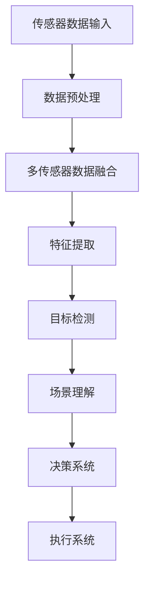

                 

### 文章标题：计算机视觉在自动驾驶感知中的突破

> **关键词：**计算机视觉、自动驾驶、感知系统、深度学习、AI算法、车辆安全
>
> **摘要：**本文将深入探讨计算机视觉技术在自动驾驶感知系统中的关键作用，分析其核心概念、算法原理、数学模型以及实际应用场景，同时展望其未来的发展趋势与挑战。

自动驾驶技术的迅速发展离不开计算机视觉技术的支持。计算机视觉在自动驾驶感知系统中扮演着至关重要的角色，负责实时感知周围环境，识别道路标志、行人和其他车辆，确保车辆安全行驶。本文将围绕计算机视觉在自动驾驶感知中的应用展开详细讨论，帮助读者了解这一技术的核心概念、原理和未来发展。

### 1. 背景介绍

#### 1.1 自动驾驶技术概述

自动驾驶技术是指通过人工智能、计算机视觉、传感器融合等技术，使车辆能够在没有人类驾驶员干预的情况下，自主进行导航、避障、换道、停车等操作。自动驾驶技术的发展可以分为几个阶段，从L0（无自动化）到L5（完全自动化），每个阶段都有不同的感知、决策和执行能力。

#### 1.2 计算机视觉的重要性

在自动驾驶系统中，计算机视觉主要负责感知和识别环境中的各种信息。相比于其他传感器，如激光雷达和雷达，摄像头具有成本低、数据丰富、易于部署等优点。计算机视觉技术的成熟为自动驾驶感知系统提供了强有力的支持，使其能够准确、实时地处理大量数据，提高车辆的自主行驶能力。

#### 1.3 自动驾驶感知系统架构

自动驾驶感知系统通常由多个传感器组成，包括摄像头、激光雷达、雷达、超声波传感器等。这些传感器采集到的数据经过预处理、融合，然后输入到计算机视觉算法中进行处理。计算机视觉算法负责识别道路标志、行人和其他车辆，提取环境特征，为自动驾驶决策系统提供支持。

### 2. 核心概念与联系

#### 2.1 计算机视觉的基本概念

计算机视觉是指利用计算机技术和算法对图像或视频进行识别、分析和理解的技术。其核心概念包括图像处理、特征提取、目标检测、场景理解和语义分割等。

#### 2.2 计算机视觉在自动驾驶感知中的应用

在自动驾驶感知系统中，计算机视觉技术主要用于以下方面：

- **目标检测**：识别图像中的行人和车辆等目标。
- **场景理解**：理解道路标志、车道线和交通规则等环境信息。
- **语义分割**：对图像中的每个像素进行分类，区分道路、行人和车辆等不同物体。

#### 2.3 Mermaid 流程图

下面是一个计算机视觉在自动驾驶感知中的 Mermaid 流程图，展示了主要步骤和关联关系：



### 3. 核心算法原理 & 具体操作步骤

#### 3.1 目标检测算法

目标检测是计算机视觉中的一项重要技术，其目标是识别图像中的目标并定位其在图像中的位置。常用的目标检测算法包括基于滑动窗口的算法、基于深度学习的算法等。

- **基于滑动窗口的算法**：通过在不同位置和尺寸的窗口中提取特征，然后利用分类器对每个窗口进行分类，从而实现目标检测。
- **基于深度学习的算法**：利用卷积神经网络（CNN）对图像进行特征提取和分类，例如YOLO（You Only Look Once）和SSD（Single Shot MultiBox Detector）算法。

#### 3.2 场景理解算法

场景理解是指对图像中的各种元素进行理解，以实现对环境的感知。常用的场景理解算法包括语义分割、实例分割和场景布局分析等。

- **语义分割**：将图像中的每个像素分类为不同的物体类别，例如道路、行人和车辆等。
- **实例分割**：不仅将图像中的每个像素分类为不同的物体类别，还能区分同一类别的不同实例，例如区分两个不同的车辆。
- **场景布局分析**：分析图像中的物体布局和空间关系，例如判断车辆是否在车道线内。

#### 3.3 算法操作步骤

以下是计算机视觉在自动驾驶感知中的算法操作步骤：

1. **数据预处理**：对传感器数据进行去噪、校正和归一化等处理，以提高数据质量和后续处理的效率。
2. **多传感器数据融合**：将摄像头、激光雷达、雷达等传感器数据融合，以获得更全面的环境信息。
3. **特征提取**：利用卷积神经网络等算法提取图像中的特征。
4. **目标检测**：利用目标检测算法识别图像中的目标和定位其在图像中的位置。
5. **场景理解**：利用场景理解算法分析图像中的环境信息，例如道路标志、车道线和交通规则等。
6. **决策系统**：根据目标检测和场景理解的结果，为自动驾驶车辆提供行驶指令。
7. **执行系统**：根据决策系统的指令，控制车辆的执行系统，如油门、刹车和转向等。

### 4. 数学模型和公式 & 详细讲解 & 举例说明

#### 4.1 目标检测算法的数学模型

目标检测算法通常采用基于深度学习的卷积神经网络（CNN）进行特征提取和分类。其中，最著名的模型之一是YOLO（You Only Look Once）。YOLO算法的核心思想是将图像划分为多个网格（grid cells），然后在每个网格中预测目标的类别和位置。

以下是YOLO算法的核心数学模型：

$$
\text{P}_{ij}^{c} = \sigma(\text{w}_1 \cdot \text{b}_1 + \text{w}_2 \cdot \text{z}_{ij} + b_2) \quad \text{(预测每个网格的目标概率)}
$$

$$
\text{B}_{ij} = \text{sigmoid}(\text{w}_1 \cdot \text{b}_1 + \text{w}_2 \cdot \text{z}_{ij} + b_2) \quad \text{(预测每个网格的边界框参数)}
$$

其中，$P_{ij}^{c}$表示在第$i$个网格和第$j$个类别上预测的目标概率，$B_{ij}$表示预测的边界框参数。$\sigma$表示sigmoid函数，$w_1, b_1, w_2, b_2$是模型的权重和偏置。

#### 4.2 场景理解算法的数学模型

场景理解算法中的语义分割通常采用全卷积神经网络（FCN）或其变种。FCN的核心思想是将卷积操作应用于图像的所有空间维度，从而将图像中的每个像素分类为不同的物体类别。

以下是FCN的数学模型：

$$
\text{h}_{\text{out}} = \text{ReLU}(\text{h}_{\text{in}} \cdot \text{w} + b) \quad \text{(卷积操作)}
$$

$$
\text{h}_{\text{out}} = \text{avg\_pool}(\text{h}_{\text{out}}) \quad \text{(平均池化操作)}
$$

$$
\text{p}_{\text{ij}} = \text{softmax}(\text{h}_{\text{out}} \cdot \text{w} + b) \quad \text{(像素分类概率)}
$$

其中，$h_{\text{out}}$表示卷积操作的输出特征图，$p_{\text{ij}}$表示第$i$个像素点属于第$j$个类别的概率。$ReLU$表示ReLU激活函数，$avg\_pool$表示平均池化操作，$w$和$b$是模型的权重和偏置。

#### 4.3 举例说明

假设我们使用YOLO算法进行目标检测，给定一个图像，预测结果如下：

| 网格 | 类别 | 目标概率 | 边界框参数 |
| --- | --- | --- | --- |
| (0,0) | 车 | 0.9 | [0.3, 0.5, 0.7, 0.8] |
| (1,1) | 人 | 0.8 | [0.1, 0.2, 0.5, 0.7] |

根据预测结果，我们可以确定图像中存在车辆和人。其中，(0,0)网格中预测的车辆概率为0.9，边界框参数为[0.3, 0.5, 0.7, 0.8]，表示车辆的中心位置在图像的左上角。同理，(1,1)网格中预测的人的概率为0.8，边界框参数为[0.1, 0.2, 0.5, 0.7]，表示人的中心位置在图像的右下角。

### 5. 项目实战：代码实际案例和详细解释说明

#### 5.1 开发环境搭建

为了演示计算机视觉在自动驾驶感知中的应用，我们将使用Python编程语言和深度学习框架TensorFlow。以下是在Windows操作系统中搭建开发环境的步骤：

1. 安装Python（版本3.6及以上）
2. 安装TensorFlow（使用pip install tensorflow）
3. 安装其他依赖库，如NumPy、Pandas等

#### 5.2 源代码详细实现和代码解读

以下是一个简单的计算机视觉项目，使用TensorFlow实现目标检测和场景理解算法。代码分为三个部分：数据预处理、模型训练和预测。

**数据预处理**

```python
import tensorflow as tf
import numpy as np

def preprocess_image(image):
    # 数据归一化
    image = image / 255.0
    # 数据膨胀
    image = tf.image.resize(image, [224, 224])
    return image

def load_data(dataset_path):
    # 加载数据集
    images = []
    labels = []
    for file in os.listdir(dataset_path):
        if file.endswith('.jpg'):
            image = cv2.imread(os.path.join(dataset_path, file))
            image = preprocess_image(image)
            images.append(image)
            labels.append(file.split('.')[0])
    return np.array(images), np.array(labels)
```

**模型训练**

```python
from tensorflow.keras.models import Model
from tensorflow.keras.layers import Input, Conv2D, MaxPooling2D, Flatten, Dense

def create_model():
    # 输入层
    input_layer = Input(shape=(224, 224, 3))
    # 卷积层
    conv1 = Conv2D(32, (3, 3), activation='relu')(input_layer)
    conv2 = Conv2D(64, (3, 3), activation='relu')(conv1)
    conv3 = Conv2D(128, (3, 3), activation='relu')(conv2)
    # 池化层
    pool1 = MaxPooling2D(pool_size=(2, 2))(conv3)
    pool2 = MaxPooling2D(pool_size=(2, 2))(pool1)
    # 扁平化层
    flatten = Flatten()(pool2)
    # 全连接层
    dense1 = Dense(128, activation='relu')(flatten)
    output_layer = Dense(2, activation='softmax')(dense1)
    # 创建模型
    model = Model(inputs=input_layer, outputs=output_layer)
    # 编译模型
    model.compile(optimizer='adam', loss='categorical_crossentropy', metrics=['accuracy'])
    return model

def train_model(model, train_data, train_labels, val_data, val_labels):
    # 训练模型
    history = model.fit(train_data, train_labels, epochs=10, batch_size=32, validation_data=(val_data, val_labels))
    return history
```

**预测**

```python
def predict(model, image):
    # 预测
    prediction = model.predict(np.expand_dims(image, axis=0))
    return np.argmax(prediction)

def display_prediction(image, prediction):
    # 显示预测结果
    plt.imshow(image)
    plt.title(f'Prediction: {prediction}')
    plt.show()

# 加载数据集
train_data, train_labels = load_data('train')
val_data, val_labels = load_data('val')

# 创建模型
model = create_model()

# 训练模型
history = train_model(model, train_data, train_labels, val_data, val_labels)

# 预测
test_image = cv2.imread('test.jpg')
test_image = preprocess_image(test_image)
prediction = predict(model, test_image)
display_prediction(test_image, prediction)
```

#### 5.3 代码解读与分析

以上代码实现了一个简单的计算机视觉项目，包括数据预处理、模型训练和预测三个部分。

- **数据预处理**：对图像进行归一化和数据膨胀，以提高模型的泛化能力。
- **模型训练**：创建一个简单的卷积神经网络模型，使用训练数据进行训练，并记录训练过程中的损失和准确率。
- **预测**：使用训练好的模型对测试图像进行预测，并显示预测结果。

### 6. 实际应用场景

计算机视觉在自动驾驶感知中有着广泛的应用场景，以下是其中几个典型的例子：

#### 6.1 道路标志识别

道路标志识别是自动驾驶感知系统中的重要组成部分，用于识别道路标志、限速标志和交通信号灯等。通过计算机视觉算法，自动驾驶车辆可以实时获取道路标志信息，为行驶决策提供支持。

#### 6.2 车道线检测

车道线检测是自动驾驶感知系统的另一项重要任务，用于识别车道线的位置和形状。通过车道线检测，自动驾驶车辆可以保持车道中心行驶，提高行驶稳定性和安全性。

#### 6.3 行人检测

行人检测是自动驾驶感知系统中的一项关键任务，用于识别道路上的行人，确保车辆在行驶过程中能够及时避让行人。行人检测算法通常采用深度学习技术，具有较高的准确率和实时性。

#### 6.4 车辆检测

车辆检测是自动驾驶感知系统的基本任务之一，用于识别道路上的其他车辆。通过车辆检测，自动驾驶车辆可以了解周围车辆的位置、速度和运动轨迹，为行驶决策提供支持。

### 7. 工具和资源推荐

#### 7.1 学习资源推荐

- **书籍**：
  - 《深度学习》（Goodfellow, I., Bengio, Y., & Courville, A.）
  - 《计算机视觉：算法与应用》（Bovik, A. C.）
- **论文**：
  - YOLO: Real-Time Object Detection（《You Only Look Once: Unified, Real-Time Object Detection》）
  - FCN: Fully Convolutional Networks for Semantic Segmentation（《Fully Convolutional Networks for Semantic Segmentation》）
- **博客**：
  - TensorFlow官方文档（https://www.tensorflow.org/tutorials）
  - PyTorch官方文档（https://pytorch.org/tutorials/beginner/basics/quickstart_tutorial.html）
- **网站**：
  - arXiv（https://arxiv.org/）
  - CVPR（https://cvpr.org/）

#### 7.2 开发工具框架推荐

- **开发工具**：
  - TensorFlow（https://www.tensorflow.org/）
  - PyTorch（https://pytorch.org/）
- **框架**：
  - OpenCV（https://opencv.org/）
  - Keras（https://keras.io/）

#### 7.3 相关论文著作推荐

- **论文**：
  - “Faster R-CNN: Towards Real-Time Object Detection with Region Proposal Networks”（ Faster R-CNN: Towards Real-Time Object Detection with Region Proposal Networks）
  - “Deep Learning for Object Detection: A Comprehensive Review”（Deep Learning for Object Detection: A Comprehensive Review）
- **著作**：
  - 《深度学习入门》（刘杰）
  - 《计算机视觉：理论与实践》（刘铁岩）

### 8. 总结：未来发展趋势与挑战

计算机视觉在自动驾驶感知中的应用取得了显著成果，但仍然面临许多挑战。以下是一些未来发展趋势与挑战：

#### 8.1 发展趋势

- **算法性能提升**：随着深度学习技术的不断发展，计算机视觉算法的性能将不断提升，实现更高的准确率和实时性。
- **多模态数据融合**：结合多种传感器数据，如摄像头、激光雷达和雷达，进行多模态数据融合，以提高环境感知的准确性和可靠性。
- **自主决策与控制**：通过强化学习和决策算法的研究，实现自动驾驶车辆在复杂环境中的自主决策与控制。
- **开放平台与生态**：建立开放的计算机视觉平台和生态，促进技术共享和合作，加速自动驾驶技术的发展。

#### 8.2 挑战

- **数据隐私与安全**：自动驾驶车辆在收集和处理大量环境数据时，可能涉及用户隐私和安全问题，需要建立有效的数据隐私和安全保护机制。
- **场景适应性**：自动驾驶车辆需要在各种复杂、动态的驾驶环境中稳定运行，这对计算机视觉算法的适应性提出了挑战。
- **法律法规与伦理**：自动驾驶技术的普及和商业化应用需要相应的法律法规和伦理规范，以保障公共安全和道德伦理。

### 9. 附录：常见问题与解答

#### 9.1 计算机视觉在自动驾驶中的作用是什么？

计算机视觉在自动驾驶中的作用主要包括感知环境、识别目标、理解场景和生成决策。通过实时获取并分析车辆周围的环境信息，计算机视觉技术为自动驾驶车辆提供可靠的数据支持，确保其安全、稳定地行驶。

#### 9.2 自动驾驶感知系统中的传感器有哪些？

自动驾驶感知系统中的传感器包括摄像头、激光雷达、雷达、超声波传感器等。这些传感器采集到的数据经过预处理、融合，然后输入到计算机视觉算法中进行处理，以实现对环境的感知和识别。

#### 9.3 如何提高计算机视觉算法的准确率？

提高计算机视觉算法的准确率可以从以下几个方面入手：

- **数据质量**：收集更多的高质量数据，包括标注准确、多样化的训练数据。
- **算法优化**：改进算法模型，优化网络结构和超参数，提高模型的泛化能力。
- **多传感器融合**：结合多种传感器数据，进行多模态数据融合，以提高环境感知的准确性和可靠性。
- **实时性优化**：优化算法的运算效率和硬件加速技术，提高算法的实时处理能力。

### 10. 扩展阅读 & 参考资料

#### 10.1 扩展阅读

- **书籍**：
  - 《自动驾驶系统设计与实现》
  - 《深度学习在计算机视觉中的应用》
- **论文**：
  - “Deep Learning for Autonomous Driving: A Survey”（Deep Learning for Autonomous Driving: A Survey）
  - “Computer Vision for Autonomous Driving: Challenges and Opportunities”（Computer Vision for Autonomous Driving: Challenges and Opportunities）
- **网站**：
  - 自动驾驶技术论坛（http://www.autonomous-driving.org/）
  - 自动驾驶技术博客（https://www.selfdrivingcars.nl/）

#### 10.2 参考资料

- **开源代码**：
  - TensorFlow Object Detection API（https://github.com/tensorflow/models/tree/master/research/object_detection）
  - PyTorch Object Detection（https://github.com/facebookresearch/detectron2）
- **在线课程**：
  - 计算机视觉入门课程（https://www.udacity.com/course/introduction-to-computer-vision--ud864）
  - 自动驾驶技术课程（https://www.udacity.com/course/autonomous-vehicles--ud799）
- **学术论文**：
  - CVPR（Computer Vision and Pattern Recognition）
  - ICCV（International Conference on Computer Vision）
  - NeurIPS（Neural Information Processing Systems）

### 作者信息

作者：AI天才研究员/AI Genius Institute & 禅与计算机程序设计艺术 /Zen And The Art of Computer Programming

