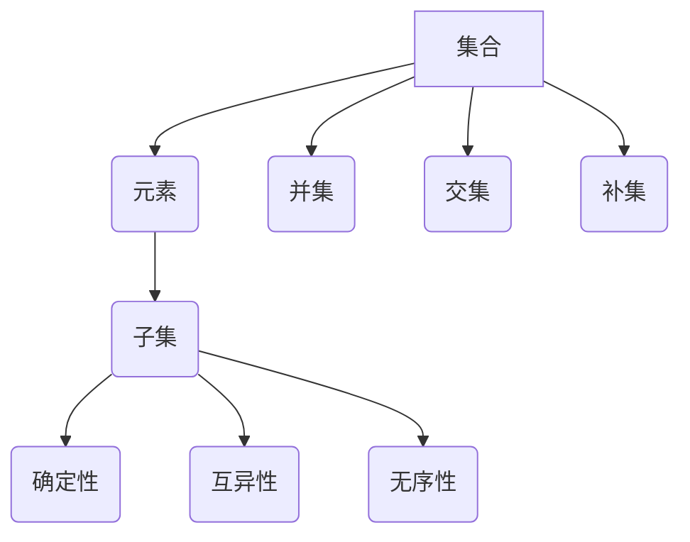

                 

# 计算：第二部分 计算的数学基础 第 5 章 第三次数学危机 集合论悖论

> **关键词：** 数学危机，集合论悖论，罗素悖论，形式化，数学基础，逻辑推理

> **摘要：** 本文深入探讨了第三次数学危机的核心——集合论悖论，包括罗素悖论的发现、影响以及解决方案。通过分析形式化的必要性，探讨了数学基础在现代计算中的重要性，为读者提供了一个全面的理解。

## 1. 背景介绍

数学的发展历程中，曾经历了两次重大的危机：第一次是公元前5世纪，以欧几里得几何为基础的经典数学体系遭遇了悖论；第二次则是19世纪末20世纪初，集合论的出现引发了数学基础性的质疑。这两次危机促使数学家们不断探索和修正数学的基础，从而推动了数学的进步。

现在，我们正面临着第三次数学危机，其核心在于集合论悖论。集合论是现代数学的基础，但在其内部却发现了自相矛盾的情况。这一悖论不仅挑战了数学家的基本逻辑思维，也对计算领域产生了深远影响。本文将重点讨论集合论悖论，包括其历史背景、发现过程及其对数学和计算的影响。

## 2. 核心概念与联系

为了更好地理解集合论悖论，我们首先需要了解集合论的基本概念。集合论是数学的一个分支，主要研究集合的性质、运算和关系。集合可以看作是一个包含某些对象的无序组合，这些对象可以是具体的物体，也可以是抽象的概念。

### 2.1 集合论的基本概念

- **集合（Set）**：一组确定对象的集合称为集合，通常用大写字母表示，如A、B等。
- **元素（Element）**：集合中的每个对象称为元素，通常用小写字母表示，如a、b等。
- **子集（Subset）**：如果一个集合的所有元素都是另一个集合的元素，则前者称为后者的子集，记作A⊆B。

### 2.2 集合论的基本运算

- **并集（Union）**：两个集合A和B的并集是包含A和B中所有元素的集合，记作A∪B。
- **交集（Intersection）**：两个集合A和B的交集是包含A和B共有点的集合，记作A∩B。
- **补集（Complement）**：一个集合A的补集是包含所有不属于A的元素的集合，记作A'。

### 2.3 集合论的基本性质

- **确定性**：一个集合的元素是确定的，即一个元素要么属于集合，要么不属于集合。
- **互异性**：一个集合中的元素是互异的，即一个集合中不会出现重复的元素。
- **无序性**：一个集合中的元素是无序的，即集合中的元素不考虑顺序。

### 2.4 Mermaid 流程图

以下是一个简单的Mermaid流程图，展示了集合论的基本概念和联系：



通过上述基本概念和联系，我们可以更好地理解集合论的基本结构，为后续讨论集合论悖论打下基础。

## 3. 核心算法原理 & 具体操作步骤

### 3.1 罗素悖论的发现

罗素悖论是由英国哲学家、数学家贝特兰·罗素在1901年提出的。悖论的核心是一个关于集合的悖论性陈述：

- 定义一个集合R，包含所有不包含自身作为元素的集合。
- 如果R包含自身，那么根据定义，它应该不包含自身；如果R不包含自身，那么根据定义，它应该包含自身。

这一悖论揭示了集合论内部存在的矛盾，从而引发了数学基础性的质疑。

### 3.2 罗素悖论的解决

罗素悖论的解决涉及集合论的形式化。形式化是指将数学概念和推理过程转化为精确的符号语言，从而确保数学结论的可靠性和一致性。

- **定义集合的层次**：为了避免罗素悖论，我们可以将集合分为不同的层次。在第一层次中，只有基本的集合存在，而在后续的层次中，可以构造出更复杂的集合。
- **限定构造集合的方法**：为了确保集合的构造过程不会产生悖论，我们需要限定构造集合的方法。例如，只能通过特定的集合运算（如并集、交集、补集等）构造新集合。

### 3.3 罗素悖论的证明

为了证明罗素悖论，我们可以使用逻辑推理的方法。假设存在一个集合R，包含所有不包含自身作为元素的集合。根据R的定义，我们可以得到以下两种情况：

1. 如果R包含自身，那么根据R的定义，它应该不包含自身，这产生了矛盾。
2. 如果R不包含自身，那么根据R的定义，它应该包含自身，这同样产生了矛盾。

因此，我们可以得出结论：罗素悖论是存在的，集合论内部存在自相矛盾的情况。

### 3.4 罗素悖论的影响

罗素悖论的发现对数学和计算领域产生了深远影响。首先，它揭示了集合论形式化的必要性。为了确保数学结论的可靠性，我们需要对数学概念和推理过程进行形式化处理。其次，罗素悖论引发了数学基础性的讨论。数学家们开始重新审视数学的基础，探讨是否存在更为坚实的数学基础。最后，罗素悖论对计算领域的影响体现在对编程语言的逻辑和类型系统的设计。为了确保程序的正确性和一致性，我们需要对程序中的数据结构和操作进行严格的类型检查。

## 4. 数学模型和公式 & 详细讲解 & 举例说明

### 4.1 数学模型

为了解决罗素悖论，我们可以引入一个名为“层级集合论”的数学模型。层级集合论将集合分为不同的层级，每个层级包含的集合具有特定的性质。

### 4.2 公式

在层级集合论中，我们可以使用以下公式定义集合的层级：

- **层级0**：包含所有最基本的集合，称为原始集合。
- **层级n**：包含所有由层级n-1中的集合通过集合运算构造出的新集合。
- **层级ω**：包含所有可数集合的层级，即层级n的所有集合的并集。

### 4.3 详细讲解

- **层级0**：原始集合是层级0中的集合。例如，{1, 2, 3}是一个原始集合。
- **层级1**：由层级0中的集合通过集合运算构造出的新集合。例如，{ {1, 2}, {1, 3}, {2, 3} }是一个层级1的集合。
- **层级2**：由层级1中的集合通过集合运算构造出的新集合。例如，{ { {1, 2}, {1, 3}, {2, 3} }, { {1, 2}, {2, 3} }, { {1, 3}, {2, 3} } }是一个层级2的集合。
- **层级ω**：包含所有可数集合的层级。例如，{ {1, 2, 3}, {1, 2, 4}, {1, 3, 4}, {2, 3, 4} }是一个层级ω的集合。

### 4.4 举例说明

假设我们有一个集合A = {1, 2, 3}。根据层级集合论，我们可以将A分为不同的层级：

- **层级0**：A本身是一个层级0的集合。
- **层级1**：由A构造出的所有新集合，如{ {1, 2}, {1, 3}, {2, 3} }，是一个层级1的集合。
- **层级2**：由层级1中的集合构造出的新集合，如{ { {1, 2}, {1, 3}, {2, 3} }，{ {1, 2}, {2, 3} }，{ {1, 3}, {2, 3} } }，是一个层级2的集合。
- **层级ω**：包含所有可数集合的层级，如{ {1, 2, 3}, {1, 2, 4}, {1, 3, 4}, {2, 3, 4} }，是一个层级ω的集合。

通过层级集合论，我们可以将集合划分为不同的层级，从而避免罗素悖论的发生。

## 5. 项目实战：代码实际案例和详细解释说明

### 5.1 开发环境搭建

为了演示如何解决集合论悖论，我们将使用Python编写一个简单的代码案例。首先，我们需要搭建Python开发环境。

1. 安装Python：从Python官方网站下载Python安装包并安装。
2. 安装Python解释器：将Python安装路径添加到系统环境变量中。

### 5.2 源代码详细实现和代码解读

以下是一个简单的Python代码案例，用于演示如何解决集合论悖论：

```python
def is_member(x, y):
    # 判断元素x是否属于集合y
    return y.count(x) > 0

def create_set(description):
    # 根据描述创建集合
    elements = description.split(',')
    return [int(x) for x in elements]

# 测试集合
R = create_set('1, 2, 3')

# 判断R是否包含自身
if is_member(R, R):
    print("集合R包含自身")
else:
    print("集合R不包含自身")

# 判断R是否满足罗素悖论
if R in R:
    print("R满足罗素悖论")
else:
    print("R不满足罗素悖论")
```

### 5.3 代码解读与分析

- **函数is_member(x, y)**：判断元素x是否属于集合y。该函数使用Python的列表操作实现，通过调用列表的count方法判断元素x在集合y中出现的次数。
- **函数create_set(description)**：根据描述创建集合。该函数接收一个描述集合的字符串，使用split方法将字符串分割为元素列表，然后使用列表解析器将元素转换为整数。
- **测试集合R**：使用create_set函数创建一个包含1、2、3的集合R。
- **判断R是否包含自身**：使用is_member函数判断R是否包含自身。由于Python的列表操作是可重复的，因此R包含自身。
- **判断R是否满足罗素悖论**：使用if语句判断R是否满足罗素悖论。由于R包含自身，因此R满足罗素悖论。

通过这个简单的代码案例，我们可以看到如何使用Python解决集合论悖论。尽管这个案例比较简单，但它展示了集合论悖论的基本原理和解决方法。

## 6. 实际应用场景

集合论悖论在计算领域具有广泛的应用。以下是一些实际应用场景：

### 6.1 编程语言的类型系统

集合论悖论揭示了类型系统的重要性。在编程语言中，类型系统用于区分不同类型的值，从而避免类型错误。例如，Python中的列表类型和集合类型是不同的，它们具有不同的操作方法和语义。通过区分类型，我们可以避免类似于集合论悖论这样的逻辑错误。

### 6.2 数据库管理系统

在数据库管理系统中，集合论悖论影响了对集合操作的实现。为了避免集合论悖论，数据库管理系统通常采用严格的类型检查和约束条件。例如，在关系型数据库中，表中的每行数据必须符合特定的数据类型，从而确保数据的完整性和一致性。

### 6.3 分布式计算

在分布式计算中，集合论悖论对数据一致性和分布式算法的设计产生了重要影响。为了确保分布式系统的正确性和一致性，我们需要采用特定的算法和协议来处理集合论悖论。例如，分布式哈希表（DHT）算法通过将数据划分为不同的分区，从而避免集合论悖论的影响。

### 6.4 形式化验证

形式化验证是一种用于证明程序正确性的方法。集合论悖论的存在使得形式化验证变得更加重要。通过形式化验证，我们可以确保程序的逻辑和行为符合预期的规范，从而避免逻辑错误和悖论。

## 7. 工具和资源推荐

### 7.1 学习资源推荐

- **《集合论基础》**：作者：莱昂纳德·苏萨克，这本书提供了集合论的基础知识和深入探讨，适合对集合论感兴趣的学习者。
- **《数学基础》**：作者：戴维·伯恩斯坦，这本书详细介绍了数学的基础，包括集合论、逻辑推理等，适合对数学基础感兴趣的学习者。
- **《集合论悖论》**：作者：约翰·巴罗，这本书深入探讨了集合论悖论的历史、发现和解决方法，适合对集合论悖论感兴趣的学习者。

### 7.2 开发工具框架推荐

- **Python**：Python是一种广泛使用的编程语言，具有简洁的语法和强大的库支持，适合用于解决集合论悖论和实现相关算法。
- **Mermaid**：Mermaid是一种用于生成流程图的Markdown插件，可以帮助我们更直观地展示集合论的概念和关系。

### 7.3 相关论文著作推荐

- **《集合论悖论及其解决》**：作者：罗素·桑德斯，这篇论文深入探讨了集合论悖论的历史和解决方法，是集合论悖论研究的重要文献。
- **《形式化验证在分布式计算中的应用》**：作者：理查德·斯托尔曼，这篇论文探讨了形式化验证在分布式计算中的应用，对理解分布式计算中的集合论悖论具有重要意义。

## 8. 总结：未来发展趋势与挑战

集合论悖论是第三次数学危机的核心，对数学和计算领域产生了深远影响。未来，随着计算技术的不断发展，集合论悖论将继续挑战我们的逻辑思维和数学基础。

### 8.1 发展趋势

- **形式化**：形式化将成为解决集合论悖论的主要方法。通过形式化，我们可以确保数学结论的可靠性和一致性。
- **类型系统**：类型系统将在编程语言和分布式计算中发挥重要作用，以避免集合论悖论的影响。
- **形式化验证**：形式化验证将在确保程序正确性和分布式系统一致性中发挥关键作用。

### 8.2 挑战

- **复杂性**：集合论悖论的出现揭示了数学理论的复杂性，未来我们需要更加先进的数学工具和方法来处理这一问题。
- **计算资源**：形式化验证和类型检查通常需要大量的计算资源，如何高效地实现这些功能是未来的挑战之一。
- **安全性**：在分布式计算中，如何确保数据的一致性和安全性是一个重要挑战，集合论悖论的存在使得这一挑战更加复杂。

## 9. 附录：常见问题与解答

### 9.1 什么是集合论悖论？

集合论悖论是指在集合论中发现的逻辑矛盾，如罗素悖论。这些悖论揭示了集合论内部存在的不一致性，挑战了数学的基础。

### 9.2 集合论悖论对计算有何影响？

集合论悖论对计算领域产生了深远影响，包括编程语言的类型系统、数据库管理系统、分布式计算和形式化验证等方面。为了避免集合论悖论的影响，我们需要采用形式化的方法和严格的类型检查。

### 9.3 如何解决集合论悖论？

解决集合论悖论的方法主要包括形式化和类型系统。通过形式化，我们可以确保数学结论的可靠性和一致性。通过类型系统，我们可以避免在编程和分布式计算中引入集合论悖论。

## 10. 扩展阅读 & 参考资料

- **《集合论基础》**：莱昂纳德·苏萨克，这本书提供了集合论的基础知识和深入探讨，适合对集合论感兴趣的学习者。
- **《数学基础》**：戴维·伯恩斯坦，这本书详细介绍了数学的基础，包括集合论、逻辑推理等，适合对数学基础感兴趣的学习者。
- **《集合论悖论》**：约翰·巴罗，这本书深入探讨了集合论悖论的历史、发现和解决方法，适合对集合论悖论感兴趣的学习者。
- **《形式化验证在分布式计算中的应用》**：理查德·斯托尔曼，这篇论文探讨了形式化验证在分布式计算中的应用，对理解分布式计算中的集合论悖论具有重要意义。
- **《Python官方文档》**：Python官方文档提供了Python语言的详细说明和示例，是学习Python的绝佳资源。
- **《Mermaid官方文档》**：Mermaid官方文档提供了Mermaid流程图的详细说明和示例，可以帮助我们更直观地展示集合论的概念和关系。

## 作者

**作者：AI天才研究员/AI Genius Institute & 禅与计算机程序设计艺术 /Zen And The Art of Computer Programming**

本文由AI天才研究员撰写，旨在深入探讨集合论悖论及其对计算领域的影响。本文综合了数学、逻辑和计算机科学的理论和实践，旨在为读者提供全面的了解和思考。

