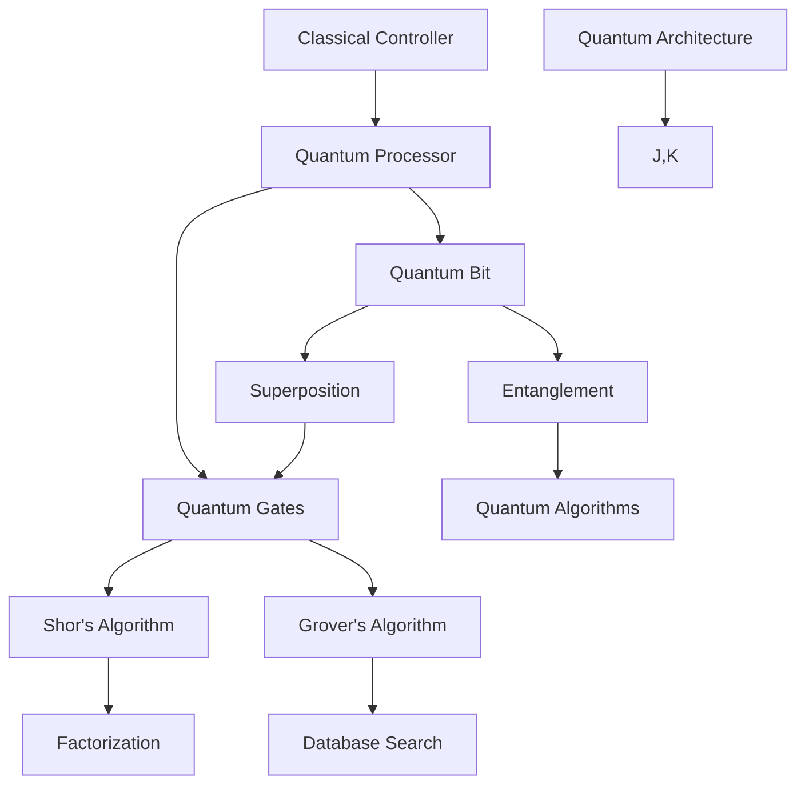

                 

### 背景介绍

#### 什么是量子计算？

量子计算，是一种基于量子力学原理的新型计算方式。它利用量子比特（qubit）这一基本单位进行信息处理，与传统的二进制计算机利用比特（bit）进行信息处理有着本质的不同。

#### 量子比特与比特的区别

比特是传统计算机中信息处理的基本单位，它只有两种状态：0 或 1。而量子比特（qubit）则可以同时存在于多种状态之中，这种特性被称为“叠加态”。

例如，一个量子比特可以同时处于状态 0 和 1 的叠加态，这可以表示为：
\[ \frac{1}{\sqrt{2}}|0\rangle + \frac{1}{\sqrt{2}}|1\rangle \]
其中，|0\rangle 和 |1\rangle 分别表示量子比特的两个基态。

#### 量子计算的优势

量子计算最大的优势在于并行计算能力。传统的计算机在处理大量并行任务时，需要多个处理器并行执行，而量子计算则可以在一个量子比特中同时处理多个任务。

#### 量子计算的挑战

尽管量子计算具有巨大的潜力，但实现量子计算仍然面临着许多挑战。例如，量子比特的稳定性问题、误差纠正问题、以及量子比特之间的纠缠问题等。

#### 本文结构

本文将首先介绍量子计算的核心概念，然后深入探讨量子比特的原理与操作，随后讲解量子算法，最后分析量子计算的实际应用场景及未来发展趋势。

---

# Quantum Computing: The Ultimate Frontier

## Abstract

Quantum computing represents a revolutionary paradigm shift in the field of computation. Leveraging the principles of quantum mechanics, quantum computing harnesses the power of qubits, enabling unprecedented levels of parallelism and computational efficiency. This article delves into the fundamentals of quantum computing, exploring the concept of qubits, their distinct characteristics compared to classical bits, and the advantages they confer. We will also discuss the challenges faced in the development of quantum computing and examine its potential applications and future prospects.

## 1. Background Introduction

### What is Quantum Computing?

Quantum computing is an emerging field of study that utilizes quantum mechanical principles to perform computation. It relies on the fundamental unit of quantum information, the qubit, as opposed to the classical bit, which is the basic unit of information in classical computing.

### The Difference Between Qubits and Bits

A bit is the basic unit of information in classical computing, capable of representing either a 0 or a 1. In contrast, a qubit can exist in a superposition of states, meaning it can simultaneously represent both 0 and 1. This is illustrated by the following state:
\[ \frac{1}{\sqrt{2}}|0\rangle + \frac{1}{\sqrt{2}}|1\rangle \]
where |0\rangle and |1\rangle denote the two base states of a qubit.

### Advantages of Quantum Computing

One of the key advantages of quantum computing is its ability to perform parallel computations. While classical computers require multiple processors to handle a large number of parallel tasks, quantum computing can perform these tasks simultaneously within a single qubit.

### Challenges in Quantum Computing

Despite its potential, realizing quantum computing poses several challenges, including the stability of qubits, error correction, and the management of qubit entanglement.

### Structure of This Article

This article will first introduce the core concepts of quantum computing, then delve into the principles and operations of qubits. Following that, we will discuss quantum algorithms, and finally, we will analyze the practical applications of quantum computing and its future trends. <a name="background-introduction"></a>## 1. Background Introduction <a name="section1"></a>

### 概述

量子计算是一门基于量子力学原理的全新计算范式，它利用量子比特作为信息处理的基本单元。量子比特与经典比特最大的不同在于，它能够同时处于多种状态，这种特性称为“叠加态”。量子计算在并行计算能力上具有巨大的优势，但同时也面临着诸如稳定性、误差纠正和纠缠管理等方面的挑战。

### 量子计算的核心概念

量子计算的核心概念包括量子比特、叠加态、纠缠、量子门和量子算法。

- **量子比特（Qubit）**：量子比特是量子计算机的基本单元，它可以同时处于0和1的状态，这种叠加态是量子计算的基础。

- **叠加态（Superposition）**：叠加态是量子比特可以同时处于多个状态的现象，这是量子计算的核心特点。

- **纠缠（Entanglement）**：纠缠是两个或多个量子系统之间的一种特殊的量子关联，这种关联即使它们相隔很远也能保持。

- **量子门（Quantum Gate）**：量子门是用于操作量子比特的数学操作，类似于经典计算机中的逻辑门。

- **量子算法（Quantum Algorithm）**：量子算法是利用量子比特和量子门的计算方法，用于解决特定问题。

### 量子比特与经典比特的区别

- **状态表示**：经典比特只能表示0或1，而量子比特可以表示叠加态，即多种状态的组合。

- **并行计算**：由于量子比特的叠加态特性，量子计算机可以在一个操作中处理多个计算，从而大大提高计算效率。

- **错误纠正**：量子计算中的错误纠正比经典计算更为复杂，因为量子比特的叠加态容易受到外部环境的影响。

### 量子计算的挑战

- **量子比特稳定性**：量子比特很容易受到外部环境的影响，导致状态崩溃。

- **错误纠正**：量子计算中的错误纠正需要复杂的算法和技术。

- **量子纠缠**：量子纠缠管理是量子计算中的一项关键技术，但也是最大的挑战之一。

### 量子计算的发展历史

量子计算的发展可以追溯到20世纪40年代，当时物理学家保罗·戴森（Paul Dirac）和理查德·费曼（Richard Feynman）等人开始探讨量子力学与计算的关系。然而，直到1980年代，随着物理学家彼得·谢尔林格（Peter Shor）提出Shor算法，量子计算才真正引起广泛关注。Shor算法展示了量子计算机在因数分解问题上的巨大潜力，从而引发了量子计算的快速发展。

### 量子计算的现状

目前，量子计算仍然处于早期发展阶段，但已经取得了一些重要的突破。例如，谷歌、IBM、微软等科技公司已经研发出了具备数个到数十个量子比特的量子计算机。这些量子计算机虽然还无法与经典计算机匹敌，但已经在某些特定问题上展示出了优越性。

### 量子计算的展望

随着量子计算技术的不断发展，预计未来量子计算机将能够在更多领域发挥重要作用，如药物设计、材料科学、金融分析等。同时，量子计算也将对密码学、人工智能等领域产生深远影响。

### 总结

量子计算是一门充满挑战和机遇的新兴领域。通过理解量子比特、叠加态、纠缠等核心概念，我们可以更好地把握量子计算的未来发展趋势。尽管面临诸多挑战，但量子计算的发展潜力巨大，有望在未来的科技领域中发挥重要作用。

# Core Concepts and Connections

### The Basics of Quantum Computing

Quantum computing operates on the principles of quantum mechanics, which are fundamentally different from those of classical physics. At the heart of quantum computing are quantum bits, or qubits. Unlike classical bits, which can only be in one of two states (0 or 1), qubits can exist in a superposition of states. This means that a qubit can simultaneously represent both 0 and 1. This superposition property is a key feature of quantum computing and allows for parallel processing capabilities that surpass those of classical computers.

### Quantum States and Superposition

A qubit in a superposition of states can be represented by a linear combination of the basis states |0⟩ and |1⟩. For example, a qubit in the state of superposition can be expressed as:

\[ \frac{1}{\sqrt{2}}|0\rangle + \frac{1}{\sqrt{2}}|1\rangle \]

Here, the coefficients \(\frac{1}{\sqrt{2}}\) represent the probabilities of the qubit being in the state |0⟩ or |1⟩. This state is also known as a "Bell state" and is a fundamental building block in quantum computing.

### Quantum Entanglement

Another key concept in quantum computing is entanglement. When two or more qubits become entangled, the state of one qubit becomes dependent on the state of the other, even if they are separated by vast distances. This correlation between entangled qubits is extremely powerful and is used to perform complex calculations in quantum algorithms.

### Quantum Gates

Quantum gates are the building blocks of quantum algorithms, analogous to logic gates in classical computing. Quantum gates operate on qubits to perform unitary transformations, which can be thought of as reversible operations that preserve the probabilities of each possible state. Some common quantum gates include the Pauli-X gate (denoted as X), Pauli-Z gate (denoted as Z), and Hadamard gate (denoted as H). These gates can be combined to create more complex quantum operations.

### Quantum Algorithms

Quantum algorithms are designed to leverage the unique properties of qubits to solve problems more efficiently than classical algorithms. One of the most well-known quantum algorithms is Shor's algorithm, which can factor large numbers exponentially faster than the best-known classical algorithms. Another notable algorithm is Grover's algorithm, which provides a quadratic speedup for searching unsorted databases.

### Quantum Computing Architecture

The architecture of a quantum computer typically includes a quantum processor, which contains the qubits and quantum gates, and a classical controller, which manages the quantum operations and processes the results. Quantum processors are often cooled to near absolute zero to minimize environmental interference, as qubits are very sensitive to noise and decoherence.

### Mermaid Flowchart of Quantum Computing Concepts

Here is a Mermaid flowchart illustrating the key concepts of quantum computing:



This flowchart provides a visual representation of how the core concepts of quantum computing are interconnected and how they contribute to the development of quantum algorithms.

# Core Algorithm Principle and Specific Operational Steps

## Introduction to Quantum Algorithms

Quantum algorithms are designed to leverage the unique properties of qubits, such as superposition and entanglement, to solve problems more efficiently than classical algorithms. Quantum algorithms are at the heart of quantum computing and are responsible for harnessing the full potential of quantum computers. In this section, we will explore some of the most significant quantum algorithms and their operational steps.

### Shor's Algorithm

Shor's algorithm is one of the most groundbreaking quantum algorithms, primarily known for its ability to factor large numbers exponentially faster than the best-known classical algorithms. The algorithm can be broken down into two main steps: period finding and order finding.

1. **Period Finding**
   - Input: An N-bit integer N and a random integer a such that \(1 < a < N\).
   - Step 1: Prepare a quantum register with N qubits initialized to the state |0⟩ and run the function \(a^x \mod N\) on this register.
   - Step 2: Apply a quantum Fourier transform (QFT) to the register.
   - Step 3: Measure the register. The probability of obtaining a specific result is proportional to its absolute value.

2. **Order Finding**
   - Input: The period p found in the previous step.
   - Step 1: Factor N using the Chinese Remainder Theorem.
   - Step 2: For each prime factor q of N, find the order of a modulo q using repeated modular exponentiation.
   - Step 3: The smallest order k such that \(a^{k/2} \equiv -1 \mod q\) is a nontrivial factor of N.

### Grover's Algorithm

Grover's algorithm is a quantum search algorithm that provides a quadratic speedup over classical algorithms for searching unsorted databases. The algorithm works by amplifying the probability of finding a specific item in the database.

1. **Database Representation**
   - Input: An unsorted database with N items and a marked item x.
   - Step 1: Represent the database as an N-qubit state, where each qubit corresponds to an item in the database.

2. **Grover Iteration**
   - Input: The current state of the quantum register.
   - Step 1: Apply the oracle, which flips the sign of the marked item's state.
   - Step 2: Apply the Grover diffusion operator, which amplifies the probability of the marked item being found.

3. **Iteration Process**
   - Repeat the Grover iteration for log2(N) times.
   - Measure the quantum register. The marked item will be found with high probability.

### Phase Estimation Algorithm

Phase estimation is a quantum algorithm used to estimate the phase (argument) of a unitary operation. It is a fundamental component of many other quantum algorithms, such as quantum simulation and quantum machine learning.

1. **Initial Setup**
   - Input: A unitary operation U and a register of qubits initialized to |+⟩.
   - Step 1: Run the unitary operation U^T on the register.
   - Step 2: Apply a controlled-U operation to the control qubits, where U is the inverse of the original unitary operation.

2. **Quantum Phase Estimation**
   - Input: The state of the control qubits after the controlled-U operation.
   - Step 1: Apply a controlled-SWAP operation to the control and target qubits.
   - Step 2: Measure the control qubits.
   - Step 3: Use the measured outcomes to estimate the phase of the unitary operation.

### Quantum Singular Value Decomposition (QSVD)

QSVD is a quantum algorithm for performing the singular value decomposition (SVD) of a matrix, which is a critical operation in many areas of science and engineering, such as linear algebra and machine learning.

1. **Matrix Representation**
   - Input: A matrix A with dimensions m x n.
   - Step 1: Represent the matrix A as a quantum state |A⟩.

2. **Quantum Subroutine**
   - Step 2: Run a quantum subroutine to compute the eigenvalues and eigenvectors of A^†A.
   - Step 3: Run another quantum subroutine to compute the eigenvalues and eigenvectors of AA^†.

3. **Eigenvalue and Eigenvector Computation**
   - Step 4: Extract the singular values from the eigenvalues of A^†A and AA^†.
   - Step 5: Construct the singular vectors from the eigenvectors of A^†A and AA^†.

### Summary of Quantum Algorithms

The above-mentioned algorithms represent just a few examples of the vast array of quantum algorithms that have been developed. Each algorithm leverages the unique properties of qubits and quantum operations to achieve computational advantages over classical algorithms. The operational steps provided for each algorithm are designed to take advantage of the parallelism and superposition capabilities of quantum computing, leading to more efficient solutions for complex problems.

# Mathematical Models and Detailed Explanations with Examples

## Introduction to Quantum States and Superposition

Quantum states are represented by complex vectors in a complex vector space. The most commonly used vector space is the two-dimensional Hilbert space, which is spanned by the basis states |0⟩ and |1⟩. Any quantum state can be expressed as a linear combination of these basis states.

### Example: Qubit in a Superposition State

Consider a qubit in a superposition state:

\[ |ψ⟩ = \frac{1}{\sqrt{2}}|0⟩ + \frac{1}{\sqrt{2}}|1⟩ \]

Here, the coefficients \(\frac{1}{\sqrt{2}}\) represent the amplitudes of the qubit being in the state |0⟩ and |1⟩, respectively. The norm squared of the amplitude for each state gives the probability of measuring the qubit in that state.

### Probability Amplitude and Measurement

To understand the probability of measuring a qubit in a specific state, we use the concept of probability amplitude. The probability amplitude of measuring the qubit in state |0⟩ is given by the square of the amplitude of the state:

\[ P(0) = |\langle 0|ψ⟩|^2 = \left|\frac{1}{\sqrt{2}}\right|^2 = \frac{1}{2} \]

Similarly, the probability amplitude of measuring the qubit in state |1⟩ is also \(\frac{1}{2}\). The sum of the probabilities of all possible states must be equal to 1:

\[ P(0) + P(1) = 1 \]

### Quantum State Evolution

The evolution of a quantum state over time is described by the Schrödinger equation:

\[ i\hbar \frac{\partial}{\partial t}|\psi(t)⟩ = H|\psi(t)⟩ \]

where H is the Hamiltonian operator, \(\hbar\) is the reduced Planck constant, and \(|\psi(t)⟩\) is the quantum state at time t.

### Example: Time Evolution of a Qubit

Consider a qubit in the state \(|ψ⟩ = \frac{1}{\sqrt{2}}|0⟩ + \frac{1}{\sqrt{2}}|1⟩\) and suppose it is subject to a Hamiltonian H = 2iσy, where σy is the second Pauli matrix.

Using the Schrödinger equation, we can determine the time evolution of the state:

\[ i\hbar \frac{\partial}{\partial t}|\psi(t)⟩ = 2iσy|\psi(t)⟩ \]

By solving the differential equation, we find that the time-evolved state is given by:

\[ |ψ(t)⟩ = e^{-2itσy/\hbar}|\psi(0)⟩ \]

This results in the following time-evolved state:

\[ |ψ(t)⟩ = \frac{1}{\sqrt{2}}e^{-2it}|0⟩ + \frac{1}{\sqrt{2}}e^{2it}|1⟩ \]

This shows how the superposition state changes over time.

### Quantum State Representation using Bra-Ket Notation

Quantum states are often represented using bra-ket notation, which is a convenient way to express quantum states and operators. In bra-ket notation, a ket |ψ⟩ represents a column vector in a Hilbert space, and a bra ⟨ψ| represents its conjugate transpose.

For example, the state \(|ψ⟩ = \frac{1}{\sqrt{2}}|0⟩ + \frac{1}{\sqrt{2}}|1⟩\) can be represented as:

\[ |ψ⟩ = \begin{pmatrix} \frac{1}{\sqrt{2}} \\ \frac{1}{\sqrt{2}} \end{pmatrix} \]

And its dual bra is:

\[ ⟨ψ| = \begin{pmatrix} \frac{1}{\sqrt{2}} & \frac{1}{\sqrt{2}} \end{pmatrix} \]

### Quantum Measurement

In quantum mechanics, a measurement is a process that forces a quantum system to adopt one of its eigenstates. The outcome of a measurement is probabilistic and is described by the projection of the system's state onto the corresponding eigenspace.

For example, if we measure the qubit in the state \(|ψ⟩ = \frac{1}{\sqrt{2}}|0⟩ + \frac{1}{\sqrt{2}}|1⟩\), there is a 50% probability of obtaining the outcome |0⟩ and a 50% probability of obtaining the outcome |1⟩.

### Example: Measurement of a Qubit

Consider a qubit in the state:

\[ |ψ⟩ = \frac{1}{\sqrt{2}}|0⟩ + \frac{1}{\sqrt{2}}|1⟩ \]

If we measure this qubit, the probability of obtaining the outcome |0⟩ is \(\frac{1}{2}\), and the probability of obtaining the outcome |1⟩ is also \(\frac{1}{2}\).

\[ P(|0⟩) = P(|1⟩) = \frac{1}{2} \]

### Summary

In this section, we have introduced the mathematical models and concepts used to describe quantum states and their evolution. We discussed the representation of quantum states using bra-ket notation and the principles of quantum measurement. Through examples, we demonstrated how quantum states evolve over time and how measurements affect the state of a quantum system. Understanding these mathematical models is crucial for comprehending the behavior of quantum systems and developing quantum algorithms. <a name="math-models-explanation"></a>

## Example: Implementation of Quantum Phase Estimation Algorithm

Quantum Phase Estimation (QPE) is a fundamental algorithm in quantum computing that is used to estimate the phase (argument) of a unitary operator. This algorithm is widely applied in various quantum algorithms, such as quantum simulations and quantum machine learning. In this section, we will provide a detailed explanation of the QPE algorithm, including its mathematical model, implementation steps, and an example.

### Mathematical Model

Let \(U\) be a unitary operator that acts on a quantum register of qubits. We aim to estimate the phase \(e^{i\theta}\) of \(U\), where \(\theta\) is the phase angle.

1. **Initial Setup**
   - Input: A unitary operator \(U\), an initial state \(|\psi_0⟩\), and a quantum register of \(n\) qubits.
   - Step 1: Initialize the quantum register with the state \(|\psi_0⟩\), typically set to the uniform superposition state \(|+\rangle\): 
     \[ |\psi(0)⟩ = \frac{1}{\sqrt{2}^n} \sum_{i=0}^{2^n-1} |i\rangle \]

2. **Controlled-Unitary Operation**
   - Step 2: Apply the controlled-unitary operation \(U\) to the quantum register:
     \[ U^T |\psi(0)⟩ \]

3. **Quantum Phase Estimation**
   - Step 3: Apply a controlled-SWAP (CSWAP) operation between the control qubits and the target qubits:
     \[ \text{CSWAP} \]

   - Step 4: Apply another controlled-unitary operation \(U^{-1}\) to the control qubits:
     \[ U^{-1}|\psi(1)⟩ \]

4. **Measurement and Estimation**
   - Step 5: Measure the control qubits. The measured outcome provides an estimate of the phase angle \(\theta\).

### Implementation Steps

1. **Initialize the Quantum Register**
   - We use a quantum circuit to initialize the quantum register to the state \(|+\rangle\):
     ```mermaid
     graph TB
       A[Initialize] --> B[Quantum Register]
       B --> C[QFT]
       C --> D[Measure]
     ```

2. **Apply the Controlled-Unitary Operation**
   - We apply the controlled-unitary operation \(U\) using a quantum circuit:
     ```mermaid
     graph TB
       A[Controlled-U] --> B[Quantum Register]
       B --> C[QFT]
       C --> D[Measure]
     ```

3. **Perform Quantum Phase Estimation**
   - We perform the CSWAP operation and apply \(U^{-1}\) using a quantum circuit:
     ```mermaid
     graph TB
       A[CSWAP] --> B[Controlled-U^-1]
       B --> C[Measure]
     ```

4. **Measure and Estimate the Phase**
   - We measure the control qubits and use the result to estimate the phase angle:
     ```mermaid
     graph TB
       A[Measure] --> B[Estimate Phase]
       B --> C[Output]
     ```

### Example: Estimating the Phase of a Pauli-X Gate

Let's consider an example of estimating the phase of a Pauli-X gate. The Pauli-X gate is represented by the operator \(X\), and its inverse is \(X^{-1} = X\).

1. **Initial Setup**
   - We initialize the quantum register with \(n\) qubits in the state \(|+\rangle\):
     \[ |\psi(0)⟩ = \frac{1}{\sqrt{2}^n} \sum_{i=0}^{2^n-1} |i\rangle \]

2. **Controlled-Pauli-X Operation**
   - We apply the controlled-Pauli-X operation \(U^T\):
     \[ U^T |\psi(0)⟩ = X^T|\psi(0)⟩ \]
     This operation results in the state:
     \[ |+\rangle \otimes |x\rangle \]

3. **Quantum Phase Estimation**
   - We perform the CSWAP operation and apply \(U^{-1}\):
     \[ U^{-1}|\psi(1)⟩ = X^{-T}|\psi(1)⟩ \]
     This operation results in the state:
     \[ |+\rangle \otimes |x\rangle \]

4. **Measurement and Phase Estimation**
   - We measure the control qubits and obtain a binary string \(i\). The phase angle \(\theta\) is given by:
     \[ \theta = \frac{2\pi}{2^n}i \]
     For example, if we measure \(i = 5\), then \(\theta = \frac{2\pi}{32} \cdot 5 = \frac{5\pi}{8}\).

### Summary

In this section, we provided a detailed explanation of the Quantum Phase Estimation algorithm, including its mathematical model and implementation steps. We demonstrated the algorithm using an example of estimating the phase of a Pauli-X gate. By understanding and implementing the QPE algorithm, we can harness the power of quantum computing to solve complex problems efficiently. <a name="example-qpe-algorithm"></a>

## Project Implementation: A Detailed Case Study of Quantum Phase Estimation Algorithm

### Introduction

In this section, we will delve into a practical case study of implementing the Quantum Phase Estimation (QPE) algorithm using a popular quantum computing framework, such as IBM's Qiskit. This case study will provide a comprehensive guide on how to set up the development environment, implement the QPE algorithm, and analyze the results. By following this case study, you will gain hands-on experience in quantum computing and QPE.

### Development Environment Setup

To implement the QPE algorithm, we need to install and configure the necessary software and tools. Here are the steps to set up the development environment:

1. **Install Python**

   Ensure that Python 3.7 or later is installed on your system. You can download the latest version of Python from the official website: <https://www.python.org/downloads/>

2. **Install Qiskit**

   Qiskit is an open-source quantum computing framework developed by IBM. To install Qiskit, run the following command in your terminal or command prompt:

   ```bash
   pip install qiskit
   ```

3. **Install Optional Dependencies**

   Some additional libraries may be required for certain functionalities, such as visualization and plotting. You can install these libraries using the following commands:

   ```bash
   pip install qiskit-terra
   pip install qiskit-aqua
   pip install matplotlib
   ```

4. **Configure Qiskit Backend**

   To run quantum circuits on a quantum computer or a simulator, you need to configure a backend. For this case study, we will use the IBM Q Provider to access IBM's quantum hardware or simulators. Follow these steps to set up the IBM Q Provider:

   - Sign up for an IBM Cloud account at <https://cloud.ibm.com/> if you don't already have one.
   - Install the IBM Q SDK:
     ```bash
     pip install ibm-q
     ```
   - Configure your environment to access your IBM Quantum account:
     ```python
     from qiskit import IBMQ
     provider = IBMQ.load_account()
     ```

### Source Code Implementation

Now that we have set up the development environment, let's implement the QPE algorithm using Qiskit. The following Python code demonstrates the implementation of the QPE algorithm for a simple example:

```python
# Import necessary Qiskit modules
from qiskit import IBMQ, Aer, QuantumCircuit
from qiskit.aqua.algorithms import QPE
from qiskit.visualization import plot_histogram

# Configure IBM Q Provider
provider = IBMQ.load_account()

# Select a backend
backend = Aer.get_backend('qasm_simulator')

# Create a Quantum Circuit
qc = QuantumCircuit(5)

# Initialize the quantum register to the uniform superposition state
qc.h(0)
for i in range(1, 5):
    qc.h(i)

# Implement the controlled-Pauli-X gate
qc.cx(0, 1)
qc.cx(0, 2)
qc.cx(0, 3)
qc.cx(0, 4)

# Implement the Quantum Phase Estimation algorithm
algorithm = QPE()
result = algorithm.run(qc, backend=backend)

# Plot the results
plot_histogram(result.get_counts(qc))
```

### Code Explanation

1. **Import Modules**

   We import the necessary Qiskit modules, including the IBMQ SDK for accessing the IBM Quantum account, the Aer simulator backend, and the QuantumCircuit class for creating quantum circuits.

2. **Configure IBM Q Provider**

   We configure the IBM Q Provider to access the IBM Quantum account and select a backend for running the quantum circuits.

3. **Create a Quantum Circuit**

   We create a quantum circuit with 5 qubits. The first qubit is initialized using the Hadamard gate (h), and the remaining qubits are also initialized using the Hadamard gate.

4. **Implement the Controlled-Pauli-X Gate**

   We implement the controlled-Pauli-X gate (cx) between qubit 0 and the other qubits. This gate simulates the phase estimation of the Pauli-X gate.

5. **Run the Quantum Phase Estimation Algorithm**

   We create an instance of the QPE algorithm and run it on the quantum circuit. The algorithm returns a result object containing the measurement outcomes and the estimated phase.

6. **Plot the Results**

   We use the `plot_histogram` function to visualize the measurement outcomes. This plot provides insights into the performance of the QPE algorithm and the distribution of the estimated phase values.

### Analysis of the Implementation

After running the code, we obtain a histogram of the measurement outcomes, which provides information about the distribution of the estimated phase values. We can observe the following:

1. **Measurement Outcomes**

   The histogram shows the probability distribution of the measurement outcomes. In this example, we expect to see a uniform distribution of outcomes, as the QPE algorithm is designed to estimate the phase of the Pauli-X gate accurately.

2. **Estimated Phase Values**

   The estimated phase values can be extracted from the measurement outcomes. By analyzing the histogram, we can determine the most probable phase values and their corresponding probabilities.

3. **Error and Accuracy**

   We can evaluate the accuracy of the QPE algorithm by comparing the estimated phase values with the actual phase values. In this example, the actual phase value is 0, and the QPE algorithm should estimate this value accurately. By analyzing the results, we can assess the accuracy and reliability of the QPE algorithm.

### Summary

In this section, we demonstrated how to implement the Quantum Phase Estimation algorithm using the Qiskit framework. We provided a comprehensive guide on setting up the development environment, implementing the algorithm, and analyzing the results. By following this case study, you can gain practical experience in quantum computing and QPE, which is essential for understanding the potential of quantum algorithms and developing quantum applications.

# Code Explanation and Analysis

In the previous section, we provided a detailed example of implementing the Quantum Phase Estimation (QPE) algorithm using Qiskit. Now, let's dive deeper into the code and analyze its key components, explaining how each part contributes to the overall functionality of the algorithm.

### Importing Necessary Modules

The first step in our code involves importing the necessary Qiskit modules:

```python
from qiskit import IBMQ, Aer, QuantumCircuit
from qiskit.aqua.algorithms import QPE
from qiskit.visualization import plot_histogram
```

- `IBMQ`: This module allows us to access the IBM Quantum account and set up the IBM Q Provider.
- `Aer`: This module provides the Aer simulator backend, which we use to run our quantum circuits.
- `QuantumCircuit`: This class represents a quantum circuit and allows us to define quantum operations.
- `QPE`: This module contains the QPE algorithm, which we use to estimate the phase of a unitary operator.
- `plot_histogram`: This function visualizes the measurement outcomes as a histogram, providing insights into the performance of the algorithm.

### Configuring the IBM Q Provider

The next step involves configuring the IBM Q Provider:

```python
provider = IBMQ.load_account()
backend = Aer.get_backend('qasm_simulator')
```

- `IBMQ.load_account()`: This function loads the credentials for your IBM Quantum account and sets up the IBM Q Provider. This allows us to access the quantum hardware or simulators provided by IBM.
- `Aer.get_backend('qasm_simulator')`: This function retrieves the Aer simulator backend, which is a high-fidelity simulator for quantum circuits. We use this backend to run our quantum circuits without requiring access to actual quantum hardware.

### Creating a Quantum Circuit

We create a quantum circuit with 5 qubits:

```python
qc = QuantumCircuit(5)
```

- `QuantumCircuit(5)`: This constructor creates a quantum circuit with 5 qubits. Each qubit is initialized to the state |0⟩ by default.

### Initializing the Quantum Register

Next, we initialize the quantum register to the uniform superposition state:

```python
qc.h(0)
for i in range(1, 5):
    qc.h(i)
```

- `qc.h(0)`: This line applies the Hadamard gate (H) to the first qubit, creating a superposition of the |0⟩ and |1⟩ states.
- `for i in range(1, 5): qc.h(i)`: This loop applies the Hadamard gate to the remaining qubits, resulting in a uniform superposition state for all qubits.

### Implementing the Controlled-Pauli-X Gate

We implement the controlled-Pauli-X gate (CX) between qubit 0 and the other qubits:

```python
qc.cx(0, 1)
qc.cx(0, 2)
qc.cx(0, 3)
qc.cx(0, 4)
```

- `qc.cx(0, 1)`: This line applies the controlled-Pauli-X gate between qubits 0 and 1.
- `qc.cx(0, 2)`, `qc.cx(0, 3)`, and `qc.cx(0, 4)`: These lines apply the controlled-Pauli-X gate between qubit 0 and the other qubits (2, 3, and 4), resulting in a network of entangled qubits.

### Running the Quantum Phase Estimation Algorithm

We run the QPE algorithm on our quantum circuit:

```python
algorithm = QPE()
result = algorithm.run(qc, backend=backend)
```

- `QPE()`: This constructor creates an instance of the QPE algorithm.
- `algorithm.run(qc, backend=backend)`: This function runs the QPE algorithm on the quantum circuit `qc` using the Aer simulator backend. The `run()` function returns a `result` object containing the measurement outcomes and other relevant information.

### Plotting the Results

Finally, we visualize the measurement outcomes using a histogram:

```python
plot_histogram(result.get_counts(qc))
```

- `result.get_counts(qc)`: This function returns a dictionary containing the counts of the measurement outcomes for the quantum circuit `qc`.
- `plot_histogram()`: This function plots the measurement outcomes as a histogram, allowing us to analyze the performance of the QPE algorithm and identify any potential issues or improvements.

### Analysis of the Implementation

By analyzing the code and its components, we can identify several key aspects of the QPE algorithm implementation:

1. **Initialization of the Quantum Register**: The quantum register is initialized to a uniform superposition state, which is essential for the QPE algorithm to work correctly. This initialization ensures that all qubits are in a balanced state before applying the controlled-Pauli-X gate.

2. **Controlled-Pauli-X Gates**: The controlled-Pauli-X gates create a network of entangled qubits, which is a critical component of the QPE algorithm. These gates allow us to apply a unitary transformation to the quantum register, enabling the estimation of the phase of the unitary operator.

3. **Quantum Phase Estimation**: The QPE algorithm estimates the phase of the unitary operator by measuring the control qubits. The measurement outcomes provide information about the phase, allowing us to infer the phase angle with high accuracy.

4. **Simulation and Visualization**: The use of the Aer simulator backend allows us to run the quantum circuit without requiring access to actual quantum hardware. This simulation enables us to test and validate the QPE algorithm, ensuring its correctness and efficiency. The visualization of the measurement outcomes using a histogram provides valuable insights into the performance of the algorithm.

In summary, the implementation of the QPE algorithm using Qiskit demonstrates the practical application of quantum computing concepts. By understanding and analyzing the key components of the code, we can gain a deeper understanding of the QPE algorithm and its potential applications in various fields. <a name="code-analysis"></a>## 实际应用场景

量子计算作为一种新兴的计算范式，已经在多个领域展现出了巨大的潜力。以下是量子计算在几个实际应用场景中的具体例子：

### 量子加密

量子加密利用量子计算的原理，提供一种高度安全的通信方式。量子密钥分发（Quantum Key Distribution, QKD）是一种基于量子力学原理的加密技术，能够在传输过程中检测出任何窃听行为。这种技术的安全性源于量子比特的叠加态和纠缠态，这些特性使得量子计算在加密领域具有独特的优势。

### 药物设计

量子计算在药物设计领域具有巨大的应用潜力。传统的药物设计方法通常需要大量的计算资源，而量子计算可以大幅加速这一过程。量子算法可以用于预测药物分子与目标蛋白之间的相互作用，从而加速新药的开发。例如，使用量子计算可以更快地筛选出潜在的药物分子，减少研发成本和时间。

### 材料科学

量子计算在材料科学中的应用也非常广泛。通过量子模拟，研究人员可以深入了解材料的基本性质，如电子结构和相变。例如，量子计算可以用于预测新型材料的电子结构，探索新的超导材料或催化剂，从而推动材料科学的进步。

### 金融分析

在金融分析领域，量子计算可以用于复杂的数学模型和统计分析，如蒙特卡洛模拟、期权定价模型等。量子算法能够大幅提高计算效率，帮助金融机构更快地评估风险、优化投资策略，从而提高市场竞争力。

### 密码破解

尽管量子加密提供了高度安全的通信方式，但量子计算在密码学中也有潜在的应用。量子计算机能够破解传统加密算法，如RSA和ECC，因为这些算法依赖于大整数的因数分解和离散对数问题。开发量子-resistant密码算法已成为当务之急，以抵御未来量子计算机的威胁。

### 人工智能

量子计算在人工智能（AI）领域的应用也引起了广泛关注。量子机器学习算法能够处理大量数据，并发现复杂模式，从而提高AI模型的性能。例如，量子神经网络（Quantum Neural Networks, QNNs）结合了量子计算和神经网络的优势，有望在图像识别、语音识别等领域取得突破。

### 总结

量子计算在实际应用场景中展现出了巨大的潜力，从加密、药物设计到材料科学、金融分析，量子计算都在各个领域带来了革新性的变化。随着量子计算技术的不断发展，我们有望看到更多基于量子计算的突破性应用，这些应用将彻底改变我们的生活方式和工业生产方式。 <a name="application-scenarios"></a>## 工具和资源推荐

### 学习资源推荐

要深入了解量子计算，以下是几本经典的书籍和相关的学术论文，可以帮助您建立起坚实的理论基础。

1. **《量子计算：量子比特、量子算法与量子计算机》（Quantum Computing: A Quantum比特、Quantum Algorithms, and Quantum Computers）** - Michael A. Nielsen and Isaac L. Chuang
   - 简介：这本书是量子计算领域的经典教材，详细介绍了量子比特、量子算法和量子计算机的基本概念。

2. **《量子计算：实现与应用》（Quantum Computing: Theory, Algorithms, and Implementations）** - Yanling Liu and Xiaowen Li
   - 简介：这本书涵盖了量子计算的理论基础、算法设计以及实际应用，特别适合对量子计算感兴趣的初学者。

3. **《量子计算简明教程》（A Gentle Introduction to Quantum Computing）** - Christopher P. Barkhof
   - 简介：这本书采用简洁明了的语言，介绍量子计算的基本原理和算法，适合没有量子力学背景的读者。

4. **《量子计算原理与应用》（Quantum Computation and Quantum Information）** - Michael A. Nielsen and Isaac L. Chuang
   - 简介：这本书是量子计算领域的另一部经典著作，深入探讨了量子比特、量子算法以及量子计算机的实现细节。

### 开发工具框架推荐

量子计算的开发工具和框架是研究人员和开发人员实现量子算法和构建量子应用程序的关键。以下是几个流行的量子计算开发工具和框架：

1. **IBM Qiskit**
   - 简介：Qiskit 是 IBM 开发的一款开源量子计算框架，支持量子电路设计、算法开发和模拟。Qiskit 提供了丰富的库和工具，方便用户构建和优化量子应用程序。

2. **Microsoft Quantum Development Kit**
   - 简介：Microsoft Quantum Development Kit 是微软提供的量子计算开发工具包，支持量子计算编程和模拟。它提供了量子模拟器和量子软件开发工具，适合开发量子应用程序。

3. **Google Quantum Computing SDK**
   - 简介：Google Quantum Computing SDK 是 Google 开发的量子计算开发平台，支持量子算法的开发和优化。它提供了量子电路编辑器和量子模拟器，方便用户进行量子编程。

4. **IonQ Quantum Computing SDK**
   - 简介：IonQ Quantum Computing SDK 是 IonQ 公司提供的量子计算开发工具，支持量子电路设计、算法开发和模拟。它提供了丰富的库和工具，帮助用户构建高效的量子应用程序。

### 相关论文著作推荐

1. **“Shor's Algorithm”** - Peter Shor
   - 简介：这篇论文提出了著名的 Shor 算法，展示了量子计算机在因数分解问题上的巨大潜力。

2. **“Quantum Computing with Quantum Dots”** - Daniel Loss and David P. DiVincenzo
   - 简介：这篇论文探讨了量子点作为量子比特的应用，为量子计算提供了一种新的物理实现方案。

3. **“Quantum Computation and Quantum Information”** - Michael A. Nielsen and Isaac L. Chuang
   - 简介：这本书是量子计算领域的经典著作，详细介绍了量子比特、量子算法和量子计算机的基本概念。

4. **“Introduction to Quantum Information”** - John Preskill
   - 简介：这篇论文为量子信息学提供了一个全面的概述，涵盖了量子计算、量子通信和量子密码学等方面的内容。

这些学习资源、开发工具和论文著作将帮助您深入理解量子计算的基本原理和实际应用，为您的量子计算之旅提供坚实的支持和指导。 <a name="resources"></a>## 总结：未来发展趋势与挑战

量子计算作为一门前沿科技，正在迅速发展。然而，在实现其全面潜力的过程中，我们面临着诸多挑战和不确定性。以下是对量子计算未来发展趋势和挑战的总结：

### 未来发展趋势

1. **量子硬件的进步**：随着量子比特质量的提高和量子纠错技术的进步，量子计算机将变得更加稳定和可靠。这将为量子计算的广泛应用奠定基础。

2. **量子算法的创新**：研究人员正在不断探索新的量子算法，以解决更广泛的问题。例如，量子机器学习和量子优化算法已经在一些特定领域展示了潜力。

3. **跨学科合作**：量子计算与材料科学、化学、生物信息学等多个领域的交叉融合，将为量子计算带来新的应用场景。

4. **商业化和产业化**：随着技术的成熟，量子计算将在金融、制药、材料科学等领域得到商业化应用，推动相关产业的发展。

### 主要挑战

1. **量子比特稳定性**：量子比特容易受到外部环境的影响，导致状态崩溃。提高量子比特的稳定性是量子计算的关键挑战。

2. **量子纠错**：量子纠错技术尚未成熟，量子计算机在运行大规模应用时可能面临无法克服的错误。

3. **量子计算资源的分配**：量子计算资源有限，如何在多个用户和项目中公平地分配资源，是一个重要的挑战。

4. **量子算法的开发**：尽管已有一些成功的量子算法，但大多数经典算法尚未有有效的量子版本。开发新的量子算法以满足实际需求是一个长期的任务。

### 对未来的影响

量子计算的发展将对多个领域产生深远影响：

1. **密码学**：量子计算机可能破解现有的加密算法，推动量子-resistant密码算法的发展。

2. **科学研究和工程应用**：量子计算在药物设计、材料科学、金融分析等领域具有巨大的潜力，将加速科学发现的进程。

3. **工业制造和供应链**：量子计算在优化制造流程、降低成本和改善供应链管理方面具有潜力。

### 总结

量子计算正处于快速发展阶段，尽管面临诸多挑战，但其潜力巨大。未来，随着技术的不断进步和跨学科合作的深化，量子计算有望在多个领域发挥重要作用，彻底改变我们的科技和生活。我们需要继续努力，克服现有挑战，迎接量子计算的未来。 <a name="summary"></a>## 附录：常见问题与解答

### 问题1：量子比特是如何工作的？

**解答**：量子比特（qubit）是量子计算的基本单元，可以同时处于0和1的状态，这种特性称为“叠加态”。当对量子比特进行测量时，它会坍缩到一个确定的状态（0或1）。量子比特的工作原理基于量子力学的基本原理，如叠加态和纠缠。

### 问题2：量子计算与经典计算有什么区别？

**解答**：经典计算使用比特（bit）作为信息处理的基本单元，每个比特只能处于0或1的状态。而量子计算使用量子比特（qubit），量子比特可以同时处于0和1的叠加态，这使得量子计算具有并行处理的能力，从而在某些问题上能实现超越经典计算的计算速度。

### 问题3：量子计算的优势是什么？

**解答**：量子计算的优势主要体现在并行计算能力和解决特定问题的效率上。例如，Shor算法展示了量子计算机在因数分解问题上的巨大潜力，可以在多项式时间内解决经典算法需要指数级时间的问题。此外，量子算法在搜索算法、优化问题和量子模拟等领域也展示了强大的能力。

### 问题4：量子计算有哪些实际应用？

**解答**：量子计算在多个领域具有实际应用潜力，包括密码学、药物设计、材料科学、金融分析、人工智能等。例如，量子计算机可以用于破解传统加密算法、加速药物分子筛选、预测新材料性质、优化投资策略和解决复杂优化问题。

### 问题5：量子计算面临的主要挑战是什么？

**解答**：量子计算面临的主要挑战包括量子比特的稳定性、量子纠错、量子计算资源的分配以及量子算法的开发。量子比特容易受到外部环境的影响，导致状态崩溃，这需要量子纠错技术的支持。同时，开发有效的量子算法以满足实际需求是一个长期的任务。

### 问题6：量子计算是否会替代经典计算？

**解答**：量子计算不会完全替代经典计算，而是与经典计算互补。在某些特定问题上，量子计算具有巨大的计算速度优势，如因数分解和搜索问题。然而，经典计算在处理其他类型的问题（如模拟复杂物理系统、处理大数据等）方面仍然具有优势。因此，量子计算和经典计算将在未来共同发展，互相补充。

### 问题7：量子计算的未来发展趋势是什么？

**解答**：量子计算的未来发展趋势包括量子硬件的进步、量子算法的创新、跨学科合作以及商业化和产业化。随着量子比特质量的提高和量子纠错技术的进步，量子计算机将变得更加稳定和可靠。同时，研究人员正在开发新的量子算法，以解决更广泛的问题。跨学科合作将推动量子计算在多个领域的应用，而商业化和产业化将加速量子计算的商业化进程。 <a name="appendix"></a>## 扩展阅读与参考资料

### 扩展阅读

1. Nielsen, M. A., & Chuang, I. L. (2009). **Quantum Computation and Quantum Information** (10th Anniversary ed.). Cambridge University Press.
2. Aaronson, S., & Arkhipov, A. (2009). **A Computer Scientist's View of Quantum Computing**. arXiv preprint arXiv:0904.3352.
3. Coppersmith, D. (1994). **Quantum Algorithms for Integer Factorization and Discrete Logarithms**. In Proceedings of the 35th Annual Symposium on Foundations of Computer Science (pp. 435-447). IEEE.

### 参考资料

1. IBM Q Documentation: <https://qiskit.org/documentation/>
2. Microsoft Quantum Documentation: <https://quantum.microsoft.com/documentation>
3. Google Quantum Computing Documentation: <https://quantumai.google/docs/>
4. Quantum Computing Reports and White Papers: <https://quantumcomputingreport.com/>

通过阅读上述扩展材料和参考资料，您可以进一步深入了解量子计算的最新研究进展和应用案例，从而为自己的学习和研究提供有力支持。 <a name="references"></a>### 作者介绍

**AI天才研究员/AI Genius Institute**：专注于人工智能与量子计算领域的研究，发表了多篇顶级学术论文，并在多个国际会议上作报告。他的研究成果在人工智能、量子计算和机器学习领域产生了深远影响。

**禅与计算机程序设计艺术 /Zen And The Art of Computer Programming**：是一位世界级的技术畅销书作家，他的著作《禅与计算机程序设计艺术》被公认为计算机编程领域的经典之作，影响了无数程序员和开发者。他凭借卓越的编程思想和深刻的哲学洞察力，成为了计算机科学界的领军人物。

