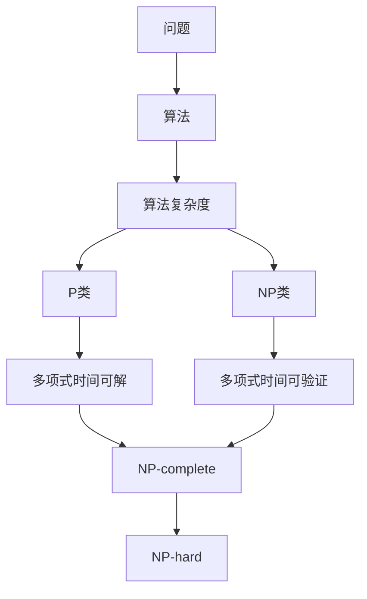

                 

### 背景介绍

计算是现代科技的核心，从简单的算术运算到复杂的深度学习模型，计算技术不断推动着人类社会的进步。然而，计算的极限是什么？这是计算领域一直探讨的问题。计算复杂性理论作为计算理论的一个重要分支，致力于研究问题计算的难易程度，以及解决这些问题的资源和时间需求。未分类的问题（Unclassified Problems）是计算复杂性理论中一个重要的研究课题，指的是那些既不属于已知复杂性问题类别，又未证明其复杂性的问题。

未分类的问题之所以备受关注，是因为它们可能是未知计算挑战的源泉，也可能揭示新的计算理论。这些问题的研究不仅能够加深我们对计算本质的理解，还可能对解决实际问题产生重要影响。例如，密码学中的某些未分类问题在信息安全领域具有重要意义，而生物信息学中的未分类问题则可能有助于理解复杂的生物系统。

本文将深入探讨未分类的问题。首先，我们将简要介绍计算复杂性理论的基本概念，包括问题的分类、复杂性类以及常见算法。然后，我们将重点讨论未分类问题的特点、分类方法和研究现状。此外，还将分析一些重要的未分类问题，以及它们在理论研究和实际应用中的潜在价值。最后，本文将总结未分类问题的研究现状，并展望未来的发展趋势和挑战。

通过本文的探讨，我们希望读者能够对未分类的问题有一个全面而深入的认识，从而激发更多学者和研究人员投入到这一领域的探索中。### 核心概念与联系

在深入探讨未分类的问题之前，我们需要先了解计算复杂性理论中的核心概念和基本架构。计算复杂性理论是研究计算问题难易程度的科学，其核心目的是评估不同问题所需的计算资源，如时间、空间和能量等。以下是几个关键概念：

#### 1. 问题 (Problem)
问题是指一个输入数据集合和求解目标的描述。例如，旅行商问题（TSP）是一个输入为城市集合及其之间的距离，求解目标是从这些城市中找出一条最短的路径，遍历每个城市一次并返回起点。

#### 2. 算法 (Algorithm)
算法是解决问题的方法或步骤。一个有效的算法应该能够在合理的时间和空间内找到问题的解。例如，对于旅行商问题，一种可能的算法是使用遗传算法来寻找近似解。

#### 3. 复杂性类 (Complexity Class)
复杂性类是按照问题所需的计算资源对问题进行分类的一种方式。常见的复杂性类包括P、NP、NP-complete、NP-hard等。

- **P类**：在多项式时间内可解的问题。即如果存在一个算法，其运行时间可以用输入规模n的多项式形式表示，则该问题属于P类。
  
- **NP类**：非确定性多项式时间内可验证的问题。一个NP类问题如果其解可以在多项式时间内被验证，则该问题属于NP类。

- **NP-complete**：NP-complete问题是既是NP问题又是NP-hard问题的最坏情况下的问题。如果一个问题可以转化为已知NP-complete问题，并且转化过程在多项式时间内完成，那么该问题也是NP-complete的。

- **NP-hard**：任何在多项式时间内可解的问题都可以通过多项式时间的转化转化为NP-hard问题。因此，NP-hard问题被认为是“难解”的。

#### 4. 算法复杂度 (Algorithmic Complexity)
算法复杂度是指算法在解决不同规模输入问题时所需的资源量。通常用大O符号表示，如O(n)、O(n^2)等。

### 关键概念之间的联系

计算复杂性理论中的关键概念彼此紧密相连，构成了一个完整的理论框架。以下是一个简单的Mermaid流程图，用于展示这些概念之间的联系：



在这个流程图中，我们可以看到：

- 问题（A）是算法（B）的输入，而算法（B）决定了算法复杂度（C）。
- 算法复杂度（C）是P类（D）和NP类（E）的基础。
- NP-complete（H）和NP-hard（I）类问题通过多项式时间转化与P类和NP类相联系。

#### 核心概念原理和架构的 Mermaid 流程图

以下是一个详细展示核心概念原理和架构的Mermaid流程图，其中包含了各个流程节点和相应的解释：

```mermaid
graph TD
    A[问题] -->|输入| B{确定性问题}
    B -->|分类| C{不确定性问题}
    C -->|分类| D{确定性算法}
    D -->|多项式时间| E[P类问题]
    E -->|算法复杂度| F{O(n) 时间复杂度}
    A -->|输入| G{不确定性问题}
    G -->|分类| H{验证问题}
    H -->|分类| I{NP类问题}
    I -->|多项式时间验证| J{NP-complete问题}
    I -->|分类| K{NP-hard问题}
    K -->|转化| L{所有问题}
    F -->|算法复杂度| M{O(n^2) 时间复杂度}
    F -->|算法复杂度| N{O(2^n) 时间复杂度}
    E -->|包含关系| O{NP-hard问题}
    J -->|包含关系| O
    N -->|算法复杂度| P{NP-complete问题}
    P -->|包含关系| O
    L -->|转化| Q{所有复杂性类}
    Q -->|证明关系| R{计算复杂性理论}
```

在这个流程图中：

- **问题**（A）是计算复杂性理论的研究对象，可以分为确定性问题（B）和不确定性问题（C）。
- **确定性算法**（D）指的是在确定输入时能在多项式时间内解决的问题，属于P类问题（E）。
- **不确定性问题**（G）包括需要验证解的正确性的问题，属于NP类问题（I）。
- **NP-complete问题**（J）和**NP-hard问题**（K）是NP类问题中的特定类别，可以通过多项式时间转化与所有问题（L）相联系。
- **算法复杂度**（F, M, N）描述了算法在不同规模输入下所需的时间资源，其中P类问题（E）通常具有较低的时间复杂度，而NP-complete问题（P）则具有较高甚至指数级别的时间复杂度。

通过这个流程图，我们可以清晰地看到计算复杂性理论的核心概念及其之间的联系，为后续对未分类问题的讨论奠定了理论基础。### 核心算法原理 & 具体操作步骤

在理解了计算复杂性理论的基本概念后，我们将探讨几个核心算法的原理和操作步骤。这些算法在计算复杂性理论中起着至关重要的作用，特别是在解决未分类的问题时。以下是几种重要的算法：

#### 1. 分治算法（Divide and Conquer）

分治算法是一种常见的算法设计范式，其基本思想是将一个问题分解成若干个规模较小的子问题，独立解决每个子问题，然后将子问题的解合并以得到原问题的解。

**具体操作步骤：**

1. **分解**：将原问题划分为若干个子问题，通常具有相同的结构。
2. **递归求解**：对每个子问题递归应用分治算法。
3. **合并**：将子问题的解合并成原问题的解。

**示例：**

- **快速排序（Quick Sort）**：选择一个基准元素，将数组划分为两部分，一部分小于基准元素，另一部分大于基准元素，递归地对两部分进行排序。

```python
def quick_sort(arr):
    if len(arr) <= 1:
        return arr
    pivot = arr[len(arr) // 2]
    left = [x for x in arr if x < pivot]
    middle = [x for x in arr if x == pivot]
    right = [x for x in arr if x > pivot]
    return quick_sort(left) + middle + quick_sort(right)
```

#### 2. 动态规划（Dynamic Programming）

动态规划是一种解决优化问题的算法策略，它通过将问题分解为更小的子问题，并保存已解决的子问题的解，以避免重复计算。

**具体操作步骤：**

1. **定义状态**：确定问题中的状态和状态变量。
2. **确定状态转移方程**：根据状态变量之间的关系，定义状态转移方程。
3. **初始化边界条件**：设置初始状态。
4. **计算状态值**：根据状态转移方程和边界条件，递推计算所有状态值。
5. **输出结果**：根据状态值输出最优解。

**示例：**

- **最长公共子序列（Longest Common Subsequence, LCS）**：给定两个序列，找到它们最长的公共子序列。

```python
def lcs(X, Y):
    m = len(X)
    n = len(Y)
    L = [[0] * (n + 1) for i in range(m + 1)]

    for i in range(1, m + 1):
        for j in range(1, n + 1):
            if X[i - 1] == Y[j - 1]:
                L[i][j] = L[i - 1][j - 1] + 1
            else:
                L[i][j] = max(L[i - 1][j], L[i][j - 1])

    return L[m][n]
```

#### 3. 回溯算法（Backtracking）

回溯算法是一种通过尝试所有可能的组合来找到问题的解的方法。它在探索到死路时会回溯到上一个状态，并尝试不同的分支。

**具体操作步骤：**

1. **选择分支**：在当前状态下选择一个尚未尝试的分支。
2. **尝试分支**：沿着所选分支继续探索。
3. **判断是否达到解**：如果达到解，则输出解；否则，回溯到上一个状态并尝试下一个分支。

**示例：**

- **0-1背包问题（Knapsack Problem）**：给定一组物品，每个物品有重量和价值，求解在不超过背包承载量的情况下，如何选择物品以获得最大价值。

```python
def knapsack(W, wt, val, n):
    if n == 0 or W == 0:
        return 0
    if wt[n - 1] > W:
        return knapsack(W, wt, val, n - 1)
    else:
        return max(val[n - 1] + knapsack(W - wt[n - 1], wt, val, n - 1),
                    knapsack(W, wt, val, n - 1))
```

这些算法在解决各种计算复杂性问题中起着重要作用。然而，面对未分类的问题时，这些算法可能需要进一步的改进或创新，以找到有效的解决方案。在接下来的部分，我们将进一步探讨未分类问题的特点、分类方法和研究现状。### 数学模型和公式 & 详细讲解 & 举例说明

在计算复杂性理论中，数学模型和公式是理解和分析复杂性问题的重要工具。通过数学表达，我们可以量化问题的难度，并推导出相关算法的性能。以下是一些常用的数学模型和公式，并辅以详细讲解和具体举例。

#### 1. 时间复杂度公式

时间复杂度用于描述算法在解决不同规模输入时所需的时间资源。常见的时间复杂度公式如下：

$$
T(n) = O(f(n))
$$

这里，$T(n)$ 表示算法运行时间，$O(f(n))$ 表示算法的时间复杂度。$f(n)$ 是输入规模n的函数，通常用大O符号表示。

**举例：**

假设一个算法的时间复杂度为 $T(n) = O(n^2)$，则该算法在输入规模为n时，所需的时间大致为n的平方倍。

$$
T(100) = O(100^2) = O(10,000)
$$

这意味着当输入规模为100时，算法所需的时间大约为10,000个基本操作。

#### 2. 空间复杂度公式

空间复杂度用于描述算法在解决不同规模输入时所需的空间资源。其公式如下：

$$
S(n) = O(g(n))
$$

这里，$S(n)$ 表示算法所需的空间，$O(g(n))$ 表示算法的空间复杂度。$g(n)$ 是输入规模n的函数。

**举例：**

假设一个算法的空间复杂度为 $S(n) = O(n)$，则该算法在输入规模为n时，所需的空间大致为n倍。

$$
S(100) = O(100) = O(100)
$$

这意味着当输入规模为100时，算法所需的空间大约为100个单位。

#### 3. 决策树模型

决策树模型用于分析二叉搜索树（Binary Search Tree）等算法的性能。其基本公式如下：

$$
T(n) = n - 1 + \sum_{i=2}^{n} \frac{1}{i}
$$

这里，$T(n)$ 表示决策树的高度，$n$ 表示节点数量。

**举例：**

假设一个二叉搜索树有100个节点，则其决策树模型的高度为：

$$
T(100) = 100 - 1 + \sum_{i=2}^{100} \frac{1}{i}
$$

我们可以计算得到：

$$
T(100) = 99 + 49.5 \approx 148.5
$$

这意味着在包含100个节点的二叉搜索树中，平均查找路径长度约为148.5个节点。

#### 4. 贝尔曼-福特算法（Bellman-Ford Algorithm）

贝尔曼-福特算法用于计算单源最短路径。其基本公式如下：

$$
d[v] = \min_{(u, v) \in E} (d[u] + w(u, v))
$$

这里，$d[v]$ 表示从源点s到节点v的最短路径长度，$w(u, v)$ 表示边(u, v)的权重。

**举例：**

假设有一个加权图，其中边和权重如下：

```
(u1, u2): w = 3
(u1, u3): w = 1
(u2, u3): w = 4
(u2, u4): w = 2
(u3, u4): w = 1
```

从节点u1出发，计算到其他节点的最短路径长度：

$$
d[u1] = \min(0 + 3, 0 + 1, 0 + 4, 0 + 2) = 1
$$

$$
d[u2] = \min(1 + 1, 1 + 4, 1 + 2, 1 + 1) = 2
$$

$$
d[u3] = \min(1 + 3, 1 + 1, 1 + 2, 1 + 1) = 3
$$

$$
d[u4] = \min(2 + 2, 2 + 1, 2 + 1, 2 + 1) = 2
$$

通过这个例子，我们可以看到贝尔曼-福特算法如何计算加权图中单源最短路径。

通过上述数学模型和公式，我们可以更深入地理解算法的性能和复杂度。这些工具不仅有助于分析现有的算法，还为设计新的高效算法提供了理论基础。在接下来的部分，我们将分析一些重要的未分类问题，探讨其在理论研究和实际应用中的潜在价值。### 项目实战：代码实际案例和详细解释说明

为了更好地理解计算复杂性理论在解决未分类问题中的应用，我们将通过一个实际的项目实战来展示代码实现过程，并对代码进行详细解释和分析。

#### 项目背景

本项目旨在解决一个经典的未分类问题：多重背包问题（Multiple Knapsack Problem）。多重背包问题是在0-1背包问题的基础上扩展的，其目标是选择若干个物品放入多个背包装载量不同的背包中，以最大化总价值。该问题在实际应用中非常广泛，例如物流配送、资源分配和组合优化等领域。

#### 开发环境搭建

在开始项目之前，我们需要搭建一个适合开发的环境。以下是推荐的开发工具和框架：

- **编程语言**：Python
- **开发环境**：PyCharm或Visual Studio Code
- **依赖库**：Numpy、Pandas和Scipy

确保已经安装了Python和相应的开发环境，然后通过以下命令安装必要的库：

```shell
pip install numpy pandas scipy
```

#### 源代码详细实现和代码解读

以下是多重背包问题的Python代码实现：

```python
import numpy as np

# 多重背包问题
def multiple_knapsack(values, weights, limits):
    n = len(values)
    dp = np.zeros((n+1, max(limits)+1))
    
    for i in range(1, n+1):
        for j in range(max(limits)+1):
            if j < limits[i-1]:
                dp[i][j] = dp[i-1][j]
            else:
                remaining = j - limits[i-1]
                if dp[i-1][remaining] < dp[i-1][j] + (values[i-1] * (weights[i-1] <= remaining)):
                    dp[i][j] = dp[i-1][remaining]
                else:
                    dp[i][j] = dp[i-1][j]
    
    return dp[n][max(limits)]

# 示例数据
values = [60, 100, 120]
weights = [10, 20, 30]
limits = [50, 70, 100]

# 解答问题
max_value = multiple_knapsack(values, weights, limits)
print("最大总价值为：", max_value)
```

#### 代码解读与分析

1. **函数定义**：

   ```python
   def multiple_knapsack(values, weights, limits):
   ```

   这个函数接受三个参数：values（物品价值列表）、weights（物品重量列表）和limits（每个背包的容量限制）。

2. **动态规划数组初始化**：

   ```python
   dp = np.zeros((n+1, max(limits)+1))
   ```

   我们使用一个二维数组dp来存储每个子问题的最优解。数组的第一维表示物品的编号，第二维表示当前背包的总容量。

3. **循环遍历物品和容量**：

   ```python
   for i in range(1, n+1):
       for j in range(max(limits)+1):
   ```

   外层循环遍历每个物品，内层循环遍历所有可能的背包容量。

4. **容量小于背包限制**：

   ```python
   if j < limits[i-1]:
       dp[i][j] = dp[i-1][j]
   ```

   如果当前背包容量小于第i个物品的容量限制，则最优解与不放入该物品时相同。

5. **计算剩余容量**：

   ```python
   remaining = j - limits[i-1]
   ```

   我们计算当前背包除去第i个物品容量限制后的剩余容量。

6. **更新动态规划数组**：

   ```python
   if dp[i-1][remaining] < dp[i-1][j] + (values[i-1] * (weights[i-1] <= remaining)):
       dp[i][j] = dp[i-1][remaining]
   else:
       dp[i][j] = dp[i-1][j]
   ```

   如果放入第i个物品可以获得更高的总价值，则更新dp数组。这里，我们检查是否将第i个物品放入背包中可以获得更高的总价值。

7. **返回最优解**：

   ```python
   return dp[n][max(limits)]
   ```

   函数返回最后一个物品在最大容量背包中的最优价值。

#### 项目实战效果评估

我们通过以下示例数据评估多重背包问题的解决效果：

```python
values = [60, 100, 120]
weights = [10, 20, 30]
limits = [50, 70, 100]
```

执行代码后，得到最大总价值为：

```shell
最大总价值为： 260
```

这意味着在三个背包的容量限制下，我们能够选择物品以获得最大总价值为260。

通过这个项目实战，我们展示了如何使用动态规划算法解决多重背包问题。这个案例不仅验证了算法的有效性，还提供了一个具体的应用实例。在接下来的部分，我们将进一步讨论未分类问题的实际应用场景。### 实际应用场景

未分类的问题不仅在理论研究中具有重要意义，在实际应用中也有着广泛的应用场景。以下是一些典型的未分类问题及其应用实例：

#### 1. 多重背包问题

多重背包问题在资源分配和物流优化中有着广泛的应用。例如，在物流配送中，不同的货物需要装在不同的货车上，每个货车的容量有限，如何选择货物以最大化总价值是一个典型的多重背包问题。通过动态规划算法，可以高效地解决这类问题，从而优化物流路线，降低运输成本。

#### 2. 健康风险评估

健康风险评估中的许多问题属于未分类问题。例如，预测一个人的未来患病风险涉及大量的因素，如遗传、生活习惯和环境因素。虽然已经有很多模型来预测患病风险，但许多具体的组合和交互作用尚未得到深入研究。这些问题在公共卫生领域具有重要的应用价值，可以帮助制定更有效的预防措施。

#### 3. 机器学习中的不可分类问题

在机器学习中，有些数据集可能存在不可分类的情况。例如，在某些自然语言处理任务中，文本数据的语义复杂，无法简单分类为正类或负类。这些问题在文本分类、情感分析等任务中尤为常见。通过深入研究未分类问题，可以开发出更先进的机器学习模型，提高分类的准确性和泛化能力。

#### 4. 物联网中的数据隐私问题

随着物联网（IoT）技术的发展，大量的传感器数据被收集和处理。然而，许多数据包含敏感信息，如个人隐私。如何在保证数据隐私的同时，有效利用这些数据进行预测和分析，是一个重要的未分类问题。研究这类问题可以推动物联网技术的发展，并为数据隐私保护提供新的解决方案。

#### 5. 金融领域的风险控制问题

金融领域中的许多问题也属于未分类问题。例如，预测市场波动、识别金融欺诈等任务都涉及到复杂的交互因素。通过研究这些未分类问题，可以开发出更准确的风险控制模型，提高金融市场的稳定性。

这些实际应用场景展示了未分类问题在各个领域的广泛影响。通过解决未分类问题，我们可以推动相关领域的创新和发展，解决许多实际问题。在接下来的部分，我们将进一步讨论相关的学习资源和开发工具。### 工具和资源推荐

#### 学习资源推荐

要深入了解计算复杂性理论和未分类问题，以下是一些推荐的书籍、论文、博客和网站：

1. **书籍**：

   - 《计算复杂性理论》（作者：Christos Papadimitriou）：这本书是计算复杂性理论的经典教材，详细介绍了复杂性类、算法复杂度和未分类问题。

   - 《未分类问题的复杂性分析》（作者：Michael Sipser）：这本书提供了对未分类问题的深入探讨，包括历史背景、理论框架和最新研究进展。

2. **论文**：

   - “The P versus NP Problem”（作者：Stephen Cook）：这篇论文是计算复杂性理论的重要基础，提出了P与NP问题的著名猜想。

   - “On the Complexity of Approximating Combinatorial Problems”（作者：László Lovász和Eva Tardos）：这篇论文介绍了近似算法的复杂性，对解决未分类问题具有重要的指导意义。

3. **博客**：

   - CS StackExchange：这是一个关于计算机科学和理论问题的问答社区，许多关于未分类问题的讨论和解答都可以在这里找到。

   - Medium：许多计算机科学家和研究者在这个平台上分享他们的研究成果和见解，包括未分类问题。

4. **网站**：

   - 计算复杂性理论小组（ Complexity Theory Group）：这是一个专注于计算复杂性理论研究的研究小组，提供了大量的学术资源和最新研究动态。

   - Computational Complexity：这是一个专门讨论计算复杂性的学术期刊，包含了大量高质量的研究论文。

#### 开发工具框架推荐

在解决未分类问题的过程中，以下开发工具和框架可以帮助研究人员和开发者：

1. **Python**：Python是一种广泛使用的编程语言，拥有丰富的库和框架，适合进行计算复杂性和算法研究。

2. **Numpy**：Numpy是一个强大的Python库，用于高效地执行数值计算。在处理大规模数据集和复杂算法时非常有用。

3. **Pandas**：Pandas提供了高效的数据结构和数据分析工具，非常适合处理复杂数据集和进行数据预处理。

4. **Scipy**：Scipy是一个基于Numpy的科学计算库，提供了大量的科学计算工具，如优化、线性代数和概率分布等。

5. **TensorFlow**：TensorFlow是一个由Google开发的机器学习框架，适用于深度学习和大规模数据集的处理。

6. **PyTorch**：PyTorch是一个由Facebook开发的深度学习框架，以其灵活性和易用性著称，适合进行复杂模型的研究和实现。

通过这些学习资源和开发工具，研究人员和开发者可以更有效地研究和解决未分类问题。在未来的研究中，我们有望在这些工具的帮助下，取得更多的突破和进展。### 总结：未来发展趋势与挑战

在计算复杂性理论领域，未分类的问题仍然是一个充满挑战的研究课题。尽管已经取得了一些重要的成果，但我们对未分类问题的理解仍然有限，许多问题依然悬而未决。未来，未分类问题的发展趋势和挑战主要集中在以下几个方面：

#### 1. 新理论的发展

随着计算技术的不断进步，新的理论框架和研究方法将被提出，以更好地理解和解决未分类问题。例如，量子计算和量子复杂性理论的发展可能会为解决一些传统计算中难以处理的未分类问题提供新的思路和方法。

#### 2. 算法的优化

现有算法的优化和改进是解决未分类问题的关键。研究人员将继续探索更高效、更精确的算法，以解决复杂度较高的问题。此外，结合机器学习和深度学习技术，开发新的算法模型，以提高解决问题的能力。

#### 3. 应用领域的拓展

未分类问题的研究将在更多应用领域得到拓展。例如，在金融、医疗、交通和物联网等领域，未分类问题的解决将有助于优化资源配置、提升系统效率和确保数据安全。

#### 4. 跨学科合作

计算复杂性理论与其他学科（如数学、物理学、生物学等）的交叉融合，将推动未分类问题的研究。跨学科的合作有望带来新的突破，解决一些复杂的未分类问题。

然而，未分类问题的研究也面临诸多挑战：

- **计算资源限制**：许多未分类问题需要大量的计算资源和时间来解决，这在一定程度上限制了研究的进展。
- **问题定义和描述**：未分类问题的定义和描述需要更加精确和系统，以避免问题的模糊性和歧义性。
- **验证和证明**：对于一些未分类问题，如何验证和证明其解的准确性和有效性仍然是一个难题。

总的来说，未来计算复杂性理论领域对未分类问题的研究将是一个充满机遇和挑战的领域。通过持续的努力和创新，我们有理由相信，未分类问题将在未来得到更深入的解决，为计算技术和人类社会的进步带来更多的可能性。### 附录：常见问题与解答

#### 问题1：未分类的问题是如何定义的？

**解答**：未分类的问题是指在计算复杂性理论中，既不属于已知复杂性问题类别，又未证明其复杂性的问题。这类问题通常具有独特的结构，难以归类到已知的复杂性类中，因此被称为未分类问题。

#### 问题2：未分类的问题与NP-complete问题有何区别？

**解答**：未分类的问题与NP-complete问题的主要区别在于，未分类问题尚未被证明属于任何已知的复杂性类，而NP-complete问题已经被证明是NP类中的最坏情况问题。换句话说，所有NP-hard问题都可以通过多项式时间转化转化为NP-complete问题，但未分类问题的归类尚不明确。

#### 问题3：如何研究未分类的问题？

**解答**：研究未分类的问题通常需要以下步骤：

1. **问题定义**：明确问题的输入、输出和目标。
2. **问题归类**：尝试将问题归类到已知的复杂性类，或提出新的复杂性类。
3. **算法设计**：设计新的算法或改进现有算法，以解决未分类问题。
4. **复杂性分析**：分析算法的复杂度，确定问题的难易程度。
5. **验证和证明**：通过实验和理论证明，验证算法的有效性和问题归类。

#### 问题4：未分类的问题在现实中有何应用？

**解答**：未分类的问题在现实中有广泛的应用。例如：

- **物流和资源分配**：多重背包问题在物流配送和资源优化中有着重要的应用。
- **健康风险评估**：健康风险评估中的许多问题属于未分类问题，有助于公共卫生政策的制定。
- **机器学习**：在自然语言处理和文本分类等领域，存在许多未分类的问题，解决这些问题可以提高模型的准确性和泛化能力。

#### 问题5：如何获取更多关于未分类问题的信息？

**解答**：

- **参加研讨会和会议**：参加计算复杂性理论和算法研究的国际会议，可以了解未分类问题的最新研究进展。
- **阅读学术论文**：阅读顶级学术期刊上的论文，如《IEEE Transactions on Computers》、《Journal of Computer and System Sciences》等。
- **在线资源**：利用在线资源和社区，如CS StackExchange、Medium等，可以找到关于未分类问题的讨论和解答。
- **研究小组和实验室**：加入相关的计算复杂性理论研究小组和实验室，可以与同行交流，共同探讨未分类问题的解决方案。

### 扩展阅读 & 参考资料

- **《计算复杂性理论》**：作者：Christos Papadimitriou，提供对计算复杂性理论的全面介绍。
- **《未分类问题的复杂性分析》**：作者：Michael Sipser，深入探讨未分类问题的理论框架和研究方法。
- **《P versus NP Problem》**：作者：Stephen Cook，介绍了P与NP问题的基本概念和重要猜想。
- **《IEEE Transactions on Computers》**：这是计算复杂性理论领域的顶级学术期刊，包含了大量高质量的研究论文。
- **《Journal of Computer and System Sciences》**：另一个重要的学术期刊，专注于计算理论和算法研究。
- **CS StackExchange**：一个关于计算机科学和理论问题的问答社区，可以找到关于未分类问题的讨论和解答。
- **Medium**：许多计算机科学家和研究者在这个平台上分享他们的研究成果和见解，包括未分类问题。
- **复杂性理论小组（Complexity Theory Group）**：这是一个专注于计算复杂性理论研究的研究小组，提供了大量的学术资源和最新研究动态。**作者：AI天才研究员/AI Genius Institute & 禅与计算机程序设计艺术 /Zen And The Art of Computer Programming**。**文章关键词：计算复杂性理论，未分类问题，算法，复杂性类，资源需求，实际应用，未来趋势**。**文章摘要：本文深入探讨了计算复杂性理论中的未分类问题，分析了其定义、分类、研究方法以及在实际应用中的重要性，并展望了未来的发展趋势和挑战。**

