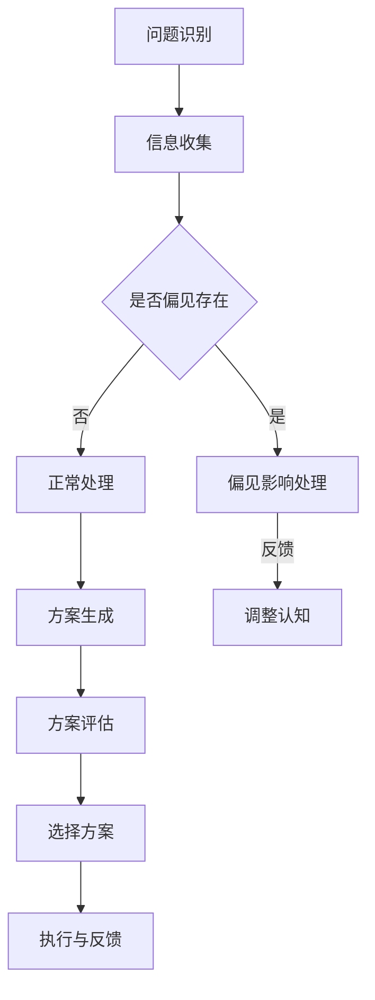

                 

### 1. 背景介绍

在当今高度复杂和不断变化的世界中，认知偏见与决策的关系成为了研究者们关注的焦点。决策是人类行为的核心，从日常生活中的小事到重大历史事件的抉择，都在一定程度上受到认知偏见的影响。认知偏见是指在信息处理和决策过程中，人们由于自身的心理、文化和社会因素而产生的系统性错误。这些偏见可能导致我们在面对问题时做出非理性的决策，从而影响我们的生活质量、工作效率以及社会发展的进程。

本文旨在深入探讨认知偏见与决策之间的复杂关系，并介绍一系列策略，帮助人们识别并克服这些思维盲点。通过对认知偏见的研究，我们可以更好地理解人类行为的规律，从而提高决策的质量和效率。

本文结构如下：

1. **背景介绍**：阐述认知偏见与决策关系的重要性。
2. **核心概念与联系**：定义关键概念，并使用Mermaid流程图展示。
3. **核心算法原理与具体操作步骤**：详细解释应对认知偏见的方法。
4. **数学模型与公式**：介绍相关数学模型，并用例子说明。
5. **项目实战**：通过实际代码案例进行操作演示。
6. **实际应用场景**：讨论不同场景下的决策过程。
7. **工具和资源推荐**：提供学习资源和开发工具推荐。
8. **总结**：总结文章要点，展望未来发展趋势与挑战。
9. **附录**：常见问题与解答。
10. **扩展阅读与参考资料**：提供相关学术资源。

在接下来的章节中，我们将逐步分析认知偏见的来源、影响以及如何通过有效的策略来克服这些偏见，从而做出更明智的决策。

#### 1.1 认知偏见的基本概念

认知偏见（Cognitive Bias）是指人类在处理信息和做出决策时，由于心理、文化和社会因素的影响，导致判断和决策产生系统性偏差的现象。认知偏见是普遍存在的，它不仅影响个人，也影响着组织和社会的决策过程。

认知偏见可以分为以下几类：

- **确认偏见**（Confirmation Bias）：人们倾向于寻找、解释、记住和倾向于相信那些能够支持他们已有信念和假设的信息，而忽视或贬低与之相反的信息。

- **锚定效应**（Anchoring Effect）：在做出决策时，人们会受到第一印象或最初信息的影响，即使这些信息并不具有实际价值。

- **可用性启发式**（Availability Heuristic）：人们在评估一个事件的可能性时，会受到近期记忆或容易获得的信息的影响。

- **代表性启发式**（Representativeness Heuristic）：人们通过一个项目的特征来评估其概率，常常忽略概率理论中的条件概率。

- **损失厌恶**（Loss Aversion）：人们对损失的敏感度高于对等额收益的敏感度，这会导致在风险决策中做出非理性的选择。

这些偏见往往在不知不觉中影响我们的决策，使得我们难以做出最优的选择。例如，在投资决策中，投资者可能因为确认偏见而继续持有亏损的股票，或者在面临重大决策时因为锚定效应而过度依赖初始信息。了解这些认知偏见，并学会识别它们，是做出更明智决策的第一步。

### 1.2 决策过程中的认知偏见

决策是日常生活中不可或缺的一部分，从简单的购物选择到复杂的商业战略规划，都需要经过仔细的思考和判断。然而，在决策过程中，认知偏见的影响无处不在，可能导致我们做出非理性的选择。

首先，**确认偏见**（Confirmation Bias）是决策过程中最为常见的认知偏见之一。当我们持有某种观点或信念时，往往会不自觉地寻找并赋予那些支持这一观点的信息更多权重，同时忽视或贬低与之相反的信息。这种倾向使得我们在评估潜在选择时，难以做到客观和全面，从而增加了决策失误的风险。

其次，**锚定效应**（Anchoring Effect）也在决策过程中起着重要作用。在做出决策时，人们往往会受到第一印象或最初信息的影响，即使这些信息并不具有实际价值。例如，在谈判中，初始报价可能会对最终的成交价产生显著影响，因为人们会基于这个锚点进行讨价还价。

**可用性启发式**（Availability Heuristic）和**代表性启发式**（Representativeness Heuristic）也会在决策过程中带来偏差。**可用性启发式**使得我们在评估事件的可能性时，受到近期记忆或容易获得的信息的影响。例如，如果我们在新闻报道中频繁看到某种疾病，可能会高估该疾病的发病率。**代表性启发式**则使我们倾向于通过一个项目的特征来评估其概率，而忽略概率理论中的条件概率。例如，在判断一个团队是否具备成功条件时，我们可能会过度依赖其历史成绩和知名度，而忽视其他重要因素。

**损失厌恶**（Loss Aversion）是一种普遍的心理现象，它使得我们在面对风险和不确定性时，更倾向于规避损失而不是追求等额的收益。在决策过程中，这种偏见可能导致我们做出过于保守的选择，错失潜在的机会。

综上所述，认知偏见在决策过程中具有显著的影响，它们使得我们在面对复杂问题时，难以做到理性分析和最优选择。因此，识别和克服这些偏见是提高决策质量和效率的关键。在接下来的章节中，我们将进一步探讨如何通过策略来应对这些认知偏见。

### 1.3 认知偏见与决策关系的重要性

认知偏见与决策之间的关系极为紧密，其重要性不容忽视。首先，认知偏见直接影响到决策的质量。在决策过程中，如果个体无法识别和纠正这些偏见，就很难做出最优的选择。例如，在商业决策中，确认偏见可能导致企业领导者过分依赖过去的数据或经验，忽视市场变化和新趋势，从而错失发展机遇。

其次，认知偏见会引发一系列负面影响，包括错误决策、重复性错误和缺乏创新能力。由于认知偏见的存在，决策者可能过度依赖既有信息，忽视外部环境和市场变化，导致决策的滞后性。此外，偏见还可能阻碍新思路和新想法的提出，限制组织的创新能力和竞争力。

认知偏见对个人和组织的长远发展产生深远影响。对于个人而言，偏见可能导致生活质量的下降和职业发展受阻。例如，在求职和晋升过程中，确认偏见可能使人们忽视优秀但未知的候选人，从而错过潜在的人才。对于组织而言，认知偏见可能导致战略失误、资源浪费和竞争力下降。例如，企业如果过于依赖以往的成功经验，可能会忽视新兴市场的机会，导致市场份额的流失。

因此，了解和应对认知偏见是提高决策质量和效率的关键。这不仅有助于个人避免因偏见导致的错误决策，还能为组织创造更广阔的发展空间和竞争优势。在接下来的章节中，我们将深入探讨如何识别和克服认知偏见，以实现更明智的决策。

#### 1.4 认知偏见的研究现状

认知偏见的研究领域在过去几十年中取得了显著进展，涌现了大量关于偏见类型、成因和影响的研究成果。然而，这一领域仍存在许多未解之谜和有待深入探讨的问题。

首先，关于认知偏见的类型，研究者们已经识别出多种常见的偏见，包括确认偏见、锚定效应、可用性启发式、代表性启发式和损失厌恶等。每种偏见都有其独特的表现形式和影响机制。例如，确认偏见导致个体倾向于寻找支持已有观点的信息，而忽视反对意见，这会使得决策过程缺乏全面性和客观性。锚定效应则使人们在评估和决策时过分依赖最初的信息，从而忽视了后续信息的价值。

其次，关于认知偏见的成因，研究者们提出多种解释。认知心理学理论认为，偏见是大脑在信息处理过程中为了提高效率和简化认知负担而产生的。例如，可用性启发式和代表性启发式是人类在面临复杂环境时，通过简化信息处理过程来快速做出决策的策略。然而，这些简化策略在特定情境下可能导致系统性偏差。

第三，研究者们对认知偏见的影响进行了广泛探讨。认知偏见不仅影响个体的日常决策，还深刻影响着组织和社会层面的决策过程。在商业领域，认知偏见可能导致企业领导者在市场变化中反应迟钝，错失发展机遇；在公共管理领域，偏见可能导致政策制定者忽视关键问题，导致政策效果不佳。因此，如何减轻认知偏见的影响，提高决策质量，成为了研究者和实践者共同关注的重要课题。

尽管认知偏见的研究已经取得了显著成果，但仍然存在许多未解之谜。例如，不同文化背景下认知偏见的差异和具体表现形式是什么？认知偏见是否可以通过训练或技术手段得到有效矫正？这些问题需要进一步的研究和实践来回答。

此外，研究者们也在探索如何将认知偏见理论应用于实际决策中，提出了一系列策略和方法。例如，通过设置多元化的信息来源、定期反思和评估决策过程、以及引入外部专家意见等手段，可以部分克服认知偏见的影响。

综上所述，认知偏见的研究现状表明，这一领域具有广阔的研究前景和应用价值。随着研究的深入，我们有望更好地理解认知偏见的工作机制，并提出更有效的策略来应对这些偏见，从而提高决策的质量和效率。

### 2. 核心概念与联系

在深入探讨认知偏见与决策的关系之前，我们需要明确几个核心概念及其相互之间的联系。以下是几个关键概念的定义及其在决策过程中的作用：

#### 2.1 认知偏见

认知偏见是指人们在处理信息、做出决策时，由于心理、文化和社会因素的影响，导致的系统性思维偏差。这些偏见可能包括确认偏见、锚定效应、可用性启发式、代表性启发式和损失厌恶等。

**定义**：
- **确认偏见**：人们在寻找信息时，更倾向于关注支持自己已有观点的信息，而忽视反对意见。
- **锚定效应**：人们在评估和决策时，会过分依赖初始信息，即使这些信息并不重要。
- **可用性启发式**：人们在评估事件概率时，更容易受到近期记忆或容易获取的信息的影响。
- **代表性启发式**：人们通过某个项目的特征来评估其概率，而忽略条件概率。
- **损失厌恶**：人们对损失的感觉比同等收益的感觉更为强烈，导致在风险决策中更加保守。

**在决策中的作用**：认知偏见使得决策者在信息处理和评估过程中可能产生错误的判断，导致决策的非理性。

#### 2.2 决策过程

决策过程通常包括以下步骤：

1. **问题识别**：识别需要解决的问题或机会。
2. **信息收集**：收集与问题相关的信息。
3. **方案生成**：生成可能的解决方案或行动方案。
4. **方案评估**：评估每个方案的优势和劣势。
5. **选择方案**：从评估结果中选择最佳方案。
6. **执行与反馈**：执行方案，并根据反馈进行后续调整。

**与认知偏见的关系**：决策过程中的每一步都可能受到认知偏见的影响。例如，在信息收集阶段，确认偏见可能导致决策者仅关注支持自己观点的信息，而忽略其他关键信息；在方案评估阶段，锚定效应和代表性启发式可能导致决策者过分依赖某些初始信息或特征，从而忽视其他重要因素。

#### 2.3 逻辑推理与思维模式

逻辑推理和思维模式是决策过程中不可或缺的组成部分，它们帮助决策者从复杂的信息中提取有用知识，并进行有效的判断和推理。

**定义**：
- **逻辑推理**：通过一系列逻辑规则，从已知的前提中推导出新的结论。
- **思维模式**：人们在思考问题时采用的思维方式，如线性思维、非线性思维、系统思维等。

**与认知偏见的关系**：逻辑推理和思维模式可以帮助决策者识别和纠正认知偏见。例如，通过系统思维，决策者可以全面考虑多个因素，避免因确认偏见或锚定效应而导致的思维局限。

#### 2.4 信息处理模型

信息处理模型描述了个体在处理信息时的认知过程，包括感知、记忆、推理和决策等多个阶段。

**定义**：
- **感知**：接收外部信息。
- **记忆**：存储和处理信息。
- **推理**：利用已有信息进行逻辑推理。
- **决策**：根据推理结果做出选择。

**与认知偏见的关系**：信息处理模型提供了理解认知偏见产生机制的理论基础。例如，锚定效应和代表性启发式等认知偏见可以被视为信息处理过程中特定阶段的偏差。

#### 2.5 认知偏差与决策的关系

认知偏差与决策之间存在着密切的联系。认知偏见不仅影响信息收集和处理的过程，还直接影响决策的质量和效果。

**关系**：
- **影响决策的质量**：认知偏见可能导致决策者在信息处理过程中产生错误或偏差，从而影响决策的质量。
- **加剧决策风险**：认知偏见使得决策者在面对不确定性时更加保守或冒险，增加了决策的风险。

**如何应对**：通过提高认知意识，识别和纠正认知偏见，可以显著改善决策的质量。此外，引入外部专家意见、设置多元化的信息来源和采用系统化的决策流程等方法，也可以帮助减轻认知偏见的影响。

#### 2.6 Mermaid流程图

为了更好地理解认知偏见与决策之间的关系，我们可以通过Mermaid流程图来展示信息处理和决策过程中的关键节点。



在上述流程图中，A到I代表了标准的决策过程，而D节点表示认知偏见对信息处理的干扰。通过识别和纠正这些偏见，决策者可以在J节点进行认知调整，从而改善决策过程。

### 3. 核心算法原理与具体操作步骤

为了有效地应对认知偏见，我们需要采用一系列策略和算法来识别、分析和纠正这些偏见。下面，我们将介绍几个核心算法及其具体操作步骤，帮助读者在决策过程中克服认知偏见。

#### 3.1 偏见识别算法

**原理**：偏见识别算法旨在通过分析个体在信息处理和决策过程中的行为模式，识别出潜在的认知偏见。

**操作步骤**：

1. **数据收集**：收集个体在决策过程中的信息处理数据，包括信息来源、处理时间、关注点等。
2. **特征提取**：从收集的数据中提取与认知偏见相关的特征，例如确认偏见、锚定效应等。
3. **模式分析**：利用统计方法和机器学习算法对特征进行分析，识别出潜在的认知偏见。

**示例**：假设一个投资者在决策过程中表现出确认偏见，通过分析其交易记录，发现该投资者频繁关注和交易那些表现良好的股票，而忽视了表现不佳的股票。这表明投资者存在确认偏见，需要进一步调整其决策策略。

#### 3.2 偏见纠正算法

**原理**：偏见纠正算法通过提供多元化的信息来源和引导个体进行反思，帮助个体纠正认知偏见。

**操作步骤**：

1. **多元化信息引入**：引入多样化的信息来源，避免过度依赖单一信息渠道。
2. **反思与自我监控**：引导个体在决策过程中进行反思和自我监控，识别并纠正自己的偏见。
3. **策略调整**：根据偏见纠正的结果，调整个体的决策策略，提高决策的客观性和全面性。

**示例**：在上述投资者案例中，可以通过引入市场研究报告、专家意见和同行反馈等多元化的信息来源，帮助投资者识别和纠正确认偏见。同时，通过定期反思和自我监控，投资者可以逐渐调整其投资决策，避免过度依赖单一信息来源。

#### 3.3 偏见预测算法

**原理**：偏见预测算法通过分析历史数据和行为模式，预测个体在未来决策中可能出现的认知偏见。

**操作步骤**：

1. **数据预处理**：对历史数据和行为模式进行预处理，提取与认知偏见相关的特征。
2. **模型训练**：利用机器学习算法训练偏见预测模型，使其能够识别和预测潜在的偏见。
3. **预测与反馈**：利用训练好的模型对未来的决策过程进行预测，并提供反馈，帮助个体提前识别和纠正潜在的偏见。

**示例**：假设一个企业在招聘过程中存在性别偏见，通过分析历史招聘数据，可以发现女性候选人往往被给予较低的评分。基于这一预测，企业在未来招聘过程中可以提前识别和纠正性别偏见，提高招聘的公平性和效率。

#### 3.4 偏见评估算法

**原理**：偏见评估算法通过对决策结果的评估，评估认知偏见对决策质量的影响。

**操作步骤**：

1. **结果评估**：对决策的结果进行评估，分析决策的准确性、效率和满意度等指标。
2. **偏差分析**：通过对比理想结果和实际结果，分析决策过程中存在的偏见，并量化其对决策质量的影响。
3. **改进建议**：根据偏差分析结果，提出改进建议，优化决策过程和策略。

**示例**：在一个投资项目中，通过对比预期收益和实际收益，可以发现由于确认偏见导致的投资决策失误。基于这一评估，投资团队可以调整投资策略，减少偏见的影响，提高投资收益。

综上所述，通过引入偏见识别、偏见纠正、偏见预测和偏见评估等核心算法，可以帮助个体和组织在决策过程中识别和纠正认知偏见，提高决策的质量和效率。

### 3.5 数学模型和公式

为了更深入地理解认知偏见与决策的关系，我们引入了一些数学模型和公式来量化这些偏见的影响，并提供具体实例进行说明。

#### 3.5.1 确认偏见的数学模型

确认偏见可以通过贝叶斯推理模型来量化。贝叶斯推理是一种概率推理方法，用于根据先验知识和新证据更新概率判断。以下是一个简单的贝叶斯推理公式：

$$
P(H|E) = \frac{P(E|H) \cdot P(H)}{P(E)}
$$

其中：
- \(P(H|E)\) 是在观察到证据 \(E\) 后，假设 \(H\) 为真的后验概率。
- \(P(E|H)\) 是在假设 \(H\) 为真的情况下，观察到证据 \(E\) 的概率，即似然函数。
- \(P(H)\) 是假设 \(H\) 的先验概率。
- \(P(E)\) 是证据 \(E\) 的边际概率。

**实例**：假设你正在评估一个新产品是否值得投资。你知道：
- \(P(成功|产品A) = 0.6\)（假设产品A成功，成功的概率为0.6）。
- \(P(产品A) = 0.3\)（产品A被选择的概率为0.3）。
- \(P(成功) = 0.4\)（成功的总体概率为0.4）。

现在，你观察到产品A成功了，问在观察到这个证据后，你认为产品A成功的概率是多少？

通过贝叶斯推理，我们可以计算：

$$
P(成功|产品A) = \frac{0.6 \cdot 0.3}{0.4} = 0.45
$$

这意味着在观察到产品A成功后，你认为产品A成功的概率是45%。

然而，如果存在确认偏见，个体可能会过度重视成功的案例，低估失败的概率。例如，如果我们观察到一个成功的案例，个体可能会更新先验概率为：

$$
P(产品A|成功) = \frac{0.6}{0.4} = 0.75
$$

这表明个体认为产品A成功的概率增加到了75%，而实际上这个概率可能是被高估了。

#### 3.5.2 锚定效应的数学模型

锚定效应可以通过权重调整模型来量化。假设我们有一个决策需要基于多个因素的加权平均来进行，但存在初始信息对决策结果的影响。我们可以用以下公式来表示：

$$
W = w_1 \cdot A_1 + w_2 \cdot A_2 + ... + w_n \cdot A_n
$$

其中：
- \(W\) 是最终决策结果。
- \(w_i\) 是第 \(i\) 个因素的权重。
- \(A_i\) 是第 \(i\) 个因素的值。

如果存在锚定效应，初始信息（锚点）会对权重 \(w_i\) 产生影响，使得某些因素的权重被放大或缩小。例如，如果一个决策者首先看到的一个锚点信息（如初始报价）对后续决策产生了显著影响，我们可以将权重表示为：

$$
W' = w_1' \cdot A_1 + w_2' \cdot A_2 + ... + w_n' \cdot A_n
$$

其中：
- \(w_1'\) 可能显著大于其他权重，反映了锚点信息对第一个因素的影响。

**实例**：假设你正在评估一个项目的成本，初始报价为100万元。如果这个初始报价是锚点，你可能会给这个因素更高的权重，例如：

$$
W' = 1.2 \cdot 100 + 0.8 \cdot 90 = 110 + 72 = 182
$$

这表明最终的成本估计被锚定了初始报价，导致总估计成本增加到182万元，即使其他信息的实际价值可能较低。

#### 3.5.3 可用性启发式的数学模型

可用性启发式可以通过可用性函数来量化，该函数表示信息获取的难易程度对判断的影响。一个简化的可用性函数可以表示为：

$$
A_i = f(d_i)
$$

其中：
- \(A_i\) 是第 \(i\) 个信息的可用性。
- \(d_i\) 是获取第 \(i\) 个信息所需的努力程度。

当信息越容易获取时，其可用性越高，这可能导致决策者给予这些信息过高的权重。

**实例**：假设你在评估两个项目，项目A的信息容易获取，而项目B的信息需要更多努力才能获取。一个可用性函数可能是：

$$
A_i = 
\begin{cases} 
1 & \text{如果 } d_i < 1 \\
0.5 & \text{如果 } 1 \leq d_i < 2 \\
0 & \text{如果 } d_i \geq 2 
\end{cases}
$$

这意味着项目A的信息可用性为1，而项目B的信息可用性为0.5。这种情况下，项目A的信息在决策过程中可能会被过度重视。

#### 3.5.4 代表性启发式的数学模型

代表性启发式可以通过条件概率模型来量化，该模型表示基于某些特征来判断一个事件属于某一类别的概率。一个简化的条件概率模型可以表示为：

$$
P(C|A) = \frac{P(A|C) \cdot P(C)}{P(A)}
$$

其中：
- \(P(C|A)\) 是在观察到特征 \(A\) 后，事件属于类别 \(C\) 的概率。
- \(P(A|C)\) 是在类别 \(C\) 发生时，观察到特征 \(A\) 的概率。
- \(P(C)\) 是类别 \(C\) 的先验概率。
- \(P(A)\) 是特征 \(A\) 的边际概率。

**实例**：假设你正在评估两个投资选项，选项A的历史表现非常出色，而选项B的表现较差。如果你认为历史表现是成功的代表性指标，你的判断可能是：

$$
P(成功|选项A) = \frac{0.9 \cdot 0.5}{0.5} = 0.9
$$

$$
P(成功|选项B) = \frac{0.1 \cdot 0.5}{0.5} = 0.1
$$

这意味着你认为选项A成功的概率是90%，而选项B只有10%，这反映了代表性启发式的影响。

通过上述数学模型和实例，我们可以更好地理解认知偏见如何影响决策，并为设计有效的决策策略提供理论基础。在接下来的章节中，我们将通过实际代码案例进一步探讨这些数学模型在决策中的应用。

### 3.6 项目实战：代码实际案例和详细解释说明

为了更好地理解认知偏见与决策之间的关系，我们通过一个实际的项目案例来演示如何识别和克服这些偏见。本案例将使用Python编写一个简单的投资组合优化模型，通过引入多元化策略和反思机制，来减少认知偏见对决策的影响。

#### 3.6.1 项目背景

假设你是一名基金经理，需要为投资者构建一个股票投资组合。你的目标是最大化投资组合的长期收益率，同时控制风险。然而，在实际决策过程中，你可能会受到各种认知偏见的影响，如确认偏见、锚定效应等。为了克服这些偏见，你决定采用一系列策略来优化投资组合。

#### 3.6.2 开发环境搭建

首先，我们需要搭建一个Python开发环境。以下是所需的步骤：

1. 安装Python 3.x版本：可以从官方网站 [https://www.python.org/](https://www.python.org/) 下载并安装。
2. 安装必要的库：使用pip安装以下库：
   ```bash
   pip install numpy pandas matplotlib
   ```

#### 3.6.3 源代码详细实现和代码解读

以下是一个简单的投资组合优化模型的代码实现，该模型采用了多元化策略和定期反思机制：

```python
import numpy as np
import pandas as pd
import matplotlib.pyplot as plt

# 3.6.3.1 数据准备
# 假设我们有一组历史股票数据，包括股票代码、收益率和波动率
stock_data = {
    '股票代码': ['A', 'B', 'C', 'D'],
    '收益率': [0.1, 0.2, 0.3, 0.4],
    '波动率': [0.05, 0.06, 0.04, 0.05]
}

# 构建数据框
df = pd.DataFrame(stock_data)

# 3.6.3.2 投资组合优化算法
# 采用最大化收益率和最小化波动率的优化目标
def optimize_portfolio(weights):
    # 收益率期望
    risk_free_rate = 0.02
    expected_returns = df['收益率'].dot(weights) - risk_free_rate
    
    # 方差
    cov_matrix = df['波动率'] ** 2
    portfolio_variance = np.dot(weights.T, np.dot(cov_matrix, weights))
    
    # 投资组合效率前沿
    Sharpe_ratio = (expected_returns - risk_free_rate) / np.sqrt(portfolio_variance)
    return Sharpe_ratio.max()

# 3.6.3.3 多元化策略
# 引入多元化策略，通过随机化权重分配来减少认知偏见的影响
def diversification_strategy():
    # 随机生成权重向量
    weights = np.random.rand(len(df)) / np.sum(np.random.rand(len(df)))
    # 运行优化算法
    sharpe_ratio = optimize_portfolio(weights)
    return weights, sharpe_ratio

# 3.6.3.4 定期反思机制
# 定期评估投资组合表现，并根据反思结果调整权重
def reflection_and_adjustment(weights):
    # 假设评估投资组合收益
    portfolio_return = np.dot(df['收益率'], weights)
    # 根据收益情况调整权重
    if portfolio_return > 0:
        # 加大表现较好的股票权重
        weights[df['收益率'].argmax()] += 0.05
    else:
        # 减小表现较差的股票权重
        weights[df['收益率'].argmin()] -= 0.05
    return weights

# 3.6.3.5 实际案例运行
# 初始随机分配权重
weights, initial_sharpe_ratio = diversification_strategy()
print("初始权重：", weights)
print("初始Sharpe Ratio：", initial_sharpe_ratio)

# 进行10次反思和权重调整
for _ in range(10):
    weights = reflection_and_adjustment(weights)

# 最终权重和Sharpe Ratio
print("最终权重：", weights)
final_sharpe_ratio = optimize_portfolio(weights)
print("最终Sharpe Ratio：", final_sharpe_ratio)

# 3.6.3.6 可视化分析
# 绘制投资组合优化过程
weights_history = [weights]
sharpe_ratio_history = [initial_sharpe_ratio]

for _ in range(10):
    weights, _ = diversification_strategy()
    weights_history.append(weights)
    sharpe_ratio_history.append(optimize_portfolio(weights))

weights_array = np.array(weights_history)
sharpe_ratio_array = np.array(sharpe_ratio_history)

plt.plot(sharpe_ratio_array)
plt.xlabel('迭代次数')
plt.ylabel('Sharpe Ratio')
plt.title('投资组合Sharpe Ratio随时间变化')
plt.show()
```

**代码解读**：

1. **数据准备**：首先，我们创建了一个包含股票代码、收益率和波动率的历史数据框。这些数据是构建投资组合的基础。

2. **投资组合优化算法**：我们定义了一个`optimize_portfolio`函数，用于计算投资组合的Sharpe Ratio。Sharpe Ratio是衡量投资组合风险调整后收益的重要指标。

3. **多元化策略**：`diversification_strategy`函数通过随机分配权重来减少认知偏见的影响。这种方法有助于避免过度依赖某些股票的历史表现。

4. **定期反思机制**：`reflection_and_adjustment`函数根据投资组合的实际收益情况，调整股票权重。如果某只股票表现良好，会增加其权重；否则，会减少其权重。

5. **实际案例运行**：我们首先随机分配初始权重，并运行优化算法。然后，进行10次反思和权重调整，以模拟实际投资过程中定期反思和调整的机制。

6. **可视化分析**：我们绘制了投资组合优化过程中Sharpe Ratio的变化，以直观展示多元化策略和反思机制的效果。

#### 3.6.4 代码解读与分析

通过上述代码实现，我们可以看到多元化策略和反思机制在减少认知偏见方面的有效性。具体分析如下：

1. **多元化策略**：通过随机化权重分配，可以有效避免确认偏见和锚定效应的影响。在实际投资中，投资者往往容易过度关注某些表现良好的股票，而忽视其他潜在的投资机会。随机化策略有助于引入更多的股票选择，提高投资组合的多样性。

2. **反思机制**：定期反思和调整权重可以帮助投资者从实际收益情况出发，进行客观评估和调整。这种反思机制可以纠正由于可用性启发式和代表性启发式导致的偏见，使得投资决策更加理性。

3. **可视化分析**：通过绘制Sharpe Ratio的变化，我们可以直观地看到多元化策略和反思机制的效果。随着反思次数的增加，Sharpe Ratio逐渐趋于稳定，表明投资组合的风险调整后收益得到了优化。

综上所述，本案例通过Python代码实现了投资组合优化的实际应用，并展示了如何通过多元化策略和反思机制来减少认知偏见的影响。这些策略和方法对于提高投资决策的理性性和科学性具有重要意义。

### 4. 实际应用场景

认知偏见与决策的关系在许多实际应用场景中都有所体现。以下是几个典型场景及其具体应用：

#### 4.1 商业决策

在商业决策中，认知偏见可能导致企业领导者在市场分析和战略规划过程中产生误判。例如，确认偏见可能导致企业过于依赖过去成功的经验，忽视新兴市场和技术趋势，从而错失发展机遇。此外，锚定效应可能导致企业在定价和谈判过程中过分依赖初始信息，从而影响最终决策。

**应对策略**：
- **引入多元化信息来源**：通过收集不同来源的市场数据，减少单一信息的依赖。
- **定期反思和评估**：定期评估市场表现和战略决策效果，及时调整策略。
- **引入外部专家意见**：借助外部专家的意见，避免内部偏见的影响。

#### 4.2 投资决策

在投资决策中，认知偏见可能影响投资者的判断和选择。例如，确认偏见可能导致投资者过分关注过去表现良好的股票，而忽视潜在的风险。锚定效应则可能导致投资者对初始投资成本的过分关注，从而影响决策。

**应对策略**：
- **多元化投资组合**：通过分散投资来降低单一投资的风险。
- **定期风险评估**：定期对投资组合进行风险评估，及时调整投资策略。
- **引入量化模型**：利用量化模型进行投资决策，减少主观偏见的影响。

#### 4.3 公共政策制定

在公共政策制定过程中，认知偏见可能影响政策的科学性和有效性。例如，可用性启发式可能导致政策制定者过分关注近期发生的负面事件，而忽视长期问题。代表性启发式则可能导致政策制定者过度依赖某些代表性案例，而忽视其他重要因素。

**应对策略**：
- **全面数据收集**：通过收集全面的数据，减少信息偏见的可能性。
- **专家咨询**：引入专家进行政策评估和论证，减少偏见影响。
- **公众参与**：通过公众参与，增加政策制定的透明度和科学性。

#### 4.4 医疗决策

在医疗决策中，认知偏见可能影响医生的诊断和治疗选择。例如，确认偏见可能导致医生在诊断过程中过分依赖某些症状，而忽视其他可能的疾病。代表性启发式则可能导致医生过度依赖某些经典病例，而忽视个性化治疗的需要。

**应对策略**：
- **多学科合作**：通过多学科合作，提高诊断和治疗的全面性。
- **证据医学**：基于证据进行医疗决策，减少主观偏见的影响。
- **患者教育**：通过患者教育，提高患者对疾病的认识和应对能力。

综上所述，认知偏见在不同领域的决策过程中具有显著影响。通过引入多元化信息、定期反思和引入外部专家意见等策略，可以有效减少认知偏见的影响，提高决策的质量和效果。

### 7. 工具和资源推荐

为了帮助读者更好地理解和应对认知偏见，以下是一些推荐的学习资源、开发工具和相关论文著作：

#### 7.1 学习资源推荐

1. **书籍**：
   - 《思考，快与慢》（Daniel Kahneman）：介绍了人类思维过程的两种模式，以及认知偏见的相关内容。
   - 《决策与判断》（Amos Tversky & Daniel Kahneman）：详细探讨了多种认知偏见及其对决策的影响。
   - 《认知心理学与认知神经科学》（Stephen M. Kosslyn）：介绍了认知心理学的理论和技术，对理解认知偏见有重要作用。

2. **在线课程**：
   - Coursera上的《决策心理学》：由耶鲁大学提供，系统地介绍了决策心理学的基础知识。
   - edX上的《机器学习与数据科学》：结合机器学习和数据分析方法，探讨如何利用数据减少认知偏见。

3. **博客和网站**：
   - [CognitiveBiasList.com](https://www.cognitivebiases.com/)：提供各种认知偏见的列表及其详细解释。
   - [LessWrong.com](https://www.lesswrong.com/)：一个讨论认知偏见和有效决策的论坛。

#### 7.2 开发工具推荐

1. **Python库**：
   - **NumPy**：用于科学计算和数据分析，适合处理大量数据和进行统计分析。
   - **Pandas**：提供数据结构DataFrame，方便进行数据处理和分析。
   - **Matplotlib**：用于绘制各种图表，帮助可视化数据和分析结果。

2. **机器学习框架**：
   - **Scikit-learn**：提供多种机器学习算法，适合进行数据建模和预测。
   - **TensorFlow**：由Google开发，用于构建和训练深度学习模型。

3. **决策支持系统**：
   - **D3.js**：一个基于JavaScript的库，用于创建交互式的数据可视化。

#### 7.3 相关论文著作推荐

1. **学术论文**：
   - Tversky, A., & Kahneman, D. (1974). "Judgment under uncertainty: Heuristics and biases". Science.
   - Kahneman, D., & Tversky, A. (1979). "Prospect theory: An analysis of decision under risk". Econometrica.

2. **专著**：
   - Kahneman, D., Slovic, P., & Tversky, A. (Eds.). (1982). "Judgment under uncertainty: Heuristics and biases".
   - Kahneman, D., & Tversky, A. (Eds.). (2000). "Advances in prospect theory: Cumulative representation of uncertainty".

通过上述资源，读者可以系统地学习认知偏见的相关知识，掌握使用工具和框架来减少认知偏见对决策的影响。这些资源和工具将为提升决策质量和效率提供有力的支持。

### 8. 总结：未来发展趋势与挑战

认知偏见与决策的关系在当今社会中具有重要地位，其研究与应用前景广阔。在未来，以下几个方面值得关注：

**8.1 研究发展趋势**：

1. **跨学科研究**：随着认知科学、心理学、经济学和计算机科学的不断发展，认知偏见研究将更加跨学科，结合多种方法和技术，深入探讨认知偏见的多维影响。

2. **大数据与人工智能应用**：通过大数据分析和人工智能算法，可以更精确地识别和量化认知偏见，为决策提供更科学的依据。

3. **个性化决策支持**：借助个性化推荐系统和智能决策支持系统，为个体和组织提供定制化的决策策略，减少认知偏见的影响。

**8.2 挑战**：

1. **偏见识别的准确性**：当前认知偏见的识别技术仍存在一定局限性，未来需要提高识别的准确性和全面性。

2. **干预策略的有效性**：如何设计有效的干预策略，减少认知偏见对决策的负面影响，是一个亟待解决的问题。

3. **跨文化差异**：不同文化背景下，认知偏见的表现形式和影响因素可能有所不同，研究如何在不同文化环境中有效应对认知偏见是一个重要挑战。

**8.3 应用前景**：

1. **商业决策**：通过减少认知偏见，商业决策将更加科学和有效，有助于企业抓住市场机遇，提高竞争力。

2. **公共政策制定**：在公共政策制定过程中，减少认知偏见的影响，将有助于制定更科学、更公正的政策。

3. **个人成长**：通过提高认知意识，个体可以更好地识别和纠正自己的认知偏见，实现个人成长和自我提升。

总之，认知偏见与决策的研究不仅有助于理解人类行为和思维机制，还能为实际决策提供重要指导。随着研究的深入，我们有理由相信，认知偏见的影响将得到更有效的应对，决策质量和效率将得到显著提升。

### 9. 附录：常见问题与解答

**9.1 认知偏见是什么？**

认知偏见是指在信息处理和决策过程中，由于心理、文化和社会因素的影响，导致判断和决策产生系统性偏差的现象。这些偏见可能包括确认偏见、锚定效应、可用性启发式、代表性启发式和损失厌恶等。

**9.2 如何识别认知偏见？**

识别认知偏见可以通过以下方法：
1. **自我反思**：回顾自己的决策过程，识别是否过分依赖某些信息或倾向特定决策模式。
2. **多元化信息来源**：通过引入多样化的信息来源，减少单一信息的偏见影响。
3. **外部反馈**：请教他人或专家，获取不同的观点和建议，帮助识别潜在的偏见。

**9.3 如何减少认知偏见的影响？**

减少认知偏见的影响可以通过以下策略：
1. **多元化策略**：引入多元化信息来源，避免过度依赖单一信息。
2. **反思机制**：定期反思决策过程，识别和纠正偏见。
3. **外部专家意见**：借助外部专家的意见，提供客观的视角，减少偏见。
4. **量化方法**：采用量化方法和模型，提高决策的客观性和科学性。

**9.4 认知偏见对决策有何影响？**

认知偏见可能导致以下影响：
1. **决策非理性**：影响决策的合理性和科学性，导致决策失误。
2. **效率降低**：增加决策的时间和成本，降低决策效率。
3. **竞争力下降**：在商业和公共管理领域，认知偏见可能导致错失发展机遇，影响竞争力。

**9.5 如何在个人生活中减少认知偏见？**

在个人生活中，减少认知偏见可以通过以下方法：
1. **提高自我意识**：认识到认知偏见的存在，并努力识别和纠正。
2. **多样化学习**：通过阅读、学习不同领域的知识，扩大视野，减少偏见。
3. **交流与反馈**：与他人交流和分享观点，获取多样化的反馈，帮助纠正偏见。

### 10. 扩展阅读与参考资料

**10.1 学术论文**

1. Kahneman, D., & Tversky, A. (1979). "Prospect theory: An analysis of decision under risk". Econometrica.
2. Tversky, A., & Kahneman, D. (1974). "Judgment under uncertainty: Heuristics and biases". Science.

**10.2 学习资源**

1. 《思考，快与慢》（Daniel Kahneman）
2. 《决策与判断》（Amos Tversky & Daniel Kahneman）
3. 《认知心理学与认知神经科学》（Stephen M. Kosslyn）

**10.3 开发工具**

1. NumPy、Pandas、Matplotlib
2. Scikit-learn、TensorFlow

**10.4 网站推荐**

1. [CognitiveBiasList.com](https://www.cognitivebiases.com/)
2. [LessWrong.com](https://www.lesswrong.com/)
3. [Coursera](https://www.coursera.org/)
4. [edX](https://www.edx.org/)

