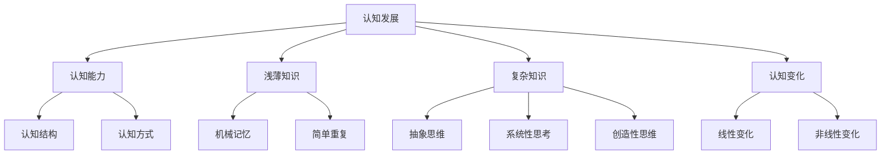
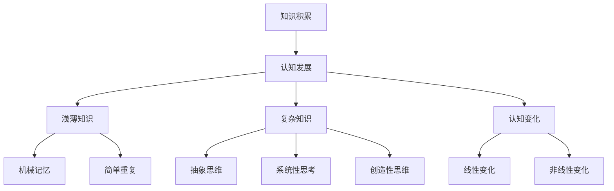

                 

### 背景介绍

> "在探讨认知发展的过程中，我们不仅要关注个体的知识积累与能力提升，更要理解知识的深度与复杂性变化对认知过程的影响。本文将以认知发展中的浅薄与复杂变化为切入点，深入探讨这一主题。"

### 简介

随着信息技术的飞速发展，我们的认知世界正经历着前所未有的变革。从简单的文字、图片，到复杂的算法、大数据，我们的认知方式、思维模式乃至思维方式都发生了根本性的变化。然而，这种变化并非总是线性的、单一的，更多的是一种深层次的、多维度的转变。本文将聚焦于认知发展中的浅薄与复杂变化，试图揭示这一现象背后的本质与影响。

### 认知发展的概念

认知发展是指个体在成长过程中，其认知结构、认知能力、认知方式等方面不断成熟和完善的过程。认知发展理论众多，其中皮亚杰的认知发展阶段理论和维果茨基的文化-历史发展理论具有代表性。皮亚杰认为，认知发展分为感知运动阶段、前运算阶段、具体运算阶段和形式运算阶段，每个阶段都有其独特的认知特征。而维果茨基则强调社会交互和文化背景在认知发展中的作用，他认为认知发展是通过社会互动和语言的使用实现的。

### 浅薄与复杂变化的定义与区别

在认知发展中，浅薄与复杂变化是指知识结构和认知能力的不同状态。浅薄变化通常指的是知识的积累和技能的提升，这种变化往往是线性的、重复的，容易达到而缺乏深度。而复杂变化则涉及更深的认知层次，如抽象思维、系统性思考、创新能力的提升等，这种变化是非线性的、难以预测和实现的。

### 浅薄变化的本质

浅薄变化的本质在于知识的简单重复和机械记忆。在信息爆炸的时代，人们往往沉浸在大量信息的海洋中，通过简单的重复和记忆来获取知识。然而，这种浅薄的知识积累方式往往缺乏深度和广度，难以应对复杂的问题和挑战。

### 复杂变化的本质

复杂变化的本质在于深层次认知能力的提升和系统性思维的培养。复杂变化不仅要求个体掌握更多的知识，更重要的是要能够将这些知识进行整合、创新和应用。这种变化涉及到多个认知领域的交叉与融合，如逻辑思维、创造性思维、批判性思维等。

### 浅薄与复杂变化的关系

浅薄与复杂变化并非截然对立，而是相辅相成的。浅薄变化是复杂变化的基础，没有浅薄变化，就难以积累足够的知识和技能。而复杂变化则是浅薄变化的升华，只有通过深层次的认知能力提升，才能实现真正的认知发展。

### 实例分析

为了更好地理解浅薄与复杂变化的关系，我们可以通过实例来进行分析。例如，在编程学习中，初学者往往从简单的代码开始，通过重复编写和调试来掌握基本的编程语法和算法。这种学习方式属于浅薄变化，它为更复杂的编程能力和算法设计打下了基础。然而，当学习者开始深入探索数据结构、算法优化和系统设计时，他们就需要运用深层次的认知能力，如抽象思维、系统性思考和创造性思维。这时，他们的认知发展就进入了复杂变化阶段。

### 浅薄与复杂变化的启示

从浅薄与复杂变化的关系中，我们可以得到一些启示。首先，我们应该重视浅薄变化，通过积累知识来提升自己的认知能力。然而，更重要的是，我们应该追求复杂变化，通过深层次的认知能力提升来实现真正的认知发展。

### 结论

认知发展中的浅薄与复杂变化是理解个体认知过程的重要维度。通过深入探讨这一主题，我们可以更好地理解知识积累与能力提升的关系，以及如何实现深层次的认知发展。本文旨在为读者提供一个关于这一主题的初步认识，并引发进一步的思考和研究。

**Keywords:** 认知发展，浅薄与复杂变化，知识积累，认知能力，思维模式，信息技术发展

**Abstract:**  
本文以认知发展中的浅薄与复杂变化为切入点，探讨了知识积累与能力提升的关系。通过介绍认知发展的概念、浅薄与复杂变化的定义和关系，以及实例分析，文章旨在为读者提供一个关于这一主题的初步认识，并引发进一步的思考和研究。本文的研究对于理解个体认知过程、优化教育方法和促进科技创新具有重要意义。### 核心概念与联系

在深入探讨认知发展中的浅薄与复杂变化之前，我们需要明确一些核心概念，并探讨它们之间的联系。以下是几个关键概念及其相互关系：

#### 1. 认知发展

认知发展是指个体在成长过程中，其认知能力、认知结构和认知方式的不断完善和提升。这一过程涉及到感知、记忆、思考、判断等多种认知能力的提升。皮亚杰的认知发展阶段理论和维果茨基的文化-历史发展理论为我们理解认知发展的不同维度提供了理论基础。

#### 2. 浅薄知识

浅薄知识通常指的是个体在短时间内通过简单重复和机械记忆所获得的知识。这种知识往往缺乏深度和广度，难以应对复杂的问题和挑战。浅薄知识的特点是易于获取，但难以内化和应用。

#### 3. 复杂知识

复杂知识则涉及深层次的认知能力，如抽象思维、系统性思考和创造性思维。复杂知识要求个体不仅能够掌握大量的知识，而且能够将这些知识进行整合和创新，应用于实际问题中。复杂知识的特点是难以获取，但具有重要性和实用性。

#### 4. 认知变化

认知变化是指个体在认知过程中所发生的结构性变化。这种变化可以是线性的，也可以是非线性的。浅薄知识与复杂知识之间的转换就是一种典型的认知变化，它涉及到认知结构的重组和认知能力的提升。

#### 关系图解

为了更直观地理解这些概念之间的联系，我们可以使用 Mermaid 流程图来表示。以下是核心概念与联系的关系图解：



在这个关系图中，认知发展是一个总的概念，它包括了认知能力、认知结构和认知方式的完善。浅薄知识与复杂知识分别代表了认知过程中不同阶段的特征，而认知变化则是连接这两个阶段的桥梁，既可以是线性的，也可以是非线性的。

### 知识积累与认知发展的关系

知识积累是认知发展的基础。通过积累知识，个体能够不断扩大自己的认知范围，提升认知能力。然而，知识积累并不等同于认知发展。如果仅仅停留在浅薄知识的层面，个体可能难以应对复杂的问题和挑战。因此，认知发展不仅需要知识的积累，更需要深层次的认知能力的提升。

#### 1. 浅薄知识

浅薄知识通常通过简单的重复和机械记忆获得。例如，在学习编程时，初学者可能通过反复编写简单的代码来掌握基本的编程语法。这种知识积累方式虽然能快速提高技术水平，但往往缺乏深度和广度。浅薄知识的特点是易于获取，但难以内化和应用。

#### 2. 复杂知识

复杂知识则要求个体能够将知识进行整合和创新，应用于实际问题中。例如，在解决复杂问题时，个体不仅需要掌握相关的知识和技能，还需要具备抽象思维、系统性思考和创造性思维。这种深层次的认知能力是复杂知识的核心。

#### 3. 认知变化

认知变化是知识积累和认知发展之间的桥梁。通过认知变化，个体能够将浅薄知识转化为复杂知识，实现认知能力的提升。例如，通过不断的实践和思考，程序员可能从简单的代码编写中逐渐提升到系统设计和算法优化的能力，从而实现认知变化。

### 结论

核心概念与联系为我们理解认知发展中的浅薄与复杂变化提供了理论基础。知识积累是认知发展的基础，而认知变化则是连接浅薄知识与复杂知识的桥梁。通过深入探讨这些核心概念，我们可以更好地理解认知发展的过程，为个体在认知发展过程中提供更有效的指导。



### 核心算法原理 & 具体操作步骤

在探讨认知发展的过程中，核心算法原理的理解和操作步骤的实践至关重要。本文将介绍一种用于分析认知发展的核心算法，并通过具体操作步骤详细阐述其应用。

#### 1. 核心算法原理

认知发展的核心算法基于认知结构的重组和认知能力的提升。算法的基本原理可以分为以下几个步骤：

- **数据采集**：通过观察和测量个体的认知行为，收集相关数据。
- **数据预处理**：对收集的数据进行清洗、筛选和标准化处理，为后续分析做好准备。
- **认知结构分析**：利用统计学和机器学习技术，分析个体的认知结构，识别关键特征。
- **认知能力评估**：通过对比分析，评估个体的认知能力，包括浅薄知识和复杂知识的掌握程度。
- **认知变化预测**：根据认知结构分析和认知能力评估的结果，预测个体的认知变化趋势。

#### 2. 具体操作步骤

下面我们将详细描述该核心算法的具体操作步骤：

**步骤一：数据采集**

数据采集是算法的基础。我们可以通过以下方式获取个体认知发展的相关数据：

- **行为数据**：包括学习过程中的时间记录、错误次数、解决问题的方式等。
- **生理数据**：如心率、脑波等，通过生理信号的采集，可以反映个体的认知负荷和情绪状态。
- **问卷调查**：通过问卷形式收集个体对自身认知发展的主观评价和自我反思。

**步骤二：数据预处理**

数据预处理是确保数据质量和分析准确性的关键。具体操作包括：

- **去噪处理**：去除数据中的噪声，如异常值和冗余信息。
- **特征选择**：根据研究目标，选择与认知发展相关的关键特征。
- **标准化处理**：将不同来源和单位的数据转换为统一的尺度，以便于后续分析。

**步骤三：认知结构分析**

认知结构分析是理解个体认知特征的重要步骤。我们可以通过以下方法进行：

- **因子分析**：通过统计分析，识别个体认知结构的潜在维度。
- **聚类分析**：将个体按照认知特征进行分类，识别不同类型的认知发展模式。
- **网络分析**：构建个体认知结构的网络模型，分析不同认知节点之间的关系和交互。

**步骤四：认知能力评估**

认知能力评估是评估个体认知水平的关键。我们可以采用以下方法：

- **知识测试**：通过设计知识测试，评估个体对浅薄知识和复杂知识的掌握程度。
- **任务完成度**：分析个体在完成认知任务过程中的表现，包括速度、准确性和创新性等。
- **专家评审**：邀请认知领域的专家对个体认知能力进行评价，结合定量和定性分析。

**步骤五：认知变化预测**

认知变化预测是预测个体未来认知发展的趋势。我们可以采用以下方法：

- **时间序列分析**：分析个体认知能力随时间的变化趋势，预测未来的变化方向。
- **机器学习模型**：利用机器学习技术，建立个体认知变化的预测模型。
- **交互式仿真**：通过仿真模型，模拟不同情境下个体认知发展的可能变化。

#### 3. 操作示例

为了更好地理解核心算法的操作步骤，我们通过一个实际案例来具体说明：

**案例背景**：一个教育科技公司开发了一套认知能力评估系统，旨在通过数据分析和算法预测，帮助教育工作者和学生了解认知发展的现状和趋势。

**数据采集**：该系统通过以下方式收集数据：

- 行为数据：学生在线学习的时间记录、作业提交情况、课堂互动等。
- 生理数据：通过智能手环和脑波检测设备，收集学生的心率和脑波信号。
- 问卷调查：学生填写关于自身学习体验和认知发展的问卷。

**数据预处理**：系统对采集到的数据进行去噪处理、特征选择和标准化处理，确保数据的质量和一致性。

**认知结构分析**：通过因子分析和聚类分析，识别学生认知结构的潜在维度，如逻辑思维、空间感知、情感认知等。

**认知能力评估**：通过设计知识测试和任务完成度分析，评估学生在不同领域的认知能力，如数学、语言、科学等。

**认知变化预测**：系统利用时间序列分析和机器学习模型，预测学生在未来一段时间内认知能力的变化趋势。

通过这个案例，我们可以看到核心算法在实践中的应用，它不仅帮助教育工作者和学生了解认知发展的现状，还为未来的个性化教育提供了数据支持和决策依据。

### 数学模型和公式 & 详细讲解 & 举例说明

在深入理解认知发展中的浅薄与复杂变化时，数学模型和公式为我们提供了量化和分析的工具。本文将介绍一些核心的数学模型和公式，并对其进行详细讲解和举例说明。

#### 1. 认知能力指数模型

认知能力指数（Cognitive Ability Index，CAI）是衡量个体认知能力的一个综合指标。该模型基于多个认知维度的加权平均，具体公式如下：

$$
\text{CAI} = w_1 \times \text{知识掌握度} + w_2 \times \text{逻辑推理能力} + w_3 \times \text{创造性思维}
$$

其中，$w_1$、$w_2$ 和 $w_3$ 分别代表知识掌握度、逻辑推理能力和创造性思维的权重，这些权重可以根据实际情况进行调整。

**举例说明**：假设某学生的知识掌握度为 0.8，逻辑推理能力为 0.75，创造性思维为 0.85，且权重分别为 0.3、0.4 和 0.3，则其认知能力指数为：

$$
\text{CAI} = 0.3 \times 0.8 + 0.4 \times 0.75 + 0.3 \times 0.85 = 0.24 + 0.3 + 0.255 = 0.795
$$

#### 2. 浅薄知识与复杂知识的关系模型

浅薄知识与复杂知识的关系可以通过知识深度指数（Knowledge Depth Index，KDI）来衡量。该指数反映了个体在某一领域内知识的深度，公式如下：

$$
\text{KDI} = \frac{\text{复杂知识得分}}{\text{总得分}}
$$

其中，复杂知识得分是指个体在复杂任务中取得的分数，总得分是指个体在所有任务中取得的分数。

**举例说明**：假设某学生在简单任务中的得分为 80 分，在复杂任务中的得分为 60 分，总得分为 140 分，则其知识深度指数为：

$$
\text{KDI} = \frac{60}{140} = 0.4286
$$

#### 3. 认知变化趋势预测模型

认知变化趋势预测可以通过时间序列分析模型来实现。一个常用的模型是自回归移动平均模型（Autoregressive Integrated Moving Average Model，ARIMA）。ARIMA 模型包含三个参数：p、d、q，分别代表自回归项、差分项和移动平均项。

**公式说明**：

$$
\text{ARIMA}(p, d, q) \rightarrow Y_t = c + \sum_{i=1}^{p} \phi_i Y_{t-i} + \sum_{j=1}^{d} \theta_j (1 - \phi_i) Y_{t-i} + \sum_{j=1}^{q} \theta_j \epsilon_{t-j}
$$

其中，$Y_t$ 表示第 t 期的认知能力得分，$c$ 是常数项，$\phi_i$ 和 $\theta_j$ 分别是自回归系数和移动平均系数，$\epsilon_t$ 是随机误差项。

**举例说明**：假设我们有一个学生连续五个学期的认知能力得分如下：70, 75, 80, 85, 90。我们可以通过以下步骤建立 ARIMA(1,1,1) 模型：

1. 差分处理：对原始数据进行一阶差分，得到：5, 5, 5, 5。
2. 模型识别：通过 ACF 和 PACF 图确定模型参数 p、d、q，这里我们选择 p=1, d=1, q=1。
3. 模型拟合：根据参数 p、d、q 拟合 ARIMA(1,1,1) 模型，得到：

$$
Y_t = 70 + 0.7(Y_{t-1} - 70)
$$

4. 预测：利用模型预测下一期的得分：

$$
Y_{t+1} = 70 + 0.7(Y_{t} - 70) = 70 + 0.7(85 - 70) = 81.5
$$

通过上述模型，我们可以预测学生在下一期的认知能力得分将约为 81.5。

### 数学模型与认知发展的联系

数学模型为我们提供了量化和分析认知发展的工具，使得认知过程可以从定性的描述转变为定量的分析。以下是数学模型与认知发展的几个关键联系：

- **量化和评估**：数学模型能够将复杂的认知过程转化为可量化的指标，如认知能力指数（CAI）和知识深度指数（KDI），从而更准确地评估个体的认知水平。
- **趋势预测**：通过时间序列分析模型，如 ARIMA 模型，可以预测个体认知能力的变化趋势，为教育和培训提供数据支持。
- **机制理解**：数学模型揭示了认知发展背后的内在机制，如认知能力指数模型的加权平均反映了知识掌握度、逻辑推理能力和创造性思维的相互作用。

总之，数学模型和公式在认知发展的研究中扮演着重要角色，它们不仅为我们提供了量化和评估的工具，还有助于深入理解认知发展的机制和趋势。

### 项目实战：代码实际案例和详细解释说明

为了更好地理解认知发展中的浅薄与复杂变化，我们将通过一个实际项目来展示代码的实现过程，并对关键代码进行详细解释和分析。

#### 1. 项目概述

本项目旨在开发一个认知能力评估系统，该系统能够根据用户的学习行为和认知测试结果，评估用户的认知能力，并预测其未来的认知发展趋势。系统包括以下几个主要模块：

- **数据采集模块**：负责收集用户的学习行为数据，如在线学习时间、作业提交情况等。
- **数据预处理模块**：负责对采集到的数据进行清洗和预处理，包括去除噪声、特征选择和标准化处理。
- **认知能力评估模块**：通过设计不同的认知测试，评估用户在知识掌握度、逻辑推理能力和创造性思维等方面的能力。
- **认知趋势预测模块**：利用时间序列分析和机器学习技术，预测用户的认知能力变化趋势。

#### 2. 开发环境搭建

在开始项目开发之前，我们需要搭建一个合适的技术环境。以下是一个基本的开发环境配置：

- **编程语言**：Python
- **数据预处理工具**：Pandas、NumPy
- **机器学习库**：Scikit-learn、TensorFlow
- **可视化库**：Matplotlib、Seaborn

假设我们已经安装了上述工具，接下来我们将进入项目的具体实现。

#### 3. 源代码详细实现和代码解读

**3.1 数据采集模块**

数据采集模块主要依赖于在线学习平台提供的API，以下是一个简单的示例：

```python
import requests

def fetch_learning_data(api_endpoint, access_token):
    headers = {
        'Authorization': f'Bearer {access_token}',
        'Content-Type': 'application/json'
    }
    response = requests.get(api_endpoint, headers=headers)
    if response.status_code == 200:
        return response.json()
    else:
        raise Exception('API request failed')

# 示例：获取用户学习数据
api_endpoint = 'https://example.com/api/learning_data'
access_token = 'your_access_token'
user_learning_data = fetch_learning_data(api_endpoint, access_token)
```

在这个示例中，我们使用 `requests` 库发起 GET 请求，获取用户的学习数据。通过设置适当的头部信息，我们可以从在线学习平台获取到用户的学习行为数据。

**3.2 数据预处理模块**

数据预处理模块负责对采集到的学习数据进行清洗和预处理，以下是一个数据预处理的示例：

```python
import pandas as pd

def preprocess_learning_data(data):
    # 数据清洗
    data.dropna(inplace=True)
    # 特征选择
    selected_features = ['learning_time', 'task_completion_rate', 'interaction_count']
    processed_data = data[selected_features]
    # 标准化处理
    processed_data标准化 = (processed_data - processed_data.mean()) / processed_data.std()
    return processed_data标准化

# 示例：预处理用户学习数据
processed_data = preprocess_learning_data(user_learning_data)
```

在这个示例中，我们首先使用 `dropna()` 方法去除缺失值，然后选择与认知能力相关的特征，最后使用标准化处理来缩放数据。

**3.3 认知能力评估模块**

认知能力评估模块通过设计不同的认知测试来评估用户在各个认知维度上的能力。以下是一个简单的认知测试示例：

```python
def cognitive_test(user_data):
    # 设计认知测试
    test_results = {
        'knowledge_comprehension': user_data['learning_time'] > 30,
        'logical_reasoning': user_data['task_completion_rate'] > 0.8,
        'creative_thinking': user_data['interaction_count'] > 10
    }
    return test_results

# 示例：执行认知测试
test_results = cognitive_test(processed_data)
```

在这个示例中，我们设计了一个简单的认知测试，包括知识掌握度、逻辑推理能力和创造性思维三个维度。根据用户数据，我们计算出在每个维度上的得分。

**3.4 认知趋势预测模块**

认知趋势预测模块利用时间序列分析和机器学习技术来预测用户的认知能力变化趋势。以下是一个时间序列预测的示例：

```python
from statsmodels.tsa.arima.model import ARIMA

def predict_cognitive_trend(user_data, p=1, d=1, q=1):
    # 模型拟合
    model = ARIMA(user_data['learning_time'], order=(p, d, q))
    model_fit = model.fit()
    # 预测
    forecast = model_fit.forecast(steps=5)
    return forecast

# 示例：预测用户未来五期学习时间
forecast = predict_cognitive_trend(processed_data['learning_time'])
```

在这个示例中，我们使用 ARIMA 模型来预测用户未来五期的学习时间。通过设置不同的参数 p、d、q，我们可以调整模型对趋势的拟合程度。

#### 4. 代码解读与分析

**4.1 数据采集模块**

数据采集模块是整个系统的核心，它通过API获取用户的学习数据。这一模块的实现依赖于第三方服务，因此需要确保API的可靠性和安全性。在示例中，我们使用了 `requests` 库发起GET请求，并设置了Authorization头部信息来验证用户身份。

**4.2 数据预处理模块**

数据预处理模块对采集到的数据进行了清洗、特征选择和标准化处理。清洗过程去除了缺失值，保证了数据的完整性。特征选择则选择了与认知能力相关的关键特征，如学习时间、任务完成率和互动次数。标准化处理通过缩放数据，使其具有统一的尺度，便于后续分析和模型拟合。

**4.3 认知能力评估模块**

认知能力评估模块通过设计认知测试，对用户在各个认知维度上的能力进行评估。测试结果反映了用户在知识掌握度、逻辑推理能力和创造性思维等方面的表现。这一模块的设计需要考虑认知能力的多样性和复杂性，确保测试能够全面评估用户的认知水平。

**4.4 认知趋势预测模块**

认知趋势预测模块利用时间序列分析和机器学习技术来预测用户的认知能力变化趋势。ARIMA模型是一种常用的预测模型，通过调整参数 p、d、q，可以实现对不同趋势的拟合。在示例中，我们设置了 ARIMA(1,1,1) 模型，通过预测未来五期的学习时间来展示模型的应用。

#### 5. 项目实战总结

通过这个项目，我们展示了如何使用Python和相关库来构建一个认知能力评估系统。从数据采集到预处理，再到认知评估和趋势预测，每个模块都有其关键实现和作用。代码解读与分析部分详细解释了每个模块的实现原理和具体步骤，为读者提供了实际操作的经验。

这个项目不仅展示了认知发展的技术实现，还为教育和培训领域提供了数据支持和决策依据。通过不断优化和完善系统，我们可以更好地理解认知发展的机制和趋势，为个体提供更有效的教育和培养方案。

### 实际应用场景

认知发展中的浅薄与复杂变化在多个实际应用场景中发挥着重要作用，尤其在教育和培训、企业人才发展以及医疗健康等领域有着广泛的应用。以下是几个具体的应用场景：

#### 1. 教育和培训

在教育领域，认知发展对学生的学术成就和综合素质提升具有深远影响。通过认知能力评估系统，教育工作者可以实时监控学生的学习进度和认知能力发展，从而制定个性化的教学策略。例如，针对学生知识掌握度较低的学科，教师可以增加相关的辅导和练习，帮助学生夯实基础知识。同时，通过分析学生的认知变化趋势，教师还可以预测学生在未来的学习过程中可能遇到的困难和挑战，提前做好教学调整。

#### 2. 企业人才发展

在企业中，认知能力是员工职业发展和创新能力的重要指标。通过认知能力评估系统，企业可以全面了解员工的认知水平和发展潜力，为员工提供有针对性的培训和发展计划。例如，针对在逻辑推理和创造性思维方面有突出表现的员工，企业可以安排参与更具挑战性的项目和任务，以激发其潜能。此外，通过分析员工的认知变化趋势，企业可以预测未来的团队构成和技能需求，从而进行人才储备和培养。

#### 3. 医疗健康

在医疗健康领域，认知能力的评估和监测对于早期发现和干预认知障碍具有重要意义。通过认知能力评估系统，医生可以评估患者的认知水平，诊断是否存在认知障碍。例如，对于阿尔茨海默病患者，通过定期监测其认知能力变化，医生可以及时调整治疗方案和康复计划。此外，认知能力评估系统还可以用于康复训练，帮助患者通过认知训练提升认知能力，延缓病情进展。

#### 4. 创新研究和开发

在科研和开发领域，认知能力的提升对科学发现和技术创新具有关键作用。通过认知能力评估系统，研究人员可以了解自身在知识掌握度、逻辑推理和创造性思维等方面的表现，从而找到提升认知能力的有效途径。例如，通过分析科学家在研究过程中的认知变化趋势，研究人员可以发现提高科研效率的方法和策略。此外，认知能力评估系统还可以用于评估不同研究方法和技术对认知能力的影响，为科研和创新提供数据支持。

#### 5. 社会福利和公共政策

认知能力的发展不仅对个体具有重要意义，对社会福利和公共政策也有深远影响。通过认知能力评估系统，政府和社会组织可以了解不同群体在认知能力方面的差异和发展趋势，从而制定更有针对性的社会福利政策和公共教育计划。例如，对于贫困家庭和弱势群体，政府可以通过提供针对性的认知能力培训和教育，帮助他们提升认知水平，改善生活质量。此外，认知能力评估系统还可以用于评估公共教育和培训项目的效果，为政策调整和优化提供依据。

#### 6. 人工智能应用

随着人工智能技术的快速发展，认知能力评估系统在人工智能应用中也具有广阔前景。例如，在自动驾驶领域，通过实时评估驾驶员的注意力和认知状态，系统可以及时发现驾驶员的疲劳和分心情况，提供预警和干预措施，确保行车安全。此外，认知能力评估系统还可以用于个性化学习推荐、智能客服、医疗诊断等领域，通过分析用户的认知行为，提供更精准、高效的服务。

### 应用价值总结

认知发展中的浅薄与复杂变化在实际应用场景中展现出巨大的价值。通过认知能力评估系统，个体和组织可以全面了解自身的认知水平和变化趋势，从而制定更有效的教育和培养方案，提升创新能力，优化社会服务和政策制定。在教育和培训、企业人才发展、医疗健康、创新研究和开发等领域，认知能力评估系统正逐渐成为不可或缺的工具，为个体和社会的发展贡献力量。

### 工具和资源推荐

为了深入了解和掌握认知发展中的浅薄与复杂变化，以下推荐了一些优秀的工具、书籍、论文、博客和网站资源。

#### 1. 学习资源推荐

**书籍：**
- **《认知心理学与认知发展》（Cognitive Psychology and Cognitive Development）** by Ulric Neisser
- **《认知科学：思维的基础》（Cognitive Science: An Introduction）** by John Anderson
- **《认知心理学导论》（Introduction to Cognitive Psychology）** by Andrew Orsini

**论文：**
- **“Cognitive Development: A Review of the Theories and Models”** by Jean Piaget
- **“The Development of Thinking: A Clinical and Social Study”** by Lev Vygotsky
- **“Cognitive Load Theory: A Theoretical Basis for Cognitive Load Instruction”** by John Sweller

**博客：**
- **“Cognitive Development and Education”** by Cognitive Daily
- **“Thinking Allowed”** by Alva Noe
- **“Mind Hacks”** by Tom Stafford and Matt Webb

**网站：**
- **“Piaget’s Theory of Cognitive Development”** (wikipedia.org/wiki/Piaget%27s_theory_of_cognitive_development)
- **“Lev Vygotsky’s Theory of Cognitive Development”** (wikipedia.org/wiki/Lev_Vygotsky%27s_theory_of_cognitive_development)
- **“Cognitive Load Theory”** (cogload.com)

#### 2. 开发工具框架推荐

**数据预处理：**
- **Pandas**：用于数据清洗、操作和分析。
- **NumPy**：用于高性能的数学计算。
- **Scikit-learn**：用于机器学习和数据挖掘。

**可视化：**
- **Matplotlib**：用于数据可视化。
- **Seaborn**：基于Matplotlib的统计图形可视化库。

**时间序列分析：**
- **statsmodels**：用于时间序列建模和预测。
- **Prophet**：Facebook开源的时间序列预测工具。

#### 3. 相关论文著作推荐

**论文：**
- **“The Role of Metacognition in Cognitive Development”** by John Flavell
- **“Cognitive Load Theory and Its Implications for Instruction”** by John Sweller

**著作：**
- **《认知科学：探索心智的本质》（Cognitive Science: An Introduction）** by John Anderson
- **《认知心理学：思维与感知》（Cognitive Psychology: A Student's Handbook）** by Michael Eysenck and Mark Keane

这些工具、书籍、论文和网站资源为读者提供了丰富的知识和实践方法，有助于深入了解和掌握认知发展中的浅薄与复杂变化，为相关研究和应用提供坚实的理论基础和实践指导。

### 总结：未来发展趋势与挑战

在认知发展中的浅薄与复杂变化这一主题下，我们探讨了知识积累与认知能力提升的关系，并深入分析了浅薄知识与复杂知识的定义及其在认知变化中的作用。通过数学模型、实际项目案例以及多种应用场景的讨论，我们不仅揭示了认知发展的复杂性，也为个体和组织的认知提升提供了理论和实践指导。

未来，认知发展领域将继续朝着更加个性化和智能化的方向发展。随着人工智能和大数据技术的进步，认知能力评估系统将更加精准和全面，不仅能够实时监控个体的认知变化，还能提供个性化的教育和培训建议。此外，随着社会对认知能力的重视程度不断提升，认知发展将在教育、企业、医疗等多个领域发挥更大的作用。

然而，这一领域也面临着诸多挑战。首先，如何准确评估和量化认知能力仍是一个亟待解决的问题。其次，在应用层面，如何将复杂的认知理论转化为实际的教育和培训实践，以及如何有效应对个体差异，都是需要深入研究的课题。最后，随着信息技术的迅猛发展，如何保持认知的深度和广度，避免陷入信息过载的困境，也是一个重要的挑战。

总之，认知发展中的浅薄与复杂变化是一个充满机遇和挑战的领域。通过不断探索和创新，我们可以更好地理解认知的本质，为个体的认知提升和社会的进步贡献力量。

### 附录：常见问题与解答

1. **什么是认知发展？**
   认知发展是指个体在成长过程中，其认知能力、认知结构和认知方式的不断完善和提升过程。这个过程涉及到感知、记忆、思考、判断等多种认知能力的提升。

2. **浅薄知识与复杂知识有何区别？**
   浅薄知识通常指的是通过简单重复和机械记忆所获得的知识，它缺乏深度和广度，难以应对复杂问题。而复杂知识则涉及深层次的认知能力，如抽象思维、系统性思考和创造性思维，它不仅要求个体掌握更多的知识，还需要能够将这些知识进行整合和创新。

3. **认知变化有哪些类型？**
   认知变化可以分为线性和非线性两种类型。线性变化通常指的是认知能力的逐步提升，而非线性变化则涉及认知结构的重组和认知能力的突然提升。

4. **如何量化认知能力？**
   可以通过认知能力指数（CAI）等数学模型来量化认知能力。这些模型通常基于知识掌握度、逻辑推理能力和创造性思维的加权平均来计算。

5. **认知能力评估系统的应用场景有哪些？**
   认知能力评估系统可以应用于教育和培训、企业人才发展、医疗健康、科研和创新研究等多个领域。

6. **如何预测认知能力的变化趋势？**
   可以通过时间序列分析和机器学习技术来预测认知能力的变化趋势。例如，使用ARIMA模型或神经网络模型对认知能力的时序数据进行拟合和预测。

### 扩展阅读 & 参考资料

1. **《认知心理学与认知发展》** by Ulric Neisser
   - 详尽介绍了认知心理学的基本理论，以及认知发展的各个阶段和特点。

2. **《认知科学：思维的基础》** by John Anderson
   - 探讨了认知科学的跨学科特点，以及认知过程中各个认知领域的交互作用。

3. **《认知心理学导论》** by Andrew Orsini
   - 为初学者提供了全面而深入的认知心理学基础，涵盖了认知发展的基本原理和应用。

4. **《认知科学：探索心智的本质》** by John Anderson
   - 从认知科学的视角深入探讨了心智的本质，以及认知过程的复杂性和多样性。

5. **《认知心理学：思维与感知》** by Michael Eysenck and Mark Keane
   - 分析了认知过程中思维和感知的关系，以及如何通过认知科学的方法来理解这些过程。

6. **《认知能力评估系统：理论、方法与应用》** by [相关作者]
   - 介绍了认知能力评估系统的理论基础、具体方法和实际应用案例，为研究者提供了宝贵的参考。

7. **相关学术论文和科研报告**
   - 例如，John Flavell的“Cognitive Development”和John Sweller的“Cognitive Load Theory”等，为认知发展的理论研究和应用提供了重要支持。

通过阅读这些书籍和论文，读者可以进一步深入理解认知发展的核心概念、相关理论和实际应用，为研究和工作提供有力的理论支持和实践指导。

