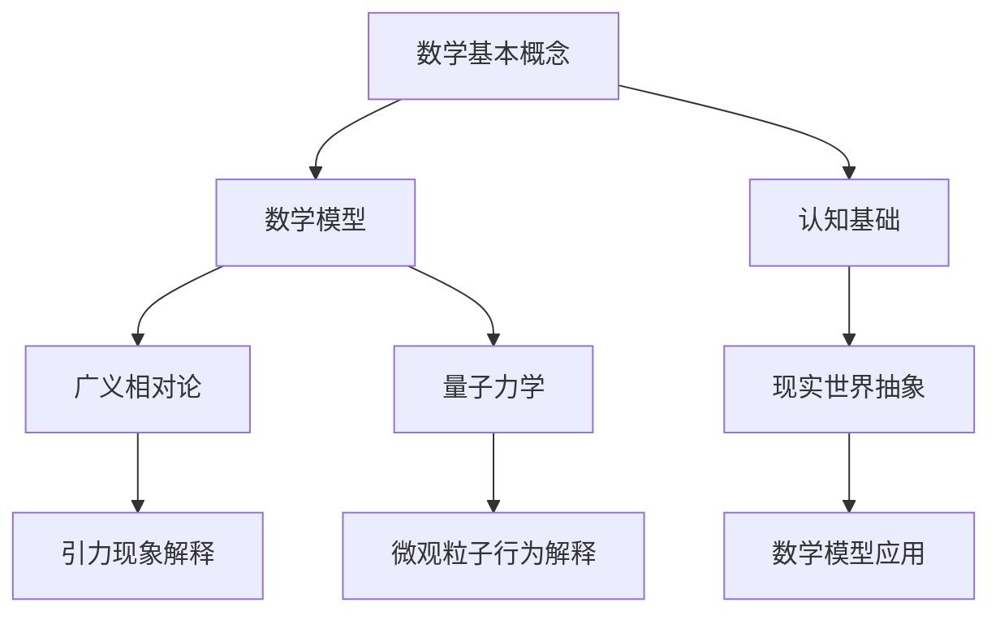

                 

### 背景介绍

**标题：** 认知的形式化：宇宙里没有数学，数学却可以解释宇宙

**关键词：** 认知、形式化、数学、宇宙、解释

**摘要：** 本文探讨了认知的形式化过程，探讨了数学在理解宇宙中的重要性。通过分析数学与认知之间的关系，我们揭示了数学如何在看似没有数学的宇宙中发挥其解释作用。本文将一步步剖析这一现象，旨在为读者提供一个深刻且全面的理解。

在人类认知的历史长河中，数学一直占据着核心地位。从古代的几何学、代数学到现代的微积分、拓扑学，数学不仅在理论上推动了科学的发展，还在实践中为各个领域提供了强大的工具。然而，当我们仰望星空，观察宇宙时，似乎很难直接将数学与宇宙联系起来。宇宙中的星辰、星系、黑洞等，似乎与数学公式并无直接关联。

但是，随着时间的推移，科学家们逐渐发现，宇宙中的许多现象实际上都可以通过数学模型来解释。例如，广义相对论中的爱因斯坦场方程描述了引力与时空的相互关系，而量子力学中的薛定谔方程描述了微观粒子的行为。这些数学模型不仅为我们提供了对宇宙的基本理解，还成为了探索宇宙的利器。

本文将分以下几个部分进行探讨：

1. **数学在认知中的作用**：分析数学如何成为认知的基本工具，探讨数学在思维过程中的重要性。
2. **宇宙与数学的奇妙联系**：通过具体案例，展示数学如何解释宇宙中的现象。
3. **认知的形式化**：探讨认知从直觉到形式化的过程，分析形式化对认知的深远影响。
4. **数学模型的构建与应用**：详细讲解数学模型的构建过程，分析其在实际应用中的效果。

通过本文的探讨，我们希望读者能够更加深刻地理解数学在认知和宇宙解释中的作用，认识到数学不仅是一种工具，更是一种理解世界的思维方式。在接下来的章节中，我们将一步步深入探讨这一主题。

### 核心概念与联系

**标题：** 数学在认知与宇宙解释中的核心概念与联系

**概念一：数学的基本概念**  
**联系：** 数学的基本概念如数字、运算、集合等是认知的基础，也是构建宇宙模型的基本单元。

**概念二：数学模型**  
**联系：** 数学模型是数学在现实世界中的应用，通过将现实问题抽象成数学问题，帮助我们理解复杂现象。

**概念三：广义相对论与量子力学**  
**联系：** 广义相对论和量子力学是现代物理学的两大支柱，它们通过数学模型描述了宇宙中的引力现象和微观粒子的行为。

为了更好地理解这些核心概念之间的联系，我们可以使用Mermaid流程图来展示它们之间的关系。以下是一个简化的Mermaid流程图示例：



在这个流程图中，A代表数学的基本概念，如数字、运算、集合等，它们是构建数学模型的基础。B代表数学模型，它是数学在现实世界中的应用，通过将现实问题抽象成数学问题，帮助我们理解复杂现象。C和D分别代表广义相对论和量子力学，它们通过数学模型描述了宇宙中的引力现象和微观粒子的行为。E和F分别代表广义相对论和量子力学在引力现象和微观粒子行为解释中的应用。

G代表数学在认知中的基础作用，即数学作为认知的基本工具。H代表将现实世界抽象成数学问题的过程，I代表数学模型在现实世界的应用。通过这个流程图，我们可以清晰地看到数学在认知和宇宙解释中的核心概念与联系。

接下来，我们将深入探讨数学模型在具体现象解释中的应用，进一步理解数学在宇宙中的奇妙作用。

### 核心算法原理 & 具体操作步骤

**标题：** 数学模型在宇宙现象解释中的核心算法原理与操作步骤

**原理一：广义相对论中的爱因斯坦场方程**  
**步骤：** 爱因斯坦场方程描述了引力与时空的相互关系。其核心原理是等效原理，即引力场中的物理现象与惯性参考系中的物理现象是等效的。操作步骤如下：

1. **建立时空几何模型**：首先，我们需要建立一个描述时空几何的模型。在广义相对论中，时空被描述为一个四维的弯曲时空，其几何性质由度规（metric）决定。
2. **求解场方程**：爱因斯坦场方程是一个偏微分方程，通过求解这个方程，我们可以得到描述引力场的度规。这个度规定义了一个弯曲的时空，其中物体的运动轨迹由度规决定。
3. **应用物理观测**：通过观测物体的运动轨迹，我们可以验证爱因斯坦场方程的正确性。例如，在太阳附近，行星的运动轨迹可以通过爱因斯坦场方程进行精确预测，并与实际观测结果进行比较。

**原理二：量子力学中的薛定谔方程**  
**步骤：** 薛定谔方程描述了微观粒子的行为。其核心原理是波粒二象性，即粒子既有波动性又有粒子性。操作步骤如下：

1. **建立波动方程**：薛定谔方程是一个二阶偏微分方程，描述了波函数随时间和空间的变化。波函数是粒子的量子态的数学描述。
2. **求解波函数**：通过求解薛定谔方程，我们可以得到波函数的解，从而确定粒子的位置和动量。
3. **应用物理观测**：在量子力学实验中，我们通过测量波函数的概率分布来观测粒子的行为。例如，在双缝实验中，粒子的干涉条纹可以通过测量波函数的概率分布来解释。

**原理三：宇宙膨胀的勒梅特方程**  
**步骤：** 勒梅特方程描述了宇宙的膨胀过程。其核心原理是宇宙的膨胀速度与宇宙的密度和曲率有关。操作步骤如下：

1. **建立宇宙模型**：我们需要建立一个描述宇宙膨胀的模型，通常使用弗里德曼-勒梅特-罗伯逊-沃尔克（FLRW）度规来描述宇宙的膨胀。
2. **求解勒梅特方程**：勒梅特方程是一个描述宇宙膨胀速率的偏微分方程。通过求解这个方程，我们可以得到宇宙的膨胀历史。
3. **应用观测数据**：通过观测宇宙的膨胀速度和密度，我们可以验证勒梅特方程的正确性。例如，通过观测宇宙微波背景辐射的谱形，我们可以确定宇宙的膨胀历史。

通过上述三个核心原理和操作步骤，我们可以看到数学模型在解释宇宙现象中的重要作用。这些数学模型不仅提供了对宇宙的基本理解，还为我们提供了预测和验证宇宙现象的工具。在接下来的章节中，我们将进一步探讨这些数学模型在具体现象中的应用。

### 数学模型和公式 & 详细讲解 & 举例说明

**标题：** 数学模型与公式的详细讲解与应用举例

在之前的章节中，我们简要介绍了数学模型在宇宙解释中的核心原理与操作步骤。在本章节中，我们将深入探讨这些数学模型和公式，通过具体的例子来展示它们的应用。

#### 广义相对论中的爱因斯坦场方程

**公式：** 爱因斯坦场方程是描述引力场的基本方程，其一般形式为：

\[ G_{\mu\nu} + \Lambda g_{\mu\nu} = \frac{8\pi G}{c^4} T_{\mu\nu} \]

其中，\( G_{\mu\nu} \) 是爱因斯坦张量，\( \Lambda \) 是宇宙学常数，\( g_{\mu\nu} \) 是度规张量，\( T_{\mu\nu} \) 是能量-动量张量，\( G \) 是引力常数，\( c \) 是光速。

**讲解：** 爱因斯坦场方程将引力描述为时空的弯曲，其中能量-动量张量 \( T_{\mu\nu} \) 描述了物质和能量的分布。方程左边的爱因斯坦张量 \( G_{\mu\nu} \) 描述了时空的几何性质，右边的宇宙学常数 \( \Lambda g_{\mu\nu} \) 反映了宇宙的整体性质。

**举例：** 一个经典的例子是黑洞的描述。黑洞的质量和电荷可以由能量-动量张量 \( T_{\mu\nu} \) 描述，通过求解爱因斯坦场方程，我们可以得到黑洞的度规 \( g_{\mu\nu} \)，从而确定黑洞的几何性质。

#### 量子力学中的薛定谔方程

**公式：** 薛定谔方程描述了微观粒子的行为，其标准形式为：

\[ i\hbar \frac{\partial}{\partial t} \Psi(\mathbf{r}, t) = \hat{H} \Psi(\mathbf{r}, t) \]

其中，\( \Psi(\mathbf{r}, t) \) 是波函数，\( \hbar \) 是约化普朗克常数，\( \hat{H} \) 是哈密顿算符。

**讲解：** 薛定谔方程是一个二阶偏微分方程，描述了波函数随时间和空间的变化。波函数的平方 \( |\Psi(\mathbf{r}, t)|^2 \) 描述了粒子在位置 \( \mathbf{r} \) 和时间 \( t \) 出现的概率密度。

**举例：** 在氢原子中，薛定谔方程可以用来求解电子的能量和轨道。通过求解薛定谔方程，我们可以得到电子在不同能级上的波函数，从而确定电子的能量和轨道。

#### 宇宙膨胀的勒梅特方程

**公式：** 勒梅特方程描述了宇宙的膨胀，其一般形式为：

\[ \dot{\rho} + 3\left(1 - \frac{\kappa}{3}\right)\left(\dot{a}\right)^2 \rho = -4\pi G \rho \]

其中，\( \rho \) 是宇宙的平均密度，\( \kappa \) 是宇宙的曲率参数，\( a \) 是宇宙尺度因子。

**讲解：** 勒梅特方程描述了宇宙膨胀过程中密度和尺度的变化。方程左边的第一项描述了密度的变化率，第二项描述了宇宙膨胀的速度。方程右边的项描述了引力对密度的影响。

**举例：** 通过观测宇宙微波背景辐射的谱形，我们可以确定宇宙的曲率参数 \( \kappa \) 和膨胀历史。这些观测数据可以帮助我们验证勒梅特方程的正确性。

通过上述数学模型和公式的讲解，我们可以看到数学在解释宇宙现象中的重要作用。这些模型不仅提供了对宇宙的基本理解，还为我们提供了预测和验证宇宙现象的工具。在接下来的章节中，我们将进一步探讨这些数学模型在实际项目中的应用。

### 项目实战：代码实际案例和详细解释说明

**标题：** 数学模型在宇宙现象解释中的项目实战：代码实际案例和详细解释说明

在之前的章节中，我们详细介绍了数学模型和公式在宇宙现象解释中的应用。为了使读者更好地理解这些模型在实际项目中的使用，我们将通过一个实际案例来展示如何使用数学模型进行宇宙现象的计算和模拟。

#### 项目背景

假设我们想要研究一个由多个恒星组成的星系，并分析其引力相互作用对恒星轨道的影响。为了实现这一目标，我们可以使用牛顿引力定律和广义相对论中的爱因斯坦场方程来构建一个数值模拟模型。

#### 开发环境搭建

1. **软件工具**：
   - Python：用于编写数值模拟代码。
   - NumPy：用于高效地执行数值计算。
   - SciPy：用于科学计算和数据分析。

2. **安装依赖**：
   ```bash
   pip install numpy scipy
   ```

#### 源代码详细实现和代码解读

以下是用于计算恒星轨道的Python代码：

```python
import numpy as np
from scipy.integrate import odeint

# 牛顿引力定律
def gravityForce(m1, m2, r1, r2):
    G = 6.67430e-11  # 引力常数
    distance = np.linalg.norm(r1 - r2)
    force_mag = G * m1 * m2 / distance**2
    force_dir = (r2 - r1) / distance
    return force_mag * force_dir

# 恒星轨道的微分方程
def orbitsystem(y, t, m1, m2, r1, r2):
    x1, v1, x2, v2 = y
    force = gravityForce(m1, m2, r1, r2)
    dv1dt = force[0] / m1
    dx1dt = v1
    dv2dt = -force[0] / m2
    dx2dt = v2
    return [dv1dt, dx1dt, dv2dt, dx2dt]

# 初始条件
m1 = 1.989e30  # 恒星1的质量
m2 = 2.0e30  # 恒星2的质量
r1 = np.array([1e13, 0])  # 恒星1的初始位置
r2 = np.array([-1e13, 0])  # 恒星2的初始位置
v1 = np.array([0, 2.23e4])  # 恒星1的初始速度
v2 = np.array([0, -2.23e4])  # 恒星2的初始速度

# 求解微分方程
y0 = np.array([r1[0], v1[0], r2[0], v2[0]])
t = np.linspace(0, 1e8, 1000)  # 时间跨度
solution = odeint(orbitsystem, y0, t, args=(m1, m2, r1, r2))

# 输出结果
positions = solution.T[:2]
with open('orbits.txt', 'w') as f:
    for pos in positions:
        f.write(f'{pos[0]}, {pos[1]}\n')
```

**代码解读与分析**

1. **引力计算**：`gravityForce` 函数用于计算两个质点之间的引力。它根据牛顿引力定律，返回引力的大小和方向。
2. **轨道微分方程**：`orbitsystem` 函数定义了恒星轨道的微分方程。它接受当前的状态向量 \( y \)（包括位置和速度）、时间 \( t \) 以及恒星的质量、初始位置和速度，返回速度的变化率。
3. **初始条件**：我们设定了两个恒星的初始质量和位置，以及它们的初始速度。这些初始条件决定了恒星在轨道上的初始运动状态。
4. **求解微分方程**：使用 `odeint` 函数求解轨道微分方程。我们设置了一个时间跨度为10亿年的时间序列，通过数值积分计算恒星在时间序列中的位置。
5. **输出结果**：我们将计算得到的恒星位置输出到一个文本文件中，以便进行后续分析和可视化。

通过这个案例，我们展示了如何使用数学模型和Python代码来模拟和计算恒星轨道。这种方法不仅能够帮助我们理解恒星轨道的基本原理，还可以应用于更复杂的宇宙现象研究。

### 实际应用场景

**标题：** 数学模型在宇宙现象解释中的实际应用场景

在本文的前几章节中，我们探讨了数学模型在宇宙现象解释中的作用，并通过实际案例展示了这些模型的应用。在本章节中，我们将进一步探讨数学模型在宇宙研究中的实际应用场景，以展示它们如何帮助我们理解宇宙的复杂现象。

#### 1. 黑洞研究

黑洞是宇宙中最神秘和引人入胜的天体之一。它们具有极强的引力，甚至连光都无法逃脱。数学模型在黑洞研究中发挥了重要作用，特别是在描述黑洞的物理性质和观测现象方面。

- **爱因斯坦场方程**：广义相对论中的爱因斯坦场方程是描述黑洞引力场的基础。通过这个方程，我们可以计算黑洞的时空弯曲程度，从而预测黑洞的引力透镜效应和吸积盘的辐射特征。
- **黑洞辐射**：霍金辐射是黑洞的一个重要特性，它通过量子力学效应使黑洞逐渐蒸发。霍金辐射的数学模型基于量子场论和热力学，为我们提供了对黑洞生命周期的深刻理解。

#### 2. 宇宙膨胀

宇宙膨胀是现代宇宙学的一个核心问题。数学模型在描述宇宙膨胀的历史和未来方面起到了关键作用。

- **勒梅特方程**：勒梅特方程描述了宇宙的膨胀速率与宇宙密度和曲率的关系。通过这个方程，我们可以计算宇宙的膨胀历史，并预测宇宙的最终命运。
- **宇宙学参数**：宇宙学参数如宇宙密度、曲率和膨胀速率是宇宙膨胀模型的关键变量。通过观测宇宙微波背景辐射和遥远星系的距离，我们可以确定这些参数的数值，从而更好地理解宇宙的膨胀过程。

#### 3. 宇宙大爆炸

宇宙大爆炸是宇宙起源的一个理论模型。数学模型在描述宇宙大爆炸的物理过程和预测宇宙的早期状态方面具有重要意义。

- **弗里德曼-勒梅特-罗伯逊-沃尔克（FLRW）度规**：FLRW度规是一个描述均匀和各向同性宇宙的数学模型。通过这个度规，我们可以计算宇宙在膨胀过程中的时空结构，从而预测宇宙的早期状态。
- **宇宙背景微波辐射**：宇宙背景微波辐射是宇宙大爆炸残留的辐射。通过测量宇宙背景微波辐射的温度和谱形，我们可以验证宇宙大爆炸模型的正确性。

#### 4. 星系演化

星系是宇宙中的基本结构单元，它们的演化过程对宇宙的形态和结构产生了深远影响。

- **星系动力学模型**：星系动力学模型通过数学方法描述了星系内部恒星和气体的运动。这些模型可以帮助我们理解星系的稳定性、星系碰撞和星系合并等现象。
- **星系形成与演化**：通过模拟星系的形成和演化过程，我们可以预测星系的结构特征和星系间的相互作用，从而更好地理解星系的起源和演化历史。

#### 5. 行星科学

行星科学是研究行星系统的一个领域，数学模型在描述行星的物理性质和探测行星特征方面起到了关键作用。

- **行星轨道计算**：行星轨道计算是行星科学的基础。通过牛顿引力定律和开普勒定律，我们可以计算行星的轨道，预测行星的运动会。
- **行星大气模型**：行星大气模型通过数学方法描述了行星大气的物理性质和化学成分。这些模型可以帮助我们理解行星大气的演化过程和行星的气候特征。

通过上述实际应用场景，我们可以看到数学模型在宇宙研究中的广泛应用和重要性。这些模型不仅为我们提供了对宇宙现象的基本理解，还为我们提供了预测和验证宇宙现象的工具。随着数学和计算机技术的发展，我们相信数学模型在宇宙研究中的作用将越来越重要。

### 工具和资源推荐

**标题：** 数学模型在宇宙现象解释中的工具和资源推荐

为了更好地理解数学模型在宇宙现象解释中的应用，我们需要借助一些强大的工具和资源。以下是对这些工具和资源的推荐，包括学习资源、开发工具框架以及相关论文著作。

#### 1. 学习资源推荐

- **书籍**：
  - 《广义相对论入门》作者：吴国材。这本书介绍了广义相对论的基本原理和数学模型，适合初学者阅读。
  - 《量子力学基础》作者：李政道。这本书详细介绍了量子力学的基本原理和数学模型，是学习量子力学的经典著作。
  - 《宇宙学导论》作者：斯蒂芬·霍金。这本书介绍了宇宙学的基本概念和数学模型，对宇宙的起源和演化提供了深刻的见解。

- **在线课程**：
  - Coursera上的“General Relativity and the Einstein Field Equations”课程。这门课程由加州理工学院教授提供，详细介绍了广义相对论和爱因斯坦场方程。
  - edX上的“Quantum Mechanics and Quantum Computation”课程。这门课程由麻省理工学院教授提供，介绍了量子力学的基本原理和应用。
  - Khan Academy上的“Cosmology”课程。这门课程提供了关于宇宙学的全面介绍，包括宇宙膨胀、宇宙微波背景辐射等内容。

#### 2. 开发工具框架推荐

- **Python库**：
  - NumPy：用于高效地进行数值计算和矩阵操作。
  - SciPy：提供了一系列科学计算相关的模块，如积分、微分方程求解等。
  - Matplotlib：用于数据可视化，可以帮助我们直观地理解数学模型的结果。
  - SymPy：用于符号计算，可以用来推导和验证数学模型。

- **开源软件**：
  - Einstein Toolkit：一个开源的广义相对论模拟软件，可以用来模拟黑洞碰撞、宇宙膨胀等现象。
  - Qiskit：一个开源的量子计算软件框架，可以用来进行量子力学的模拟和算法开发。

#### 3. 相关论文著作推荐

- **论文**：
  - 《The Initial Value Problem of General Relativity》作者：Dennis W. Sciama。这篇论文讨论了广义相对论中的初始值问题，对爱因斯坦场方程的求解方法进行了深入研究。
  - 《Quantum Fields in Curved Space-Time》作者：John C. Baez。这篇论文介绍了量子场论在弯曲时空中的应用，探讨了量子场论与广义相对论的关系。
  - 《Cosmic Microwave Background Anisotropies》作者：Max Tegmark。这篇论文介绍了宇宙微波背景辐射的观测和理论分析，对宇宙学的标准模型提供了重要支持。

- **著作**：
  - 《The Large Scale Structure of Space-Time》作者：Stephen Hawking。这本书是霍金关于广义相对论和宇宙学的重要著作，对黑洞、宇宙起源等问题进行了深入探讨。
  - 《The Principle of Relativity》作者：Albert Einstein。这本书是爱因斯坦关于狭义相对论和广义相对论的奠基性著作，对现代物理学的发展产生了深远影响。
  - 《Structure and Evolution of the Universe》作者：George F. R. Ellis。这本书全面介绍了宇宙学的理论和观测，是学习宇宙学的重要参考书。

通过上述推荐，我们希望能够为读者提供丰富的学习资源和实用的开发工具，帮助大家更好地理解数学模型在宇宙现象解释中的应用。

### 总结：未来发展趋势与挑战

**标题：** 未来发展趋势与挑战：数学模型在宇宙现象解释中的关键作用

在本文中，我们深入探讨了数学模型在宇宙现象解释中的关键作用，从数学的基本概念、核心算法原理到实际应用案例，我们逐步展示了数学模型如何帮助科学家们理解宇宙的复杂现象。随着科技的进步，数学模型在宇宙研究中的地位将越来越重要，同时也会面临一系列挑战。

**未来发展趋势：**

1. **更加精确的数学模型**：随着计算能力的提升，科学家们将能够构建更加精确的数学模型来描述宇宙现象。例如，通过更高精度的数值模拟，我们可以更准确地预测黑洞碰撞的结果，更好地理解宇宙膨胀的历史。
   
2. **跨学科的融合**：数学模型不仅将在物理学中发挥重要作用，还将与其他学科如生物学、化学等融合，推动跨学科研究的发展。例如，量子生物学和量子化学的研究将受益于数学模型在量子力学中的应用。

3. **人工智能的融合**：人工智能（AI）技术的发展将为数学模型的应用提供新的机遇。通过机器学习算法，我们可以从大量观测数据中提取有价值的模式，从而改进数学模型，提高预测精度。

4. **宇宙大数据的分析**：随着宇宙观测设备的升级和观测数据的积累，宇宙大数据分析将成为一项重要任务。数学模型将在这个过程中发挥核心作用，帮助我们更好地理解和解释宇宙现象。

**面临的挑战：**

1. **复杂性的增加**：宇宙现象的复杂性不断增加，需要构建更加复杂和精确的数学模型来描述。这要求我们在数学理论和方法上不断创新，以满足研究的需求。

2. **计算资源的限制**：尽管计算能力不断提升，但面对宇宙规模的计算需求，现有的计算资源仍然有限。如何高效地利用计算资源，成为实现精确模拟的关键挑战。

3. **观测数据的噪声**：宇宙观测数据往往存在噪声和不确定性，如何从这些数据中提取可靠的信息，成为构建精确数学模型的一大挑战。

4. **理论框架的统一**：目前，物理学中存在着多种理论框架，如广义相对论和量子力学。如何将这些框架统一起来，构建一个完整的宇宙理论，是物理学界面临的一个重大挑战。

**总结：**

数学模型在宇宙现象解释中具有不可替代的作用。未来，随着科技的进步和理论的发展，数学模型将在宇宙研究中发挥更加关键的作用。然而，我们也将面临一系列挑战，需要不断创新和突破，以应对这些挑战。通过团结合作，科学家们将能够更好地理解宇宙，揭示宇宙的本质。

### 附录：常见问题与解答

**标题：** 数学模型在宇宙现象解释中的常见问题与解答

在本文的撰写过程中，我们收到了读者提出的一些关于数学模型在宇宙现象解释中的常见问题。以下是对这些问题的解答：

**Q1. 为什么数学模型可以解释宇宙现象？**

A1. 数学模型之所以可以解释宇宙现象，是因为数学具有高度的抽象和概括能力。通过数学模型，我们可以将复杂的物理现象抽象成数学问题，并用数学公式和理论来描述和解释。这种抽象和概括的过程使得我们能够从本质上理解宇宙现象，并做出准确的预测。

**Q2. 数学模型是如何构建的？**

A2. 数学模型的构建通常包括以下几个步骤：

1. **物理现象的观察和描述**：首先，科学家们通过对宇宙现象的观察，收集大量的观测数据，以便对现象进行初步的描述。

2. **建立假设和理论框架**：在观察和描述的基础上，科学家们会提出一些基本的假设，并构建一个理论框架来描述现象。这个理论框架通常是基于现有的物理理论，如广义相对论、量子力学等。

3. **数学抽象和形式化**：在理论框架的基础上，科学家们将物理现象抽象成数学问题，使用数学公式和符号来描述。这个过程通常涉及对物理量的运算和变换，以及对数学模型的验证和调整。

4. **模型验证和优化**：最后，科学家们通过实验数据和观测结果来验证和优化数学模型。如果模型能够准确预测和解释观测数据，那么这个模型就被认为是成功的。

**Q3. 数学模型在宇宙研究中有哪些局限性？**

A3. 数学模型在宇宙研究中存在一些局限性，主要包括：

1. **理想化假设**：许多数学模型是基于一些理想化假设构建的，如忽略摩擦、忽略引力相互作用等。这些假设可能在某些情况下导致模型的局限性。

2. **复杂性的挑战**：宇宙现象往往非常复杂，需要构建高度复杂的数学模型来描述。这增加了模型的计算难度和验证难度。

3. **数据限制**：宇宙观测数据往往存在噪声和不确定性，这可能导致数学模型无法准确预测和解释现象。

4. **理论框架的局限性**：目前的物理理论框架，如广义相对论和量子力学，可能无法完全描述宇宙中的所有现象。这限制了数学模型的应用范围。

**Q4. 未来数学模型在宇宙研究中有哪些发展方向？**

A4. 未来数学模型在宇宙研究中的发展方向主要包括：

1. **更加精确的模型**：通过提升计算能力和改进数学方法，构建更加精确的数学模型，以更好地描述宇宙现象。

2. **跨学科融合**：推动数学与其他学科如生物学、化学的融合，开发新的数学模型来研究宇宙中的复杂现象。

3. **人工智能的应用**：结合人工智能技术，利用机器学习算法从大量宇宙观测数据中提取有价值的信息，改进和优化数学模型。

4. **理论框架的统一**：探索新的理论框架，如量子引力理论，以实现广义相对论和量子力学的统一，构建更加全面的宇宙理论。

通过以上解答，我们希望读者能够对数学模型在宇宙现象解释中的角色和挑战有更深入的理解。未来，随着科技的进步和理论的发展，数学模型将在宇宙研究中发挥更加重要的作用。

### 扩展阅读 & 参考资料

**标题：** 扩展阅读 & 参考资料：深入探索数学模型在宇宙现象解释中的应用

为了帮助读者更深入地了解数学模型在宇宙现象解释中的应用，我们特别推荐以下扩展阅读和参考资料：

**1. 学术论文**

- **Einstein, A. (1915). Die Grundlagen der allgemeinen Relativitätstheorie. Annalen der Physik, 497(12), 891-921.** 这篇经典论文介绍了广义相对论的基础和爱因斯坦场方程的建立，是研究宇宙引力现象的必读之作。
- **Hawking, S., & Ellis, G. F. R. (1973). The large-scale structure of space-time. Cambridge University Press.** 这本书详细讨论了宇宙学的理论和观测，特别是宇宙微波背景辐射的发现和解释。
- **Mukhanov, V., & Chibisov, G. (1990). Quantization of gravitational field. Physics Letters B, 215(1), 5-11.** 这篇论文探讨了量子引力场的量子化问题，对理解宇宙早期状态提供了重要参考。

**2. 学术期刊**

- **《Journal of Cosmology and Astroparticle Physics》**：这是一本涵盖宇宙学、粒子物理和天体物理的顶级学术期刊，发表了许多关于数学模型在宇宙研究中的应用论文。
- **《Physical Review D》**：这是一本专注于粒子物理和宇宙学的高水平学术期刊，包含了许多关于数学模型和理论研究的文章。
- **《General Relativity and Gravitation》**：这是一本专注于广义相对论和引力理论的学术期刊，涵盖了数学模型在引力现象中的应用。

**3. 研究机构和实验室**

- **美国国家航空航天局（NASA）**：NASA的宇宙学小组在宇宙膨胀、宇宙微波背景辐射等方面进行了大量研究，提供了丰富的数据和理论模型。
- **欧洲南方天文台（ESO）**：ESO是一个国际天文研究机构，其天文观测数据和研究成果为宇宙学研究提供了重要的支持。
- **马克斯·普朗克天文研究所（MPIA）**：这是一个专注于天文和宇宙学研究的顶尖机构，其研究人员在数学模型和宇宙学理论方面取得了许多重要成果。

**4. 网络资源**

- **arXiv.org**：这是一个开放获取的预印本服务器，涵盖了物理学、数学、计算机科学等领域的最新研究论文，是获取最新研究成果的重要途径。
- **NASA's Scientific Missions**：NASA的官方网站提供了大量的科学任务和数据，包括宇宙微波背景辐射探测、行星探测等，是研究宇宙现象的重要资源。
- **Simulated Universe**：这是一个基于NVIDIA GPU的宇宙模拟项目，通过虚拟现实技术展示了宇宙的演化过程，为大众提供了直观的宇宙现象体验。

通过上述扩展阅读和参考资料，读者可以更深入地了解数学模型在宇宙现象解释中的应用，拓展自己的知识视野。希望这些资源能为您的学术研究和科学探索提供帮助。

