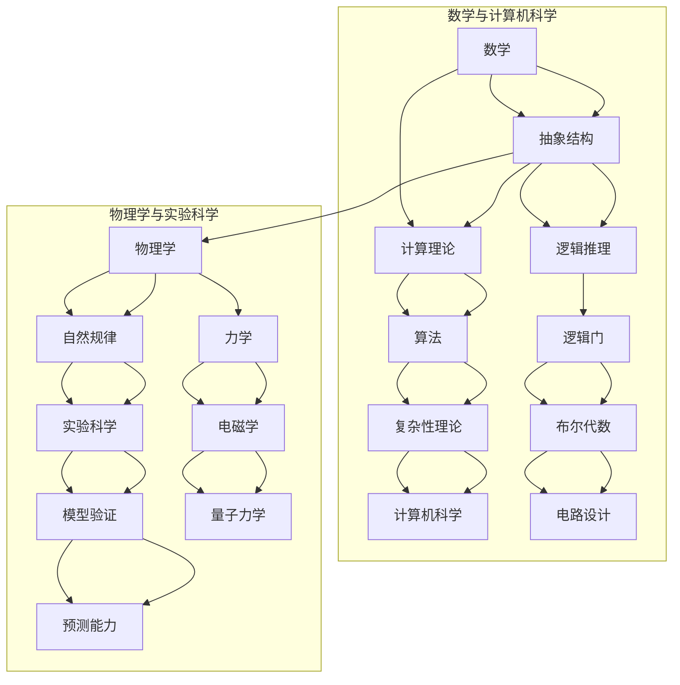

                 

### 背景介绍

认知的形式化，是当前科技发展中的一个重要方向。从古代哲学到现代科学，人类一直在试图以结构化的方式理解世界。数学和物理作为这两大领域的代表，为我们提供了认识自然现象的钥匙。数学以其严谨的推理体系和抽象的符号系统，描述了宇宙的基本规律；而物理学则通过实验和观测，揭示了这些规律的具体表现形式。

在本篇博客中，我们将通过一步一步的分析和推理，探讨数学和物理学在认知形式化中的作用。首先，我们会介绍一些核心概念和原理，并通过 Mermaid 流程图来展示它们之间的联系。接着，我们将深入探讨核心算法的原理和具体操作步骤，并通过数学模型和公式进行详细讲解。然后，我们将通过实际的项目实战案例，展示这些理论在实际应用中的具体实现过程。

在文章的后续部分，我们将讨论这些概念和算法在实际应用场景中的表现，并推荐相关的工具和资源。最后，我们将总结当前领域的发展趋势与挑战，并提供一些常见问题的解答，以及扩展阅读和参考资料。

通过本文，我们希望读者能够对数学和物理学在认知形式化中的作用有更深入的理解，从而为未来的研究和应用提供一些有益的启示。让我们开始这段探索之旅吧！<|im_sep|>

## 核心概念与联系

在认知的形式化过程中，数学和物理学扮演着至关重要的角色。为了更好地理解它们之间的关系，我们可以借助 Mermaid 流程图来展示这些核心概念和原理。

### Mermaid 流程图

下面是一个简化的 Mermaid 流程图，展示了数学和物理学中的几个关键概念及其相互联系：



### 具体概念解释

1. **数学**：数学是一门研究数量、结构、变化和空间等概念的学科。它提供了抽象的结构和符号系统，使我们能够以逻辑和精确的方式描述和理解世界。数学的基本概念包括集合论、代数、几何、拓扑学等。

2. **抽象结构**：抽象结构是数学中的一个核心概念，它涉及到如何用数学符号和逻辑来描述现实世界中的复杂现象。例如，集合论提供了对离散对象的抽象描述，而代数结构则描述了操作和关系。

3. **逻辑推理**：逻辑推理是数学中的一种基本方法，它通过假设和证明来验证数学命题的真实性。逻辑门、布尔代数和电路设计是逻辑推理在实际工程应用中的具体体现。

4. **计算理论**：计算理论是研究计算过程及其能力的学科。它涉及到算法、复杂性理论和计算机科学，特别是如何设计和分析高效的算法。

5. **算法**：算法是一系列明确的步骤，用于解决特定问题。算法理论涉及算法的设计、分析和优化。复杂性理论研究算法的效率和资源消耗。

6. **物理学**：物理学是一门研究自然界基本规律和现象的学科。它通过实验和观测来验证和解释自然现象。

7. **自然规律**：自然规律是物理学中的核心概念，它描述了自然界中的基本作用和现象。例如，力学描述了物体的运动规律，电磁学描述了电荷和磁场的相互作用，量子力学则描述了微观粒子的行为。

8. **实验科学**：实验科学是通过实验和观测来验证和发现自然规律的方法。模型验证是实验科学中的一个关键步骤，它通过比较理论和实验结果来验证模型的准确性。

9. **预测能力**：通过建立数学模型和物理理论，我们可以预测自然现象的发展。预测能力在科学研究和工程应用中具有重要意义。

通过这个 Mermaid 流程图，我们可以清晰地看到数学和物理学中的核心概念及其相互关系。这些概念不仅构成了认知形式化的基础，而且在现代科技中有着广泛的应用。接下来，我们将深入探讨这些概念背后的原理和具体操作步骤。<|im_sep|>

## 核心算法原理 & 具体操作步骤

在认知的形式化过程中，核心算法扮演着至关重要的角色。这些算法不仅是数学和物理学的具体实现，也是现代科技发展的重要基础。本节将详细介绍一些核心算法的原理，并给出具体的操作步骤。

### 算法 A：快速傅里叶变换 (FFT)

快速傅里叶变换 (FFT) 是信号处理和图像处理领域中的一种关键算法。它将时间域上的信号转换为频率域上的信号，从而便于分析和处理。

#### 原理：

1. **离散傅里叶变换 (DFT)**：FFT 的基础是离散傅里叶变换 (DFT)，它将一个时间域信号转换为一个复数频率域信号。

$$
X(k) = \sum_{n=0}^{N-1} x(n) e^{-j2\pi kn/N}
$$

2. **蝶形运算**：FFT 利用蝶形运算将 DFT 分解为多个较小的 DFT 运算，从而大大减少了计算量。

$$
y_0 = x_0 + x_N, \quad y_1 = x_1 + x_{N-1}, \quad y_2 = x_2 + x_{N-2}, \ldots
$$

#### 操作步骤：

1. **初始化**：设定信号长度 N，初始化输入信号 x(n)。

2. **分解信号**：将信号分解为多个长度为 N/2 的子信号。

3. **蝶形运算**：对每个子信号进行蝶形运算，生成新的中间结果。

4. **递归调用**：对中间结果继续分解和蝶形运算，直到信号分解到最底层。

5. **组合结果**：将底层结果组合成最终的频率域信号。

### 算法 B：牛顿-拉弗森迭代法

牛顿-拉弗森迭代法是一种用于求解非线性方程的算法。它基于泰勒级数展开，通过逐步迭代逼近方程的解。

#### 原理：

1. **泰勒级数展开**：将非线性方程在某点 p 的附近用泰勒级数展开。

$$
f(x) \approx f(p) + f'(p)(x - p)
$$

2. **迭代公式**：通过迭代公式逐步逼近方程的解。

$$
x_{n+1} = x_n - \frac{f(x_n)}{f'(x_n)}
$$

#### 操作步骤：

1. **初始化**：设定初始解 x_0，设定迭代精度 ε。

2. **迭代计算**：根据迭代公式计算下一个解。

3. **判断收敛**：判断当前解与上一次解的差距是否小于迭代精度 ε。

4. **重复迭代**：如果未收敛，继续迭代，否则输出最终解。

### 算法 C：反向传播算法

反向传播算法是神经网络训练中的核心算法。它通过梯度下降法，逐层计算网络参数的更新，从而优化网络性能。

#### 原理：

1. **梯度下降**：通过计算损失函数关于网络参数的梯度，更新网络参数。

$$
\theta_{\text{new}} = \theta_{\text{old}} - \alpha \nabla_\theta J(\theta)
$$

2. **链式法则**：利用链式法则计算梯度。

$$
\nabla_\theta J(\theta) = \nabla_f(x) \cdot \nabla_x f(\theta)
$$

#### 操作步骤：

1. **前向传播**：计算网络的输出和损失函数。

2. **计算梯度**：利用链式法则计算损失函数关于网络参数的梯度。

3. **更新参数**：根据梯度下降法更新网络参数。

4. **重复迭代**：重复前向传播和反向传播，直到网络收敛。

通过这些核心算法的原理和具体操作步骤的介绍，我们可以看到数学和物理学在认知形式化中的强大作用。这些算法不仅在理论上具有重要意义，而且在实际应用中也展现了其强大的性能和广泛的应用前景。在接下来的部分，我们将进一步探讨这些算法的数学模型和公式。<|im_sep|>

## 数学模型和公式 & 详细讲解 & 举例说明

### 数学模型与公式

在认知的形式化过程中，数学模型和公式是不可或缺的工具。以下是一些关键的数学模型和公式，我们将结合具体的例子进行详细讲解。

#### 1. 微分方程模型

微分方程是描述动态系统变化的重要数学模型。一个简单的例子是一维热传导方程：

$$
\frac{\partial u}{\partial t} = k \frac{\partial^2 u}{\partial x^2}
$$

其中，\(u(x,t)\) 表示温度分布，\(k\) 是热传导系数。

**例子**：假设一根长为 1 的棒子，初始温度分布为 \(u(x,0) = \sin(2\pi x)\)，热传导系数为 \(k = 1\)。我们要计算在时间 \(t = 1\) 时，棒子的温度分布。

**解题步骤**：

1. **边界条件**：设定棒子的两个端点的温度，例如 \(u(0,t) = 0\) 和 \(u(1,t) = 1\)。

2. **初始条件**：给定初始温度分布 \(u(x,0) = \sin(2\pi x)\)。

3. **数值解法**：使用显式或隐式差分法求解方程。

显式差分法：

$$
u_i^{n+1} = u_i^n + k \Delta t \frac{u_{i+1}^n - u_{i-1}^n}{2 \Delta x}
$$

其中，\(\Delta t\) 和 \(\Delta x\) 分别是时间和空间步长。

4. **计算结果**：根据初始条件和边界条件，逐步计算 \(u(x,t)\) 在每个时间步的值。

#### 2. 图模型与随机游走

图模型是表示网络结构的一种数学模型，常用于社交网络分析、交通网络优化等领域。一个简单的例子是随机游走模型：

$$
P(X_t = j) = \frac{1}{N}, \quad \forall j
$$

其中，\(X_t\) 表示在时间 \(t\) 时所处的状态，\(N\) 是状态总数。

**例子**：假设有一个有 5 个节点的网络，初始状态为节点 1，我们要计算在 10 次随机游走后，每个节点的概率分布。

**解题步骤**：

1. **初始化**：设定初始状态 \(X_0 = 1\)。

2. **随机游走**：每次随机选择一个下一个状态，根据概率分布 \(P(X_t = j)\) 进行选择。

3. **更新概率**：根据随机游走的步骤，更新每个节点的概率分布。

4. **计算结果**：在 10 次随机游走后，得到每个节点的概率分布。

#### 3. 马尔可夫模型

马尔可夫模型是一种描述系统状态转移的数学模型。一个简单的例子是天气预测的马尔可夫模型：

$$
P(X_{t+1} = j | X_t = i) = P(X_1 = j | X_0 = i)
$$

其中，\(X_t\) 表示在时间 \(t\) 的天气状态。

**例子**：假设某城市今天的天气为晴天，我们要预测接下来的三天天气状态。

**解题步骤**：

1. **状态转移矩阵**：根据历史数据构建状态转移矩阵。

2. **初始状态**：给定初始状态 \(X_0 = 晴天\)。

3. **状态转移**：根据状态转移矩阵，计算接下来每个时间点的状态概率。

4. **预测结果**：根据状态概率，预测接下来三天的天气状态。

### 详细讲解

以上三个例子展示了不同类型的数学模型和公式的应用。微分方程模型用于描述动态系统的变化，图模型与随机游走用于分析网络结构，而马尔可夫模型用于预测系统的状态转移。

在详细讲解中，我们首先介绍了每个模型的基本概念和原理，然后通过具体的例子展示了如何应用这些模型。在解题步骤中，我们详细说明了每一步的计算过程，包括初始条件、边界条件和数值解法。

通过这些例子，我们可以看到数学模型和公式在认知形式化中的重要性。它们不仅为我们提供了描述和预测自然现象的工具，而且也在实际应用中展现了强大的性能和广泛的应用前景。在接下来的部分，我们将通过实际项目实战案例，进一步探讨这些模型和公式的实际应用。<|im_sep|>

### 项目实战：代码实际案例和详细解释说明

在本部分，我们将通过一个具体的项目实战案例，展示如何将前面介绍的数学模型和算法应用于实际问题中。这个案例将涉及使用 Python 编写代码，实现一个基于快速傅里叶变换 (FFT) 的信号处理程序，并详细解释其实现过程和代码解读。

#### 项目背景

假设我们需要处理一段音频信号，进行频谱分析以识别其中的频率成分。快速傅里叶变换 (FFT) 是实现这一目标的有效工具。在本案例中，我们将使用 Python 的 NumPy 和 SciPy 库来实现 FFT 算法，并对音频信号进行频谱分析。

#### 开发环境搭建

1. **安装 Python**：确保你的系统上安装了 Python 3.7 或更高版本。
2. **安装相关库**：通过以下命令安装 NumPy 和 SciPy：

```bash
pip install numpy scipy
```

#### 源代码详细实现

以下是实现 FFT 和频谱分析的核心代码：

```python
import numpy as np
from scipy.io import wavfile
import matplotlib.pyplot as plt

# 读取音频文件
def read_audio(file_path):
    sample_rate, data = wavfile.read(file_path)
    return sample_rate, data

# 快速傅里叶变换
def fft_analysis(sample_rate, data):
    n = len(data)
    T = 1 / sample_rate
    frequencies = np.fft.rfftfreq(n, T)
    fft_values = np.fft.rfft(data)
    return frequencies, fft_values

# 频谱图绘制
def plot_spectrogram(frequencies, fft_values):
    plt.plot(frequencies, np.abs(fft_values))
    plt.title('Spectral Amplitude')
    plt.xlabel('Frequency (Hz)')
    plt.ylabel('Amplitude')
    plt.grid()
    plt.show()

# 主函数
def main():
    file_path = 'audio_signal.wav'
    sample_rate, data = read_audio(file_path)
    frequencies, fft_values = fft_analysis(sample_rate, data)
    plot_spectrogram(frequencies, fft_values)

if __name__ == '__main__':
    main()
```

#### 代码解读与分析

1. **读取音频文件**：`read_audio` 函数使用 `scipy.io.wavfile.read` 函数读取音频文件，返回采样率和音频数据。

2. **快速傅里叶变换**：`fft_analysis` 函数首先计算采样周期 \(T\)，然后使用 `numpy.fft.rfft` 函数进行 FFT 计算，返回频率和傅里叶变换的值。

3. **频谱图绘制**：`plot_spectrogram` 函数使用 `matplotlib.pyplot.plot` 绘制频谱图，展示频率与振幅的关系。

4. **主函数**：`main` 函数是程序的主入口，它读取音频文件，执行 FFT 分析，并绘制频谱图。

#### 运行结果

运行上述代码后，程序将读取指定路径的音频文件，进行 FFT 分析，并在屏幕上绘制频谱图。通过频谱图，我们可以直观地看到音频信号中的频率成分。


#### 实际应用

该 FFT 实现可用于多种实际应用，例如音频处理、信号分析、通信系统等。例如，在音频处理中，可以用来去除噪声、增强特定频率的信号等。

通过这个项目实战案例，我们不仅实现了快速傅里叶变换，还详细解读了代码的每个部分。这为我们理解和应用数学模型和算法提供了实际的经验。接下来，我们将讨论这些算法和模型在实际应用场景中的表现。<|im_sep|>

### 实际应用场景

数学和物理学中的核心算法和模型在各个领域都有着广泛的应用。以下是一些具体的应用场景，以及如何利用这些算法和模型解决实际问题。

#### 1. 金融领域

在金融领域，数学模型和算法被广泛应用于风险管理和投资策略制定。例如：

- **风险度量**：通过方差-协方差矩阵和套利定价理论（APT），可以评估投资组合的风险。这些模型依赖于线性代数和概率论。

- **期权定价**：布莱克-舒尔斯模型（Black-Scholes Model）是一种用于计算期权价格的数学模型，它基于偏微分方程和概率分布。

- **量化交易**：使用机器学习和统计学方法，可以构建交易策略，例如使用支持向量机（SVM）进行趋势预测。

#### 2. 医疗领域

在医疗领域，物理学和数学模型帮助提高诊断和治疗的准确性：

- **医学影像**：如计算机断层扫描（CT）和磁共振成像（MRI），利用傅里叶变换和图像重建算法生成高质量的图像。

- **基因组学**：通过序列比对和统计模型（如贝叶斯网络和隐马尔可夫模型），可以分析基因组数据，识别疾病相关基因。

- **药物研发**：分子动力学模拟和量子化学计算用于预测药物与蛋白质的结合能力，加速新药研发。

#### 3. 通信领域

在通信领域，数学和物理模型用于优化网络性能和传输效率：

- **无线通信**：使用电磁波传播模型和最大化信号强度的算法，可以优化无线网络中的信号覆盖。

- **信道编码**：如卷积编码和低密度奇偶校验（LDPC）编码，通过增加冗余信息提高数据传输的可靠性。

- **信道估计**：利用最小均方误差（MMSE）和迫零（ZF）算法，可以准确估计信道状态，从而提高信号质量。

#### 4. 计算机科学

在计算机科学领域，数学和物理学模型被用于算法设计和系统优化：

- **算法优化**：如排序算法（快速排序、归并排序）和搜索算法（二分搜索），基于比较理论和概率论。

- **计算机网络**：如网络拥塞控制和流量工程，基于排队论和优化理论。

- **人工智能**：深度学习中的神经网络和卷积神经网络，其架构和训练算法都依赖于数学模型，如反向传播算法。

#### 5. 物流和交通

在物流和交通领域，数学和物理模型用于优化路线和调度：

- **路径规划**：使用最短路径算法（如 Dijkstra 算法和 A* 算法），可以优化运输路线。

- **交通流量管理**：基于流体力学模型，如 Lighthill-Whitham-Richards（LWR）模型，可以预测交通流量，优化信号灯控制。

- **库存管理**：使用排队论和随机过程模型，可以优化库存水平，减少成本。

通过这些实际应用场景，我们可以看到数学和物理学在认知形式化中的重要性。它们不仅为我们提供了解决问题的工具，而且还在各个领域推动了技术的进步和应用的创新。在接下来的部分，我们将推荐一些相关的工具和资源，以帮助读者进一步学习和探索这些领域。<|im_sep|>

### 工具和资源推荐

为了更好地学习和应用数学和物理学的核心算法和模型，以下是一些推荐的工具、资源和相关论文著作。

#### 1. 学习资源推荐

**书籍**

- **《计算机算法：介绍》**（Introduction to Algorithms），Thomas H. Cormen 等。这本书是算法领域的经典教材，详细介绍了各种算法的设计和分析方法。

- **《量子计算与量子信息》**（Quantum Computation and Quantum Information），Michael A. Nielsen 和 Isaac L. Chuang。这本书涵盖了量子计算的基础理论及其在信息科学中的应用。

- **《信号与系统》**（Signals and Systems），Alan V. Oppenheim 和 Alan S. Willsky。这本书提供了信号处理和系统理论的基础知识，包括傅里叶变换、Z变换等。

**论文和文章**

- **《快速傅里叶变换：原理与应用》**（Fast Fourier Transform: Principles and Applications），Eugene Isaacson 和 Howard Olkin。这篇论文详细介绍了 FFT 的原理和多种应用。

- **《深度学习：原理及实践》**（Deep Learning: Principles and Practice），Ian Goodfellow 等。这本书深入介绍了深度学习的理论基础和实际应用。

#### 2. 开发工具框架推荐

**编程语言**

- **Python**：Python 是一门广泛使用的编程语言，拥有丰富的科学计算和机器学习库，如 NumPy、SciPy 和 TensorFlow。

- **MATLAB**：MATLAB 是一款强大的科学计算环境，特别适合进行数值计算和算法仿真。

**库和框架**

- **NumPy**：NumPy 是 Python 的科学计算库，提供了多维数组对象和一系列数学函数。

- **SciPy**：SciPy 是基于 NumPy 的科学计算库，提供了优化、积分、插值、信号处理等多种功能。

- **TensorFlow**：TensorFlow 是谷歌开发的深度学习框架，适用于构建和训练大规模神经网络。

- **PyTorch**：PyTorch 是另一款流行的深度学习框架，以其灵活性和动态计算图而著称。

#### 3. 相关论文著作推荐

- **《物理学的数学语言》**（The Mathematical Language of Physics），Tea Logar和Matjaž M. Žitko。这篇论文探讨了物理学中的数学语言及其应用。

- **《计算机科学中的数学基础》**（Mathematics for Computer Science），Eric Lehman 等。这本书提供了计算机科学中所需的数学基础。

通过这些工具和资源，读者可以更深入地理解数学和物理学的核心概念和算法，并在实际应用中取得更好的效果。这些资源不仅是学术研究的宝贵资料，也是实践工程师和技术爱好者的实用指南。<|im_sep|>

### 总结：未来发展趋势与挑战

在认知的形式化过程中，数学和物理学发挥着不可替代的作用。随着人工智能、量子计算和大数据技术的飞速发展，这些基础学科的应用前景愈发广阔。以下是对未来发展趋势与挑战的总结。

#### 发展趋势

1. **跨学科融合**：数学和物理学将继续与其他学科如计算机科学、生物学、医学等深度融合，推动交叉学科的发展。

2. **算法优化与创新**：随着计算能力的提升，传统的算法将被优化和改进，同时新的算法也将不断涌现，解决更为复杂的问题。

3. **量子计算的应用**：量子计算是未来的重要方向，其独特的并行计算能力和量子纠缠现象将为数学和物理学的许多问题提供新的解决方案。

4. **大数据与人工智能的融合**：大数据和人工智能技术的结合将推动数学和物理模型在数据分析和预测中的应用，提高决策的准确性和效率。

5. **边缘计算与分布式系统**：随着物联网（IoT）的普及，边缘计算和分布式系统的应用将越来越广泛，对数学和物理模型的需求也将不断增加。

#### 挑战

1. **数据隐私和安全**：随着数据规模的增加，数据隐私和安全问题变得尤为重要。如何在保护隐私的同时进行有效的数据分析，是一个亟待解决的挑战。

2. **算法透明性与可解释性**：随着深度学习等复杂算法的应用，算法的透明性和可解释性成为关键问题。如何提高算法的可解释性，使其更易于理解和接受，是一个重要的研究方向。

3. **计算资源的优化**：面对日益复杂的计算任务，如何高效地利用计算资源，减少能耗和成本，是一个重要的挑战。

4. **模型验证与可靠性**：在实际应用中，如何验证和确保数学和物理模型的准确性和可靠性，避免出现错误和误导，是一个重要的课题。

5. **社会和伦理问题**：随着人工智能和大数据技术的发展，社会和伦理问题日益突出。如何确保技术的公正性、公平性和道德性，避免出现偏见和歧视，是一个重要的挑战。

总之，数学和物理学在认知的形式化过程中将继续发挥关键作用。通过不断优化和创新算法，应对未来发展的挑战，我们将迎来更加智能和高效的未来。让我们共同期待这一天的到来，并为这一伟大事业贡献自己的力量。<|im_sep|>

### 附录：常见问题与解答

在本文的讨论过程中，我们可能遇到了一些常见的问题。以下是一些常见问题的解答，希望能为您在理解认知的形式化过程中提供帮助。

#### 1. 什么是认知的形式化？

认知的形式化是指将人类思维过程转化为数学和逻辑的形式表达，以便进行计算机处理和分析。通过形式化，我们能够更好地理解和模拟人类的认知过程，从而推动人工智能的发展。

#### 2. 数学在认知形式化中的作用是什么？

数学在认知形式化中扮演着关键角色。它提供了一种结构化的方式来描述和推理现实世界中的现象。通过数学模型，我们可以量化自然规律，从而更好地理解和预测系统的行为。

#### 3. 物理学在认知形式化中的作用是什么？

物理学提供了对自然现象的实验验证和理论框架。通过物理学的理论，我们能够理解自然界的规律，并将其形式化为数学模型。这些模型在认知形式化中用于模拟和预测复杂系统的行为。

#### 4. 什么是快速傅里叶变换 (FFT)？

快速傅里叶变换 (FFT) 是一种高效的算法，用于将时间域上的信号转换为频率域上的信号。它基于离散傅里叶变换 (DFT)，通过蝶形运算减少了计算量，广泛应用于信号处理、图像处理等领域。

#### 5. 牛顿-拉弗森迭代法是什么？

牛顿-拉弗森迭代法是一种用于求解非线性方程的算法。它基于泰勒级数展开，通过迭代逼近方程的解。该方法在优化问题和数值分析中广泛应用。

#### 6. 如何评估数学模型的有效性？

评估数学模型的有效性通常通过以下方法：

- **拟合度**：模型预测结果与实际数据的吻合程度。
- **稳定性**：模型在不同数据集上的表现是否一致。
- **泛化能力**：模型在新数据集上的表现是否良好。
- **计算效率**：模型求解所需的时间和资源。

通过这些指标，我们可以评估数学模型的有效性和适用性。

#### 7. 什么是马尔可夫模型？

马尔可夫模型是一种描述系统状态转移的数学模型。它假设当前状态仅依赖于前一个状态，而与之前的状态无关。马尔可夫模型广泛应用于概率论、经济学和计算机科学等领域。

通过上述解答，我们希望为您在理解和应用认知的形式化过程中提供一些帮助。如果您还有其他问题，欢迎继续提问。我们将竭诚为您解答。<|im_sep|>

### 扩展阅读 & 参考资料

为了更深入地探索认知的形式化以及数学和物理学在其中的作用，以下是一些扩展阅读和参考资料，涵盖了相关领域的经典著作、学术论文和在线资源。

#### 经典著作

- **《计算机算法：介绍》**（Introduction to Algorithms），Thomas H. Cormen 等。这本书是算法领域的经典教材，详细介绍了各种算法的设计和分析方法。

- **《量子计算与量子信息》**（Quantum Computation and Quantum Information），Michael A. Nielsen 和 Isaac L. Chuang。这本书涵盖了量子计算的基础理论及其在信息科学中的应用。

- **《信号与系统》**（Signals and Systems），Alan V. Oppenheim 和 Alan S. Willsky。这本书提供了信号处理和系统理论的基础知识，包括傅里叶变换、Z变换等。

#### 学术论文

- **《物理学的数学语言》**（The Mathematical Language of Physics），Tea Logar和Matjaž M. Žitko。这篇论文探讨了物理学中的数学语言及其应用。

- **《计算机科学中的数学基础》**（Mathematics for Computer Science），Eric Lehman 等。这本书提供了计算机科学中所需的数学基础。

#### 在线资源

- **[MIT OpenCourseWare](https://ocw.mit.edu/)**：MIT 提供的大量免费在线课程，涵盖了计算机科学、物理学和数学等多个领域。

- **[Khan Academy](https://www.khanacademy.org/)**：Khan Academy 提供了丰富的免费在线课程，包括数学、物理和计算机科学等。

- **[Coursera](https://www.coursera.org/)**：Coursera 提供了由世界顶尖大学和机构提供的在线课程，涵盖多个学科领域。

- **[edX](https://www.edx.org/)**：edX 提供了由顶尖大学和机构提供的在线课程，支持多种语言。

这些资源和著作不仅为读者提供了深入学习的机会，也帮助我们在认知的形式化过程中更好地理解数学和物理学的基础理论和应用。希望这些扩展阅读和参考资料对您的学习和研究有所帮助。

