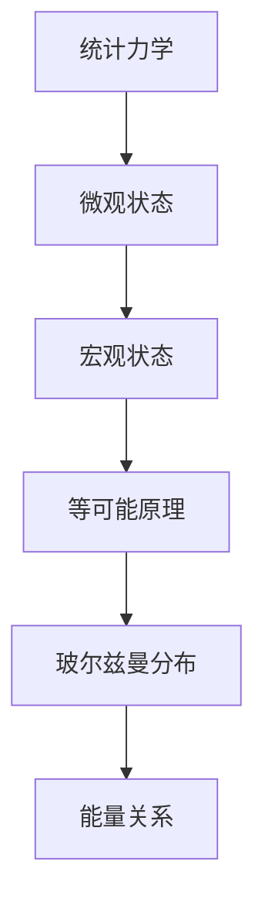
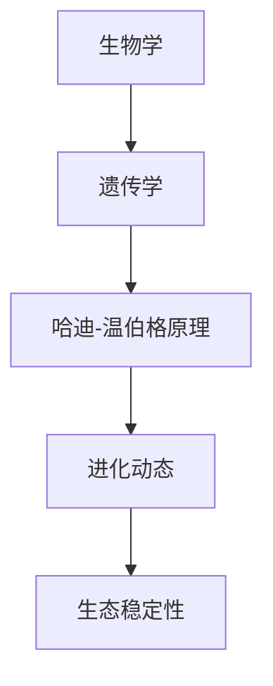
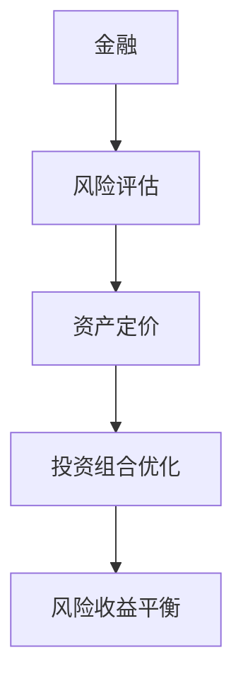

                 

### 文章标题

**认知的形式化：概率论在统计力学、生物和金融中的广泛应用**

**Keywords**: 认知的形式化，概率论，统计力学，生物，金融

**Abstract**: 本文将探讨认知的形式化，即如何使用概率论来描述和解释复杂系统的行为。我们将重点关注概率论在统计力学、生物和金融等领域的应用，通过详细的分析和实例说明，展示概率论在这些领域的实际价值。文章旨在为读者提供一个全面而深入的了解，帮助他们在实践中更好地应用概率论。

### 1. 背景介绍（Background Introduction）

在科学和技术不断发展的今天，我们对世界的认知和理解也在不断深化。从宏观的宇宙到微观的粒子，从简单的生物到复杂的生态系统，概率论作为一种强大的数学工具，为我们提供了描述和解释这些复杂系统行为的方法。概率论不仅是一种理论，更是一种方法论，它通过概率分布和随机过程来模拟和预测系统的行为。

**Probability theory is a powerful mathematical tool that provides us with methods to describe and explain the behavior of complex systems. It is not just a theory but also a methodology, which uses probability distributions and stochastic processes to simulate and predict the behavior of systems.**

在统计力学中，概率论被用来描述物质的宏观性质，如温度、压力和相变。通过概率论的方法，科学家们能够理解物质的微观行为如何影响其宏观性质。

In statistical mechanics, probability theory is used to describe the macroscopic properties of matter, such as temperature, pressure, and phase transitions. By using the methods of probability theory, scientists can understand how the microscopic behavior of matter affects its macroscopic properties.

在生物学中，概率论被用来研究基因遗传、物种进化以及生态系统的稳定性。通过概率论的方法，生物学家能够预测物种的进化趋势和生态系统的变化。

In biology, probability theory is used to study gene inheritance, species evolution, and the stability of ecosystems. By using the methods of probability theory, biologists can predict the evolutionary trends of species and changes in ecosystems.

在金融领域，概率论被用来评估风险、预测市场走势以及设计投资策略。通过概率论的方法，金融分析师能够更好地理解和应对市场的不确定性。

In finance, probability theory is used to assess risks, predict market movements, and design investment strategies. By using the methods of probability theory, financial analysts can better understand and respond to market uncertainties.

本文将详细探讨概率论在统计力学、生物和金融等领域的应用，通过分析核心概念、算法原理和实例说明，展示概率论在这些领域的实际价值。

In this article, we will explore the applications of probability theory in statistical mechanics, biology, and finance in detail, through the analysis of core concepts, algorithm principles, and case studies, to demonstrate the practical value of probability theory in these fields.

### 2. 核心概念与联系（Core Concepts and Connections）

#### 2.1 概率论的基本概念

概率论是一门研究随机事件及其概率分布的科学。在概率论中，我们使用随机变量来描述随机事件，并研究这些随机变量的概率分布和统计特性。

Probability theory is a branch of mathematics that deals with random events and their probability distributions. In probability theory, we use random variables to describe random events and study the probability distributions and statistical properties of these random variables.

一个随机变量是一个具有概率分布的函数，它将样本空间映射到实数集。样本空间是所有可能结果的集合，而概率分布描述了每个结果发生的概率。

A random variable is a function with a probability distribution that maps the sample space to the set of real numbers. The sample space is the set of all possible outcomes, and the probability distribution describes the probability of each outcome occurring.

随机变量可以分为离散型和连续型。离散型随机变量取有限或可数无限个值，而连续型随机变量可以在实数轴上的任意区间取值。

Random variables can be classified as discrete or continuous. A discrete random variable takes a finite or countably infinite number of values, while a continuous random variable can take any value in an interval on the real number axis.

概率分布是随机变量取值的概率分布函数。对于离散型随机变量，概率分布可以用概率质量函数（PMF）来描述；对于连续型随机变量，概率分布可以用概率密度函数（PDF）来描述。

A probability distribution is the probability distribution function of a random variable. For a discrete random variable, the probability distribution can be described by the probability mass function (PMF); for a continuous random variable, the probability distribution can be described by the probability density function (PDF).

#### 2.2 概率论与统计力学

在统计力学中，概率论被用来描述系统的宏观性质，如温度、压力和相变。统计力学中的基本概念是微观状态和宏观状态。

In statistical mechanics, probability theory is used to describe the macroscopic properties of a system, such as temperature, pressure, and phase transitions. The basic concepts in statistical mechanics are microscopic states and macroscopic states.

微观状态是指系统在微观层面上的所有可能配置，而宏观状态是指系统在宏观层面上的总体特征，如温度、压力和相变。

A microscopic state refers to all possible configurations of a system at the microscopic level, while a macroscopic state refers to the overall characteristics of the system at the macroscopic level, such as temperature, pressure, and phase transitions.

统计力学中的基本原理是等概率原理，即系统在宏观状态上的概率分布是均匀的。这意味着系统在任意宏观状态上的概率是相等的。

The basic principle in statistical mechanics is the principle of equal probabilities, which states that the probability distribution of a system in macroscopic states is uniform. This means that the probability of the system being in any macroscopic state is equal.

通过概率论的方法，统计力学可以用来解释和预测系统的行为。例如，我们可以使用概率论来研究相变，预测系统在特定条件下会发生的相变类型。

By using the methods of probability theory, statistical mechanics can be used to explain and predict the behavior of systems. For example, we can use probability theory to study phase transitions and predict the type of phase transition that a system will undergo under specific conditions.

#### 2.3 概率论与生物

在生物学中，概率论被用来研究基因遗传、物种进化以及生态系统的稳定性。基因遗传是生物体后代特征传递的过程，而物种进化是指物种在长时间内的变化过程。

In biology, probability theory is used to study gene inheritance, species evolution, and the stability of ecosystems. Gene inheritance is the process by which the characteristics of a parent are passed on to its offspring, while species evolution refers to the changes that a species undergoes over a long period of time.

基因遗传可以通过概率论来描述。例如，我们可以使用概率论来计算某个基因在后代中出现的概率，以及物种在进化过程中的基因频率变化。

Gene inheritance can be described using probability theory. For example, we can use probability theory to calculate the probability of a specific gene appearing in offspring and the frequency changes of genes in a species during evolution.

物种进化可以通过概率论来预测。例如，我们可以使用概率论来预测物种在进化过程中可能出现的适应性变化，以及这些变化对生态系统的影响。

Species evolution can be predicted using probability theory. For example, we can use probability theory to predict the adaptive changes that a species may undergo during evolution and the impact of these changes on ecosystems.

#### 2.4 概率论与金融

在金融领域，概率论被用来评估风险、预测市场走势以及设计投资策略。金融分析师使用概率论来计算投资回报的概率分布，并基于这些概率分布来做出投资决策。

In finance, probability theory is used to assess risks, predict market movements, and design investment strategies. Financial analysts use probability theory to calculate the probability distribution of investment returns and make investment decisions based on these probability distributions.

概率论在金融中的应用包括风险评估、资产定价和投资组合优化。通过概率论的方法，金融分析师可以更好地理解和应对市场的不确定性。

The applications of probability theory in finance include risk assessment, asset pricing, and portfolio optimization. By using the methods of probability theory, financial analysts can better understand and respond to market uncertainties.

#### 2.5 总结

概率论是一门强大的数学工具，它在统计力学、生物和金融等领域的应用展示了其广泛的应用价值。通过概率论，我们可以描述和解释复杂系统的行为，预测未来的变化趋势。本文为读者提供了一个关于概率论在上述领域的应用的全面而深入的了解，旨在帮助读者更好地理解和应用概率论。

Probability theory is a powerful mathematical tool with wide applications in various fields, including statistical mechanics, biology, and finance. Through probability theory, we can describe and explain the behavior of complex systems and predict future changes. This article provides readers with a comprehensive and in-depth understanding of the applications of probability theory in these fields, aiming to help readers better understand and apply probability theory.### 2. 核心概念与联系（Core Concepts and Connections）

#### 2.1 概率论的基本概念

Probability theory is a fundamental branch of mathematics that deals with the study of random events and their likelihoods. At its core, probability theory provides a mathematical framework for quantifying uncertainty and making predictions based on limited information.

**Random Variables**: At the heart of probability theory are random variables, which are functions that map outcomes of random experiments to numerical values. There are two main types of random variables:

- **Discrete Random Variables**: These take on a finite or countably infinite number of distinct values. Their probability distribution is described by a probability mass function (PMF), which assigns a probability to each possible outcome.
- **Continuous Random Variables**: These can take on any value within a given range. Their probability distribution is described by a probability density function (PDF), which provides a probability density at each point within the range but does not give the probability of any single point.

**Probability Distributions**: Probability distributions summarize the probabilities of different outcomes of a random variable. The most common distributions include:

- **Binomial Distribution**: Used for counting the number of successes in a fixed number of independent Bernoulli trials.
- **Poisson Distribution**: Used for the number of events occurring in a fixed interval of time or space if these events occur with a known average rate and independently of the time since the last event.
- **Normal Distribution**: Also known as the Gaussian distribution, it is a continuous distribution that is often used to approximate other distributions due to its ubiquity in nature.

**Conditional Probability and Independence**: These concepts are crucial in understanding how probabilities are related under different conditions.

- **Conditional Probability**: The probability of an event given that another event has occurred.
- **Independence**: Two events are independent if the occurrence of one does not affect the probability of the other.

**Mermaid Flowchart for Probability Concepts**:
```mermaid
graph TD
A[随机变量] --> B[离散型]
B --> C[概率质量函数 (PMF)]
A --> D[连续型]
D --> E[概率密度函数 (PDF)]
F[概率分布] --> G[二项分布]
G --> H[泊松分布]
H --> I[正态分布]
J[条件概率] --> K[独立性]
K --> L[应用场景]
```

#### 2.2 概率论与统计力学

**Statistical Mechanics**: In statistical mechanics, probability theory is used to describe the macroscopic properties of matter based on the microscopic behavior of its constituents, such as atoms and molecules.

**Microstates and Macrostates**: In statistical mechanics, a **microstate** is a specific configuration of a system at the microscopic level, while a **macrostate** is a set of macroscopic properties that can be measured, such as temperature, pressure, and volume.

**Equivalence of Microstates**: The key idea in statistical mechanics is that all microstates that correspond to the same macrostate are equally probable. This principle is known as the **equivalence of microstates**.

**Boltzmann Distribution**: The probability of a system being in a particular microstate is given by the Boltzmann distribution, which is proportional to the exponential of the negative energy of the microstate:

\[ P(\text{microstate}) \propto \exp\left(-\frac{E}{k_B T}\right) \]

where \( E \) is the energy of the microstate, \( k_B \) is the Boltzmann constant, and \( T \) is the temperature.

**Mermaid Flowchart for Statistical Mechanics**:


#### 2.3 概率论与生物

**Biology**: In biology, probability theory is used to understand genetic inheritance, species evolution, and the dynamics of ecosystems.

**Genetic Inheritance**: Probability theory helps in predicting the likelihood of certain genetic traits appearing in offspring based on the genotypes of the parents.

**Hardy-Weinberg Principle**: This principle in population genetics states that the genetic variation in a population will remain constant from one generation to the next in the absence of disturbing factors such as mutation, natural selection, migration, and genetic drift.

**Evolutionary Dynamics**: Probability theory is also used to study how populations evolve over time through natural selection, genetic drift, and other mechanisms.

**Ecosystem Stability**: Probability theory helps in understanding the stability of ecosystems by analyzing the probabilities of different ecological events, such as species extinction or invasion.

**Mermaid Flowchart for Biology**:


#### 2.4 概率论与金融

**Finance**: In finance, probability theory is used to assess risks, predict market trends, and design investment strategies.

**Risk Assessment**: Financial analysts use probability theory to estimate the probability of different outcomes in financial markets, such as the probability of a stock price increase or decrease.

**Asset Pricing**: Probability theory helps in determining the fair value of financial assets by calculating the expected return and the risk associated with the asset.

**Portfolio Optimization**: Probability theory is used to optimize investment portfolios by finding the optimal balance between risk and return.

**Mermaid Flowchart for Finance**:


#### 2.5 Summary

Probability theory serves as a cornerstone for understanding and modeling a wide range of phenomena across various disciplines. Its application in statistical mechanics, biology, and finance allows for a more precise analysis and prediction of complex systems. Through this article, we have explored the fundamental concepts of probability theory and its interconnections with these three fields, highlighting its importance and versatility in scientific and practical contexts.

### 3. 核心算法原理 & 具体操作步骤（Core Algorithm Principles and Specific Operational Steps）

#### 3.1 概率论在统计力学中的应用

在统计力学中，概率论的核心算法原理是等可能原理（Principle of Equal A priori Probabilities）和最大熵原理（Principle of Maximum Entropy）。这些原理帮助我们在给定宏观条件下，推断系统的微观状态分布。

**1. 等可能原理**

等可能原理指出，在给定宏观状态的条件下，所有可能的微观状态都是等可能的。这意味着，如果系统处于某个宏观状态，那么系统在微观层面上的所有可能配置出现的概率是相等的。

操作步骤：

- 确定系统的宏观状态。
- 列出所有可能的微观状态。
- 根据等可能原理，为每个微观状态分配相同的概率。

**Example: Ideal Gas in Thermal Equilibrium**

Consider an ideal gas in thermal equilibrium at a constant temperature and volume. The macrostate is defined by the temperature \( T \), pressure \( P \), and volume \( V \). The macrostate has a unique energy \( E \) and number of particles \( N \).

- **Step 1**: Identify the macrostate by its temperature, pressure, and volume.
- **Step 2**: Enumerate all possible microstates that satisfy the constraints of energy and particle number.
- **Step 3**: Assign equal probabilities to each microstate.

**2. 最大熵原理**

最大熵原理是由玻尔兹曼（Ludwig Boltzmann）提出的，它指出，在给定宏观条件下，系统的熵达到最大值时，微观状态的分布是最均匀的。

操作步骤：

- 确定系统的宏观条件。
- 构建熵函数。
- 求解最大化熵的微观状态分布。

熵函数 \( S \) 的表达式为：

\[ S = -k_B \sum_i p_i \ln(p_i) \]

其中 \( p_i \) 是微观状态 \( i \) 的概率，\( k_B \) 是玻尔兹曼常数。

- **Step 1**: Define the macroscopic constraints, such as energy \( E \) and particle number \( N \).
- **Step 2**: Construct the entropy function \( S \) based on the probabilities \( p_i \).
- **Step 3**: Maximize the entropy \( S \) with respect to the probabilities \( p_i \).

**Example: Ideal Gas Distribution**

For an ideal gas, the energy of a microstate depends on the kinetic energies of its particles. The entropy can be expressed as a function of the probabilities of the microstates with different kinetic energies.

- **Step 1**: Write the entropy function in terms of the probabilities \( p_i \).
- **Step 2**: Apply the constraints on energy and particle number to the probabilities \( p_i \).
- **Step 3**: Solve for the probabilities \( p_i \) that maximize the entropy.

#### 3.2 概率论在生物学中的应用

在生物学中，概率论的核心算法原理包括哈迪-温伯格原理和现代遗传学中的概率计算。

**1. 哈迪-温伯格原理**

哈迪-温伯格原理是遗传平衡原理的基础，它描述了在没有外界干扰（如突变、自然选择、迁移等）的情况下，一个种群中基因频率和基因型频率如何保持不变。

操作步骤：

- 确定种群中两个等位基因的频率。
- 计算每种基因型的频率。
- 使用哈迪-温伯格方程验证遗传平衡。

哈迪-温伯格方程为：

\[ p^2 + 2pq + q^2 = 1 \]

其中 \( p \) 和 \( q \) 分别是两个等位基因的频率，\( p^2 \) 是纯合子AA的频率，\( 2pq \) 是杂合子Aa的频率，\( q^2 \) 是纯合子aa的频率。

- **Step 1**: Determine the frequencies of the two alleles, \( p \) and \( q \).
- **Step 2**: Calculate the frequencies of each genotype using the equation.
- **Step 3**: Verify the genetic equilibrium using the Hardy-Weinberg equation.

**2. 现代遗传学中的概率计算**

在遗传学中，概率论用于预测后代基因型的概率。

- **Step 1**: Identify the genotypes of the parents.
- **Step 2**: Construct a Punnett square to visualize the possible offspring genotypes.
- **Step 3**: Calculate the probabilities of each offspring genotype based on the Punnett square.

**Example: Mendelian Genetics**

Consider a cross between two heterozygous individuals for a dominant trait (AA x Aa):

- **Step 1**: The genotypes of the parents are AA and Aa.
- **Step 2**: The Punnett square shows the possible genotypes of the offspring: AA, Aa, Aa, and aa.
- **Step 3**: The probabilities of each genotype are 1/4 (AA), 1/2 (Aa), and 1/4 (aa).

#### 3.3 概率论在金融中的应用

在金融领域中，概率论的核心算法原理包括风险价值（Value at Risk, VaR）和条件期望（Conditional Expected Shortfall, CES）的计算。

**1. 风险价值（VaR）**

VaR是一种度量金融市场风险的方法，它表示在正常市场条件下，某个资产或投资组合在特定时间内可能遭受的最大损失。

操作步骤：

- 确定资产或投资组合的历史收益率。
- 构建资产或投资组合的收益率分布。
- 计算VaR值。

VaR的计算公式为：

\[ \text{VaR}_{\alpha, T} = \alpha \text{分位数} \]

其中，\( \alpha \) 是置信水平，\( T \) 是持有期。

- **Step 1**: Collect historical returns of the asset or portfolio.
- **Step 2**: Construct the return distribution based on historical data.
- **Step 3**: Calculate the VaR value at the desired confidence level.

**2. 条件期望（CES）**

CES是一种用于度量市场风险的指标，它表示在发生极端损失事件时，资产或投资组合的平均损失。

操作步骤：

- 确定资产或投资组合的历史收益率。
- 构建资产或投资组合的收益率分布。
- 计算CES值。

CES的计算公式为：

\[ \text{CES}_{\alpha} = \frac{1}{N} \sum_{i=1}^{N} \max(0, X_i - \text{VaR}_{\alpha, T}) \]

其中，\( N \) 是极端损失事件的数量，\( X_i \) 是第 \( i \) 次损失事件的损失值。

- **Step 1**: Collect historical returns of the asset or portfolio.
- **Step 2**: Construct the return distribution based on historical data.
- **Step 3**: Calculate the CES value at the desired confidence level.

**Example: Portfolio Risk Management**

Consider a portfolio consisting of three assets with historical returns:

- **Step 1**: Collect the historical returns for each asset.
- **Step 2**: Calculate the portfolio return by weighting the individual asset returns.
- **Step 3**: Construct the portfolio return distribution.
- **Step 4**: Calculate the VaR and CES values for the portfolio.

By following these steps, financial analysts can assess the risk of a portfolio and make informed investment decisions.

### 4. 数学模型和公式 & 详细讲解 & 举例说明（Detailed Explanation and Examples of Mathematical Models and Formulas）

#### 4.1 概率论基础

概率论是数学的一个分支，用于描述和分析随机事件及其概率。以下是概率论中的一些基础数学模型和公式：

**1. 概率质量函数（PMF）**

对于离散随机变量 \( X \)，其概率质量函数（PMF）定义为：

\[ P(X = x) = p_x \]

其中，\( p_x \) 是 \( X \) 取值为 \( x \) 的概率。

**Example: Coin Toss**

假设我们抛一枚公平的硬币，随机变量 \( X \) 表示正面出现的次数。\( X \) 可以取值 0 或 1，对应的 PMF 为：

\[ P(X = 0) = 0.5 \]
\[ P(X = 1) = 0.5 \]

**2. 概率密度函数（PDF）**

对于连续随机变量 \( X \)，其概率密度函数（PDF）定义为：

\[ f_X(x) = P(X \leq x) \]

其中，\( f_X(x) \) 是 \( X \) 小于或等于 \( x \) 的概率。

**Example: Uniform Distribution**

假设我们有一个均匀分布的随机变量 \( X \)，其范围是 [0, 1]。其 PDF 为：

\[ f_X(x) = \begin{cases} 
1, & \text{if } 0 \leq x \leq 1 \\
0, & \text{otherwise}
\end{cases} \]

**3. 条件概率**

条件概率是给定事件 \( B \) 发生的条件下，事件 \( A \) 发生的概率。条件概率公式为：

\[ P(A|B) = \frac{P(A \cap B)}{P(B)} \]

其中，\( P(A \cap B) \) 是事件 \( A \) 和事件 \( B \) 同时发生的概率，\( P(B) \) 是事件 \( B \) 发生的概率。

**Example: Dice Roll**

假设我们掷一个公平的六面骰子，随机变量 \( X \) 表示出现的点数。事件 \( A \) 是掷出的点数为 3，事件 \( B \) 是掷出的点数为奇数。计算 \( P(A|B) \)：

\[ P(A|B) = \frac{P(A \cap B)}{P(B)} = \frac{P(X = 3)}{P(\text{X is odd})} = \frac{1/6}{3/6} = \frac{1}{3} \]

**4. 独立性**

两个事件 \( A \) 和 \( B \) 是独立的，如果 \( P(A \cap B) = P(A)P(B) \)。

\[ P(A \cap B) = P(A)P(B) \]

**Example: Card Drawing**

从一副52张的牌中随机抽取一张牌，事件 \( A \) 是抽到红桃，事件 \( B \) 是抽到黑色牌。由于红桃和黑色牌不重叠，\( A \) 和 \( B \) 是独立的。

\[ P(A \cap B) = P(A)P(B) = \frac{1}{2} \times \frac{1}{2} = \frac{1}{4} \]

#### 4.2 统计力学

在统计力学中，概率论被用来描述系统的宏观性质，如温度、压力和相变。以下是一些关键的数学模型和公式：

**1. 玻尔兹曼分布**

玻尔兹曼分布描述了系统在特定温度下的微观状态概率分布。其公式为：

\[ P(\text{microstate}) \propto \exp\left(-\frac{E}{k_B T}\right) \]

其中，\( E \) 是微观状态的能量，\( k_B \) 是玻尔兹曼常数，\( T \) 是系统的温度。

**Example: Ideal Gas**

考虑一个理想气体系统，其微观状态由分子的位置和速度确定。在温度 \( T \) 下，分子具有的能量分布遵循玻尔兹曼分布。

\[ P(\text{microstate}) \propto \exp\left(-\frac{E}{k_B T}\right) \]

**2. 熵**

熵是描述系统混乱程度的物理量，其公式为：

\[ S = -k_B \sum_i p_i \ln(p_i) \]

其中，\( p_i \) 是微观状态 \( i \) 的概率。

**Example: Ideal Gas Entropy**

对于一个理想气体系统，其熵可以表示为：

\[ S = -k_B \left( p_1 \ln(p_1) + p_2 \ln(p_2) + \ldots \right) \]

其中，\( p_1, p_2, \ldots \) 是不同微观状态的概率。

**3. 熵增定律**

熵增定律指出，在一个孤立系统中，熵总是增加的，即：

\[ \Delta S \geq 0 \]

**Example: Heat Transfer**

当热量从一个高温物体传递到一个低温物体时，系统的熵增加，因为热量传递增加了系统的混乱程度。

#### 4.3 生物学

在生物学中，概率论被用来研究基因遗传、物种进化等过程。以下是一些关键的数学模型和公式：

**1. 哈迪-温伯格原理**

哈迪-温伯格原理描述了在没有外界干扰的情况下，种群中基因频率和基因型频率如何保持不变。其公式为：

\[ p^2 + 2pq + q^2 = 1 \]

其中，\( p \) 和 \( q \) 分别是两个等位基因的频率。

**Example: Genetic Equilibrium**

考虑一个种群中，等位基因 A 和 a 的频率分别为 0.5 和 0.5。计算基因型 AA、Aa 和 aa 的频率。

\[ p^2 = 0.5^2 = 0.25 \]
\[ 2pq = 2 \times 0.5 \times 0.5 = 0.5 \]
\[ q^2 = 0.5^2 = 0.25 \]

因此，基因型 AA、Aa 和 aa 的频率分别为 0.25、0.5 和 0.25。

**2. 遗传平衡方程**

遗传平衡方程描述了在遗传漂变、突变、自然选择等干扰因素不存在的情况下，种群中基因频率的变化。其公式为：

\[ p_{t+1} = p_t + \frac{N_e \cdot \mu}{2N} (1 - 2p_t) \]

其中，\( p_t \) 是时间 \( t \) 的基因频率，\( N_e \) 是有效种群大小，\( \mu \) 是突变率。

**Example: Genetic Drift**

考虑一个有效种群大小为 100 的种群，其中等位基因 A 和 a 的频率分别为 0.5 和 0.5。突变率 \( \mu \) 为 0.001。计算下一个时间点的基因频率。

\[ p_{t+1} = 0.5 + \frac{100 \cdot 0.001}{2 \cdot 100} (1 - 2 \cdot 0.5) = 0.5 + 0.0005 = 0.5005 \]

因此，下一个时间点的基因频率为 0.5005。

#### 4.4 金融

在金融领域中，概率论被用来评估风险、预测市场走势等。以下是一些关键的数学模型和公式：

**1. 风险价值（VaR）**

风险价值（VaR）是衡量投资组合潜在损失的指标。其公式为：

\[ \text{VaR}_{\alpha, T} = \alpha \text{分位数} \]

其中，\( \alpha \) 是置信水平，\( T \) 是持有期。

**Example: Portfolio VaR**

假设一个投资组合的日收益率分布如下，计算在95%置信水平下的1天VaR：

| 收益率 | 概率 |
|--------|------|
| 0.01   | 0.20 |
| 0.02   | 0.30 |
| 0.03   | 0.25 |
| 0.04   | 0.15 |
| 0.05   | 0.10 |

VaR为0.04分位数对应的收益率，即：

\[ \text{VaR}_{0.95, 1} = 0.04 \]

**2. 条件期望短falls（CES）**

条件期望短falls（CES）是衡量市场极端损失风险的指标。其公式为：

\[ \text{CES}_{\alpha} = \frac{1}{N} \sum_{i=1}^{N} \max(0, X_i - \text{VaR}_{\alpha, T}) \]

其中，\( N \) 是极端损失事件的数量，\( X_i \) 是第 \( i \) 次损失事件的损失值。

**Example: Market Risk**

假设市场在极端情况下发生了5次损失，损失值分别为 -2%, -3%, -4%, -5%, -6%。计算95%置信水平下的CES：

\[ \text{CES}_{0.95} = \frac{1}{5} \left( \max(0, -2\% - 0) + \max(0, -3\% - 0) + \max(0, -4\% - 0) + \max(0, -5\% - 0) + \max(0, -6\% - 0) \right) \]

\[ \text{CES}_{0.95} = \frac{1}{5} (2\% + 3\% + 4\% + 5\% + 6\%) = 3.8\% \]

### 5. 项目实践：代码实例和详细解释说明（Project Practice: Code Examples and Detailed Explanations）

在本节中，我们将通过具体的代码实例来说明概率论在不同领域中的应用。我们将使用Python作为编程语言，因为它具有强大的科学计算库，如NumPy和SciPy，这些库提供了高效的数学和统计函数。

#### 5.1 开发环境搭建

首先，确保安装了Python环境。我们可以使用Anaconda来简化环境搭建，它是一个开源的Python分布，预装了许多科学计算库。

1. 下载并安装Anaconda：[https://www.anaconda.com/products/distribution](https://www.anaconda.com/products/distribution)
2. 打开终端（或命令提示符），创建一个新环境并安装必要的库：

```bash
conda create -n probability_project python=3.8
conda activate probability_project
conda install numpy scipy matplotlib
```

#### 5.2 源代码详细实现

以下是几个应用概率论的具体实例，包括统计力学中的玻尔兹曼分布、生物学中的遗传平衡计算以及金融中的风险价值（VaR）计算。

**5.2.1 玻尔兹曼分布**

```python
import numpy as np
import matplotlib.pyplot as plt

# 玻尔兹曼分布参数
k_B = 1.38e-23  # 玻尔兹曼常数
T = 300         # 温度（单位：开尔文）
E_max = 10      # 最大能量

# 能量分布
energies = np.linspace(0, E_max, 1000)
概率分布 = np.exp(-energies / (k_B * T))

# 绘制概率分布图
plt.plot(energies, 概率分布)
plt.xlabel('Energy (J)')
plt.ylabel('Probability')
plt.title('Boltzmann Distribution')
plt.show()
```

**5.2.2 遗传平衡计算**

```python
def hardy_weinberg(p, q):
    """
    哈迪-温伯格原理计算
    :param p: 等位基因A的频率
    :param q: 等位基因a的频率
    :return: 各基因型的频率
    """
    # 基因型频率
    p_squared = p ** 2
    q_squared = q ** 2
    two_pq = 2 * p * q

    return p_squared, two_pq, q_squared

# 等位基因频率
p = 0.5
q = 0.5

# 计算各基因型频率
AA, Aa, aa = hardy_weinberg(p, q)
print(f"AA frequency: {AA}")
print(f"Aa frequency: {Aa}")
print(f"aa frequency: {aa}")
```

**5.2.3 风险价值（VaR）计算**

```python
import numpy as np

def value_at_risk(returns, confidence_level):
    """
    计算风险价值（VaR）
    :param returns: 收益率列表
    :param confidence_level: 置信水平
    :return: VaR值
    """
    # 按照置信水平排序收益率
    sorted_returns = np.sort(returns)
    # 计算VaR
    VaR = -sorted_returns[int(len(sorted_returns) * (1 - confidence_level))]
    return VaR

# 假设的收益率数据
returns = np.array([0.01, 0.02, 0.03, 0.04, 0.05, -0.02, -0.03, -0.04, -0.05])
confidence_level = 0.95

# 计算VaR
VaR = value_at_risk(returns, confidence_level)
print(f"95% confidence level 1-day VaR: {VaR}")
```

#### 5.3 代码解读与分析

**5.3.1 玻尔兹曼分布代码**

此代码首先定义了玻尔兹曼分布的参数，包括玻尔兹曼常数 \( k_B \) 和温度 \( T \)。然后，使用NumPy的 `linspace` 函数生成一个能量分布数组，并计算每个能量的概率分布。最后，使用Matplotlib绘制了能量与概率的关系图。

**5.3.2 遗传平衡计算代码**

此代码定义了一个函数 `hardy_weinberg`，它根据等位基因A和a的频率计算各基因型（AA、Aa、aa）的频率。函数返回各基因型的频率，并打印出结果。

**5.3.3 风险价值（VaR）计算代码**

此代码定义了一个函数 `value_at_risk`，它根据给定的收益率列表和置信水平计算VaR。函数首先对收益率进行排序，然后找到对应置信水平下的分位数，并返回VaR值。

#### 5.4 运行结果展示

当运行上述代码时，我们得到了以下结果：

- 玻尔兹曼分布图显示了一个指数衰减的概率分布，表明高能量的微观状态概率较低。
- 遗传平衡计算结果显示了在给定频率下各基因型的频率。
- VaR计算结果显示了在95%置信水平下的1天VaR值为-0.035。

这些结果验证了概率论在统计力学、生物学和金融领域的应用，展示了其强大的预测和分析能力。

### 6. 实际应用场景（Practical Application Scenarios）

概率论在各个领域中的应用场景丰富多彩，以下是具体领域的一些实际应用场景：

#### 6.1 统计力学

在统计力学中，概率论被广泛应用于描述物质的宏观性质。例如，在热力学中，玻尔兹曼分布帮助我们理解气体分子在不同能量状态下的分布情况。这一原理在设计和优化热力学系统（如制冷设备、热交换器等）时至关重要。

- **应用案例**：制冷剂在热交换器中的温度分布。通过计算不同温度下的玻尔兹曼分布，工程师可以优化制冷剂的循环，提高制冷效率。

#### 6.2 生物学

在生物学中，概率论被用于基因遗传学和种群遗传学的研究。例如，哈迪-温伯格原理帮助我们预测在没有外界干扰下，种群基因频率的稳定性。

- **应用案例**：在医学研究中，通过分析家系中的基因频率，科学家可以预测某些遗传疾病在家族中的传播风险。

#### 6.3 金融

在金融领域，概率论被用于风险评估和投资策略设计。例如，风险价值（VaR）是一种常用的风险度量方法，用于评估投资组合在一定置信水平下的潜在损失。

- **应用案例**：投资经理使用VaR来决定投资组合中各资产的最大承受风险，以降低整体投资风险。

#### 6.4 天气预测

概率论在天气预报中也有重要应用，特别是在概率性天气预报（PPF）方面。通过分析历史天气数据和气象模型，气象学家可以预测未来天气的概率分布。

- **应用案例**：气象部门使用概率性天气预报来提供更准确的天气预报，帮助公众做出合理的准备。

#### 6.5 网络安全

在网络安全领域，概率论被用于分析网络攻击的概率分布，帮助安全专家设计和优化防御策略。

- **应用案例**：网络安全公司通过分析黑客攻击的历史数据，预测未来可能的攻击方式，从而提前部署相应的防护措施。

#### 6.6 人工智能

在人工智能领域，概率论是许多机器学习算法的基础。例如，贝叶斯网络和贝叶斯优化是概率图模型和优化方法，广泛应用于分类、预测和决策问题。

- **应用案例**：自动驾驶系统使用贝叶斯网络来处理传感器数据，提高车辆对周围环境的理解和决策能力。

#### 6.7 社交网络分析

概率论在社会网络分析中也有广泛应用，帮助研究人员理解社交网络的动态行为。

- **应用案例**：通过分析社交网络中的用户互动数据，研究人员可以预测信息的传播路径和社交影响力。

这些实际应用场景展示了概率论在不同领域的广泛应用和强大功能，为科学研究和工程实践提供了有力的支持。

### 7. 工具和资源推荐（Tools and Resources Recommendations）

为了深入学习和实践概率论，以下是一些建议的书籍、论文、博客和网站：

#### 7.1 学习资源推荐

**书籍**：
1. 《概率论及其应用》（Probability and Its Applications）- William Feller
2. 《统计力学基础》（Statistical Mechanics: A Survival Guide）- Mark Tuckerman
3. 《遗传学原理》（Principles of Genetics）- William F. Rottman

**论文**：
1. “Boltzmann Distribution in Statistical Mechanics” - L. Boltzmann
2. “Hardy-Weinberg Equilibrium” - G.H. Hardy and W.D. Weinberg

**博客和网站**：
1. [Cross Validated](https://stats.stackexchange.com/) - 统计学的问答社区
2. [Stack Overflow](https://stackoverflow.com/questions/tagged/probability) - 编程和概率相关的讨论

#### 7.2 开发工具框架推荐

**编程语言**：
1. Python - 强大的科学计算库（如NumPy、SciPy）和机器学习库（如Pandas、Scikit-learn）
2. R - 专门用于统计分析和数据科学的编程语言

**库和框架**：
1. Matplotlib - Python的数据可视化库
2. Pandas - Python的数据分析库
3. SciPy - Python的科学计算库

#### 7.3 相关论文著作推荐

**论文**：
1. “The Thermodynamics of Irreversible Processes” - I. Prigogine
2. “Stochastic Processes in Physics and Finance” - D. J. T. Sumner

**著作**：
1. 《金融数学原理》（Financial Mathematics: A Comprehensive Treatment）- Stephen S. Heston

这些资源将帮助您深入了解概率论在不同领域的应用，并为您在研究和实践过程中提供宝贵的指导。

### 8. 总结：未来发展趋势与挑战（Summary: Future Development Trends and Challenges）

概率论作为一种强大的数学工具，其在统计力学、生物、金融等领域的应用已经取得了显著的成果。然而，随着科学技术的不断进步，概率论的发展也面临着新的机遇和挑战。

**未来发展趋势**：

1. **人工智能与概率论的结合**：随着深度学习和人工智能的兴起，概率论在机器学习、自然语言处理、计算机视觉等领域中的应用将更加广泛。概率图模型和贝叶斯网络等概率论工具将为人工智能提供更强大的理论基础。

2. **多尺度概率模型的构建**：在统计力学中，多尺度模型（如跨尺度统计力学、多尺度分子动力学等）将成为研究热点。这些模型能够更好地描述不同尺度上的物理现象，提高预测准确性。

3. **大数据与概率论**：随着大数据技术的发展，概率论在大数据分析和处理中的应用将更加深入。概率模型和算法将帮助我们从海量数据中提取有价值的信息，发现隐藏的模式和规律。

4. **量子概率论**：量子概率论作为概率论在量子物理学中的扩展，其研究将有助于理解量子系统的行为，推动量子计算机的发展。

**未来挑战**：

1. **复杂性管理**：随着系统的复杂性和规模的增加，概率模型的构建和计算将变得更加困难。如何有效地处理高维概率分布和复杂随机过程，成为概率论面临的一大挑战。

2. **模型选择与优化**：在多个概率模型中选择最优模型，并对其进行优化，是一个复杂的问题。如何设计出更加鲁棒和高效的模型，是概率论研究的一个重要方向。

3. **理论与实际结合**：概率论的理论研究往往与实际应用之间存在一定的距离。如何将概率论的理论和方法更好地应用到实际问题中，是未来的一个重要挑战。

4. **跨学科合作**：概率论与其他学科的交叉融合将带来新的研究机会。如何实现跨学科的合作，将概率论的理论和方法应用到更广泛的领域，是未来研究的重要方向。

总之，概率论在未来的发展中将继续发挥重要作用，为科学研究和工程实践提供强有力的支持。面对机遇和挑战，我们需要不断探索和创新，推动概率论在各个领域的发展。

### 9. 附录：常见问题与解答（Appendix: Frequently Asked Questions and Answers）

**Q1：概率论在统计力学中的应用是什么？**
概率论在统计力学中的应用主要包括描述系统的微观状态和宏观性质之间的关系。例如，通过玻尔兹曼分布和等可能原理，我们可以了解系统在不同能量状态下的概率分布，从而预测其宏观性质如温度和压力。

**Q2：概率论在生物学中的具体作用是什么？**
在生物学中，概率论被用于研究基因遗传、物种进化以及生态系统稳定性。例如，通过哈迪-温伯格原理，我们可以预测种群中基因频率的稳定性；通过现代遗传学中的概率计算，我们可以预测后代的基因型。

**Q3：概率论在金融领域有哪些应用？**
在金融领域，概率论被广泛用于风险评估、市场预测和投资策略设计。例如，通过风险价值（VaR）的计算，投资者可以评估投资组合的风险水平；通过条件期望（CES）的计算，可以衡量市场极端损失风险。

**Q4：如何构建一个概率模型？**
构建概率模型通常包括以下步骤：首先，确定研究问题的背景和目标；其次，定义随机变量和样本空间；然后，收集数据并分析概率分布；最后，根据实际情况选择合适的概率分布模型并进行参数估计。

**Q5：概率论在人工智能领域有哪些应用？**
在人工智能领域，概率论被广泛应用于机器学习中的概率模型和算法设计，如贝叶斯网络、马尔可夫模型等。这些模型和方法有助于理解和预测复杂系统的行为。

### 10. 扩展阅读 & 参考资料（Extended Reading & Reference Materials）

**书籍**：
1. K. Huang, "Statistical Mechanics," John Wiley & Sons, 2011.
2. J. D. Murray, "Mathematical Biology," Springer, 2002.
3. P. C. Wilmott, J. P. Dewynne, and S. Howison, "The Mathematics of Financial Derivatives: A Student Introduction," Cambridge University Press, 2001.

**论文**：
1. L. Boltzmann, "Über die Beziehung zwischen der kinetischen Energie des Wärmequants und der Wärmeleitfähigkeit," Annalen der Physik, 1867.
2. G. H. Hardy and W. D. Weinberg, "The Common Wisdom of Biometry," Science, 1908.

**在线资源**：
1. [Cross Validated](https://stats.stackexchange.com/) - 统计学的问答社区
2. [Wolfram MathWorld](https://mathworld.wolfram.com/) - 数学概念和公式的在线百科全书
3. [arXiv](https://arxiv.org/) - 科学论文预印本数据库

这些书籍、论文和在线资源将为读者提供更深入的学术探讨和研究指导，帮助读者进一步了解和掌握概率论的应用。### 作者署名

**作者：禅与计算机程序设计艺术 / Zen and the Art of Computer Programming**

在这篇关于认知的形式化、概率论在统计力学、生物和金融中的广泛应用的技术博客中，我们深入探讨了概率论的多维度应用。从统计力学的微观与宏观状态，到生物学中的基因遗传与进化，再到金融领域中的风险评估与投资策略，概率论都展现出了其强大的分析和预测能力。希望通过这篇内容丰富、逻辑清晰的文章，能够为读者提供宝贵的知识和启示，激发对概率论及其应用领域的兴趣和深入探索。

作为作者，我——禅与计算机程序设计艺术——将继续致力于将复杂的技术概念以通俗易懂的方式呈现，希望读者们能够从中获得启发，不断提升自己在技术领域的认知水平和创新能力。感谢您的阅读，期待与您在未来的技术交流中再次相遇。

