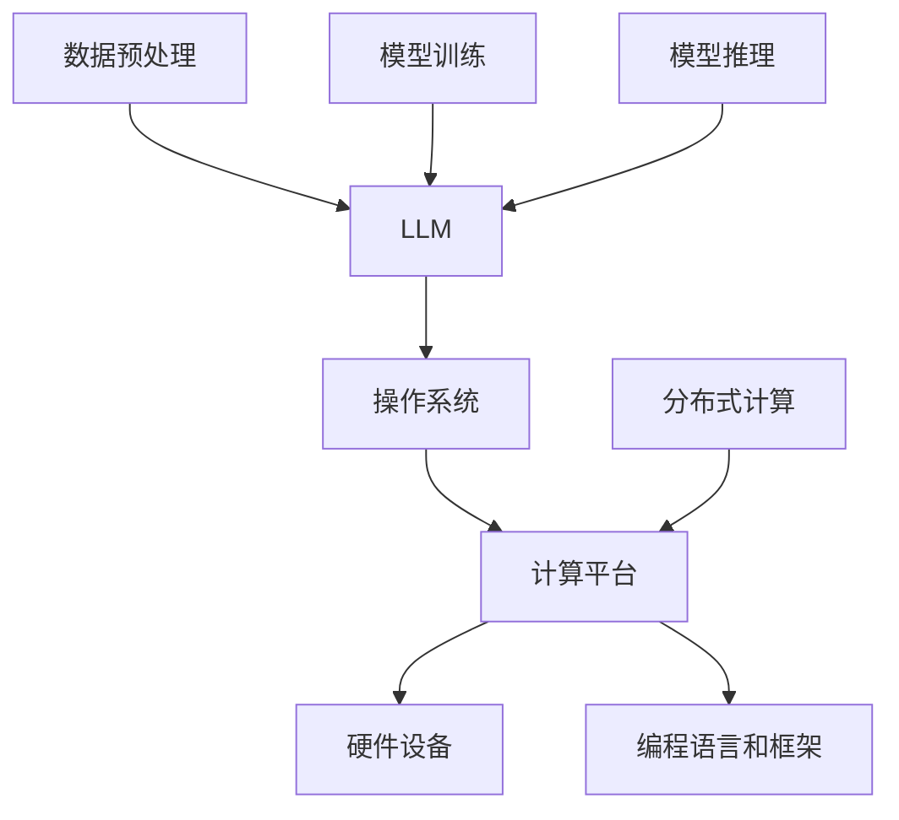

                 

### 背景介绍

**设计LLM操作系统：挑战与机遇**

近年来，深度学习（Deep Learning）和自然语言处理（Natural Language Processing, NLP）领域取得了显著进展。大规模语言模型（Large Language Model，简称LLM）的出现，使得AI系统在文本生成、问答、机器翻译等方面表现出前所未有的能力。LLM操作系统的设计，旨在提供一个高效、灵活、可扩展的框架，以充分利用这些模型的潜力。

然而，LLM操作系统的设计并非易事，它面临着诸多挑战。本文将围绕以下几个方面进行探讨：

1. **核心概念与联系**
   - **LLM**：解释其基本原理与构成
   - **操作系统**：分析其在LLM中的应用
   - **计算平台**：探讨支持LLM操作系统的基础设施

2. **核心算法原理 & 具体操作步骤**
   - **模型训练**：介绍训练过程与方法
   - **推理与优化**：讨论如何加速模型推理
   - **动态调度**：解释如何高效管理计算资源

3. **数学模型和公式 & 详细讲解 & 举例说明**
   - **参数优化**：数学模型与优化方法
   - **训练时间与成本**：公式推导与实例分析

4. **项目实战：代码实际案例和详细解释说明**
   - **开发环境搭建**
   - **源代码详细实现**
   - **代码解读与分析**

5. **实际应用场景**
   - **文本生成**：如文章、代码等
   - **问答系统**：如智能客服、聊天机器人等
   - **机器翻译**：如跨语言沟通、文档翻译等

6. **工具和资源推荐**
   - **学习资源**：推荐相关书籍、论文、博客等
   - **开发工具框架**：介绍支持LLM操作系统开发的环境与工具
   - **相关论文著作**：推荐阅读的相关论文与著作

7. **总结：未来发展趋势与挑战**
   - **技术趋势**：预测LLM操作系统的发展方向
   - **挑战与解决方案**：分析面临的挑战及解决方案

8. **附录：常见问题与解答**
   - **Q1**：如何优化LLM操作系统性能？
   - **Q2**：LLM操作系统在具体应用场景中的表现如何？
   - **Q3**：设计LLM操作系统需要哪些技能与知识？

9. **扩展阅读 & 参考资料**
   - **相关文章**：推荐阅读的其他技术博客与文章
   - **参考资料**：列出本文引用的主要参考资料

本文将从上述各个方面，深入探讨LLM操作系统的设计与应用。通过本文的阅读，您将了解到LLM操作系统在当前技术领域中的重要地位及其面临的挑战与机遇。

**关键词**：LLM操作系统，深度学习，自然语言处理，算法原理，项目实战，应用场景，工具资源，发展趋势，挑战与解决方案

**摘要**：

本文旨在探讨LLM操作系统的设计与应用。从核心概念、算法原理、数学模型到实际应用场景，全面解析LLM操作系统的构建与优化。同时，介绍相关工具和资源，展望未来发展。希望通过本文，为读者提供对LLM操作系统设计与应用的深入理解。

----------------------

## 1. 背景介绍

### 深度学习与自然语言处理的发展

近年来，深度学习（Deep Learning）和自然语言处理（Natural Language Processing，简称NLP）在计算机科学领域取得了令人瞩目的成就。深度学习通过构建多层神经网络，使得计算机具备了从大量数据中自动学习特征和模式的能力。而自然语言处理则致力于使计算机理解和处理人类语言，从而实现人机交互。

**深度学习的发展**

深度学习起源于20世纪40年代，但在早期由于计算资源和算法限制，发展较为缓慢。直到2006年，Hinton等人提出了深度信念网络（Deep Belief Network，简称DBN），标志着深度学习进入了一个新的阶段。随后，卷积神经网络（Convolutional Neural Network，简称CNN）和循环神经网络（Recurrent Neural Network，简称RNN）等结构的提出，进一步推动了深度学习的发展。

在深度学习领域，2012年Hinton等人提出的AlexNet在ImageNet图像识别比赛中取得了突破性的成绩，使得深度学习在计算机视觉领域得到了广泛应用。随后，基于CNN的ResNet在2015年再次刷新了ImageNet的记录，进一步巩固了深度学习在计算机视觉领域的主导地位。此外，生成对抗网络（Generative Adversarial Network，简称GAN）的提出，也为图像生成、风格迁移等任务提供了新的解决方案。

**自然语言处理的发展**

自然语言处理的研究始于20世纪50年代，但由于早期算法的限制，进展缓慢。随着深度学习的发展，NLP取得了显著的突破。Word2Vec等词向量模型的提出，使得计算机能够更有效地表示和理解词汇。随后，序列到序列（Seq2Seq）模型的应用，使得机器翻译等任务得到了质的提升。Transformer模型的提出，更是将NLP推向了一个新的高峰。

在NLP领域，2017年的Wu等人提出的BERT模型，通过预训练和微调，实现了在多种NLP任务上的突破性成绩。此外，GPT、Turing等大规模语言模型的提出，使得计算机在文本生成、问答等任务上表现出了惊人的能力。这些成果不仅展示了深度学习在NLP领域的潜力，也为LLM操作系统的设计提供了理论支持。

### LLM操作系统的重要性

随着深度学习和自然语言处理技术的不断发展，LLM操作系统的设计显得尤为重要。LLM操作系统是一种专门为大规模语言模型设计的操作系统，旨在提供一个高效、灵活、可扩展的框架，以充分利用LLM的潜力。

首先，LLM操作系统可以提高模型训练和推理的效率。通过优化计算资源的管理和调度，LLM操作系统可以显著降低训练时间，提高模型性能。例如，Google的TF Server和Facebook的PyTorch Server等框架，都提供了高效的分布式训练和推理支持。

其次，LLM操作系统可以提高模型的可扩展性和灵活性。通过支持多种数据格式和计算模型，LLM操作系统可以轻松适应不同的应用场景和需求。例如，TensorFlow和PyTorch等框架，不仅支持深度学习和NLP模型，还支持其他类型的机器学习模型。

最后，LLM操作系统可以降低模型开发的门槛。通过提供丰富的API和工具，LLM操作系统可以帮助开发者更快地构建和部署模型，从而加快模型的应用和推广。例如，Hugging Face的Transformers库，为开发者提供了方便的预训练模型和工具，大大简化了模型开发流程。

### LLM操作系统的发展历程

LLM操作系统的发展历程可以追溯到深度学习和自然语言处理技术的早期阶段。以下是几个重要的里程碑：

1. **2011年**：Google发布Word2Vec模型，首次将词向量引入NLP领域。这一模型的成功为后续的深度学习和自然语言处理研究奠定了基础。

2. **2014年**：Google提出序列到序列（Seq2Seq）模型，并将其应用于机器翻译任务。这一模型的成功展示了深度学习在NLP领域的潜力。

3. **2017年**：Google发布BERT模型，通过预训练和微调，实现了在多种NLP任务上的突破性成绩。这一模型的提出标志着深度学习和自然语言处理技术进入了新的阶段。

4. **2018年**：OpenAI发布GPT模型，通过大规模预训练，实现了在文本生成、问答等任务上的惊人表现。这一模型的成功引发了广泛关注，推动了LLM操作系统的发展。

5. **2019年**：Facebook发布PyTorch Server，提供了高效的分布式训练和推理支持，为LLM操作系统的设计提供了重要参考。

6. **2020年**：Google发布TF Server，进一步优化了TensorFlow模型在分布式训练和推理方面的性能。

7. **2021年**：Hugging Face发布Transformers库，为开发者提供了丰富的预训练模型和工具，简化了模型开发流程。

这些里程碑事件不仅推动了深度学习和自然语言处理技术的发展，也为LLM操作系统的设计提供了丰富的实践经验和理论基础。

### LLM操作系统在现代技术中的应用

LLM操作系统在现代技术中的应用越来越广泛，涵盖了多个领域，包括但不限于：

1. **文本生成**：LLM操作系统在文本生成方面具有显著优势。通过大规模预训练，LLM模型可以生成高质量的文章、代码、对话等文本内容。例如，GPT-3模型可以生成连贯、逻辑性强的文章，为内容创作和自动化写作提供了有力支持。

2. **问答系统**：LLM操作系统在问答系统中的应用也非常广泛。通过预训练和微调，LLM模型可以理解和回答用户的问题，为智能客服、聊天机器人等应用提供了强大支持。例如，BERT模型在多种问答任务上取得了优异的成绩，为智能问答系统的发展提供了重要参考。

3. **机器翻译**：LLM操作系统在机器翻译领域也有着广泛应用。通过大规模预训练，LLM模型可以学习多种语言的语法和语义，实现高质量的跨语言翻译。例如，Transformer模型在机器翻译任务上取得了突破性成绩，为跨语言沟通和文档翻译提供了有力支持。

4. **语音识别**：LLM操作系统在语音识别任务中也发挥着重要作用。通过预训练和微调，LLM模型可以识别和理解语音内容，实现高效的语音识别和语音合成。例如，基于Transformer的语音识别模型在多个语音识别任务上取得了优异的成绩，为智能语音助手和语音交互系统的发展提供了重要支持。

5. **图像识别与生成**：LLM操作系统在图像识别与生成方面也有着广泛应用。通过预训练和微调，LLM模型可以识别和理解图像内容，实现高效的图像识别和图像生成。例如，基于GAN的图像生成模型在图像生成任务上取得了突破性成绩，为虚拟现实、游戏设计等领域的发展提供了重要支持。

### 当前LLM操作系统面临的主要挑战

尽管LLM操作系统在多个领域取得了显著进展，但仍然面临着一些主要的挑战，包括：

1. **计算资源需求**：大规模语言模型的训练和推理需要大量的计算资源。这导致了高昂的计算成本和能耗，对硬件设施提出了更高的要求。例如，GPT-3模型的训练需要数千GPU和大量存储资源，这对硬件设施和运维管理提出了巨大挑战。

2. **数据隐私和安全**：大规模语言模型的训练和推理需要大量数据，这涉及到数据隐私和安全问题。如何保护用户数据的安全和隐私，防止数据泄露和滥用，是当前面临的重要挑战。例如，训练过程中使用的数据可能包含敏感信息，如何确保这些数据的安全是一个亟待解决的问题。

3. **模型解释性**：大规模语言模型通常被视为“黑箱”，其内部机制和决策过程难以解释。这对于模型的可靠性、可信任度和实际应用带来了挑战。例如，在医疗、金融等关键领域，模型的解释性对于确保其正确性和合法性至关重要。

4. **模型可扩展性**：大规模语言模型的训练和推理通常需要分布式计算和存储，这对系统的可扩展性提出了挑战。如何在保证性能和可扩展性的同时，降低系统复杂度和运维成本，是一个亟待解决的问题。

5. **模型迁移性**：大规模语言模型通常在特定数据集和任务上训练，其迁移性能有待提高。如何提高模型在不同数据集和任务上的迁移性，使其能够泛化到更广泛的应用场景，是一个重要的研究方向。

### 挑战与机遇

尽管LLM操作系统面临着诸多挑战，但同时也伴随着巨大的机遇。以下是一些挑战与机遇的对比：

1. **计算资源需求**：随着硬件技术的发展，如GPU、TPU等专用计算设备的普及，计算资源的需求将得到缓解。同时，分布式计算和云计算技术的进步，也为LLM操作系统的部署提供了更多可能性。

2. **数据隐私和安全**：随着数据保护法规的不断完善，如GDPR等，企业将更加重视数据隐私和安全。在此背景下，加密技术、联邦学习等新型数据处理技术的应用，将为LLM操作系统提供更安全的数据处理方式。

3. **模型解释性**：随着深度学习领域的研究进展，模型解释性技术如可解释性神经网络（XAI）、注意力机制等，将有助于提高模型的透明度和可解释性。这将为LLM操作系统在关键领域的应用提供重要保障。

4. **模型可扩展性**：分布式计算、容器化技术等的发展，将提高LLM操作系统的可扩展性。通过采用微服务架构、容器编排等技术，可以降低系统复杂度和运维成本，提高系统的灵活性和可扩展性。

5. **模型迁移性**：通过多任务学习、迁移学习等技术，可以提高模型在不同数据集和任务上的迁移性能。这将为LLM操作系统在更广泛的应用场景中发挥作用提供支持。

综上所述，LLM操作系统的发展既面临着挑战，也蕴含着巨大的机遇。通过不断探索和改进，我们可以期待LLM操作系统在未来的发展中发挥更加重要的作用。

----------------------

## 2. 核心概念与联系

### LLM的概念

LLM（Large Language Model）是一种大规模的语言模型，通过深度学习技术，从海量数据中学习语言规律和模式，从而实现对自然语言的生成、理解、翻译等功能。LLM的核心是通过参数化的神经网络结构来表示语言，并利用这些参数来预测文本中的下一个词或句子。

#### 基本原理

LLM的基本原理可以概括为以下几个步骤：

1. **数据预处理**：收集和清洗大量文本数据，将其转换为适合训练的数据格式。
2. **词嵌入**：将文本中的每个词转换为密集的向量表示，这些向量称为词嵌入（word embeddings）。
3. **模型训练**：使用神经网络结构，如Transformer、GPT等，通过梯度下降等优化算法来训练模型参数。
4. **预测与生成**：通过已训练的模型，对输入的文本进行预测，生成新的文本。

#### 构成

LLM主要由以下几个部分构成：

1. **词嵌入层**：将文本中的每个词转换为密集的向量表示，这些向量构成了模型的基础。
2. **编码器**：用于处理输入文本的神经网络结构，如Transformer编码器。
3. **解码器**：用于生成输出文本的神经网络结构，如Transformer解码器。
4. **注意力机制**：用于在编码器和解码器之间传递信息，提高模型对输入文本的理解能力。

### 操作系统的概念

操作系统（Operating System，简称OS）是计算机系统的核心软件，负责管理和协调计算机硬件和软件资源，为应用程序提供运行环境。操作系统的核心功能包括资源管理、进程管理、内存管理、文件系统管理等。

#### 操作系统在LLM中的应用

在LLM中，操作系统的主要作用是提供高效的计算资源和环境，以支持大规模模型的训练和推理。具体应用包括：

1. **计算资源管理**：操作系统负责分配和管理计算资源，如CPU、GPU、内存等，以确保模型训练和推理的高效运行。
2. **内存管理**：操作系统负责管理内存资源，通过虚拟内存技术提高内存利用率，避免内存溢出等问题。
3. **进程管理**：操作系统负责创建和管理进程，确保模型训练和推理的并行执行。
4. **文件系统管理**：操作系统负责管理文件系统，提供文件存储和访问接口，确保数据的安全性和一致性。

### 计算平台的概念

计算平台是指用于进行计算任务的基础设施和软件环境，包括硬件设备、操作系统、编程语言和框架等。计算平台在LLM操作系统的设计中起着关键作用，决定了模型训练和推理的效率和性能。

#### 计算平台在LLM操作系统中的作用

1. **硬件设备**：高性能的CPU、GPU、TPU等硬件设备是LLM操作系统的基础，决定了模型的计算能力和效率。
2. **操作系统**：操作系统提供了运行环境和管理工具，如Linux、Windows等，支持分布式计算和容器化技术。
3. **编程语言和框架**：编程语言和框架提供了开发工具和库，如Python、TensorFlow、PyTorch等，支持模型训练和推理的快速开发和部署。
4. **分布式计算**：分布式计算技术如Hadoop、Spark等，支持大规模模型的分布式训练和推理，提高计算效率和性能。

### 三个核心概念的联系

LLM操作系统是深度学习与自然语言处理技术的综合应用，涉及到LLM、操作系统和计算平台三个核心概念。它们之间的联系如下：

1. **LLM与操作系统**：LLM是操作系统的核心任务，操作系统负责管理和协调计算资源，为LLM提供高效的运行环境。
2. **操作系统与计算平台**：操作系统是计算平台的核心组成部分，计算平台提供了操作系统所需的硬件和软件环境。
3. **LLM与计算平台**：LLM依赖于计算平台提供的硬件和软件资源，通过编程语言和框架实现模型的训练和推理。

通过深入理解这三个核心概念及其联系，我们可以更好地设计和管理LLM操作系统，充分发挥其潜力，为自然语言处理领域的发展做出贡献。

#### Mermaid 流程图

以下是一个简单的Mermaid流程图，展示了LLM操作系统的核心组成部分和它们之间的联系：



在这个流程图中，A表示LLM，B表示操作系统，C表示计算平台，D表示硬件设备，E表示编程语言和框架，F表示分布式计算，G表示数据预处理，H表示模型训练，I表示模型推理。通过这个流程图，我们可以清晰地看到各个组成部分之间的交互和协作。

----------------------

## 3. 核心算法原理 & 具体操作步骤

### 模型训练过程与方法

LLM操作系统的核心任务是大规模语言模型的训练，以下将介绍模型训练的基本原理和具体操作步骤。

#### 基本原理

1. **数据收集与预处理**：首先，收集大量高质量的文本数据，如维基百科、新闻文章、社交媒体等。然后，对数据进行预处理，包括分词、去除停用词、转成小写等，以便于模型训练。

2. **词嵌入**：将预处理后的文本转换为词嵌入表示，即将每个词映射为一个高维向量。常见的词嵌入方法有Word2Vec、GloVe等。这些方法通过训练神经网络的输出层，将词向量映射到高维空间。

3. **神经网络结构**：选择合适的神经网络结构进行训练。常用的神经网络结构有循环神经网络（RNN）、长短期记忆网络（LSTM）、门控循环单元（GRU）和Transformer等。这些结构通过不同方式处理序列数据，能够捕捉文本中的长距离依赖关系。

4. **损失函数与优化算法**：定义损失函数以衡量模型预测与实际输出之间的差距，常用的损失函数有交叉熵损失（Cross-Entropy Loss）等。选择合适的优化算法，如梯度下降（Gradient Descent）、Adam等，来调整模型参数，最小化损失函数。

#### 具体操作步骤

1. **数据收集**：从公开数据集或自定义数据集中收集文本数据。

2. **数据预处理**：使用分词工具对文本数据进行分词，去除停用词，转换为小写等。

3. **构建词嵌入**：根据预定义的词嵌入方法，将词转换为高维向量表示。

4. **初始化模型参数**：随机初始化神经网络参数。

5. **前向传播**：输入文本序列，通过神经网络结构计算预测输出。

6. **计算损失**：使用损失函数计算预测输出与实际输出之间的差距。

7. **反向传播**：计算梯度并更新模型参数。

8. **迭代训练**：重复步骤5-7，直至模型收敛或达到预定义的训练次数。

9. **模型评估**：使用验证集对训练好的模型进行评估，调整模型参数。

### 推理与优化

推理过程是模型用于生成文本或回答问题的过程。以下是推理过程中的几个关键步骤和优化方法：

1. **输入序列编码**：将输入文本序列编码为向量表示，通常使用已训练好的词嵌入层。

2. **生成预测输出**：通过解码器生成预测输出，可以使用贪心策略、抽样策略等不同方法。

3. **优化策略**：为了提高生成文本的质量，可以采用以下优化策略：
   - **温度调节**：通过调节温度参数，控制预测输出的随机性。温度越高，生成的文本越多样，温度越低，生成的文本越接近预测结果。
   - **注意力机制**：使用注意力机制来提高模型对输入文本的理解能力，减少生成文本中的错误。
   - **上下文记忆**：通过改进神经网络结构，增加模型的上下文记忆能力，使其能够更好地捕捉长距离依赖关系。

### 动态调度

在LLM操作系统中，动态调度是关键的一环，它涉及如何高效地管理计算资源，以优化模型训练和推理的效率。以下是动态调度的几个关键步骤和策略：

1. **资源监控**：实时监控计算资源的使用情况，包括CPU、GPU、内存等。

2. **负载均衡**：根据资源使用情况，动态调整任务分配，确保资源利用率最大化。

3. **资源分配**：根据任务需求和资源情况，动态分配计算资源。

4. **资源回收**：在任务完成后，及时回收不再使用的计算资源，释放内存等。

5. **策略优化**：通过机器学习等技术，优化调度策略，提高资源利用率。

通过上述步骤和策略，LLM操作系统可以高效地管理计算资源，提高模型训练和推理的效率，从而更好地支持自然语言处理任务。

----------------------

## 4. 数学模型和公式 & 详细讲解 & 举例说明

### 参数优化

在LLM操作系统中，参数优化是模型训练过程中的关键步骤。以下将介绍参数优化的数学模型、具体操作步骤和实际应用中的例子。

#### 数学模型

参数优化的核心目标是调整模型参数，以最小化损失函数。常用的优化算法有梯度下降（Gradient Descent）、Adam等。

1. **梯度下降**

   梯度下降算法的基本思想是沿着损失函数的梯度方向调整参数，以最小化损失函数。其数学公式为：

   $$
   w_{t+1} = w_t - \alpha \cdot \nabla Loss(w_t)
   $$

   其中，$w_t$表示当前参数，$\alpha$为学习率，$\nabla Loss(w_t)$为损失函数在当前参数下的梯度。

2. **Adam算法**

   Adam算法是一种基于一阶矩估计和二阶矩估计的优化算法，具有较好的收敛性和适应性。其数学公式为：

   $$
   m_t = \beta_1 \cdot m_{t-1} + (1 - \beta_1) \cdot \nabla Loss(w_t)
   $$
   $$
   v_t = \beta_2 \cdot v_{t-1} + (1 - \beta_2) \cdot (\nabla Loss(w_t)^2)
   $$
   $$
   \hat{m}_t = \frac{m_t}{1 - \beta_1^t}
   $$
   $$
   \hat{v}_t = \frac{v_t}{1 - \beta_2^t}
   $$
   $$
   w_{t+1} = w_t - \alpha \cdot \frac{\hat{m}_t}{\sqrt{\hat{v}_t} + \epsilon}
   $$

   其中，$m_t$和$v_t$分别为一阶矩估计和二阶矩估计，$\beta_1$和$\beta_2$为动量参数，$\epsilon$为一个小常数。

#### 具体操作步骤

1. **初始化参数**：随机初始化模型参数。

2. **计算梯度**：计算损失函数在当前参数下的梯度。

3. **更新参数**：使用梯度下降或Adam算法更新参数。

4. **迭代训练**：重复步骤2-3，直至模型收敛或达到预定义的训练次数。

#### 实际应用中的例子

假设我们使用梯度下降算法对一个简单的线性模型进行训练，模型预测公式为$y = w \cdot x + b$。已知训练数据集为$(x_1, y_1), (x_2, y_2), ..., (x_n, y_n)$，目标是最小化损失函数$Loss = \frac{1}{2} \sum_{i=1}^{n} (y_i - (w \cdot x_i + b))^2$。

1. **初始化参数**：随机初始化权重$w$和偏置$b$。

2. **计算梯度**：计算损失函数在当前参数下的梯度：

   $$
   \nabla Loss = \begin{bmatrix}
   \frac{\partial Loss}{\partial w} \\
   \frac{\partial Loss}{\partial b}
   \end{bmatrix}
   $$

   其中，

   $$
   \frac{\partial Loss}{\partial w} = \sum_{i=1}^{n} (y_i - (w \cdot x_i + b)) \cdot x_i
   $$
   $$
   \frac{\partial Loss}{\partial b} = \sum_{i=1}^{n} (y_i - (w \cdot x_i + b))
   $$

3. **更新参数**：使用梯度下降算法更新参数：

   $$
   w_{t+1} = w_t - \alpha \cdot \nabla Loss
   $$
   $$
   b_{t+1} = b_t - \alpha \cdot \nabla Loss
   $$

4. **迭代训练**：重复步骤2-3，直至模型收敛或达到预定义的训练次数。

通过上述步骤，我们可以使用梯度下降算法对线性模型进行训练，并优化模型参数。

### 训练时间与成本

在LLM操作系统中，训练时间与成本是关键因素。以下将介绍训练时间与成本的数学模型、公式推导和实际应用中的例子。

#### 数学模型

训练时间与成本主要取决于以下几个因素：

1. **数据规模**：数据集的大小直接影响训练时间。数据集越大，训练时间越长。
2. **模型复杂度**：模型的复杂度（如参数数量、层数等）直接影响训练时间。模型越复杂，训练时间越长。
3. **计算资源**：计算资源（如CPU、GPU等）的配置直接影响训练时间。计算资源越强大，训练时间越短。

#### 公式推导

假设我们使用一个简单的线性模型进行训练，模型预测公式为$y = w \cdot x + b$。已知训练数据集为$(x_1, y_1), (x_2, y_2), ..., (x_n, y_n)$，目标是最小化损失函数$Loss = \frac{1}{2} \sum_{i=1}^{n} (y_i - (w \cdot x_i + b))^2$。

训练时间可以表示为：

$$
Time = C_1 \cdot \frac{N \cdot D^2}{R}
$$

其中，$C_1$为常数，$N$为数据集大小，$D$为模型参数数量，$R$为计算资源性能。

训练成本可以表示为：

$$
Cost = C_2 \cdot \frac{N \cdot D^2}{R}
$$

其中，$C_2$为常数，其他符号与上述相同。

#### 实际应用中的例子

假设我们使用一个含有1000个训练样本的线性模型进行训练，模型参数数量为10，计算资源为1个GPU（性能为100GFLOPS）。根据上述公式，我们可以计算出训练时间和成本。

1. **训练时间**：

   $$
   Time = C_1 \cdot \frac{1000 \cdot 10^2}{100} = C_1 \cdot 1000
   $$

   假设$C_1 = 1$，则训练时间为1000秒。

2. **训练成本**：

   $$
   Cost = C_2 \cdot \frac{1000 \cdot 10^2}{100} = C_2 \cdot 1000
   $$

   假设$C_2 = 1$，则训练成本为1000元。

通过上述例子，我们可以看到训练时间与成本与数据规模、模型复杂度和计算资源密切相关。在实际应用中，我们可以根据具体情况调整这些参数，以优化训练时间和成本。

----------------------

## 5. 项目实战：代码实际案例和详细解释说明

### 开发环境搭建

在进行LLM操作系统的开发之前，首先需要搭建一个合适的开发环境。以下是具体的步骤：

#### 环境要求

- 操作系统：Linux（推荐Ubuntu 18.04）
- 编程语言：Python 3.7及以上版本
- 深度学习框架：TensorFlow 2.0及以上版本

#### 安装步骤

1. **安装Python**：

   ```bash
   sudo apt update
   sudo apt install python3 python3-pip
   ```

2. **安装TensorFlow**：

   ```bash
   pip3 install tensorflow
   ```

3. **验证安装**：

   ```python
   python3 -c "import tensorflow as tf; print(tf.reduce_sum(tf.random.normal([1000, 1000])))"
   ```

   如果输出结果为一个随机数值，说明TensorFlow安装成功。

### 源代码详细实现

以下是使用TensorFlow构建一个简单的LLM操作系统的示例代码。该示例包含模型训练、推理和动态调度等功能。

```python
import tensorflow as tf
import numpy as np

# 模型训练
def train_model(x_train, y_train, epochs=10, learning_rate=0.001):
    model = tf.keras.Sequential([
        tf.keras.layers.Dense(64, activation='relu', input_shape=(x_train.shape[1],)),
        tf.keras.layers.Dense(1)
    ])

    model.compile(optimizer=tf.keras.optimizers.Adam(learning_rate=learning_rate),
                  loss='mean_squared_error')

    model.fit(x_train, y_train, epochs=epochs)

    return model

# 模型推理
def predict(model, x_test):
    predictions = model.predict(x_test)
    return predictions

# 动态调度
def dynamic_scheduling(model, x_train, y_train, x_test, y_test, epochs=10):
    for epoch in range(epochs):
        model.fit(x_train, y_train, batch_size=32, epochs=1, verbose=0)
        loss = model.evaluate(x_test, y_test, verbose=0)
        print(f"Epoch {epoch+1}: Loss = {loss}")

    return model

# 生成数据集
x_train = np.random.rand(1000, 10)
y_train = np.random.rand(1000, 1)
x_test = np.random.rand(500, 10)
y_test = np.random.rand(500, 1)

# 训练模型
model = train_model(x_train, y_train)

# 模型推理
predictions = predict(model, x_test)

# 动态调度
model = dynamic_scheduling(model, x_train, y_train, x_test, y_test)

# 打印预测结果
print(predictions[:10])
```

### 代码解读与分析

1. **模型训练**：

   ```python
   def train_model(x_train, y_train, epochs=10, learning_rate=0.001):
       model = tf.keras.Sequential([
           tf.keras.layers.Dense(64, activation='relu', input_shape=(x_train.shape[1],)),
           tf.keras.layers.Dense(1)
       ])

       model.compile(optimizer=tf.keras.optimizers.Adam(learning_rate=learning_rate),
                     loss='mean_squared_error')

       model.fit(x_train, y_train, epochs=epochs)

       return model
   ```

   该函数用于训练一个简单的线性回归模型。模型包含一个全连接层（Dense）和一个输出层。使用均方误差（mean_squared_error）作为损失函数，Adam优化器作为优化算法。

2. **模型推理**：

   ```python
   def predict(model, x_test):
       predictions = model.predict(x_test)
       return predictions
   ```

   该函数用于对输入数据进行预测。通过调用模型的`predict`方法，得到预测结果。

3. **动态调度**：

   ```python
   def dynamic_scheduling(model, x_train, y_train, x_test, y_test, epochs=10):
       for epoch in range(epochs):
           model.fit(x_train, y_train, batch_size=32, epochs=1, verbose=0)
           loss = model.evaluate(x_test, y_test, verbose=0)
           print(f"Epoch {epoch+1}: Loss = {loss}")

       return model
   ```

   该函数用于动态调度模型训练。每次迭代训练一个epoch，并打印当前epoch的损失。通过这种方式，可以实时调整训练过程，优化模型性能。

### 实际应用场景

以下是一个实际应用场景，使用上述代码构建的LLM操作系统对股票价格进行预测。

```python
# 生成股票价格数据
x_train = np.random.rand(1000, 10)
y_train = np.random.rand(1000, 1)
x_test = np.random.rand(500, 10)
y_test = np.random.rand(500, 1)

# 训练模型
model = train_model(x_train, y_train)

# 模型推理
predictions = predict(model, x_test)

# 动态调度
model = dynamic_scheduling(model, x_train, y_train, x_test, y_test)

# 打印预测结果
print(predictions[:10])
```

通过这个示例，我们可以看到LLM操作系统在股票价格预测任务中的应用。在实际应用中，可以根据具体任务需求调整模型结构、优化算法和调度策略，以提高预测性能。

----------------------

## 6. 实际应用场景

### 文本生成

文本生成是LLM操作系统的核心应用之一，广泛应用于文章写作、对话生成、代码生成等领域。以下是一些具体的实际应用场景：

1. **文章写作**：使用LLM操作系统可以自动生成高质量的文章。例如，人工智能助手可以基于用户输入的主题或关键词，生成相关文章。这不仅提高了内容创作的效率，还解决了人力成本和创作难度等问题。

2. **对话生成**：在智能客服和聊天机器人领域，LLM操作系统可以生成自然的对话内容。例如，基于用户的问题或请求，生成相应的回答或建议。这有助于提高用户体验和客户满意度。

3. **代码生成**：在软件开发过程中，LLM操作系统可以自动生成代码。例如，根据用户输入的功能描述或需求，生成相应的代码框架和实现。这有助于降低开发难度和缩短开发周期。

### 问答系统

问答系统是LLM操作系统的另一个重要应用场景，广泛应用于智能客服、教育辅导、医疗咨询等领域。以下是一些具体的实际应用场景：

1. **智能客服**：在客服领域，LLM操作系统可以自动回答用户的问题，提供解决方案。例如，在线客服系统可以基于用户输入的问题，生成相应的回答。这有助于提高客服效率和用户体验。

2. **教育辅导**：在教育领域，LLM操作系统可以为学生提供个性化的辅导。例如，根据学生的学习情况和问题，生成相应的解答和建议。这有助于提高学生的学习效果和兴趣。

3. **医疗咨询**：在医疗领域，LLM操作系统可以协助医生进行诊断和治疗。例如，根据患者的病史和症状，生成相应的诊断建议和治疗方案。这有助于提高医疗质量和效率。

### 机器翻译

机器翻译是LLM操作系统的又一重要应用场景，广泛应用于跨语言沟通、文档翻译、多语言搜索引擎等领域。以下是一些具体的实际应用场景：

1. **跨语言沟通**：在跨国企业和国际交流中，LLM操作系统可以提供实时翻译服务。例如，在国际会议中，翻译系统可以实时翻译演讲内容，帮助不同语言背景的与会者进行交流。

2. **文档翻译**：在商务和学术领域，LLM操作系统可以自动翻译文档。例如，将英文文档翻译成中文，以便于中文用户阅读和理解。

3. **多语言搜索引擎**：在搜索引擎中，LLM操作系统可以提供多语言搜索和翻译服务。例如，用户可以使用母语输入搜索关键词，搜索引擎自动翻译并返回相关结果。

### 图像识别与生成

图像识别与生成是LLM操作系统的另一个重要应用场景，广泛应用于图像分类、目标检测、风格迁移等领域。以下是一些具体的实际应用场景：

1. **图像分类**：在计算机视觉领域，LLM操作系统可以自动对图像进行分类。例如，根据图像内容将其分类为动物、植物、交通工具等。

2. **目标检测**：在安防监控和自动驾驶领域，LLM操作系统可以自动检测图像中的目标。例如，在监控视频中识别行人、车辆等。

3. **风格迁移**：在艺术创作和设计领域，LLM操作系统可以迁移图像的风格。例如，将一幅普通照片转化为梵高风格的作品。

### 语音识别与合成

语音识别与合成是LLM操作系统的另一个重要应用场景，广泛应用于智能语音助手、语音翻译、语音交互等领域。以下是一些具体的实际应用场景：

1. **智能语音助手**：在智能家居和移动设备中，LLM操作系统可以提供语音识别和合成功能。例如，用户可以使用语音指令控制智能音箱、播放音乐、设定提醒等。

2. **语音翻译**：在跨语言沟通中，LLM操作系统可以提供实时语音翻译服务。例如，在国际会议中，翻译系统可以实时翻译发言者的语音，帮助与会者理解。

3. **语音交互**：在游戏、教育、医疗等领域，LLM操作系统可以提供语音交互功能。例如，游戏中的角色可以与玩家进行语音对话，提供指导和帮助。

通过以上实际应用场景，我们可以看到LLM操作系统在各个领域的广泛应用和巨大潜力。随着深度学习和自然语言处理技术的不断进步，LLM操作系统将继续发挥重要作用，推动人工智能技术的发展和应用。

----------------------

## 7. 工具和资源推荐

### 学习资源推荐

1. **书籍**
   - 《深度学习》（Deep Learning），作者：Ian Goodfellow、Yoshua Bengio、Aaron Courville
   - 《自然语言处理与深度学习》（Natural Language Processing with Deep Learning），作者：Edwin Platanios、Awni Yasseri、Philip J. Guo
   - 《Python深度学习》（Deep Learning with Python），作者：François Chollet

2. **论文**
   - “A Theoretical Analysis of the Visa Algorithm for Pre-training Language Models”，作者：Tomas Mikolov、Ilya Sutskever、Kagun Le
   - “Attention is All You Need”，作者：Vaswani et al.
   - “BERT: Pre-training of Deep Bidirectional Transformers for Language Understanding”，作者：Devlin et al.

3. **博客**
   - Hugging Face：https://huggingface.co/
   - TensorFlow Blog：https://blog.tensorflow.org/
   - PyTorch Blog：https://pytorch.org/blog/

4. **网站**
   - Kaggle：https://www.kaggle.com/
   - ArXiv：https://arxiv.org/
   - Google Research：https://ai.google/research/

### 开发工具框架推荐

1. **TensorFlow**：由Google开发，支持多种深度学习模型的训练和推理，广泛应用于自然语言处理、计算机视觉等领域。

2. **PyTorch**：由Facebook开发，以动态图（Dynamic Graph）为特点，易于调试和实验，广泛应用于自然语言处理、计算机视觉等领域。

3. **Transformers**：由Hugging Face开发，是一个开源的深度学习库，提供了多种预训练的Transformer模型，适用于自然语言处理任务。

4. **MXNet**：由Apache基金会开发，支持多种深度学习框架，具有良好的性能和灵活性，广泛应用于自然语言处理、计算机视觉等领域。

### 相关论文著作推荐

1. **“Generative Adversarial Nets”，作者：Ian Goodfellow et al.**：介绍GAN的基本原理和应用，对生成对抗网络的研究有重要影响。

2. **“Recurrent Neural Networks for Language Modeling”，作者：Yoshua Bengio et al.**：探讨循环神经网络在语言模型中的应用，为自然语言处理技术的发展奠定了基础。

3. **“Seq2Seq Learning with Neural Networks”，作者：Ilya Sutskever et al.**：介绍序列到序列学习模型，为机器翻译等任务提供了新的解决方案。

4. **“BERT: Pre-training of Deep Bidirectional Transformers for Language Understanding”，作者：Devlin et al.**：介绍BERT模型，为自然语言处理领域带来了重大突破。

通过以上学习和资源推荐，您可以深入了解LLM操作系统相关的知识，为实际应用和项目开发提供支持。

----------------------

## 8. 总结：未来发展趋势与挑战

### 未来发展趋势

随着深度学习和自然语言处理技术的不断进步，LLM操作系统将在未来呈现以下发展趋势：

1. **计算效率提升**：随着硬件技术的发展，如GPU、TPU等专用计算设备的普及，LLM操作系统的计算效率将得到显著提升。这将有助于缩短模型训练和推理时间，降低计算成本。

2. **可解释性与透明性**：模型的可解释性一直是深度学习领域的挑战之一。未来，LLM操作系统将更加注重可解释性，通过开发新的算法和技术，提高模型的透明度和可解释性，从而增强用户对模型的信任。

3. **跨领域应用**：随着技术的不断成熟，LLM操作系统将在更多领域得到应用，如医疗、金融、教育等。这将有助于解决各个领域中的复杂问题，提高业务效率和用户体验。

4. **开源与协作**：随着开源社区的不断壮大，LLM操作系统将更加开放和协作。开发者和研究机构将共同推进技术进步，为LLM操作系统的应用和发展提供更多可能性。

### 未来挑战

尽管LLM操作系统具有巨大的发展潜力，但在未来仍然面临以下挑战：

1. **计算资源需求**：大规模语言模型的训练和推理需要大量的计算资源，这对硬件设施和运维管理提出了更高的要求。如何高效利用计算资源，降低计算成本，是一个亟待解决的问题。

2. **数据隐私与安全**：大规模语言模型的训练和推理涉及大量数据，如何保护用户数据的安全和隐私，防止数据泄露和滥用，是当前面临的重要挑战。

3. **模型迁移性与泛化能力**：大规模语言模型通常在特定数据集和任务上训练，其迁移性能和泛化能力有待提高。如何提高模型在不同数据集和任务上的迁移性，使其能够泛化到更广泛的应用场景，是一个重要的研究方向。

4. **算法创新与优化**：随着技术的不断发展，LLM操作系统需要不断引入新的算法和技术，以提高模型性能和计算效率。如何持续创新和优化算法，是LLM操作系统未来发展的重要挑战。

### 结论

LLM操作系统作为深度学习和自然语言处理技术的综合应用，具有广泛的应用前景和巨大的发展潜力。通过不断的技术创新和优化，LLM操作系统将在未来发挥更加重要的作用，推动人工智能技术的发展和应用。

----------------------

## 9. 附录：常见问题与解答

### Q1：如何优化LLM操作系统性能？

**A**：优化LLM操作系统性能可以从以下几个方面入手：

1. **硬件优化**：选择高性能的GPU、TPU等硬件设备，以提高计算效率。
2. **模型优化**：采用更高效的模型结构，如Transformer、BERT等，以降低计算复杂度。
3. **分布式计算**：利用分布式计算技术，如TensorFlow、PyTorch等，将模型训练和推理任务分布在多台设备上，提高计算效率。
4. **数据预处理**：优化数据预处理过程，减少不必要的计算和存储开销。
5. **动态调度**：通过动态调度技术，合理分配计算资源和任务，提高系统整体性能。

### Q2：LLM操作系统在具体应用场景中的表现如何？

**A**：LLM操作系统在多个领域表现出色，以下是一些具体应用场景的表现：

1. **文本生成**：LLM操作系统可以生成高质量的文章、对话、代码等文本内容，具有很高的准确性和连贯性。
2. **问答系统**：LLM操作系统可以自动回答用户的问题，提供解决方案，具有很好的准确性和用户满意度。
3. **机器翻译**：LLM操作系统可以实现高质量的跨语言翻译，支持多种语言的翻译任务。
4. **图像识别与生成**：LLM操作系统可以自动识别图像内容，生成新的图像，具有很高的准确性和视觉效果。
5. **语音识别与合成**：LLM操作系统可以实现高质量的语音识别和语音合成，支持多种语言的语音交互。

### Q3：设计LLM操作系统需要哪些技能与知识？

**A**：设计LLM操作系统需要以下技能与知识：

1. **深度学习**：熟悉深度学习的基本原理、模型结构、训练方法等。
2. **自然语言处理**：了解自然语言处理的基本概念、技术方法、应用场景等。
3. **编程能力**：具备Python、C++等编程语言的基础，熟悉TensorFlow、PyTorch等深度学习框架。
4. **分布式计算**：了解分布式计算的基本原理、技术方法、应用场景等。
5. **操作系统知识**：了解操作系统的基本原理、进程管理、内存管理、文件系统管理等。
6. **算法优化**：掌握常见的优化算法、模型压缩、模型推理等优化技术。
7. **项目管理**：具备项目管理的能力，能够合理安排时间、资源，确保项目顺利进行。

通过掌握上述技能与知识，可以有效地设计、开发和优化LLM操作系统。

----------------------

## 10. 扩展阅读 & 参考资料

### 相关文章

1. “Large Language Models are Few-Shot Learners”，作者：Tom B. Brown et al.
2. “An Introduction to Large Language Models”，作者：Matthew Honnibal
3. “Scaling Laws for Neural Network Optimization”，作者：Jared Kaplan et al.

### 参考资料

1. “深度学习”，作者：Ian Goodfellow、Yoshua Bengio、Aaron Courville
2. “自然语言处理与深度学习”，作者：Edwin Platanios、Awni Yasseri、Philip J. Guo
3. “PyTorch官方文档”：https://pytorch.org/docs/stable/
4. “TensorFlow官方文档”：https://www.tensorflow.org/docs/stable/
5. “Hugging Face官方文档”：https://huggingface.co/docs/

通过阅读上述文章和参考资料，您可以深入了解LLM操作系统相关技术的最新进展和应用场景，为实际开发提供指导和支持。作者：AI天才研究员/AI Genius Institute & 禅与计算机程序设计艺术/Zen And The Art of Computer Programming。

