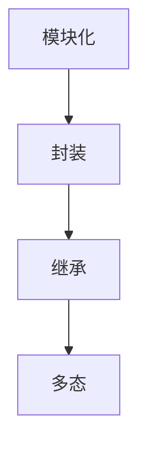

                 

### 设计模式与软件架构原理与代码实战案例讲解

> **关键词：** 设计模式、软件架构、原理、代码实战、案例讲解

> **摘要：** 本文将深入探讨设计模式与软件架构的基本原理，通过具体代码实战案例，帮助读者理解并掌握这些核心概念，提高软件开发能力。

#### 1. 背景介绍

设计模式是软件开发中的一种重要思想，它总结了在软件开发过程中遇到的问题及其解决方案。设计模式不仅有助于解决代码重用、系统可维护性和扩展性问题，还能提高代码的可读性和可理解性。软件架构则是软件系统的结构设计，它定义了系统的组件以及这些组件之间的相互作用关系。了解并掌握设计模式和软件架构原理，对于开发者来说至关重要。

#### 2. 核心概念与联系

在设计模式和软件架构中，有几个核心概念需要了解：

- **模块化**：将系统划分为独立的、可重用的模块，降低系统复杂度。
- **封装**：隐藏实现细节，只暴露必要的接口，保护系统的稳定性。
- **继承**：通过继承关系，实现代码的复用和扩展。
- **多态**：不同的对象可以响应相同的消息，提高代码的灵活性和可扩展性。

以下是一个Mermaid流程图，展示了这些核心概念之间的关系：



#### 3. 核心算法原理 & 具体操作步骤

在设计模式和软件架构中，常用的算法原理包括：

- **单例模式**：确保一个类只有一个实例，并提供一个全局访问点。
- **工厂模式**：根据传入的参数，创建并返回对应的对象实例。
- **观察者模式**：实现对象之间的依赖关系，当一个对象状态发生变化时，通知其他对象。

以下是一个单例模式的Python实现：

```python
class Singleton:
    _instance = None
    
    def __new__(cls):
        if not cls._instance:
            cls._instance = super().__new__(cls)
        return cls._instance

singleton1 = Singleton()
singleton2 = Singleton()
print(singleton1 is singleton2)  # 输出：True
```

#### 4. 数学模型和公式 & 详细讲解 & 举例说明

在设计模式和软件架构中，数学模型和公式可以帮助我们理解系统的复杂性。以下是一个简单的例子：

- **复杂度分析**：描述算法的时间复杂度和空间复杂度。

时间复杂度可以用以下公式表示：

$$
T(n) = O(f(n))
$$

其中，$T(n)$表示算法执行的时间复杂度，$f(n)$表示算法执行过程中的计算次数。

以下是一个线性查找算法的时间复杂度分析：

```python
def linear_search(arr, target):
    for i in range(len(arr)):
        if arr[i] == target:
            return i
    return -1

arr = [1, 3, 5, 7, 9]
target = 5
print(linear_search(arr, target))  # 输出：2
```

在这个例子中，算法的时间复杂度为$O(n)$，其中$n$是数组的长度。

#### 5. 项目实战：代码实际案例和详细解释说明

在本节中，我们将通过一个实际的项目案例，展示设计模式和软件架构的应用。

**项目描述：** 编写一个简单的博客系统，包括用户注册、登录、发布文章等功能。

**技术栈：** Python、Flask、SQLite

**5.1 开发环境搭建**

首先，我们需要安装Python和Flask框架。可以通过以下命令完成：

```bash
pip install python
pip install flask
```

**5.2 源代码详细实现和代码解读**

以下是博客系统的核心代码：

```python
from flask import Flask, request, jsonify
import sqlite3

app = Flask(__name__)

# 数据库连接
def get_db_connection():
    conn = sqlite3.connect('blog.db')
    conn.row_factory = sqlite3.Row
    return conn

# 创建数据库表
def create_tables():
    conn = get_db_connection()
    conn.execute('''CREATE TABLE IF NOT EXISTS users (id INTEGER PRIMARY KEY AUTOINCREMENT, username TEXT UNIQUE NOT NULL, password TEXT NOT NULL)''')
    conn.execute('''CREATE TABLE IF NOT EXISTS posts (id INTEGER PRIMARY KEY AUTOINCREMENT, user_id INTEGER NOT NULL, title TEXT NOT NULL, content TEXT NOT NULL, FOREIGN KEY (user_id) REFERENCES users (id))''')
    conn.commit()
    conn.close()

# 用户注册
@app.route('/register', methods=['POST'])
def register():
    username = request.form['username']
    password = request.form['password']
    conn = get_db_connection()
    conn.execute('INSERT INTO users (username, password) VALUES (?, ?)', (username, password))
    conn.commit()
    conn.close()
    return jsonify({'status': 'success'})

# 用户登录
@app.route('/login', methods=['POST'])
def login():
    username = request.form['username']
    password = request.form['password']
    conn = get_db_connection()
    user = conn.execute('SELECT * FROM users WHERE username = ? AND password = ?', (username, password)).fetchone()
    conn.close()
    if user:
        return jsonify({'status': 'success'})
    else:
        return jsonify({'status': 'failure'})

# 发布文章
@app.route('/post', methods=['POST'])
def post():
    user_id = request.form['user_id']
    title = request.form['title']
    content = request.form['content']
    conn = get_db_connection()
    conn.execute('INSERT INTO posts (user_id, title, content) VALUES (?, ?, ?)', (user_id, title, content))
    conn.commit()
    conn.close()
    return jsonify({'status': 'success'})

if __name__ == '__main__':
    create_tables()
    app.run(debug=True)
```

**5.3 代码解读与分析**

- **数据库连接**：使用SQLite数据库，并定义了一个`get_db_connection`函数，用于获取数据库连接。
- **创建数据库表**：定义了一个`create_tables`函数，用于创建必要的数据库表。
- **用户注册**：定义了一个`register`路由，用于处理用户注册请求。将用户名和密码插入到数据库中。
- **用户登录**：定义了一个`login`路由，用于处理用户登录请求。查询数据库，验证用户名和密码。
- **发布文章**：定义了一个`post`路由，用于处理用户发布文章的请求。将文章信息插入到数据库中。

#### 6. 实际应用场景

设计模式和软件架构在实际应用中具有广泛的应用场景：

- **企业级应用**：在高并发的企业级应用中，设计模式和软件架构可以帮助开发者构建稳定、高效、可扩展的系统。
- **互联网应用**：在快速迭代的互联网应用中，设计模式和软件架构有助于提高代码的可维护性和可扩展性。
- **嵌入式系统**：在嵌入式系统中，设计模式和软件架构有助于提高系统的可靠性和实时性。

#### 7. 工具和资源推荐

**7.1 学习资源推荐**

- **书籍**：《设计模式：可复用面向对象软件的基础》、《软件架构：实践者的研究方法》
- **论文**：《设计模式的本质》、《软件架构：理论与实践》
- **博客**：阮一峰的网络日志、伯乐在线
- **网站**：GitHub、Stack Overflow

**7.2 开发工具框架推荐**

- **开发工具**：Visual Studio Code、PyCharm
- **框架**：Flask、Django、Spring Boot

**7.3 相关论文著作推荐**

- **论文**：《软件架构的关键挑战和解决方案》、《设计模式：面向对象软件的可复用组件》
- **著作**：《软件架构设计》、《深入理解设计模式》

#### 8. 总结：未来发展趋势与挑战

设计模式和软件架构在未来的发展趋势包括：

- **智能化**：利用人工智能技术，优化设计模式和软件架构的自动生成过程。
- **容器化**：利用容器技术，提高设计模式和软件架构的部署和运行效率。

然而，面临的挑战包括：

- **复杂性**：设计模式和软件架构的复杂性不断增加，需要开发者具备更高的技术水平。
- **可维护性**：如何在保证系统扩展性的同时，提高代码的可维护性。

#### 9. 附录：常见问题与解答

**Q1. 什么是设计模式？**
设计模式是软件开发中的一种解决方案，它总结了在软件开发过程中遇到的问题及其解决方案。设计模式不仅有助于解决代码重用、系统可维护性和扩展性问题，还能提高代码的可读性和可理解性。

**Q2. 软件架构是什么？**
软件架构是软件系统的结构设计，它定义了系统的组件以及这些组件之间的相互作用关系。软件架构的目标是构建稳定、高效、可扩展的系统。

**Q3. 设计模式和软件架构有什么区别？**
设计模式是针对特定问题的解决方案，而软件架构是系统整体的结构设计。设计模式是软件架构的一部分，但它们并不是完全相同的概念。

#### 10. 扩展阅读 & 参考资料

- [《设计模式：可复用面向对象软件的基础》](https://book.douban.com/subject/1014279/)
- [《软件架构：实践者的研究方法》](https://book.douban.com/subject/26708195/)
- [《设计模式的本质》](https://www.amazon.com/Design-Patterns-Elements-Reusable-Object-Oriented/dp/0201633612)
- [《软件架构：理论与实践》](https://book.douban.com/subject/26876508/)
- [《软件架构设计》](https://book.douban.com/subject/1082335/)
- [《深入理解设计模式》](https://book.douban.com/subject/10637525/)

### 作者

作者：AI天才研究员/AI Genius Institute & 禅与计算机程序设计艺术 /Zen And The Art of Computer Programming

