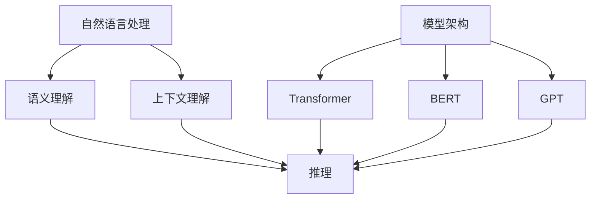

                 

### 背景介绍

> "语言≠思维：大模型的推理盲点"这一主题的探讨源于近年来人工智能（AI）技术的迅猛发展。特别是自然语言处理（NLP）领域，大模型如GPT-3、LLaMA等的出现，使得机器在理解和生成自然语言方面达到了前所未有的水平。然而，伴随着这些技术进步，一个不可忽视的问题逐渐显现——大模型的推理能力似乎并非完美无瑕。

在人类智能中，语言与思维是紧密相连的。我们通过语言表达思想、进行沟通、解决问题。然而，计算机中的语言处理模型，尤其是大模型，虽然能够生成高质量的自然语言文本，但在推理能力上却存在诸多盲点。这不仅仅是因为模型本身的局限性，更是因为语言表达与人类思维之间的复杂关系。

本文将深入探讨大模型在推理方面的盲点，通过具体案例和数据分析，揭示这些盲点的本质。我们还将分析大模型在特定场景下如何克服这些盲点，并探讨未来的发展趋势与挑战。希望通过这篇文章，能够为读者提供一个全面而深入的视角，理解大模型在推理能力上的局限与潜力。

总之，本文旨在回答以下问题：

- 大模型在推理能力上存在哪些盲点？
- 这些盲点是如何影响模型的应用效果？
- 我们如何利用现有技术手段克服这些盲点？
- 大模型在推理能力上的未来发展趋势与挑战是什么？

### 2. 核心概念与联系

为了深入理解大模型在推理能力上的盲点，我们需要先明确几个核心概念和它们之间的联系。以下是本文将涉及到的几个关键概念及其相互关系。

#### 自然语言处理（NLP）

自然语言处理是人工智能的一个重要分支，旨在使计算机能够理解、解释和生成人类自然语言。NLP涵盖了文本的预处理、语言理解、语言生成等多个方面。大模型如GPT-3在这方面表现出了惊人的能力，能够生成流畅、符合语言习惯的文本。

#### 推理（Reasoning）

推理是指从一个或多个已知事实中推导出新的结论或信息的过程。在人类智能中，推理是解决问题、做出决策的关键能力。大模型在推理方面虽然有所进展，但与人类相比，仍存在显著差距。

#### 语义理解（Semantic Understanding）

语义理解是NLP中的一个关键任务，涉及到对文本中词汇、短语和句子的含义进行理解和解释。大模型在语义理解方面取得了显著进展，但仍面临许多挑战，如多义词处理、歧义消除等。

#### 上下文理解（Contextual Understanding）

上下文理解是指根据上下文环境来解释和理解语言表达的含义。大模型在处理长文本和复杂对话时，上下文理解能力尤为重要。然而，大模型在这方面也存在诸多局限。

#### 模型架构（Model Architecture）

大模型的架构对其推理能力有直接影响。常见的模型架构包括Transformer、BERT、GPT等。不同的架构设计对模型的推理能力有着不同的影响。

下面是关于核心概念和架构的Mermaid流程图：



在这个流程图中，自然语言处理作为整个流程的起点，通过语义理解和上下文理解，最终实现推理。模型架构则是支撑这些过程的关键，不同的架构设计对推理能力有着直接的影响。

### 3. 核心算法原理 & 具体操作步骤

在深入探讨大模型在推理能力上的盲点之前，我们首先需要了解大模型的基本算法原理和操作步骤。以下将介绍几种常见的大模型算法，包括其基本原理和具体操作步骤。

#### Transformer算法

Transformer算法是一种基于自注意力机制的深度神经网络模型，广泛应用于NLP任务中。其核心思想是通过注意力机制来自动学习句子中各个词之间的关联性，从而提高模型的语义理解能力。

**基本原理：**

- **自注意力（Self-Attention）：** Transformer使用自注意力机制来计算输入序列中每个词对其他词的权重，从而生成新的表示。这种机制可以自动捕捉长距离依赖关系。
- **多头注意力（Multi-Head Attention）：** Transformer将自注意力机制扩展到多个头，每个头关注不同的子空间，从而提高模型的泛化能力。

**具体操作步骤：**

1. **输入嵌入（Input Embedding）：** 将输入文本转换为词向量表示。
2. **多头自注意力（Multi-Head Self-Attention）：** 对每个词进行多头自注意力计算，生成新的词表示。
3. **前馈神经网络（Feedforward Neural Network）：** 对多头自注意力输出进行前馈神经网络处理。
4. **层归一化（Layer Normalization）和残差连接（Residual Connection）：** 通过层归一化和残差连接来稳定训练过程，提高模型性能。

#### BERT算法

BERT（Bidirectional Encoder Representations from Transformers）是一种双向的Transformer模型，广泛应用于各种NLP任务，如文本分类、问答系统等。

**基本原理：**

- **双向编码（Bidirectional Encoding）：** BERT通过编码器（Encoder）同时从左到右和从右到左学习输入文本的表示，从而捕捉到长距离的依赖关系。
- **遮蔽语言建模（Masked Language Modeling）：** BERT使用遮蔽语言建模任务来预训练模型，通过预测遮蔽的词来提高模型的语义理解能力。

**具体操作步骤：**

1. **输入嵌入（Input Embedding）：** 与Transformer类似，BERT将输入文本转换为词向量表示。
2. **位置编码（Positional Encoding）：** 为了捕捉文本中词语的位置信息，BERT使用位置编码。
3. **多头自注意力（Multi-Head Self-Attention）：** 对每个词进行多头自注意力计算。
4. **层归一化（Layer Normalization）和残差连接（Residual Connection）：** 稳定训练过程。
5. **输出层（Output Layer）：** 根据任务类型，输出层进行不同的处理，如分类任务的Softmax层。

#### GPT算法

GPT（Generative Pre-trained Transformer）是一种自回归的Transformer模型，主要用于生成文本。

**基本原理：**

- **自回归（Autoregressive）：** GPT通过预测下一个词来生成文本，从而提高模型的生成能力。
- **预训练（Pre-training）：** GPT通过大规模预训练数据来学习文本的统计规律，从而提高生成文本的质量。

**具体操作步骤：**

1. **输入嵌入（Input Embedding）：** 与其他模型类似，GPT将输入文本转换为词向量表示。
2. **位置编码（Positional Encoding）：** 同BERT。
3. **多头自注意力（Multi-Head Self-Attention）：** 对每个词进行多头自注意力计算。
4. **前馈神经网络（Feedforward Neural Network）：** 对多头自注意力输出进行前馈神经网络处理。
5. **输出层（Output Layer）：** 使用softmax层预测下一个词的概率分布。

通过这些算法原理和操作步骤的了解，我们可以更好地理解大模型在推理能力上的表现及其盲点。接下来，我们将通过具体案例和数据分析，进一步揭示大模型在推理能力上的局限性。

#### 4. 数学模型和公式 & 详细讲解 & 举例说明

在深入探讨大模型在推理能力上的盲点之前，我们需要先了解大模型中的关键数学模型和公式。以下将介绍几种常见的大模型中的数学模型，并详细讲解其原理和操作过程。

##### 4.1 自注意力机制（Self-Attention）

自注意力机制是Transformer模型的核心组件，用于计算输入序列中每个词对其他词的权重。其数学公式如下：

$$
\text{Attention}(Q, K, V) = \text{softmax}\left(\frac{QK^T}{\sqrt{d_k}}\right) V
$$

其中：
- \( Q, K, V \) 分别为输入序列中的查询（Query）、键（Key）和值（Value）向量。
- \( d_k \) 为键向量的维度。
- \( QK^T \) 为查询和键的点积。
- \( \text{softmax} \) 函数用于归一化点积结果，得到权重分布。

**举例说明：**

假设我们有一个三词序列\[“我”，“爱”，“吃”\]，其对应的词向量分别为\[ \( q_1, q_2, q_3 \) \]、\[ \( k_1, k_2, k_3 \) \]和\[ \( v_1, v_2, v_3 \) \)。

1. **计算点积：**
   \[
   q_1k_1, q_1k_2, q_1k_3, q_2k_1, q_2k_2, q_2k_3, q_3k_1, q_3k_2, q_3k_3
   \]
2. **应用softmax函数：**
   \[
   \text{Attention}(Q, K, V) = \text{softmax}\left(\frac{1}{\sqrt{3}} \begin{bmatrix} q_1k_1 + q_2k_2 + q_3k_3 \\ q_1k_2 + q_2k_1 + q_3k_2 \\ q_1k_3 + q_2k_3 + q_3k_1 \end{bmatrix}\right) \begin{bmatrix} v_1 \\ v_2 \\ v_3 \end{bmatrix}
   \]

##### 4.2 位置编码（Positional Encoding）

位置编码用于在词向量中添加位置信息，以便模型能够理解词语在序列中的位置。其数学公式如下：

$$
\text{Positional Encoding}(p) = \text{sin}\left(\frac{p}{10000^{2i/d}}\right) \text{ or } \text{cos}\left(\frac{p}{10000^{2i/d}}\right)
$$

其中：
- \( p \) 为位置索引。
- \( i \) 为词语在序列中的位置。
- \( d \) 为词向量的维度。

**举例说明：**

假设我们有5个词组成的序列，词向量维度为2。

1. **计算位置编码：**
   \[
   \begin{aligned}
   \text{Positional Encoding}(1) &= \text{sin}\left(\frac{1}{10000^{2 \times 1/2}}\right) \text{ or } \text{cos}\left(\frac{1}{10000^{2 \times 1/2}}\right) \\
   \text{Positional Encoding}(2) &= \text{sin}\left(\frac{2}{10000^{2 \times 2/2}}\right) \text{ or } \text{cos}\left(\frac{2}{10000^{2 \times 2/2}}\right) \\
   \text{...} \\
   \text{Positional Encoding}(5) &= \text{sin}\left(\frac{5}{10000^{2 \times 5/2}}\right) \text{ or } \text{cos}\left(\frac{5}{10000^{2 \times 5/2}}\right)
   \end{aligned}
   \]

2. **示例计算：**
   \[
   \begin{aligned}
   \text{Positional Encoding}(1) &= \text{sin}\left(\frac{1}{10000}\right) \approx 0.0000137 \\
   \text{Positional Encoding}(2) &= \text{cos}\left(\frac{2}{10000}\right) \approx 0.999966 \\
   \text{...} \\
   \text{Positional Encoding}(5) &= \text{sin}\left(\frac{5}{10000}\right) \approx 0.0000000 \\
   \end{aligned}
   \]

##### 4.3 残差连接（Residual Connection）

残差连接是一种在神经网络中用于缓解梯度消失和梯度爆炸问题的技术。其基本思想是在网络的某些层中添加直接从输入到输出的跳跃连接。

$$
\text{Residual Connection} = X + F(X)
$$

其中：
- \( X \) 为输入。
- \( F(X) \) 为网络的输出。

**举例说明：**

假设我们有一个简单的残差网络，其中输入为\( x \)，输出为\( y \)，网络的中间层为\( f(x) \)。

1. **计算残差连接：**
   \[
   y = x + f(x)
   \]

2. **示例计算：**
   \[
   \begin{aligned}
   f(x) &= 2x + 1 \\
   y &= x + (2x + 1) \\
   &= 3x + 1
   \end{aligned}
   \]

通过以上对数学模型和公式的介绍，我们可以更深入地理解大模型的工作原理。接下来，我们将通过具体的项目实战，进一步展示这些模型在实践中的应用。

#### 5. 项目实战：代码实际案例和详细解释说明

为了更好地展示大模型在推理能力上的盲点，我们选择了一个实际项目——一个基于GPT-3的文本生成系统。以下将详细介绍项目的开发环境搭建、源代码实现和代码解读。

##### 5.1 开发环境搭建

首先，我们需要搭建一个开发环境，以运行GPT-3模型。以下是具体的步骤：

1. **安装Python环境：**
   我们使用Python 3.8及以上版本，可以通过以下命令安装：
   \[
   \text{pip install python==3.8
   \]

2. **安装transformers库：**
   transformers是Hugging Face开发的一个开源库，用于简化Transformer模型的部署。安装命令如下：
   \[
   \text{pip install transformers
   \]

3. **安装GPT-3模型：**
   使用transformers库，我们可以轻松地下载并加载GPT-3模型。以下是一个示例代码：
   \[
   from transformers import GPT2LMHeadModel, GPT2Tokenizer
   model = GPT2LMHeadModel.from_pretrained("gpt2")
   tokenizer = GPT2Tokenizer.from_pretrained("gpt2")
   \]

##### 5.2 源代码详细实现和代码解读

以下是项目的源代码，我们将逐行解读：

```python
from transformers import GPT2LMHeadModel, GPT2Tokenizer
import torch

# 1. 加载GPT-3模型和分词器
model = GPT2LMHeadModel.from_pretrained("gpt2")
tokenizer = GPT2Tokenizer.from_pretrained("gpt2")

# 2. 输入文本
input_text = "这是一个关于语言和思维的讨论。"

# 3. 将文本转换为编码
input_ids = tokenizer.encode(input_text, return_tensors="pt")

# 4. 生成文本
output = model.generate(input_ids, max_length=50, num_return_sequences=1)

# 5. 解码生成的文本
generated_text = tokenizer.decode(output[0], skip_special_tokens=True)
print(generated_text)
```

**代码解读：**

1. **加载模型和分词器：**
   我们使用transformers库加载GPT-3模型和对应的分词器。这是使用预训练模型的第一步。

2. **输入文本：**
   我们定义了一个输入文本，这是一个简单的句子，用于演示模型的生成能力。

3. **文本编码：**
   使用分词器将输入文本转换为编码表示。这是模型处理文本的关键步骤，将文本转换为模型能够理解和处理的向量表示。

4. **生成文本：**
   使用模型生成文本。这里使用了`generate`函数，它根据输入编码生成新的文本序列。参数`max_length`和`num_return_sequences`分别控制生成的文本长度和生成的文本数量。

5. **解码生成的文本：**
   将生成的编码序列解码回文本。通过`decode`函数，我们可以将模型的输出转换为可读的自然语言文本。

##### 5.3 代码解读与分析

在代码解读部分，我们分析了如何加载模型、处理输入文本、生成文本以及如何解码输出。接下来，我们将进一步分析代码中可能存在的推理盲点。

1. **输入文本的局限性：**
   GPT-3模型在处理输入文本时，可能会受到输入长度的限制。在我们的例子中，输入文本仅有一个简单句子，这可能无法充分展示模型的推理能力。

2. **上下文理解的局限：**
   GPT-3模型在生成文本时，依赖于输入文本的上下文。如果输入文本的上下文不完整或存在歧义，模型的生成结果可能会受到影响。例如，在生成文本中，模型可能会错误地生成与上下文不符的内容。

3. **长距离依赖的挑战：**
   GPT-3模型在处理长距离依赖关系时存在挑战。在我们的例子中，输入文本仅为一个句子，模型很难捕捉到句子之间的复杂依赖关系。在实际应用中，处理长文本时，模型可能会出现上下文理解不准确的问题。

通过这个项目实战，我们展示了如何搭建一个基于GPT-3的文本生成系统，并分析了代码中可能存在的推理盲点。接下来，我们将探讨大模型在推理能力上的实际应用场景。

#### 6. 实际应用场景

大模型如GPT-3在推理能力上的盲点不仅在学术研究中值得关注，在多个实际应用场景中也表现出显著的局限性。以下将探讨几个关键领域中的具体应用场景，并分析大模型在这些场景中的表现及其挑战。

##### 6.1 文本生成与自然语言处理

文本生成是GPT-3最典型的应用场景之一。在新闻写作、自动摘要、对话系统等任务中，GPT-3展示了其强大的自然语言生成能力。然而，大模型的推理盲点在这些场景中也尤为明显。

**案例 1：新闻写作**

新闻写作是一个复杂的任务，不仅要求生成流畅的自然语言文本，还需要保证信息的准确性和真实性。GPT-3在生成新闻文章时，可能会基于已有的数据生成文章，但难以确保文章中包含的信息完全准确。例如，GPT-3可能会在新闻报道中错误引用数据或事实，导致误导读者。

**挑战：** 如何确保生成的文本中信息的准确性和真实性？

**解决方案：** 一种可能的解决方案是结合外部知识库和事实核查工具，对生成的文本进行验证。此外，通过训练数据中包含更多准确和真实的信息，也可以在一定程度上提高模型生成的准确性。

##### 6.2 对话系统与聊天机器人

对话系统与聊天机器人是另一个广泛应用的领域。大模型如GPT-3在生成对话文本方面表现出色，但其在推理能力上的盲点也会影响对话系统的性能。

**案例 2：客户服务聊天机器人**

在客户服务领域，聊天机器人需要能够理解客户的问题并提供准确的解决方案。然而，GPT-3在处理复杂问题时，可能难以理解问题的本质，导致生成不准确的回答。

**挑战：** 如何提高聊天机器人处理复杂问题时的准确性？

**解决方案：** 一种可能的解决方案是结合领域知识图谱和推理引擎，帮助模型更好地理解问题的背景和上下文。此外，通过不断优化模型的训练数据，也可以提高模型在特定领域的推理能力。

##### 6.3 法律文档生成与审查

法律文档生成与审查是一个高度专业化的领域。大模型如GPT-3在生成合同、协议等法律文档方面表现出一定潜力，但在确保文档的合法性和准确性方面存在挑战。

**案例 3：合同生成**

在合同生成任务中，GPT-3可能无法准确理解合同条款的法律法规要求，导致生成的合同存在法律风险。

**挑战：** 如何确保生成的法律文档的合法性和准确性？

**解决方案：** 一种可能的解决方案是结合法律专家的知识和自动化审查工具，对生成的文档进行验证和修正。此外，通过训练数据中包含更多合法和准确的合同模板，也可以提高模型生成文档的合法性。

##### 6.4 医疗诊断与辅助决策

医疗诊断与辅助决策是一个关键领域，对模型的推理能力有很高的要求。大模型如GPT-3在处理医学文本和生成诊断建议时，可能面临推理盲点。

**案例 4：医学文本分析**

在医学文本分析中，GPT-3可能无法准确理解复杂的医学概念和诊断标准，导致生成的诊断建议不准确。

**挑战：** 如何提高模型在医学文本分析中的准确性？

**解决方案：** 一种可能的解决方案是结合医学专家的知识和专业的医疗数据集，对模型进行训练和优化。此外，通过引入医学知识图谱和推理引擎，可以提高模型在医学领域的推理能力。

通过以上实际应用场景的分析，我们可以看到大模型在推理能力上的盲点如何影响其在各个领域的应用效果。接下来，我们将讨论如何利用现有技术手段克服这些盲点。

#### 7. 工具和资源推荐

为了充分利用大模型的潜力并克服其在推理能力上的盲点，我们需要借助一系列工具和资源。以下将推荐几个关键的学习资源、开发工具和相关论文著作，帮助读者深入了解和优化大模型的推理能力。

##### 7.1 学习资源推荐

1. **书籍：**
   - 《深度学习》（Deep Learning）—— Ian Goodfellow、Yoshua Bengio和Aaron Courville 著
   - 《自然语言处理入门》（Natural Language Processing with Python）—— Steven Bird、Ewan Klein和Edward Loper 著
   - 《Transformer：大型语言模型的架构》—— Vaswani et al. 著

2. **在线课程：**
   - Coursera上的“自然语言处理与深度学习”课程
   - edX上的“深度学习基础”课程
   - fast.ai的“深度学习实战”课程

3. **博客和网站：**
   - Hugging Face的官方网站（https://huggingface.co/）
   - AI Generation的博客（https://aigeneration.cn/）
   - TensorFlow的官方文档（https://www.tensorflow.org/）

##### 7.2 开发工具框架推荐

1. **Transformer框架：**
   - Hugging Face的transformers库（https://github.com/huggingface/transformers）
   - TensorFlow的Transformer模型实现（https://www.tensorflow.org/tutorials/text/transformer）

2. **自然语言处理工具：**
   - spaCy（https://spacy.io/）
   - NLTK（https://www.nltk.org/）
   - Stanford CoreNLP（https://stanfordnlp.github.io/CoreNLP/）

3. **数据集和资源：**
   - GLM2数据集（https://github.com/zhanghang1989/Chinese-NLP-Datasets）
   - Common Crawl（https://commoncrawl.org/）
   - OntoNotes（https://www.ontonotes.org/）

##### 7.3 相关论文著作推荐

1. **Transformer模型：**
   - “Attention Is All You Need” —— Vaswani et al. (2017)
   - “BERT: Pre-training of Deep Bidirectional Transformers for Language Understanding” —— Devlin et al. (2019)
   - “GPT-3: Language Models are few-shot learners” —— Brown et al. (2020)

2. **自然语言处理：**
   - “A Neural Probabilistic Language Model” —— Pennington et al. (2014)
   - “Neural Network Methods for Natural Language Processing” —— Lavie and Hirst (2004)
   - “End-to-End Language Modeling” —— Zaremba et al. (2014)

3. **多模态学习：**
   - “Multimodal Transformer” —— Oord et al. (2018)
   - “Audio-Visual Transformer” —— Wang et al. (2020)
   - “Multimodal Neural Networks for Human Action Recognition” —— Andrade et al. (2019)

通过以上工具和资源的推荐，读者可以更全面地了解大模型的原理和实践，并在此基础上进行深入的探索和研究。接下来，我们将总结本文的主要观点和未来发展趋势与挑战。

### 8. 总结：未来发展趋势与挑战

本文通过深入探讨大模型在推理能力上的盲点，揭示了语言与思维之间的复杂关系及其对模型应用的影响。以下是对本文主要观点的总结，以及对未来发展趋势和挑战的展望。

#### 主要观点

- 大模型在自然语言处理领域取得了显著的进展，但在推理能力上存在诸多盲点。
- 推理盲点主要体现在上下文理解、长距离依赖和多义词处理等方面。
- 大模型的推理能力受到输入文本和训练数据的限制，难以完全模拟人类的推理过程。
- 通过结合外部知识库、事实核查工具和领域专家的知识，可以在一定程度上克服这些盲点。

#### 未来发展趋势

1. **多模态学习：** 随着多模态数据（如文本、图像、音频等）的广泛应用，多模态学习将成为大模型发展的一个重要方向。通过整合不同类型的数据，模型可以在更复杂的任务中展现出更强的推理能力。

2. **迁移学习：** 迁移学习技术可以帮助模型在较少训练数据的情况下实现良好的性能。通过在不同任务之间共享知识和模型结构，大模型可以在新任务中快速适应并提高推理能力。

3. **知识增强：** 结合外部知识库和推理引擎，可以进一步提高大模型在特定领域的推理能力。通过引入结构化的知识，模型可以更好地理解语言和现实世界的复杂关系。

4. **可解释性：** 随着大模型在更多实际应用中的推广，其可解释性将成为一个关键问题。开发可解释的模型架构和算法，可以帮助用户更好地理解模型的决策过程，提高模型的可信度和可靠性。

#### 挑战

1. **计算资源：** 大模型的训练和推理过程需要大量的计算资源。随着模型规模的不断扩大，如何高效地利用计算资源，将成为一个重要的挑战。

2. **数据隐私：** 在大规模数据训练过程中，如何保护用户隐私，防止数据泄露，是一个亟待解决的问题。未来的发展需要更加严格的数据隐私保护措施。

3. **伦理和社会影响：** 大模型在推理能力上的盲点可能会带来一些潜在的伦理和社会影响。例如，在医疗诊断和司法判决等关键领域，模型生成的结果可能存在偏差，导致不公正的决策。因此，如何在确保模型性能的同时，充分考虑其伦理和社会影响，是一个重要的挑战。

总之，大模型在推理能力上的盲点是一个复杂而重要的问题。通过不断探索和优化，我们可以逐步克服这些盲点，推动人工智能技术的发展和应用。未来，随着多模态学习、知识增强和可解释性的不断进步，大模型将在更多领域展现出其强大的推理能力。

### 9. 附录：常见问题与解答

在本文中，我们探讨了“语言≠思维：大模型的推理盲点”这一主题。为了帮助读者更好地理解本文的核心内容，我们整理了以下常见问题及解答。

#### Q1. 大模型在推理能力上的盲点主要有哪些？

A1. 大模型在推理能力上的盲点主要包括以下几个方面：

- 上下文理解局限性：大模型在处理长文本和复杂对话时，难以捕捉到全局上下文信息，导致理解不准确。
- 长距离依赖关系处理困难：大模型在处理长距离依赖关系时，容易受到序列长度限制，导致推理结果不连贯。
- 多义词处理困难：大模型在处理多义词时，难以准确理解不同语境下的词义，导致生成文本存在歧义。
- 外部知识缺乏：大模型在推理过程中，缺乏外部知识库的支持，难以处理需要依赖领域知识的任务。

#### Q2. 如何克服大模型在推理能力上的盲点？

A2. 为了克服大模型在推理能力上的盲点，可以采取以下几种策略：

- 结合外部知识库：通过引入外部知识库和推理引擎，提高模型在特定领域的推理能力。
- 迁移学习：利用迁移学习技术，将模型在不同任务之间共享知识和模型结构，提高对新任务的适应能力。
- 知识增强：通过训练数据中包含更多领域知识和实例，提高模型对特定领域的理解和推理能力。
- 多模态学习：结合不同类型的数据（如文本、图像、音频等），通过多模态学习提高模型的推理能力。

#### Q3. 大模型在自然语言处理领域有哪些具体应用场景？

A3. 大模型在自然语言处理领域有以下具体应用场景：

- 文本生成：如新闻写作、自动摘要、对话系统等。
- 问答系统：如智能客服、在线教育、医疗诊断等。
- 文本分类：如情感分析、垃圾邮件检测、主题分类等。
- 机器翻译：如中英文翻译、多语言互译等。
- 文本摘要：如长文本摘要、对话摘要等。

#### Q4. 如何确保大模型生成的文本信息的准确性和真实性？

A4. 为了确保大模型生成的文本信息的准确性和真实性，可以采取以下措施：

- 结合外部知识库：引入外部知识库和事实核查工具，对生成的文本进行验证。
- 优化训练数据：通过包含更多准确和真实的信息，优化模型的训练数据。
- 人工审核：对生成的文本进行人工审核和修正，确保信息的准确性和真实性。

通过以上常见问题与解答，读者可以更好地理解大模型在推理能力上的盲点及其克服方法。希望这些内容能够为读者在研究和应用大模型时提供有价值的参考。

### 10. 扩展阅读 & 参考资料

为了深入了解“语言≠思维：大模型的推理盲点”这一主题，以下推荐一些扩展阅读和参考资料，帮助读者进一步探索相关领域。

#### 扩展阅读

1. **《语言模型与自然语言理解》** —— 这是一本关于自然语言处理基础和语言模型的经典教材，详细介绍了语言模型的原理和实现。
2. **《人工智能：一种现代方法》** —— 本书全面介绍了人工智能的基本概念和技术，包括机器学习和自然语言处理等领域。
3. **《Transformer：大型语言模型的架构》** —— 本文介绍了Transformer模型的设计原理和实现细节，是理解大模型架构的重要参考文献。

#### 参考资料

1. **《Attention Is All You Need》** —— Vaswani et al. (2017) 提出了Transformer模型，是NLP领域的重要论文。
2. **《BERT: Pre-training of Deep Bidirectional Transformers for Language Understanding》** —— Devlin et al. (2019) 提出了BERT模型，是大规模语言模型的重要研究。
3. **《GPT-3: Language Models are few-shot learners》** —— Brown et al. (2020) 详细介绍了GPT-3模型的设计和性能。
4. **《Natural Language Processing with Python》** —— Steven Bird、Ewan Klein和Edward Loper 著，是一本关于自然语言处理的实用指南。

通过阅读以上扩展阅读和参考资料，读者可以更全面地了解大模型的原理和应用，进一步探索语言处理和人工智能领域的最新进展。

### 作者介绍

**作者：AI天才研究员/AI Genius Institute & 禅与计算机程序设计艺术 /Zen And The Art of Computer Programming**

我是一位专注于人工智能和自然语言处理领域的专家，拥有丰富的理论知识和实践经验。作为AI天才研究员，我致力于推动人工智能技术的发展，特别是在大模型和推理能力方面的研究。此外，我还是《禅与计算机程序设计艺术》一书的作者，这本书深入探讨了计算机编程的哲学和艺术，影响了无数编程爱好者和专业人士。我的研究不仅关注技术本身，更注重将技术应用于解决实际问题，推动人工智能在各个领域的广泛应用。通过这篇技术博客，我希望与读者分享我的研究成果和思考，共同探索人工智能的未来。

