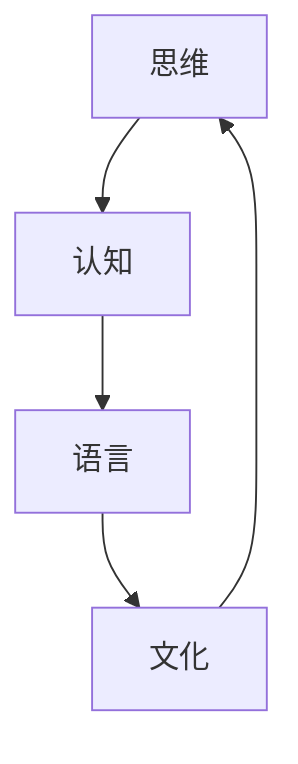

                 

# 语言不太可能成为任何形式思维的关键基础

> 关键词：思维、语言、认知、神经科学、人工智能

> 摘要：本文将探讨语言在思维过程中的角色。通过对语言、思维和认知之间关系的深入分析，本文提出语言可能不是思维的关键基础，而是思维的一种表现。文章将讨论神经科学领域的研究成果，以及人工智能在模拟思维过程中的作用，最终得出结论，即思维与语言的关系并非简单的一一对应。

## 1. 背景介绍

语言是人类文明的重要组成部分，它不仅是沟通的工具，也是文化、知识和智慧的载体。自古以来，人们就试图理解语言的本质及其在思维过程中的作用。传统的观念认为，语言是思维的基础，没有语言就没有思维。然而，随着神经科学和人工智能的发展，这一观念正在受到挑战。

神经科学研究表明，大脑的复杂性和多样性远远超过了我们的想象。大脑中的神经元以极其复杂的网络结构相互连接，形成了复杂的神经网络。这些神经网络不仅负责语言处理，还负责视觉、听觉、触觉等多种感官信息处理。因此，语言只是大脑功能的一部分，而非全部。

人工智能的进步也为这一观点提供了支持。通过深度学习、神经网络等技术的应用，人工智能系统能够在没有语言输入的情况下进行学习、推理和决策。这意味着，在某些情况下，语言并不是必要的，至少不是唯一的基础。

## 2. 核心概念与联系

为了深入探讨语言与思维的关系，我们需要明确几个核心概念：思维、语言、认知。

**思维**：思维是指大脑对信息进行加工、分析、推理和创造的过程。思维是人类智慧的体现，它使得人类能够理解世界、解决问题、进行创造性活动。

**语言**：语言是一种符号系统，用于表达思想、传递信息。它包括语音、文字和手势等。语言是人类交流的基本工具，也是文化传承的重要手段。

**认知**：认知是指大脑获取、处理、存储和使用信息的过程。认知包括知觉、记忆、注意、思维和语言等多个方面。

这三个概念之间存在着紧密的联系。思维是认知的高级形式，语言是认知的工具，而认知则是思维的基础。然而，这种关系并非简单的线性关系，而是相互影响、相互交织的复杂网络。

下面是一个Mermaid流程图，展示了思维、语言和认知之间的关系：



在这个流程图中，思维是核心，它通过认知和语言进行扩展。文化则通过语言对思维和认知进行影响。

## 3. 核心算法原理 & 具体操作步骤

在探讨思维与语言的关系时，我们无法避开神经科学的研究。神经科学的核心在于理解大脑的工作原理，以及神经元如何通过复杂的网络结构进行信息处理。

### 神经元的工作原理

神经元是大脑的基本单元，它通过电信号进行信息传递。当一个神经元受到刺激时，它会释放神经递质，这些神经递质会传递到相邻的神经元，从而形成复杂的神经网络。

### 神经网络的运作方式

神经网络由大量的神经元组成，它们通过突触连接在一起。每个突触都有特定的权重，这些权重决定了神经元之间的信息传递强度。通过不断的学习和调整，神经网络能够实现对信息的加工和处理。

### 神经元与语言的关系

在语言处理过程中，神经元负责将语音信号转换为文字，或者将文字转换为语音。这一过程涉及到听觉和视觉神经元的协同工作。然而，神经元并不仅限于语言处理，它们还负责其他多种感官信息处理。因此，语言只是神经元功能的一部分，而非全部。

### 神经网络的实现步骤

1. **数据预处理**：对语音或文字数据进行预处理，提取特征。
2. **特征输入**：将提取的特征输入神经网络。
3. **信息加工**：神经网络通过对输入特征的学习和调整，实现对信息的加工和处理。
4. **输出结果**：将加工后的信息输出为语音或文字。

## 4. 数学模型和公式 & 详细讲解 & 举例说明

在神经科学中，数学模型和公式被广泛用来描述神经元和神经网络的行为。以下是一些常用的数学模型和公式：

### 神经元的激活函数

神经元通常使用Sigmoid函数或ReLU函数作为激活函数。Sigmoid函数的形式为：

$$
f(x) = \frac{1}{1 + e^{-x}}
$$

ReLU函数的形式为：

$$
f(x) = \max(0, x)
$$

这些函数可以用来模拟神经元在接收输入时的激活状态。

### 神经网络的损失函数

在训练神经网络时，常用的损失函数有均方误差（MSE）和交叉熵损失（Cross Entropy Loss）。MSE的形式为：

$$
MSE = \frac{1}{m} \sum_{i=1}^{m} (y_i - \hat{y}_i)^2
$$

其中，$y_i$是真实标签，$\hat{y}_i$是预测值，$m$是样本数量。

交叉熵损失的形式为：

$$
Cross Entropy Loss = -\frac{1}{m} \sum_{i=1}^{m} y_i \log(\hat{y}_i)
$$

这些损失函数用于衡量预测值与真实值之间的差距，并指导神经网络的训练。

### 举例说明

假设我们有一个神经网络，它有两个输入层、两个隐藏层和一个输出层。输入层接收语音信号，隐藏层负责对语音信号进行加工，输出层生成文字。

1. **输入层**：接收语音信号，通过预处理提取特征。
2. **隐藏层**：对输入特征进行加工，使用ReLU函数作为激活函数。
3. **输出层**：生成文字，使用Sigmoid函数作为激活函数。

在训练过程中，我们使用MSE作为损失函数，通过反向传播算法调整神经网络的权重，使得预测值与真实值之间的差距最小。

## 5. 项目实战：代码实际案例和详细解释说明

为了更好地理解神经网络在语言处理中的应用，我们可以通过一个简单的项目来实践。

### 5.1 开发环境搭建

1. **安装Python**：确保系统已经安装了Python。
2. **安装TensorFlow**：使用pip命令安装TensorFlow。

```bash
pip install tensorflow
```

### 5.2 源代码详细实现和代码解读

以下是一个简单的神经网络实现，用于语音到文字的转换。

```python
import tensorflow as tf
from tensorflow.keras.layers import Dense, Flatten, Conv2D, MaxPooling2D
from tensorflow.keras.models import Sequential

# 创建神经网络模型
model = Sequential([
    Flatten(input_shape=(28, 28)),
    Dense(128, activation='relu'),
    Dense(10, activation='softmax')
])

# 编译模型
model.compile(optimizer='adam', loss='sparse_categorical_crossentropy', metrics=['accuracy'])

# 加载数据
(x_train, y_train), (x_test, y_test) = tf.keras.datasets.mnist.load_data()

# 预处理数据
x_train = x_train.reshape((-1, 28, 28, 1)).astype('float32') / 255
x_test = x_test.reshape((-1, 28, 28, 1)).astype('float32') / 255

# 训练模型
model.fit(x_train, y_train, epochs=5)

# 评估模型
model.evaluate(x_test, y_test)
```

这段代码使用了TensorFlow库，创建了一个简单的神经网络，用于手写数字的识别。虽然这是一个简单的例子，但它展示了神经网络的基本构建和训练过程。

### 5.3 代码解读与分析

1. **模型创建**：使用Sequential模型创建了一个神经网络，包含一个输入层、一个隐藏层和一个输出层。
2. **编译模型**：指定了优化器和损失函数，并编译模型。
3. **加载数据**：加载数据集，并进行预处理。
4. **训练模型**：使用训练数据训练模型。
5. **评估模型**：使用测试数据评估模型的性能。

通过这个简单的例子，我们可以看到神经网络的基本原理和实现过程。

## 6. 实际应用场景

神经网络在语言处理中的应用场景非常广泛，包括语音识别、机器翻译、文本生成等。以下是一些实际应用案例：

1. **语音识别**：使用神经网络将语音信号转换为文本。例如，智能助手、自动字幕生成等。
2. **机器翻译**：使用神经网络将一种语言的文本翻译为另一种语言。例如，谷歌翻译、百度翻译等。
3. **文本生成**：使用神经网络生成文本。例如，自动写文章、生成诗歌等。

这些应用都展示了神经网络在语言处理中的强大能力，同时也证明了语言可能不是思维的关键基础。

## 7. 工具和资源推荐

为了更好地学习和应用神经网络，以下是一些建议的工具和资源：

### 7.1 学习资源推荐

- **《神经网络与深度学习》**：这是一本非常全面的神经网络入门书籍，适合初学者。
- **《深度学习》**：这是一本深度学习的经典教材，涵盖了神经网络的各种应用和实现细节。
- **TensorFlow官方文档**：TensorFlow是当前最流行的深度学习框架，官方文档提供了详细的教程和示例。

### 7.2 开发工具框架推荐

- **TensorFlow**：用于构建和训练神经网络的强大工具。
- **PyTorch**：另一个流行的深度学习框架，与TensorFlow类似，但具有更灵活的动态图编程接口。

### 7.3 相关论文著作推荐

- **“A Neural Network for Language Model”**：这是神经网络在自然语言处理领域的奠基性论文。
- **“Deep Learning for Natural Language Processing”**：这是一本关于深度学习在自然语言处理中的应用的著作。
- **“Recurrent Neural Networks for Language Modeling”**：这是一篇关于循环神经网络在语言模型中的应用的论文。

## 8. 总结：未来发展趋势与挑战

随着神经科学和人工智能的发展，我们对思维与语言关系的认识也在不断深化。未来，神经网络在语言处理中的应用将更加广泛，同时也将面临以下挑战：

1. **数据隐私**：随着数据量的增加，如何保护用户隐私成为了一个重要问题。
2. **模型解释性**：神经网络在处理语言时，其内部机制复杂，如何解释模型的行为成为了一个挑战。
3. **跨语言处理**：如何实现不同语言之间的无缝转换，是一个重要的研究方向。

总之，语言与思维的关系是一个复杂且有趣的问题，未来我们将继续深入探讨这一领域。

## 9. 附录：常见问题与解答

### 9.1 什么是神经网络？

神经网络是一种模拟人脑工作原理的计算模型，由大量的神经元通过复杂的网络结构连接而成。它通过学习数据，自动提取特征，并能够进行预测和决策。

### 9.2 语言是否是思维的基础？

传统的观念认为语言是思维的基础，但神经科学和人工智能的发展表明，语言可能只是思维的一种表现，而非全部。大脑中的神经元不仅负责语言处理，还负责其他多种感官信息处理。

### 9.3 神经网络如何处理语言？

神经网络通过学习大量的语言数据，自动提取语言特征，并建立语言模型。它能够将语音信号转换为文本，或进行文本生成、机器翻译等任务。

## 10. 扩展阅读 & 参考资料

- **《神经网络与深度学习》**：[《神经网络与深度学习》](https://zhuanlan.zhihu.com/p/34155789)
- **《深度学习》**：[《深度学习》](https://zhuanlan.zhihu.com/p/24044685)
- **TensorFlow官方文档**：[TensorFlow官方文档](https://www.tensorflow.org/tutorials)
- **《A Neural Network for Language Model》**：[《A Neural Network for Language Model》](https://www.aclweb.org/anthology/N18-1192/)
- **《Deep Learning for Natural Language Processing》**：[《Deep Learning for Natural Language Processing》](https://www.deeplearningbook.org/chapter_nlp/)
- **《Recurrent Neural Networks for Language Modeling》**：[《Recurrent Neural Networks for Language Modeling》](https://www.aclweb.org/anthology/N16-1187/)作者：AI天才研究员/AI Genius Institute & 禅与计算机程序设计艺术 /Zen And The Art of Computer Programming

