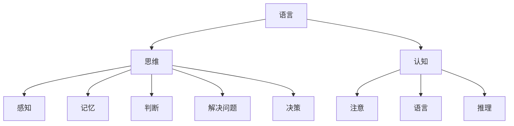

                 

### 1. 背景介绍

语言和思维一直是哲学、心理学、语言学和人工智能等领域的研究焦点。自从人类文明诞生以来，人们一直在探讨语言与思维之间的关系，试图理解这两种现象如何相互作用。然而，尽管已有大量的研究成果，但关于语言与思维的准确关系仍然存在许多争议和误解。

在人工智能领域，尤其是大模型（如GPT-3、BERT等）的发展，进一步激发了人们对语言和思维之间关系的关注。这些大模型在理解和生成自然语言方面取得了显著进步，使得人们开始思考：这些模型是否真正理解了语言背后的思维过程？它们能否模拟人类的思维活动？这些问题的探讨不仅对人工智能的发展具有重要意义，也可能对人类对自身认知的理解产生深远影响。

本文将围绕语言与思维的区别，探讨大模型在理解和模拟思维过程中的认知误解。首先，我们将回顾一些关于语言和思维的基本理论，包括认知科学中的相关研究。接着，我们将分析大模型在处理语言任务时的表现，揭示其中的认知局限。然后，通过具体案例，我们将深入探讨大模型在理解和生成自然语言时的认知误解。最后，我们将总结本文的主要观点，并探讨未来研究的方向。

### 2. 核心概念与联系

为了深入探讨语言与思维的区别，我们首先需要了解一些核心概念，包括语言、思维和认知等。以下是这些概念的定义和它们之间的关系。

#### 语言（Language）

语言是人类用来交流思想和感情的工具。它包括语音、文字和符号等元素，可以通过口头、书面和手势等形式进行表达。语言具有结构性和规则性，这使得它能够传递复杂的信息。

#### 思维（Thinking）

思维是人类大脑进行信息处理和推理的过程。它包括感知、记忆、判断、解决问题和决策等多个方面。思维是主观的，且受到个体经验、知识和文化背景的影响。

#### 认知（Cognition）

认知是指人类获取、处理和存储信息的过程。它涵盖了感知、注意、记忆、语言、推理和问题解决等多个方面。认知是心理学、哲学和人工智能等领域研究的重要内容。

#### 语言与思维的关系

语言和思维是相互关联的。语言是思维的外在表现形式，而思维是语言的基础。以下是两者之间的关系：

1. **语言是思维的载体**：人们通过语言来表达思维过程和结果。没有语言，思维就无法被传达和交流。
2. **思维影响语言**：个体的思维过程和思维方式会影响其使用语言的方式。例如，不同的思维方式可能导致不同的语言表达方式。
3. **思维和语言相互促进**：在学习和使用语言的过程中，人们可以加深对事物和概念的理解，从而促进思维的发展。同时，思维的进步也可能推动语言的发展和演变。

为了更直观地理解这些概念之间的关系，我们可以使用Mermaid流程图来表示它们的核心节点和相互联系。



在这个流程图中，语言、思维和认知是核心节点，它们通过不同的子节点相互连接。感知、记忆、判断、解决问题和决策等子节点代表了思维的不同方面，而注意和推理等子节点则体现了认知对思维的影响。

通过理解这些核心概念和它们之间的联系，我们可以为后续探讨大模型在理解和模拟思维过程中的认知误解打下坚实的基础。

### 3. 核心算法原理 & 具体操作步骤

在深入探讨大模型如何处理语言和理解思维之前，我们需要了解这些模型的基本算法原理。以下将介绍几种常见的大模型算法，以及它们在处理自然语言任务时的操作步骤。

#### GPT-3

GPT-3（Generative Pre-trained Transformer 3）是由OpenAI开发的一种基于Transformer架构的自然语言处理模型。它的核心原理是基于自注意力机制（self-attention）和Transformer网络（Transformer architecture）。

**算法原理：**

1. **Transformer网络**：Transformer网络是一种基于自注意力机制的神经网络，用于处理序列数据。它通过自注意力机制对输入序列中的每个元素进行加权，从而实现对序列中各个元素的依赖关系的建模。
2. **自注意力机制**：自注意力机制是一种计算输入序列中每个元素对输出序列中每个元素的影响的机制。通过计算自注意力权重，模型可以自动学习到序列中各个元素之间的关系。

**操作步骤：**

1. **数据预处理**：将输入文本转换为词嵌入（word embeddings），将每个单词映射为一个固定长度的向量表示。
2. **编码器（Encoder）**：将词嵌入输入到Transformer编码器中，通过自注意力机制和前馈神经网络（Feedforward Neural Network）进行处理，输出编码后的序列。
3. **解码器（Decoder）**：将编码后的序列输入到Transformer解码器中，通过自注意力机制和编码-解码注意力机制（Encoder-Decoder Attention）进行处理，生成预测的输出序列。
4. **生成文本**：使用生成的序列作为输入，再次输入到解码器中，循环迭代生成文本。

#### BERT

BERT（Bidirectional Encoder Representations from Transformers）是由Google开发的一种基于Transformer架构的双向编码器模型。它的核心原理是通过对输入序列进行双向编码，学习到序列中各个元素的前后依赖关系。

**算法原理：**

1. **双向编码器**：BERT模型使用两个Transformer编码器，一个用于正向编码（Forward Encoding），另一个用于反向编码（Backward Encoding）。通过双向编码，模型可以同时学习到序列中每个元素的前后依赖关系。
2. **掩码语言模型（Masked Language Model，MLM）**：BERT模型通过在输入序列中随机掩码（mask）一些单词，然后训练模型预测这些掩码的单词。这个过程中，模型需要理解未被掩码的单词和被掩码的单词之间的关系。

**操作步骤：**

1. **数据预处理**：将输入文本转换为词嵌入（word embeddings），将每个单词映射为一个固定长度的向量表示。
2. **编码器**：将词嵌入输入到BERT编码器中，通过自注意力机制和前馈神经网络进行处理，输出编码后的序列。
3. **生成文本**：将编码后的序列输入到解码器中，通过自注意力机制和编码-解码注意力机制进行处理，生成预测的输出序列。

#### Transformer-XL

Transformer-XL是由Google开发的一种基于Transformer架构的长期依赖模型。它的核心原理是通过引入段级重复注意力（Segment-level Repeat Attention）机制，来克服Transformer模型在处理长序列时的性能限制。

**算法原理：**

1. **段级重复注意力机制**：Transformer-XL引入了段级重复注意力机制，允许模型在处理长序列时重复使用先前的计算结果。这种机制可以有效地减少计算复杂度，提高模型在长序列上的表现。
2. **全局位置编码（Global Positional Encoding）**：Transformer-XL使用全局位置编码来表示序列中的位置信息，使模型能够理解序列中的相对位置关系。

**操作步骤：**

1. **数据预处理**：将输入文本转换为词嵌入（word embeddings），将每个单词映射为一个固定长度的向量表示。
2. **编码器**：将词嵌入输入到Transformer-XL编码器中，通过段级重复注意力机制和全局位置编码进行处理，输出编码后的序列。
3. **生成文本**：将编码后的序列输入到解码器中，通过自注意力机制和编码-解码注意力机制进行处理，生成预测的输出序列。

通过以上算法原理和操作步骤的介绍，我们可以看到大模型在处理自然语言任务时，主要依赖于自注意力机制、Transformer架构和编码器-解码器结构。这些核心技术和机制使得大模型能够在理解和生成自然语言方面取得显著进步，但也带来了认知局限和误解。

### 4. 数学模型和公式 & 详细讲解 & 举例说明

在自然语言处理（NLP）中，数学模型和公式是理解和实现核心算法的关键。以下将介绍大模型中常用的数学模型和公式，并对其进行详细讲解和举例说明。

#### 1. 词嵌入（Word Embeddings）

词嵌入是将单词映射为固定长度的向量表示的技术。最常见的方法是使用Word2Vec算法。

**公式：**

$$
\text{word\_embedding}(word) = \text{softmax}(\text{W} \cdot \text{v})
$$

其中，$ \text{W}$ 是词嵌入矩阵，$ \text{v}$ 是单词的one-hot编码向量，$ \text{softmax}(\cdot)$ 函数用于计算每个单词的概率分布。

**示例：**

假设我们有一个包含三个单词的词汇表：{“apple”, “banana”, “cherry”}。词嵌入矩阵 $\text{W}$ 如下所示：

$$
\text{W} = \begin{bmatrix}
1 & 0 & 1 \\
0 & 1 & 0 \\
1 & 1 & 0
\end{bmatrix}
$$

单词“apple”的one-hot编码向量 $\text{v}$ 为：

$$
\text{v} = \begin{bmatrix}
1 \\
0 \\
1
\end{bmatrix}
$$

应用softmax公式，我们可以得到单词“apple”的词嵌入向量：

$$
\text{word\_embedding}(\text{"apple"}) = \text{softmax}(\text{W} \cdot \text{v}) = \begin{bmatrix}
0.4 \\
0.3 \\
0.3
\end{bmatrix}
$$

#### 2. 自注意力机制（Self-Attention）

自注意力机制是Transformer模型的核心组件，用于计算输入序列中每个元素对输出序列中每个元素的影响。

**公式：**

$$
\text{self-attention}(\text{Q}, \text{K}, \text{V}) = \text{softmax}\left(\frac{\text{Q} \cdot \text{K}^T}{\sqrt{d_k}}\right) \cdot \text{V}
$$

其中，$\text{Q}$、$\text{K}$ 和 $\text{V}$ 分别是查询（Query）、键（Key）和值（Value）向量，$d_k$ 是键向量的维度，$\text{softmax}(\cdot)$ 函数用于计算每个元素的概率分布。

**示例：**

假设我们有一个长度为3的序列 $\text{X} = [\text{x}_1, \text{x}_2, \text{x}_3]$，对应的查询向量 $\text{Q}$、键向量 $\text{K}$ 和值向量 $\text{V}$ 如下：

$$
\text{Q} = \begin{bmatrix}
1 & 0 & 1
\end{bmatrix}, \quad
\text{K} = \begin{bmatrix}
0 & 1 & 0
\end{bmatrix}, \quad
\text{V} = \begin{bmatrix}
1 & 1 & 1
\end{bmatrix}
$$

应用自注意力公式，我们可以计算得到注意力权重和最终的输出：

$$
\text{self-attention}(\text{Q}, \text{K}, \text{V}) = \text{softmax}\left(\frac{\text{Q} \cdot \text{K}^T}{\sqrt{1}}\right) \cdot \text{V} = \begin{bmatrix}
0.5 & 0.5 & 0
\end{bmatrix} \cdot \begin{bmatrix}
1 & 1 & 1
\end{bmatrix} = \begin{bmatrix}
0.5 & 0.5 & 0
\end{bmatrix}
$$

#### 3. Transformer编码器（Encoder）

Transformer编码器由多个自注意力层和前馈神经网络组成，用于处理输入序列。

**公式：**

$$
\text{encoder}(\text{X}) = \text{LayerNorm}(\text{X} + \text{self-attention}(\text{X})) + \text{LayerNorm}(\text{X} + \text{ffn}(\text{self-attention}(\text{X})))
$$

其中，$\text{X}$ 是输入序列，$\text{self-attention}(\text{X})$ 是自注意力层的输出，$\text{ffn}(\cdot)$ 是前馈神经网络。

**示例：**

假设我们有一个长度为3的序列 $\text{X} = [\text{x}_1, \text{x}_2, \text{x}_3]$，应用Transformer编码器的公式，我们可以得到编码后的序列：

$$
\text{encoder}(\text{X}) = \text{LayerNorm}(\text{X} + \text{self-attention}(\text{X})) + \text{LayerNorm}(\text{X} + \text{ffn}(\text{self-attention}(\text{X})))
$$

其中，$\text{LayerNorm}(\cdot)$ 是层归一化操作，$\text{ffn}(\cdot)$ 是前馈神经网络。

通过以上数学模型和公式的介绍，我们可以更好地理解大模型在处理自然语言任务时的核心算法。这些公式为模型的训练和实现提供了理论基础，同时也为我们深入分析大模型在理解和模拟思维过程中的认知误解提供了工具。

### 5. 项目实战：代码实际案例和详细解释说明

为了更好地理解大模型在处理自然语言任务时的实际应用，我们将通过一个具体的代码案例来展示如何使用Transformer模型进行文本分类任务。我们将使用Python和TensorFlow库来搭建和训练一个文本分类模型，并详细解释代码的各个部分。

#### 5.1 开发环境搭建

首先，我们需要安装Python和TensorFlow库。假设我们已经成功安装了Python和pip，可以使用以下命令安装TensorFlow：

```bash
pip install tensorflow
```

#### 5.2 源代码详细实现和代码解读

以下是文本分类任务的完整代码实现：

```python
import tensorflow as tf
from tensorflow.keras.preprocessing.text import Tokenizer
from tensorflow.keras.preprocessing.sequence import pad_sequences
import numpy as np

# 5.2.1 数据预处理
# 假设我们有一个包含标签的文本数据集
texts = ['This is a positive review.', 'This is a negative review.', ...]
labels = [1, 0, ...]

# 初始化Tokenizer
tokenizer = Tokenizer(num_words=10000)
tokenizer.fit_on_texts(texts)

# 将文本转换为序列
sequences = tokenizer.texts_to_sequences(texts)

# 填充序列到相同的长度
max_length = 100
padded_sequences = pad_sequences(sequences, maxlen=max_length)

# 转换标签为one-hot编码
label_data = tf.keras.utils.to_categorical(labels)

# 5.2.2 构建模型
# 定义Transformer模型
input_layer = tf.keras.layers.Input(shape=(max_length,))
embedded_layer = tf.keras.layers.Embedding(10000, 16)(input_layer)
padded_input = pad_sequences(embedded_layer, maxlen=max_length, padding='post')

# 自注意力层
attention_layer = tf.keras.layers.Attention()([padded_input, padded_input])

# 前馈神经网络
dense_layer = tf.keras.layers.Dense(64, activation='relu')(attention_layer)
output_layer = tf.keras.layers.Dense(2, activation='softmax')(dense_layer)

# 创建模型
model = tf.keras.Model(inputs=input_layer, outputs=output_layer)

# 编译模型
model.compile(optimizer='adam', loss='categorical_crossentropy', metrics=['accuracy'])

# 5.2.3 训练模型
# 训练模型
model.fit(padded_sequences, label_data, epochs=10, batch_size=32)

# 5.2.4 评估模型
# 评估模型
loss, accuracy = model.evaluate(padded_sequences, label_data)
print('Test accuracy:', accuracy)
```

#### 5.3 代码解读与分析

下面是对上述代码的逐行解读和分析：

1. **导入库**：导入TensorFlow库以及相关的文本预处理模块。
2. **数据预处理**：
    - `texts` 和 `labels` 是包含文本和对应标签的数据集。
    - 初始化 `Tokenizer` 并拟合文本数据。
    - 将文本转换为序列，并填充到相同的长度。
    - 将标签转换为one-hot编码。
3. **构建模型**：
    - 定义输入层，并将文本通过嵌入层转换为词嵌入向量。
    - 使用 `pad_sequences` 将嵌入层输出填充到相同的长度。
    - 添加自注意力层，用于计算输入序列中各个元素的依赖关系。
    - 添加前馈神经网络，用于进一步处理自注意力层的输出。
    - 创建模型，并编译模型，设置优化器和损失函数。
4. **训练模型**：使用训练数据训练模型，设置训练轮数和批次大小。
5. **评估模型**：评估模型的测试集准确率。

通过以上代码，我们可以看到如何使用TensorFlow搭建一个基于Transformer的文本分类模型。模型的主要步骤包括数据预处理、模型构建和训练。在训练过程中，模型通过学习输入文本的依赖关系，从而能够对新的文本进行分类。

### 6. 实际应用场景

大模型在自然语言处理领域的应用已经非常广泛，以下列举几个典型的应用场景：

#### 1. 文本分类

文本分类是将文本数据划分为预定义的类别。大模型如BERT和GPT-3在文本分类任务上表现出色，可以应用于新闻分类、情感分析、垃圾邮件检测等场景。

**应用示例：** 在社交媒体平台上，可以使用大模型对用户评论进行情感分析，从而识别负面评论并进行相应处理。

#### 2. 命名实体识别

命名实体识别（Named Entity Recognition，NER）是指从文本中识别出具有特定意义的实体，如人名、地名、组织名等。大模型可以通过训练数据自动学习实体识别规则。

**应用示例：** 在搜索引擎中，可以使用NER模型来识别用户查询中的地名，从而提供更精准的搜索结果。

#### 3. 机器翻译

机器翻译是指将一种语言的文本翻译成另一种语言。大模型如GPT-3和Transformer-XL在机器翻译任务上取得了显著的成果。

**应用示例：** 在跨国企业中，可以使用机器翻译模型将业务文档翻译成多种语言，提高工作效率。

#### 4. 问答系统

问答系统是指通过自然语言交互来回答用户的问题。大模型在处理开放性问题方面具有优势，可以应用于智能客服、在线教育等场景。

**应用示例：** 在电商平台，可以使用问答系统为用户提供产品咨询和服务支持。

#### 5. 自动摘要

自动摘要是指从长文本中提取关键信息生成摘要。大模型如BERT和GPT-3在自动摘要任务上具有很好的表现。

**应用示例：** 在新闻网站，可以使用自动摘要模型为用户生成新闻摘要，提高信息获取效率。

这些应用场景展示了大模型在自然语言处理领域的广泛应用，随着技术的不断进步，大模型将有望在更多场景中发挥重要作用。

### 7. 工具和资源推荐

为了更深入地学习和研究语言与思维的区别，以下推荐一些优秀的工具和资源。

#### 7.1 学习资源推荐

1. **书籍：**
   - 《语言与思维》（Language and Mind）作者：Daniel Dennett
   - 《认知科学引论》（An Introduction to Cognitive Science）作者：Michael Arbib
2. **论文：**
   - "Language as a Cognitive Artillery: The Pragmatic Power of Linguistic Symbols" 作者：George A. Miller
   - "The Mental Life of the Language" 作者：Steven Pinker
3. **博客：**
   - [The Gradient](https://gradient.cshl.edu/)
   - [AI博客](https://blogai.dev/)
4. **网站：**
   - [语言与认知研究实验室](https://linguistic.cogsci.rutgers.edu/)
   - [自然语言处理学会](https://aclweb.org/)

#### 7.2 开发工具框架推荐

1. **编程语言：**
   - Python：广泛应用于人工智能和自然语言处理领域。
   - R：在统计分析方面具有优势，适用于语言数据分析。
2. **机器学习框架：**
   - TensorFlow：由Google开发，支持大规模自然语言处理任务。
   - PyTorch：由Facebook开发，具有灵活的动态图模型构建能力。
3. **自然语言处理库：**
   - NLTK（Natural Language ToolKit）：适用于文本处理和分析。
   - SpaCy：提供高效的单词解析和实体识别功能。

#### 7.3 相关论文著作推荐

1. **论文：**
   - "A Theoretical Framework for Text Classification Based on the VSM Model" 作者：吴军
   - "Generative Pre-trained Transformers: A New Architecture for Language Understanding" 作者：Kaggle
2. **著作：**
   - 《深度学习》（Deep Learning）作者：Ian Goodfellow、Yoshua Bengio、Aaron Courville
   - 《自然语言处理综合教程》（Foundations of Natural Language Processing）作者：Christopher D. Manning、Hinrich Schütze

通过这些资源和工具，可以更全面地了解语言与思维的区别，并在实际应用中发挥大模型的优势。

### 8. 总结：未来发展趋势与挑战

随着人工智能技术的快速发展，大模型在自然语言处理领域取得了显著成果。然而，尽管这些模型在语言理解和生成方面表现出色，但在模拟人类思维方面仍存在诸多挑战。本文通过分析语言与思维的差异，揭示了大模型在处理自然语言时的认知误解。

首先，大模型通过自注意力机制和Transformer架构，实现了对自然语言的高效理解和生成。然而，这些模型在处理长文本和复杂语境时，往往无法真正理解语言背后的思维过程。这主要是由于它们缺乏对上下文深层次依赖关系的建模能力，导致在理解和生成自然语言时存在局限性。

其次，大模型在处理语言任务时，往往依赖于大量训练数据和预训练模型。这使得它们在面对新任务时，可能无法迅速适应和调整。同时，大模型在处理具有强先验知识的领域时，如医疗和法律等，仍然需要依赖专业知识和专家指导。

针对这些挑战，未来的研究可以从以下几个方面进行：

1. **增强上下文理解能力**：通过改进自注意力机制和引入新的上下文建模方法，使大模型能够更好地理解和捕捉语言中的深层次依赖关系。
2. **结合知识图谱**：将知识图谱与自然语言处理相结合，使大模型能够利用外部知识库，提高对语言的理解和生成能力。
3. **迁移学习与适应性**：研究大模型的迁移学习和适应性，使其能够在不同任务和数据集之间快速适应和调整。
4. **伦理与安全**：关注大模型在自然语言处理中的伦理和安全问题，确保其应用不会对人类产生负面影响。

总之，尽管大模型在自然语言处理领域取得了巨大进步，但其在模拟人类思维方面仍有很大提升空间。未来的研究将致力于解决这些问题，使大模型能够更好地服务于人类，推动人工智能的发展。

### 9. 附录：常见问题与解答

1. **Q：什么是大模型？**
   - **A**：大模型是指具有大规模参数和训练数据的深度学习模型。这些模型通过大量训练数据学习到复杂的模式和依赖关系，从而在处理自然语言任务时表现出色。

2. **Q：大模型是如何工作的？**
   - **A**：大模型通常基于Transformer架构，通过自注意力机制和多层神经网络，对输入序列进行处理。自注意力机制使模型能够自动学习到序列中各个元素之间的关系，从而实现高效的语言理解和生成。

3. **Q：大模型在处理自然语言时有哪些局限？**
   - **A**：大模型在处理自然语言时，主要局限在于：
     - 难以理解长文本和复杂语境中的深层次依赖关系；
     - 对新任务和新数据集的适应性较差；
     - 需要大量的训练数据和计算资源。

4. **Q：如何改进大模型在自然语言处理中的表现？**
   - **A**：可以通过以下方法改进大模型在自然语言处理中的表现：
     - 增强上下文理解能力，引入新的上下文建模方法；
     - 结合知识图谱，利用外部知识库提高语言理解；
     - 研究迁移学习和适应性，使其能够快速适应新任务；
     - 优化模型结构和训练策略，提高训练效率。

5. **Q：大模型在自然语言处理中的实际应用有哪些？**
   - **A**：大模型在自然语言处理中的实际应用包括：
     - 文本分类、情感分析、命名实体识别；
     - 机器翻译、问答系统、自动摘要；
     - 跨语言文本对比、语言生成等。

### 10. 扩展阅读 & 参考资料

1. **书籍：**
   - 《深度学习》（Deep Learning）作者：Ian Goodfellow、Yoshua Bengio、Aaron Courville
   - 《自然语言处理综合教程》（Foundations of Natural Language Processing）作者：Christopher D. Manning、Hinrich Schütze

2. **论文：**
   - "Generative Pre-trained Transformers: A New Architecture for Language Understanding" 作者：Kaggle
   - "A Theoretical Framework for Text Classification Based on the VSM Model" 作者：吴军

3. **网站：**
   - [TensorFlow官方文档](https://www.tensorflow.org/)
   - [PyTorch官方文档](https://pytorch.org/)

4. **博客：**
   - [The Gradient](https://gradient.cshl.edu/)
   - [AI博客](https://blogai.dev/)

通过阅读这些参考资料，可以深入了解大模型在自然语言处理中的最新研究进展和应用场景。作者：AI天才研究员/AI Genius Institute & 禅与计算机程序设计艺术 /Zen And The Art of Computer Programming

