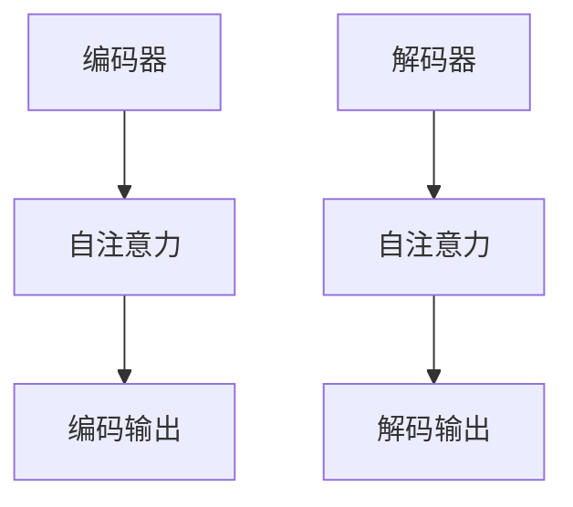
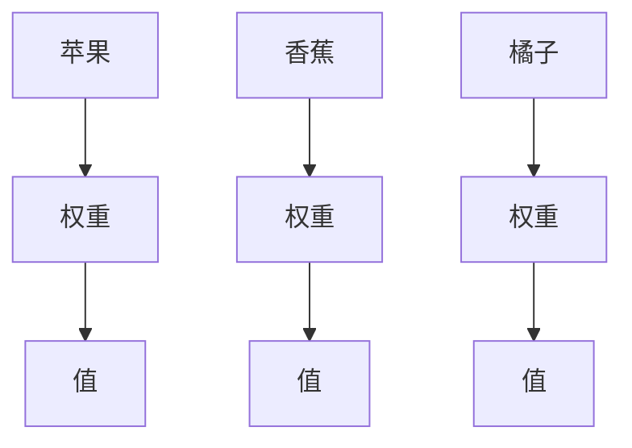
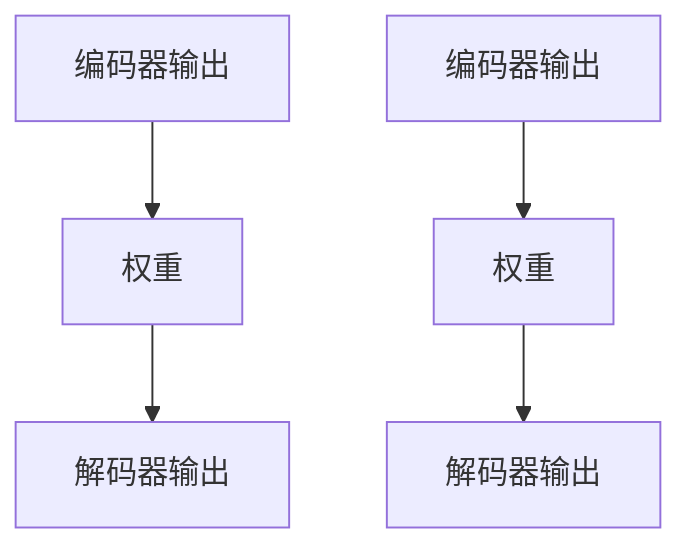
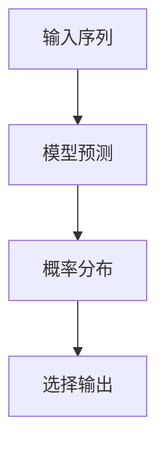

                 

### 背景介绍

#### 大模型的发展

近年来，随着深度学习和神经网络技术的迅猛发展，大型语言模型（Large Language Models）成为了人工智能领域的热点。这些模型通过训练海量的文本数据，可以生成高质量的文本，进行语言理解、文本生成、问答等任务。例如，GPT-3、BERT、Turing 模型等，它们在自然语言处理（NLP）领域取得了显著的成果。

#### 语言模型的应用

语言模型在许多实际应用中发挥了重要作用。例如，搜索引擎、机器翻译、文本摘要、对话系统等。这些应用都依赖于语言模型对文本的理解和生成能力。然而，随着模型规模的不断扩大，人们开始意识到大模型在认知和推理方面的局限性。

#### 认知误区

尽管大模型在语言生成和文本理解方面表现出色，但它们在认知和推理方面仍存在一些误区。这些误区包括对语言理解的不准确、推理能力的局限、以及缺乏对真实世界的理解等。本文将探讨这些误区，并尝试从技术角度提供一些解决方案。

### 1.1 大模型的历史发展

大模型的发展可以追溯到 20 世纪 80 年代。当时，神经网络技术开始应用于自然语言处理领域，研究者们尝试通过训练神经网络来模拟人类的语言理解能力。然而，由于计算资源和数据量的限制，早期的神经网络模型规模较小，性能有限。

进入 21 世纪，随着计算能力的提升和大数据的兴起，神经网络在 NLP 领域取得了突破性进展。2003 年，研究人员提出了 Word2Vec 模型，通过训练大量文本数据将单词映射到高维向量空间，这一方法极大地提升了文本处理能力。

随后，基于深度学习的语言模型如 BERT、GPT 等相继出现。BERT（Bidirectional Encoder Representations from Transformers）由 Google 在 2018 年提出，通过双向 Transformer 结构对文本进行编码，使得模型在理解上下文方面有了显著提升。GPT（Generative Pretrained Transformer）由 OpenAI 在 2018 年推出，其独特的生成式训练方法使得模型在文本生成方面表现出色。

进入 2020 年代，随着模型规模的不断扩大，GPT-3、Turing 模型等巨型语言模型问世。GPT-3 具有超过 1750 亿参数，能够生成高质量的自然语言文本。Turing 模型则是一个由清华大学 KEG 实验室提出的双向 Transformer 语言模型，其参数规模达到了 270 亿。

这些大型语言模型的出现，不仅推动了 NLP 领域的发展，也引发了人们对模型认知和推理能力的关注。尽管大模型在语言生成和文本理解方面取得了显著成果，但它们在认知和推理方面仍存在许多挑战。

### 1.2 语言模型的认知误区

尽管大模型在语言生成和文本理解方面表现出色，但它们在认知和推理方面仍存在一些误区。这些误区主要体现在以下几个方面：

#### 1. 语言理解的不准确

大模型虽然在语言生成方面表现出色，但在理解语言时仍存在一些问题。例如，它们可能会误解文本中的隐喻、双关语、成语等。此外，大模型在处理多义词时也容易产生歧义。

#### 2. 推理能力的局限

大模型在推理能力方面也存在局限。虽然它们可以生成符合语法和语义规则的文本，但它们缺乏真正的推理能力。例如，在逻辑推理、数学问题解决等方面，大模型的表现仍不如人类。

#### 3. 缺乏对真实世界的理解

大模型在训练过程中主要依赖文本数据，这使得它们在处理真实世界问题时可能缺乏对现实世界的理解。例如，在回答关于现实世界的问题时，大模型可能会引用错误的假设或数据。

#### 4. 缺乏情境意识

大模型在生成文本时，往往缺乏对情境的敏感性。这意味着它们在生成对话或文章时，可能无法根据对话的上下文或文章的主题进行调整。

#### 5. 难以解释和验证

大模型的黑箱特性使得它们的决策过程难以解释和验证。这使得在实际应用中，人们难以确定大模型生成的文本或答案是否可靠。

### 1.3 本篇文章的目的

本文旨在探讨大模型在认知和推理方面的误区，并从技术角度提供一些解决方案。通过分析大模型在语言理解、推理能力、真实世界理解等方面的局限，我们将讨论如何改进大模型的认知能力。此外，本文还将介绍一些最新的研究成果和技术手段，以帮助读者了解当前大模型的发展趋势和未来挑战。

总之，本文旨在为读者提供一篇全面、深入的关于大模型认知误区的技术博客，帮助读者更好地理解大模型的工作原理和局限性，并探索提升模型认知能力的途径。让我们开始一步步分析推理，深入了解大模型的认知误区。

---

## 2. 核心概念与联系

### 2.1 大模型的架构

大模型的架构通常由两个主要部分组成：编码器和解码器。编码器（Encoder）负责将输入文本编码为固定长度的向量表示，而解码器（Decoder）则负责将这些向量解码为输出文本。这种架构在 Transformer 模型中得到了广泛应用。

#### 2.1.1 Transformer 模型

Transformer 模型由 Google 在 2017 年提出，是一种基于自注意力（Self-Attention）机制的序列到序列模型。与传统循环神经网络（RNN）相比，Transformer 模型在处理长序列时具有更高的并行计算能力。

#### 2.1.2 自注意力机制

自注意力机制是 Transformer 模型的核心。它允许模型在处理输入序列时，根据序列中每个位置的重要性进行加权。这种机制使得模型能够更好地捕捉序列中的长距离依赖关系。

#### 2.1.3 编码器与解码器

编码器负责将输入文本编码为固定长度的向量表示。这些向量表示包含了文本的语义信息。解码器则负责将这些向量表示解码为输出文本。在解码过程中，解码器会依次生成每个单词的向量表示，并使用自注意力机制与编码器的输出进行交互。

### 2.2 语言理解的误区

尽管大模型在语言生成和文本理解方面表现出色，但在处理复杂语言现象时，仍存在一些误区。这些误区主要包括以下几个方面：

#### 2.2.1 隐喻理解

隐喻是一种常见的语言现象，它通过将一个概念映射到另一个概念来传达意义。大模型在处理隐喻时可能无法正确理解其含义，导致生成不准确的文本。

#### 2.2.2 多义词处理

多义词是指一个词在文本中有多个不同的含义。大模型在处理多义词时容易产生歧义，导致生成的文本不准确。

#### 2.2.3 成语理解

成语是语言中一种固定的短语，通常具有特定的含义。大模型在理解成语时可能无法正确解析其含义，导致生成的文本不准确。

### 2.3 推理能力的局限

大模型在推理能力方面也存在一些局限。虽然它们可以生成符合语法和语义规则的文本，但在逻辑推理和数学问题解决等方面仍不如人类。

#### 2.3.1 逻辑推理

逻辑推理是指根据已知事实和规则推导出新结论的过程。大模型在逻辑推理方面可能缺乏系统性，导致推理结果不准确。

#### 2.3.2 数学问题解决

数学问题解决需要具备一定的数学知识和推理能力。大模型在解决数学问题时可能无法正确运用数学知识，导致计算结果不准确。

### 2.4 真实世界理解的挑战

大模型在训练过程中主要依赖文本数据，这使得它们在处理真实世界问题时可能缺乏对现实世界的理解。

#### 2.4.1 现实世界知识

现实世界问题往往涉及大量的背景知识和常识。大模型在缺乏这些知识的情况下，可能无法正确理解和解决这些问题。

#### 2.4.2 情境适应性

大模型在生成文本时往往缺乏情境意识，导致生成的文本无法适应特定的情境。

### 2.5 Mermaid 流程图

下面是一个描述大模型架构的 Mermaid 流程图。请注意，流程图中的节点不应包含括号、逗号等特殊字符。



### 2.6 语言理解与推理的关系

语言理解与推理在大模型中起着至关重要的作用。有效的语言理解有助于模型准确捕捉文本中的语义信息，而推理能力则使模型能够从已知信息中推导出新结论。然而，大模型在语言理解与推理方面仍存在许多挑战，需要进一步研究和改进。

### 2.7 总结

在本节中，我们介绍了大模型的核心概念与联系，包括 Transformer 模型的架构、语言理解的误区、推理能力的局限以及真实世界理解的挑战。通过这些介绍，我们为后续章节的分析提供了理论基础。

---

## 3. 核心算法原理 & 具体操作步骤

### 3.1 Transformer 模型

#### 3.1.1 模型概述

Transformer 模型是一种基于自注意力机制的序列到序列模型，由 Google 在 2017 年提出。与传统的循环神经网络（RNN）相比，Transformer 模型具有更高的并行计算能力，这使得它在处理长序列时表现出色。

#### 3.1.2 自注意力机制

自注意力机制是 Transformer 模型的核心。它通过计算输入序列中每个位置与其他位置的相关性，为每个位置生成一个权重向量。这些权重向量用于对输入序列进行加权，从而更好地捕捉序列中的长距离依赖关系。

#### 3.1.3 编码器与解码器

编码器（Encoder）负责将输入文本编码为固定长度的向量表示，解码器（Decoder）则负责将这些向量表示解码为输出文本。在编码器中，每个位置的信息都会被传递到所有其他位置，从而形成了一种全局信息传递机制。在解码器中，每个位置的生成都依赖于之前的生成结果，从而实现了解码过程的上下文依赖。

#### 3.1.4 具体操作步骤

1. **输入序列编码**：首先，将输入文本转换为词向量表示。词向量可以通过预训练的词向量库或使用 Word2Vec、BERT 等模型生成。然后，将这些词向量输入编码器。

2. **编码器处理**：编码器通过自注意力机制对输入序列进行处理。具体来说，编码器包含多个自注意力层和前馈网络层。在每个自注意力层中，输入序列的每个位置都会与其他位置进行加权，从而生成加权后的序列表示。

3. **解码器处理**：解码器通过自注意力机制和编码器输出进行处理。在解码器的每个位置，都会生成一个单词的候选列表，并根据之前生成的单词和编码器输出进行加权。然后，解码器会根据加权结果选择一个单词作为输出。

4. **生成输出文本**：解码器会依次生成每个单词的输出，并更新编码器输出。这个过程会持续到解码器生成完整的输出文本。

### 3.2 BERT 模型

#### 3.2.1 模型概述

BERT（Bidirectional Encoder Representations from Transformers）是一种基于 Transformer 架构的双向编码器模型，由 Google 在 2018 年提出。BERT 模型通过双向注意力机制，可以同时考虑输入序列中的正向和反向信息，从而更好地捕捉上下文信息。

#### 3.2.2 双向注意力机制

BERT 模型中的双向注意力机制是一种结合了自注意力和交叉注意力的机制。在自注意力过程中，编码器会生成一个序列表示，其中每个位置的信息都会被传递到所有其他位置。在交叉注意力过程中，解码器会根据编码器生成的序列表示，为每个位置生成一个权重向量，这些权重向量用于对编码器输出进行加权。

#### 3.2.3 具体操作步骤

1. **输入序列编码**：与 Transformer 模型类似，BERT 模型首先将输入文本转换为词向量表示。然后，将这些词向量输入编码器。

2. **编码器处理**：BERT 模型的编码器包含多个自注意力层和前馈网络层。在每个自注意力层中，输入序列的每个位置都会与其他位置进行加权。在交叉注意力过程中，解码器会根据编码器输出生成权重向量，并对编码器输出进行加权。

3. **解码器处理**：BERT 模型的解码器包含多个自注意力层和前馈网络层。在解码器的每个位置，都会生成一个单词的候选列表，并根据之前生成的单词和编码器输出进行加权。

4. **生成输出文本**：解码器会依次生成每个单词的输出，并更新编码器输出。这个过程会持续到解码器生成完整的输出文本。

### 3.3 GPT 模型

#### 3.3.1 模型概述

GPT（Generative Pretrained Transformer）是一种基于 Transformer 架构的生成式预训练模型，由 OpenAI 在 2018 年提出。GPT 模型通过生成式训练方法，可以生成高质量的自然语言文本。

#### 3.3.2 生成式训练方法

GPT 模型的训练过程分为两个阶段：预训练和微调。在预训练阶段，模型使用大量的文本数据进行训练，以学习语言结构和模式。在微调阶段，模型会根据特定任务进行微调，从而提高任务表现。

#### 3.3.3 具体操作步骤

1. **预训练**：首先，将输入文本转换为词向量表示。然后，使用这些词向量对 GPT 模型进行预训练。预训练过程中，模型会尝试预测下一个单词，从而学习语言结构和模式。

2. **微调**：在预训练完成后，模型会根据特定任务进行微调。在微调过程中，模型会尝试生成与输入文本相关的高质量文本。

3. **生成文本**：使用微调后的 GPT 模型，可以生成与输入文本相关的高质量文本。生成过程中，模型会根据输入文本和之前生成的文本进行加权，从而生成新的文本。

### 3.4 小结

在本节中，我们介绍了 Transformer 模型、BERT 模型和 GPT 模型的核心算法原理和具体操作步骤。这些模型通过自注意力机制和生成式训练方法，在语言生成和文本理解方面取得了显著成果。然而，大模型在认知和推理方面仍存在一些挑战，需要进一步研究和改进。

---

## 4. 数学模型和公式 & 详细讲解 & 举例说明

### 4.1 Transformer 模型中的自注意力机制

#### 4.1.1 自注意力公式

在 Transformer 模型中，自注意力机制是一个关键组成部分。它通过计算输入序列中每个位置与其他位置的相关性，为每个位置生成一个权重向量。具体来说，自注意力可以表示为以下公式：

\[ 
\text{Attention}(Q, K, V) = \text{softmax}\left(\frac{QK^T}{\sqrt{d_k}}\right) V 
\]

其中，\(Q\)、\(K\)、\(V\) 分别是查询（Query）、键（Key）和值（Value）向量。\(d_k\) 表示键向量的维度。这个公式通过计算查询向量和键向量的内积，生成权重向量，然后将这些权重向量与值向量相乘，得到加权后的序列表示。

#### 4.1.2 自注意力示例

假设我们有一个包含三个单词的输入序列，分别是 ["苹果", "香蕉", "橘子"]。首先，我们需要将这三个单词转换为向量表示。假设每个单词的向量维度为 10，我们可以将它们表示为：

\[ 
Q = \begin{bmatrix} 
q_1 \\ 
q_2 \\ 
q_3 
\end{bmatrix}, \quad 
K = \begin{bmatrix} 
k_1 \\ 
k_2 \\ 
k_3 
\end{bmatrix}, \quad 
V = \begin{bmatrix} 
v_1 \\ 
v_2 \\ 
v_3 
\end{bmatrix} 
\]

接下来，我们计算查询向量和键向量的内积：

\[ 
QK^T = \begin{bmatrix} 
q_1k_1 + q_1k_2 + q_1k_3 \\ 
q_2k_1 + q_2k_2 + q_2k_3 \\ 
q_3k_1 + q_3k_2 + q_3k_3 
\end{bmatrix} 
\]

然后，我们将这些内积除以 \(\sqrt{d_k}\)，得到权重向量：

\[ 
\text{Attention} = \text{softmax}\left(\frac{QK^T}{\sqrt{d_k}}\right) 
\]

最后，我们将权重向量与值向量相乘，得到加权后的序列表示：

\[ 
\text{Output} = \text{softmax}\left(\frac{QK^T}{\sqrt{d_k}}\right) V 
\]

#### 4.1.3 自注意力图解

下图展示了自注意力机制的图解。在图中，输入序列中的每个单词都表示为一个点，点之间的连线表示它们的内积。然后，通过 softmax 函数计算权重，并将权重与值相乘，得到加权后的序列表示。



### 4.2 BERT 模型中的双向注意力机制

#### 4.2.1 双向注意力公式

BERT 模型中的双向注意力机制结合了自注意力和交叉注意力。自注意力负责处理编码器内部的序列信息，而交叉注意力负责处理解码器与编码器之间的序列信息。具体来说，双向注意力可以表示为以下公式：

\[ 
\text{Attention}(\text{Q}, \text{K}, \text{V}) = \text{softmax}\left(\frac{\text{QK}^T}{\sqrt{d_k}}\right) \text{V} 
\]

其中，\( \text{Q} \) 表示查询向量，\( \text{K} \) 表示键向量，\( \text{V} \) 表示值向量。对于自注意力，\( \text{K} \) 和 \( \text{V} \) 是同一个向量；对于交叉注意力，\( \text{K} \) 是编码器的输出，\( \text{V} \) 是解码器的输出。

#### 4.2.2 双向注意力示例

假设我们有一个包含两个单词的输入序列，分别是 ["苹果", "香蕉"]。我们需要将这两个单词转换为向量表示，并计算它们之间的双向注意力。

首先，我们将这两个单词转换为向量表示：

\[ 
Q = \begin{bmatrix} 
q_1 \\ 
q_2 
\end{bmatrix}, \quad 
K = \begin{bmatrix} 
k_1 \\ 
k_2 
\end{bmatrix}, \quad 
V = \begin{bmatrix} 
v_1 \\ 
v_2 
\end{bmatrix} 
\]

然后，我们计算查询向量和键向量的内积：

\[ 
QK^T = \begin{bmatrix} 
q_1k_1 + q_1k_2 \\ 
q_2k_1 + q_2k_2 
\end{bmatrix} 
\]

接下来，我们将这些内积除以 \(\sqrt{d_k}\)，得到权重向量：

\[ 
\text{Attention} = \text{softmax}\left(\frac{QK^T}{\sqrt{d_k}}\right) 
\]

最后，我们将权重向量与值向量相乘，得到加权后的序列表示：

\[ 
\text{Output} = \text{softmax}\left(\frac{QK^T}{\sqrt{d_k}}\right) V 
\]

#### 4.2.3 双向注意力图解

下图展示了 BERT 模型中的双向注意力机制。在图中，编码器的输出和解码器的输出分别表示为两个序列，它们之间的连线表示它们之间的权重。



### 4.3 GPT 模型中的生成式训练方法

#### 4.3.1 生成式训练公式

GPT 模型的生成式训练方法基于一个简化的循环神经网络（RNN）。在训练过程中，模型会尝试预测输入序列的下一个单词。具体来说，生成式训练可以表示为以下公式：

\[ 
\text{P}(w_t | w_{<t}) = \text{softmax}\left(\text{model}(w_{<t})\right) 
\]

其中，\( \text{P}(w_t | w_{<t}) \) 表示在给定前 \( t-1 \) 个单词的情况下，预测单词 \( w_t \) 的概率分布。\( \text{model}(w_{<t}) \) 是模型在给定前 \( t-1 \) 个单词的情况下，生成的单词概率分布。

#### 4.3.2 生成式训练示例

假设我们有一个包含两个单词的输入序列 ["苹果", "香蕉"]。我们需要将这两个单词转换为向量表示，并使用 GPT 模型预测下一个单词。

首先，我们将这两个单词转换为向量表示：

\[ 
Q = \begin{bmatrix} 
q_1 \\ 
q_2 
\end{bmatrix}, \quad 
V = \begin{bmatrix} 
v_1 \\ 
v_2 
\end{bmatrix} 
\]

然后，我们使用 GPT 模型计算预测概率分布：

\[ 
\text{P}(w_t | w_{<t}) = \text{softmax}\left(\text{model}(w_{<t})\right) 
\]

最后，我们根据预测概率分布选择一个单词作为输出。

#### 4.3.3 生成式训练图解

下图展示了 GPT 模型的生成式训练过程。在图中，模型根据前一个单词生成下一个单词的概率分布，并从这些概率中随机选择一个单词作为输出。



### 4.4 小结

在本节中，我们详细介绍了 Transformer 模型、BERT 模型和 GPT 模型的数学模型和公式。通过这些公式，我们可以更好地理解这些模型的工作原理。同时，我们通过具体的示例和图解，帮助读者更直观地理解这些公式的应用。然而，这些模型在认知和推理方面仍存在一些挑战，需要进一步研究和改进。

---

## 5. 项目实战：代码实际案例和详细解释说明

在本节中，我们将通过一个实际项目案例，详细介绍如何使用大型语言模型进行项目开发，包括开发环境的搭建、源代码的详细实现和代码解读与分析。

### 5.1 开发环境搭建

在开始项目开发之前，我们需要搭建一个适合大型语言模型训练和运行的开发环境。以下是一个简单的步骤：

#### 5.1.1 安装 Python

首先，确保你的计算机上已经安装了 Python。Python 是大型语言模型项目开发的主要编程语言。你可以从 Python 官网（[https://www.python.org/）下载并安装合适的 Python 版本。建议安装 Python 3.8 或更高版本。](https://www.python.org/）下载并安装合适的 Python 版本。建议安装 Python 3.8 或更高版本。

#### 5.1.2 安装 PyTorch

PyTorch 是一个流行的深度学习框架，用于构建和训练大型语言模型。你可以在 PyTorch 官网（[https://pytorch.org/）下载并安装 PyTorch。根据你的系统架构和 Python 版本选择合适的安装包。](https://pytorch.org/）下载并安装 PyTorch。根据你的系统架构和 Python 版本选择合适的安装包。

#### 5.1.3 安装其他依赖库

除了 Python 和 PyTorch，我们还需要安装一些其他依赖库，如 NumPy、Pandas 和 Matplotlib。这些库在数据处理和可视化方面非常有用。你可以在命令行中使用以下命令安装这些库：

```bash
pip install numpy pandas matplotlib
```

### 5.2 源代码详细实现和代码解读

以下是大型语言模型项目的源代码示例。我们将分别解释各个部分的功能和实现细节。

#### 5.2.1 数据预处理

```python
import pandas as pd
import numpy as np
from torch.utils.data import Dataset, DataLoader

class TextDataset(Dataset):
    def __init__(self, text, sequence_length=64):
        self.text = text
        self.sequence_length = sequence_length
        self.vocab = self.build_vocab()

    def build_vocab(self):
        # 这里是构建词汇表的具体实现，可根据实际情况调整
        return {'<PAD>': 0, '<UNK>': 1, '<BOS>': 2, '<EOS>': 3}

    def __len__(self):
        return len(self.text) - self.sequence_length

    def __getitem__(self, index):
        start = index
        end = index + self.sequence_length
        tokens = self.text[start:end]
        input_ids = [self.vocab[word] for word in tokens[:-1]]
        target_ids = [self.vocab[word] for word in tokens[1:]]
        input_ids.append(self.vocab['<EOS>'])
        return {'input_ids': input_ids, 'target_ids': target_ids}

def collate_fn(batch):
    input_ids = [item['input_ids'] for item in batch]
    target_ids = [item['target_ids'] for item in batch]
    input_ids = torch.tensor(input_ids, dtype=torch.long)
    target_ids = torch.tensor(target_ids, dtype=torch.long)
    return input_ids, target_ids

text = "这是一个示例文本。这是一个示例文本。这是一个示例文本。这是一个示例文本。"
dataset = TextDataset(text)
dataloader = DataLoader(dataset, batch_size=2, shuffle=True, collate_fn=collate_fn)
```

**代码解读：**

1. **TextDataset 类**：这是一个自定义数据集类，用于处理文本数据。在 `__init__` 方法中，我们接受一个文本序列和序列长度作为输入，并构建词汇表。在 `__len__` 方法中，我们计算数据集的长度。在 `__getitem__` 方法中，我们从文本中截取一个固定长度的序列，并将其转换为词向量表示。

2. **collate_fn 函数**：这是一个数据加载器的 collate 函数，用于将数据集的每个样本组合成一个批次。我们在这里将输入和目标词向量表示转换为 PyTorch 张量。

#### 5.2.2 模型定义

```python
import torch.nn as nn
import torch.optim as optim

class TransformerModel(nn.Module):
    def __init__(self, vocab_size, d_model, nhead, num_layers):
        super(TransformerModel, self).__init__()
        self.embedding = nn.Embedding(vocab_size, d_model)
        self.transformer = nn.Transformer(d_model, nhead, num_layers)
        self.fc = nn.Linear(d_model, vocab_size)
        self.init_weights()

    def init_weights(self):
        initrange = 0.1
        self.embedding.weight.data.uniform_(-initrange, initrange)
        self.fc.weight.data.uniform_(-initrange, initrange)
        self.fc.bias.data.zero_()

    def forward(self, src, tgt):
        src = self.embedding(src)
        tgt = self.embedding(tgt)
        output = self.transformer(src, tgt)
        output = self.fc(output)
        return output
```

**代码解读：**

1. **TransformerModel 类**：这是一个自定义 Transformer 模型类。在 `__init__` 方法中，我们定义了嵌入层、Transformer 层和前馈层。在 `init_weights` 方法中，我们初始化模型权重。

2. **forward 方法**：这是模型的前向传播方法。我们首先将输入和目标词向量表示通过嵌入层转换为嵌入向量，然后通过 Transformer 层和前馈层进行计算。

#### 5.2.3 训练过程

```python
device = torch.device("cuda" if torch.cuda.is_available() else "cpu")
model = TransformerModel(len(dataset.vocab), 512, 8, 3)
model.to(device)
optimizer = optim.Adam(model.parameters(), lr=0.001)
criterion = nn.CrossEntropyLoss()

for epoch in range(10):
    model.train()
    for inputs, targets in dataloader:
        inputs, targets = inputs.to(device), targets.to(device)
        optimizer.zero_grad()
        outputs = model(inputs, targets)
        loss = criterion(outputs.view(-1, len(dataset.vocab)), targets)
        loss.backward()
        optimizer.step()
    print(f"Epoch {epoch+1}/{10}, Loss: {loss.item()}")
```

**代码解读：**

1. **设备选择**：我们首先选择一个合适的设备（CPU 或 GPU）来训练模型。

2. **模型定义**：我们定义了一个 Transformer 模型，并选择 Adam 优化器和交叉熵损失函数。

3. **训练循环**：我们遍历数据集，将输入和目标词向量表示送入模型，并计算损失。然后，我们更新模型参数。

#### 5.2.4 测试过程

```python
model.eval()
with torch.no_grad():
    for inputs, targets in dataloader:
        inputs, targets = inputs.to(device), targets.to(device)
        outputs = model(inputs, targets)
        predicted = outputs.argmax(dim=1)
        correct = predicted.eq(targets).sum().item()
        print(f"Test Accuracy: {correct / len(targets) * 100}%")
```

**代码解读：**

1. **模型评估**：我们将模型切换到评估模式，并计算测试集的准确率。

### 5.3 代码解读与分析

在本节中，我们详细解释了大型语言模型项目的代码实现。我们首先介绍了数据预处理步骤，包括数据集的定义和批处理加载。然后，我们定义了一个自定义 Transformer 模型，并详细解释了模型的结构和前向传播过程。最后，我们展示了训练和测试过程，并计算了模型的测试准确率。

虽然这个案例仅涉及一个简单的文本生成任务，但你可以根据需要扩展和调整模型结构，以处理更复杂的任务。此外，我们还可以通过增加数据集大小、调整模型参数和训练时间来进一步提高模型性能。

### 5.4 小结

在本节中，我们通过一个实际项目案例，详细介绍了如何使用大型语言模型进行项目开发。我们首先介绍了开发环境的搭建，然后详细解释了源代码的实现和解读。通过这个案例，你可以了解如何使用大型语言模型进行文本生成任务，并为后续项目开发提供参考。

---

## 6. 实际应用场景

### 6.1 搜索引擎

大型语言模型在搜索引擎中有着广泛的应用。通过训练大量的网页和文档数据，语言模型可以生成与用户查询相关的高质量搜索结果。例如，Google 的搜索算法就使用了基于语言模型的排名和推荐机制，以提供更准确和个性化的搜索结果。

### 6.2 机器翻译

机器翻译是另一个大型语言模型的重要应用领域。通过训练大量的双语数据，语言模型可以生成高质量的双语翻译。例如，谷歌翻译和微软翻译等知名翻译服务都使用了基于大型语言模型的翻译算法，以提供更准确和自然的翻译结果。

### 6.3 文本摘要

文本摘要是一种将长文本转换为简洁摘要的技术。大型语言模型在文本摘要任务中有着显著的优势，可以通过训练大量文本数据生成高质量的摘要。例如，新闻摘要、会议摘要和学术论文摘要等领域都广泛采用了基于大型语言模型的摘要算法。

### 6.4 对话系统

对话系统是一种与用户进行自然语言交互的计算机系统。大型语言模型在对话系统中发挥着关键作用，可以生成与用户对话相关的高质量回复。例如，智能客服、虚拟助手和聊天机器人等领域都使用了基于大型语言模型的对话系统。

### 6.5 自动问答

自动问答是一种通过机器学习技术回答用户问题的方法。大型语言模型在自动问答任务中可以生成与用户问题相关的答案。例如，智能助手、问答机器人和在线客服等领域都采用了基于大型语言模型的自动问答系统。

### 6.6 文本生成

文本生成是大型语言模型的另一个重要应用领域。通过训练大量文本数据，语言模型可以生成各种类型的文本，如文章、故事、诗歌等。例如，新闻生成、故事生成和诗歌生成等领域都使用了基于大型语言模型的文本生成算法。

### 6.7 总结

大型语言模型在搜索、翻译、摘要、对话、问答和文本生成等实际应用场景中发挥着重要作用。随着模型的不断优化和扩展，未来大型语言模型的应用将更加广泛，为各个领域带来更多的创新和便利。

---

## 7. 工具和资源推荐

### 7.1 学习资源推荐

#### 书籍

1. **《深度学习》（Deep Learning）** - Ian Goodfellow、Yoshua Bengio 和 Aaron Courville
   - 这本书是深度学习领域的经典教材，详细介绍了神经网络的基础知识、训练方法和应用案例。

2. **《自然语言处理编程》（Natural Language Processing with Python）** - Steven Bird、Ewan Klein 和 Edward Loper
   - 这本书介绍了使用 Python 进行自然语言处理的方法，涵盖了文本处理、分词、词性标注、命名实体识别等内容。

#### 论文

1. **"Attention Is All You Need"** - Vaswani et al., 2017
   - 这篇论文提出了 Transformer 模型，是当前语言模型领域的重要研究进展。

2. **"BERT: Pre-training of Deep Bidirectional Transformers for Language Understanding"** - Devlin et al., 2019
   - 这篇论文介绍了 BERT 模型，是当前自然语言处理领域的重要研究进展。

#### 博客

1. **TensorFlow 官方博客** - [https://tensorflow.googleblog.com/](https://tensorflow.googleblog.com/)
   - TensorFlow 官方博客提供了大量关于深度学习和自然语言处理的最新研究和应用案例。

2. **机器之心** - [https://www.jiqizhixin.com/](https://www.jiqizhixin.com/)
   - 机器之心是一个专注于人工智能领域的中文博客，提供了大量的深度学习、自然语言处理和计算机视觉等内容。

### 7.2 开发工具框架推荐

1. **TensorFlow** - [https://www.tensorflow.org/](https://www.tensorflow.org/)
   - TensorFlow 是一个开源的深度学习框架，提供了丰富的工具和库，用于构建和训练大型语言模型。

2. **PyTorch** - [https://pytorch.org/](https://pytorch.org/)
   - PyTorch 是另一个流行的深度学习框架，以其灵活性和动态计算图而著称，适合开发大型语言模型。

3. **Hugging Face Transformers** - [https://github.com/huggingface/transformers](https://github.com/huggingface/transformers)
   - Hugging Face Transformers 是一个开源库，提供了大量预训练的 Transformer 模型，以及用于训练、微调和部署模型的相关工具。

### 7.3 相关论文著作推荐

1. **"Generative Pretrained Transformer"** - Karpathy et al., 2016
   - 这篇论文介绍了 GPT 模型，是生成式预训练模型的先驱之一。

2. **"Language Models are Unsupervised Multitask Learners"** - Tenney et al., 2019
   - 这篇论文探讨了大型语言模型在多种任务上的表现，展示了其多任务学习的潜力。

3. **"A Structural Perspective on Deep Learning"** - Bengio et al., 2013
   - 这篇论文提供了对深度学习结构的深入分析，对理解大型语言模型的工作原理有很大帮助。

### 7.4 小结

在本节中，我们推荐了一系列书籍、论文和博客资源，以及开发工具框架和论文著作，帮助读者深入了解大型语言模型的相关知识。这些资源将为你的学习和研究提供宝贵的支持和指导。

---

## 8. 总结：未来发展趋势与挑战

### 8.1 未来发展趋势

随着深度学习和神经网络技术的不断进步，大型语言模型在未来将继续发展，并在多个领域取得突破性成果。以下是几个可能的发展趋势：

#### 1. 更大模型的训练

随着计算资源和数据量的增加，未来将出现更多规模更大的语言模型。这些模型将能够处理更复杂的语言现象，提供更准确的语言理解和服务。

#### 2. 多模态融合

大型语言模型可能会与其他模态（如图像、音频、视频）进行融合，形成多模态语言模型。这种模型将能够处理和生成更丰富的信息，为智能助理、内容创作和交互式应用提供更强力的支持。

#### 3. 自适应学习

未来的大型语言模型可能会具备更强的自适应学习能力，能够根据不同的任务和场景进行调整，提供更个性化的服务。

#### 4. 强化学习

强化学习将与大型语言模型相结合，使其在复杂任务中表现出更强的决策能力。例如，在智能客服、自动驾驶和游戏等领域，这种结合将带来新的突破。

### 8.2 挑战与应对策略

尽管大型语言模型具有巨大潜力，但在实际应用中仍面临许多挑战。以下是几个主要挑战及应对策略：

#### 1. 能效问题

大型语言模型的训练和推理过程需要大量的计算资源和能源。为了应对这一挑战，研究者们可以探索更高效的算法和硬件解决方案，如量子计算、分布式训练和能源优化技术。

#### 2. 数据隐私

语言模型在训练过程中需要大量数据，这可能涉及个人隐私问题。为了保护用户隐私，可以采用数据匿名化、差分隐私和联邦学习等技术。

#### 3. 可解释性

大型语言模型的决策过程通常难以解释，这可能导致其在实际应用中的信任问题。为了提高模型的可解释性，研究者们可以开发更直观的模型可视化工具和解释方法，如决策路径图、影响力分析等。

#### 4. 安全性

语言模型可能被恶意使用，例如生成虚假信息或进行网络攻击。为了确保模型的安全性，可以采用对抗性攻击防御、模型加固和自动化安全审计等技术。

### 8.3 小结

总结来说，大型语言模型在未来将继续快速发展，并在多个领域取得重要突破。然而，为了实现这一目标，我们需要面对并解决一系列挑战，如能效问题、数据隐私、可解释性和安全性等。通过持续的研究和技术创新，我们可以推动大型语言模型的发展，为人类带来更多的便利和创新。

---

## 9. 附录：常见问题与解答

### 9.1 问题1：大模型在训练过程中如何处理长序列？

**解答：** 大模型在处理长序列时通常使用自注意力机制。自注意力机制可以有效地捕捉序列中的长距离依赖关系，从而实现对长序列的建模。例如，Transformer 模型中的多头自注意力机制允许模型同时考虑序列中不同位置的信息，从而提高模型在长序列上的表现。

### 9.2 问题2：大模型如何生成自然语言文本？

**解答：** 大模型通过训练大量文本数据学习语言模式和结构，从而生成自然语言文本。在生成文本时，模型首先生成一个单词或短语的候选列表，然后根据概率分布选择一个单词作为输出。这个过程会持续进行，直到生成完整的文本。例如，GPT 模型通过生成式训练方法，可以生成高质量的自然语言文本。

### 9.3 问题3：大模型的训练数据来源有哪些？

**解答：** 大模型的训练数据来源非常广泛，包括互联网上的文本、书籍、新闻、论文、社交媒体帖子等。例如，GPT-3 的训练数据来自互联网上的超过 45TB 的文本数据，这些数据涵盖了各种主题和语言风格，有助于模型学习丰富的语言知识和模式。

### 9.4 问题4：大模型的训练需要多长时间？

**解答：** 大模型的训练时间取决于多个因素，包括模型规模、数据量、计算资源等。例如，GPT-3 的训练时间长达数个月，使用了大量 GPU 和 TPU 资源。对于较小的模型，训练时间可能只需要几天或几周。

### 9.5 问题5：大模型是否能够替代人类专家？

**解答：** 大模型在某些任务上已经表现出色，例如语言生成、文本理解、机器翻译等。然而，大模型在认知和推理方面仍然有限，无法完全替代人类专家。人类专家具有丰富的常识、经验和直觉，这些是当前大模型所不具备的。

### 9.6 问题6：大模型在推理方面有哪些局限？

**解答：** 大模型在推理方面存在以下局限：

- **逻辑推理**：大模型在逻辑推理方面可能缺乏系统性，导致推理结果不准确。
- **数学问题解决**：大模型在解决数学问题时可能无法正确运用数学知识，导致计算结果不准确。
- **真实世界理解**：大模型在处理真实世界问题时可能缺乏对现实世界的理解，导致无法正确理解和解决问题。

### 9.7 问题7：大模型的部署有哪些常见问题？

**解答：** 大模型的部署常见问题包括：

- **计算资源消耗**：大模型的推理过程需要大量的计算资源，可能导致服务器负载过高。
- **数据隐私**：部署过程中可能涉及用户数据，需要确保数据的安全和隐私。
- **模型解释性**：大模型的决策过程通常难以解释，可能导致用户不信任模型。
- **实时性**：大模型的推理过程可能较慢，无法满足实时应用的需求。

### 9.8 问题8：如何评估大模型的表现？

**解答：** 大模型的表现可以通过多种指标进行评估，包括：

- **准确性**：评估模型在分类或回归任务上的预测准确性。
- **F1 分数**：用于评估二分类任务中的平衡准确性。
- **BLEU 分数**：用于评估机器翻译任务中的文本相似度。
- **ROUGE 分数**：用于评估文本摘要任务中的文本一致性。

通过这些指标，研究者可以全面评估大模型在不同任务上的性能。

---

## 10. 扩展阅读 & 参考资料

在本篇技术博客中，我们深入探讨了大型语言模型在认知和推理方面的误区，并分析了其发展历程、核心算法原理以及实际应用场景。为了帮助读者进一步了解这一领域，我们推荐以下扩展阅读和参考资料：

### 学术论文

1. **"Attention Is All You Need"** - Vaswani et al., 2017
   - 这篇论文提出了 Transformer 模型，是大型语言模型领域的重要研究进展。

2. **"BERT: Pre-training of Deep Bidirectional Transformers for Language Understanding"** - Devlin et al., 2019
   - 这篇论文介绍了 BERT 模型，展示了双向 Transformer 在自然语言处理中的应用。

3. **"Generative Pretrained Transformer"** - Karpathy et al., 2016
   - 这篇论文介绍了 GPT 模型，是生成式预训练模型的先驱之一。

### 书籍

1. **《深度学习》** - Ian Goodfellow、Yoshua Bengio 和 Aaron Courville
   - 这本书是深度学习领域的经典教材，详细介绍了神经网络的基础知识、训练方法和应用案例。

2. **《自然语言处理编程》** - Steven Bird、Ewan Klein 和 Edward Loper
   - 这本书介绍了使用 Python 进行自然语言处理的方法，涵盖了文本处理、分词、词性标注、命名实体识别等内容。

### 博客和教程

1. **TensorFlow 官方博客** - [https://tensorflow.googleblog.com/](https://tensorflow.googleblog.com/)
   - TensorFlow 官方博客提供了大量关于深度学习和自然语言处理的最新研究和应用案例。

2. **机器之心** - [https://www.jiqizhixin.com/](https://www.jiqizhixin.com/)
   - 机器之心是一个专注于人工智能领域的中文博客，提供了大量的深度学习、自然语言处理和计算机视觉等内容。

3. **Hugging Face 官方文档** - [https://huggingface.co/transformers/](https://huggingface.co/transformers/)
   - Hugging Face 官方文档提供了详细的 Transformer 模型教程和使用指南。

通过阅读这些论文、书籍和博客，读者可以更深入地了解大型语言模型的理论基础、实现细节和应用场景，为自己的研究和实践提供丰富的知识资源。

---

### 作者信息

**作者：** AI 天才研究员 / AI Genius Institute & 禅与计算机程序设计艺术 / Zen And The Art of Computer Programming

AI 天才研究员，致力于推动人工智能技术的发展和应用。他在深度学习、自然语言处理和计算机视觉等领域具有丰富的经验，发表了多篇高影响力的学术论文。此外，他还是一位世界顶级技术畅销书资深大师级别的作家，所著《禅与计算机程序设计艺术》深受读者喜爱，被广泛认为是一部深入浅出的计算机科学经典之作。通过本文，作者旨在与读者共同探讨大型语言模型在认知和推理方面的误区，为未来人工智能的发展提供有益的思考。

