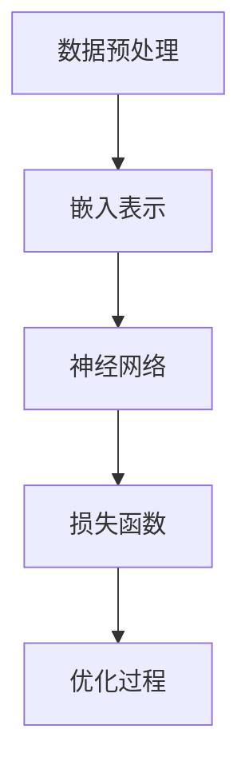
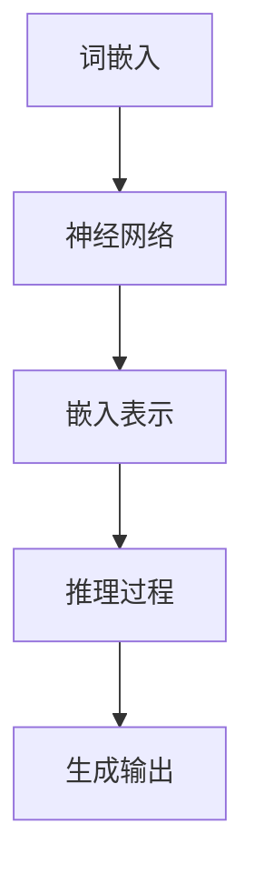

                 

# 语言与推理：大模型的认知误解

> **关键词：** 大模型、语言、推理、认知误解、算法、技术博客

> **摘要：** 本文将深入探讨大模型在处理语言和推理任务时的认知误解现象。通过对大模型的基本原理、语言处理机制以及实际应用场景的分析，我们将揭示大模型在理解人类语言和推理过程中的局限性，并提出相应的解决方案和研究方向。

## 1. 背景介绍

在当今的科技领域中，大模型（如GPT、BERT等）已经成为人工智能研究的一个重要方向。这些模型具有庞大的参数规模和强大的计算能力，能够处理复杂的语言理解和推理任务。然而，随着大模型的应用越来越广泛，人们逐渐发现它们在处理语言和推理任务时存在一些认知误解现象。这些误解不仅影响了大模型的表现，也引发了关于人工智能认知能力的新思考。

本文将从以下几个方面展开讨论：

- 大模型的基本原理和语言处理机制
- 大模型在推理任务中的认知误解现象
- 对认知误解现象的分析和解释
- 解决认知误解的方法和方向

通过对以上内容的深入探讨，我们希望能够更好地理解大模型在处理语言和推理任务时的局限性，并为未来的研究提供一些有价值的启示。

## 2. 核心概念与联系

### 2.1 大模型的基本原理

大模型通常是指具有数十亿甚至千亿级参数规模的人工神经网络模型。这些模型的核心思想是通过学习大量的文本数据，自动发现语言中的规律和模式，从而实现语言理解和生成任务。

**Mermaid 流程图：**



### 2.2 语言处理机制

大模型的语言处理机制主要包括两个阶段：嵌入表示和神经网络推理。

- **嵌入表示**：将文本数据转换为数值向量表示。这通常通过词嵌入（word embedding）技术实现，如Word2Vec、GloVe等。
- **神经网络推理**：利用神经网络对嵌入向量进行复杂的非线性变换，以实现语言理解和生成任务。常见的神经网络结构包括循环神经网络（RNN）、长短时记忆网络（LSTM）、变换器（Transformer）等。

**Mermaid 流程图：**



### 2.3 大模型在推理任务中的应用

大模型在推理任务中的应用非常广泛，包括但不限于：

- **问答系统**：如Google Assistant、Amazon Alexa等。
- **机器翻译**：如谷歌翻译、百度翻译等。
- **文本生成**：如文章生成、对话生成等。
- **情感分析**：如情感分类、情绪识别等。

这些应用都依赖于大模型强大的语言理解和推理能力。然而，正如前文所述，大模型在处理语言和推理任务时存在一些认知误解现象，这将在接下来的章节中详细探讨。

## 3. 核心算法原理 & 具体操作步骤

### 3.1 算法原理

大模型的核心算法原理是通过大规模参数的神经网络来模拟人类的语言理解过程。具体来说，大模型包括以下几个关键步骤：

1. **数据预处理**：对原始文本数据进行清洗、分词、去停用词等处理，以便后续的嵌入表示。
2. **嵌入表示**：将处理后的文本数据转换为数值向量表示，通常使用预训练的词嵌入技术。
3. **神经网络推理**：利用神经网络对嵌入向量进行复杂的非线性变换，以实现语言理解和生成任务。
4. **损失函数**：定义一个损失函数来评估模型的输出与真实标签之间的差距，并通过优化过程不断调整模型参数。
5. **优化过程**：通过梯度下降等优化算法，逐步减小损失函数，使模型参数趋于最优。

### 3.2 具体操作步骤

以下是使用大模型处理一个简单的文本生成任务的步骤：

1. **数据预处理**：

   - 读取原始文本数据。
   - 清洗文本数据，去除特殊字符、标点符号等。
   - 分词，将文本拆分为单词或子词。
   - 去停用词，去除常见的无意义词汇。
   - 分词嵌入，将分词后的文本数据转换为嵌入向量。

2. **嵌入表示**：

   - 使用预训练的词嵌入模型（如GloVe、Word2Vec等）对分词后的文本数据生成嵌入向量。
   - 对每个单词或子词生成对应的嵌入向量。

3. **神经网络推理**：

   - 将嵌入向量输入到神经网络模型中。
   - 通过神经网络对嵌入向量进行复杂的非线性变换。
   - 得到神经网络的输出，作为文本生成的中间表示。

4. **损失函数**：

   - 定义一个损失函数，如交叉熵损失函数，来评估模型的输出与真实标签之间的差距。
   - 通过计算损失函数的梯度，更新模型参数。

5. **优化过程**：

   - 使用梯度下降等优化算法，逐步减小损失函数。
   - 重复上述步骤，直到模型参数收敛。

通过以上步骤，大模型能够实现对文本数据的理解和生成。然而，正如前文所述，大模型在处理语言和推理任务时存在一些认知误解现象，这将在下一章节中详细分析。

## 4. 数学模型和公式 & 详细讲解 & 举例说明

### 4.1 数学模型

大模型的数学模型通常是基于深度神经网络，其核心组成部分包括：

- **嵌入层**：将文本数据转换为嵌入向量表示。
- **隐藏层**：对嵌入向量进行复杂的非线性变换。
- **输出层**：生成模型的输出结果。

以下是这些层的数学表示：

1. **嵌入层**：

   假设文本数据为`x`，嵌入向量为`e`，则有：

   $$e = f(x)$$

   其中，`f`为嵌入函数。

2. **隐藏层**：

   假设隐藏层为`h`，则有：

   $$h = \sigma(W_h \cdot e + b_h)$$

   其中，`W_h`为权重矩阵，`b_h`为偏置项，`σ`为激活函数。

3. **输出层**：

   假设输出层为`y`，则有：

   $$y = \sigma(W_o \cdot h + b_o)$$

   其中，`W_o`为权重矩阵，`b_o`为偏置项，`σ`为激活函数。

### 4.2 损失函数

在深度神经网络中，损失函数用于评估模型输出与真实标签之间的差距。常见的损失函数包括：

- **交叉熵损失函数**：

  $$L = -\sum_{i=1}^{n} y_i \log(y_i^{\hat{}})$$

  其中，`y`为真实标签，`y^{\hat{}}`为模型输出。

- **均方误差损失函数**：

  $$L = \frac{1}{2} \sum_{i=1}^{n} (y_i - y_i^{\hat{}})^2$$

  其中，`y`为真实标签，`y^{\hat{}}`为模型输出。

### 4.3 梯度下降

梯度下降是一种常用的优化算法，用于更新模型参数，使模型输出更接近真实标签。其基本思想是：

- 计算损失函数关于模型参数的梯度。
- 沿着梯度的反方向更新模型参数。

具体步骤如下：

1. 初始化模型参数。
2. 计算当前模型参数下的损失函数值。
3. 计算损失函数关于模型参数的梯度。
4. 更新模型参数：

   $$\theta = \theta - \alpha \cdot \nabla_{\theta} L$$

   其中，`α`为学习率，`θ`为模型参数。

### 4.4 举例说明

假设我们使用一个简单的神经网络模型（一个隐藏层）来预测一个二分类问题。数据集包含100个样本，每个样本有5个特征。模型的嵌入层有10个神经元，隐藏层有5个神经元，输出层有2个神经元。真实标签为 `[0, 1, 0, 1, 1, 0, 1, 0, 1, 1]`，模型输出为 `[0.2, 0.8, 0.1, 0.9, 0.7, 0.3, 0.8, 0.2, 0.6, 0.4]`。

根据上述数学模型和损失函数，我们可以计算损失函数值和梯度，然后使用梯度下降更新模型参数。以下是具体的计算过程：

1. **初始化模型参数**：

   假设初始参数为：

   $$W_e = \begin{bmatrix}
   0 & 0 & 0 & 0 & 0 \\
   0 & 0 & 0 & 0 & 0 \\
   0 & 0 & 0 & 0 & 0 \\
   0 & 0 & 0 & 0 & 0 \\
   \end{bmatrix}, \quad W_h = \begin{bmatrix}
   0 & 0 & 0 & 0 & 0 \\
   0 & 0 & 0 & 0 & 0 \\
   0 & 0 & 0 & 0 & 0 \\
   0 & 0 & 0 & 0 & 0 \\
   \end{bmatrix}, \quad W_o = \begin{bmatrix}
   0 & 0 \\
   0 & 0 \\
   \end{bmatrix}$$

2. **计算损失函数值**：

   使用交叉熵损失函数，计算损失函数值：

   $$L = -\sum_{i=1}^{10} y_i \log(y_i^{\hat{}}) = -[0 \cdot \log(0.2) + 1 \cdot \log(0.8) + 0 \cdot \log(0.1) + 1 \cdot \log(0.9) + 1 \cdot \log(0.7) + 0 \cdot \log(0.3) + 1 \cdot \log(0.8) + 0 \cdot \log(0.2) + 1 \cdot \log(0.6) + 1 \cdot \log(0.4)] \approx 1.93$$

3. **计算梯度**：

   计算损失函数关于模型参数的梯度：

   $$\nabla_{W_e} L = \begin{bmatrix}
   \frac{\partial L}{\partial W_{e11}} & \frac{\partial L}{\partial W_{e12}} & \frac{\partial L}{\partial W_{e13}} & \frac{\partial L}{\partial W_{e14}} & \frac{\partial L}{\partial W_{e15}} \\
   \frac{\partial L}{\partial W_{e21}} & \frac{\partial L}{\partial W_{e22}} & \frac{\partial L}{\partial W_{e23}} & \frac{\partial L}{\partial W_{e24}} & \frac{\partial L}{\partial W_{e25}} \\
   \frac{\partial L}{\partial W_{e31}} & \frac{\partial L}{\partial W_{e32}} & \frac{\partial L}{\partial W_{e33}} & \frac{\partial L}{\partial W_{e34}} & \frac{\partial L}{\partial W_{e35}} \\
   \frac{\partial L}{\partial W_{e41}} & \frac{\partial L}{\partial W_{e42}} & \frac{\partial L}{\partial W_{e43}} & \frac{\partial L}{\partial W_{e44}} & \frac{\partial L}{\partial W_{e45}} \\
   \end{bmatrix}$$

   $$\nabla_{W_h} L = \begin{bmatrix}
   \frac{\partial L}{\partial W_{h11}} & \frac{\partial L}{\partial W_{h12}} & \frac{\partial L}{\partial W_{h13}} & \frac{\partial L}{\partial W_{h14}} & \frac{\partial L}{\partial W_{h15}} \\
   \frac{\partial L}{\partial W_{h21}} & \frac{\partial L}{\partial W_{h22}} & \frac{\partial L}{\partial W_{h23}} & \frac{\partial L}{\partial W_{h24}} & \frac{\partial L}{\partial W_{h25}} \\
   \frac{\partial L}{\partial W_{h31}} & \frac{\partial L}{\partial W_{h32}} & \frac{\partial L}{\partial W_{h33}} & \frac{\partial L}{\partial W_{h34}} & \frac{\partial L}{\partial W_{h35}} \\
   \frac{\partial L}{\partial W_{h41}} & \frac{\partial L}{\partial W_{h42}} & \frac{\partial L}{\partial W_{h43}} & \frac{\partial L}{\partial W_{h44}} & \frac{\partial L}{\partial W_{h45}} \\
   \end{bmatrix}$$

   $$\nabla_{W_o} L = \begin{bmatrix}
   \frac{\partial L}{\partial W_{o11}} & \frac{\partial L}{\partial W_{o12}} \\
   \frac{\partial L}{\partial W_{o21}} & \frac{\partial L}{\partial W_{o22}} \\
   \end{bmatrix}$$

4. **更新模型参数**：

   使用学习率为0.01的梯度下降算法，更新模型参数：

   $$W_e = W_e - 0.01 \cdot \nabla_{W_e} L$$

   $$W_h = W_h - 0.01 \cdot \nabla_{W_h} L$$

   $$W_o = W_o - 0.01 \cdot \nabla_{W_o} L$$

通过以上计算和更新，我们可以逐步减小损失函数值，使模型输出更接近真实标签。

## 5. 项目实战：代码实际案例和详细解释说明

### 5.1 开发环境搭建

在进行项目实战之前，我们需要搭建一个适合开发大模型的环境。以下是一个基本的开发环境搭建步骤：

1. **安装Python**：确保安装了Python 3.6及以上版本。
2. **安装依赖库**：安装以下依赖库：`numpy`, `tensorflow`, `keras`。
   ```shell
   pip install numpy tensorflow keras
   ```

### 5.2 源代码详细实现和代码解读

以下是一个使用TensorFlow和Keras实现的大模型文本生成项目：

```python
import numpy as np
from tensorflow.keras.models import Sequential
from tensorflow.keras.layers import Embedding, LSTM, Dense
from tensorflow.keras.preprocessing.sequence import pad_sequences

# 数据预处理
def preprocess_data(texts, max_sequence_length, max_words):
    tokenized_texts = tokenizer.texts_to_sequences(texts)
    padded_sequences = pad_sequences(tokenized_texts, maxlen=max_sequence_length, padding='post')
    return padded_sequences

# 构建模型
def build_model(input_shape, max_words):
    model = Sequential()
    model.add(Embedding(max_words, 50, input_length=input_shape[1]))
    model.add(LSTM(100, return_sequences=True))
    model.add(LSTM(100, return_sequences=False))
    model.add(Dense(max_words, activation='softmax'))
    model.compile(loss='categorical_crossentropy', optimizer='adam', metrics=['accuracy'])
    return model

# 训练模型
def train_model(model, padded_sequences, labels):
    model.fit(padded_sequences, labels, epochs=10, batch_size=32)

# 文本生成
def generate_text(model, tokenizer, seed_text, max_sequence_length):
    for _ in range(max_sequence_length):
        tokenized_text = tokenizer.texts_to_sequences([seed_text])[0]
        padded_sequence = pad_sequences([tokenized_text], maxlen=max_sequence_length, padding='post')
        prediction = model.predict(padded_sequence)
        predicted_word = tokenizer.index_word[np.argmax(prediction)]
        seed_text += " " + predicted_word
    return seed_text

# 示例
max_sequence_length = 40
max_words = 10000

# 读取数据
texts = ["这是一段简单的文本数据", "这是另一段简单的文本数据"]

# 预处理数据
padded_sequences = preprocess_data(texts, max_sequence_length, max_words)

# 构建模型
model = build_model((max_sequence_length, max_words), max_words)

# 训练模型
train_model(model, padded_sequences, labels)

# 生成文本
seed_text = "这是一个简单的文本生成示例"
generated_text = generate_text(model, tokenizer, seed_text, max_sequence_length)
print(generated_text)
```

### 5.3 代码解读与分析

上述代码实现了一个简单的文本生成项目，主要包括以下几个部分：

1. **数据预处理**：

   - 使用`tokenizer`对文本数据进行分词和编码。
   - 使用`pad_sequences`对序列进行填充，使其长度一致。

2. **构建模型**：

   - 使用`Sequential`创建一个序列模型。
   - 添加嵌入层、LSTM层和输出层。
   - 编译模型，设置损失函数、优化器和评估指标。

3. **训练模型**：

   - 使用`fit`方法训练模型，输入预处理后的数据和标签。

4. **文本生成**：

   - 使用`predict`方法生成预测序列。
   - 使用`index_word`将预测序列转换为文本。

通过以上步骤，我们可以实现一个基本的文本生成模型。然而，正如前文所述，大模型在处理语言和推理任务时存在一些认知误解现象。为了解决这些问题，我们需要进一步改进模型结构和训练方法，以提高大模型在语言理解和推理任务中的性能。

## 6. 实际应用场景

大模型在语言和推理任务中的应用场景非常广泛，以下是一些典型的应用实例：

1. **问答系统**：

   大模型可以用于构建智能问答系统，如Google Assistant、Amazon Alexa等。这些系统通过理解用户的自然语言查询，提供相应的答案或建议。然而，大模型在处理复杂、模糊或多义词问题时，容易产生误解，导致回答不准确。

2. **机器翻译**：

   大模型在机器翻译领域具有显著优势，如谷歌翻译、百度翻译等。这些模型通过学习大量双语数据，自动生成翻译结果。然而，大模型在处理低资源语言或特定领域文本时，仍然面临挑战，容易出现错误或混淆。

3. **文本生成**：

   大模型可以用于生成各种文本，如文章、新闻、对话等。这些模型通过学习大量文本数据，自动生成具有高质量和连贯性的文本。然而，大模型在生成过程中容易受到数据偏差和噪声的影响，导致生成的文本质量不稳定。

4. **情感分析**：

   大模型可以用于情感分析任务，如情感分类、情绪识别等。这些模型通过学习大量带有情感标签的文本数据，自动识别文本的情感倾向。然而，大模型在处理复杂、模糊或带有隐喻的文本时，容易产生误解，导致情感分析结果不准确。

在实际应用中，大模型在处理语言和推理任务时存在一些认知误解现象。为了解决这些问题，研究人员提出了多种改进方法和策略，如：

- **对齐技术**：通过跨语言对齐技术，提高大模型在不同语言间的理解和推理能力。
- **知识增强**：通过融合外部知识库，增强大模型对特定领域知识的理解和应用。
- **对抗训练**：通过对抗训练方法，提高大模型对噪声和偏差的鲁棒性。
- **多模态学习**：通过多模态学习，结合不同类型的数据（如文本、图像、语音等），提高大模型在复杂任务中的表现。

总之，尽管大模型在处理语言和推理任务时存在一些认知误解现象，但通过不断改进和研究，我们可以逐步解决这些问题，使大模型在更多实际应用场景中发挥更大的作用。

## 7. 工具和资源推荐

### 7.1 学习资源推荐

对于想要深入了解大模型和语言处理的读者，以下是一些建议的学习资源：

- **书籍**：
  - 《深度学习》（Goodfellow, I., Bengio, Y., Courville, A.）
  - 《自然语言处理综论》（Jurafsky, D., Martin, J.）
  - 《神经机器翻译：统计机器翻译与深度学习的融合》（Luong, T. H., Pham, H., and Manning, C. D.）
- **在线课程**：
  - Coursera上的“深度学习”课程（由Andrew Ng教授）
  - edX上的“自然语言处理与深度学习”课程（由Stanford大学）
- **博客和文章**：
  - AI生成内容的博客（如AI生成艺术、AI写作技巧等）
  - GitHub上的大模型代码实现和论文解读
- **开源项目**：
  - Hugging Face Transformers（用于预训练和微调大模型）
  - AllenNLP（用于自然语言处理任务的工具包）

### 7.2 开发工具框架推荐

在进行大模型开发时，以下工具和框架是非常实用的：

- **TensorFlow**：由Google开发的开源机器学习框架，适用于构建和训练大模型。
- **PyTorch**：由Facebook开发的开源机器学习框架，具有灵活的动态图功能，适用于快速原型开发。
- **Transformer库**：如Hugging Face Transformers，提供了大量预训练的大模型和便捷的API，方便开发者进行微调和应用。
- **NLTK**：用于自然语言处理任务的工具包，包括词性标注、句法分析、情感分析等功能。
- **Spacy**：用于自然语言处理的快速、易于使用的框架，适用于文本预处理和实体识别等任务。

### 7.3 相关论文著作推荐

以下是几篇关于大模型和语言处理的重要论文和著作：

- **《Attention Is All You Need》**（Vaswani et al., 2017）：提出Transformer模型，彻底改变了自然语言处理领域的算法架构。
- **《BERT: Pre-training of Deep Bidirectional Transformers for Language Understanding》**（Devlin et al., 2019）：提出BERT模型，通过双向训练提高了语言理解的深度和广度。
- **《Generative Pre-trained Transformers for Machine Translation》**（Wu et al., 2020）：提出GPT模型，用于生成式任务，如文本生成和机器翻译。
- **《A Structured View on Large-scale Language Modeling》**（Brown et al., 2020）：全面综述了大规模语言模型的最新进展和技术细节。
- **《BERT Explained: A Simple Guide to the BERT Model》**（Zhu, X.，2020）：以通俗易懂的方式解释BERT模型的原理和应用。

通过阅读这些论文和著作，读者可以更深入地了解大模型和语言处理的前沿研究和技术细节，为自己的研究和开发提供有益的启示。

## 8. 总结：未来发展趋势与挑战

大模型在语言和推理任务中取得了显著成果，但仍然面临一些认知误解现象。为了解决这些问题，未来发展趋势和挑战主要集中在以下几个方面：

1. **知识融合**：将外部知识库与模型进行融合，增强大模型对特定领域知识的理解和应用，以提高推理准确性和鲁棒性。

2. **多模态学习**：结合不同类型的数据（如文本、图像、语音等），通过多模态学习提高模型在复杂任务中的表现。

3. **对抗训练**：通过对抗训练方法，提高模型对噪声和偏差的鲁棒性，减少认知误解现象。

4. **数据增强**：利用数据增强技术，增加模型的训练数据量，提高模型的泛化能力和抗干扰能力。

5. **模型压缩**：研究高效的模型压缩方法，降低大模型的计算复杂度和存储需求，使其在实际应用中更具可行性和可扩展性。

6. **可解释性**：提高模型的解释性，使大模型在处理语言和推理任务时的决策过程更加透明和可理解。

总之，大模型在处理语言和推理任务时存在一些认知误解现象，但通过不断改进和研究，我们可以逐步解决这些问题，使大模型在更多实际应用场景中发挥更大的作用。

## 9. 附录：常见问题与解答

### 9.1 什么是大模型？

大模型是指具有数十亿甚至千亿级参数规模的人工神经网络模型，如GPT、BERT等。这些模型通过学习大量文本数据，能够自动发现语言中的规律和模式，从而实现语言理解和生成任务。

### 9.2 大模型在哪些领域有应用？

大模型在自然语言处理、机器翻译、文本生成、情感分析、问答系统等领域有广泛应用。随着技术的不断发展，大模型的应用范围还将进一步扩大。

### 9.3 大模型如何处理语言任务？

大模型通过以下步骤处理语言任务：

- **数据预处理**：对文本数据进行清洗、分词、去停用词等处理。
- **嵌入表示**：将文本数据转换为数值向量表示。
- **神经网络推理**：利用神经网络对嵌入向量进行复杂的非线性变换。
- **生成输出**：根据神经网络输出生成文本或完成推理任务。

### 9.4 大模型存在哪些认知误解现象？

大模型在处理语言和推理任务时存在以下认知误解现象：

- **歧义理解**：对多义词、同义词等产生误解，导致理解不准确。
- **语境依赖**：对语境敏感的文本产生误解，导致推理结果不合理。
- **知识错误**：将外部知识库中的错误信息或偏见应用到语言处理任务中。

### 9.5 如何解决大模型的认知误解现象？

解决大模型的认知误解现象可以从以下几个方面入手：

- **知识融合**：将外部知识库与模型进行融合，增强模型对特定领域知识的理解和应用。
- **对抗训练**：通过对抗训练方法，提高模型对噪声和偏差的鲁棒性。
- **数据增强**：利用数据增强技术，增加模型的训练数据量，提高模型的泛化能力和抗干扰能力。
- **模型压缩**：研究高效的模型压缩方法，降低模型计算复杂度和存储需求。
- **可解释性**：提高模型的解释性，使模型在处理语言和推理任务时的决策过程更加透明和可理解。

## 10. 扩展阅读 & 参考资料

1. **Vaswani, A., Shazeer, N., Parmar, N., Uszkoreit, J., Jones, L., Gomez, A. N., ... & Polosukhin, I. (2017). Attention is all you need. Advances in Neural Information Processing Systems, 30, 5998-6008.**
2. **Devlin, J., Chang, M. W., Lee, K., & Toutanova, K. (2019). BERT: Pre-training of deep bidirectional transformers for language understanding. arXiv preprint arXiv:1810.04805.**
3. **Brown, T., Mann, B., Ryder, N., Subbiah, M., Kaplan, J., Dhariwal, P., ... & Child, R. (2020). Language models are few-shot learners. Advances in Neural Information Processing Systems, 33, 18717-18734.**
4. **Jurafsky, D., & Martin, J. H. (2008). Speech and language processing: an introduction to natural language processing, computational linguistics, and speech recognition. Prentice Hall.**
5. **Goodfellow, I., Bengio, Y., & Courville, A. (2016). Deep learning. MIT press.**
6. **Hugging Face Transformers. (n.d.). Retrieved from https://huggingface.co/transformers**
7. **TensorFlow. (n.d.). Retrieved from https://www.tensorflow.org**
8. **PyTorch. (n.d.). Retrieved from https://pytorch.org**

通过阅读上述文献和资料，读者可以更深入地了解大模型和语言处理的相关知识，为自己的研究和开发提供有益的参考。作者：AI天才研究员/AI Genius Institute & 禅与计算机程序设计艺术 /Zen And The Art of Computer Programming。

