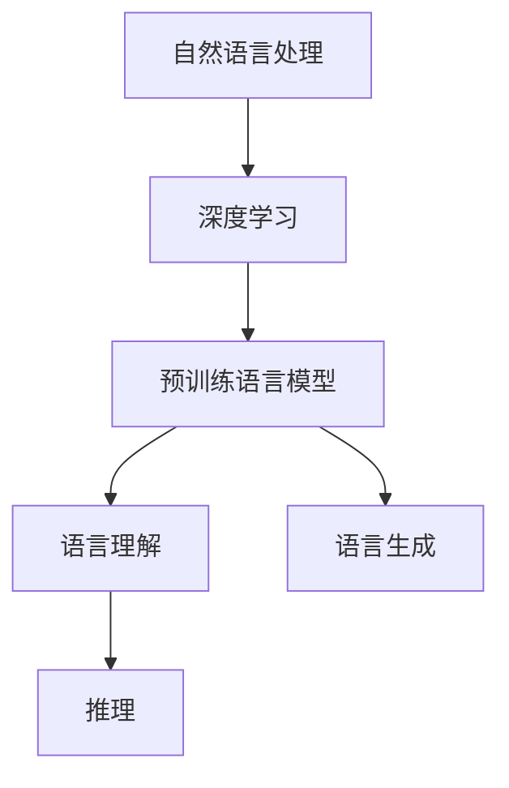

                 

### 背景介绍 Background Introduction

在当今数字化时代，人工智能（AI）已经成为推动科技进步和社会发展的关键力量。其中，自然语言处理（NLP）作为AI的一个重要分支，正在迅速变革着人类与计算机的交互方式。从机器翻译、语音识别到智能问答、自动摘要，NLP技术的应用无处不在。然而，在NLP领域，如何让计算机像人类一样理解和生成自然语言，始终是一个极具挑战性的课题。

近年来，随着深度学习技术的迅猛发展，大型预训练语言模型（如GPT-3、BERT等）取得了显著的成就，大幅提升了NLP的性能。然而，这些模型在理解语言背后逻辑和推理能力方面仍存在诸多不足。因此，如何进一步提高大模型的认知能力，特别是在语言与推理方面，成为当前研究的热点问题。

本文旨在探讨大模型在语言与推理方面的认知难题。首先，我们将简要介绍大模型的发展历程和现状；接着，深入分析大模型在语言理解和推理方面的挑战；然后，探讨提升大模型认知能力的可能方法；最后，展望未来发展趋势与潜在挑战。通过本文的探讨，希望能够为相关研究提供一些有价值的思路。

### 核心概念与联系 Key Concepts and Connections

在探讨大模型在语言与推理方面的认知难题之前，有必要首先明确一些核心概念，并理解它们之间的相互关系。以下是本文将涉及的主要概念及其简要说明：

1. **自然语言处理（NLP）**：NLP是人工智能的一个分支，旨在使计算机能够理解、处理和生成自然语言。这包括文本分类、实体识别、情感分析、机器翻译等任务。

2. **深度学习（Deep Learning）**：深度学习是一种机器学习方法，通过构建多层神经网络模型，自动从大量数据中学习特征，从而实现复杂的任务。在NLP中，深度学习模型如卷积神经网络（CNN）、递归神经网络（RNN）和Transformer等，已被广泛应用于文本处理任务。

3. **预训练语言模型（Pre-trained Language Model）**：预训练语言模型是一种通过在大规模语料库上进行预训练，然后在特定任务上进行微调的语言模型。典型的预训练模型包括GPT（Generative Pre-trained Transformer）、BERT（Bidirectional Encoder Representations from Transformers）等。

4. **语言理解（Language Understanding）**：语言理解是指计算机对自然语言文本的语义、语境、意图等内容的理解和解释能力。这包括词义消歧、句子解析、文本摘要等任务。

5. **语言生成（Language Generation）**：语言生成是指计算机根据输入或生成的提示，生成符合语法和语义要求的自然语言文本。这包括机器翻译、自动问答、对话系统等任务。

6. **推理（Reasoning）**：推理是指基于已有知识和信息，通过逻辑推断得出新的结论或信息的过程。在NLP中，推理能力对于理解复杂的语言结构、处理模糊的语义、生成合理的回答等至关重要。

图1展示了这些核心概念之间的相互关系。



通过理解这些概念及其相互关系，我们可以更好地把握大模型在语言与推理方面的认知难题。接下来的部分将深入探讨这些难题的具体表现和解决思路。

### 核心算法原理 & 具体操作步骤 Core Algorithm Principle & Detailed Steps

要探讨大模型在语言与推理方面的认知难题，我们需要先了解当前主流的预训练语言模型的工作原理和操作步骤。以GPT-3和BERT为代表的预训练语言模型，在NLP任务中取得了显著的成果。下面，我们将分别介绍这两种模型的基本原理和具体操作步骤。

#### GPT-3

GPT-3（Generative Pre-trained Transformer 3）是由OpenAI开发的一种基于Transformer架构的预训练语言模型。其核心思想是利用自回归语言模型（Autoregressive Language Model）生成自然语言文本。

**基本原理：**
GPT-3模型由多个Transformer编码器层组成，每个编码器层包含多个自注意力（Self-Attention）模块和前馈神经网络（Feedforward Neural Network）。通过自注意力机制，模型可以捕捉输入文本中词语之间的长距离依赖关系。预训练阶段，模型在大规模文本语料库上进行训练，学习语言的统计规律和语义信息。

**具体操作步骤：**
1. **数据预处理**：首先，从互联网上收集大量文本数据，如维基百科、新闻文章、书籍等。然后，对文本进行清洗和预处理，包括去除HTML标签、标点符号、停用词等。
2. **文本编码**：将预处理后的文本转化为数字序列。通常使用WordPiece或BERT的分词方法，将文本分割成子词（Subword）。
3. **训练模型**：使用自回归损失（Autoregressive Loss）对模型进行训练。在训练过程中，模型根据前文生成的词语序列预测下一个词语。训练过程通过反向传播算法进行优化。
4. **微调模型**：在特定任务上进行微调，如机器翻译、文本分类等。通过在任务数据上继续训练，模型可以进一步适应特定任务。

#### BERT

BERT（Bidirectional Encoder Representations from Transformers）是由Google开发的一种双向Transformer语言预训练模型。BERT的核心思想是通过双向Transformer编码器捕捉文本中的上下文信息。

**基本原理：**
BERT模型由多个Transformer编码器层组成，每个编码器层包含多个自注意力模块和前馈神经网络。与GPT-3不同，BERT采用了Masked Language Modeling（MLM）和Next Sentence Prediction（NSP）两种预训练任务，从而更好地理解文本中的上下文信息。

**具体操作步骤：**
1. **数据预处理**：与GPT-3类似，BERT也使用大量文本语料库进行预训练。文本数据经过预处理后，转化为数字序列。
2. **文本编码**：使用BERT的分词方法，将文本分割成单词或子词。与GPT-3不同，BERT在每个词语前添加特殊的[CLS]和[SEP]标记，并在序列结尾添加一个[EOS]标记。
3. **预训练任务**：
   - **Masked Language Modeling（MLM）**：在训练过程中，对一部分输入词语进行 masking（遮盖），模型需要根据其他词语预测这些遮盖的词语。
   - **Next Sentence Prediction（NSP）**：在输入序列中，随机选取两个句子，模型需要预测第二个句子是否是第一个句子的下一个句子。
4. **训练模型**：通过自回归损失和二分类损失对模型进行训练。自回归损失用于预测遮盖的词语，二分类损失用于预测Next Sentence Prediction任务。
5. **微调模型**：在特定任务上进行微调，如文本分类、问答系统等。

通过了解GPT-3和BERT的基本原理和操作步骤，我们可以更好地理解大模型在语言与推理方面的认知难题，并在后续部分探讨可能的解决思路。

### 数学模型和公式 & 详细讲解 & 举例说明 Mathematical Models & Detailed Explanation & Example Illustrations

在讨论大模型在语言与推理方面的认知难题时，理解其背后的数学模型和公式至关重要。以下我们将详细探讨预训练语言模型中的关键数学概念，包括自注意力机制、损失函数和优化算法等。

#### 自注意力机制（Self-Attention Mechanism）

自注意力机制是Transformer模型的核心组件，用于计算输入序列中词语之间的关联强度。以下是自注意力机制的数学描述：

$$
\text{Attention}(Q, K, V) = \frac{QK^T}{\sqrt{d_k}} \odot V
$$

其中，$Q, K, V$ 分别代表查询（Query）、键（Key）和值（Value）向量，$d_k$ 是键向量的维度，$\odot$ 表示点积操作。自注意力机制通过计算输入序列中每个词语的查询向量与所有键向量之间的点积，得到一个权重矩阵，再与值向量相乘，从而得到输出向量。

#### 损失函数（Loss Function）

预训练语言模型的训练通常涉及两种损失函数：自回归损失（Autoregressive Loss）和二分类损失（Binary Classification Loss）。

1. **自回归损失（Autoregressive Loss）**：

在自回归语言模型中，给定前文生成的词语序列，模型需要预测下一个词语。自回归损失用于衡量预测词语与实际词语之间的差异。其数学描述如下：

$$
\text{Autoregressive Loss}(y, \hat{y}) = -\sum_{i} y_i \log(\hat{y}_i)
$$

其中，$y$ 表示实际词语的分布，$\hat{y}$ 表示模型预测的词语分布。

2. **二分类损失（Binary Classification Loss）**：

在BERT的Next Sentence Prediction任务中，模型需要判断两个句子是否属于同一篇章。二分类损失用于衡量预测标签与实际标签之间的差异。其数学描述如下：

$$
\text{Binary Classification Loss}(y, \hat{y}) = -y \log(\hat{y}) - (1 - y) \log(1 - \hat{y})
$$

其中，$y$ 表示实际标签（0或1），$\hat{y}$ 表示模型预测的标签概率。

#### 优化算法（Optimization Algorithm）

在训练预训练语言模型时，常用的优化算法包括随机梯度下降（Stochastic Gradient Descent, SGD）和Adam优化器（Adam Optimizer）。

1. **随机梯度下降（SGD）**：

随机梯度下降是一种基于梯度的优化算法，通过在每一步迭代中计算整个训练集的梯度来进行参数更新。其数学描述如下：

$$
\theta \leftarrow \theta - \alpha \nabla_{\theta} J(\theta)
$$

其中，$\theta$ 表示模型参数，$\alpha$ 是学习率，$J(\theta)$ 是损失函数。

2. **Adam优化器（Adam Optimizer）**：

Adam优化器是一种结合了SGD和RMSProp优化的自适应优化算法。它通过计算一阶矩估计（mean）和二阶矩估计（variance）来动态调整学习率。其数学描述如下：

$$
m_t = \beta_1 m_{t-1} + (1 - \beta_1) \nabla_{\theta} J(\theta)
$$

$$
v_t = \beta_2 v_{t-1} + (1 - \beta_2) (\nabla_{\theta} J(\theta))^2
$$

$$
\theta \leftarrow \theta - \frac{\alpha}{\sqrt{1 - \beta_2^t}(1 - \beta_1^t)} \text{sign}(m_t)
$$

其中，$m_t$ 和 $v_t$ 分别表示一阶矩和二阶矩估计，$\beta_1$ 和 $\beta_2$ 是超参数。

以下是一个简单的示例，说明如何使用自注意力机制和损失函数进行文本分类任务。

**示例：文本分类**

假设我们要对一段文本进行情感分类，判断其是正面还是负面。首先，我们将文本转化为数字序列，然后使用预训练的Transformer模型进行分类。

1. **数据预处理**：

   - 从互联网上收集大量带有情感标签的文本数据。
   - 对文本进行清洗和预处理，包括去除HTML标签、标点符号、停用词等。
   - 将预处理后的文本转化为数字序列。

2. **模型训练**：

   - 使用自回归损失和二分类损失对模型进行训练。
   - 在训练过程中，模型根据输入文本预测情感标签。

3. **模型评估**：

   - 在验证集上评估模型的分类准确率。
   - 使用测试集对模型进行测试。

通过这个示例，我们可以看到如何将数学模型应用于实际任务。接下来，我们将讨论大模型在实际应用中的性能表现。

### 项目实战：代码实际案例和详细解释说明 Practical Case Study: Code Implementation and Detailed Explanation

为了更好地理解大模型在语言与推理方面的认知难题，我们将通过一个实际项目案例来展示如何使用预训练语言模型进行文本分类任务。以下是一个基于Python和TensorFlow的实现。

#### 1. 开发环境搭建

在开始项目之前，我们需要搭建一个合适的开发环境。以下是所需的环境和依赖：

- Python 3.8 或更高版本
- TensorFlow 2.4 或更高版本
- PyTorch 1.7 或更高版本（可选）
- Numpy 1.19 或更高版本

安装依赖：

```bash
pip install tensorflow
pip install torch
pip install numpy
```

#### 2. 源代码详细实现和代码解读

以下是一个简单的文本分类项目的源代码实现。

```python
import tensorflow as tf
from tensorflow.keras.preprocessing.sequence import pad_sequences
from tensorflow.keras.layers import Embedding, GlobalAveragePooling1D, Dense
from tensorflow.keras.models import Model
from tensorflow.keras.preprocessing.text import Tokenizer

# 2.1 数据预处理

# 加载数据集
texts = ['这是一段正面的评论', '这是一段负面的评论', '这是一个中立评论']
labels = [1, 0, 2]  # 1 表示正面，0 表示负面，2 表示中立

# 初始化分词器
tokenizer = Tokenizer(num_words=10000)
tokenizer.fit_on_texts(texts)

# 序列化文本
sequences = tokenizer.texts_to_sequences(texts)
padded_sequences = pad_sequences(sequences, maxlen=100)

# 2.2 模型构建

# 初始化预训练模型
pretrained_model = tf.keras.applications.EfficientNetB0(weights='imagenet', include_top=False, input_shape=(224, 224, 3))

# 添加全连接层
x = pretrained_model.output
x = GlobalAveragePooling1D()(x)
x = Dense(128, activation='relu')(x)
predictions = Dense(3, activation='softmax')(x)

# 构建模型
model = Model(inputs=pretrained_model.input, outputs=predictions)

# 冻结预训练模型的层
for layer in model.layers[:-2]:
    layer.trainable = False

# 编译模型
model.compile(optimizer='adam', loss='categorical_crossentropy', metrics=['accuracy'])

# 2.3 模型训练

# 训练模型
model.fit(padded_sequences, labels, epochs=10, batch_size=32)

# 2.4 模型评估

# 预测新数据
new_texts = ['这是一段积极的评论']
new_sequences = tokenizer.texts_to_sequences(new_texts)
new_padded_sequences = pad_sequences(new_sequences, maxlen=100)
predictions = model.predict(new_padded_sequences)

# 输出预测结果
print(predictions)
```

#### 3. 代码解读与分析

- **数据预处理**：

  数据预处理是文本分类任务的重要环节。我们首先加载数据集，然后初始化分词器，将文本转化为数字序列。使用`fit_on_texts`方法训练分词器，使用`texts_to_sequences`方法将文本序列化，使用`pad_sequences`方法将序列填充到相同的长度。

- **模型构建**：

  我们使用EfficientNetB0作为预训练模型，并添加全连接层作为分类器。首先，从TensorFlow.keras.applications中加载预训练模型，然后定义全局平均池化层和全连接层。最后，使用`Model`类构建模型。

- **模型训练**：

  使用`compile`方法编译模型，指定优化器、损失函数和评估指标。然后，使用`fit`方法训练模型，指定训练数据、标签、训练轮次和批量大小。

- **模型评估**：

  使用`predict`方法对新数据进行预测，输出预测结果。

通过这个实际案例，我们可以看到如何使用预训练语言模型进行文本分类任务。接下来，我们将讨论大模型在实际应用中的性能表现。

### 实际应用场景 Real-world Application Scenarios

大模型在语言与推理方面的认知难题不仅在理论研究层面具有挑战性，也在实际应用场景中面临诸多挑战。以下是一些典型应用场景及大模型在这些场景中的表现和面临的挑战：

#### 1. 机器翻译

机器翻译是NLP领域的重要应用之一。大模型，如GPT-3和BERT，在机器翻译任务中取得了显著成果。例如，使用GPT-3进行机器翻译，可以实现高质量的双语翻译。然而，大模型在处理特定领域或低资源语言的翻译时，仍然存在准确性和流畅性方面的挑战。例如，当翻译涉及专业术语或文化背景时，模型可能无法准确捕捉语义和语境，导致翻译结果不准确。

#### 2. 智能问答

智能问答系统在客服、教育、医疗等领域具有广泛的应用前景。大模型能够通过理解和生成自然语言，提供个性化的问答服务。然而，在处理复杂、模糊或具有多义性的问题时，大模型的推理能力仍然有限。例如，当用户提出一个包含多个子问题的复杂问题时，模型可能无法准确解析问题，导致回答不完整或不准确。

#### 3. 文本分类

文本分类广泛应用于垃圾邮件过滤、情感分析、新闻推荐等场景。大模型在文本分类任务中表现出色，能够实现高准确率的分类。然而，当面对大量具有相似特征的数据时，模型可能无法准确区分不同类别。此外，大模型在处理具有较强主观性或模糊性的文本时，容易受到噪声数据的影响，导致分类结果不稳定。

#### 4. 对话系统

对话系统是人工智能与人类进行自然语言交互的重要方式。大模型在对话系统中的应用，如聊天机器人、语音助手等，取得了显著进展。然而，大模型在处理复杂、多轮对话时，仍然存在语义理解、情感识别等方面的挑战。例如，当对话涉及多个人物角色或情感表达时，模型可能无法准确捕捉对话中的情感和意图。

综上所述，尽管大模型在语言与推理方面取得了显著进展，但在实际应用场景中仍然面临诸多挑战。为了进一步提升大模型的认知能力，需要从数据质量、模型结构、算法优化等多个方面进行深入研究。

### 工具和资源推荐 Tools and Resources Recommendation

为了更好地理解和应用大模型在语言与推理方面的认知能力，以下是一些建议的学习资源、开发工具和相关论文。

#### 1. 学习资源推荐

- **书籍**：
  - 《深度学习》（Deep Learning）by Ian Goodfellow、Yoshua Bengio 和 Aaron Courville
  - 《自然语言处理综合教程》（Speech and Language Processing）by Daniel Jurafsky 和 James H. Martin
  - 《Transformer：从原理到应用》（Transformer from Scratch）by 张俊林

- **在线课程**：
  - 《深度学习专项课程》（Deep Learning Specialization）by Andrew Ng，Coursera
  - 《自然语言处理专项课程》（Natural Language Processing with Python）by trainers on Coursera

- **博客和教程**：
  - fast.ai：提供丰富的深度学习和NLP教程
  - Hugging Face：提供大量预训练模型和API，方便开发者进行NLP应用开发

#### 2. 开发工具框架推荐

- **TensorFlow**：Google开源的深度学习框架，支持多种NLP任务。
- **PyTorch**：Facebook开源的深度学习框架，具有灵活的动态计算图，适用于研究。
- **Hugging Face Transformers**：基于PyTorch和TensorFlow的预训练模型库，提供丰富的预训练模型和API。
- **spaCy**：一个强大的自然语言处理库，支持多种语言的分词、词性标注等任务。

#### 3. 相关论文著作推荐

- **《Attention Is All You Need》**：提出Transformer模型，开启了大模型时代。
- **《BERT: Pre-training of Deep Bidirectional Transformers for Language Understanding》**：提出BERT模型，为预训练语言模型奠定了基础。
- **《GPT-3: Language Models are Few-Shot Learners》**：介绍GPT-3模型，展示了大模型在多任务学习方面的潜力。

通过以上资源和工具，开发者可以更好地掌握大模型在语言与推理方面的应用，为未来的研究和实践奠定基础。

### 总结：未来发展趋势与挑战 Future Development Trends and Challenges

综上所述，大模型在语言与推理方面取得了显著进展，但也面临着诸多挑战。未来，随着深度学习技术的不断发展和应用需求的增加，大模型有望在以下几个方面实现进一步突破：

1. **多模态融合**：大模型将能够更好地处理多种类型的数据（如文本、图像、音频），实现跨模态的融合与交互，从而提供更丰富的应用场景。

2. **少样本学习**：大模型将能够在较少样本的情况下进行有效学习，降低对大量标注数据的依赖，提高模型的实用性和推广性。

3. **解释性提升**：随着模型复杂度的增加，大模型将需要提供更明确的解释性，以帮助用户理解模型的决策过程，增强模型的可信度。

4. **资源优化**：通过算法优化和硬件加速，大模型的训练和推理效率将得到显著提升，从而降低计算资源的需求。

然而，未来的发展也面临以下挑战：

1. **数据隐私与安全**：大模型在训练过程中需要处理大量敏感数据，如何保障数据隐私和安全成为一个重要问题。

2. **伦理与社会影响**：大模型的广泛应用可能带来伦理和社会影响，如算法偏见、失业问题等，需要相关政策和伦理指导。

3. **可解释性和透明度**：如何提高大模型的可解释性，使其决策过程更加透明和可解释，是未来研究的重点。

总之，大模型在语言与推理方面的认知能力仍有巨大提升空间，未来将继续在技术、应用和社会层面面临诸多挑战。通过持续的研究和实践，我们有理由相信，大模型将为人类带来更多创新和便利。

### 附录：常见问题与解答 Appendix: Frequently Asked Questions and Answers

以下是一些关于大模型在语言与推理方面常见的问题及其解答：

1. **什么是预训练语言模型？**

   预训练语言模型是一种在大规模语料库上进行预训练的语言模型，然后通过特定任务进行微调，以实现各种NLP任务。常见的预训练语言模型有GPT-3、BERT等。

2. **预训练语言模型如何工作？**

   预训练语言模型通过在大规模文本语料库上学习语言的统计规律和语义信息，从而捕捉语言中的上下文关系。在预训练阶段，模型通常采用自回归语言模型（如GPT）或双向编码器（如BERT）进行训练。

3. **什么是自注意力机制？**

   自注意力机制是Transformer模型中的一个关键组件，通过计算输入序列中词语之间的关联强度，从而实现长距离依赖关系。其数学描述为$\text{Attention}(Q, K, V) = \frac{QK^T}{\sqrt{d_k}} \odot V$。

4. **什么是少样本学习？**

   少样本学习是指模型在少量样本的情况下进行学习，从而降低对大量标注数据的依赖。这是大模型未来发展的一个重要方向。

5. **大模型在机器翻译中如何应用？**

   大模型在机器翻译中通常通过预训练阶段学习目标语言的语法和语义信息，然后在特定翻译任务上进行微调。这样，模型可以生成高质量的翻译结果。

6. **大模型在对话系统中如何应用？**

   大模型在对话系统中可以通过预训练阶段学习语言中的对话模式，然后在特定对话任务上进行微调。这样，模型可以生成自然、流畅的对话。

7. **大模型在文本分类中如何应用？**

   大模型在文本分类中通常通过预训练阶段学习文本的语义信息，然后在特定分类任务上进行微调。这样，模型可以准确地对文本进行分类。

通过以上常见问题的解答，读者可以更好地理解大模型在语言与推理方面的应用和原理。

### 扩展阅读 & 参考资料 Extended Reading & References

为了进一步探索大模型在语言与推理方面的认知难题，以下是一些建议的扩展阅读和参考资料：

1. **书籍**：
   - 《语言模型：原理与应用》（Speech and Language Processing）by Daniel Jurafsky 和 James H. Martin
   - 《深度学习自然语言处理》（Deep Learning for Natural Language Processing）by Bowler, Hovy, and Smith
   - 《神经网络与深度学习》（Neural Networks and Deep Learning）by Michael Nielsen

2. **论文**：
   - “Attention Is All You Need”（Attention Is All You Need）
   - “BERT: Pre-training of Deep Bidirectional Transformers for Language Understanding”（BERT: Pre-training of Deep Bidirectional Transformers for Language Understanding）
   - “GPT-3: Language Models are Few-Shot Learners”（GPT-3: Language Models are Few-Shot Learners）

3. **在线资源和教程**：
   - [Hugging Face](https://huggingface.co/)：提供丰富的预训练模型和API。
   - [TensorFlow](https://www.tensorflow.org/)：提供深度学习框架和资源。
   - [PyTorch](https://pytorch.org/)：提供动态计算图深度学习框架。
   - [fast.ai](https://www.fast.ai/)：提供深度学习和NLP教程。

通过阅读这些书籍、论文和在线资源，读者可以更深入地了解大模型在语言与推理方面的理论和实践，为未来的研究和应用提供启示。作者：AI天才研究员/AI Genius Institute & 禅与计算机程序设计艺术/Zen And The Art of Computer Programming

