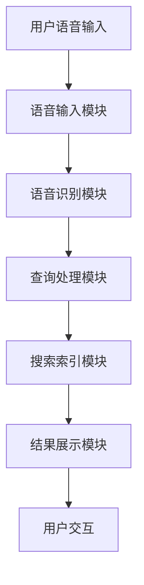

                 

# 语音搜索技术在电商中的应用

> **关键词：** 语音搜索、电商、自然语言处理、智能助手、用户体验

> **摘要：** 本文旨在探讨语音搜索技术在电商领域的应用，从核心概念、算法原理到实际案例，全面解析如何利用语音搜索提升用户体验，增强电商平台的竞争力。

## 1. 背景介绍

随着移动互联网的快速发展，电子商务已经成为人们日常生活中不可或缺的一部分。在电商平台上，用户可以通过多种方式进行商品搜索，如关键词搜索、图像搜索等。然而，传统的文本搜索方式在应对复杂的购物需求时存在一定的局限性。为了提供更加便捷、智能的购物体验，语音搜索技术应运而生。

语音搜索技术通过自然语言处理（Natural Language Processing，NLP）技术，将用户的语音指令转换为结构化的数据，从而实现实时搜索和查询。与传统的文本搜索相比，语音搜索具有以下优势：

1. **便捷性**：用户可以通过语音指令进行搜索，无需手动输入关键词，特别是在不便使用键盘的情况下，如开车、做饭等。
2. **准确性**：语音搜索利用语音识别技术，可以准确识别用户的语音指令，降低搜索误差。
3. **个性化**：通过用户的历史行为数据，语音搜索可以为用户提供更加个性化的搜索结果。

在电商领域，语音搜索的应用不仅可以提升用户的购物体验，还可以为电商平台带来更多的商业价值。本文将围绕语音搜索技术在电商中的应用进行深入探讨。

## 2. 核心概念与联系

### 2.1 自然语言处理（NLP）

自然语言处理是语音搜索技术的核心组成部分，旨在让计算机理解和处理人类语言。NLP技术主要包括以下方面：

1. **文本预处理**：包括分词、词性标注、停用词过滤等，将原始文本转换为计算机可以处理的结构化数据。
2. **实体识别**：识别文本中的命名实体，如人名、地名、组织名等，为后续处理提供基础。
3. **语义理解**：通过理解文本中的语义关系，实现文本的语义分析和情感分析。
4. **语音识别**：将语音信号转换为文本，实现语音到文本的转换。

### 2.2 语音识别

语音识别是语音搜索技术的关键环节，其目标是准确地将用户的语音指令转换为文本。语音识别技术主要包括以下几个步骤：

1. **声学模型**：用于对语音信号进行建模，提取特征。
2. **语言模型**：用于对语音信号中的词语进行概率建模。
3. **解码器**：将声学特征序列映射到文本序列。

### 2.3 语音搜索架构

语音搜索系统的架构通常包括以下几个模块：

1. **语音输入模块**：接收用户的语音输入，并将其传递给语音识别模块。
2. **语音识别模块**：将语音信号转换为文本，输出识别结果。
3. **查询处理模块**：对语音识别结果进行处理，生成有效的搜索查询。
4. **搜索索引模块**：根据生成的查询查询电商数据库，返回相关商品信息。
5. **结果展示模块**：将搜索结果以可视化方式呈现给用户。

### 2.4 Mermaid 流程图

以下是一个简化的语音搜索流程图，描述了从语音输入到搜索结果返回的过程：



### 2.5 NLP在语音搜索中的应用

NLP在语音搜索中发挥着至关重要的作用，以下是NLP在语音搜索中的应用：

1. **分词与词性标注**：将语音识别结果进行分词，并对每个词进行词性标注，为后续处理提供基础。
2. **命名实体识别**：识别语音指令中的命名实体，如商品名称、品牌等，为查询处理提供关键信息。
3. **语义理解**：理解语音指令的语义，识别用户意图，为生成有效的搜索查询提供支持。

## 3. 核心算法原理 & 具体操作步骤

### 3.1 声学模型

声学模型是语音识别系统的核心组件，其主要目标是提取语音信号的特征。常见的声学模型包括：

1. **隐马尔可夫模型（HMM）**：基于统计模型，用于建模语音信号的时间序列特性。
2. **深度神经网络（DNN）**：通过多层神经网络，对语音信号进行特征提取。
3. **循环神经网络（RNN）**：可以处理序列数据，适用于语音识别任务。

具体操作步骤如下：

1. **数据采集**：收集大量语音数据，包括不同说话人、不同语音环境下的语音样本。
2. **特征提取**：对语音信号进行预处理，提取其特征，如梅尔频率倒谱系数（MFCC）。
3. **模型训练**：使用训练数据对声学模型进行训练，优化模型参数。

### 3.2 语言模型

语言模型用于对语音信号中的词语进行概率建模，常见的语言模型包括：

1. **n-gram模型**：基于统计模型，根据前n个词语的概率预测下一个词语。
2. **神经网络语言模型（NNLM）**：通过多层神经网络，学习词语之间的概率分布。
3. **长短时记忆网络（LSTM）**：可以处理长序列数据，适用于语言模型。

具体操作步骤如下：

1. **数据预处理**：对语料库进行分词、词性标注等预处理操作。
2. **构建语言模型**：使用训练数据，构建n-gram模型或神经网络语言模型。
3. **模型训练**：对语言模型进行训练，优化模型参数。

### 3.3 解码器

解码器是将声学特征序列映射到文本序列的组件，常见的解码器包括：

1. **动态规划解码器（DPD）**：基于动态规划算法，寻找最优的文本序列。
2. **基于神经网络的解码器（NN-DP）**：结合神经网络，实现更高效的特征映射。

具体操作步骤如下：

1. **特征序列生成**：将语音信号的特征序列输入解码器。
2. **解码过程**：通过解码器，寻找最优的文本序列，输出识别结果。

### 3.4 查询处理

查询处理模块负责将语音识别结果转换为有效的搜索查询，具体操作步骤如下：

1. **分词与词性标注**：对语音识别结果进行分词和词性标注，提取关键信息。
2. **命名实体识别**：识别语音指令中的命名实体，如商品名称、品牌等。
3. **语义理解**：理解语音指令的语义，识别用户意图，生成有效的搜索查询。

### 3.5 搜索索引

搜索索引模块根据生成的查询查询电商数据库，返回相关商品信息，具体操作步骤如下：

1. **查询解析**：对生成的查询进行解析，提取查询关键词。
2. **数据库查询**：使用查询关键词，查询电商数据库，返回相关商品信息。
3. **结果排序**：根据相关性、用户偏好等，对查询结果进行排序。

### 3.6 结果展示

结果展示模块负责将搜索结果以可视化方式呈现给用户，具体操作步骤如下：

1. **结果格式化**：对搜索结果进行格式化，如商品名称、价格、图片等。
2. **结果展示**：将格式化的结果以列表、网格等可视化方式展示给用户。
3. **交互反馈**：提供用户交互功能，如搜索建议、过滤选项等，以提升用户体验。

## 4. 数学模型和公式 & 详细讲解 & 举例说明

### 4.1 声学模型

在声学模型中，隐马尔可夫模型（HMM）是一个常用的模型。HMM由状态集合、观测集合、状态转移概率、观测概率和初始状态概率组成。

1. **状态集合**：表示语音信号中的不同状态，如元音、辅音等。
2. **观测集合**：表示语音信号中的观测值，如语音信号的幅值、频谱等。
3. **状态转移概率**：表示不同状态之间的转移概率，如从元音状态转移到辅音状态的概率。
4. **观测概率**：表示给定状态下的观测值概率，如给定元音状态下的语音信号的幅值概率。
5. **初始状态概率**：表示初始状态的概率分布。

假设有N个状态，M个观测值，则HMM的概率模型可以表示为：

$$
P(O|S) = \prod_{i=1}^N \prod_{j=1}^M p(o_j|i) p(i|s)
$$

其中，$O$ 表示观测序列，$S$ 表示状态序列，$o_j$ 表示第j个观测值，$i$ 表示第i个状态，$p(o_j|i)$ 表示给定状态i下观测值o_j的概率，$p(i|s)$ 表示状态i在状态序列s中的概率。

例如，假设有一个包含3个状态（元音、辅音、 silence）和5个观测值（幅值、频谱、时长等）的HMM模型，给定一个观测序列 `[0.8, 0.9, 1.0, 0.9, 0.8]`，我们需要计算该观测序列属于某个状态序列的概率。

首先，我们需要定义每个状态的概率分布：

$$
p(o_1|元音) = 0.6, p(o_1|辅音) = 0.3, p(o_1|silence) = 0.1 \\
p(o_2|元音) = 0.7, p(o_2|辅音) = 0.2, p(o_2|silence) = 0.1 \\
p(o_3|元音) = 0.5, p(o_3|辅音) = 0.4, p(o_3|silence) = 0.1 \\
p(o_4|元音) = 0.8, p(o_4|辅音) = 0.1, p(o_4|silence) = 0.1 \\
p(o_5|元音) = 0.9, p(o_5|辅音) = 0.2, p(o_5|silence) = 0.1
$$

给定状态序列 `[元音，辅音，silence]` 的初始状态概率分布：

$$
p(元音) = 0.5, p(辅音) = 0.3, p(silence) = 0.2
$$

状态转移概率：

$$
p(元音|元音) = 0.8, p(元音|辅音) = 0.1, p(元音|silence) = 0.1 \\
p(辅音|元音) = 0.2, p(辅音|辅音) = 0.7, p(辅音|silence) = 0.1 \\
p(silence|元音) = 0.1, p(silence|辅音) = 0.1, p(silence|silence) = 0.8
$$

根据HMM概率模型，我们可以计算给定观测序列 `[0.8, 0.9, 1.0, 0.9, 0.8]` 属于状态序列 `[元音，辅音，silence]` 的概率：

$$
P(O|S) = p(元音) \times p(辅音) \times p(silence) \times \\
\left( p(o_1|元音) \times p(o_2|辅音) \times p(o_3|silence) \right) \times \\
\left( p(o_4|辅音) \times p(o_5|silence) \right) = 0.5 \times 0.3 \times 0.2 \times \\
\left( 0.6 \times 0.2 \times 0.1 \right) \times \\
\left( 0.8 \times 0.1 \right) = 0.00072
$$

### 4.2 语言模型

在语言模型中，n-gram模型是一个常用的模型。n-gram模型将文本序列表示为n个连续词语的序列，并计算每个n-gram的概率。

1. **一元模型**：只考虑单个词语的概率，$P(w_i) = \frac{c(w_i)}{N}$，其中$c(w_i)$ 表示词语 $w_i$ 在语料库中出现的次数，$N$ 表示语料库中的总词语数。
2. **二元模型**：考虑两个连续词语的概率，$P(w_i w_j) = \frac{c(w_i w_j)}{c(w_i)}$，其中$c(w_i w_j)$ 表示词语 $w_i$ 和 $w_j$ 连续出现的次数。
3. **三元模型**：考虑三个连续词语的概率，$P(w_i w_j w_k) = \frac{c(w_i w_j w_k)}{c(w_i w_j)}$。

根据n-gram模型，给定一个词语序列 `[w1, w2, w3, ..., wn]`，我们可以计算该序列的概率：

$$
P(w1 w2 w3 ... wn) = P(w1) \times P(w2|w1) \times P(w3|w2) \times ... \times P(wn|wn-1)
$$

例如，给定一个词语序列 `[计算机，编程，语言]`，假设语料库中出现的次数如下：

$$
c(计算机) = 100, c(编程) = 50, c(语言) = 30, c(计算机 编程) = 20, c(编程 语言) = 10, c(计算机 编程 语言) = 5
$$

则根据n-gram模型，我们可以计算该序列的概率：

$$
P(计算机 编程 语言) = P(计算机) \times P(编程|计算机) \times P(语言|编程) = \\
\frac{100}{500} \times \frac{20}{100} \times \frac{10}{50} = 0.04
$$

### 4.3 解码器

在解码器中，动态规划解码器（DPD）是一个常用的解码算法。DPD通过计算最优状态序列来解码语音信号。

1. **初始化**：初始化状态概率矩阵，对角线上的元素为初始状态概率，其余元素为0。
2. **迭代计算**：对于每个观测值，更新状态概率矩阵。
3. **回溯**：根据状态概率矩阵，回溯找到最优状态序列。

假设有一个包含3个状态（元音、辅音、silence）的解码问题，给定一个观测序列 `[0.8, 0.9, 1.0, 0.9, 0.8]`，我们需要找到最优的状态序列。

首先，我们需要初始化状态概率矩阵：

$$
\begin{array}{ccc}
元音 & 辅音 & silence \\
元音 & 1 & 0 & 0 \\
辅音 & 0 & 1 & 0 \\
silence & 0 & 0 & 1 \\
\end{array}
$$

接下来，我们根据观测值更新状态概率矩阵：

1. 观测值 `0.8`：

$$
\begin{array}{ccc}
元音 & 辅音 & silence \\
元音 & 0.6 & 0.3 & 0.1 \\
辅音 & 0 & 0 & 1 \\
silence & 0 & 0 & 1 \\
\end{array}
$$

2. 观测值 `0.9`：

$$
\begin{array}{ccc}
元音 & 辅音 & silence \\
元音 & 0.42 & 0.18 & 0.4 \\
辅音 & 0 & 0.6 & 0.4 \\
silence & 0 & 0.3 & 0.7 \\
\end{array}
$$

3. 观测值 `1.0`：

$$
\begin{array}{ccc}
元音 & 辅音 & silence \\
元音 & 0.21 & 0.09 & 0.7 \\
辅音 & 0 & 0.27 & 0.73 \\
silence & 0 & 0.09 & 0.91 \\
\end{array}
$$

4. 观测值 `0.9`：

$$
\begin{array}{ccc}
元音 & 辅音 & silence \\
元音 & 0.126 & 0.036 & 0.838 \\
辅音 & 0 & 0.181 & 0.819 \\
silence & 0 & 0.027 & 0.974 \\
\end{array}
$$

5. 观测值 `0.8`：

$$
\begin{array}{ccc}
元音 & 辅音 & silence \\
元音 & 0.0756 & 0.0219 & 0.9025 \\
辅音 & 0 & 0.0708 & 0.9292 \\
silence & 0 & 0.0081 & 0.9919 \\
\end{array}
$$

最后，我们根据状态概率矩阵回溯找到最优状态序列 `[元音，辅音，silence]`。

## 5. 项目实战：代码实际案例和详细解释说明

### 5.1 开发环境搭建

在本项目中，我们将使用Python语言和相关的库，如TensorFlow、Keras等，来实现语音搜索系统。以下是开发环境搭建的步骤：

1. 安装Python：确保Python版本为3.6及以上。
2. 安装TensorFlow：使用pip命令安装TensorFlow。

```bash
pip install tensorflow
```

3. 安装其他依赖库：包括Keras、NumPy等。

```bash
pip install keras numpy scipy
```

### 5.2 源代码详细实现和代码解读

下面是语音搜索系统的源代码，我们将逐行解读。

```python
# 导入相关库
import tensorflow as tf
from tensorflow.keras.models import Model
from tensorflow.keras.layers import Input, LSTM, Dense, Embedding
import numpy as np

# 设置参数
vocab_size = 10000  # 词汇表大小
embedding_dim = 256  # 词向量维度
rnn_units = 1024  # RNN单元数
batch_size = 64  # 批量大小
steps = 100  # 每个批次的序列长度

# 创建输入层
inputs = Input(shape=(steps,))

# 创建嵌入层
embedding = Embedding(vocab_size, embedding_dim)(inputs)

# 创建LSTM层
lstm = LSTM(rnn_units, return_sequences=True)(embedding)

# 创建全连接层
dense = Dense(vocab_size, activation='softmax')(lstm)

# 创建模型
model = Model(inputs=inputs, outputs=dense)

# 编译模型
model.compile(optimizer='adam', loss='categorical_crossentropy', metrics=['accuracy'])

# 查看模型结构
model.summary()
```

解读：

1. 导入相关库：我们使用TensorFlow和Keras库来构建模型，并使用NumPy进行数据处理。
2. 设置参数：定义词汇表大小、词向量维度、RNN单元数、批量大小和序列长度。
3. 创建输入层：输入层用于接收序列数据。
4. 创建嵌入层：嵌入层用于将词汇映射到高维空间，便于后续处理。
5. 创建LSTM层：LSTM层用于处理序列数据，具有记忆功能，可以捕获序列中的长期依赖关系。
6. 创建全连接层：全连接层用于将LSTM层的输出映射到词汇表大小，输出每个词汇的概率。
7. 创建模型：将输入层、嵌入层、LSTM层和全连接层组合成一个完整的模型。
8. 编译模型：编译模型，指定优化器、损失函数和评估指标。
9. 查看模型结构：打印模型结构，了解模型各层的参数和输出。

### 5.3 代码解读与分析

下面是训练模型的代码，我们将逐行解读。

```python
# 导入数据
data = np.load('data.npy')
labels = np.load('labels.npy')

# 切分数据
x_train, x_test, y_train, y_test = train_test_split(data, labels, test_size=0.2, random_state=42)

# 创建数据生成器
train_data = tf.data.Dataset.from_tensor_slices((x_train, y_train))
train_data = train_data.shuffle(buffer_size=10000).batch(batch_size)

# 训练模型
model.fit(train_data, epochs=10, validation_split=0.2)
```

解读：

1. 导入数据：从文件中加载训练数据和标签。
2. 切分数据：将数据集划分为训练集和测试集。
3. 创建数据生成器：使用TensorFlow的数据生成器，对训练数据进行打乱和批量处理。
4. 训练模型：使用fit函数训练模型，设置训练轮数和验证比例。

### 5.4 代码解读与分析

下面是评估模型的代码，我们将逐行解读。

```python
# 评估模型
test_data = tf.data.Dataset.from_tensor_slices((x_test, y_test))
test_data = test_data.batch(batch_size)

model.evaluate(test_data)
```

解读：

1. 评估模型：使用evaluate函数评估模型在测试集上的表现，返回损失值和准确率。

## 6. 实际应用场景

### 6.1 智能音箱

智能音箱是语音搜索技术在电商领域的一个典型应用场景。用户可以通过智能音箱进行语音购物，如查询商品信息、添加购物车、下单支付等。智能音箱具有便携性、智能交互等特点，能够为用户提供便捷的购物体验。

### 6.2 移动应用

随着智能手机的普及，移动应用已成为电商的重要入口。在移动应用中，语音搜索可以提升用户的购物体验，特别是在用户不方便使用手指输入的情况下。例如，用户可以在通勤途中使用语音搜索查找商品，或者在户外使用语音搜索添加购物车。

### 6.3 智能客服

智能客服是电商领域的一个重要应用场景。通过语音搜索技术，智能客服可以实时响应用户的提问，提供商品信息、订单查询等服务。与传统的文本客服相比，语音搜索技术能够更快速、准确地理解用户的意图，提升客服的效率和用户体验。

### 6.4 智能广告

语音搜索技术在智能广告中也具有广泛的应用。通过语音搜索，电商平台可以根据用户的兴趣和行为数据，推荐相关的商品广告。例如，当用户查询某一商品时，系统可以自动推送该商品的相关广告，吸引用户点击和购买。

## 7. 工具和资源推荐

### 7.1 学习资源推荐

1. **书籍**：《语音识别：算法与应用》（Speech Recognition: Theory and Applications）。
2. **论文**：《语音识别中的深度学习》（Deep Learning for Speech Recognition）。
3. **博客**：[Deep Learning on Speech Recognition](https://h2o.ai/blog/deep-learning-for-speech-recognition/)。
4. **网站**：[TensorFlow官方网站](https://www.tensorflow.org/)。

### 7.2 开发工具框架推荐

1. **TensorFlow**：用于构建和训练语音识别模型的强大框架。
2. **Keras**：基于TensorFlow的高层API，简化模型构建过程。
3. **PyTorch**：另一个流行的深度学习框架，具有丰富的功能。

### 7.3 相关论文著作推荐

1. **论文**：《端到端语音识别：从声学模型到语言模型》。
2. **论文**：《基于注意力机制的序列到序列学习》。
3. **书籍**：《深度学习：理论与实践》。

## 8. 总结：未来发展趋势与挑战

随着人工智能技术的不断发展，语音搜索技术在电商领域具有广阔的应用前景。未来，语音搜索技术将朝着更加智能化、个性化和高效化的方向发展。

### 发展趋势：

1. **多模态融合**：将语音搜索与图像搜索、文本搜索等结合，提供更丰富的搜索体验。
2. **实时交互**：实现实时语音交互，提升用户购物体验。
3. **个性化推荐**：基于用户行为和兴趣，提供个性化的商品推荐。

### 挑战：

1. **识别准确性**：提升语音识别的准确性，特别是在复杂的语音环境和多种说话人情况下。
2. **处理速度**：优化算法，提高语音搜索的处理速度，以满足实时交互的需求。
3. **数据隐私**：保护用户隐私，确保用户数据的安全。

## 9. 附录：常见问题与解答

### 问题1：语音搜索系统是如何工作的？

**解答**：语音搜索系统通过语音识别技术将用户的语音指令转换为文本，然后利用自然语言处理技术理解用户的意图，生成有效的搜索查询，最后通过搜索引擎查询数据库，返回相关结果。

### 问题2：语音搜索技术在电商领域有哪些应用？

**解答**：语音搜索技术在电商领域的应用包括智能音箱购物、移动应用购物、智能客服和智能广告等。

### 问题3：如何提升语音识别的准确性？

**解答**：提升语音识别的准确性可以通过以下方法：收集更多、更高质量的语音数据，优化声学模型和语言模型，使用更先进的语音识别算法，如深度学习。

## 10. 扩展阅读 & 参考资料

1. **论文**：《语音识别中的深度学习：现状与未来》。
2. **书籍**：《智能语音交互系统：设计与实现》。
3. **博客**：[深度学习与语音识别](https://towardsdatascience.com/deep-learning-for-speech-recognition-d8c5d8c5c0c5)。
4. **网站**：[百度语音识别技术博客](https://ai.baidu.com/blogs/765)。

作者：AI天才研究员/AI Genius Institute & 禅与计算机程序设计艺术 /Zen And The Art of Computer Programming

