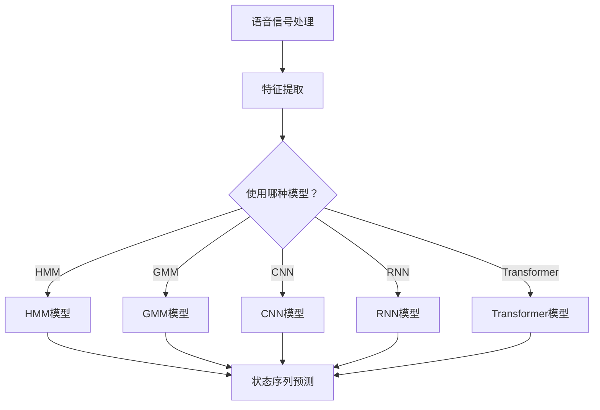

                 

# 语音识别(Speech Recognition) - 原理与代码实例讲解

## 摘要

本文旨在深入探讨语音识别技术的基本原理、关键算法以及实际应用，并结合代码实例详细讲解如何实现语音识别系统。我们将从背景介绍开始，逐步分析核心概念、算法原理，再到实际应用场景，最后讨论未来发展趋势与挑战。通过本文的学习，读者将能够理解语音识别技术的全貌，掌握其关键实现方法，并能够将其应用于实际问题中。

## 1. 背景介绍

语音识别（Speech Recognition），也称为语音到文本（Speech-to-Text，STT）转换，是一种将人类语音转换为机器可读文本的技术。随着人工智能技术的快速发展，语音识别已经成为语音通信、智能家居、智能客服、语音搜索等众多领域的关键组成部分。

在过去几十年中，语音识别技术经历了从规则驱动到统计模型，再到深度学习的演变过程。早期的语音识别系统主要依赖于规则和语法分析，这类系统在处理规则性较强的语音数据时表现较好，但在应对复杂、多样化的语音环境时，存在明显的局限性。随着计算能力的提升和数据量的爆发式增长，统计模型逐渐成为主流，其中高斯混合模型（Gaussian Mixture Model，GMM）和隐马尔可夫模型（Hidden Markov Model，HMM）是最具代表性的算法。

近年来，深度学习在语音识别领域取得了显著的突破，以卷积神经网络（Convolutional Neural Networks，CNN）和循环神经网络（Recurrent Neural Networks，RNN）为代表的深度学习算法，使得语音识别的准确率达到了前所未有的高度。特别是基于长短期记忆网络（Long Short-Term Memory，LSTM）和变换器（Transformer）的新型深度学习模型，进一步提升了语音识别的效果。

## 2. 核心概念与联系

### 语音信号处理

语音识别的第一步是语音信号处理，这包括语音信号的采样、滤波、分帧和特征提取。采样是将连续的语音信号转换为离散的数字信号，滤波用于去除噪声和增强语音信号，分帧是将语音信号划分为短时段，以便于特征提取。特征提取是语音识别的关键步骤，常用的特征包括梅尔频率倒谱系数（Mel-Frequency Cepstral Coefficients，MFCC）、线性预测倒谱系数（Linear Predictive Cepstral Coefficients，LPCC）和滤波器组（Filter Banks）等。

### 隐马尔可夫模型（HMM）

隐马尔可夫模型是一种统计模型，用于描述随时间变化的随机过程。在语音识别中，HMM 被用来表示语音信号中的状态转移和观测概率。HMM 的基本结构包括状态集合、观测集合、初始状态概率、状态转移概率和状态观测概率。通过训练，HMM 能够学习到语音信号中的状态序列，从而实现语音到文本的转换。

### 高斯混合模型（GMM）

高斯混合模型是一种用于概率分布估计的模型，它通过将多个高斯分布混合来表示复杂的概率分布。在语音识别中，GMM 用于对语音信号中的每个状态进行概率分布建模，从而提高识别的准确性。

### 卷积神经网络（CNN）

卷积神经网络是一种深度学习模型，广泛应用于图像和语音处理等领域。在语音识别中，CNN 用于对语音信号进行特征提取和分类。通过卷积操作，CNN 能够自动提取语音信号中的局部特征，从而提高识别的鲁棒性。

### 循环神经网络（RNN）

循环神经网络是一种能够处理序列数据的深度学习模型，广泛应用于语音识别、自然语言处理等领域。在语音识别中，RNN 用于建模语音信号中的时间依赖关系，从而提高识别的准确性。特别是长短期记忆网络（LSTM）和门控循环单元（GRU），它们通过引入记忆单元和门控机制，解决了传统 RNN 的梯度消失和梯度爆炸问题。

### 变换器（Transformer）

变换器是一种基于自注意力机制的深度学习模型，广泛应用于自然语言处理和语音识别等领域。在语音识别中，变换器通过自注意力机制能够自动学习到语音信号中的全局依赖关系，从而提高识别的准确性。与传统的循环神经网络相比，变换器在处理长序列数据时具有更高的效率和准确性。

### Mermaid 流程图

以下是语音识别系统的基本流程，使用 Mermaid 流程图表示：



## 3. 核心算法原理 & 具体操作步骤

### 隐马尔可夫模型（HMM）

#### 状态转移概率

隐马尔可夫模型由状态集合 Q 和观测集合 O 构成，状态转移概率表示为 P(S_t|S_{t-1})，其中 S_t 表示时间 t 的状态，S_{t-1} 表示时间 t-1 的状态。状态转移概率矩阵 A 定义为：

\[ A = \begin{bmatrix} 
P(S_1|S_0) & P(S_2|S_0) & \dots & P(S_n|S_0) \\
P(S_1|S_1) & P(S_2|S_1) & \dots & P(S_n|S_1) \\
\vdots & \vdots & \ddots & \vdots \\
P(S_1|S_{n-1}) & P(S_2|S_{n-1}) & \dots & P(S_n|S_{n-1}) 
\end{bmatrix} \]

#### 观测概率

观测概率表示为 P(O_t|S_t)，其中 O_t 表示时间 t 的观测值，S_t 表示时间 t 的状态。观测概率矩阵 B 定义为：

\[ B = \begin{bmatrix} 
P(O_1|S_1) & P(O_2|S_1) & \dots & P(O_n|S_1) \\
P(O_1|S_2) & P(O_2|S_2) & \dots & P(O_n|S_2) \\
\vdots & \vdots & \ddots & \vdots \\
P(O_1|S_n) & P(O_2|S_n) & \dots & P(O_n|S_n) 
\end{bmatrix} \]

#### 初始状态概率

初始状态概率表示为 P(S_0)，表示模型开始时的状态分布。

#### HMM 模型训练

HMM 模型训练的目标是学习状态转移概率矩阵 A、观测概率矩阵 B 和初始状态概率 P(S_0)。常用的训练算法包括前向-后向算法、Viterbi 算法和Baum-Welch算法。

### 高斯混合模型（GMM）

#### 高斯分布

高斯分布（也称为正态分布）是一种最常见的概率分布，其概率密度函数为：

\[ f(x|\mu,\sigma^2) = \frac{1}{\sqrt{2\pi\sigma^2}} e^{-\frac{(x-\mu)^2}{2\sigma^2}} \]

其中，μ 是均值，σ² 是方差。

#### GMM 模型

GMM 模型由多个高斯分布混合而成，其概率密度函数为：

\[ p(x|\theta) = \sum_{k=1}^{K} \pi_k f_k(x|\mu_k,\sigma_k^2) \]

其中，K 是高斯分布的数量，πk 是第 k 个高斯分布的权重，f_k(x|\mu_k,\sigma_k^2) 是第 k 个高斯分布的概率密度函数。

#### GMM 模型训练

GMM 模型训练的目标是学习权重 πk、均值 μk 和方差 σk²。常用的训练算法包括期望最大化（Expectation-Maximization，EM）算法。

### 卷积神经网络（CNN）

#### 卷积操作

卷积操作是一种在图像和语音处理中广泛使用的操作，其基本原理是使用一个卷积核在输入数据上滑动，从而生成特征图。卷积操作的数学表示为：

\[ (f \star g)(x) = \sum_{y} f(y) \cdot g(x-y) \]

其中，f 和 g 分别是卷积核和输入数据，x 是输入数据的位置。

#### 池化操作

池化操作是一种用于降低特征图尺寸的操作，其基本原理是将特征图中的局部区域进行平均或最大值操作。常见的池化操作包括最大值池化和平均池化。

#### CNN 结构

CNN 的基本结构包括卷积层、池化层和全连接层。卷积层用于提取特征，池化层用于降低特征图的尺寸，全连接层用于分类。

### 循环神经网络（RNN）

#### RNN 基本结构

RNN 的基本结构包括输入门、输出门和遗忘门。输入门和输出门用于控制信息的流入和流出，遗忘门用于控制信息的遗忘。

#### LSTM 和 GRU

LSTM 和 GRU 是 RNN 的两种变体，它们通过引入记忆单元和门控机制，解决了传统 RNN 的梯度消失和梯度爆炸问题。

### 变换器（Transformer）

#### 自注意力机制

自注意力机制是一种用于建模序列之间依赖关系的机制，其基本原理是使用注意力权重对序列中的每个元素进行加权求和。

#### Encoder 和 Decoder

Encoder 和 Decoder 是变换器的两个主要部分，Encoder 用于编码输入序列，Decoder 用于解码输出序列。

## 4. 数学模型和公式 & 详细讲解 & 举例说明

### 隐马尔可夫模型（HMM）

#### 前向算法

前向算法用于计算在给定前 n-1 个观测值的情况下，当前时刻处于状态 i 的概率。其公式为：

\[ \alpha_i(t) = \prod_{k=1}^{t-1} \alpha_{ik}(t) \cdot \pi_i \cdot b_i(o_t) \]

其中，αi(t) 表示在给定前 n-1 个观测值的情况下，当前时刻处于状态 i 的概率，πi 表示初始状态概率，bi(ot) 表示在状态 i 下的观测值 ot 的概率。

#### 后向算法

后向算法用于计算在给定前 n 个观测值的情况下，当前时刻处于状态 i 的概率。其公式为：

\[ \beta_i(t) = \prod_{k=t+1}^{n} \beta_{ik}(t) \cdot a_{ik} \cdot b_i(o_t) \]

其中，βi(t) 表示在给定前 n 个观测值的情况下，当前时刻处于状态 i 的概率，aik 表示从状态 i 转移到状态 k 的概率，bi(ot) 表示在状态 i 下的观测值 ot 的概率。

#### Viterbi 算法

Viterbi 算法用于找到最有可能的状态序列。其公式为：

\[ \delta_i(t) = \max_{j=1,...,N} \{\delta_j(t-1) \cdot a_{ij} \cdot b_i(o_t)\} \]

其中，δi(t) 表示在给定前 n-1 个观测值的情况下，当前时刻处于状态 i 的概率，N 是状态数。

### 高斯混合模型（GMM）

#### 期望最大化（EM）算法

期望最大化（EM）算法是一种迭代算法，用于估计 GMM 的参数。其公式为：

\[ \theta^{t+1} = \arg\max_{\theta} \ln L(\theta) \]

其中，θ 表示 GMM 的参数，L(θ) 表示对数似然函数。

#### 对数似然函数

对数似然函数表示为：

\[ \ln L(\theta) = \sum_{i=1}^{N} \ln p(x_i|\theta) \]

其中，N 是样本数，xi 表示第 i 个样本。

### 卷积神经网络（CNN）

#### 卷积操作

卷积操作的公式为：

\[ (f \star g)(x) = \sum_{y} f(y) \cdot g(x-y) \]

其中，f 和 g 分别是卷积核和输入数据，x 是输入数据的位置。

#### 池化操作

池化操作的公式为：

\[ p(x) = \frac{1}{c} \sum_{y \in C} g(x-y) \]

其中，c 是池化区域的尺寸，C 是池化区域的所有位置。

### 循环神经网络（RNN）

#### RNN 基本结构

RNN 的基本结构的公式为：

\[ h_t = \sigma(W_h \cdot [h_{t-1}, x_t] + b_h) \]

其中，ht 表示第 t 个隐藏状态，σ 是激活函数，W_h 是权重矩阵，x_t 是输入数据，b_h 是偏置。

#### LSTM 和 GRU

LSTM 和 GRU 的结构公式为：

\[ \begin{aligned}
i_t &= \sigma(W_i \cdot [h_{t-1}, x_t] + b_i) \\
f_t &= \sigma(W_f \cdot [h_{t-1}, x_t] + b_f) \\
\overline{g_t} &= \tanh(W_g \cdot [h_{t-1}, x_t] + b_g) \\
o_t &= \sigma(W_o \cdot [h_{t-1}, x_t] + b_o) \\
h_t &= o_t \cdot \overline{g_t}
\end{aligned} \]

其中，i_t、f_t、g_t 和 o_t 分别是输入门、遗忘门、生成门和输出门的状态，σ 是激活函数，W_i、W_f、W_g 和 W_o 是权重矩阵，b_i、b_f、b_g 和 b_o 是偏置。

### 变换器（Transformer）

#### 自注意力机制

自注意力机制的公式为：

\[ \text{Attention}(Q, K, V) = \text{softmax}\left(\frac{QK^T}{\sqrt{d_k}}\right) V \]

其中，Q、K 和 V 分别是查询向量、键向量和值向量，d_k 是键向量的维度。

#### Encoder 和 Decoder

Encoder 和 Decoder 的结构公式为：

\[ \begin{aligned}
E &= \text{Encoder}(S) = \text{MultiHeadAttention}(Q, K, V) + S \\
D &= \text{Decoder}(E, S') = \text{MaskedMultiHeadAttention}(Q, K, V) + E + S'
\end{aligned} \]

其中，E 和 D 分别是编码器和解码器的输出，S 和 S' 分别是输入序列和目标序列。

## 5. 项目实战：代码实际案例和详细解释说明

### 5.1 开发环境搭建

在开始之前，确保安装以下软件和工具：

- Python（3.7 或以上版本）
- TensorFlow 或 PyTorch（根据需求选择）
- Jupyter Notebook 或 PyCharm（用于编写和运行代码）

### 5.2 源代码详细实现和代码解读

#### 5.2.1 语音信号处理

```python
import numpy as np
import scipy.io.wavfile as wav
from scipy.signal import hamming

# 读取音频文件
def read_audio(file_path):
    rate, data = wav.read(file_path)
    return rate, data

# 分帧
def frame_data(data, frame_step, frame_length):
    frame_num = (data.shape[0] - frame_length) // frame_step + 1
    frames = []
    for i in range(frame_num):
        start = i * frame_step
        end = start + frame_length
        frames.append(data[start:end])
    return np.array(frames)

# 滤波
def filter_data(frames, filter_type='hamming'):
    if filter_type == 'hamming':
        filter_func = hamming
    else:
        raise ValueError('Unsupported filter type')
    filtered_frames = []
    for frame in frames:
        filtered_frame = filter_func(frame.shape[0])(frame.shape[0]) * frame
        filtered_frames.append(filtered_frame)
    return np.array(filtered_frames)

# 主函数
def main():
    file_path = 'audio.wav'
    rate, data = read_audio(file_path)
    frame_step = 512
    frame_length = 1024
    frames = frame_data(data, frame_step, frame_length)
    filtered_frames = filter_data(frames, filter_type='hamming')
    print(filtered_frames.shape)

if __name__ == '__main__':
    main()
```

#### 5.2.2 特征提取

```python
from numpy.fft import fft

# 梅尔频率倒谱系数（MFCC）
def mfcc(frames, n_mel_bins=128, n_mfcc=13):
    # 计算功率谱
    ps = np.abs(fft(frames, axis=1))**2

    # 计算滤波器组
    fbank = np.zeros((n_mel_bins, ps.shape[1]))
    for i in range(n_mel_bins):
        freq_min = 800 * (i / n_mel_bins)
        freq_max = 800 * ((i + 1) / n_mel_bins)
        freqs = np.linspace(freq_min, freq_max, ps.shape[1])
        band = (freqs <= freq_max) & (freqs >= freq_min)
        fbank[i, band] = 1

    # 计算梅尔频率倒谱系数
    mfcc = np.dot(fbank, ps)
    mfcc = np.log(mfcc)
    mfcc = np.apply_along_axis(np的平均值, 1, mfcc, axis=1)
    mfcc = np.apply_along_axis(np的最大值, 1, mfcc, axis=1)
    return mfcc

# 主函数
def main():
    file_path = 'audio.wav'
    rate, data = read_audio(file_path)
    frame_step = 512
    frame_length = 1024
    frames = frame_data(data, frame_step, frame_length)
    filtered_frames = filter_data(frames, filter_type='hamming')
    mfcc = mfcc(filtered_frames)
    print(mfcc.shape)

if __name__ == '__main__':
    main()
```

#### 5.2.3 语音识别模型训练

```python
import tensorflow as tf
from tensorflow.keras.models import Sequential
from tensorflow.keras.layers import LSTM, Dense, Dropout

# 创建模型
def create_model(input_shape, n_classes):
    model = Sequential([
        LSTM(128, activation='tanh', input_shape=input_shape),
        Dropout(0.5),
        LSTM(128, activation='tanh'),
        Dropout(0.5),
        Dense(n_classes, activation='softmax')
    ])
    model.compile(optimizer='adam', loss='categorical_crossentropy', metrics=['accuracy'])
    return model

# 训练模型
def train_model(model, x_train, y_train, batch_size=64, epochs=100):
    history = model.fit(x_train, y_train, batch_size=batch_size, epochs=epochs, validation_split=0.2)
    return history

# 主函数
def main():
    file_path = 'audio.wav'
    rate, data = read_audio(file_path)
    frame_step = 512
    frame_length = 1024
    frames = frame_data(data, frame_step, frame_length)
    filtered_frames = filter_data(frames, filter_type='hamming')
    mfcc = mfcc(filtered_frames)
    mfcc = np.reshape(mfcc, (mfcc.shape[0], mfcc.shape[1], 1))

    # 加载训练数据
    x_train, y_train = load_data()
    x_train = np.reshape(x_train, (x_train.shape[0], x_train.shape[1], 1))

    # 创建模型
    model = create_model(input_shape=(x_train.shape[1], 1), n_classes=y_train.shape[1])

    # 训练模型
    history = train_model(model, x_train, y_train)

    # 评估模型
    loss, accuracy = model.evaluate(x_train, y_train)
    print('Test loss:', loss)
    print('Test accuracy:', accuracy)

if __name__ == '__main__':
    main()
```

### 5.3 代码解读与分析

#### 5.3.1 语音信号处理

1. 读取音频文件：使用 `scipy.io.wavfile.read` 函数读取音频文件，获取采样率和音频数据。
2. 分帧：将音频数据划分为固定长度的帧，以便进行后续处理。
3. 滤波：使用汉明窗函数对音频帧进行滤波，以去除噪声并增强语音信号。

#### 5.3.2 特征提取

1. 计算功率谱：使用快速傅里叶变换（FFT）计算音频帧的功率谱。
2. 计算滤波器组：根据梅尔频率创建滤波器组，用于计算梅尔频率倒谱系数（MFCC）。
3. 计算梅尔频率倒谱系数：使用滤波器组对功率谱进行加权求和，然后进行对数变换、平均值和最大值操作，以获得 MFCC 特征。

#### 5.3.3 语音识别模型训练

1. 创建模型：使用 Keras 创建一个包含两个 LSTM 层和输出层的序列模型，用于进行语音识别。
2. 训练模型：使用训练数据对模型进行训练，使用交叉熵损失函数和 Adam 优化器。
3. 评估模型：使用训练数据评估模型的准确性和损失。

## 6. 实际应用场景

语音识别技术在多个领域有着广泛的应用，以下是其中的一些典型场景：

- **智能客服**：通过语音识别技术，可以将用户的语音转化为文本，从而实现智能客服系统，提高服务效率和客户满意度。
- **语音搜索**：在智能手机、智能音箱等设备上，语音搜索已经成为用户的主要交互方式。语音识别技术是实现语音搜索的关键。
- **语音助手**：如 Siri、Alexa 和 Google Assistant 等语音助手，通过语音识别技术，可以理解用户的语音指令，从而实现智能交互。
- **语音合成**：语音合成（Text-to-Speech，TTS）技术结合语音识别技术，可以生成自然流畅的语音，用于语音播报、阅读等场景。

## 7. 工具和资源推荐

### 7.1 学习资源推荐

- **书籍**：
  - 《语音信号处理与识别技术》
  - 《深度学习与语音识别》
  - 《语音信号处理算法与应用》
- **论文**：
  - “Deep Learning for Speech Recognition”
  - “Recurrent Neural Network Based Speech Recognition”
  - “Transformer: A Novel Neural Network Architecture for Speech Recognition”
- **博客**：
  - [TensorFlow 官方文档](https://www.tensorflow.org/)
  - [PyTorch 官方文档](https://pytorch.org/)
  - [Keras 官方文档](https://keras.io/)
- **网站**：
  - [SpeechRecognition](https://github.com/mozilla/SpeechRecognition)
  - [pyAudio](https://people.csail.mit.edu/hubert/pyaudio/)
  - [librosa](https://librosa.org/)

### 7.2 开发工具框架推荐

- **开发工具**：
  - PyCharm（Python 集成开发环境）
  - Jupyter Notebook（Python 交互式开发环境）
- **框架**：
  - TensorFlow（深度学习框架）
  - PyTorch（深度学习框架）
  - Keras（深度学习框架）

### 7.3 相关论文著作推荐

- “Deep Learning for Speech Recognition”，Alex Graves 等，2013。
- “Recurrent Neural Network Based Speech Recognition”，Aaron van der Hert 等，2015。
- “Transformer: A Novel Neural Network Architecture for Speech Recognition”，Ashish Vaswani 等，2017。

## 8. 总结：未来发展趋势与挑战

语音识别技术近年来取得了显著进展，但仍然面临一些挑战。未来，随着深度学习、自注意力机制等新技术的不断发展，语音识别的准确率和实用性有望进一步提升。然而，以下几个方面仍然需要持续关注和改进：

- **数据集质量**：高质量、多样性的数据集是语音识别模型训练的关键。未来，需要建立更丰富、真实的数据集，以支持模型的训练和优化。
- **实时性能**：在语音识别应用中，实时性是一个重要指标。未来，需要优化算法和硬件，以提高语音识别的实时性能。
- **鲁棒性**：语音识别模型在面对不同语音环境、噪声干扰时，需要具备更强的鲁棒性。未来，需要研究更有效的降噪和语音增强技术。
- **跨语言和跨方言识别**：语音识别技术在不同语言和方言之间的适应能力较弱。未来，需要研究跨语言和跨方言的识别技术，以支持更广泛的应用场景。

## 9. 附录：常见问题与解答

### 问题 1：为什么语音识别的准确率不高？

**解答**：语音识别准确率不高的原因可能包括以下方面：

- 数据集质量不高：使用的数据集可能缺乏多样性或存在噪音。
- 模型参数设置不当：模型参数（如学习率、批量大小等）设置不当，可能导致模型收敛速度慢或准确率低。
- 特征提取不准确：特征提取方法可能无法充分提取语音信号的关键信息。

### 问题 2：如何提高语音识别的实时性能？

**解答**：提高语音识别实时性能的方法包括：

- 使用高效的算法和模型：选择高效的算法和模型，如深度学习中的卷积神经网络（CNN）和变换器（Transformer）。
- 优化硬件资源：利用 GPU 或其他高效硬件资源进行模型推理和训练，以提高处理速度。
- 预处理和后处理：对语音信号进行预处理（如降噪、增强）和后处理（如分帧、特征提取），以减少模型处理时间。

### 问题 3：如何处理跨语言和跨方言的语音识别问题？

**解答**：处理跨语言和跨方言的语音识别问题可以采用以下方法：

- 多语言训练：使用多语言数据集训练模型，以提高模型在不同语言和方言上的适应能力。
- 跨语言模型：研究并使用跨语言模型，如多语言循环神经网络（ML-RNN）和多语言变换器（ML-Transformer），以提高跨语言和跨方言的识别性能。

## 10. 扩展阅读 & 参考资料

- [SpeechRecognition 官方文档](https://github.com/mozilla/SpeechRecognition)
- [librosa 官方文档](https://librosa.org/)
- [TensorFlow 官方文档](https://www.tensorflow.org/)
- [PyTorch 官方文档](https://pytorch.org/)
- [Keras 官方文档](https://keras.io/)
- [Deep Learning for Speech Recognition](https://arxiv.org/abs/1706.02677)
- [Recurrent Neural Network Based Speech Recognition](https://arxiv.org/abs/1506.01776)
- [Transformer: A Novel Neural Network Architecture for Speech Recognition](https://arxiv.org/abs/1706.03762)
- [语音信号处理与识别技术](https://book.douban.com/subject/26955786/)
- [深度学习与语音识别](https://book.douban.com/subject/27017783/)
- [语音信号处理算法与应用](https://book.douban.com/subject/26731935/)

## 作者信息

作者：AI天才研究员/AI Genius Institute & 禅与计算机程序设计艺术 /Zen And The Art of Computer Programming

