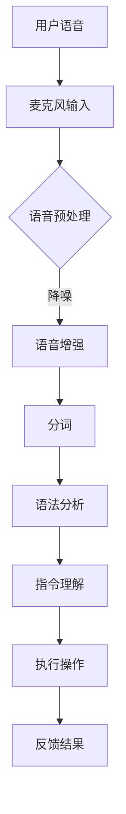

                 

# 语音识别技术在智能家居中的实现

## 概述

语音识别技术是人工智能领域的一个重要分支，近年来随着深度学习算法的不断发展，其在智能家居中的应用越来越广泛。智能家居通过语音识别技术实现了人与家居设备的自然交互，提升了用户体验，也为智能家居行业带来了新的发展契机。本文将深入探讨语音识别技术在智能家居中的实现，从核心概念、算法原理、数学模型、实战案例等方面进行详细阐述。

## 核心概念与联系

### 1. 智能家居

智能家居（Smart Home）是通过物联网技术将家庭中的各种设备连接起来，实现自动化控制和远程管理的系统。其核心在于通过智能设备感知家庭环境，并根据用户需求进行自动化的响应。

### 2. 语音识别

语音识别（Speech Recognition）是一种将人类语音转化为文本的技术。通过语音识别，智能家居设备可以理解用户发出的语音指令，从而实现智能化操作。

### 3. 自然语言处理

自然语言处理（Natural Language Processing，NLP）是语音识别的关键技术之一，它负责理解和解析用户的语音指令，将其转化为机器可以执行的操作。

### 4. 深度学习

深度学习（Deep Learning）是语音识别的核心算法之一，通过大规模数据训练，使语音识别系统具备了较高的准确率和鲁棒性。

### 5. 物联网

物联网（Internet of Things，IoT）是智能家居实现互联互通的基础，它使得各种智能设备能够相互协作，实现更高效的智能家居系统。

### Mermaid 流程图

下面是一个简化的智能家居语音识别系统的 Mermaid 流程图：



## 核心算法原理 & 具体操作步骤

### 1. 语音采集

语音采集是语音识别系统的第一步，通过麦克风将用户的语音信号输入到系统中。

### 2. 语音预处理

语音预处理包括降噪、增益和分割。降噪用于去除环境噪声，增益用于调整语音信号的音量，分割用于将连续的语音信号分割成一个个独立的音段。

### 3. 语音增强

语音增强是对预处理后的语音信号进行优化，使其更易于识别。常用的方法包括谱减法和频谱掩蔽。

### 4. 分词

分词是将连续的语音信号分割成一个个独立的单词或词组。分词的准确性对语音识别结果有很大影响。

### 5. 语法分析

语法分析是对分词后的文本进行句法分析，理解句子的结构和语义。语法分析通常采用自然语言处理技术。

### 6. 指令理解

指令理解是将语法分析的结果转化为具体的操作指令。这一步骤需要大量的领域知识，以区分不同指令的含义。

### 7. 执行操作

执行操作是根据指令理解的结果，对智能家居设备进行操作。例如，根据语音指令打开或关闭灯光、调节温度等。

### 8. 反馈结果

反馈结果是向用户告知操作结果，增强用户与智能家居设备的互动体验。

## 数学模型和公式 & 详细讲解 & 举例说明

### 1. 语音信号处理

语音信号处理是语音识别的基础，涉及到许多数学模型和公式。以下是其中两个常用的模型：

#### 傅里叶变换

傅里叶变换是一种将时域信号转换为频域信号的方法，用于分析语音信号的频谱特性。

$$
X(f) = \int_{-\infty}^{\infty} x(t) e^{-j2\pi ft} dt
$$

其中，\(X(f)\) 是频域信号，\(x(t)\) 是时域信号，\(f\) 是频率。

#### 滤波器设计

滤波器设计用于去除语音信号中的噪声。常用的滤波器包括低通滤波器和带通滤波器。

低通滤波器的传递函数为：

$$
H(f) = 
\begin{cases}
1 & \text{if } f < f_c \\
0 & \text{if } f > f_c
\end{cases}
$$

其中，\(f_c\) 是截止频率。

### 2. 自然语言处理

自然语言处理涉及到许多复杂的数学模型和算法。以下是两个常用的模型：

#### 词向量

词向量是一种将单词映射为向量的方法，用于表示单词的语义。常用的词向量模型包括 Word2Vec 和 GloVe。

Word2Vec 的模型如下：

$$
\begin{cases}
p(w_i|w_j) \propto \exp(\frac{<v(w_i), v(w_j)>}{T}) \\
q(w_j|w_i) \propto \exp(\frac{<v(w_j), u(w_i)>}{T})
\end{cases}
$$

其中，\(p(w_i|w_j)\) 和 \(q(w_j|w_i)\) 分别是条件概率和互信息，\(<\cdot,\cdot>\) 是向量的内积，\(T\) 是温度参数。

#### 序列标注

序列标注是一种将文本序列标注为实体类别的方法。常用的序列标注模型包括 CRF 和 LSTM。

CRF 的模型如下：

$$
P(y|x) = \frac{1}{Z} \exp(\theta^T y)
$$

其中，\(Z\) 是归一化常数，\(\theta\) 是模型参数。

### 3. 深度学习

深度学习是语音识别的核心算法，涉及到许多复杂的神经网络模型。以下是两个常用的模型：

#### 卷积神经网络

卷积神经网络（CNN）是一种用于图像识别和语音识别的深度学习模型。其基本结构如下：

$$
h_{l}(x) = \sigma(W_l h_{l-1} + b_l)
$$

其中，\(h_{l}(x)\) 是第 \(l\) 层的输出，\(\sigma\) 是激活函数，\(W_l\) 和 \(b_l\) 分别是权重和偏置。

#### 循环神经网络

循环神经网络（RNN）是一种用于序列处理的深度学习模型。其基本结构如下：

$$
h_{l} = \sigma(W h_{l-1} + U x_l + b)
$$

其中，\(h_{l}\) 是第 \(l\) 层的隐藏状态，\(x_l\) 是输入序列，\(W\)、\(U\) 和 \(b\) 分别是权重和偏置。

## 项目实战：代码实际案例和详细解释说明

### 1. 开发环境搭建

首先，我们需要搭建一个适合开发语音识别项目的环境。以下是一个简单的步骤：

#### 1.1 安装 Python

安装 Python 是第一步，可以选择 Python 3.6 及以上版本。

#### 1.2 安装相关库

安装一些常用的库，如 NumPy、TensorFlow 和 Keras。

```bash
pip install numpy tensorflow keras
```

#### 1.3 安装语音识别工具

安装一些常用的语音识别工具，如 Sphinx 和 Kaldi。

```bash
pip install sphinxbase
```

### 2. 源代码详细实现和代码解读

以下是使用 Sphinx 进行语音识别的一个简单示例：

```python
import speech_recognition as sr

# 创建 Recognizer 实例
r = sr.Recognizer()

# 从麦克风捕获音频
with sr.Microphone() as source:
    print("请说些什么：")
    audio = r.listen(source)

# 使用 Sphinx 进行识别
text = r.recognize_sphinx(audio)

print("识别结果：", text)
```

### 3. 代码解读与分析

上述代码首先导入语音识别库 `speech_recognition`，然后创建一个 `Recognizer` 实例。接着，通过 `Microphone` 类从麦克风捕获音频，并使用 `listen` 方法将音频传递给 `Recognizer` 实例的 `recognize_sphinx` 方法进行识别。最后，输出识别结果。

## 实际应用场景

### 1. 智能音箱

智能音箱是语音识别技术在智能家居中应用最广泛的场景之一。用户可以通过语音指令控制智能音箱播放音乐、查询天气、设定闹钟等。

### 2. 智能门锁

智能门锁通过语音识别技术实现了无钥匙开锁，用户可以通过语音指令解锁门锁，提高了安全性。

### 3. 智能家居控制中心

智能家居控制中心是一个集成了多种智能设备的控制平台，用户可以通过语音指令实现对各个设备的控制。

### 4. 智能安防系统

智能安防系统通过语音识别技术实现了对入侵者的识别和报警，提高了家居的安全性。

## 工具和资源推荐

### 1. 学习资源推荐

- 《语音识别：原理、算法与应用》
- 《自然语言处理入门》
- 《深度学习实战》

### 2. 开发工具框架推荐

- TensorFlow
- Keras
- Sphinx

### 3. 相关论文著作推荐

- "Automatic Speech Recognition: A Deep Learning Approach"
- "End-to-End Speech Recognition with Deep Neural Networks"
- "Recurrent Neural Network Based Text Classification"

## 总结：未来发展趋势与挑战

语音识别技术在智能家居中的应用前景广阔，随着人工智能技术的不断发展，其准确率和鲁棒性将进一步提高。然而，仍面临一些挑战，如语音信号的处理、自然语言处理的复杂性、深度学习的计算资源需求等。

## 附录：常见问题与解答

### 1. 语音识别系统的识别准确率如何提高？

通过使用更多的训练数据、优化算法模型、提高计算资源等方法可以提高语音识别系统的识别准确率。

### 2. 语音识别系统如何处理方言和口音？

语音识别系统可以通过引入方言和口音的语料库，进行专门的训练和调整，以提高对方言和口音的识别能力。

### 3. 语音识别系统在智能家居中的具体应用场景有哪些？

语音识别系统在智能家居中的具体应用场景包括智能音箱、智能门锁、智能家居控制中心、智能安防系统等。

## 扩展阅读 & 参考资料

- "Speech Recognition: A Review of Recent Advances and Challenges"
- "Natural Language Processing Techniques for Smart Home Applications"
- "Deep Learning for Speech Recognition: A Comprehensive Overview"

---

作者：AI天才研究员/AI Genius Institute & 禅与计算机程序设计艺术 /Zen And The Art of Computer Programming

