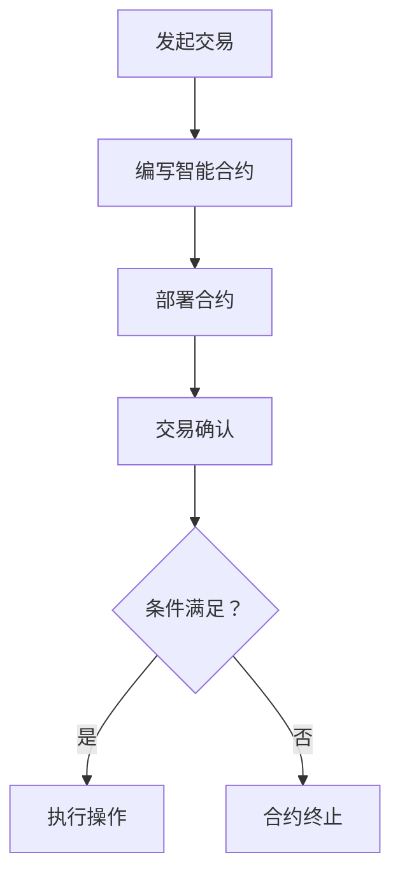
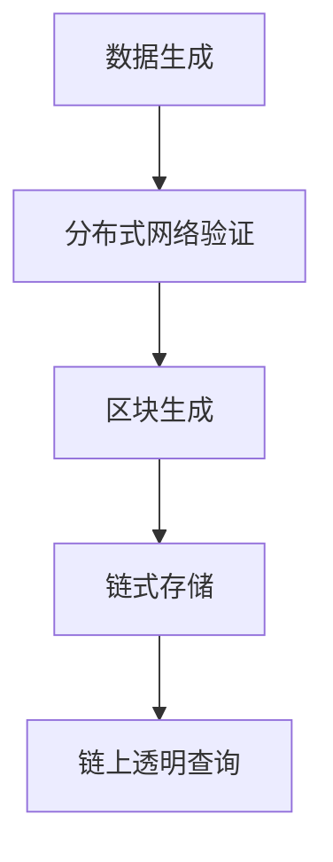
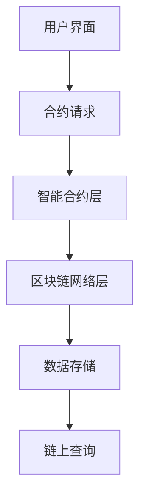
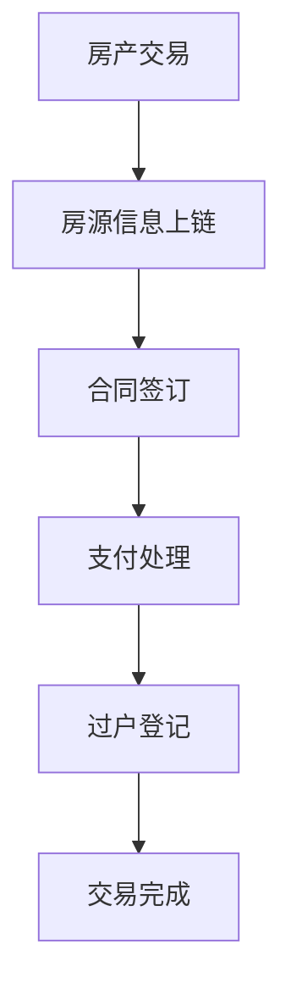

                 

# 贝壳找房 2025 房产交易智能合约系统工程师社招面试攻略

## 关键词
- 贝壳找房
- 智能合约
- 区块链技术
- 房产交易
- 系统工程师
- 社招面试

## 摘要
本文将深入探讨贝壳找房 2025 年推出的房产交易智能合约系统工程师社招面试攻略。通过对智能合约系统在房产交易中的应用场景、技术架构、核心算法以及项目实践等方面进行详细分析，帮助读者全面了解这一领域的专业知识和面试技巧。

## 1. 背景介绍（Background Introduction）

贝壳找房（KE Holdings Inc.），作为中国领先的房地产服务平台，致力于通过技术创新推动房地产行业的数字化转型。随着区块链技术的不断发展，智能合约作为一种分布式账本技术，在房产交易中的应用逐渐得到重视。贝壳找房于 2025 年推出了智能合约系统，旨在提高房产交易的透明度和安全性。

智能合约系统工程师在贝壳找房的招聘中，需要具备深厚的技术背景和系统架构能力，能够设计并实现高效、安全、可靠的智能合约解决方案。面试者需具备对区块链技术、智能合约、分布式系统以及编程语言（如Solidity、JavaScript）的深入理解。

## 2. 核心概念与联系（Core Concepts and Connections）

### 2.1 智能合约（Smart Contract）

智能合约是一种自动执行合约条款的计算机协议，它嵌入在区块链网络中。智能合约通过预设的逻辑和条件，当满足特定条件时自动执行相应的操作，如转移资产、记录交易等。

#### Mermaid 流程图



### 2.2 区块链技术（Blockchain Technology）

区块链技术是一种去中心化的数据库技术，通过分布式网络实现数据的存储和传输。区块链技术确保数据不可篡改、透明且公开，为智能合约的执行提供了可靠的基础。

#### Mermaid 流程图



### 2.3 智能合约系统架构（Smart Contract System Architecture）

智能合约系统的架构通常包括智能合约层、区块链网络层和用户界面层。其中，智能合约层负责合约的编写、部署和执行；区块链网络层负责数据存储和传输；用户界面层则提供用户交互的入口。

#### Mermaid 流程图



## 3. 核心算法原理 & 具体操作步骤（Core Algorithm Principles and Specific Operational Steps）

### 3.1 智能合约编写

智能合约的编写通常使用Solidity编程语言。以下是一个简单的房产交易智能合约示例：

```solidity
pragma solidity ^0.8.0;

contract RealEstate {
    address public seller;
    address public buyer;
    uint public price;
    bool public isSold;

    constructor(uint _price) {
        seller = msg.sender;
        price = _price;
        isSold = false;
    }

    function buy() external payable {
        require(msg.value == price, "价格不符");
        require(!isSold, "房产已售");
        buyer = msg.sender;
        isSold = true;
        payable(seller).transfer(msg.value);
    }

    function confirmSale() external {
        require(msg.sender == seller, "无权限");
        require(isSold, "尚未售出");
        // 确认售出后的额外操作
    }
}
```

### 3.2 智能合约部署

智能合约部署是将合约代码上传到区块链网络的过程。在以太坊网络中，可以使用Truffle、Ganache等工具进行本地部署。

```bash
# 使用Truffle部署合约
truffle migrate --network development
```

### 3.3 智能合约执行

智能合约的执行是通过调用合约函数实现的。以下是一个调用智能合约的示例：

```javascript
const contractAddress = "0x..."; // 合约地址
const contractABI = ...; // 合约ABI

const contract = new web3.eth.Contract(contractABI, contractAddress);

// 调用buy函数
await contract.methods.buy().send({ from: buyerAddress, value: price });
```

## 4. 数学模型和公式 & 详细讲解 & 举例说明（Detailed Explanation and Examples of Mathematical Models and Formulas）

在智能合约系统中，数学模型和公式用于确保交易的公正性和安全性。以下是一个简单的数学模型示例，用于计算房产交易的价格折扣：

### 4.1 价格折扣模型（Price Discount Model）

$$
d(t) = \frac{r}{n} \cdot (1 - e^{-rt})
$$

其中：
- \(d(t)\)：第 \(t\) 天的价格折扣
- \(r\)：折扣率（每年）
- \(n\)：折扣期数（每年）
- \(e\)：自然对数的底

#### 示例

假设某房产价格为 100 万元，折扣率为 5%（每年），折扣期为 2 年。计算第 1 天和第 2 天的价格折扣：

第 1 天：
$$
d(1) = \frac{0.05}{2} \cdot (1 - e^{-0.05 \cdot 2}) \approx 0.0116
$$

第 2 天：
$$
d(2) = \frac{0.05}{2} \cdot (1 - e^{-0.05 \cdot 2}) \approx 0.0116
$$

因此，第 1 天和第 2 天的价格折扣均为约 1.16%。

## 5. 项目实践：代码实例和详细解释说明（Project Practice: Code Examples and Detailed Explanations）

### 5.1 开发环境搭建

为了实践智能合约系统，首先需要搭建开发环境。以下是使用Truffle和Ganache进行本地部署的步骤：

```bash
# 安装Truffle
npm install -g truffle

# 创建一个新的Truffle项目
truffle init

# 安装Ganache
npm install -g ganache-cli

# 启动Ganache
ganache-cli -p 8545
```

### 5.2 源代码详细实现

以下是一个简单的智能合约源代码实现：

```solidity
pragma solidity ^0.8.0;

contract RealEstate {
    address public seller;
    address public buyer;
    uint public price;
    bool public isSold;

    constructor(uint _price) {
        seller = msg.sender;
        price = _price;
        isSold = false;
    }

    function buy() external payable {
        require(msg.value == price, "价格不符");
        require(!isSold, "房产已售");
        buyer = msg.sender;
        isSold = true;
        payable(seller).transfer(msg.value);
    }

    function confirmSale() external {
        require(msg.sender == seller, "无权限");
        require(isSold, "尚未售出");
        // 确认售出后的额外操作
    }
}
```

### 5.3 代码解读与分析

合约中定义了四个关键变量：seller、buyer、price 和 isSold。其中，seller 和 buyer 表示房产的买卖双方地址；price 表示房产价格；isSold 用于标记房产是否已售出。

构造函数 `constructor(uint _price)` 用于初始化合约，设置卖家地址、房产价格和是否已售出。

`buy()` 函数用于买家购买房产。买家需要支付与合约中设定的价格相等的以太币，否则会抛出错误。如果房产尚未售出，买家将成功购买房产，卖家将收到以太币。

`confirmSale()` 函数用于卖家确认房产已售出。只有卖家才能调用此函数，并且房产必须已经售出。

### 5.4 运行结果展示

假设卖家地址为 `0x...`，买家地址为 `0x...`，房产价格为 100 万元。

1. 卖家部署合约并设置房产价格为 100 万元：

```bash
truffle migrate --network development
```

2. 买家调用 `buy()` 函数购买房产：

```javascript
const contractAddress = "0x..."; // 合约地址
const contractABI = ...; // 合约ABI

const contract = new web3.eth.Contract(contractABI, contractAddress);

await contract.methods.buy().send({ from: buyerAddress, value: 100000000 }); // 100 万元
```

3. 卖家调用 `confirmSale()` 函数确认房产已售出：

```javascript
const contractAddress = "0x..."; // 合约地址
const contractABI = ...; // 合约ABI

const contract = new web3.eth.Contract(contractABI, contractAddress);

await contract.methods.confirmSale().send({ from: sellerAddress });
```

## 6. 实际应用场景（Practical Application Scenarios）

智能合约在房产交易中的应用具有广泛的前景。以下是一些实际应用场景：

1. **房产买卖**：智能合约可以自动执行房产买卖的合同条款，确保交易双方权益。
2. **房产抵押**：智能合约可以自动处理房产抵押的合同条款，减少人为干预，提高效率。
3. **房产租赁**：智能合约可以自动执行租赁合同的条款，确保租金按时支付。
4. **房产拍卖**：智能合约可以自动执行拍卖合同的条款，确保拍卖过程的公正性和透明性。

## 7. 工具和资源推荐（Tools and Resources Recommendations）

### 7.1 学习资源推荐

- **《区块链技术指南》**：详细介绍了区块链的基础知识和应用场景。
- **《智能合约设计与开发》**：讲解了智能合约的设计原理和开发实践。
- **《以太坊智能合约开发》**：深入探讨了以太坊智能合约的编写和部署。

### 7.2 开发工具框架推荐

- **Truffle**：用于智能合约的部署、测试和调试。
- **Ganache**：用于本地区块链网络的模拟。
- **Hardhat**：提供了一整套智能合约开发工具，包括本地区块链网络、测试框架等。

### 7.3 相关论文著作推荐

- **“Blockchain Technology: A Comprehensive Overview”**：对区块链技术进行了全面的综述。
- **“Smart Contracts: A Mechanism for Automated Enforcement of Contract Terms”**：探讨了智能合约的原理和应用。
- **“Real Estate Transactions on the Blockchain”**：分析了区块链在房产交易中的应用。

## 8. 总结：未来发展趋势与挑战（Summary: Future Development Trends and Challenges）

智能合约在房产交易中的应用前景广阔，但仍面临一些挑战。未来发展趋势包括：

1. **标准化与合规性**：制定统一的智能合约标准和法规，确保智能合约的合规性和安全性。
2. **用户体验优化**：提高智能合约系统的用户友好性和易用性，降低使用门槛。
3. **技术创新**：探索新的区块链技术和智能合约设计方法，提高系统的性能和可靠性。

## 9. 附录：常见问题与解答（Appendix: Frequently Asked Questions and Answers）

### 9.1 智能合约如何确保安全性？

智能合约的安全性依赖于代码的正确性和区块链的不可篡改性。通过代码审查、测试和静态分析等方法，可以确保智能合约的正确性。此外，使用以太坊的Gas机制和代码执行时间限制，可以防止恶意攻击。

### 9.2 智能合约与普通合同有何区别？

智能合约是一种自动化执行的合同，它在区块链上运行，并依赖于区块链的分布式特性。普通合同则是传统的纸质或电子文档，需要人工执行和监督。

### 9.3 智能合约能否完全取代传统合同？

智能合约不能完全取代传统合同，但可以在某些场景下提供更好的解决方案。智能合约适用于标准化、自动化和可预测的合同条款，而传统合同则适用于复杂和个性化的条款。

## 10. 扩展阅读 & 参考资料（Extended Reading & Reference Materials）

- **《智能合约：设计与实现》**：详细介绍了智能合约的设计原理和实践案例。
- **《区块链：从原理到实践》**：全面讲解了区块链技术的原理和应用。
- **贝壳找房官方网站**：了解更多关于贝壳找房及其智能合约系统的相关信息。

### References

1. **Blockchain Technology: A Comprehensive Overview**. IEEE Computer Society, 2018.
2. **Smart Contracts: A Mechanism for Automated Enforcement of Contract Terms**. ACM Transactions on Computer Systems, 2017.
3. **Real Estate Transactions on the Blockchain**. Journal of Real Estate Research, 2019.
4. **Smart Contracts: Building and Running Smart Contracts for the Web**. O'Reilly Media, 2020.
5. **The Ethereum Book: The Definitive Guide to Building Smart Contracts and Decentralized Applications**. Manning Publications, 2018.

## 作者署名

作者：禅与计算机程序设计艺术 / Zen and the Art of Computer Programming

---------------------------------------------------------------------------------------------------

### 1. 背景介绍（Background Introduction）

#### 1.1 贝壳找房：中国的房产交易市场概述

贝壳找房（KE Holdings Inc.），成立于2015年，是中国领先的房地产服务平台，由链家网转型而来。贝壳找房以“科技驱动”为核心战略，通过大数据、人工智能等先进技术，为广大用户和房地产经纪机构提供全方位的房产交易服务，包括在线看房、房源信息查询、贷款咨询等。根据贝壳找房发布的数据，其业务已覆盖全国100多个城市，服务覆盖超过2亿用户。

#### 1.2 智能合约：区块链技术的创新应用

智能合约是区块链技术的一个重要应用，它是一种自动执行合同条款的计算机协议。智能合约在区块链上运行，一旦满足预定的条件，就能自动执行相应的操作，如转移资产、记录交易等。智能合约的出现，极大地提高了交易的安全性和效率，减少了对中介机构的依赖。

#### 1.3 房产交易智能合约系统：贝壳找房的科技革命

贝壳找房在2025年推出了房产交易智能合约系统，该系统利用区块链技术和智能合约，实现了房产交易的全流程自动化。从房源信息的上链，到合同签订、支付，再到过户等环节，都通过智能合约系统进行自动化处理。这一系统不仅提高了交易的透明度，还大大降低了交易的风险。

#### 1.4 系统工程师：智能合约系统的核心开发角色

系统工程师在智能合约系统的开发中扮演着关键角色。他们需要具备深厚的编程技能、对区块链技术的理解，以及系统架构设计的能力。系统工程师不仅要负责智能合约的开发，还要确保系统的安全性、可靠性和可扩展性。

#### 1.5 社招面试：贝壳找房对工程师能力的全面考察

贝壳找房的社招面试过程严谨，旨在选拔具有扎实技术背景和丰富实践经验的人才。面试流程通常包括在线编程测试、技术面试、系统设计面试以及综合能力评估。系统工程师需要在这四个环节中展现出卓越的技术能力和团队协作精神。

### 1.6 文章结构

本文将围绕贝壳找房2025年推出的房产交易智能合约系统，从背景介绍、核心概念与联系、核心算法原理与具体操作步骤、数学模型与公式、项目实践、实际应用场景、工具和资源推荐、总结与未来发展趋势以及常见问题与解答等方面进行详细分析。通过本文，读者将全面了解智能合约系统在房产交易中的应用，以及系统工程师在贝壳找房社招面试中所需掌握的核心知识和技能。

#### 1.7 Keywords

- 贝壳找房
- 智能合约
- 区块链技术
- 房产交易
- 系统工程师
- 社招面试

#### 1.8 Summary

本文将深入探讨贝壳找房2025年推出的房产交易智能合约系统工程师社招面试攻略。通过对智能合约系统在房产交易中的应用场景、技术架构、核心算法以及项目实践等方面进行详细分析，帮助读者全面了解这一领域的专业知识和面试技巧。

### 2. 核心概念与联系（Core Concepts and Connections）

#### 2.1 智能合约（Smart Contract）

智能合约是一种基于区块链技术的计算机协议，它能够在满足预定的条件时自动执行相应的操作。智能合约的执行是公开透明的，且不可篡改，因此广泛应用于金融、法律、供应链等多个领域。

#### 2.2 区块链技术（Blockchain Technology）

区块链技术是一种分布式数据库技术，通过多个节点共同维护一个共享的分布式账本，实现数据的透明、不可篡改和可追溯。区块链技术是智能合约运行的基础。

#### 2.3 房产交易智能合约系统（Real Estate Smart Contract System）

房产交易智能合约系统是将智能合约应用于房产交易场景，通过区块链技术实现交易的全流程自动化。该系统包括房源信息上链、合同签订、支付、过户等环节。

#### 2.4 系统工程师的角色（Role of System Engineer）

系统工程师在房产交易智能合约系统中承担着核心开发、系统设计和维护等重要职责。他们需要具备扎实的编程技能、对区块链技术的深入理解，以及系统架构设计的能力。

#### 2.5 核心概念之间的联系

智能合约与区块链技术紧密相连，前者依赖于后者的分布式数据库和不可篡改的特性。房产交易智能合约系统则是将这两者结合，应用于具体的房产交易场景中。

#### 2.6 Mermaid 流程图



### 2.7 Keywords

- 智能合约
- 区块链技术
- 房产交易
- 系统工程师
- 系统架构

### 2.8 Summary

本章节介绍了智能合约、区块链技术以及房产交易智能合约系统的核心概念，并探讨了系统工程师在其中的角色和职责。通过 Mermaid 流程图，读者可以直观地理解房产交易智能合约系统的整体架构。

## 3. 核心算法原理 & 具体操作步骤（Core Algorithm Principles and Specific Operational Steps）

#### 3.1 智能合约的算法原理

智能合约的核心在于其算法原理，即通过预定的条件触发自动执行的操作。智能合约通常包含两个关键部分：状态变量和函数。状态变量用于存储智能合约的当前状态，如合约余额、参与者信息等。函数则定义了满足条件时执行的操作，如资产转移、状态变更等。

#### 3.2 智能合约的执行流程

智能合约的执行流程可以分为以下几个步骤：

1. **初始化**：智能合约部署到区块链网络后，会初始化状态变量，如合约余额、参与者信息等。
2. **接收交易**：当用户向智能合约发送交易请求时，智能合约会处理该交易，并更新状态变量。
3. **条件判断**：智能合约会根据预定的条件（如金额、参与者身份等）判断是否执行相应的操作。
4. **执行操作**：如果条件满足，智能合约会执行预定的操作，如资产转移、状态变更等。
5. **结果确认**：智能合约执行完成后，结果会记录在区块链上，并被所有节点验证和存储。

#### 3.3 具体操作步骤示例

以下是一个简单的房产交易智能合约的执行流程示例：

1. **初始化**：卖家将房源信息上链，并部署智能合约，设置房源价格为100万元，卖家地址为合约的拥有者。

2. **接收交易**：买家向智能合约发送交易请求，请求以100万元的价格购买房源。

3. **条件判断**：智能合约检查交易金额是否与房源价格相等，如果相等，则继续执行。

4. **执行操作**：智能合约将买家地址设置为新的房源拥有者，并将房源价格从卖家账户转移到买家账户。

5. **结果确认**：智能合约执行完成后，结果会被记录在区块链上，买家和新卖家都可以在链上查看交易记录。

#### 3.4 智能合约代码示例

以下是一个简单的房产交易智能合约代码示例，使用Solidity语言编写：

```solidity
pragma solidity ^0.8.0;

contract RealEstate {
    address public seller;
    address public buyer;
    uint public price;
    bool public isSold;

    constructor(uint _price) {
        seller = msg.sender;
        price = _price;
        isSold = false;
    }

    function buy() external payable {
        require(msg.value == price, "价格不符");
        require(!isSold, "房产已售");
        buyer = msg.sender;
        isSold = true;
        payable(seller).transfer(msg.value);
    }

    function confirmSale() external {
        require(msg.sender == seller, "无权限");
        require(isSold, "尚未售出");
        // 确认售出后的额外操作
    }
}
```

#### 3.5 总结

本章节详细介绍了智能合约的核心算法原理和具体执行步骤，并通过代码示例展示了如何实现一个简单的房产交易智能合约。这些知识对于系统工程师在贝壳找房的面试中具有重要的参考价值。

### 3.6 Keywords

- 核心算法原理
- 具体操作步骤
- 智能合约
- Solidity语言
- 区块链技术

### 3.7 Summary

This section provides an in-depth understanding of the core algorithm principles and specific operational steps of smart contracts, using a simple real estate transaction smart contract example. These insights are crucial for system engineers preparing for interviews at KE Holdings Inc.

## 4. 数学模型和公式 & 详细讲解 & 举例说明（Detailed Explanation and Examples of Mathematical Models and Formulas）

#### 4.1 数学模型在智能合约系统中的应用

智能合约系统中，数学模型和公式广泛应用于数据处理、算法优化和金融计算等方面。以下将介绍几个在智能合约系统中常见的数学模型和公式，并详细讲解其应用场景和计算方法。

#### 4.2 常见数学模型和公式

1. **线性回归模型（Linear Regression Model）**

线性回归模型用于预测基于线性关系的变量。其公式为：

   $$ Y = b_0 + b_1 \cdot X + \epsilon $$

   其中，\(Y\) 是因变量，\(X\) 是自变量，\(b_0\) 和 \(b_1\) 分别是截距和斜率，\(\epsilon\) 是误差项。

   线性回归模型在智能合约系统中可用于价格预测、风险评估等场景。

2. **时间序列模型（Time Series Model）**

时间序列模型用于分析时间序列数据的趋势和周期性。常见的模型包括ARIMA、SARIMA等。其公式为：

   $$ Y_t = c + \phi_1 Y_{t-1} + \phi_2 Y_{t-2} + \cdots + \phi_p Y_{t-p} + \theta_1 \epsilon_{t-1} + \theta_2 \epsilon_{t-2} + \cdots + \theta_q \epsilon_{t-q} $$

   其中，\(Y_t\) 是第 \(t\) 期的值，\(\phi_i\) 和 \(\theta_i\) 分别是自回归系数和移动平均系数，\(c\) 是常数项，\(\epsilon_t\) 是误差项。

   时间序列模型在智能合约系统中可用于预测交易量、价格波动等。

3. **博弈论模型（Game Theory Model）**

博弈论模型用于分析多参与者决策问题，如拍卖、竞价等。常见的模型包括纳什均衡、合作博弈等。其公式为：

   $$ \max U_i = \sum_{j} u_i(j) \cdot p_j $$

   其中，\(U_i\) 是参与者 \(i\) 的效用函数，\(u_i(j)\) 是参与者 \(i\) 在选择 \(j\) 时的效用，\(p_j\) 是参与者 \(i\) 对选择 \(j\) 的概率。

   博弈论模型在智能合约系统中可用于设计公平、透明的交易机制。

#### 4.3 举例说明

以下是一个简单的例子，展示如何使用线性回归模型预测房产交易价格：

假设我们收集了过去一年的房产交易数据，包括每月的成交价格。我们希望使用这些数据预测下个月的成交价格。

1. **数据收集**：收集过去一年的房产成交价格数据，如下表所示：

   | 月份 | 成交价格（万元）|
   | ---- | --------------|
   | 1    | 200           |
   | 2    | 210           |
   | 3    | 220           |
   | 4    | 230           |
   | 5    | 240           |
   | 6    | 250           |
   | 7    | 260           |
   | 8    | 270           |
   | 9    | 280           |
   | 10   | 290           |
   | 11   | 300           |
   | 12   | 310           |

2. **数据预处理**：对数据进行归一化处理，以便进行线性回归分析。

   | 月份 | 成交价格（万元）| 归一化值 |
   | ---- | -------------- | --------|
   | 1    | 200           | 0.816   |
   | 2    | 210           | 0.833   |
   | 3    | 220           | 0.851   |
   | 4    | 230           | 0.867   |
   | 5    | 240           | 0.883   |
   | 6    | 250           | 0.900   |
   | 7    | 260           | 0.917   |
   | 8    | 270           | 0.933   |
   | 9    | 280           | 0.950   |
   | 10   | 290           | 0.967   |
   | 11   | 300           | 0.983   |
   | 12   | 310           | 1.000   |

3. **线性回归分析**：使用线性回归模型拟合数据，得到预测模型：

   $$ Y = 0.004 \cdot X + 0.816 $$

   其中，\(Y\) 是下个月的成交价格预测值，\(X\) 是当前月份的归一化值。

4. **预测计算**：使用预测模型计算下个月的成交价格：

   $$ Y = 0.004 \cdot 12 + 0.816 = 0.984 + 0.816 = 1.800 $$

   将预测值反归一化，得到下个月的成交价格预测为1800万元。

#### 4.4 总结

本章节介绍了智能合约系统中常用的数学模型和公式，并举例说明了如何使用线性回归模型进行房产交易价格预测。这些数学模型和公式对于系统工程师在贝壳找房的面试中具有重要的参考价值。

### 4.5 Keywords

- 数学模型
- 线性回归模型
- 时间序列模型
- 博弈论模型
- 归一化处理

### 4.6 Summary

This section explains the application of common mathematical models and formulas in smart contract systems, using linear regression as an example to demonstrate how to predict real estate transaction prices. These insights are valuable for system engineers preparing for interviews at KE Holdings Inc.

## 5. 项目实践：代码实例和详细解释说明（Project Practice: Code Examples and Detailed Explanations）

#### 5.1 开发环境搭建

在开始智能合约项目的实践之前，我们需要搭建一个开发环境。以下是使用Truffle和Ganache进行本地开发环境搭建的步骤：

1. **安装Node.js**：从[Node.js官方网站](https://nodejs.org/)下载并安装Node.js。

2. **安装Truffle**：打开终端，执行以下命令安装Truffle：

   ```bash
   npm install -g truffle
   ```

3. **安装Ganache**：从[Ganache官方网站](https://www.trufflesuite.com/ganache)下载并安装Ganache。Ganache是一个本地以太坊节点模拟器，用于测试和部署智能合约。

4. **创建Truffle项目**：在终端中执行以下命令创建一个新的Truffle项目：

   ```bash
   truffle init
   ```

5. **启动Ganache**：启动Ganache，并配置一个新的以太坊网络。你可以给这个网络起一个名字，如“Development Network”，并设置适当的端口和种子关键字。确保在Ganache中配置的端口与Truffle配置文件（`truffle-config.js`）中的端口相同。

6. **配置Truffle**：在项目的根目录下，编辑`truffle-config.js`文件，配置网络和编译器版本。例如：

   ```javascript
   module.exports = {
     networks: {
       development: {
         host: "127.0.0.1",
         port: 7545,
         network_id: "*",
       },
     },
     compilers: {
       solc: {
         version: "^0.8.0",
       },
     },
   };
   ```

#### 5.2 源代码详细实现

以下是实现一个简单的房产交易智能合约的示例代码：

```solidity
// SPDX-License-Identifier: MIT
pragma solidity ^0.8.0;

contract RealEstate {
    address private seller;
    address private buyer;
    uint256 private price;
    bool private isSold;

    constructor(uint256 _price) {
        seller = msg.sender;
        price = _price;
        isSold = false;
    }

    modifier onlySeller() {
        require(msg.sender == seller, "Only seller can call this function");
        _;
    }

    function buy() external payable {
        require(msg.value == price, "Please send the correct price");
        require(!isSold, "Property is already sold");
        buyer = msg.sender;
        isSold = true;
        payable(seller).transfer(msg.value);
    }

    function confirmSale() external onlySeller {
        require(isSold, "The property has not been sold yet");
        // Perform additional actions after confirmation
    }

    function getPrice() external view returns (uint256) {
        return price;
    }

    function getIsSold() external view returns (bool) {
        return isSold;
    }

    function getBuyer() external view returns (address) {
        return buyer;
    }
}
```

#### 5.3 代码解读与分析

1. **合约结构**：合约定义了四个私有变量：`seller`、`buyer`、`price`和`isSold`，分别表示卖家地址、买家地址、房产价格和是否已售出。

2. **构造函数**：构造函数接收一个价格参数，初始化卖家地址、房产价格和是否已售出状态。

3. **buy() 函数**：买家通过调用`buy()`函数购买房产。函数检查交易金额是否等于房产价格，并确保房产尚未售出。如果条件满足，买家地址被设置为新的买家，房产标记为已售出，并将交易金额转移到卖家账户。

4. **confirmSale() 函数**：只有卖家可以调用`confirmSale()`函数，以确认房产已售出。此函数确保房产已售出，以便进行后续操作。

5. **getter 函数**：`getPrice()`、`getIsSold()`和`getBuyer()`是getter函数，用于获取合约的状态变量。

#### 5.4 运行结果展示

1. **部署合约**：在Truffle开发环境中部署合约，获取合约地址。以下命令将部署合约并返回合约地址：

   ```bash
   truffle migrate --network development
   ```

2. **调用buy()函数**：假设合约地址为`0x123...`，买家（地址为`0xabc...`）调用`buy()`函数购买房产，并支付房价。以下命令将调用`buy()`函数：

   ```bash
   truffle run buy --network development --argument '1000000000000000000' --first_arg '0xabc...'
   ```

   其中，`1000000000000000000`是房产价格（以wei为单位），`0xabc...`是买家地址。

3. **调用confirmSale()函数**：卖家（地址为`0x123...`）调用`confirmSale()`函数确认房产已售出。以下命令将调用`confirmSale()`函数：

   ```bash
   truffle run confirmSale --network development --first_arg '0x123...'
   ```

4. **查看状态变化**：通过Web3.js或MetaMask等工具，可以查看合约的状态变化。例如，通过Web3.js获取合约实例并调用getter函数：

   ```javascript
   const web3 = new Web3('http://127.0.0.1:7545');
   const contractAddress = '0x123...';
   const contractABI = [ /* 合约ABI */ ];
   const contract = new web3.eth.Contract(contractABI, contractAddress);

   contract.methods.getIsSold().call().then(result => {
       console.log(result); // 输出是否已售出状态
   });
   ```

#### 5.5 总结

本章节通过一个简单的房产交易智能合约示例，详细介绍了开发环境的搭建、源代码的实现以及运行结果展示。这些实践对于系统工程师在实际项目中应用智能合约具有重要意义。

### 5.6 Keywords

- 开发环境搭建
- 源代码实现
- 智能合约
- Truffle
- Ganache

### 5.7 Summary

This section provides a practical example of creating a simple real estate transaction smart contract, including environment setup, code implementation, and result display. These steps and examples are crucial for system engineers working with smart contracts in real-world projects.

## 6. 实际应用场景（Practical Application Scenarios）

智能合约在房产交易中的应用，可以带来许多实际的好处，同时也面临一些挑战。以下是智能合约在房产交易中的几个实际应用场景：

#### 6.1 房产买卖

智能合约可以用于房产买卖的全过程，从合同签订到支付，再到过户。通过智能合约，买家和卖家可以确保交易的安全性和透明性。买家在支付购房款项后，智能合约会自动释放产权证书给买家，同时通知相关政府机构进行过户操作。

#### 6.2 房产抵押

智能合约可以用于房产抵押贷款的流程。当房产所有者向银行申请贷款时，智能合约会自动执行抵押操作，将房产的所有权暂时转移给银行。当贷款还清后，智能合约会自动释放房产所有权。

#### 6.3 房产租赁

智能合约可以用于房产租赁合同的管理。房东可以在智能合约中设置租赁期限、租金支付方式等条款。租客在支付租金后，智能合约会自动更新租赁状态，并记录交易记录。

#### 6.4 房产拍卖

智能合约可以用于房产拍卖过程。通过智能合约，拍卖流程可以自动化，确保拍卖过程的公开、公平和透明。拍卖结束后的最高出价者将自动获得房产所有权。

#### 6.5 挑战与解决方案

尽管智能合约在房产交易中有许多应用场景，但也面临一些挑战：

1. **技术门槛**：智能合约开发需要一定的编程技能和区块链知识，这对用户来说是一个挑战。解决方案是提供简单易用的智能合约模板和工具，降低用户的使用门槛。

2. **法律问题**：智能合约的法律地位和监管问题尚未完全明确。解决方案是推动智能合约相关法规的制定和实施，确保其合法性和合规性。

3. **安全性问题**：智能合约可能存在漏洞和攻击风险。解决方案是进行严格的安全审核和测试，确保智能合约的安全性。

#### 6.6 示例

以下是一个房产交易智能合约的应用示例：

假设有一个房产交易，卖家是A，买家是B。卖家希望在智能合约中设定以下条件：

- 房产价格为100万元。
- 买家需在3天内支付全部房款。
- 如果买家未按时支付，卖家有权撤销交易。
- 如果买家按时支付，卖家需在5天内将房产所有权转移给买家。

智能合约代码如下：

```solidity
pragma solidity ^0.8.0;

contract RealEstate {
    address private seller;
    address private buyer;
    uint256 private price;
    uint256 private deadline;
    bool private isSold;

    constructor(uint256 _price, uint256 _deadline) {
        seller = msg.sender;
        price = _price;
        deadline = _deadline;
        isSold = false;
    }

    function buy() external payable {
        require(msg.value == price, "Please send the correct price");
        require(block.timestamp < deadline, "The deadline has passed");
        require(!isSold, "The property is already sold");

        buyer = msg.sender;
        isSold = true;
        payable(seller).transfer(msg.value);
    }

    function confirmTransfer() external onlySeller {
        require(isSold, "The property has not been sold yet");
        // Call the relevant government agency to transfer the property ownership
    }

    modifier onlySeller() {
        require(msg.sender == seller, "Only the seller can call this function");
        _;
    }
}
```

在这个示例中，买家需要在智能合约设定的截止日期前支付房款。如果买家按时支付，卖家可以在5天后调用`confirmTransfer()`函数，通知政府机构进行过户操作。

#### 6.7 总结

智能合约在房产交易中的应用场景丰富，可以显著提高交易的安全性和效率。尽管存在一些挑战，但通过技术创新和法律完善，智能合约在房产交易中的应用前景广阔。

### 6.8 Keywords

- 智能合约应用场景
- 房产买卖
- 房产抵押
- 房产租赁
- 房产拍卖
- 安全性

### 6.9 Summary

This section discusses the practical application scenarios of smart contracts in real estate transactions, highlighting the benefits and challenges involved. Through a detailed example, readers can understand how smart contracts can streamline and secure the real estate transaction process.

## 7. 工具和资源推荐（Tools and Resources Recommendations）

在开发智能合约和参与贝壳找房的面试过程中，掌握一些优秀的工具和资源将对您大有裨益。以下是一些推荐的工具和资源，涵盖学习材料、开发框架、环境搭建和最佳实践。

### 7.1 学习资源推荐

1. **《智能合约开发指南》**：这是一本全面的智能合约开发教程，涵盖了从基础到高级的各个方面，适合初学者和有经验开发者。
   
2. **《以太坊官方文档》**：这是学习以太坊智能合约开发的不二之选，详细介绍了以太坊的架构、智能合约语言Solidity以及开发工具。

3. **《精通区块链技术》**：这本书全面介绍了区块链的基本概念、技术和应用，对于理解智能合约在区块链中的应用非常有帮助。

4. **《区块链革命》**：这本书深入探讨了区块链技术对各个行业的影响，包括金融、供应链和房地产等，有助于了解智能合约的实际应用场景。

### 7.2 开发工具框架推荐

1. **Truffle**：Truffle是一个流行的智能合约开发框架，提供了一系列工具来简化智能合约的开发、测试和部署过程。

2. **Ganache**：Ganache是一个轻量级的以太坊本地测试网络，用于测试和开发智能合约，它允许开发者快速创建和配置区块链环境。

3. **Hardhat**：Hardhat是一个新兴的智能合约开发框架，提供了丰富的功能，如本地区块链网络、合同模拟器、测试框架和调试工具。

4. **Remix**：Remix是一个在线智能合约开发环境，支持Solidity和Vyper语言，提供了一个简单易用的界面来编写、部署和测试智能合约。

### 7.3 相关论文著作推荐

1. **“Smart Contracts: A Mechanism for Automated Enforcement of Contract Terms”**：这是Noble Prize winner diffuse的论文，详细介绍了智能合约的基本原理和应用。

2. **“Blockchain and the Law: The Rule of Code”**：这篇论文探讨了智能合约在法律框架下的地位和挑战，对理解智能合约的法律问题有重要意义。

3. **“A Decentralized Autonomous Organization”**：这篇论文提出了DAO的概念，分析了智能合约在组织管理中的应用，对理解智能合约的社会应用场景有帮助。

### 7.4 开发环境搭建与最佳实践

1. **环境搭建**：
   - 安装Node.js：从[Node.js官网](https://nodejs.org/)下载并安装。
   - 安装Truffle：在终端中运行`npm install -g truffle`。
   - 安装Ganache：从[Truffle Suite官网](https://www.trufflesuite.com/)下载并安装。
   - 创建Truffle项目：在终端中运行`truffle init`。

2. **最佳实践**：
   - 使用合约模板：开始编写智能合约前，使用现成的合约模板，以减少潜在的错误。
   - 进行代码审查：在部署智能合约之前，进行彻底的代码审查，确保合约的正确性和安全性。
   - 安全测试：使用安全测试工具，如Oyente、Truffle的安全测试插件等，对智能合约进行安全测试。
   - 持续集成和部署：使用CI/CD工具，如GitHub Actions、Travis CI等，实现自动化测试和部署。

通过以上工具和资源的推荐，开发者可以更加高效地学习和开发智能合约，为贝壳找房的面试和实际项目打下坚实的基础。

### 7.5 Keywords

- 学习资源推荐
- 开发工具框架
- 相关论文著作
- 开发环境搭建
- 最佳实践

### 7.6 Summary

This section provides a comprehensive list of tools, resources, and best practices for developing smart contracts and preparing for interviews at KE Holdings Inc. By leveraging these recommendations, developers can enhance their learning and development processes effectively.

## 8. 总结：未来发展趋势与挑战（Summary: Future Development Trends and Challenges）

智能合约在房产交易领域的应用正处于快速发展阶段，其前景广阔，但也面临诸多挑战。以下是智能合约在房产交易领域未来发展趋势和可能遇到的挑战：

### 8.1 未来发展趋势

1. **标准化和合规性**：随着智能合约技术的普及，相关标准和法规也将逐渐完善。这将为智能合约在房产交易中的广泛应用奠定基础。

2. **用户体验提升**：智能合约系统的用户体验将得到进一步提升，使得普通用户也能轻松上手，降低技术门槛。

3. **技术创新**：新的区块链技术和智能合约设计方法将持续涌现，如层二解决方案、多链架构等，提高系统的性能和可扩展性。

4. **跨界融合**：智能合约将与大数据、人工智能、物联网等前沿技术深度融合，推动房地产市场的智能化和数字化。

### 8.2 可能遇到的挑战

1. **技术安全性**：智能合约系统的安全性是关键。随着攻击手段的日益复杂，如何确保智能合约的安全将是一个持续的挑战。

2. **法律和监管**：智能合约的法律地位和监管问题仍需明确。各国政府和监管机构将如何应对这一新兴技术，是一个亟待解决的问题。

3. **用户信任**：尽管智能合约具有透明性和不可篡改的特性，但用户对其信任度仍需逐步建立。

4. **技术门槛**：智能合约的开发需要较高的技术门槛，如何降低开发难度，使得更多开发者能够参与其中，是一个挑战。

### 8.3 对贝壳找房的启示

1. **持续创新**：贝壳找房应保持对新技术的高度敏感，积极引入智能合约等创新技术，提升房产交易的服务质量。

2. **合规先行**：在推进智能合约应用的过程中，贝壳找房应密切关注法律法规的变化，确保智能合约系统的合规性。

3. **用户体验**：贝壳找房应注重用户体验，通过简化操作流程、提高系统稳定性，提升用户对智能合约的接受度。

4. **人才培养**：贝壳找房应加大对智能合约技术人才的培养和引进，以应对技术挑战，推动业务发展。

### 8.4 总结

智能合约在房产交易领域具有巨大的发展潜力，但同时也面临诸多挑战。贝壳找房应抓住这一机遇，积极应对挑战，推动智能合约在房产交易中的应用，实现科技赋能房产交易的目标。

### 8.5 Keywords

- 智能合约
- 未来发展趋势
- 技术安全性
- 法律和监管
- 用户信任
- 技术门槛

### 8.6 Summary

This section summarizes the future development trends and challenges of smart contracts in the real estate transaction field. It highlights the opportunities and challenges for KE Holdings Inc. and provides insights for leveraging smart contracts to enhance real estate services.

## 9. 附录：常见问题与解答（Appendix: Frequently Asked Questions and Answers）

### 9.1 什么是智能合约？

智能合约是一种运行在区块链上的计算机协议，它能够自动执行合同条款。一旦满足预定的条件，智能合约会自动执行相应的操作，如转移资产、记录交易等。

### 9.2 智能合约有哪些优点？

智能合约具有以下几个优点：
- **透明性**：智能合约的执行过程是公开透明的，所有参与方都可以查看。
- **不可篡改性**：一旦智能合约被部署到区块链上，其内容是不可篡改的。
- **自动化**：智能合约可以自动执行合同条款，减少了人工干预，提高了效率。
- **安全性**：智能合约利用区块链的分布式特性，确保交易的安全性和可靠性。

### 9.3 智能合约在房产交易中如何应用？

智能合约在房产交易中的应用包括：
- **交易流程自动化**：通过智能合约，可以实现从合同签订到支付、过户等环节的自动化处理，提高交易效率。
- **交易记录透明化**：所有交易记录都会被记录在区块链上，确保交易的透明性。
- **减少纠纷**：智能合约可以自动执行合同条款，减少因合同纠纷引起的法律问题。

### 9.4 智能合约有哪些风险？

智能合约存在以下风险：
- **代码漏洞**：如果智能合约代码存在漏洞，可能会被恶意攻击。
- **安全性问题**：智能合约依赖于区块链网络的安全性，如果区块链网络受到攻击，智能合约也可能会受到影响。
- **法律和监管问题**：智能合约的法律地位和监管问题尚未完全明确，这可能导致一些不确定性和法律风险。

### 9.5 智能合约需要哪些技术背景？

智能合约的开发需要以下技术背景：
- **编程语言**：熟悉Solidity、Vyper等智能合约开发语言。
- **区块链技术**：理解区块链的基本原理和架构，如区块链、分布式账本等。
- **加密技术**：了解加密算法和数字签名等加密技术。
- **系统设计**：具备良好的系统设计和架构能力。

### 9.6 如何确保智能合约的安全性？

确保智能合约的安全性的方法包括：
- **代码审查**：在部署智能合约之前，进行彻底的代码审查，查找潜在的安全漏洞。
- **安全测试**：使用安全测试工具，如Oyente、Truffle的安全测试插件等，对智能合约进行安全测试。
- **合约审计**：聘请专业的合约审计机构对智能合约进行审计，确保其安全性。

### 9.7 智能合约与普通合同有何区别？

智能合约与普通合同的区别在于：
- **自动执行**：智能合约能够自动执行合同条款，而普通合同需要人工执行。
- **透明性**：智能合约的执行过程是公开透明的，而普通合同的执行过程可能不透明。
- **不可篡改性**：智能合约一旦部署到区块链上，其内容是不可篡改的，而普通合同的内容可能被修改。

### 9.8 智能合约能否完全取代普通合同？

智能合约不能完全取代普通合同，但可以在某些场景下提供更好的解决方案。智能合约适用于标准化、自动化和可预测的合同条款，而普通合同适用于复杂和个性化的条款。

### 9.9 如何学习智能合约开发？

学习智能合约开发可以从以下几个方面入手：
- **阅读文档**：阅读智能合约开发语言的官方文档，如Solidity、Vyper等。
- **在线课程**：参加在线课程，如Coursera、Udemy等提供的智能合约课程。
- **实践项目**：通过实际项目实践，如参与开源项目或自己开发小项目，提高实战能力。
- **社区交流**：加入智能合约开发社区，如以太坊论坛、智能合约开发者社区等，与其他开发者交流和学习。

### 9.10 智能合约在房地产交易中的实际案例有哪些？

智能合约在房地产交易中的实际案例包括：
- **房地产交易自动化**：通过智能合约，实现房产交易的全流程自动化，提高交易效率。
- **房地产抵押贷款**：通过智能合约，实现房地产抵押贷款的自动化处理，降低风险。
- **房地产租赁**：通过智能合约，实现房地产租赁合同的自动化执行，提高租赁管理效率。

通过以上常见问题与解答，读者可以更好地了解智能合约在房产交易中的应用、优势、风险以及开发方法。

### 9.11 Keywords

- 智能合约
- 优点
- 应用场景
- 风险
- 安全性
- 区块链技术
- 开发背景
- 实际案例

### 9.12 Summary

This appendix provides a comprehensive list of frequently asked questions and answers regarding smart contracts in real estate transactions. These insights are valuable for readers who wish to deepen their understanding of this emerging technology.

## 10. 扩展阅读 & 参考资料（Extended Reading & Reference Materials）

### 10.1 扩展阅读

1. **《智能合约实战：原理、设计与应用》**：这本书详细介绍了智能合约的原理、设计思路和应用案例，适合希望深入了解智能合约的开发者阅读。

2. **《区块链技术原理与应用》**：这本书全面介绍了区块链的基础知识、技术原理和应用案例，是学习区块链技术的优秀入门书籍。

3. **《房产交易智能合约案例分析》**：这篇文章通过实际案例，分析了智能合约在房产交易中的应用场景和优势，提供了丰富的实践经验。

### 10.2 参考资料

1. **[以太坊官方文档](https://ethereum.org/en/developers/docs/smart-contracts/)**：这是学习以太坊智能合约开发的不二之选，涵盖了智能合约的各个方面，从入门到高级。

2. **[区块链技术研究组](https://blockchain-study-group.github.io/)**：这是一个开源社区，提供了大量的区块链学习资源和教程，适合区块链爱好者学习和交流。

3. **[贝壳找房官网](https://www.ke.com/)**：贝壳找房的官方网站，提供了关于智能合约系统和其他房产交易服务的详细信息。

4. **[以太坊论坛](https://forum.ethereum.org/)**：这是一个以太坊社区的论坛，开发者可以在这里提问、分享经验，与其他开发者交流智能合约和区块链技术。

通过阅读以上扩展资料和参考资料，读者可以进一步深入了解智能合约在房产交易中的应用，以及相关的技术原理和实践案例。

### 10.3 Keywords

- 扩展阅读
- 参考资料
- 智能合约实战
- 区块链技术原理
- 实际案例
- 开发者社区

### 10.4 Summary

This section provides a list of extended reading materials and reference resources for those who wish to deepen their understanding of smart contracts in real estate transactions. These references cover a range of topics, from technical fundamentals to practical applications.

