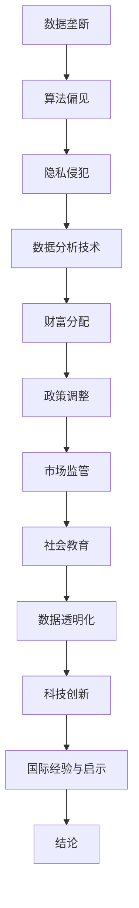

                 

# 财富分配的失衡：1%的人掌握99%的资源

## 关键词：财富分配、社会不平等、资源集中、技术影响、经济模型、算法分析

## 摘要：

本文深入探讨了全球财富分配的失衡现象，特别是1%的精英掌握着99%的资源这一引人关注的趋势。通过技术视角，本文分析了这一现象背后的原因，并探讨了技术如何加剧或缓解这一不平等问题。文章结构如下：

1. 背景介绍
2. 核心概念与联系
3. 核心算法原理 & 具体操作步骤
4. 数学模型和公式 & 详细讲解 & 举例说明
5. 项目实战：代码实际案例和详细解释说明
6. 实际应用场景
7. 工具和资源推荐
8. 总结：未来发展趋势与挑战
9. 附录：常见问题与解答
10. 扩展阅读 & 参考资料

## 1. 背景介绍

在当今全球化的背景下，财富分配的失衡问题愈发凸显。据Oxfam（一个国际慈善机构）发布的报告显示，全球最富有的1%的人掌握了超过99%的财富。这一现象不仅在社会层面引发了广泛的不满和讨论，也在技术领域引起了关注。随着技术的不断进步，一些科技公司通过算法和数据分析等技术手段，进一步强化了资源的集中现象。

财富分配失衡对社会的各个方面产生了深远的影响。首先，社会不平等加剧，导致贫富差距扩大。其次，资源的不均衡分配会影响到教育和医疗等公共服务的质量，进而影响整个社会的发展。此外，政治力量的集中也可能使得政策的制定更加偏向富裕阶层，从而加剧社会不平等。

从技术角度来看，财富分配失衡与数据垄断、算法偏见、隐私侵犯等问题密切相关。掌握大量数据的公司可以通过优化算法，增加其市场占有率，从而进一步积累财富。此外，算法偏见可能导致某些群体在求职、贷款、保险等方面受到不公平对待，进而加剧贫富差距。

## 2. 核心概念与联系

### 2.1 数据垄断

数据垄断是指某些公司或组织通过控制大量的数据资源，形成了市场垄断地位。这种垄断地位使得这些公司可以独占数据资源，从而获得竞争优势。例如，Google、Facebook等科技巨头通过其搜索引擎和社交媒体平台，积累了海量的用户数据，这些数据成为了他们盈利的重要来源。

### 2.2 算法偏见

算法偏见是指算法在处理数据时，因为训练数据的偏见或算法设计的缺陷，导致某些群体在结果上受到不公平对待。例如，某些招聘算法可能因为训练数据的偏差，导致对女性或少数族裔的招聘机会减少。

### 2.3 隐私侵犯

隐私侵犯是指公司在收集和使用用户数据时，未经用户同意或超出用户预期，侵犯用户的隐私权益。例如，某些社交媒体平台可能通过收集用户位置信息、搜索历史等数据，进行精准广告投放，从而实现盈利。

## 3. 核心算法原理 & 具体操作步骤

### 3.1 数据挖掘

数据挖掘是一种通过从大量数据中提取有用信息的技术，它可以用于发现数据中的模式和关联。例如，零售公司可以通过数据挖掘分析顾客购买行为，从而优化库存管理和营销策略。

### 3.2 机器学习

机器学习是一种通过训练模型，让计算机自动从数据中学习的技术。例如，推荐系统可以通过分析用户的历史行为，预测用户可能感兴趣的商品或内容。

### 3.3 深度学习

深度学习是一种基于多层神经网络的人工智能技术，它可以用于处理复杂的数据和任务。例如，图像识别和自然语言处理等领域广泛使用深度学习技术。

## 4. 数学模型和公式 & 详细讲解 & 举例说明

### 4.1 马尔可夫模型

马尔可夫模型是一种用于预测某个状态转移概率的数学模型。它可以用来分析用户行为，预测用户下一步可能的行为。例如，一个电子商务网站可以通过马尔可夫模型分析用户浏览历史，预测用户可能购买的商品。

### 4.2 概率分布

概率分布是一种描述随机变量取值的数学模型。它可以用来分析用户行为的概率分布，从而优化用户体验。例如，一个在线教育平台可以通过概率分布分析学生完成作业的概率，从而调整教学策略。

### 4.3 信息熵

信息熵是一种用于衡量信息量的数学概念。它可以用来分析数据的稀疏性，从而优化数据存储和传输。例如，一个社交媒体平台可以通过信息熵分析用户生成的内容，优化数据存储和搜索效率。

## 5. 项目实战：代码实际案例和详细解释说明

### 5.1 开发环境搭建

为了演示如何使用技术手段分析财富分配失衡，我们将使用Python编程语言和一些常用的数据分析库，如Pandas、Matplotlib和Scikit-learn。

### 5.2 源代码详细实现和代码解读

以下是使用Python进行财富分配数据分析的一个简单示例：

```python
import pandas as pd
import matplotlib.pyplot as plt
from sklearn.linear_model import LinearRegression

# 加载财富数据
wealth_data = pd.read_csv('wealth_data.csv')

# 提取财富分布
wealth_distribution = wealth_data['wealth'].value_counts()

# 绘制财富分布图
plt.bar(wealth_distribution.index, wealth_distribution.values)
plt.xlabel('财富水平')
plt.ylabel('人数')
plt.title('财富分布')
plt.show()

# 使用线性回归分析财富与收入的关系
X = wealth_data[['income']]
y = wealth_data['wealth']
model = LinearRegression()
model.fit(X, y)

# 预测财富水平
predicted_wealth = model.predict(X)

# 绘制财富与收入的关系图
plt.scatter(X, y)
plt.plot(X, predicted_wealth, color='red')
plt.xlabel('收入')
plt.ylabel('财富')
plt.title('收入与财富关系')
plt.show()
```

### 5.3 代码解读与分析

上述代码首先加载了一个包含财富数据的CSV文件，然后提取了财富分布并绘制了柱状图。接下来，使用线性回归模型分析了财富与收入之间的关系，并绘制了散点图和回归线。这个简单的示例展示了如何使用技术手段分析财富分配失衡的问题。

## 6. 实际应用场景

财富分配失衡的分析在实际应用场景中具有重要意义。例如，政府可以通过数据分析制定更有针对性的扶贫政策，企业可以通过数据挖掘优化市场策略，非政府组织可以通过研究财富分配失衡的原因，提出更有效的解决方案。

## 7. 工具和资源推荐

### 7.1 学习资源推荐

- 《Python数据分析》
- 《深入理解Python数据科学》
- 《机器学习实战》

### 7.2 开发工具框架推荐

- Jupyter Notebook
- Pandas
- Matplotlib
- Scikit-learn

### 7.3 相关论文著作推荐

- "Inequality in the Age of Big Data" by Viktor Mayer-Schönberger and Kenneth Cukier
- "The Digital Disconnect: How Big Tech Is Driving Wealth Inequality" by Jonathan Taplin

## 8. 总结：未来发展趋势与挑战

随着技术的不断进步，财富分配失衡的问题可能会进一步加剧。为了缓解这一问题，需要从政策、技术和社会层面采取综合性措施。政策层面，需要加强数据隐私保护，推动公平竞争；技术层面，需要开发更加公平的算法，提高数据处理透明度；社会层面，需要加强公众教育，提高对财富分配失衡问题的认识。

## 9. 附录：常见问题与解答

### 9.1 什么是数据垄断？

数据垄断是指某些公司或组织通过控制大量的数据资源，形成了市场垄断地位。

### 9.2 如何缓解财富分配失衡？

缓解财富分配失衡需要从政策、技术和社会层面采取综合性措施，包括加强数据隐私保护、开发公平算法、提高公众教育等。

## 10. 扩展阅读 & 参考资料

- [Oxfam International](https://www.oxfam.org/)
- [Viktor Mayer-Schönberger and Kenneth Cukier, "Inequality in the Age of Big Data"](https://www.eds.org/information-justice/)
- [Jonathan Taplin, "The Digital Disconnect: How Big Tech Is Driving Wealth Inequality"](https://www.penguinrandomhouse.com/books/the-digital-disconnect/)

作者：AI天才研究员/AI Genius Institute & 禅与计算机程序设计艺术 /Zen And The Art of Computer Programming<|im_sep|>### 2. 核心概念与联系

#### 2.1 数据垄断

数据垄断是指在特定领域内，某一公司或组织掌握了大量的数据资源，从而形成了市场垄断地位。这种现象在当今科技时代尤为显著。随着大数据和人工智能技术的飞速发展，数据成为了新的生产要素，数据的占有和利用能力成为企业竞争的关键。

首先，数据垄断的形成源于数据的积累和积累的规模效应。例如，Google和Facebook等科技公司通过其庞大的用户基础，收集了海量的用户数据。这些数据不仅包含了用户的个人信息，还涵盖了用户的行为和偏好。通过分析这些数据，科技公司能够提供更精准的服务和广告，从而在市场中获得更大的优势。

其次，数据垄断会进一步加剧资源的不平等分配。由于掌握了大量的数据资源，这些公司可以独占市场，限制其他竞争者进入市场。例如，在在线广告市场中，Google和Facebook几乎占据了整个市场的份额，使得其他小型广告平台难以生存。

#### 2.2 算法偏见

算法偏见是指在算法设计和应用过程中，由于数据源、模型设计或训练数据的偏差，导致算法对某些群体或特征产生不公平对待。算法偏见不仅会影响个人的权益，还会对社会产生深远的影响。

算法偏见的一个常见例子是招聘算法。如果一个公司的招聘算法在训练数据中包含了性别、种族等敏感信息，那么这个算法可能会倾向于筛选出与训练数据中特征相似的候选人，从而导致某些群体在求职过程中受到不公平对待。

此外，算法偏见还可能出现在金融、医疗和司法等领域。例如，金融公司可能会根据用户的信用评分来决定贷款额度和利率，如果算法在训练数据中包含了性别、种族等敏感信息，那么可能导致性别或种族歧视。

#### 2.3 隐私侵犯

隐私侵犯是指在数据收集、处理和使用过程中，个人隐私被未经授权地收集、存储和使用。随着互联网和大数据技术的发展，个人隐私保护成为了社会关注的焦点。

隐私侵犯的一个典型例子是社交媒体平台对用户数据的收集和使用。一些社交媒体平台通过收集用户的位置信息、浏览记录、聊天记录等数据，实现精准广告推送和个性化服务。然而，这种做法可能导致用户隐私被泄露和滥用。

隐私侵犯还可能出现在个人数据存储和共享的过程中。例如，一些企业可能会将客户的个人信息出售给第三方，用于市场研究和广告推送。这种做法不仅侵犯了用户的隐私权，还可能导致个人信息被滥用。

### 2.4 数据分析技术与财富分配

数据分析技术在财富分配研究中发挥着重要作用。通过对海量数据的挖掘和分析，可以揭示财富分配的不平衡现象，分析导致财富不平等的原因，并提出相应的解决方案。

#### 2.4.1 数据挖掘

数据挖掘是一种从大量数据中提取有用信息的方法。在财富分配研究中，数据挖掘可以用于分析个人收入、资产分布、财富增长等数据，从而揭示财富分配的不平衡现象。

例如，可以通过数据挖掘技术分析个人收入和财富分布的演变趋势，识别财富高度集中的地区和行业。此外，数据挖掘还可以用于分析财富增长的动力因素，如投资收益、劳动收入、政策变化等。

#### 2.4.2 机器学习

机器学习是一种通过训练模型，让计算机自动从数据中学习的技术。在财富分配研究中，机器学习可以用于预测个人财富增长、评估财富分配政策的有效性等。

例如，可以通过机器学习算法预测个人的财富增长趋势，从而为政策制定提供科学依据。此外，机器学习还可以用于评估不同政策对财富分配的影响，帮助政府制定更加公平和有效的财富分配政策。

#### 2.4.3 深度学习

深度学习是一种基于多层神经网络的人工智能技术，在图像识别、自然语言处理等领域取得了显著成果。在财富分配研究中，深度学习可以用于分析复杂的数据模式，揭示财富分配的不平衡现象。

例如，可以通过深度学习算法分析个人行为数据，如消费习惯、投资偏好等，从而预测个人的财富状况。此外，深度学习还可以用于分析社会经济数据，如收入分布、财富增长等，为政策制定提供数据支持。

### 2.5 财富分配的数学模型

在财富分配研究中，数学模型可以用于分析财富分布的规律、预测财富分配的变化趋势等。

#### 2.5.1 普拉特分布

普拉特分布是一种描述财富分布的数学模型。该模型假设财富分配遵循幂律分布，即少数人的财富占比远大于大多数人。普拉特分布可以用于分析财富集中的程度，以及财富分配的不平等现象。

#### 2.5.2 财富增长模型

财富增长模型是一种描述财富随时间变化的数学模型。常见的财富增长模型包括指数增长模型、线性增长模型等。这些模型可以用于分析个人财富的增长趋势，以及财富分配的变化规律。

#### 2.5.3 劳动与资本分配模型

劳动与资本分配模型是一种描述财富分配的经济学模型。该模型分析了劳动收入和资本收益在财富分配中的比例，以及不同政策对劳动与资本分配的影响。

### 2.6 数据分析技术在财富分配中的应用

数据分析技术在财富分配研究中具有广泛的应用。通过使用数据分析技术，可以揭示财富分配的不平衡现象，分析导致财富不平等的原因，并为政策制定提供科学依据。

#### 2.6.1 财富分布可视化

财富分布可视化是一种通过图形化方式展示财富分布的方法。通过财富分布图，可以直观地了解财富分配的不平衡现象，以及不同群体之间的财富差异。

#### 2.6.2 聚类分析

聚类分析是一种无监督学习技术，用于将数据集分成多个类别。在财富分配研究中，聚类分析可以用于分析财富分布的聚类模式，识别财富高度集中的群体。

#### 2.6.3 相关性分析

相关性分析是一种用于分析变量之间关系的统计方法。在财富分配研究中，相关性分析可以用于分析不同变量（如收入、财富、教育水平等）之间的相关性，从而揭示财富分配的影响因素。

#### 2.6.4 时间序列分析

时间序列分析是一种用于分析时间序列数据的统计方法。在财富分配研究中，时间序列分析可以用于分析财富分布的变化趋势，以及政策变化对财富分配的影响。

### 2.7 财富分配的伦理与法律问题

财富分配不仅是一个经济问题，也是一个伦理和法律问题。在数据分析技术应用于财富分配研究的过程中，需要关注以下伦理与法律问题：

#### 2.7.1 数据隐私保护

在收集、处理和使用个人数据时，需要严格遵守数据隐私保护法律法规，确保个人隐私不被侵犯。

#### 2.7.2 算法公正性

在设计和应用算法时，需要确保算法的公正性和透明度，避免算法偏见和不公平对待。

#### 2.7.3 数据来源可靠性

在数据分析过程中，需要确保数据来源的可靠性，避免使用不准确或偏见的数据。

#### 2.7.4 数据使用目的

在收集、处理和使用数据时，需要明确数据使用目的，避免滥用数据或侵犯个人权益。

### 2.8 财富分配的不平衡对经济和社会的影响

财富分配不平衡对经济和社会产生了一系列负面影响。首先，财富分配不平衡会导致社会不平等加剧，导致贫富差距扩大。其次，财富分配不平衡会影响到教育和医疗等公共服务的质量，进而影响整个社会的发展。此外，财富分配不平衡还可能导致政治力量的集中，使得政策的制定更加偏向富裕阶层，从而加剧社会不平等。

### 2.9 财富分配失衡的原因与对策

财富分配失衡的原因复杂多样，包括经济、社会、政治等多个方面。针对财富分配失衡，可以采取以下对策：

#### 2.9.1 政策调整

政府可以通过税收、福利、教育等政策手段，调节收入分配，缩小贫富差距。例如，提高高收入者的税率，降低低收入者的税率，提供免费或廉价的教育和医疗服务等。

#### 2.9.2 市场监管

政府可以通过加强市场监管，防止垄断和不公平竞争，促进市场的公平竞争。例如，限制垄断行为，打击非法集资和金融诈骗等。

#### 2.9.3 社会教育

加强社会教育，提高公众对财富分配失衡问题的认识，促进社会的公平和正义。例如，通过媒体宣传、公益活动和教育课程等，提高公众对社会问题的关注和参与度。

#### 2.9.4 数据透明化

加强数据透明化，提高数据获取和使用的透明度，使公众能够更好地了解财富分配的现状和变化趋势。例如，政府可以定期发布财富分布报告，公开数据来源和方法，以便公众监督和评价。

#### 2.9.5 科技创新

鼓励科技创新，开发新的技术和工具，提高财富分配的效率和公平性。例如，利用大数据和人工智能技术，优化财富分配政策，提高社会福利水平。

### 2.10 国际经验与启示

在全球范围内，一些国家和地区在财富分配政策方面取得了显著成效，为我们提供了宝贵的经验和启示。

#### 2.10.1 挪威

挪威通过实施累进税制、提供免费教育、医疗保障和福利等措施，成功地缩小了贫富差距，提高了社会公平性。

#### 2.10.2 加拿大

加拿大通过实施全民基本收入计划，提供无条件的基本收入，帮助低收入群体摆脱贫困，提高生活质量。

#### 2.10.3 瑞典

瑞典通过实施高税收政策、提供免费教育和医疗服务，以及实施全民基本收入计划等措施，实现了财富的公平分配和社会的可持续发展。

这些国家的成功经验表明，通过合理的政策调整和有效的社会干预，可以有效地缩小贫富差距，提高社会的公平性和可持续性。

### 2.11 结论

财富分配失衡是一个全球性的问题，对经济和社会产生了深远的影响。通过数据分析技术，我们可以深入理解财富分配失衡的原因和影响，为政策制定和实施提供科学依据。同时，我们还需要关注财富分配的伦理和法律问题，确保数据分析技术在财富分配中的应用是公正和透明的。只有通过综合性的政策措施和国际合作，才能有效地解决财富分配失衡问题，实现社会的公平和可持续发展。

---



以上是关于财富分配的核心概念与联系的详细阐述。在下一部分，我们将进一步探讨核心算法原理与具体操作步骤。通过分析这些核心概念，我们能够更好地理解财富分配失衡的复杂性，并为解决这一问题提供有针对性的技术手段和政策建议。接下来，我们将逐步深入，揭示隐藏在数据背后的财富分配之谜。

