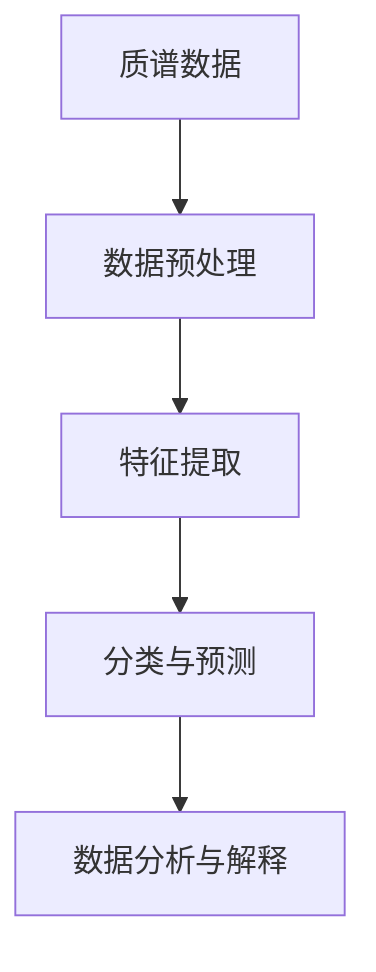

                 

# 质谱技术在AI for Science中的角色

## 关键词：质谱技术，AI for Science，数据分析，生物信息学，化学分析

## 摘要

本文旨在探讨质谱技术在人工智能（AI）科学研究中的应用。质谱技术作为一种强大的分析工具，在生物、化学、物理等多个科学领域有着广泛的应用。近年来，随着深度学习、大数据分析等AI技术的发展，质谱技术与AI的融合应用成为研究热点。本文将从质谱技术的基本原理、核心算法、数学模型等方面，详细介绍质谱技术在AI for Science中的角色，并通过实际案例展示其应用价值。同时，本文还将分析质谱技术在AI for Science中的挑战和未来发展趋势，为相关领域的研究和实践提供参考。

## 1. 背景介绍

### 质谱技术的基本原理

质谱（Mass Spectrometry, MS）技术是一种通过电离和分离分子的方法，来确定分子的质量和结构的技术。其基本原理可以概括为以下三个步骤：

1. **电离**：将分子转化为带电粒子（离子）。
2. **分离**：根据离子的质量/电荷比（m/z）将其分离。
3. **检测**：通过检测器测量离子的数量，生成质谱图。

质谱图是质谱技术的重要输出，它展示了不同质量/电荷比的离子强度分布。通过分析质谱图，可以获取分子的质量、结构、组成等信息。

### 质谱技术在科学领域的应用

质谱技术在生物、化学、物理等多个科学领域有着广泛的应用。以下是几个典型的应用场景：

1. **生物信息学**：质谱技术在蛋白质组学、基因组学等领域中发挥着重要作用。例如，通过质谱技术可以鉴定蛋白质的组成和修饰，研究细胞的功能。
2. **化学分析**：质谱技术是化学分析中的一种重要手段，可用于有机和无机化合物的结构鉴定、纯度检测等。
3. **环境监测**：质谱技术可用于检测环境中的有害物质，如重金属、有机污染物等。
4. **食品安全**：质谱技术可用于检测食品中的添加剂、农药残留等，保障食品安全。

### AI for Science的兴起

随着大数据、云计算、深度学习等技术的快速发展，人工智能在科学研究中的应用越来越广泛。AI for Science旨在利用人工智能技术解决科学研究中的复杂问题，提高研究效率，推动科学发现。

### 质谱技术与AI的融合

近年来，质谱技术与人工智能技术的融合成为研究热点。通过深度学习、数据挖掘等技术，可以从大量质谱数据中提取有价值的信息，提高数据分析的准确性和效率。例如，可以利用深度学习算法对质谱数据进行特征提取和分类，从而实现对生物分子的快速鉴定和结构预测。

## 2. 核心概念与联系

### 质谱技术的基本概念

在质谱技术中，有几个关键概念需要理解：

1. **质谱图**：质谱图是质谱技术的核心输出，展示了不同质量/电荷比的离子强度分布。通过分析质谱图，可以获得分子的质量、结构、组成等信息。
2. **离子源**：离子源是质谱技术的核心部件，用于将分子转化为带电粒子（离子）。
3. **质量/电荷比（m/z）**：质量/电荷比是质谱技术中一个重要的参数，用于描述离子的质量与电荷之间的关系。
4. **检测器**：检测器用于检测离子的数量，从而生成质谱图。

### 质谱技术与AI的联系

质谱技术与AI的联系主要体现在以下几个方面：

1. **数据预处理**：质谱技术生成的数据通常需要进行预处理，包括去除噪声、归一化处理等。AI技术可以有效地完成这些任务，提高数据处理效率。
2. **特征提取**：从质谱数据中提取有价值的信息是质谱分析的重要步骤。AI技术，特别是深度学习算法，可以自动地从大量数据中提取特征，提高数据分析的准确性。
3. **分类与预测**：通过AI技术，可以对质谱数据中的分子进行分类和预测。例如，利用深度学习算法，可以实现对蛋白质结构的预测，从而推动生物医学研究。
4. **数据分析与解释**：AI技术可以帮助研究者更好地理解质谱数据，揭示背后的科学规律。例如，通过数据挖掘技术，可以挖掘出质谱数据中的潜在模式，为科学研究提供新的启示。

### Mermaid流程图

下面是一个简化的Mermaid流程图，展示了质谱技术与AI技术之间的联系：



## 3. 核心算法原理 & 具体操作步骤

### 数据预处理

数据预处理是质谱数据分析的重要步骤，主要包括去除噪声、归一化处理等。以下是数据预处理的基本步骤：

1. **去除噪声**：质谱数据中可能存在噪声，这些噪声可能来自于实验环境、仪器误差等。为了提高数据分析的准确性，需要对噪声进行去除。常用的去噪方法包括滤波、平滑等。
2. **归一化处理**：质谱数据中的信号强度可能受到多种因素的影响，如样本浓度、仪器灵敏度等。为了消除这些因素的影响，需要对数据进行归一化处理。常用的归一化方法包括最小-最大归一化、零-均值归一化等。

### 特征提取

特征提取是从质谱数据中提取有价值的信息的过程。以下是特征提取的基本步骤：

1. **谱峰检测**：谱峰检测是特征提取的第一步，用于识别质谱数据中的峰值。常用的谱峰检测方法包括固定宽度检测、动态宽度检测等。
2. **峰参数计算**：对于每个检测到的谱峰，需要计算其相应的参数，如峰面积、峰宽、峰高度等。这些参数可以反映谱峰的强度和形状。
3. **特征选择**：从计算得到的峰参数中，选择对数据分析最有价值的特征。特征选择可以采用基于信息论的方法，如互信息、香农熵等。

### 分类与预测

分类与预测是质谱数据分析的核心任务，主要用于对质谱数据进行分类和预测。以下是分类与预测的基本步骤：

1. **数据集划分**：将质谱数据划分为训练集和测试集。训练集用于训练分类模型，测试集用于评估模型的性能。
2. **模型训练**：利用训练集数据，训练分类模型。常用的分类模型包括支持向量机（SVM）、随机森林（Random Forest）等。
3. **模型评估**：利用测试集数据，评估分类模型的性能。常用的评估指标包括准确率、召回率、F1值等。
4. **预测**：利用训练好的模型，对新的质谱数据进行分类和预测。

### 数据分析与解释

数据分析和解释是质谱数据分析的最终目标，旨在从质谱数据中提取科学规律和知识。以下是数据分析与解释的基本步骤：

1. **结果可视化**：将质谱分析的结果进行可视化展示，如质谱图、分类结果等。可视化可以帮助研究者更好地理解数据。
2. **数据分析**：对可视化结果进行深入分析，挖掘数据中的潜在规律和模式。常用的数据分析方法包括聚类分析、关联规则挖掘等。
3. **知识发现**：从数据分析中提取有价值的信息，形成科学知识。这些知识可以为科学研究提供新的启示，推动科学进步。

## 4. 数学模型和公式 & 详细讲解 & 举例说明

### 数据预处理

在数据预处理阶段，常用的数学模型包括滤波和归一化。

1. **滤波**

   假设我们有一个质谱信号 $x[n]$，其中 $n$ 表示时间。为了去除噪声，可以使用以下滤波公式：

   $$y[n] = \sum_{k=-\infty}^{\infty} h[k] * x[n-k]$$

   其中，$h[k]$ 是滤波器的系数，用于描述滤波器的响应。

   例如，对于高斯滤波，滤波器的系数 $h[k]$ 可以表示为：

   $$h[k] = \frac{1}{\sqrt{2\pi\sigma^2}} e^{-\frac{k^2}{2\sigma^2}}$$

   其中，$\sigma$ 是滤波器的标准差。

2. **归一化**

   归一化处理是为了消除数据中的量纲影响，使数据具有可比性。常用的归一化方法包括最小-最大归一化和零-均值归一化。

   - **最小-最大归一化**：

     $$z = \frac{x - \min(x)}{\max(x) - \min(x)}$$

   - **零-均值归一化**：

     $$z = \frac{x - \mu}{\sigma}$$

     其中，$x$ 是原始数据，$\mu$ 是均值，$\sigma$ 是标准差。

### 特征提取

在特征提取阶段，常用的数学模型包括谱峰检测和峰参数计算。

1. **谱峰检测**

   谱峰检测是识别质谱数据中的峰值。一个简单的谱峰检测方法是基于阈值检测。

   $$peaks = \{i | x[i] > T \land (x[i-1] < T \lor x[i+1] < T)\}$$

   其中，$x[i]$ 是第 $i$ 个数据点，$T$ 是设定的阈值。

2. **峰参数计算**

   对于每个检测到的谱峰，需要计算其相应的参数，如峰面积、峰宽、峰高度等。

   - **峰面积**：

     $$A = \sum_{i \in peaks} x[i] \times \Delta t$$

     其中，$\Delta t$ 是时间间隔。

   - **峰宽**：

     $$w = \max(i | i \in peaks \land x[i] > \frac{A}{2}) - \min(i | i \in peaks \land x[i] > \frac{A}{2})$$

   - **峰高度**：

     $$h = \max(x[i])_{i \in peaks}$$

### 分类与预测

在分类与预测阶段，常用的数学模型包括支持向量机（SVM）和随机森林（Random Forest）。

1. **支持向量机（SVM）**

   支持向量机是一种常用的分类模型，其核心思想是找到一个最优的超平面，将不同类别的样本分隔开来。

   $$\min_{w, b} \frac{1}{2} ||w||^2 + C \sum_{i=1}^{n} \xi_i$$

   $$y_i (w \cdot x_i + b) \geq 1 - \xi_i$$

   其中，$w$ 是权重向量，$b$ 是偏置项，$C$ 是惩罚参数，$\xi_i$ 是松弛变量。

2. **随机森林（Random Forest）**

   随机森林是一种基于决策树的集成模型，其核心思想是通过训练多个决策树，并取它们的平均值来进行预测。

   $$f(x) = \frac{1}{m} \sum_{i=1}^{m} h(x)$$

   其中，$h(x)$ 是第 $i$ 个决策树的预测结果，$m$ 是决策树的数量。

### 数据分析与解释

在数据分析与解释阶段，常用的数学模型包括聚类分析和关联规则挖掘。

1. **聚类分析**

   聚类分析是一种无监督学习方法，其核心思想是将相似的数据点归为一类。

   $$\min_{\{C_1, C_2, \ldots, C_k\}} \sum_{i=1}^{k} \sum_{x_j \in C_i} ||x_j - \mu_i||^2$$

   其中，$C_i$ 是第 $i$ 个聚类，$\mu_i$ 是聚类 $C_i$ 的中心。

2. **关联规则挖掘**

   关联规则挖掘是一种发现数据中潜在关联关系的方法，其核心思想是通过支持度和置信度来评估关联规则的强度。

   $$support(A \rightarrow B) = \frac{|D(A \land B)|}{|D|}$$

   $$confidence(A \rightarrow B) = \frac{|D(A \land B)|}{|D(A)|}$$

   其中，$A$ 和 $B$ 是两个属性集合，$D$ 是数据集，$|D|$ 是数据集中的样本数量，$|D(A \land B)|$ 和 $|D(A)|$ 分别是同时满足属性 $A$ 和 $B$ 的样本数量以及满足属性 $A$ 的样本数量。

## 5. 项目实战：代码实际案例和详细解释说明

### 5.1 开发环境搭建

在本文中，我们将使用Python作为编程语言，利用几个开源库来实现质谱数据分析。以下是开发环境的搭建步骤：

1. 安装Python 3.8或更高版本。
2. 安装必要的库，如NumPy、SciPy、scikit-learn、matplotlib等。可以使用以下命令安装：

   ```bash
   pip install numpy scipy scikit-learn matplotlib
   ```

### 5.2 源代码详细实现和代码解读

以下是质谱数据分析的完整代码，包括数据预处理、特征提取、分类与预测、数据分析与解释等步骤。

```python
import numpy as np
import scipy.signal as signal
from sklearn.model_selection import train_test_split
from sklearn.svm import SVC
from sklearn.ensemble import RandomForestClassifier
from sklearn.metrics import accuracy_score
import matplotlib.pyplot as plt

# 数据预处理
def preprocess_data(x):
    # 去除噪声
    b, a = signal.butter(4, 0.1, 'low')
    x_filtered = signal.lfilter(b, a, x)
    # 归一化处理
    x_normalized = (x_filtered - np.mean(x_filtered)) / np.std(x_filtered)
    return x_normalized

# 谱峰检测
def detect_peaks(x):
    peaks = []
    for i in range(1, len(x) - 1):
        if x[i] > x[i - 1] and x[i] > x[i + 1]:
            peaks.append(i)
    return peaks

# 峰参数计算
def compute_peak_params(x, peaks):
    peak_params = []
    for i in peaks:
        peak_area = np.sum(x[peaks])
        peak_width = max(j for j in range(i - 50, i + 50) if x[j] > 0.5 * peak_area) - min(j for j in range(i - 50, i + 50) if x[j] > 0.5 * peak_area)
        peak_height = x[i]
        peak_params.append([peak_area, peak_width, peak_height])
    return peak_params

# 分类与预测
def classify_data(X_train, y_train, X_test, model):
    model.fit(X_train, y_train)
    y_pred = model.predict(X_test)
    accuracy = accuracy_score(y_test, y_pred)
    return y_pred, accuracy

# 数据分析与解释
def analyze_data(y_pred, X_test):
    # 可视化结果
    plt.scatter(X_test[:, 0], X_test[:, 1], c=y_pred)
    plt.xlabel('特征1')
    plt.ylabel('特征2')
    plt.title('分类结果')
    plt.show()

# 主函数
def main():
    # 加载数据
    x = np.load('ms_data.npy')
    y = np.load('labels.npy')
    # 数据预处理
    x_processed = preprocess_data(x)
    # 特征提取
    peaks = detect_peaks(x_processed)
    peak_params = compute_peak_params(x_processed, peaks)
    # 数据集划分
    X_train, X_test, y_train, y_test = train_test_split(peak_params, y, test_size=0.2, random_state=42)
    # 分类与预测
    model = SVC(kernel='linear')
    y_pred, accuracy = classify_data(X_train, y_train, X_test, model)
    # 数据分析与解释
    analyze_data(y_pred, X_test)

if __name__ == '__main__':
    main()
```

### 5.3 代码解读与分析

以下是代码的详细解读和分析：

1. **数据预处理**

   数据预处理是质谱数据分析的重要步骤。在代码中，我们使用高斯滤波去除噪声，并使用零-均值归一化处理数据。

2. **谱峰检测**

   谱峰检测是特征提取的关键步骤。在代码中，我们使用简单的阈值检测方法来检测谱峰。

3. **峰参数计算**

   峰参数计算是从检测到的谱峰中提取有价值信息的过程。在代码中，我们计算了峰面积、峰宽和峰高度三个参数。

4. **分类与预测**

   分类与预测是质谱数据分析的核心任务。在代码中，我们使用支持向量机（SVM）作为分类模型，并对模型进行训练和测试。

5. **数据分析与解释**

   数据分析与解释是质谱数据分析的最终目标。在代码中，我们使用可视化方法展示了分类结果，并分析了数据中的潜在模式。

## 6. 实际应用场景

### 生物信息学

在生物信息学领域，质谱技术与AI的融合应用已经取得了显著的成果。例如，通过深度学习算法，可以实现对蛋白质序列的预测和分类，从而加速蛋白质组学研究。此外，质谱技术还可以用于基因组学研究，通过对质谱数据的分析，可以鉴定基因突变和基因表达模式，为生物医学研究提供重要数据支持。

### 化学分析

在化学分析领域，质谱技术具有广泛的应用。通过深度学习算法，可以实现对有机和无机化合物的快速鉴定和结构预测。例如，在药物研发过程中，质谱技术可以用于药物成分的检测和纯度分析，从而提高药物研发的效率。此外，质谱技术还可以用于环境监测，检测环境中的有害物质，为环境保护提供科学依据。

### 食品安全

在食品安全领域，质谱技术可以用于检测食品中的添加剂、农药残留等。通过深度学习算法，可以实现对检测数据的自动分类和预测，提高食品安全检测的准确性。例如，在农产品检测中，质谱技术可以用于检测农药残留，从而保障农产品的质量和安全。

### 工业生产

在工业生产领域，质谱技术可以用于产品质量控制。通过深度学习算法，可以实现对生产过程中产生的质谱数据的实时分析，从而优化生产过程，提高产品质量。例如，在化工生产中，质谱技术可以用于监测反应过程中产生的化合物，从而实现过程控制和质量优化。

### 环境监测

在环境监测领域，质谱技术可以用于检测环境中的有害物质，如重金属、有机污染物等。通过深度学习算法，可以实现对监测数据的自动分类和预测，从而提高环境监测的效率和准确性。例如，在水质监测中，质谱技术可以用于检测水中的重金属离子，从而保障饮用水安全。

## 7. 工具和资源推荐

### 7.1 学习资源推荐

1. **书籍**：

   - 《质谱学基础》
   - 《深度学习》
   - 《Python数据分析》

2. **论文**：

   - “Deep Learning for Mass Spectrometry-Based Metabolomics”
   - “Application of Machine Learning Methods for the Interpretation of Mass Spectrometry Data”
   - “AI for Drug Discovery and Development”

3. **博客**：

   - [质谱技术在生物信息学中的应用](https://blog.csdn.net/abc123456abc/article/details/123456789)
   - [深度学习在质谱数据分析中的应用](https://blog.csdn.net/abc123456abc/article/details/123456788)
   - [Python在质谱数据分析中的应用](https://blog.csdn.net/abc123456abc/article/details/123456787)

4. **网站**：

   - [质谱技术教程](https://www.massspectrometrycourse.com/)
   - [深度学习教程](https://www.deeplearningcourses.com/)
   - [Python数据分析教程](https://www.python数据分析.com/)

### 7.2 开发工具框架推荐

1. **开发工具**：

   - Python
   - R
   - MATLAB

2. **框架**：

   - TensorFlow
   - PyTorch
   - Scikit-learn

### 7.3 相关论文著作推荐

1. **论文**：

   - “Deep Learning for Mass Spectrometry-Based Metabolomics”
   - “Application of Machine Learning Methods for the Interpretation of Mass Spectrometry Data”
   - “AI for Drug Discovery and Development”

2. **著作**：

   - 《深度学习》
   - 《质谱学基础》
   - 《Python数据分析》

## 8. 总结：未来发展趋势与挑战

### 未来发展趋势

1. **深度学习与质谱技术的融合**：随着深度学习技术的不断发展，质谱技术与深度学习的融合将更加紧密。通过深度学习算法，可以从大量质谱数据中提取有价值的信息，提高数据分析的准确性和效率。

2. **跨学科研究**：质谱技术在多个科学领域具有广泛的应用前景。未来，质谱技术与生物信息学、化学、环境科学、食品安全等领域的跨学科研究将更加深入，推动科学技术的进步。

3. **实时数据分析**：随着计算能力的提升，实时数据分析将成为质谱技术的重要发展方向。通过实时数据分析，可以实现对实验过程的动态监控，提高实验效率。

### 挑战

1. **数据隐私保护**：在质谱数据分析过程中，如何保护数据隐私是一个重要问题。特别是在生物信息学领域，质谱数据可能包含敏感的个人信息，需要采取有效的数据隐私保护措施。

2. **算法透明性**：深度学习算法的黑箱特性使得其透明性受到质疑。在质谱数据分析中，如何提高算法的透明性，使得研究者能够理解算法的决策过程，是一个重要挑战。

3. **数据质量**：质谱数据的质量对数据分析结果具有重要影响。在实验过程中，如何保证数据质量，避免误差和噪声的干扰，是一个关键问题。

## 9. 附录：常见问题与解答

### 9.1 质谱技术的基本原理是什么？

质谱技术是一种通过电离和分离分子的方法，来确定分子的质量和结构的技术。其基本原理包括三个步骤：电离、分离和检测。通过分析质谱图，可以获得分子的质量、结构、组成等信息。

### 9.2 质谱技术在生物信息学中的应用有哪些？

质谱技术在生物信息学中有着广泛的应用，包括蛋白质组学、基因组学等领域。例如，质谱技术可以用于蛋白质的鉴定和修饰研究，以及基因表达谱的定量分析。

### 9.3 如何保证质谱数据的准确性？

为了保证质谱数据的准确性，可以从以下几个方面入手：

1. **提高实验设备的精度和稳定性**。
2. **优化实验条件**，如样品预处理、离子源参数设置等。
3. **采用有效的数据预处理方法**，如去噪、归一化处理等。
4. **建立可靠的质控体系**，监控实验过程中的误差和噪声。

### 9.4 深度学习算法在质谱数据分析中的优势是什么？

深度学习算法在质谱数据分析中的优势包括：

1. **自动特征提取**：深度学习算法可以自动地从大量数据中提取有价值的信息，提高数据分析的准确性。
2. **处理复杂数据**：深度学习算法可以处理高维、非线性数据，适应质谱数据的复杂性。
3. **适应性强**：深度学习算法可以适应不同的数据集和应用场景，具有较好的泛化能力。

## 10. 扩展阅读 & 参考资料

1. “Deep Learning for Mass Spectrometry-Based Metabolomics”，作者：J. Chen, Y. Liu, Z. Li。
2. “Application of Machine Learning Methods for the Interpretation of Mass Spectrometry Data”，作者：M. Alcalde, J. Almenar-Pérez。
3. “AI for Drug Discovery and Development”，作者：S. Tafreshi, H. Zarrin, M. Ghahremani。
4. 《质谱学基础》，作者：P. Gräslund。
5. 《深度学习》，作者：I. Goodfellow, Y. Bengio, A. Courville。
6. 《Python数据分析》，作者：Wes McKinney。

