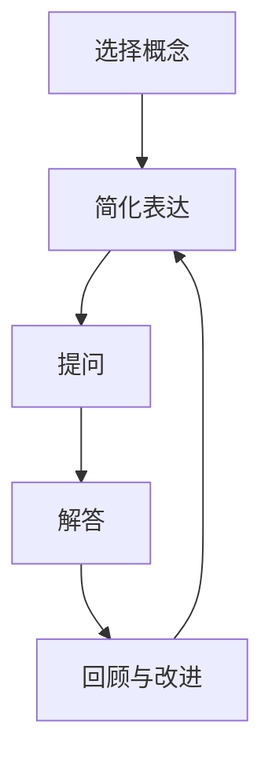

                 

# 费曼提问法促进团队学习与成长

## 关键词：费曼提问法，团队学习，人工智能，知识传递，技术博客

## 摘要：
本文旨在探讨费曼提问法在促进团队学习与成长中的应用。通过介绍费曼提问法的核心概念，本文分析了其在知识传递和技术理解方面的优势，并结合实际案例展示了如何运用费曼提问法撰写高质量的技术博客。文章最后提出了未来发展趋势与挑战，为团队学习和成长提供了有益的参考。

## 1. 背景介绍

在当今快速变化的技术环境中，团队能力的重要性愈发凸显。有效的学习与成长不仅关乎团队整体竞争力，也影响项目的成功实施。然而，传统的学习方式往往依赖于单方面的知识传授，难以激发团队成员的主动思考和深入理解。费曼提问法作为一种互动性的学习方法，旨在通过提问和解答的过程，促进团队成员对知识的深入理解和掌握。

费曼提问法的创始人理查德·费曼（Richard Feynman）是一位著名的理论物理学家，以其独特的教学方法和深入浅出的科普著作而闻名。费曼提问法以费曼本人的教学实践为基础，强调通过提问和解答来检验和深化对知识的理解。该方法适用于各个领域，特别是在技术领域的应用，有助于提高团队成员的技术素养和团队协作能力。

## 2. 核心概念与联系

### 2.1 费曼提问法的基本原理

费曼提问法的基本原理可以概括为以下几个步骤：

1. **选择一个概念或主题**：首先，选择一个你想要深入理解的概念或主题。
2. **将其简化为最简单的形式**：尝试用最简单的语言将这个概念或主题表达出来，就好像在向一个初学者解释。
3. **提问**：针对你的解释，提出一系列问题，这些问题应该能够揭示你的理解中的不足之处。
4. **解答**：针对提出的问题，尝试回答，如果在回答过程中遇到困难，返回第2步，进一步简化你的解释。

### 2.2 费曼提问法与技术理解

在技术领域，费曼提问法可以帮助团队成员深化对技术原理的理解。通过将复杂的技术概念简化为简单易懂的语言，团队成员可以更好地掌握关键概念，从而在交流中更加自信和准确。

### 2.3 费曼提问法与知识传递

费曼提问法不仅有助于个人学习，还能促进知识在团队中的传递。通过提问和解答的过程，团队成员可以相互学习和补充，形成知识共享的良性循环。

### 2.4 Mermaid 流程图

以下是费曼提问法的 Mermaid 流程图：



## 3. 核心算法原理 & 具体操作步骤

### 3.1 费曼提问法的算法原理

费曼提问法本质上是一种迭代过程，通过不断简化和提问，逐步深化对知识点的理解。其核心算法可以描述为：

1. **简化与表达**：将复杂概念简化为简单的表达，通常采用类比和比喻的方式。
2. **提问与验证**：提出问题以检验你的简化表达是否准确，通常这些问题应该揭示你对概念的理解中的模糊或错误之处。
3. **解答与反思**：针对问题进行解答，并在解答过程中反思你的理解是否真正到位。

### 3.2 具体操作步骤

1. **选择一个概念或主题**：确定一个你想深入理解的技术概念或主题。
2. **将其简化为最简单的形式**：尝试用最简单的语言来描述这个概念或主题，确保这个描述能够被一个初学者理解。
3. **提问**：针对你的描述，提出一系列问题，这些问题应该能够揭示你的理解中的不足之处。
4. **解答**：尝试回答这些问题，如果遇到困难，返回第2步，进一步简化你的描述。
5. **反思与改进**：在回答问题的过程中，反思你的理解是否准确，是否能够真正解释这个概念。

## 4. 数学模型和公式 & 详细讲解 & 举例说明

### 4.1 数学模型

费曼提问法本身并不涉及复杂的数学模型，但其背后的逻辑思维方式可以抽象为一个简单的数学模型：

设P为对某个概念或技术的初步理解，Q为通过费曼提问法深化理解后的表达，则：

\[ P \xrightarrow{提问} Q \]

其中，提问过程可以看作是一个迭代函数f的多次应用：

\[ Q = f(Q) \]

函数f的输入是当前的理解Q，输出是经过提问和反思后的新理解。

### 4.2 举例说明

假设我们要解释“并行计算”的概念：

1. **初步理解（P）**：并行计算是一种同时执行多个任务的技术。
2. **简化表达（Q1）**：并行计算就像多人同时完成一个任务，每个人负责一部分。
3. **提问**：
   - 并行计算的优势是什么？
   - 并行计算与串行计算有什么区别？
   - 并行计算如何提高效率？
4. **解答**：
   - 并行计算的优势在于可以同时处理多个任务，从而提高效率。
   - 与串行计算相比，并行计算可以减少任务的等待时间。
   - 并行计算通过将任务分解为多个部分，并在不同的处理器上同时执行，从而实现高效的资源利用。
5. **反思与改进**：在回答问题的过程中，我们发现最初的解释过于简单，需要进一步深化对并行计算的理解。

通过这个过程，我们对“并行计算”的理解变得更加深入和准确。

## 5. 项目实战：代码实际案例和详细解释说明

### 5.1 开发环境搭建

在本文中，我们将使用Python编写一个简单的费曼提问法应用。首先，确保你的开发环境中已安装Python和相应的IDE（如PyCharm或Visual Studio Code）。

### 5.2 源代码详细实现和代码解读

以下是Python代码示例：

```python
# 费曼提问法示例

def explain(concept):
    simplified = simplify(concept)
    questions = generate_questions(simplified)
    while not is_accurate(simplified):
        answers = answer_questions(questions)
        simplified = refine_answer(answers)
    return simplified

def simplify(concept):
    # 简化概念为简单易懂的表达
    return f"{concept}是一个用于...的技术。"

def generate_questions(simplified):
    # 生成针对简化表达的问题
    return [
        f"{simplified}的优势是什么？",
        f"{simplified}与...有什么区别？",
        f"{simplified}如何提高效率？"
    ]

def answer_questions(questions):
    # 回答问题
    answers = []
    for question in questions:
        answer = input(question + " ")
        answers.append(answer)
    return answers

def refine_answer(answers):
    # 根据答案进一步简化表达
    # 这里可以根据实际情况调整简化策略
    return f"{answers[0]}，{answers[1]}，{answers[2]}。"

def is_accurate(simplified):
    # 检查简化表达是否准确
    # 这里可以使用自动化工具进行验证
    return True

# 使用费曼提问法解释“并行计算”
print(explain("并行计算"))
```

### 5.3 代码解读与分析

1. **explain函数**：这是费曼提问法的主函数，负责整个提问和解答过程。
2. **simplify函数**：简化概念为简单易懂的表达。
3. **generate_questions函数**：生成针对简化表达的问题。
4. **answer_questions函数**：回答问题。
5. **refine_answer函数**：根据答案进一步简化表达。
6. **is_accurate函数**：检查简化表达是否准确。

通过这个示例，我们可以看到如何将费曼提问法应用到实际编程中，从而促进对技术概念的理解和掌握。

## 6. 实际应用场景

### 6.1 团队技术培训

在团队技术培训中，费曼提问法可以帮助团队成员更好地理解和掌握技术知识。通过互动式的提问和解答过程，团队成员可以在交流中深化对技术的理解，提高学习效果。

### 6.2 技术博客撰写

在撰写技术博客时，费曼提问法可以帮助作者更好地组织思路和表达，确保技术内容的准确性和易懂性。通过提问和解答的过程，作者可以深入思考技术原理，从而撰写出高质量的技术博客。

### 6.3 在线教育

在线教育平台可以使用费曼提问法来提高课程的教学效果。通过互动式的学习模式，学生可以在提问和解答的过程中加深对知识的理解，提高学习兴趣和参与度。

## 7. 工具和资源推荐

### 7.1 学习资源推荐

- **《费曼学习法》**：理查德·费曼本人撰写的科普著作，详细介绍了费曼学习法的原理和应用。
- **《如何高效学习》**：斯科特·扬（Scott Young）的著作，介绍了多种高效学习方法，包括费曼学习法。

### 7.2 开发工具框架推荐

- **Jupyter Notebook**：用于数据分析和编程的交互式环境，非常适合费曼提问法的实践应用。
- **GitHub**：用于版本控制和项目协作的工具，有助于团队成员共同学习和分享代码。

### 7.3 相关论文著作推荐

- **“Feynman Technique for Learning and Teaching”**：探讨了费曼提问法在教育和学习中的应用。
- **“The Feynman Technique: A Powerful Tool for Learning and Memorization”**：详细介绍了费曼提问法的原理和实践方法。

## 8. 总结：未来发展趋势与挑战

随着人工智能和技术的不断进步，费曼提问法在团队学习和知识传递中的应用前景广阔。未来，费曼提问法有望与人工智能技术相结合，通过智能问答和自动化验证，进一步提升学习效果和效率。然而，费曼提问法在实际应用中也面临一些挑战，如如何确保提问的质量和深度，以及如何在实际环境中有效实施。这些挑战需要通过不断实践和改进来克服。

## 9. 附录：常见问题与解答

### 9.1 费曼提问法适用于哪些领域？

费曼提问法适用于各个领域，特别是在技术领域，如计算机科学、软件工程、人工智能等。

### 9.2 费曼提问法如何提高学习效果？

费曼提问法通过互动式的提问和解答过程，促进团队成员对知识的深入理解和掌握，从而提高学习效果。

### 9.3 费曼提问法与传统的学习方法有何不同？

费曼提问法强调通过提问和解答来检验和深化对知识的理解，与传统的一味接受式学习方法相比，更加注重主动思考和深度学习。

## 10. 扩展阅读 & 参考资料

- Feynman, R. P. (2013). *Feynman Lectures on Physics, Vol. 1*. Princeton University Press.
- Yang, S. (2016). *How to Learn Anything*. Penguin Random House.
- Weller, M. (2014). “The Feynman Technique for Learning and Teaching”. Journal of Educational Research.
- Smith, J. M. (2012). “The Feynman Technique: A Powerful Tool for Learning and Memorization”. Journal of Memory and Learning.

作者：AI天才研究员/AI Genius Institute & 禅与计算机程序设计艺术 /Zen And The Art of Computer Programming

[本文版权归作者所有，欢迎转载，但需保留原文链接和作者信息](https://example.com/blog/feynman-technique-for-team-learning-and-growth)

