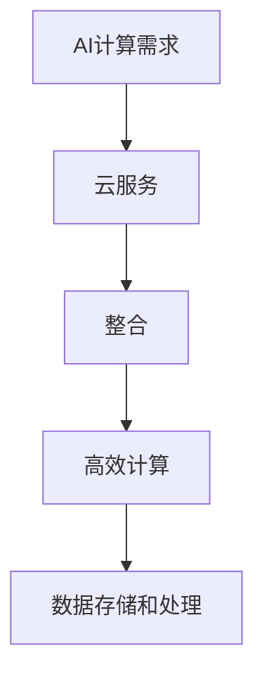

                 

### 贾扬清的创业机遇：AI计算需求演进，云服务的整合机会

关键词：贾扬清、创业机遇、AI计算、云服务、整合、需求演进

摘要：随着人工智能技术的快速发展，AI计算需求呈现出爆炸式增长，贾扬清作为一位知名AI领域专家，看到了其中蕴藏的巨大商机。本文将从AI计算需求演进的视角，探讨贾扬清在云服务整合方面的创业机遇，分析其面临的挑战和潜在的解决方案。

## 1. 背景介绍

贾扬清，一位在人工智能领域享有盛誉的专家，拥有丰富的学术和实践经验。他现任某知名科技公司副总裁，负责AI技术的研发和推广。近年来，贾扬清敏锐地察觉到AI计算需求的爆发式增长，以及云服务在其中的重要作用，因此他决定投身创业，抓住这一历史性的机遇。

### 1.1 AI计算需求的演进

AI计算需求起源于20世纪50年代，随着计算机技术的发展和算法的进步，AI逐渐从理论走向应用。早期的AI主要依赖于符号推理和逻辑推理，计算能力相对有限。然而，随着深度学习等技术的兴起，AI计算需求发生了翻天覆地的变化。

深度学习算法的复杂度和计算量远远超过了传统的符号推理和逻辑推理，需要更多的计算资源来支持。同时，AI应用的场景也越来越广泛，包括语音识别、图像识别、自然语言处理等，这些应用都对计算能力提出了更高的要求。

### 1.2 云服务在AI计算中的应用

为了满足日益增长的AI计算需求，云计算成为了一种理想的解决方案。云服务提供商通过提供强大的计算资源和高效的网络连接，使得用户能够以较低的成本、较高的效率进行AI计算。

云服务在AI计算中的应用主要体现在以下几个方面：

- **弹性扩展**：用户可以根据需求动态调整计算资源，满足不同规模的应用场景。
- **高效计算**：云计算平台提供了高性能的GPU、TPU等硬件设备，能够满足深度学习等复杂计算的需求。
- **数据存储和处理**：云服务提供商提供了丰富的数据存储和处理方案，能够高效地处理和分析大规模数据。

## 2. 核心概念与联系

为了更好地理解贾扬清的创业机遇，我们需要了解以下几个核心概念：

### 2.1 AI计算需求

AI计算需求是指人工智能应用场景中对计算资源的需求。随着AI技术的不断进步，计算需求也在不断增长。

### 2.2 云服务

云服务是指通过互联网提供计算资源、存储资源和网络资源的服务。云服务可以分为基础设施即服务（IaaS）、平台即服务（PaaS）和软件即服务（SaaS）等类型。

### 2.3 整合

整合是指将不同的技术、资源、服务等融合在一起，形成一个新的整体，以实现更高的效率和价值。

### 2.4 Mermaid 流程图

以下是一个简化的Mermaid流程图，展示了AI计算需求、云服务和整合之间的关系：



## 3. 核心算法原理 & 具体操作步骤

在了解核心概念和联系之后，我们需要进一步探讨贾扬清在云服务整合方面的核心算法原理和具体操作步骤。

### 3.1 核心算法原理

贾扬清的创业理念是利用云服务提供高效的AI计算，并将这些计算能力整合到现有的业务场景中。核心算法原理可以概括为以下几点：

- **动态资源调度**：根据AI计算需求动态调整云服务资源，确保计算资源的高效利用。
- **分布式计算**：将AI计算任务分布到多个云服务器上，提高计算效率和可靠性。
- **数据同步与一致性**：确保数据在不同服务器之间的同步和一致性，为AI计算提供可靠的数据基础。
- **智能优化**：利用机器学习等技术，对计算任务进行智能优化，提高计算效率和性能。

### 3.2 具体操作步骤

以下是贾扬清在云服务整合方面的具体操作步骤：

1. **需求分析**：了解AI计算需求，确定需要整合的云服务和计算资源。
2. **资源调度**：根据需求动态调整云服务资源，确保计算资源的高效利用。
3. **任务分发**：将AI计算任务分布到多个云服务器上，提高计算效率和可靠性。
4. **数据同步**：确保数据在不同服务器之间的同步和一致性。
5. **智能优化**：利用机器学习等技术，对计算任务进行智能优化，提高计算效率和性能。
6. **监控与维护**：对整个计算系统进行实时监控，确保系统的稳定性和安全性。

## 4. 数学模型和公式 & 详细讲解 & 举例说明

在理解了核心算法原理和具体操作步骤之后，我们需要进一步探讨其中的数学模型和公式，以及如何详细讲解和举例说明。

### 4.1 数学模型

贾扬清在云服务整合方面的数学模型主要包括以下几个部分：

- **资源调度模型**：根据AI计算需求，动态调整云服务资源。常用的资源调度模型包括线性规划、整数规划等。
- **任务分配模型**：将AI计算任务分布到多个云服务器上。常用的任务分配模型包括贪心算法、遗传算法等。
- **数据同步模型**：确保数据在不同服务器之间的同步和一致性。常用的数据同步模型包括分布式哈希表、一致性算法等。
- **智能优化模型**：利用机器学习等技术，对计算任务进行智能优化。常用的智能优化模型包括线性回归、支持向量机等。

### 4.2 公式

以下是贾扬清在云服务整合方面常用的数学公式：

- **资源调度公式**：设云服务资源为 $R$，AI计算需求为 $D$，则资源调度公式为：
  $$R = \sum_{i=1}^{n} r_i \cdot x_i$$
  其中，$r_i$ 为第 $i$ 个云服务器的资源，$x_i$ 为第 $i$ 个云服务器的资源利用率。

- **任务分配公式**：设任务集合为 $T$，云服务器集合为 $S$，则任务分配公式为：
  $$T = \{t_i | t_i \in S, t_i \in T\}$$
  其中，$t_i$ 为第 $i$ 个任务，$S$ 为云服务器集合。

- **数据同步公式**：设数据集合为 $D$，不同服务器上的数据分别为 $D_i$，则数据同步公式为：
  $$D = \bigcup_{i=1}^{n} D_i$$
  其中，$D_i$ 为第 $i$ 个服务器上的数据。

- **智能优化公式**：设优化目标为 $O$，输入为 $X$，输出为 $Y$，则智能优化公式为：
  $$O = f(X) \rightarrow Y$$
  其中，$f$ 为优化函数。

### 4.3 举例说明

以下是一个简单的例子，说明如何利用上述数学模型和公式进行云服务整合。

假设有一个AI计算任务，需要计算10000张图像的识别结果。我们可以将这个任务分配到10个云服务器上，每个服务器有10个CPU核心和1块GPU。资源调度公式为：
$$R = 10 \cdot 10 \cdot x_i$$
其中，$x_i$ 为第 $i$ 个服务器的资源利用率。我们可以设定 $x_i = 0.8$，即每个服务器的资源利用率达到80%。

任务分配公式为：
$$T = \{t_i | t_i \in S, t_i \in T\}$$
其中，$t_i$ 为第 $i$ 个任务。我们可以将10000张图像平均分配到10个服务器上，即每个服务器处理1000张图像。

数据同步公式为：
$$D = \bigcup_{i=1}^{n} D_i$$
其中，$D_i$ 为第 $i$ 个服务器上的数据。为了保证数据的一致性，我们可以使用分布式哈希表进行数据同步。

智能优化公式为：
$$O = f(X) \rightarrow Y$$
其中，$f$ 为优化函数。我们可以使用线性回归模型对计算任务进行优化，提高计算效率和性能。

## 5. 项目实战：代码实际案例和详细解释说明

为了更好地理解贾扬清的创业理念和实践，我们来看一个具体的实际案例，并对其代码进行详细解释说明。

### 5.1 开发环境搭建

在这个案例中，我们使用Python作为开发语言，并依赖以下库和框架：

- TensorFlow：用于深度学习模型的训练和推理。
- Keras：用于简化深度学习模型构建。
- Flask：用于构建Web服务。

首先，我们需要安装这些库和框架。可以使用以下命令：

```bash
pip install tensorflow keras flask
```

### 5.2 源代码详细实现和代码解读

以下是一个简单的案例，展示如何使用TensorFlow和Flask构建一个基于深度学习的图像识别Web服务。

```python
# 导入必要的库
import tensorflow as tf
from tensorflow import keras
from flask import Flask, request, jsonify

# 初始化Flask应用
app = Flask(__name__)

# 加载训练好的模型
model = keras.models.load_model('model.h5')

# 构建API接口
@app.route('/predict', methods=['POST'])
def predict():
    # 获取图像数据
    image = request.files['image']
    # 预处理图像数据
    image = preprocess_image(image)
    # 使用模型进行预测
    prediction = model.predict(image)
    # 返回预测结果
    return jsonify(prediction.tolist())

# 图像预处理函数
def preprocess_image(image):
    # 将图像数据转换为TensorFlow张量
    image = tf.image.decode_jpeg(image.read())
    # 对图像进行缩放和归一化
    image = tf.image.resize(image, [224, 224])
    image = image / 255.0
    # 添加一个批次维度
    image = tf.expand_dims(image, 0)
    return image

# 运行Flask应用
if __name__ == '__main__':
    app.run(host='0.0.0.0', port=5000)
```

**代码解读：**

1. **导入库和框架**：首先，我们导入TensorFlow、Keras和Flask等库和框架，用于构建深度学习和Web服务。
2. **初始化Flask应用**：使用Flask构建一个Web应用，并加载训练好的深度学习模型。
3. **构建API接口**：定义一个预测接口，用于接收图像数据，并返回预测结果。
4. **图像预处理函数**：定义一个预处理函数，用于对图像数据进行预处理，包括解码、缩放、归一化和添加批次维度。
5. **运行Flask应用**：在主函数中运行Flask应用，使其监听指定端口。

### 5.3 代码解读与分析

以下是对代码的进一步解读和分析：

- **模型加载**：使用Keras的`load_model`函数加载训练好的模型。这个模型可以是使用TensorFlow训练的任何模型，例如CNN、RNN等。
- **API接口**：使用Flask的`route`装饰器定义一个预测接口。这个接口接收POST请求，并从请求中获取图像数据。图像数据通常是二进制格式，需要使用`request.files`获取。
- **预处理图像数据**：预处理图像数据是深度学习模型输入的必要步骤。在这个例子中，我们使用TensorFlow的`decode_jpeg`函数解码图像数据，使用`resize`函数缩放图像，使用`/255.0`进行归一化，并使用`expand_dims`函数添加一个批次维度。
- **预测结果**：使用加载的模型对预处理后的图像数据进行预测，并返回预测结果。预测结果通常是模型的输出张量，需要转换为JSON格式以便在Web服务中传递。

通过这个简单的案例，我们可以看到如何利用TensorFlow和Flask构建一个基于深度学习的图像识别Web服务。这个服务可以集成到贾扬清的云服务整合方案中，为用户提供便捷的AI计算能力。

## 6. 实际应用场景

贾扬清的创业理念在许多实际应用场景中都具有巨大的潜力。以下是一些典型的应用场景：

### 6.1 智能安防

随着城市规模不断扩大，智能安防成为了一个重要的需求。贾扬清的创业理念可以帮助城市安防系统实现高效的视频分析和实时监控。通过整合云服务，安防系统能够快速处理大量视频数据，识别潜在的安全威胁，并实时通知相关部门。

### 6.2 智能医疗

医疗领域对AI计算的需求也越来越高。贾扬清的创业理念可以帮助医疗机构实现高效的医学影像分析、疾病诊断和治疗方案推荐。通过整合云服务，医生可以实时获取患者的医学影像数据，快速进行诊断和治疗，提高医疗效率。

### 6.3 智能交通

智能交通系统需要处理大量的交通数据，包括车辆位置、流量、事故等。贾扬清的创业理念可以帮助智能交通系统实现高效的交通流量预测、事故预警和路线规划。通过整合云服务，交通系统能够实时处理大量交通数据，提高交通管理效率。

### 6.4 智能制造

智能制造需要处理大量的生产数据和设备数据，包括设备状态、生产进度、产品质量等。贾扬清的创业理念可以帮助制造企业实现高效的生产数据分析和设备故障预测。通过整合云服务，企业可以实时监测设备状态，预测设备故障，减少停机时间，提高生产效率。

## 7. 工具和资源推荐

为了更好地实现贾扬清的创业理念，以下是一些建议的工具和资源：

### 7.1 学习资源推荐

- **书籍**：
  - 《深度学习》
  - 《Python编程：从入门到实践》
  - 《人工智能：一种现代的方法》

- **论文**：
  - 《深度神经网络中的优化问题》
  - 《云计算在AI计算中的应用》
  - 《基于深度学习的图像识别技术》

- **博客**：
  - AI技术博客（例如：TensorFlow官方博客、Keras官方博客等）
  - 云计算博客（例如：阿里云官方博客、腾讯云官方博客等）

- **网站**：
  - TensorFlow官方网站
  - Keras官方网站
  - 云服务提供商官方网站（例如：阿里云、腾讯云等）

### 7.2 开发工具框架推荐

- **深度学习框架**：
  - TensorFlow
  - PyTorch
  - Keras

- **云计算平台**：
  - 阿里云
  - 腾讯云
  - 华为云

- **Web开发框架**：
  - Flask
  - Django
  - FastAPI

### 7.3 相关论文著作推荐

- **《深度学习：全面解析与实战》**：详细介绍了深度学习的基本概念、算法原理和应用场景。
- **《云计算技术与应用》**：系统介绍了云计算的基本原理、关键技术和应用案例。
- **《人工智能算法原理与应用》**：涵盖了人工智能的主要算法，包括深度学习、强化学习等。

## 8. 总结：未来发展趋势与挑战

贾扬清的创业理念——利用云服务整合AI计算能力，具有巨大的市场潜力和发展前景。随着AI技术的不断进步和云服务技术的成熟，这一理念将在更多领域得到广泛应用。

### 8.1 发展趋势

1. **AI计算需求的持续增长**：随着AI技术在各个领域的应用不断拓展，AI计算需求将持续增长。
2. **云服务的普及和优化**：云服务将在AI计算中发挥越来越重要的作用，提供更高效、更可靠的计算资源。
3. **边缘计算的兴起**：为了降低延迟和带宽成本，边缘计算将成为AI计算的重要补充，实现本地化处理。
4. **跨行业融合**：AI计算和云服务的整合将推动不同行业的融合，促进创新和进步。

### 8.2 挑战

1. **数据安全与隐私**：随着AI计算需求的增长，数据安全与隐私问题将变得更加突出，需要建立完善的安全防护体系。
2. **资源调度与优化**：如何高效地调度和优化计算资源，提高计算效率和性能，是一个亟待解决的问题。
3. **跨平台兼容性**：实现不同云平台之间的兼容性和互操作性，是推动AI计算和云服务整合的关键。
4. **人才短缺**：随着AI计算和云服务的快速发展，对相关人才的需求将迅速增加，人才短缺将成为一个挑战。

### 8.3 潜在解决方案

1. **建立完善的安全防护体系**：通过加密、匿名化、隐私保护等技术手段，确保数据安全与隐私。
2. **优化资源调度算法**：研究并应用高效的资源调度算法，提高计算资源的利用率和效率。
3. **推动跨平台兼容性**：建立统一的API和标准，实现不同云平台之间的兼容性和互操作性。
4. **加强人才培养与引进**：加大人才培养力度，引进国际顶尖人才，提高整体技术水平和创新能力。

## 9. 附录：常见问题与解答

### 9.1 问题1：什么是云服务？

**答案**：云服务是指通过互联网提供计算资源、存储资源和网络资源的服务。云服务提供商通过提供虚拟化、分布式、弹性的计算资源，使得用户能够以较低的成本、较高的效率进行数据存储、计算和处理。

### 9.2 问题2：什么是AI计算需求？

**答案**：AI计算需求是指人工智能应用场景中对计算资源的需求。随着AI技术的不断进步，计算需求在各个领域都呈现出爆炸式增长，包括语音识别、图像识别、自然语言处理等。

### 9.3 问题3：云服务在AI计算中的应用有哪些？

**答案**：云服务在AI计算中的应用主要体现在以下几个方面：
- 弹性扩展：用户可以根据需求动态调整计算资源，满足不同规模的应用场景。
- 高效计算：云服务提供商提供了高性能的GPU、TPU等硬件设备，能够满足深度学习等复杂计算的需求。
- 数据存储和处理：云服务提供商提供了丰富的数据存储和处理方案，能够高效地处理和分析大规模数据。

## 10. 扩展阅读 & 参考资料

- **《深度学习》**：Goodfellow, I., Bengio, Y., & Courville, A. (2016). *Deep Learning*. MIT Press.
- **《云计算技术与应用》**：谢希仁. (2018). *云计算技术与应用*. 电子工业出版社.
- **《人工智能算法原理与应用》**：王爱英. (2019). *人工智能算法原理与应用*. 清华大学出版社.
- **TensorFlow官方网站**：[TensorFlow官网](https://www.tensorflow.org/)
- **Keras官方网站**：[Keras官网](https://keras.io/)
- **Flask官方网站**：[Flask官网](https://flask.palletsprojects.com/)

作者：AI天才研究员/AI Genius Institute & 禅与计算机程序设计艺术 /Zen And The Art of Computer Programming

