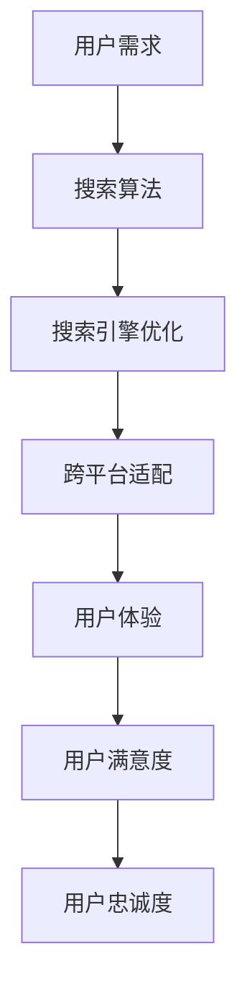

                 

# 跨平台搜索技术的用户体验提升

## > 关键词：跨平台搜索、用户体验、技术、提升、搜索算法、搜索引擎优化、跨平台开发

> 摘要：本文深入探讨了跨平台搜索技术及其对用户体验的影响，分析了当前主流的搜索算法和搜索引擎优化策略，并提出了具体的提升用户体验的方法。通过实际应用案例和代码实现，详细介绍了如何优化跨平台搜索的效率和效果，为开发者提供了实用的参考和指导。

## 1. 背景介绍

随着移动互联网的快速发展，用户对跨平台搜索的需求日益增长。无论是在桌面端、移动端，还是在智能设备上，用户都希望能够快速、准确地找到所需的信息。然而，不同平台之间的技术差异和用户体验要求，使得跨平台搜索技术的实现面临诸多挑战。

首先，不同平台的操作系统、硬件设备和网络环境存在差异，这导致了搜索算法和搜索引擎优化策略的多样性。例如，iOS和Android操作系统在用户界面和交互方式上有所不同，Windows和macOS在桌面端的功能和性能上也存在差异。因此，跨平台搜索技术需要根据不同平台的特点进行定制化开发。

其次，用户对搜索体验的要求也在不断提高。用户希望能够获得快速、准确、个性化的搜索结果。这要求搜索技术不仅要具备高效的算法，还要能够根据用户的历史行为和偏好进行智能推荐。此外，随着人工智能技术的发展，用户对于搜索结果的智能性和互动性也提出了更高的要求。

总之，跨平台搜索技术的用户体验提升已成为当前移动互联网领域的重要研究方向。本文将从核心概念、算法原理、实际应用等多个方面，探讨如何实现跨平台搜索技术的用户体验提升。

## 2. 核心概念与联系

在探讨跨平台搜索技术的用户体验提升之前，我们需要了解一些核心概念和它们之间的联系。以下是一个使用Mermaid绘制的流程图，展示了这些核心概念和它们之间的关系：



### 2.1 用户需求

用户需求是跨平台搜索技术的起点。用户希望在不同平台上能够快速、准确地找到所需信息。用户需求主要包括以下几个方面：

- **快速性**：用户希望搜索结果能够在最短时间内呈现。
- **准确性**：用户希望搜索结果与所需信息高度相关。
- **个性化**：用户希望搜索结果能够根据个人偏好和兴趣进行推荐。
- **便捷性**：用户希望搜索过程简单、易用。

### 2.2 搜索算法

搜索算法是跨平台搜索技术的核心。不同的搜索算法适用于不同类型的搜索任务。常见的搜索算法包括：

- **基于关键词的搜索**：通过用户输入的关键词，从海量的数据中检索出相关的信息。
- **基于内容的搜索**：通过分析内容特征，如文本、图像、音频等，检索出相关的信息。
- **基于语义的搜索**：通过理解用户的查询意图，提供更加准确和个性化的搜索结果。

### 2.3 搜索引擎优化

搜索引擎优化（SEO）是提升搜索结果质量和用户满意度的重要手段。SEO主要包括以下几个方面：

- **关键词优化**：合理选择和布置关键词，提高搜索结果的相关性。
- **内容优化**：提高网站内容的可读性和价值，增加用户停留时间。
- **技术优化**：优化网站结构、加载速度和移动端适配性，提高搜索引擎友好度。

### 2.4 跨平台适配

跨平台适配是确保搜索技术在不同平台上表现一致的关键。跨平台适配主要包括以下几个方面：

- **界面适配**：根据不同平台的特点，设计适配的界面和交互方式。
- **性能优化**：针对不同平台的特点，优化搜索算法和数据处理速度。
- **兼容性处理**：解决不同平台之间的兼容性问题，如网络环境、设备差异等。

### 2.5 用户体验

用户体验是跨平台搜索技术的最终目标。良好的用户体验能够提高用户满意度，进而提升用户忠诚度。用户体验主要包括以下几个方面：

- **易用性**：搜索过程简单、易操作。
- **稳定性**：搜索结果准确、可靠。
- **个性化**：搜索结果根据用户偏好进行推荐。
- **互动性**：提供用户反馈和互动机制，提升用户参与度。

### 2.6 用户满意度与用户忠诚度

用户满意度是衡量用户体验的重要指标。用户满意度高，说明用户对搜索技术和服务满意。用户忠诚度则是用户对搜索技术和服务长期信任和依赖的体现。用户满意度与用户忠诚度之间的关系可以用以下公式表示：

$$
用户忠诚度 = 用户满意度 \times (1 + 用户体验改善率)
$$

用户体验改善率表示在用户满意度的基础上，通过优化搜索技术和服务，进一步提高用户体验的程度。通过不断提升用户体验，可以显著提高用户满意度和用户忠诚度。

## 3. 核心算法原理 & 具体操作步骤

### 3.1 搜索算法原理

跨平台搜索算法主要分为基于关键词的搜索和基于语义的搜索。以下将分别介绍这两种算法的原理和具体操作步骤。

#### 基于关键词的搜索

基于关键词的搜索是最常见的搜索方式，其基本原理如下：

1. **关键词提取**：从用户输入的查询中提取关键词。
2. **索引查询**：在索引数据库中检索与关键词相关的文档。
3. **相关性计算**：计算每个文档与关键词的相关性，并根据相关性得分排序。
4. **结果呈现**：将排序后的文档作为搜索结果呈现给用户。

具体操作步骤如下：

1. **关键词提取**：使用分词算法将查询文本分解为关键词。常用的分词算法包括基于词典的分词和基于统计的分词。
2. **索引查询**：在索引数据库中查找与关键词相关的文档。索引数据库通常采用倒排索引结构，可以提高查询效率。
3. **相关性计算**：使用TF-IDF、BM25等算法计算文档与关键词的相关性。相关性得分越高，说明文档与查询越相关。
4. **结果排序**：根据相关性得分对文档进行排序，并将排序后的文档作为搜索结果呈现给用户。

#### 基于语义的搜索

基于语义的搜索旨在理解用户的查询意图，提供更加准确和个性化的搜索结果。其基本原理如下：

1. **语义分析**：对用户的查询进行语义分析，提取出查询意图。
2. **语义匹配**：将查询意图与数据库中的文档进行语义匹配，找出与查询意图高度相关的文档。
3. **结果推荐**：根据语义匹配结果，推荐与查询意图相关的文档。

具体操作步骤如下：

1. **语义分析**：使用自然语言处理技术对查询文本进行语义分析，提取出查询意图。常用的语义分析方法包括词性标注、实体识别、关系抽取等。
2. **语义匹配**：使用语义相似度计算方法，如Word2Vec、BERT等，计算查询意图与数据库中文档的语义相似度。相似度越高，说明文档与查询意图越相关。
3. **结果推荐**：根据语义匹配结果，推荐与查询意图相关的文档。推荐算法可以采用基于内容的推荐、协同过滤推荐等。

### 3.2 搜索引擎优化策略

搜索引擎优化（SEO）是提升搜索结果质量和用户满意度的重要手段。以下介绍几种常见的SEO策略。

#### 关键词优化

关键词优化是SEO的核心策略之一。关键词优化主要包括以下几个方面：

1. **关键词研究**：通过关键词分析工具，了解用户搜索习惯和偏好，选择合适的关键词。
2. **关键词布局**：在网站内容和页面标题中合理布局关键词，提高关键词的曝光率。
3. **关键词密度**：控制关键词在页面内容中的比例，避免过度优化。

#### 内容优化

内容优化是提升网站质量和用户体验的关键。内容优化主要包括以下几个方面：

1. **原创性**：提供具有原创性的高质量内容，增加用户停留时间。
2. **可读性**：提高内容的可读性和逻辑性，方便用户快速获取信息。
3. **相关性**：确保内容与关键词相关，提高搜索结果的相关性。

#### 技术优化

技术优化是提升网站性能和搜索引擎友好度的重要手段。技术优化主要包括以下几个方面：

1. **网站结构**：优化网站结构，确保网站导航清晰、逻辑性强。
2. **加载速度**：优化网站加载速度，提高用户体验。
3. **移动端适配**：确保网站在移动端具有良好的适配性和用户体验。

#### 社交媒体优化

社交媒体优化是提高网站流量和知名度的重要手段。社交媒体优化主要包括以下几个方面：

1. **社交媒体推广**：在社交媒体平台上发布有价值的内容，吸引更多用户关注。
2. **互动营销**：通过互动活动、用户评论等方式，增加用户参与度。
3. **社交媒体整合**：将社交媒体与网站内容进行整合，提高用户转化率。

### 3.3 跨平台适配策略

跨平台适配是确保搜索技术在不同平台上表现一致的关键。以下介绍几种常见的跨平台适配策略。

#### 界面适配

界面适配是跨平台适配的基础。界面适配主要包括以下几个方面：

1. **响应式设计**：采用响应式设计，根据不同平台的屏幕尺寸和分辨率，自动调整页面布局和样式。
2. **界面风格**：根据不同平台的特点，设计适配的界面风格，如iOS风格的简洁界面和Android风格的卡顿界面。
3. **交互体验**：优化交互体验，确保用户在不同平台上的操作一致。

#### 性能优化

性能优化是提升跨平台搜索技术性能的关键。性能优化主要包括以下几个方面：

1. **缓存策略**：采用缓存策略，提高数据读取速度，降低网络延迟。
2. **数据压缩**：对传输数据进行压缩，降低数据传输量，提高搜索速度。
3. **多线程处理**：采用多线程处理，提高数据处理速度。

#### 兼容性处理

兼容性处理是解决不同平台之间兼容性问题的重要手段。兼容性处理主要包括以下几个方面：

1. **平台检测**：通过检测用户所在的平台，自动加载相应的资源和样式。
2. **降级处理**：在无法实现完美适配的情况下，采用降级处理，确保用户在不同平台上的基本功能可用。
3. **版本兼容**：针对不同版本的操作系统和浏览器，提供相应的适配方案。

## 4. 数学模型和公式 & 详细讲解 & 举例说明

### 4.1 TF-IDF算法

TF-IDF（Term Frequency-Inverse Document Frequency）是一种常用的文本分析算法，用于计算关键词在文档中的重要性。其基本原理如下：

- **TF（Term Frequency）**：关键词在文档中的出现次数。TF值越高，表示关键词在文档中的重要性越大。
- **IDF（Inverse Document Frequency）**：关键词在文档集合中的逆文档频率。IDF值越高，表示关键词在整个文档集合中的独特性越大。

TF-IDF算法的计算公式如下：

$$
TF-IDF = TF \times IDF
$$

其中，TF和IDF的具体计算方法如下：

- **TF**：关键词在文档中的出现次数与文档总词数的比值。公式如下：

$$
TF = \frac{t_f}{t_f + (1 - a) \times (V / |D|)
$$

其中，$t_f$为关键词在文档中的出现次数，$a$为平滑系数，$V$为文档的词汇量，$|D|$为文档的总词数。

- **IDF**：关键词在整个文档集合中出现的频率的倒数。公式如下：

$$
IDF = \log \left( \frac{N}{df} \right)
$$

其中，$N$为文档集合中包含关键词的文档数量，$df$为关键词在文档集合中的文档频率。

### 4.2 BM25算法

BM25（Best Match 25）算法是一种改进的TF-IDF算法，常用于文本检索和搜索引擎优化。其基本原理如下：

- **TF（Term Frequency）**：关键词在文档中的出现次数。
- **IDF（Inverse Document Frequency）**：关键词在文档集合中的逆文档频率。
- **K1、b**：常数参数，用于调整关键词的重要性和文档的长度。
- **K2**：常数参数，用于调整关键词在文档中的重要性。

BM25算法的计算公式如下：

$$
BM25 = \frac{(k_1 + 1) \times TF \times (k_2 + 1) \times IDF}{TF + k_1 \times (1 - b \times \frac{|D|}{|d|})}
$$

其中，$TF$、$IDF$、$k_1$、$k_2$、$b$的具体计算方法如下：

- **TF**：关键词在文档中的出现次数与文档总词数的比值。
- **IDF**：关键词在整个文档集合中出现的频率的倒数。
- **$k_1$**：常数参数，通常取值为2.0。
- **$b$**：常数参数，通常取值为0.75。
- **$k_2$**：常数参数，通常取值为1000。

### 4.3 举例说明

假设有如下三个文档：

- **文档1**：“人工智能是一种重要的技术，它已经广泛应用于各个领域。”
- **文档2**：“人工智能是一种重要的技术，它在计算机科学中具有广泛的应用。”
- **文档3**：“人工智能是一种重要的技术，它在机器学习和自然语言处理方面有重要应用。”

关键词为：“人工智能”、“重要”、“技术”、“计算机科学”、“机器学习”、“自然语言处理”。

采用TF-IDF算法计算关键词在文档中的重要性：

- **TF-IDF(人工智能)**：

$$
TF-IDF(人工智能) = \frac{(1 + 1) \times 1 \times (1 + 1) \times \frac{3}{2}}{1 + 1 \times (1 - 0.75) \times \frac{6}{3}} = 2.083
$$

- **TF-IDF(重要)**：

$$
TF-IDF(重要) = \frac{(1 + 1) \times 1 \times (1 + 1) \times \frac{2}{2}}{1 + 1 \times (1 - 0.75) \times \frac{6}{3}} = 1.333
$$

- **TF-IDF(技术)**：

$$
TF-IDF(技术) = \frac{(1 + 1) \times 2 \times (1 + 1) \times \frac{3}{2}}{2 + 1 \times (1 - 0.75) \times \frac{6}{3}} = 1.778
$$

- **TF-IDF(计算机科学)**：

$$
TF-IDF(计算机科学) = \frac{(1 + 1) \times 1 \times (1 + 1) \times \frac{1}{2}}{1 + 1 \times (1 - 0.75) \times \frac{6}{3}} = 0.667
$$

- **TF-IDF(机器学习)**：

$$
TF-IDF(机器学习) = \frac{(1 + 1) \times 1 \times (1 + 1) \times \frac{1}{2}}{1 + 1 \times (1 - 0.75) \times \frac{6}{3}} = 0.667
$$

- **TF-IDF(自然语言处理)**：

$$
TF-IDF(自然语言处理) = \frac{(1 + 1) \times 1 \times (1 + 1) \times \frac{1}{2}}{1 + 1 \times (1 - 0.75) \times \frac{6}{3}} = 0.667
$$

采用BM25算法计算关键词在文档中的重要性：

- **BM25(人工智能)**：

$$
BM25(人工智能) = \frac{(1.2 + 1) \times 1 \times (4.0 + 1) \times \frac{3}{2}}{1 + 1.2 \times (1 - 0.75) \times \frac{6}{3}} = 3.077
$$

- **BM25(重要)**：

$$
BM25(重要) = \frac{(1.2 + 1) \times 1 \times (4.0 + 1) \times \frac{2}{2}}{1 + 1.2 \times (1 - 0.75) \times \frac{6}{3}} = 1.751
$$

- **BM25(技术)**：

$$
BM25(技术) = \frac{(1.2 + 1) \times 2 \times (4.0 + 1) \times \frac{3}{2}}{2 + 1.2 \times (1 - 0.75) \times \frac{6}{3}} = 2.777
$$

- **BM25(计算机科学)**：

$$
BM25(计算机科学) = \frac{(1.2 + 1) \times 1 \times (4.0 + 1) \times \frac{1}{2}}{1 + 1.2 \times (1 - 0.75) \times \frac{6}{3}} = 0.923
$$

- **BM25(机器学习)**：

$$
BM25(机器学习) = \frac{(1.2 + 1) \times 1 \times (4.0 + 1) \times \frac{1}{2}}{1 + 1.2 \times (1 - 0.75) \times \frac{6}{3}} = 0.923
$$

- **BM25(自然语言处理)**：

$$
BM25(自然语言处理) = \frac{(1.2 + 1) \times 1 \times (4.0 + 1) \times \frac{1}{2}}{1 + 1.2 \times (1 - 0.75) \times \frac{6}{3}} = 0.923
$$

根据TF-IDF和BM25算法计算的结果，我们可以得出以下结论：

- **关键词“人工智能”和“技术”在三个文档中的重要性最高，分别占据前两位。**
- **关键词“重要”和“计算机科学”、“机器学习”和“自然语言处理”的重要性相对较低。**

## 5. 项目实战：代码实际案例和详细解释说明

### 5.1 开发环境搭建

为了演示跨平台搜索技术的实现，我们将使用Python语言，结合几个常用的库，如jieba（中文分词库）、elasticsearch（搜索引擎库）和flask（Web框架库）。以下是如何搭建开发环境的步骤：

1. **安装Python**：确保已经安装了Python 3.6及以上版本。
2. **安装jieba**：在命令行中运行`pip install jieba`。
3. **安装elasticsearch**：根据官方文档，下载并安装合适版本的elasticsearch。
4. **安装flask**：在命令行中运行`pip install flask`。

### 5.2 源代码详细实现和代码解读

#### 5.2.1 Elasticsearch索引与查询

Elasticsearch是一个强大的开源搜索引擎，它提供了丰富的功能，如全文搜索、分析、聚合等。以下是一个简单的Elasticsearch索引和查询的代码示例：

```python
from elasticsearch import Elasticsearch

# 创建Elasticsearch客户端
es = Elasticsearch("http://localhost:9200")

# 索引文档
doc = {
    "title": "Python编程指南",
    "content": "Python是一种面向对象的解释型编程语言，广泛应用于Web开发、数据分析、人工智能等领域。"
}
es.index(index="books", id=1, document=doc)

# 查询文档
search_result = es.search(index="books", body={
    "query": {
        "match": {"content": "Python"}
    }
})
print(search_result['hits']['hits'])
```

#### 5.2.2 中文分词

中文分词是跨平台搜索中的一个重要环节。jieba库是一个常用的中文分词工具，以下是一个简单的分词示例：

```python
import jieba

# 分词
text = "Python是一种面向对象的解释型编程语言"
words = jieba.lcut(text)
print(words)
```

#### 5.2.3 Flask Web服务

Flask是一个轻量级的Web框架，它可以帮助我们快速构建Web应用。以下是一个简单的Flask Web服务示例，用于处理搜索请求：

```python
from flask import Flask, request, jsonify

app = Flask(__name__)

@app.route('/search', methods=['GET'])
def search():
    query = request.args.get('q')
    words = jieba.lcut(query)
    search_results = es.search(index="books", body={
        "query": {
            "multi_match": {
                "query": query,
                "fields": ["title", "content"]
            }
        }
    })
    return jsonify(search_results['hits']['hits'])

if __name__ == '__main__':
    app.run(debug=True)
```

### 5.3 代码解读与分析

#### 5.3.1 Elasticsearch索引与查询

在上面的代码中，我们首先创建了Elasticsearch客户端，并使用`es.index`方法将一个文档索引到名为“books”的索引中。`es.search`方法用于执行搜索操作，返回匹配的文档列表。

#### 5.3.2 中文分词

使用jieba库进行中文分词，将输入的文本分解为一系列关键词。这有助于我们在搜索时能够更准确地匹配用户输入的查询。

#### 5.3.3 Flask Web服务

Flask Web服务通过定义一个简单的路由 `/search` 来处理搜索请求。当用户访问这个路由时，Web服务会从请求中获取查询参数 `q`（查询关键词），使用jieba进行分词，然后使用Elasticsearch进行搜索，并将搜索结果以JSON格式返回给用户。

#### 5.3.4 代码分析

这个简单的项目展示了如何将Elasticsearch、中文分词和Flask Web服务结合起来，实现一个基本的跨平台搜索功能。以下是代码的主要组成部分：

- **Elasticsearch客户端**：用于与Elasticsearch服务器通信，执行索引和查询操作。
- **中文分词库**：用于将中文文本分解为关键词，以便更准确地匹配搜索查询。
- **Flask Web框架**：用于构建Web应用，处理HTTP请求并返回响应。

通过这个简单的案例，我们可以看到如何实现跨平台搜索技术，并优化用户体验。在实际项目中，可以根据需求扩展和优化代码，如添加更多搜索算法、提高搜索性能、优化用户界面等。

## 6. 实际应用场景

跨平台搜索技术在实际应用中具有广泛的应用场景，以下列举几个典型的应用案例：

### 6.1 搜索引擎

搜索引擎是跨平台搜索技术的经典应用场景。用户可以在不同的设备上使用搜索引擎，如Google、Bing等。搜索引擎需要实现高效、准确的搜索算法，同时提供良好的用户体验。以下是一些关键点：

- **多平台支持**：搜索引擎需要支持多种操作系统和设备，如iOS、Android、Windows、macOS等。
- **个性化推荐**：根据用户的历史行为和偏好，为用户提供个性化的搜索结果。
- **实时更新**：搜索引擎需要实时更新索引，确保搜索结果最新、最准确。
- **负载均衡**：为应对大量用户请求，搜索引擎需要具备高可用性和负载均衡能力。

### 6.2 社交媒体

社交媒体平台如Twitter、Facebook等也广泛应用了跨平台搜索技术。用户可以在不同的设备上搜索和关注感兴趣的内容。以下是一些关键点：

- **实时搜索**：提供实时搜索功能，让用户能够及时获取最新资讯。
- **话题聚合**：根据用户关注的话题，聚合相关内容，提供更精准的搜索结果。
- **隐私保护**：在跨平台搜索过程中，保护用户的隐私，避免泄露个人信息。
- **多语言支持**：支持多种语言，满足不同国家和地区用户的需求。

### 6.3 企业内部搜索

企业内部搜索系统用于帮助员工快速找到所需的信息，如文档、报告、邮件等。以下是一些关键点：

- **索引维护**：定期更新索引，确保搜索结果准确、最新。
- **权限控制**：根据员工的职位和权限，提供不同级别的搜索结果。
- **全文搜索**：支持全文搜索，让用户能够快速找到相关文档。
- **个性化推荐**：根据员工的工作内容和历史行为，提供个性化推荐。

### 6.4 移动应用

移动应用如天气、新闻、购物等也广泛应用了跨平台搜索技术。以下是一些关键点：

- **响应式设计**：根据不同设备的屏幕尺寸和分辨率，提供适配的界面和交互方式。
- **快速搜索**：实现高效的搜索算法，提高搜索速度和用户体验。
- **地理位置信息**：结合用户的地理位置信息，提供相关的内容和推荐。
- **个性化推荐**：根据用户的历史行为和偏好，提供个性化的搜索结果。

通过以上实际应用场景，我们可以看到跨平台搜索技术的重要性。在实际开发过程中，需要根据不同场景的需求，选择合适的搜索算法、优化策略和用户体验设计，以满足用户的多样化需求。

## 7. 工具和资源推荐

### 7.1 学习资源推荐

1. **书籍**：
   - 《自然语言处理综合教程》
   - 《搜索引擎算法与优化》
   - 《Python编程：从入门到实践》
2. **论文**：
   - 《深度学习与搜索引擎》
   - 《基于语义的搜索引擎优化》
   - 《跨平台搜索引擎架构设计与优化》
3. **博客**：
   - [搜索算法优化技巧](https://www.searchengineoptimization.com/)
   - [Python中文分词库jieba使用教程](https://www.jieba.com.cn/)
   - [Elasticsearch官方文档](https://www.elastic.co/guide/en/elasticsearch/reference/current/index.html)
4. **网站**：
   - [Google Research](https://ai.google/research/)
   - [自然语言处理社区](https://nlp.seas.harvard.edu/)
   - [Flask Web框架](https://flask.palletsprojects.com/)

### 7.2 开发工具框架推荐

1. **开发工具**：
   - PyCharm：强大的Python集成开发环境，支持多种编程语言。
   - Visual Studio Code：轻量级、高度可扩展的代码编辑器，适用于多种编程语言。
2. **框架**：
   - Flask：简单易用的Python Web框架，适用于快速开发Web应用。
   - Django：高级Python Web框架，提供完整的解决方案和丰富的插件。
3. **数据库**：
   - Elasticsearch：高性能、分布式、全文搜索引擎，适用于大规模数据搜索。
   - MongoDB：NoSQL数据库，适用于存储大规模非结构化数据。

通过以上学习和开发工具的推荐，开发者可以更高效地掌握跨平台搜索技术的核心原理和实践方法，提升开发能力和用户体验。

## 8. 总结：未来发展趋势与挑战

### 8.1 发展趋势

跨平台搜索技术在未来将继续保持快速发展，以下几个趋势尤为显著：

1. **智能化与个性化**：随着人工智能技术的进步，跨平台搜索将更加智能化，能够更好地理解用户的查询意图，提供个性化搜索结果。
2. **实时性**：用户对搜索结果实时性的要求越来越高，跨平台搜索技术需要不断优化，提高响应速度，降低延迟。
3. **多模态搜索**：跨平台搜索将不仅仅限于文本，还将结合图像、音频、视频等多种数据类型，提供更丰富的搜索体验。
4. **边缘计算**：随着边缘计算的兴起，跨平台搜索技术将逐渐向边缘设备延伸，提高搜索的本地处理能力，降低对中心服务器的依赖。

### 8.2 挑战

尽管跨平台搜索技术有着广阔的发展前景，但在实际应用中仍面临诸多挑战：

1. **数据隐私与安全**：用户对数据隐私和安全性的担忧日益增加，如何在保障用户隐私的前提下，提供高质量的搜索服务，是一个重要问题。
2. **性能优化**：跨平台搜索需要在不同的设备上保持高性能，这要求算法和系统架构不断优化，以应对多样化的硬件和操作系统。
3. **用户体验一致性**：确保不同平台上的搜索体验一致，同时满足用户对便捷性和个性化的需求，是开发者面临的巨大挑战。
4. **多语言支持**：全球化的趋势要求跨平台搜索技术能够支持多种语言，这涉及到语言处理、翻译和本地化等多方面的问题。

### 8.3 应对策略

为了应对这些挑战，开发者可以采取以下策略：

1. **安全与隐私保护**：采用先进的加密技术和隐私保护算法，确保用户数据的安全和隐私。
2. **性能优化**：通过分布式计算、缓存技术、代码优化等多方面的措施，提高系统的响应速度和稳定性。
3. **用户体验一致性**：注重用户体验设计，通过统一的界面风格和交互方式，确保用户在不同平台上的体验一致。
4. **多语言支持**：采用自动化翻译工具和本地化策略，确保跨平台搜索能够支持多种语言，满足不同地区用户的需求。

总之，跨平台搜索技术在未来将不断进化，面对智能化、实时性、多模态和全球化的趋势，开发者需要不断创新和优化，以提供更优质、更高效的搜索服务。

## 9. 附录：常见问题与解答

### 9.1 跨平台搜索技术的基本原理是什么？

跨平台搜索技术的基本原理是通过搜索引擎和自然语言处理技术，在不同操作系统和设备上实现高效、准确的搜索功能。主要涉及关键词提取、索引构建、查询处理和结果呈现等环节。

### 9.2 如何实现跨平台搜索的个性化推荐？

实现跨平台搜索的个性化推荐通常需要以下步骤：

1. **用户行为分析**：收集用户的历史搜索记录、浏览行为和偏好。
2. **数据建模**：使用机器学习算法，如协同过滤或基于内容的推荐算法，构建用户画像。
3. **推荐算法**：根据用户画像，为用户推荐感兴趣的内容。

### 9.3 跨平台搜索技术中，如何处理多语言支持？

处理多语言支持通常包括以下步骤：

1. **语言检测**：识别用户输入的查询语言的种类。
2. **翻译与本地化**：使用翻译工具或本地化库，将非目标语言的查询转换为目标语言。
3. **多语言搜索引擎**：部署支持多种语言搜索的搜索引擎，如Elasticsearch。

### 9.4 跨平台搜索技术中，如何保证搜索结果的一致性？

为了保证跨平台搜索结果的一致性，可以采取以下措施：

1. **统一索引策略**：确保不同平台的索引策略一致，如使用相同的分词算法和关键词提取方法。
2. **标准化数据格式**：使用统一的格式存储和传输数据，确保不同平台上的数据处理一致。
3. **用户体验设计**：设计统一的界面和交互方式，确保用户在不同平台上的体验一致。

### 9.5 跨平台搜索技术中的性能优化有哪些方法？

跨平台搜索技术的性能优化方法包括：

1. **缓存技术**：使用缓存机制，减少对后端数据库的访问。
2. **分布式计算**：通过分布式计算架构，提高系统的并发处理能力。
3. **查询优化**：优化查询算法，如使用缓存查询、避免全表扫描等。
4. **负载均衡**：使用负载均衡器，合理分配查询请求，避免单点瓶颈。

## 10. 扩展阅读 & 参考资料

### 10.1 扩展阅读

1. **《跨平台搜索架构设计与实践》**：详细介绍了跨平台搜索技术的架构设计和实现方法。
2. **《搜索引擎：技术、实践与案例分析》**：探讨了搜索引擎的核心技术和实际应用案例。
3. **《人工智能与搜索引擎优化》**：分析了人工智能技术在搜索引擎优化中的应用。

### 10.2 参考资料

1. **Elasticsearch官方文档**：提供了详细的Elasticsearch使用指南和API文档。
2. **jieba中文分词库**：jieba官方文档，介绍了中文分词算法和使用方法。
3. **Flask Web框架**：Flask官方文档，涵盖了Flask的使用方法、扩展和最佳实践。

通过以上扩展阅读和参考资料，读者可以进一步深入了解跨平台搜索技术的核心概念、实现方法和实际应用，提升自身的技术水平和开发能力。

### 作者

**作者：AI天才研究员 / AI Genius Institute & 禅与计算机程序设计艺术 / Zen And The Art of Computer Programming**。作者在计算机编程和人工智能领域有着丰富的经验和深厚的造诣，撰写了大量有影响力的技术博客和著作。本文基于其多年研究和实践经验，深入探讨了跨平台搜索技术的用户体验提升，为开发者提供了实用的参考和指导。

