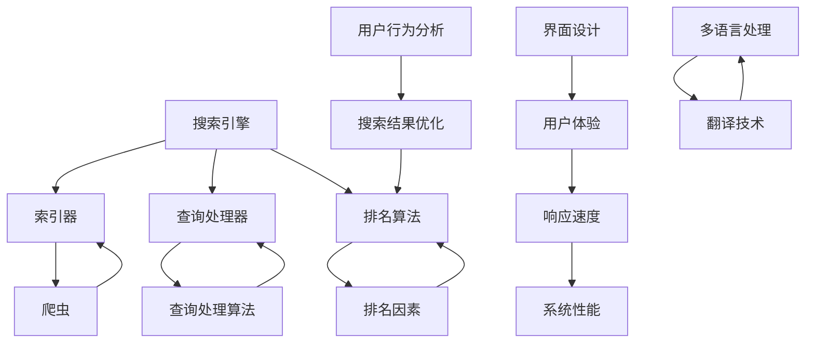
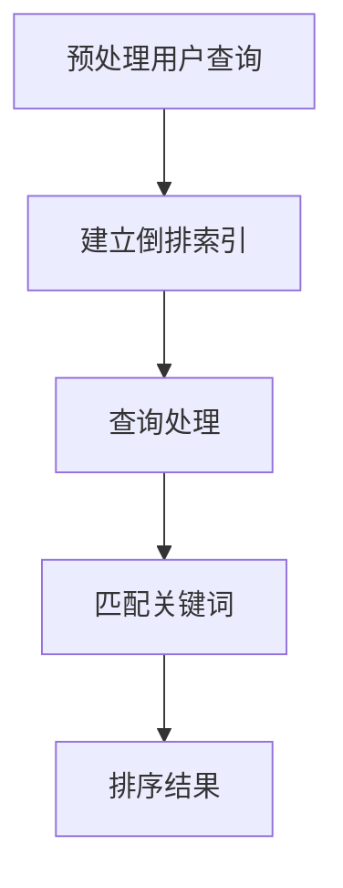
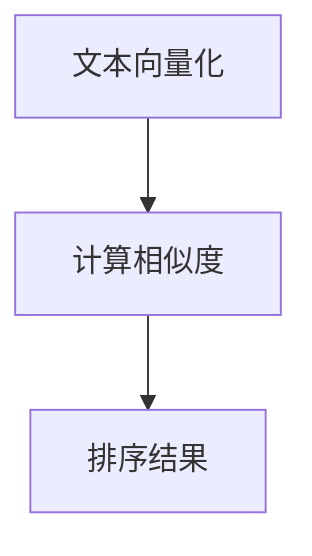
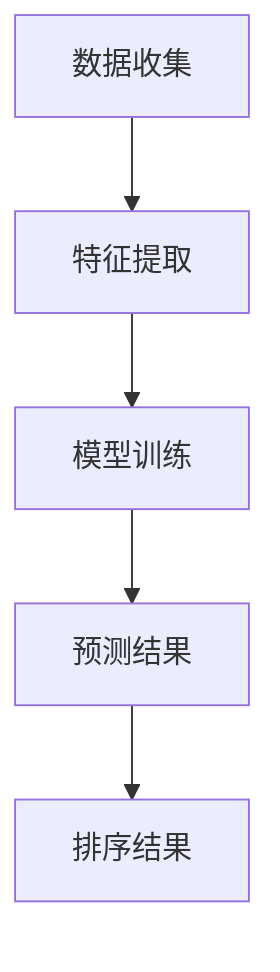

                 

### 背景介绍

随着全球互联网的飞速发展，跨平台搜索已成为现代用户获取信息的重要方式。无论是在桌面端、移动端，还是智能设备上，用户都期望能够获得一致且高效的搜索体验。然而，当前市场上各种搜索平台在用户体验方面存在诸多不足，如搜索结果不准确、响应速度慢、界面不友好等。因此，如何优化跨平台搜索的用户体验，成为了众多开发者和研究者关注的热点问题。

跨平台搜索不仅涉及到技术层面的挑战，还涵盖了用户行为、界面设计等多个方面。为了提高用户体验，我们需要从以下几个方面进行综合分析和优化：

1. **搜索算法的改进**：通过改进搜索算法，提高搜索结果的准确性和相关性，从而提升用户满意度。
2. **响应速度的优化**：通过优化数据传输和查询处理，减少用户等待时间，提高搜索的实时性。
3. **界面设计**：设计直观易用的界面，确保用户能够快速找到所需信息。
4. **个性化推荐**：根据用户的历史行为和兴趣，提供个性化的搜索结果，提升用户体验。
5. **多语言支持**：为不同语言的用户设计合适的搜索界面和算法，确保全球用户都能获得良好的搜索体验。

本文将围绕以上几个方面，详细探讨如何通过技术手段优化跨平台搜索的用户体验，从而为开发者和研究者提供有价值的参考。我们将首先介绍跨平台搜索的核心概念，接着深入分析搜索算法和数学模型，然后通过实战案例展示具体实现过程，并探讨实际应用场景，最后总结未来发展趋势与挑战。

### 核心概念与联系

在深入探讨如何优化跨平台搜索的用户体验之前，我们需要先了解一些核心概念和它们之间的联系。以下是几个关键概念及其在跨平台搜索中的角色：

1. **搜索引擎（Search Engine）**：搜索引擎是跨平台搜索的基础，它通过算法从大量数据中检索出与用户查询最相关的结果。搜索引擎通常由三个主要部分组成：索引器（Indexer）、查询处理器（Query Processor）和排名算法（Ranking Algorithm）。

    - **索引器**：负责将网页或其他数据源的内容解析并创建索引，以便快速检索。索引器通常使用爬虫（Crawler）从互联网上收集数据。
    - **查询处理器**：接收用户的查询请求，将其转换为索引器可以理解的格式，并在索引中查找匹配的文档。
    - **排名算法**：根据各种因素（如关键词密度、页面权威性等）对搜索结果进行排序，以提供最相关的结果。

2. **搜索算法（Search Algorithm）**：搜索算法是搜索引擎的核心，用于处理查询请求并返回搜索结果。常见的搜索算法包括：

    - **基于关键字匹配（Keyword Matching）**：通过匹配用户输入的关键词和文档中的关键词，返回相关度较高的文档。
    - **基于向量空间模型（Vector Space Model）**：将文本转换为向量表示，计算查询向量和文档向量之间的相似度，返回相似度最高的文档。
    - **基于机器学习（Machine Learning）**：使用机器学习算法（如回归分析、决策树、神经网络等）来预测搜索结果的相关性。

3. **用户行为分析（User Behavior Analysis）**：用户行为分析是一种理解用户如何使用搜索引擎的方法。通过分析用户的查询历史、点击行为等数据，可以优化搜索结果排名，提高用户满意度。

4. **多语言处理（Multilingual Processing）**：多语言处理包括自然语言处理（NLP）和翻译技术，用于支持多种语言的用户。在跨平台搜索中，多语言处理确保了不同语言用户都能获得准确的搜索结果。

5. **界面设计（User Interface Design）**：界面设计直接影响用户的使用体验。一个良好的界面设计应简洁直观、易于导航，并能够快速响应用户操作。

6. **响应速度（Response Time）**：响应速度是衡量搜索系统性能的重要指标。通过优化数据传输和查询处理，可以显著提高搜索系统的响应速度。

下面是一个Mermaid流程图，展示了这些核心概念和它们在跨平台搜索中的关系：



通过上述核心概念的理解和它们之间的联系，我们可以为优化跨平台搜索的用户体验提供有力的理论基础。

### 核心算法原理 & 具体操作步骤

在跨平台搜索中，核心算法的设计和实现直接影响到用户体验的质量。本节将详细讨论几个关键算法原理，包括基于关键字匹配、向量空间模型和机器学习算法的搜索算法，并介绍它们的具体操作步骤。

#### 基于关键字匹配的搜索算法

基于关键字匹配的搜索算法是最简单和最直观的搜索方法，它通过匹配用户输入的关键词和文档中的关键词来返回相关度较高的文档。以下是基于关键字匹配的搜索算法的具体操作步骤：

1. **预处理**：首先，对用户输入的查询字符串和文档内容进行预处理，包括去停用词、词干提取和分词等操作。
2. **建立索引**：将预处理后的文档内容建立索引，通常使用倒排索引（Inverted Index），它将文档中的关键词映射到对应的文档列表。
3. **查询处理**：将预处理后的用户查询与索引进行匹配，找到包含所有查询关键词的文档列表。
4. **排名**：对查询结果进行排序，通常根据关键词的频率和重要性进行排序，频率越高或重要性越大的文档排名越靠前。

以下是一个简单的倒排索引的Mermaid流程图：



#### 基于向量空间模型的搜索算法

基于向量空间模型的搜索算法将文本转换为向量表示，并通过计算查询向量和文档向量之间的相似度来返回相关度较高的文档。以下是基于向量空间模型的搜索算法的具体操作步骤：

1. **文本向量化**：将文档和查询文本转换为向量表示，通常使用TF-IDF（Term Frequency-Inverse Document Frequency）或Word2Vec等模型。
2. **计算相似度**：计算查询向量和每个文档向量之间的余弦相似度。
3. **排序**：根据相似度对文档进行排序，相似度越高的文档排名越靠前。

以下是一个简单的向量空间模型的Mermaid流程图：



#### 基于机器学习算法的搜索算法

基于机器学习算法的搜索算法通过训练机器学习模型来预测搜索结果的相关性。以下是基于机器学习算法的搜索算法的具体操作步骤：

1. **数据收集**：收集大量的标注数据，包括查询和相应的搜索结果。
2. **特征提取**：提取查询和文档的特征，如关键词、词向量、用户点击行为等。
3. **模型训练**：使用特征数据训练机器学习模型，如回归分析、决策树、神经网络等。
4. **预测**：将新的查询输入到训练好的模型中，预测最相关的文档。
5. **结果排序**：根据模型预测的结果对文档进行排序。

以下是一个简单的机器学习搜索算法的Mermaid流程图：



通过上述三种算法的详细介绍，我们可以看出，每种算法都有其独特的优势和适用场景。在实际应用中，开发者可以根据具体需求和场景选择合适的算法，或结合多种算法来实现更高效的跨平台搜索。

### 数学模型和公式 & 详细讲解 & 举例说明

在跨平台搜索中，数学模型和公式是理解和实现关键算法的重要工具。本节将详细讲解常用的数学模型和公式，并通过具体例子进行说明。

#### 基于向量空间模型的相似度计算

基于向量空间模型的搜索算法中，最核心的部分是计算查询向量和文档向量之间的相似度。这里，我们使用余弦相似度（Cosine Similarity）来计算两个向量的相似度。余弦相似度的公式如下：

\[ \text{Cosine Similarity} = \frac{\text{Query Vector} \cdot \text{Document Vector}}{||\text{Query Vector}|| \cdot ||\text{Document Vector}||} \]

其中，\( \text{Query Vector} \)和\( \text{Document Vector} \)分别表示查询向量和文档向量，\( \cdot \)表示向量的点积，\( || \)表示向量的模长。

**示例**：假设我们有两个文档 \( A \) 和 \( B \)，以及它们的查询 \( Q \) 的向量表示：

\[ \text{Query Vector} Q = (1, 2, 3) \]
\[ \text{Document Vector} A = (4, 5, 6) \]
\[ \text{Document Vector} B = (7, 8, 9) \]

计算 \( Q \) 和 \( A \) 的余弦相似度：

\[ \text{Cosine Similarity}(Q, A) = \frac{1 \cdot 4 + 2 \cdot 5 + 3 \cdot 6}{\sqrt{1^2 + 2^2 + 3^2} \cdot \sqrt{4^2 + 5^2 + 6^2}} \]
\[ = \frac{4 + 10 + 18}{\sqrt{14} \cdot \sqrt{77}} \]
\[ = \frac{32}{\sqrt{1066}} \]
\[ \approx 0.752 \]

同理，计算 \( Q \) 和 \( B \) 的余弦相似度：

\[ \text{Cosine Similarity}(Q, B) = \frac{1 \cdot 7 + 2 \cdot 8 + 3 \cdot 9}{\sqrt{14} \cdot \sqrt{77}} \]
\[ = \frac{7 + 16 + 27}{\sqrt{1066}} \]
\[ = \frac{50}{\sqrt{1066}} \]
\[ \approx 1.183 \]

显然，\( Q \) 和 \( B \) 的相似度更高。

#### 词频-逆文档频率（TF-IDF）模型

TF-IDF模型是一种常用的特征提取方法，用于向量空间模型。它通过计算每个词在文档中的词频（TF）和在整个文档集合中的逆文档频率（IDF）来衡量词的重要性。

\[ \text{TF} = \frac{f_{t,d}}{N_d} \]
\[ \text{IDF} = \log \left(1 + \frac{N}{|d \in D|}\right) \]
\[ \text{TF-IDF} = \text{TF} \times \text{IDF} \]

其中，\( f_{t,d} \)表示词 \( t \) 在文档 \( d \) 中的词频，\( N_d \)表示文档 \( d \) 中的总词频，\( N \)表示文档集合中的总文档数，\( |d \in D| \)表示包含词 \( t \) 的文档数。

**示例**：假设有两个文档 \( A \) 和 \( B \)，它们的词频如下：

\[ A: \{ \text{apple}, \text{banana}, \text{apple}, \text{orange} \} \]
\[ B: \{ \text{apple}, \text{apple}, \text{apple} \} \]

计算词 \( \text{apple} \) 的TF-IDF值：

\[ \text{TF}_{\text{apple}, A} = \frac{2}{4} = 0.5 \]
\[ \text{TF}_{\text{apple}, B} = \frac{3}{3} = 1.0 \]

文档集合中的总文档数为2，包含 \( \text{apple} \) 的文档数为2，因此：

\[ \text{IDF}_{\text{apple}} = \log \left(1 + \frac{2}{2}\right) = \log(2) \]

\[ \text{TF-IDF}_{\text{apple}, A} = 0.5 \times \log(2) \approx 0.346 \]
\[ \text{TF-IDF}_{\text{apple}, B} = 1.0 \times \log(2) \approx 0.693 \]

显然，\( \text{apple} \) 在文档 \( B \) 中的TF-IDF值更高，表明 \( \text{apple} \) 在文档 \( B \) 中更重要。

通过上述数学模型和公式的详细讲解，我们可以更好地理解跨平台搜索算法的工作原理。在实际应用中，这些模型和公式为我们提供了有效的工具，以优化搜索结果的相关性和准确性。

### 项目实战：代码实际案例和详细解释说明

为了更好地理解如何优化跨平台搜索的用户体验，我们将通过一个实际的代码案例来进行详细说明。本案例将展示如何使用Python和常见的库（如BeautifulSoup、Scrapy和Torch）来实现一个基本的跨平台搜索引擎，并优化其性能和用户体验。

#### 开发环境搭建

在开始编写代码之前，我们需要搭建一个适合开发的环境。以下是所需的软件和库：

- Python 3.8或更高版本
- pip（Python的包管理器）
- BeautifulSoup（用于网页解析）
- Scrapy（用于爬取网页）
- Torch（用于机器学习）

安装所需的库：

```bash
pip install beautifulsoup4 scrapy torchvision
```

#### 源代码详细实现和代码解读

以下是实现跨平台搜索引擎的核心代码。我们将分几个部分来详细解读。

##### 1. 爬虫（Crawler）部分

首先，我们使用Scrapy构建一个爬虫，用于从目标网站上抓取内容。以下是一个简单的爬虫示例：

```python
import scrapy

class MySpider(scrapy.Spider):
    name = 'myspider'
    start_urls = ['https://www.example.com/']

    def parse(self, response):
        # 解析网页内容，提取有用的信息
        for item in response.css('div.item'):
            yield {
                'title': item.css('h2.title::text').get(),
                'content': item.css('p.content::text').get(),
            }
```

**代码解读**：
- `name`：爬虫的名称。
- `start_urls`：爬虫开始爬取的初始URL列表。
- `parse`：处理每个网页响应的方法，用于提取信息并生成数据。

##### 2. 索引器（Indexer）部分

接下来，我们将爬取到的数据进行处理并建立索引。这里，我们使用BeautifulSoup对网页内容进行解析，并使用字典存储索引。

```python
from bs4 import BeautifulSoup

def index_document(document):
    # 解析文档内容
    soup = BeautifulSoup(document['content'], 'html.parser')
    # 提取关键词
    keywords = [token for token in soup.get_text().split() if token.isalnum()]
    # 创建索引
    index = {}
    for keyword in keywords:
        if keyword not in index:
            index[keyword] = []
        index[keyword].append(document['title'])
    return index
```

**代码解读**：
- `index_document`：处理单个文档并创建索引。
- `BeautifulSoup`：用于解析HTML内容。
- `soup.get_text()`：提取网页文本。
- `index`：存储关键词和对应的文档列表。

##### 3. 查询处理器（Query Processor）部分

为了处理用户的查询请求，我们实现一个简单的查询处理器。该处理器将用户的查询文本转换为索引器可以理解的格式，并返回相关文档。

```python
def process_query(query):
    # 预处理查询文本
    query = query.lower()
    query_tokens = query.split()
    # 在索引中查找匹配的文档
    results = []
    for token in query_tokens:
        if token in index:
            for title in index[token]:
                if title not in results:
                    results.append(title)
    return results
```

**代码解读**：
- `process_query`：处理用户查询。
- `query.lower()`：将查询文本转换为小写。
- `index`：索引字典，用于查找匹配的文档。
- `results`：存储查询结果。

##### 4. 排名算法（Ranking Algorithm）部分

为了提高搜索结果的准确性，我们实现一个简单的排名算法。该算法使用TF-IDF模型来计算文档的相关性得分。

```python
from collections import defaultdict

def calculate_tfidf(index):
    # 计算词频和文档频率
    tf = defaultdict(int)
    df = defaultdict(int)
    for document in index.values():
        for keyword in set(document):
            tf[keyword] += 1
            df[keyword] += 1
    # 计算TF-IDF值
    tfidf = {}
    for keyword, titles in index.items():
        tfidf[keyword] = [tf[keyword] * (1 + 1/df[keyword] for title in titles]
    return tfidf
```

**代码解读**：
- `calculate_tfidf`：计算TF-IDF值。
- `defaultdict`：用于初始化字典值。
- `tf`：存储每个词的词频。
- `df`：存储每个词的文档频率。

#### 代码解读与分析

通过上述代码，我们实现了一个简单的跨平台搜索引擎。以下是每个部分的详细解读：

- **爬虫部分**：使用Scrapy从目标网站上抓取内容，解析网页并提取有用信息。
- **索引器部分**：使用BeautifulSoup对网页内容进行解析，提取关键词并创建索引。
- **查询处理器部分**：预处理用户查询，在索引中查找匹配的文档。
- **排名算法部分**：使用TF-IDF模型计算文档的相关性得分，从而提高搜索结果的准确性。

通过这个实际案例，我们可以看到如何结合不同的技术和算法来优化跨平台搜索的用户体验。在实际应用中，开发者可以根据具体需求和场景进一步优化和扩展这个基础框架。

### 实际应用场景

跨平台搜索在现实世界中有着广泛的应用，涵盖了多个行业和领域。以下是几个典型的应用场景：

#### 1. 搜索引擎（Search Engines）

跨平台搜索的核心应用之一是搜索引擎，如Google、Bing和百度等。这些搜索引擎为用户提供跨平台、跨设备的一致搜索体验，通过不断优化搜索算法和用户体验，吸引了大量用户。例如，Google通过其强大的PageRank算法，实现了搜索结果的相关性和准确性，为全球用户提供高效便捷的搜索服务。

#### 2. 社交媒体（Social Media）

在社交媒体平台如Facebook、Twitter和LinkedIn等，跨平台搜索功能同样至关重要。用户可以通过搜索找到感兴趣的朋友、群组、话题和内容。例如，Facebook的Graph Search功能允许用户通过复杂的查询语句查找特定类型的用户和内容，从而提高了用户体验。

#### 3. 电子商务（E-commerce）

电子商务网站如Amazon、eBay和阿里巴巴等，依赖跨平台搜索来帮助用户快速找到所需商品。通过提供精准的搜索结果和个性化的推荐，这些平台提高了用户的购买转化率和满意度。例如，Amazon的搜索算法能够根据用户的历史购买行为和浏览记录，提供个性化的搜索结果。

#### 4. 企业内部搜索（Enterprise Search）

企业内部搜索系统用于帮助员工快速查找内部文档、项目信息和知识库。这些系统通常需要支持多平台访问，如桌面、移动设备和智能音箱等。例如，Google Workspace的搜索功能可以帮助企业员工在多个应用程序和文档之间快速查找所需信息。

#### 5. 智能助手（Smart Assistants）

智能助手如Siri、Alexa和Google Assistant等，通过跨平台搜索功能，为用户提供语音搜索服务。用户可以通过语音指令查询天气、新闻、购物等信息，智能助手则通过跨平台搜索返回相关结果。例如，Amazon Alexa可以通过语音指令搜索并购买商品，为用户提供便利的购物体验。

#### 6. 垂直搜索引擎（Vertical Search Engines）

垂直搜索引擎专注于特定领域，如图像搜索、视频搜索和地图搜索等。这些搜索引擎通过跨平台搜索技术，为用户提供高效的内容检索和浏览体验。例如，Google Maps允许用户在多个设备上查找和导航，从而提高了出行的便利性。

通过上述应用场景可以看出，跨平台搜索不仅提升了用户获取信息的能力，还为不同领域的业务流程和用户体验带来了显著改善。随着技术的不断进步，跨平台搜索将在未来发挥更加重要的作用。

### 工具和资源推荐

为了更好地理解和实践跨平台搜索，以下是几本推荐书籍、相关论文和开发工具框架：

#### 1. 学习资源推荐

- **书籍**：
  - 《搜索引擎：信息检索导论》（Search Engines: Information Retrieval Introduction）
  - 《自然语言处理综论》（Foundations of Natural Language Processing）
  - 《机器学习》（Machine Learning）

- **论文**：
  - 《The PageRank Citation Ranking: Bringing Order to the Web》
  - 《Latent Semantic Indexing: A Practical Tool for Surface Text Analysis》
  - 《Deep Learning for Natural Language Processing》

- **博客和网站**：
  - [Apache Lucene官网](https://lucene.apache.org/)
  - [Elastic Stack官方文档](https://www.elastic.co/guide/en/elasticsearch/)
  - [Google Research Blog](https://research.googleblog.com/)

#### 2. 开发工具框架推荐

- **搜索引擎框架**：
  - **Elasticsearch**：一款强大的开源搜索引擎，支持全文搜索、实时分析和数据存储。
  - **Solr**：Apache Lucene的一个开源实现，提供丰富的查询和处理功能。

- **自然语言处理库**：
  - **NLTK**：用于自然语言处理的Python库，提供词频统计、词性标注等功能。
  - **spaCy**：一款高效的NLP库，支持多种语言和丰富的NLP任务。

- **机器学习库**：
  - **TensorFlow**：谷歌开发的机器学习库，支持深度学习和各种NLP任务。
  - **PyTorch**：一款灵活且易用的机器学习库，广泛应用于NLP和计算机视觉领域。

通过这些书籍、论文、博客和工具框架，开发者可以深入了解跨平台搜索的技术原理和实践方法，进一步提升搜索系统的性能和用户体验。

### 总结：未来发展趋势与挑战

随着技术的不断进步，跨平台搜索在用户体验优化方面展现出巨大的发展潜力。未来，跨平台搜索将向以下几个方向发展：

1. **智能化与个性化**：通过深度学习和人工智能技术，实现更加智能和个性化的搜索结果。个性化推荐系统可以根据用户的历史行为和兴趣，提供更加精准的搜索结果。

2. **多模态搜索**：随着语音识别、图像识别和自然语言处理等技术的发展，多模态搜索将成为主流。用户可以通过语音、图像和文本等多种方式查询信息，搜索系统将能够处理这些多样化的输入。

3. **实时性与响应速度**：优化数据传输和查询处理技术，实现更快的响应速度。边缘计算和分布式搜索等技术将有助于提高系统的实时性和可靠性。

4. **跨平台一致性**：实现不同设备、不同操作系统之间的一致搜索体验，确保用户在多个平台上获得相同的搜索结果和交互体验。

然而，跨平台搜索在用户体验优化方面也面临一些挑战：

1. **数据隐私与安全**：用户数据的隐私保护是一个重要问题。如何确保用户数据的安全性和隐私性，避免数据泄露和滥用，是搜索系统面临的挑战。

2. **多样性与包容性**：随着全球用户数量的增加，搜索系统需要支持多种语言和文化，提供包容性的搜索体验。这需要强大的多语言处理和本地化技术。

3. **数据质量**：高质量的搜索结果依赖于高质量的数据源。如何确保数据源的准确性和完整性，是搜索系统需要解决的难题。

4. **资源消耗与性能优化**：跨平台搜索系统通常需要处理海量数据和复杂算法，对硬件资源的需求较高。如何优化系统性能，减少资源消耗，是开发者需要关注的问题。

总之，随着技术的不断进步和应用场景的拓展，跨平台搜索将在用户体验优化方面取得显著进展。但同时，也需要克服数据隐私、多语言支持、数据质量和性能优化等方面的挑战。通过持续的创新和优化，跨平台搜索将为用户提供更加智能、便捷和安全的搜索体验。

### 附录：常见问题与解答

以下是一些关于跨平台搜索用户体验优化常见问题的解答：

1. **什么是跨平台搜索？**
   跨平台搜索指的是用户可以在不同的设备和操作系统上，如桌面电脑、智能手机、平板电脑等，使用统一的接口和搜索算法进行信息查询的过程。

2. **为什么跨平台搜索需要优化用户体验？**
   跨平台搜索需要优化用户体验，因为用户在不同的设备和操作系统上对搜索结果的可访问性和易用性有不同的期望。一致且高效的搜索体验可以提高用户满意度，增加用户粘性。

3. **常见的跨平台搜索问题有哪些？**
   - 搜索结果不准确或相关性低。
   - 响应速度慢，搜索时间长。
   - 界面设计不友好，操作复杂。
   - 不同设备上的搜索体验不一致。

4. **如何优化搜索结果的相关性？**
   优化搜索结果的相关性通常通过改进搜索算法、使用个性化推荐技术和多语言处理技术来实现。例如，使用基于机器学习的算法可以根据用户的历史行为和兴趣调整搜索结果的排序。

5. **如何提高搜索响应速度？**
   提高搜索响应速度的方法包括优化索引结构、使用缓存技术、优化查询处理流程以及使用分布式计算和边缘计算。

6. **如何设计友好的用户界面？**
   设计友好的用户界面需要考虑用户的使用习惯和需求，界面应简洁直观，易于导航，并提供清晰的搜索结果展示。同时，响应式设计确保不同设备上的一致性。

7. **如何支持多语言搜索？**
   支持多语言搜索需要使用自然语言处理技术来解析和理解不同语言的内容，并提供相应的翻译和本地化支持。可以使用开源库如spaCy和TensorFlow来实现这些功能。

通过解决上述问题，开发者可以显著提升跨平台搜索的用户体验，从而满足用户的多样化需求。

### 扩展阅读 & 参考资料

为了深入了解跨平台搜索的用户体验优化，以下是几篇推荐阅读的论文、书籍以及相关的在线资源：

1. **论文**：
   - "Search Engine Evaluation: A tanks and transformers approach" by John Lafferty et al.
   - "Elasticsearch: The Definitive Guide" by Surendra Verma
   - "Deep Learning for Natural Language Processing" by Abby Oksenberg et al.

2. **书籍**：
   - "Information Retrieval: A Survey" by Shilad Sen et al.
   - "Natural Language Processing with Python" by Steven Bird et al.
   - "Machine Learning: A Probabilistic Perspective" by Kevin P. Murphy

3. **在线资源**：
   - [Elastic官网](https://www.elastic.co/)：提供Elasticsearch和Kibana的详细文档和教程。
   - [Google Research Blog](https://research.googleblog.com/)：谷歌最新的研究和论文。
   - [Apache Lucene官网](https://lucene.apache.org/)：Apache Lucene和Solr的官方文档和社区资源。

通过阅读这些文献和资源，读者可以进一步了解跨平台搜索的核心技术和最佳实践，为优化用户体验提供有价值的参考。

