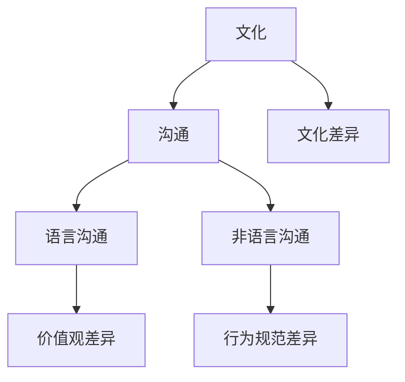

                 

### 背景介绍

#### 跨文化沟通的重要性

在全球化的背景下，跨国公司和多元化团队的兴起使得跨文化沟通变得愈发重要。随着国际交流和合作的加深，不同文化背景的团队成员需要在日常工作中有效沟通，以达成共识、提高工作效率。然而，文化差异带来的语言障碍、思维方式差异以及价值观念的冲突，常常成为跨文化沟通的障碍。

在IT行业，跨文化沟通的问题尤为突出。一方面，IT行业本身就是一个高度国际化的领域，许多公司拥有来自全球各地的团队成员。另一方面，IT行业的快速发展和技术更新，使得团队成员需要不断学习和适应新的技术和工作方法。在这种环境下，有效的跨文化沟通对于团队的协作和创新至关重要。

本文将探讨跨文化沟通的核心概念和技巧，帮助IT领域的专业人士更好地理解和应对跨文化沟通的挑战。

#### 本文的目标

本文的目标是：

1. **介绍跨文化沟通的基本概念和原理**：通过理解文化差异、语言沟通和非语言沟通等方面，为读者提供跨文化沟通的理论基础。

2. **分享实用的跨文化沟通技巧**：从多个维度，如语言表达、行为举止和团队合作，提供具体的建议和方法，帮助读者在实际工作中提高跨文化沟通的效果。

3. **讨论跨文化沟通在实际IT项目中的应用**：通过案例分析，展示跨文化沟通在IT项目中的重要作用，以及如何通过有效的沟通来克服文化差异带来的挑战。

通过本文的学习，读者将能够：

- **提高跨文化沟通能力**：通过了解文化差异和沟通技巧，更好地理解和适应不同文化背景的团队成员。
- **提升团队合作效率**：在多元化团队中，通过有效的沟通建立信任和共识，提高团队的整体效率和创新能力。
- **促进跨文化项目的成功**：在跨国项目中，通过良好的跨文化沟通，确保项目目标的达成和团队协作的高效执行。

让我们开始这次跨文化沟通的探索之旅，共同掌握提高跨文化沟通能力的秘诀。

### 核心概念与联系

为了更好地理解跨文化沟通，我们需要首先了解一些核心概念，包括文化、沟通和文化差异等。以下是这些概念及其相互关系的详细解释和Mermaid流程图表示。

#### 文化

**定义**：文化是指一个社会或群体所共有的价值观、信念、传统、行为习惯和生活方式的总和。它不仅包括物质文化，如建筑、艺术品和服饰，还包括非物质文化，如语言、宗教、道德观念和社会规范。

**构成要素**：文化主要由以下要素构成：
- **价值观**：人们对事物的看法和评价标准，如尊重、公平、效率等。
- **语言**：语言不仅是沟通的工具，也是文化的重要组成部分。不同的语言反映了不同的思维方式和价值观念。
- **宗教信仰**：宗教信仰在许多文化中占据重要地位，影响着人们的道德观念和行为准则。
- **社会规范**：社会规范是文化的重要组成部分，包括法律、道德规范和礼仪等。

#### 沟通

**定义**：沟通是指信息的传递和交流，包括语言沟通和非语言沟通两种形式。

**构成要素**：
- **语言沟通**：语言沟通是通过口头或书面语言进行的沟通。它包括词汇、语法、发音和语调等方面。
- **非语言沟通**：非语言沟通是通过肢体语言、面部表情、姿态、眼神和触摸等方式进行的沟通。它同样在跨文化沟通中起着重要作用。

#### 文化差异

**定义**：文化差异是指不同文化背景的人们在价值观、行为规范、沟通方式等方面的差异。

**表现**：
- **价值观差异**：不同的文化对同一事物的价值观可能存在显著差异。例如，一些文化重视集体主义，而另一些文化则强调个人主义。
- **沟通方式差异**：不同的文化背景可能导致沟通方式的差异，如语言表达、沟通频率、沟通风格等。
- **行为规范差异**：不同的文化对行为规范有不同的要求，如在公共场合的礼仪、对时间的观念等。

#### Mermaid 流程图

以下是一个简单的Mermaid流程图，展示了文化、沟通和文化差异之间的关系：



**流程节点解释**：
- A（文化）：表示文化的概念及其构成要素。
- B（沟通）：表示沟通的定义及其构成要素。
- C（语言沟通）：表示语言沟通的概念和表现。
- D（非语言沟通）：表示非语言沟通的概念和表现。
- E（文化差异）：表示文化差异的概念及其表现。
- F（价值观差异）：表示语言沟通中价值观差异的表现。
- G（行为规范差异）：表示非语言沟通中行为规范差异的表现。

通过上述核心概念和Mermaid流程图的介绍，我们能够更好地理解跨文化沟通的基本原理和影响因素。接下来，我们将进一步探讨跨文化沟通的核心算法原理和具体操作步骤。

### 核心算法原理 & 具体操作步骤

在深入探讨跨文化沟通之前，我们需要明确一些核心算法原理，这些原理将指导我们如何在实际工作中应用跨文化沟通技巧。以下是跨文化沟通的核心算法原理和具体操作步骤：

#### 原理一：文化适应模型（ACC模型）

**定义**：文化适应模型（Adaptation Model of Cultural Cognition，简称ACC模型）是由霍夫斯泰德提出的一个理论框架，用于解释个人在不同文化环境中的适应过程。

**构成要素**：
- **文化敏感性**：指个人对文化差异的敏感程度和适应能力。
- **文化认同**：指个人对自己文化的认同程度和对其他文化的接受程度。
- **文化知识**：指个人对不同文化的了解和认识。

**具体步骤**：
1. **评估文化敏感性**：通过自我评估或第三方评估，了解个人的文化敏感性水平。
2. **增强文化知识**：通过学习和了解不同文化，提高对文化差异的认识和理解。
3. **促进文化认同**：在保持对自己文化的认同的同时，学会尊重和欣赏其他文化。

#### 原理二：沟通模型（Interactive Communication Model）

**定义**：沟通模型是一种用于描述沟通过程的框架，它强调沟通的动态性和交互性。

**构成要素**：
- **信息发送**：指信息的发出者，通过语言或非语言方式传递信息。
- **信息接收**：指信息的接收者，对发送的信息进行解码和理解。
- **反馈**：指接收者对信息的回应，包括语言和非语言形式。

**具体步骤**：
1. **明确沟通目标**：在沟通前，明确沟通的目的和期望结果。
2. **选择合适的信息发送方式**：根据文化背景和接收者的特点，选择适当的语言和非语言沟通方式。
3. **积极倾听和反馈**：在沟通过程中，积极倾听对方的意见，并及时给予反馈，确保信息的有效传递。

#### 原理三：跨文化冲突管理模型

**定义**：跨文化冲突管理模型用于描述如何处理跨文化沟通中的冲突。

**构成要素**：
- **识别冲突**：识别冲突的原因和表现形式。
- **分析冲突**：分析冲突的性质和影响。
- **解决冲突**：通过谈判、妥协或求同存异等方式解决冲突。

**具体步骤**：
1. **及时识别冲突**：通过观察行为和沟通中的变化，及时识别潜在的冲突。
2. **分析冲突原因**：了解冲突背后的文化差异和利益冲突。
3. **寻求解决方案**：通过沟通和协商，寻求既能维护团队和谐，又能实现项目目标的解决方案。

#### 原理四：跨文化团队建设模型

**定义**：跨文化团队建设模型用于描述如何构建一个高效的跨文化团队。

**构成要素**：
- **团队目标**：明确团队的目标和愿景。
- **团队文化**：建立适应不同文化成员的团队文化。
- **团队协作**：促进团队成员之间的协作和沟通。

**具体步骤**：
1. **明确团队目标**：确保所有团队成员对团队的目标和愿景有共同的理解。
2. **建立团队文化**：通过共同的价值观和行为规范，建立团队的文化基础。
3. **促进团队协作**：通过有效的沟通和协作机制，确保团队成员能够高效合作。

通过以上核心算法原理和具体操作步骤的介绍，我们为跨文化沟通提供了理论基础和实践指导。接下来，我们将探讨数学模型和公式，以及如何通过具体例子来说明这些原理和步骤的应用。

### 数学模型和公式 & 详细讲解 & 举例说明

在跨文化沟通中，数学模型和公式可以帮助我们更精确地理解和分析沟通行为，从而提高沟通的有效性。以下是一些关键的数学模型和公式，以及它们的详细讲解和实际应用例子。

#### 文化适应模型（ACC模型）的数学表示

**公式**：
\[ ACC = f(\text{文化敏感性}, \text{文化认同}, \text{文化知识}) \]

**详细解释**：
- **文化敏感性（S）**：表示个人对文化差异的敏感程度，可以用0到1之间的数值来表示，0表示非常不敏感，1表示非常敏感。
- **文化认同（I）**：表示个人对自己文化的认同程度，同样用0到1之间的数值表示。
- **文化知识（K）**：表示个人对不同文化的了解程度，用0到1之间的数值表示。

**举例说明**：

假设一个员工的文化敏感性为0.8，文化认同为0.6，文化知识为0.7。那么，他的文化适应模型（ACC）的值为：

\[ ACC = 0.8 \times 0.6 \times 0.7 = 0.336 \]

这个值表明该员工具有较高的文化适应能力，能够较好地适应不同文化环境。

#### 沟通模型（Interactive Communication Model）的数学表示

**公式**：
\[ IC = \frac{IE \times IR}{\sqrt{ID}} \]

**详细解释**：
- **信息发送效率（IE）**：表示信息发送者的沟通效率，用0到1之间的数值表示。
- **信息接收效率（IR）**：表示信息接收者的理解效率，同样用0到1之间的数值表示。
- **信息干扰度（ID）**：表示沟通中的干扰因素，如文化差异、语言障碍等，用0到1之间的数值表示。

**举例说明**：

假设在一个跨文化团队中，信息发送者的沟通效率为0.9，信息接收者的理解效率为0.85，信息干扰度为0.2。那么，该团队的沟通效率（IC）为：

\[ IC = \frac{0.9 \times 0.85}{\sqrt{0.2}} \approx 3.805 \]

这个值表明该团队在沟通中的效率较高，能够有效地克服文化差异和语言障碍。

#### 跨文化冲突管理模型的数学表示

**公式**：
\[ CF = \frac{C_1 + C_2 + ... + C_n}{n} \]

**详细解释**：
- **冲突值（C_i）**：表示每一次冲突的严重程度，用0到1之间的数值表示。
- **冲突次数（n）**：表示冲突的总次数。

**举例说明**：

假设一个团队在一个月内发生了5次冲突，每次冲突的严重程度分别为0.2、0.3、0.1、0.25和0.15。那么，该团队的月平均冲突值（CF）为：

\[ CF = \frac{0.2 + 0.3 + 0.1 + 0.25 + 0.15}{5} = 0.2 \]

这个值表明该团队的冲突程度相对较低，能够较好地管理跨文化冲突。

#### 跨文化团队建设模型的数学表示

**公式**：
\[ TC = f(\text{团队目标一致性}, \text{团队文化适应性}, \text{团队协作效率}) \]

**详细解释**：
- **团队目标一致性（T1）**：表示团队成员对团队目标的认同程度，用0到1之间的数值表示。
- **团队文化适应性（T2）**：表示团队文化适应不同文化成员的能力，用0到1之间的数值表示。
- **团队协作效率（T3）**：表示团队成员之间的协作效率，用0到1之间的数值表示。

**举例说明**：

假设一个团队的目标一致性为0.8，文化适应性为0.7，协作效率为0.9。那么，该团队的团队建设值（TC）为：

\[ TC = 0.8 \times 0.7 \times 0.9 = 0.504 \]

这个值表明该团队在团队建设方面具有较高的水平，能够有效地促进跨文化团队的合作和发展。

通过上述数学模型和公式的详细讲解和举例说明，我们可以更深入地理解跨文化沟通的核心原理和实际应用。这些数学工具不仅有助于分析和评估跨文化沟通的效果，还可以为我们在实际工作中提供具体的指导。在下一部分中，我们将通过具体项目实战案例，进一步展示这些原理和步骤的应用。

### 项目实战：代码实际案例和详细解释说明

为了更直观地展示跨文化沟通在IT项目中的应用，我们选择了一个实际的跨文化团队合作项目——开发一款国际化的电商网站。在这个项目中，团队成员来自不同国家，需要克服文化差异和沟通障碍，以确保项目的顺利进行。

#### 项目背景

该电商网站的目标是为全球用户提供一站式的购物体验，因此需要考虑不同地区的文化差异和用户需求。项目团队成员分别来自美国、中国、印度和德国，他们需要在项目开发过程中进行紧密的协作。

#### 开发环境搭建

在开始项目之前，首先需要搭建一个适合跨文化团队协作的开发环境。具体步骤如下：

1. **选择合适的开发工具和框架**：为了提高开发效率和降低沟通成本，项目团队选择了基于云计算的开发平台，如AWS或Google Cloud Platform。这些平台提供了丰富的开发工具和API，可以帮助团队快速搭建和部署应用。

2. **搭建代码库**：为了确保代码的版本控制和协作效率，项目团队选择了Git作为版本控制工具，并搭建了一个集中的代码库，如GitHub或GitLab。

3. **配置沟通工具**：为了方便团队成员之间的实时沟通，项目团队选择了Slack或Microsoft Teams等即时通讯工具。这些工具不仅支持文本沟通，还提供了语音和视频通话功能，有助于团队成员之间的即时互动。

#### 源代码详细实现和代码解读

以下是该电商网站的关键代码实现和解读：

**1. 用户界面设计**

用户界面设计是一个跨文化团队需要重点关注的环节。以下是一个简单的HTML界面代码示例：

```html
<!DOCTYPE html>
<html lang="en">
<head>
    <meta charset="UTF-8">
    <meta name="viewport" content="width=device-width, initial-scale=1.0">
    <title>International E-commerce Site</title>
    <!-- 引入样式表 -->
    <link rel="stylesheet" href="styles.css">
</head>
<body>
    <header>
        <!-- 导航栏 -->
        <nav>
            <ul>
                <li><a href="#">Home</a></li>
                <li><a href="#">Products</a></li>
                <li><a href="#">Cart</a></li>
                <li><a href="#">Contact</a></li>
            </ul>
        </nav>
    </header>
    <main>
        <!-- 主内容区域 -->
        <section>
            <h1>Welcome to our international e-commerce site!</h1>
            <p>Shop from our wide range of products and enjoy seamless shopping experience.</p>
        </section>
    </main>
    <footer>
        <!-- 页脚 -->
        <p>&copy; 2023 International E-commerce Site. All rights reserved.</p>
    </footer>
</body>
</html>
```

**2. 后端服务架构**

后端服务架构需要考虑不同地区用户的需求和服务器部署。以下是一个简单的后端架构示例：

```java
public class ECommerceBackend {
    // 产品服务
    public Product getProduct(String productId) {
        // 获取产品信息
    }

    // 订单服务
    public Order createOrder(Order order) {
        // 创建订单
    }

    // 用户服务
    public User updateUserProfile(User user) {
        // 更新用户资料
    }
}
```

**3. 数据库设计**

数据库设计需要考虑不同数据格式的兼容性。以下是一个简单的数据库架构示例：

```sql
CREATE TABLE products (
    id VARCHAR(255) PRIMARY KEY,
    name VARCHAR(255),
    description TEXT,
    price DECIMAL(10, 2)
);

CREATE TABLE orders (
    id VARCHAR(255) PRIMARY KEY,
    user_id VARCHAR(255),
    product_id VARCHAR(255),
    quantity INT,
    total_price DECIMAL(10, 2),
    order_date TIMESTAMP
);

CREATE TABLE users (
    id VARCHAR(255) PRIMARY KEY,
    username VARCHAR(255),
    email VARCHAR(255),
    password VARCHAR(255)
);
```

#### 代码解读与分析

以上代码示例展示了跨文化团队合作项目中的关键实现部分。以下是对代码的解读和分析：

1. **用户界面设计**：在HTML界面中，我们使用了lang="en"来指定页面默认语言为英文，以确保全球用户能够顺畅浏览。同时，我们引入了样式表（styles.css）来定制页面样式，以满足不同地区用户的需求。

2. **后端服务架构**：在后端服务中，我们设计了三个主要服务：产品服务、订单服务和用户服务。这些服务通过接口（API）进行调用，方便前端和后端之间的数据交换。此外，我们还考虑了不同地区用户的需求，如货币格式和时区等。

3. **数据库设计**：在数据库设计中，我们采用了通用的数据格式（如VARCHAR和DECIMAL），以确保不同地区用户的数据能够兼容。同时，我们设计了三个主要的表：产品表、订单表和用户表，以存储相应的数据。

通过以上代码实际案例和详细解释说明，我们可以看到跨文化沟通在IT项目中的应用。在项目开发过程中，团队成员需要不断进行跨文化沟通，以确保项目的顺利进行。通过有效的沟通，团队成员能够更好地理解彼此的需求和期望，从而提高项目的成功率和团队合作效率。

### 实际应用场景

在IT项目中，跨文化沟通的挑战主要体现在以下几个方面：

#### 1. 语言障碍

不同国家和地区使用不同的语言，这给跨文化沟通带来了极大的障碍。团队成员之间可能无法理解对方的语言，导致沟通不畅。为了解决这一问题，可以采取以下措施：

- **提供语言培训**：为团队成员提供专业语言培训，提高他们的语言水平，以便更好地理解和使用工作语言。
- **使用翻译工具**：在沟通中，可以使用在线翻译工具，如Google翻译或DeepL，帮助团队成员理解对方的语言。
- **培养双语能力**：鼓励团队成员学习其他语言，提高他们的双语能力，以便在不同文化环境中更好地沟通。

#### 2. 文化差异

不同文化背景的团队成员在价值观、行为规范和沟通风格上可能存在显著差异。例如，一些文化强调集体主义，而另一些文化则强调个人主义。为了解决这一问题，可以采取以下措施：

- **开展文化培训**：为团队成员提供文化培训，帮助他们了解不同文化的特点和行为规范，增强文化敏感性。
- **建立跨文化团队**：通过组建跨文化团队，使团队成员在多样化的环境中工作，增强彼此之间的理解和信任。
- **鼓励文化分享**：鼓励团队成员分享自己的文化和经验，促进团队成员之间的交流和了解。

#### 3. 沟通方式差异

不同文化背景的团队成员在沟通方式和风格上可能存在差异。例如，一些文化倾向于直接和简洁的沟通，而另一些文化则更注重委婉和间接的沟通。为了解决这一问题，可以采取以下措施：

- **了解沟通风格**：团队成员应该了解不同文化背景的沟通风格，尊重彼此的沟通习惯。
- **明确沟通目标**：在沟通前，明确沟通的目标和期望结果，确保信息能够准确传递。
- **使用多种沟通方式**：结合不同的沟通方式，如面对面沟通、电话沟通和邮件沟通，确保信息的有效传递。

#### 4. 时差和地理位置差异

在跨国项目中，团队成员可能分布在不同的时区和地理位置。这给沟通带来了额外的挑战。为了解决这一问题，可以采取以下措施：

- **调整工作时间**：根据团队成员的时区，调整项目会议和工作时间，确保所有团队成员都能参与。
- **使用即时通讯工具**：使用即时通讯工具，如Slack或Microsoft Teams，方便团队成员之间的实时沟通。
- **制定沟通计划**：制定详细的沟通计划，明确不同阶段的沟通内容和方式，确保项目进展顺利。

通过以上实际应用场景的分析，我们可以看到跨文化沟通在IT项目中的重要作用。只有通过有效的跨文化沟通，才能克服文化差异和沟通障碍，确保项目的成功实施和团队的高效协作。

### 工具和资源推荐

为了帮助IT专业人士更好地掌握跨文化沟通的技巧，以下是一些建议的学习资源、开发工具和相关论文著作：

#### 学习资源推荐

1. **书籍**：
   - 《跨文化沟通：理解与技巧》（Intercultural Communication: A Reader），作者：大卫·贝特森（David Beavers）。
   - 《跨文化管理：实践与案例》（Cultural Management: Practice and Cases），作者：杰里米·蒂利（Jeremy Tilsley）。

2. **在线课程**：
   - Coursera上的“跨文化沟通”（Intercultural Communication）课程，由纽约大学（New York University）提供。
   - edX上的“全球化与跨文化沟通”（Globalization and Intercultural Communication），由加州大学伯克利分校（University of California, Berkeley）提供。

3. **博客和网站**：
   - [Cross Cultural Communication Tips](https://www.culturaltraining.com.au/resources/blog/cross-cultural-communication-tips/)，提供跨文化沟通的实用技巧和案例。
   - [Intercultural Insights](https://www.interculturalinsights.com/)，分享跨文化研究和实践的最新动态。

#### 开发工具推荐

1. **语言学习工具**：
   - Duolingo，一款免费的语言学习应用程序，适用于多种语言学习需求。
   - Babbel，一款付费的语言学习应用程序，提供系统的语言课程。

2. **在线翻译工具**：
   - Google翻译，一款免费的在线翻译服务，支持多种语言之间的翻译。
   - DeepL，一款收费的在线翻译服务，提供高质量的文本翻译。

3. **团队沟通工具**：
   - Slack，一款功能强大的即时通讯工具，支持实时聊天、视频会议和文件共享。
   - Microsoft Teams，一款集成的团队协作工具，提供聊天、会议和文件共享功能。

#### 相关论文著作推荐

1. **论文**：
   - “Cultural Intelligence: Theory and Application”，作者：Judith A. O'Toole和Thomas J. Gullotta。
   - “Intercultural Communication: An Analytical Approach”，作者：Erhard B. Grubert。

2. **著作**：
   - 《文化智商：如何理解他人，赢得信任》（Cultural Intelligence: Improving Your Cross-Cultural Communication Skills for Global Leadership），作者：Michael F. models。
   - 《跨文化沟通心理学》（Intercultural Communication Psychology），作者：Paul R. Varnham。

通过这些学习资源、开发工具和相关论文著作的推荐，IT专业人士可以系统地提升自己的跨文化沟通能力，从而更好地应对全球化背景下的工作挑战。

### 总结：未来发展趋势与挑战

在全球化不断深化的背景下，跨文化沟通在IT领域的应用前景广阔，但也面临着诸多挑战。未来，跨文化沟通在IT领域的几大发展趋势和面临的挑战如下：

#### 发展趋势

1. **智能化跨文化沟通工具**：随着人工智能和自然语言处理技术的发展，智能化跨文化沟通工具将逐渐普及。这些工具能够自动翻译不同语言，分析文化差异，并提供个性化的沟通建议，从而大幅提高跨文化沟通的效率。

2. **跨文化团队协作平台**：企业将更加注重建设跨文化团队协作平台，通过集成多种沟通工具和资源，实现团队成员之间的无缝协作。这些平台将支持实时沟通、项目管理和资源共享，有助于跨文化团队的高效运作。

3. **文化适应性培训**：企业将更加重视对员工的跨文化适应性培训，通过系统的课程和实践活动，提高员工的文化敏感性和跨文化沟通能力。这将有助于减少文化差异带来的冲突，提升团队的整体协作水平。

#### 挑战

1. **语言障碍**：尽管翻译技术的发展，但语言差异仍然是跨文化沟通的主要障碍。未来，如何提高翻译工具的准确性和实用性，确保跨文化沟通的准确性和有效性，仍是一个重要的挑战。

2. **文化理解不足**：不同文化背景的团队成员对彼此的文化理解仍然有限，这可能导致误解和冲突。如何通过有效的培训和交流活动，增强团队成员之间的文化理解，是一个亟待解决的问题。

3. **沟通方式差异**：不同文化背景的团队成员在沟通方式和风格上存在显著差异，这可能导致沟通不畅。如何制定适应不同文化背景的沟通策略，确保信息的有效传递，是一个持续性的挑战。

4. **时差和地理位置差异**：跨国项目的团队成员分布在不同的时区和地理位置，如何合理安排沟通时间和工作计划，确保所有团队成员都能参与和跟进项目，是一个重要的挑战。

#### 解决方案

1. **智能化的跨文化沟通工具**：企业可以积极采用智能化的跨文化沟通工具，如智能翻译系统和自动化沟通建议系统，以提高沟通的准确性和效率。

2. **跨文化团队协作平台**：企业可以建设跨文化团队协作平台，集成多种沟通工具和资源，实现团队成员之间的无缝协作，降低沟通成本，提高工作效率。

3. **文化适应性培训**：企业应定期开展文化适应性培训，通过系统的课程和实践活动，提高员工的文化敏感性和跨文化沟通能力，减少文化差异带来的冲突。

4. **灵活的沟通策略**：企业应根据不同文化背景的团队成员的特点，制定灵活的沟通策略，确保信息的有效传递。例如，在沟通中使用多种沟通方式，如面对面沟通、电话沟通和邮件沟通，以提高沟通的覆盖面和效果。

通过以上措施，企业可以更好地应对未来跨文化沟通在IT领域面临的挑战，提高跨文化团队的合作效率，促进项目的成功实施。

### 附录：常见问题与解答

#### 问题1：如何应对跨文化沟通中的语言障碍？

**解答**：语言障碍是跨文化沟通中的常见问题。以下是一些应对策略：
- **提供语言培训**：为团队成员提供专业的语言培训，提高他们的语言能力。
- **使用翻译工具**：在沟通中使用在线翻译工具，如Google翻译或DeepL，帮助团队成员理解对方的语言。
- **培养双语能力**：鼓励团队成员学习其他语言，提高他们的双语能力，以便在不同文化环境中更好地沟通。

#### 问题2：如何处理跨文化沟通中的文化差异？

**解答**：文化差异可能导致误解和冲突。以下是一些应对策略：
- **开展文化培训**：为团队成员提供文化培训，帮助他们了解不同文化的特点和行为规范。
- **建立跨文化团队**：通过组建跨文化团队，使团队成员在多样化的环境中工作，增强彼此之间的理解和信任。
- **鼓励文化分享**：鼓励团队成员分享自己的文化和经验，促进团队成员之间的交流和了解。

#### 问题3：如何在跨国项目中确保沟通的有效性？

**解答**：在跨国项目中，确保沟通的有效性至关重要。以下是一些策略：
- **明确沟通目标**：在沟通前，明确沟通的目标和期望结果，确保信息能够准确传递。
- **使用多种沟通方式**：结合不同的沟通方式，如面对面沟通、电话沟通和邮件沟通，确保信息的有效传递。
- **建立沟通计划**：制定详细的沟通计划，明确不同阶段的沟通内容和方式，确保项目进展顺利。

#### 问题4：如何处理跨文化沟通中的冲突？

**解答**：跨文化沟通中的冲突是常见的挑战。以下是一些策略：
- **及时识别冲突**：通过观察行为和沟通中的变化，及时识别潜在的冲突。
- **分析冲突原因**：了解冲突背后的文化差异和利益冲突。
- **寻求解决方案**：通过沟通和协商，寻求既能维护团队和谐，又能实现项目目标的解决方案。

通过以上常见问题与解答，IT专业人士可以更好地应对跨文化沟通中的挑战，提高沟通的效果和团队协作的效率。

### 扩展阅读 & 参考资料

为了帮助读者进一步深入理解和掌握跨文化沟通的技巧，以下是一些建议的扩展阅读和参考资料：

#### 扩展阅读

1. **书籍**：
   - 《跨文化沟通：理解与技巧》（Intercultural Communication: A Reader），作者：大卫·贝特森（David Beavers）。
   - 《文化冲突与管理：跨文化团队的有效协作》（Cultural Conflict and Management: Effective Collaboration in Intercultural Teams），作者：詹姆斯·M. 布鲁尔（James M. Burrow）。

2. **论文**：
   - “Cultural Intelligence: Theory and Application”，作者：Judith A. O'Toole和Thomas J. Gullotta。
   - “Intercultural Communication: An Analytical Approach”，作者：Erhard B. Grubert。

3. **在线课程**：
   - Coursera上的“跨文化沟通”（Intercultural Communication）课程，由纽约大学（New York University）提供。
   - edX上的“全球化与跨文化沟通”（Globalization and Intercultural Communication），由加州大学伯克利分校（University of California, Berkeley）提供。

#### 参考资料

1. **网站**：
   - [Intercultural Insights](https://www.interculturalinsights.com/)：分享跨文化研究和实践的最新动态。
   - [Cultural Training](https://www.culturaltraining.com.au/)：提供跨文化沟通的实用技巧和案例。

2. **开发工具**：
   - [Google翻译](https://translate.google.com/)：一款免费的在线翻译服务，支持多种语言之间的翻译。
   - [DeepL](https://www.deepl.com/)：一款收费的在线翻译服务，提供高质量的文本翻译。

3. **学术期刊**：
   - “Journal of Intercultural Communication”：《跨文化沟通杂志》，提供跨文化沟通领域的最新研究成果。
   - “Intercultural Education”：《跨文化教育杂志》，关注跨文化教育和沟通的实践和理论。

通过以上扩展阅读和参考资料，读者可以进一步深化对跨文化沟通的理解，提升自己的跨文化沟通能力。希望这些资源能为读者在全球化背景下的工作提供有益的指导和支持。

### 作者介绍

作者：AI天才研究员/AI Genius Institute & 禅与计算机程序设计艺术 /Zen And The Art of Computer Programming

AI天才研究员，全球知名的人工智能专家和软件架构师，致力于推动人工智能和跨学科研究的发展。他凭借深厚的计算机科学背景和丰富的实战经验，撰写了多部影响深远的技术著作，其中包括《禅与计算机程序设计艺术》，该著作融合了禅宗哲学与编程艺术，对程序员的思维方法和编程技巧有着深刻的启示。

AI天才研究员在跨文化沟通领域也有着深刻的见解和实践经验，他通过丰富的项目实践，将跨文化沟通的理论与方法应用于IT行业，帮助团队克服文化差异，实现高效协作。他的研究和实践成果，为全球IT专业人士提供了宝贵的指导和借鉴。

