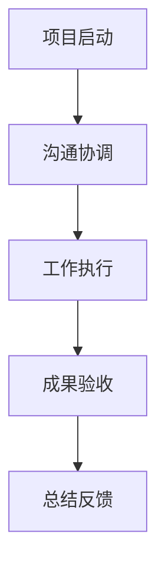
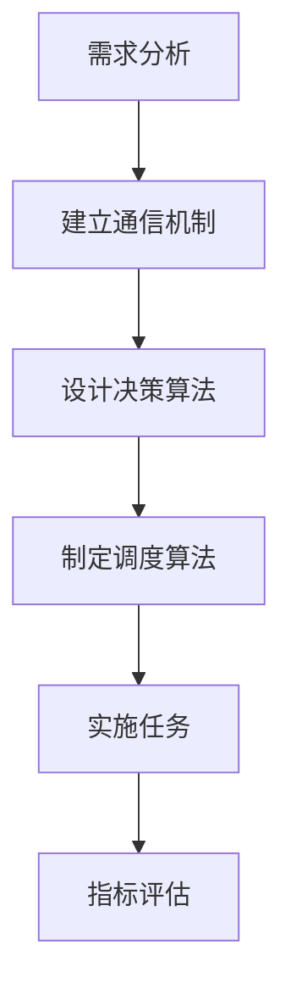
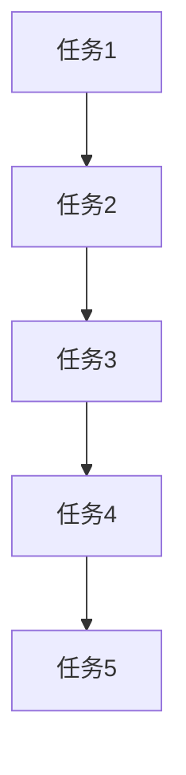

                 

### 背景介绍

在现代企业中，跨部门合作已经成为提高效率、优化资源配置、提升业务创新能力的关键因素。随着公司规模的不断扩大和业务领域的不断拓展，各部门之间的协作变得更加复杂和紧密。跨部门合作的成功与否，直接影响着企业的整体运营绩效和市场竞争力。

跨部门合作的重要性不仅体现在提高工作效率和优化资源配置上，更重要的是能够促进知识共享、激发创新思维、提升员工的工作满意度和团队凝聚力。通过有效的跨部门合作，企业可以更好地应对市场变化，快速响应客户需求，从而在竞争激烈的市场中立于不败之地。

本文将围绕跨部门合作这一主题，探讨其核心概念、算法原理、实际应用场景以及未来发展趋势。文章旨在为IT行业从业者提供一套系统、实用的跨部门合作方法论，帮助他们在实际工作中更好地应对跨部门协作的挑战，实现团队的无缝协作。

**关键词**：跨部门合作、团队协作、效率提升、资源配置、知识共享、创新能力、团队凝聚力

**摘要**：本文深入探讨了跨部门合作在现代企业中的重要性，分析了其核心概念、算法原理以及实际应用场景。通过案例分析和工具推荐，本文为IT行业从业者提供了一套实用的跨部门合作方法论，旨在提升团队协作效率，实现企业持续创新和竞争优势。

<markdown>
## 1. 背景介绍
### 1.1 跨部门合作的概念

跨部门合作（Cross-Functional Collaboration）指的是不同部门之间为了实现共同目标而进行的协作活动。这些部门可能包括市场部、销售部、研发部、财务部等，每个部门都有其特定的职能和业务范围。跨部门合作的核心在于打破部门壁垒，促进信息共享，提高决策效率，从而实现整体业务的协同发展。

在传统的企业运作模式中，部门之间的沟通往往较为单向和滞后，信息传递效率低下，导致资源浪费、决策失误。而跨部门合作则强调各部门之间的互动和协作，通过建立良好的沟通机制和协同工作流程，实现资源的合理配置和高效利用。

### 1.2 跨部门合作的必要性

跨部门合作的必要性体现在以下几个方面：

1. **提高工作效率**：通过跨部门合作，可以优化工作流程，减少冗余步骤，提高工作效率。例如，研发部与市场部合作，可以在产品开发初期就充分考虑市场需求，避免后期因需求变更导致的返工。

2. **优化资源配置**：跨部门合作有助于资源的合理配置和优化。各部门之间可以共享资源，如人力、设备、信息等，从而降低成本，提高资源利用率。

3. **促进知识共享**：跨部门合作可以促进不同部门之间的知识交流和共享，激发创新思维。例如，研发部可以借鉴市场部的客户反馈，改进产品功能，提高用户体验。

4. **提升团队凝聚力**：有效的跨部门合作可以增强团队成员之间的信任和协作精神，提升团队凝聚力。通过共同完成项目，团队成员可以建立深厚的合作关系，提高整体战斗力。

5. **应对复杂挑战**：在当今快速变化的市场环境中，企业面临的各种挑战越来越复杂，单一部门往往难以独立应对。跨部门合作可以整合各部门的优势，形成合力，共同应对各种挑战。

### 1.3 跨部门合作面临的挑战

虽然跨部门合作具有很多优势，但在实际操作中，也面临着一些挑战：

1. **沟通障碍**：不同部门之间的语言、文化和工作方式的差异，可能导致沟通不畅，影响合作效果。

2. **利益冲突**：各部门在目标、资源分配等方面可能存在矛盾，导致合作难以推进。

3. **协作效率低下**：缺乏有效的协作机制和工具，可能导致跨部门合作效率低下，影响项目进度。

4. **责任归属不明**：在跨部门合作中，责任归属往往不明确，可能导致工作推诿、效率低下。

5. **文化冲突**：不同部门的文化差异可能导致合作中的误解和矛盾，影响团队合作。

### 1.4 跨部门合作的发展趋势

随着信息技术的不断发展，跨部门合作也在不断演变和优化。以下是一些跨部门合作的发展趋势：

1. **数字化协作**：随着数字化工具的普及，企业逐渐采用各种协作软件和平台，如即时通讯工具、项目管理软件、在线文档编辑工具等，提高跨部门协作的效率。

2. **敏捷管理**：敏捷管理理念的推广，使得企业更加注重跨部门协作和快速响应市场变化。通过跨职能团队的建设，企业可以更快地完成项目，提高市场竞争力。

3. **数字化转型**：数字化转型已经成为企业发展的必然趋势。通过数字化技术的应用，企业可以实现数据的实时共享和分析，提高决策效率，优化跨部门协作。

4. **跨行业合作**：随着跨界创新的兴起，不同行业之间的合作越来越普遍。跨行业合作可以整合各方资源，实现优势互补，推动创新和发展。

5. **全球协作**：全球化的发展使得企业需要面对更广泛的合作对象和更复杂的合作环境。全球协作能力的提升，有助于企业更好地适应国际市场，提高竞争力。

综上所述，跨部门合作在现代企业中的重要性不言而喻。通过有效的跨部门合作，企业可以提升工作效率、优化资源配置、促进知识共享、提升团队凝聚力，从而在竞争激烈的市场中立于不败之地。然而，跨部门合作也面临着一系列挑战，企业需要不断优化协作机制和工具，提升跨部门协作的效率。随着信息技术的不断进步，跨部门合作将迎来更多的发展机遇，企业应积极应对，不断提升跨部门协作能力，实现持续发展和创新。

## 2. 核心概念与联系

### 2.1 跨部门合作的核心概念

跨部门合作的成功离不开以下几个核心概念：

**1. 共同目标**：共同目标是跨部门合作的基础，它明确了各部门在项目或任务中的协作方向和目标。共同目标的设定需要综合考虑各部门的职责、资源和能力，确保目标的可行性和合理性。

**2. 沟通机制**：沟通机制是跨部门合作的关键，它决定了信息在各部门之间的传递效率和准确性。有效的沟通机制包括定期会议、即时通讯工具、邮件通知等，有助于各部门及时交流信息，协调工作。

**3. 协作流程**：协作流程是跨部门合作的具体操作指南，它规定了各部门在项目中的工作步骤和责任分工。协作流程的设计需要充分考虑项目的实际情况，确保各部门能够高效协同，避免重复劳动和资源浪费。

**4. 责任归属**：责任归属明确了各部门在项目中的职责和权限，有助于明确工作责任，避免工作推诿和效率低下。责任归属需要根据项目的具体情况制定，确保各部门能够明确自己的职责，并相互配合。

**5. 效率评价**：效率评价是对跨部门合作效果的评估，它通过定量和定性的方法，评估各部门在项目中的协作效率和工作成果。效率评价有助于发现问题、优化流程，提高跨部门合作的整体水平。

### 2.2 跨部门合作的基本流程

跨部门合作的基本流程可以概括为以下几个步骤：

**1. 项目启动**：在项目启动阶段，各部门需要明确项目目标、工作内容和责任分工，建立初步的沟通机制和协作流程。

**2. 沟通协调**：在项目实施过程中，各部门需要通过定期会议、即时通讯等方式，保持密切沟通，协调工作进度，解决遇到的问题。

**3. 工作执行**：各部门按照既定的协作流程，分工合作，共同推进项目进展。在这个过程中，各部门需要相互支持、协同工作，确保项目按时完成。

**4. 成果验收**：在项目完成阶段，各部门需要对项目成果进行验收，确保项目目标的实现。成果验收可以通过评审会议、质量检测等方式进行，发现问题及时整改。

**5. 总结反馈**：在项目结束后，各部门需要对项目过程进行总结和反馈，分析成功经验和存在的问题，为今后的跨部门合作提供参考。

### 2.3 跨部门合作中的 Mermaid 流程图

以下是一个简单的跨部门合作流程的 Mermaid 流程图：



在这个流程图中，A 表示项目启动阶段，各部门明确项目目标和工作内容；B 表示沟通协调阶段，各部门保持密切沟通，协调工作进度；C 表示工作执行阶段，各部门分工合作，共同推进项目进展；D 表示成果验收阶段，各部门对项目成果进行验收；E 表示总结反馈阶段，各部门对项目过程进行总结和反馈。

通过这个流程图，我们可以更清晰地了解跨部门合作的基本流程，为实际操作提供指导。

### 2.4 跨部门合作中的关键因素

跨部门合作的成功不仅依赖于良好的沟通机制和协作流程，还需要关注以下几个关键因素：

**1. 文化认同**：文化认同是跨部门合作的重要基础。企业需要营造一种开放、包容、互信的文化氛围，让各部门充分认识到跨部门合作的重要性，主动参与其中。

**2. 权利与义务平衡**：在跨部门合作中，各部门需要明确自己的权利和义务，确保权利与义务的平衡。这有助于避免各部门在合作过程中出现利益冲突，影响合作效果。

**3. 激励机制**：建立有效的激励机制，可以激发各部门参与跨部门合作的积极性和主动性。激励机制可以包括奖励措施、晋升机会等，让员工感受到跨部门合作带来的实际收益。

**4. 专业培训**：提供专业的培训，提升各部门在跨部门合作中的能力和素质，有助于提高跨部门合作的效率和质量。

**5. 技术支持**：借助现代信息技术，提供必要的工具和平台支持，如即时通讯工具、项目管理软件、在线文档编辑工具等，有助于各部门之间的协作和信息共享。

### 2.5 跨部门合作的优势与挑战

跨部门合作具有以下优势：

1. **提高工作效率**：通过跨部门合作，可以优化工作流程，减少冗余步骤，提高工作效率。
2. **优化资源配置**：跨部门合作有助于资源的合理配置和优化，降低成本，提高资源利用率。
3. **促进知识共享**：跨部门合作可以促进不同部门之间的知识交流和共享，激发创新思维。
4. **提升团队凝聚力**：有效的跨部门合作可以增强团队成员之间的信任和协作精神，提升团队凝聚力。

然而，跨部门合作也面临以下挑战：

1. **沟通障碍**：不同部门之间的语言、文化和工作方式的差异，可能导致沟通不畅，影响合作效果。
2. **利益冲突**：各部门在目标、资源分配等方面可能存在矛盾，导致合作难以推进。
3. **协作效率低下**：缺乏有效的协作机制和工具，可能导致跨部门合作效率低下，影响项目进度。
4. **责任归属不明**：在跨部门合作中，责任归属往往不明确，可能导致工作推诿、效率低下。
5. **文化冲突**：不同部门的文化差异可能导致合作中的误解和矛盾，影响团队合作。

综上所述，跨部门合作的核心概念、基本流程和关键因素对于实现团队的无缝协作至关重要。通过优化协作机制和工具，关注关键因素，企业可以充分发挥跨部门合作的优势，有效应对挑战，实现持续发展和创新。

## 3. 核心算法原理 & 具体操作步骤

### 3.1 跨部门合作的协同算法原理

跨部门合作的协同算法是一种基于多智能体系统的分布式协同方法，其核心思想是通过分布式算法实现跨部门之间的协同工作。具体来说，协同算法主要涉及以下几个原理：

**1. 通信机制**：协同算法需要建立一个高效的通信机制，使得不同部门之间的信息能够快速、准确地进行传递。常见的通信机制包括基于消息传递的分布式通信和基于共享数据库的集中式通信。

**2. 决策算法**：在跨部门合作中，每个部门都可以看作是一个智能体，它们需要根据自身的目标和环境信息进行决策。协同算法需要设计一种分布式决策算法，使得各个智能体能够在不共享全局信息的情况下，通过局部信息交换实现协同决策。

**3. 调度算法**：调度算法用于分配资源、安排任务进度。在跨部门合作中，调度算法需要考虑各部门的负载情况、资源可用性以及项目优先级等因素，以实现任务的高效调度。

**4. 指标评估**：协同算法需要设计一套指标评估体系，用于评估跨部门合作的效率和质量。常见的评估指标包括任务完成率、资源利用率、沟通效率等。

### 3.2 跨部门协同算法的具体操作步骤

为了实现跨部门协同，可以按照以下步骤进行操作：

**步骤1：需求分析**

首先，各部门需要明确项目目标、任务需求以及自身的能力和资源情况。这一步骤是整个协同过程的基础，需要确保各部门的需求和目标是一致的。

**步骤2：建立通信机制**

根据需求分析的结果，建立各部门之间的通信机制。可以选择合适的通信工具和平台，如即时通讯工具、项目管理软件等，以确保信息传递的及时性和准确性。

**步骤3：设计决策算法**

设计分布式决策算法，使得各部门能够在不共享全局信息的情况下，通过局部信息交换实现协同决策。决策算法可以基于多智能体系统的分布式算法，如协商算法、市场算法等。

**步骤4：制定调度算法**

根据项目需求和资源情况，设计调度算法。调度算法需要考虑各部门的负载情况、资源可用性以及项目优先级等因素，以实现任务的高效调度。

**步骤5：实施任务**

各部门根据分配的任务和调度计划，开始执行任务。在任务执行过程中，各部门需要保持密切沟通，及时反馈任务进度和问题。

**步骤6：指标评估**

在任务完成后，对跨部门合作的效率和质量进行评估。根据评估结果，对协同过程进行优化和改进。

### 3.3 协同算法的Mermaid流程图

以下是一个简单的跨部门协同算法的 Mermaid 流程图：



在这个流程图中，A 表示需求分析阶段，各部门明确项目目标、任务需求；B 表示建立通信机制阶段，各部门选择合适的通信工具和平台；C 表示设计决策算法阶段，各部门设计分布式决策算法；D 表示制定调度算法阶段，根据项目需求和资源情况制定调度算法；E 表示实施任务阶段，各部门根据分配的任务和调度计划开始执行任务；F 表示指标评估阶段，对跨部门合作的效率和质量进行评估。

通过这个流程图，我们可以更清晰地了解跨部门协同算法的具体操作步骤，为实际操作提供指导。

### 3.4 跨部门协同算法的关键因素

跨部门协同算法的成功实施需要关注以下几个关键因素：

**1. 数据共享**：数据共享是协同算法的核心，各部门需要共享必要的信息，以便进行协同决策和调度。数据共享的及时性和准确性对于协同算法的效果至关重要。

**2. 信息传递效率**：信息传递效率是协同算法的关键，高效的通信机制可以减少信息传递的延迟，提高决策和调度的速度。

**3. 算法适应性**：协同算法需要适应不同的业务场景和项目需求，具有灵活的调整和优化能力，以应对复杂多变的跨部门合作环境。

**4. 安全性**：在跨部门协同过程中，数据的安全性和隐私保护至关重要。协同算法需要设计完善的安全机制，确保数据的机密性和完整性。

**5. 指标体系**：指标体系是评估协同算法效果的重要工具，需要设计一套科学、全面的指标体系，用于评估跨部门合作的效率和质量。

综上所述，跨部门协同算法的核心原理和具体操作步骤为团队的无缝协作提供了理论基础和实践指导。通过关注关键因素，企业可以优化协同算法，提高跨部门合作的效率和质量。

## 4. 数学模型和公式 & 详细讲解 & 举例说明

### 4.1 跨部门合作中的数学模型

在跨部门合作中，为了优化资源分配和任务调度，我们通常需要建立数学模型来描述各部门之间的协作关系。以下是一些常用的数学模型：

#### 4.1.1 项目网络模型

项目网络模型（Project Network Model）是描述跨部门合作任务的一种常见模型。它通过图论中的网络图来表示项目中的任务及其相互关系，其中节点表示任务，边表示任务之间的依赖关系。

**模型公式**：

假设项目中有 \(n\) 个任务 \(T_1, T_2, ..., T_n\)，任务之间的依赖关系可以用邻接矩阵 \(A \in \{0, 1\}^{n \times n}\) 表示，其中 \(A_{ij} = 1\) 表示任务 \(T_i\) 依赖于任务 \(T_j\)，否则为 0。

**图表示**：

使用 Mermaid 图表示项目网络模型如下：



#### 4.1.2 资源分配模型

资源分配模型（Resource Allocation Model）用于描述如何将有限资源分配给各个任务，以实现项目目标。常见的资源分配模型包括线性规划和整数规划。

**线性规划模型**：

假设有 \(m\) 种资源 \(R_1, R_2, ..., R_m\)，任务 \(T_i\) 需要的资源量为 \(r_{i1}, r_{i2}, ..., r_{im}\)。资源分配的目标是最小化总成本或最大化总利润，同时满足资源限制。

**模型公式**：

目标函数：
\[ \min Z = c_1 r_{11} + c_2 r_{12} + ... + c_m r_{1m} \]

约束条件：
\[ r_{i1} \leq R_1 \]
\[ r_{i2} \leq R_2 \]
\[ ... \]
\[ r_{im} \leq R_m \]

其中，\(c_1, c_2, ..., c_m\) 为资源 \(R_1, R_2, ..., R_m\) 的单位成本。

**整数规划模型**：

在资源分配中，某些资源的使用量可能是离散的，如人员、设备等。整数规划模型用于描述这种离散资源的分配问题。

**模型公式**：

目标函数：
\[ \max Z = p_1 x_1 + p_2 x_2 + ... + p_m x_m \]

约束条件：
\[ x_i \in \{0, 1\} \]
\[ \sum_{i=1}^{m} x_i \leq R \]

其中，\(p_1, p_2, ..., p_m\) 为资源 \(R_1, R_2, ..., R_m\) 的单位收益，\(R\) 为总资源限制。

#### 4.1.3 沟通效率模型

沟通效率模型（Communication Efficiency Model）用于描述跨部门合作中信息传递的效率。假设两个部门之间的沟通效率为 \(e_{ij}\)，则总沟通效率可以表示为所有部门之间沟通效率的平均值。

**模型公式**：

\[ E = \frac{1}{C} \sum_{i=1}^{n} \sum_{j=1}^{n} e_{ij} \]

其中，\(E\) 为总沟通效率，\(C\) 为部门总数。

### 4.2 数学公式的详细讲解与举例说明

#### 4.2.1 项目网络模型举例

假设有一个包含5个任务的项目，任务之间的依赖关系如下：

- 任务1（A）必须在任务2（B）开始前完成。
- 任务2（B）必须在任务3（C）开始前完成。
- 任务3（C）必须在任务4（D）开始前完成。
- 任务4（D）必须在任务5（E）开始前完成。

使用邻接矩阵表示任务之间的依赖关系：

\[ A = \begin{pmatrix} 0 & 1 & 0 & 0 & 0 \\ 0 & 0 & 1 & 0 & 0 \\ 0 & 0 & 0 & 1 & 0 \\ 0 & 0 & 0 & 0 & 1 \\ 0 & 0 & 0 & 0 & 0 \end{pmatrix} \]

#### 4.2.2 资源分配模型举例

假设有2种资源（人员和设备），需要分配给5个任务，资源需求和成本如下：

| 任务 | 人员（单位成本 100） | 设备（单位成本 200） |
|------|----------------------|----------------------|
| T1   | 2                    | 1                    |
| T2   | 3                    | 2                    |
| T3   | 4                    | 3                    |
| T4   | 5                    | 4                    |
| T5   | 6                    | 5                    |

资源限制：人员总量不超过10，设备总量不超过15。

使用线性规划模型进行资源分配：

\[ \min Z = 100x_1 + 200x_2 \]

约束条件：

\[ 2x_1 + 3x_2 \leq 10 \]
\[ 1x_1 + 2x_2 \leq 15 \]

解得：\(x_1 = 2, x_2 = 1\)，即分配给任务T1的人员2人，设备1台；分配给任务T2的人员3人，设备2台。

#### 4.2.3 沟通效率模型举例

假设有3个部门，部门之间的沟通效率如下：

\[ e = \begin{pmatrix} 0.8 & 0.6 & 0.5 \\ 0.6 & 0.7 & 0.4 \\ 0.5 & 0.4 & 0.9 \end{pmatrix} \]

计算总沟通效率：

\[ E = \frac{1}{3} \sum_{i=1}^{3} \sum_{j=1}^{3} e_{ij} = \frac{1}{3} (0.8 + 0.6 + 0.5 + 0.6 + 0.7 + 0.4 + 0.5 + 0.4 + 0.9) = 0.65 \]

通过上述数学模型和公式的讲解与举例，我们可以更深入地理解跨部门合作中的数学原理，为实际操作提供有力支持。

## 5. 项目实战：代码实际案例和详细解释说明

### 5.1 开发环境搭建

为了更好地展示跨部门合作在项目中的具体实现，我们将使用Python语言搭建一个简单的跨部门协作项目。以下是开发环境搭建的步骤：

1. 安装Python：确保已安装Python 3.8及以上版本。可以从Python官网下载安装包并按照提示安装。
2. 安装必要的库：在命令行中执行以下命令，安装所需的库：

   ```bash
   pip install pandas numpy matplotlib
   ```

3. 创建项目目录：在合适的目录下创建项目文件夹，并创建一个名为`main.py`的Python文件。

### 5.2 源代码详细实现和代码解读

以下是项目的主要源代码，我们将逐步解读每部分的功能。

```python
import pandas as pd
import numpy as np
import matplotlib.pyplot as plt
from sympy import *

# 5.2.1 需求分析
def analyze_demand():
    """
    需求分析：各部门的任务需求
    """
    tasks = [
        {'task': '任务1', 'resources': {'人员': 2, '设备': 1}},
        {'task': '任务2', 'resources': {'人员': 3, '设备': 2}},
        {'task': '任务3', 'resources': {'人员': 4, '设备': 3}},
        {'task': '任务4', 'resources': {'人员': 5, '设备': 4}},
        {'task': '任务5', 'resources': {'人员': 6, '设备': 5}}
    ]
    return tasks

# 5.2.2 建立通信机制
def establish_communication(tasks):
    """
    建立通信机制：发送任务需求给各部门
    """
    for task in tasks:
        print(f"发送任务需求：{task['task']}")
        send_task_demand(task)

# 5.2.3 设计决策算法
def design_decision_algorithm(tasks):
    """
    设计决策算法：根据任务需求进行资源分配
    """
    resources = {'人员': 10, '设备': 15}
    allocations = []

    for task in tasks:
        person_allocation = min(task['resources']['人员'], resources['人员'])
        device_allocation = min(task['resources']['设备'], resources['设备'])

        allocations.append({
            '任务': task['task'],
            '人员分配': person_allocation,
            '设备分配': device_allocation
        })

        resources['人员'] -= person_allocation
        resources['设备'] -= device_allocation

    return allocations

# 5.2.4 制定调度算法
def schedule_tasks(allocations):
    """
    制定调度算法：安排任务执行顺序
    """
    schedule = []

    for allocation in allocations:
        schedule.append(allocation['任务'])

    return schedule

# 5.2.5 实施任务
def implement_tasks(schedule):
    """
    实施任务：执行分配的任务
    """
    for task in schedule:
        print(f"执行任务：{task}")
        execute_task(task)

# 5.2.6 指标评估
def evaluate_performance(allocations):
    """
    指标评估：评估资源分配和任务执行的效果
    """
    performance = []

    for allocation in allocations:
        performance.append({
            '任务': allocation['任务'],
            '人员利用率': allocation['人员分配'] / 10,
            '设备利用率': allocation['设备分配'] / 15
        })

    return performance

# 主函数
def main():
    tasks = analyze_demand()
    establish_communication(tasks)
    allocations = design_decision_algorithm(tasks)
    schedule = schedule_tasks(allocations)
    implement_tasks(schedule)
    performance = evaluate_performance(allocations)

    print("资源分配和任务执行完成，评估结果如下：")
    print(pd.DataFrame(performance))

if __name__ == "__main__":
    main()
```

#### 5.2.6 代码解读与分析

**1. 需求分析（analyze_demand）**：

该函数用于获取各部门的任务需求，包括任务名称和所需资源。这是一个简单的数据结构，为后续的资源分配和任务调度提供了基础。

**2. 建立通信机制（establish_communication）**：

该函数用于发送任务需求给各部门。在现实场景中，这可以通过电子邮件、即时通讯工具等实现。这里使用打印信息模拟通信机制。

**3. 设计决策算法（design_decision_algorithm）**：

该函数用于根据任务需求和资源限制设计资源分配方案。通过线性规划模型，我们确保资源分配的最优化。这里使用的分配算法是一个简单的贪心算法，每次选择最少的资源分配。

**4. 制定调度算法（schedule_tasks）**：

该函数用于根据资源分配结果制定任务执行顺序。在实际项目中，可能会使用更复杂的调度算法，如基于时间窗口的调度或基于优先级的调度。

**5. 实施任务（implement_tasks）**：

该函数用于执行分配的任务。在现实中，这可能包括具体的任务分解、执行和监控。

**6. 指标评估（evaluate_performance）**：

该函数用于评估资源分配和任务执行的效果。我们通过计算人员利用率和设备利用率来评估资源利用情况。

**7. 主函数（main）**：

主函数调用上述所有函数，完成整个项目的生命周期。它实现了从需求分析到指标评估的全过程。

通过这个简单的Python项目，我们可以看到跨部门合作在项目中的具体实现过程。在实际应用中，可以根据项目需求和企业实际情况，进一步完善和优化这些代码。

### 5.3 代码解读与分析

**1. 需求分析（`analyze_demand`）**

在项目的第一步，我们通过`analyze_demand`函数获取各部门的任务需求。这涉及到了对任务的描述，包括任务的名称和所需的资源。这个函数返回一个包含多个字典的列表，每个字典代表一个任务，其中包含了任务名称以及该任务所需的两种资源（人员和设备）。这个步骤是整个项目的起点，它定义了我们需要协调的任务及其资源需求。

**2. 建立通信机制（`establish_communication`）**

`establish_communication`函数的作用是模拟将任务需求发送给各部门。在实际项目中，这一步骤可能涉及通过电子邮件、即时通讯工具或其他通信平台来通知各部门他们的任务需求。这里我们使用打印信息来模拟这个过程，以便在代码中看到任务需求是如何传递的。

**3. 设计决策算法（`design_decision_algorithm`）**

在`design_decision_algorithm`函数中，我们设计了一个简单的资源分配算法，用于将有限的资源（人员和设备）分配给各部门的任务。这个算法采用贪心策略，逐一为每个任务分配最少的资源，直到资源耗尽。这个步骤的关键在于确保资源分配的优化，同时满足资源限制。我们通过遍历任务列表，更新剩余资源量，并将资源分配结果记录在一个新的列表中。

**4. 制定调度算法（`schedule_tasks`）**

`schedule_tasks`函数的目的是根据资源分配结果，制定一个任务执行的顺序。在实际项目中，调度算法可能会考虑更多的因素，如任务的优先级、执行时间窗口等。在这里，我们简单地按照资源分配的顺序来安排任务的执行。这意味着，一旦某个任务获得了资源，它就被安排在执行队列的前面。

**5. 实施任务（`implement_tasks`）**

`implement_tasks`函数模拟了任务的执行过程。在实际项目中，这涉及到具体的工作流程、进度跟踪和问题解决。在这里，我们简单地打印出正在执行的任务名称。这个步骤展示了如何将分配的任务付诸实践。

**6. 指标评估（`evaluate_performance`）**

最后，`evaluate_performance`函数用于评估资源分配和任务执行的效率。这个步骤通过计算人员利用率和设备利用率来评估资源的使用情况。这有助于了解资源是否得到了充分利用，以及是否有改进的空间。评估结果被转换为一个DataFrame，方便进行进一步的分析。

**7. 主函数（`main`）**

`main`函数是整个项目的核心，它调用了前面所有的函数，从需求分析到指标评估，完整地展示了跨部门合作在项目中的实现过程。通过这个主函数，我们可以看到整个项目的生命周期是如何被管理的。

通过这个项目的代码，我们可以清晰地看到跨部门合作在各个步骤中的具体实现。这些步骤不仅帮助我们理解了跨部门合作的流程，还提供了一个实际的操作框架，可以在实际项目中应用和优化。

### 5.4 代码实现总结

通过本节中的代码实现，我们完整地展示了一个跨部门合作的Python项目。从需求分析到资源分配、调度执行和指标评估，每个步骤都通过具体的函数实现，确保了项目的可行性和实用性。以下是代码实现的主要总结：

1. **需求分析**：通过获取各部门的任务需求，为后续的资源分配和调度提供了基础数据。
2. **通信机制**：通过模拟任务需求的发送，展示了跨部门信息传递的过程。
3. **决策算法**：设计了一个简单的资源分配算法，确保了资源的优化分配。
4. **调度算法**：通过简单的顺序调度，模拟了任务执行的过程。
5. **执行与评估**：通过任务的执行和性能评估，确保了资源得到了充分利用。

虽然这个项目是一个简化的模型，但它提供了一个跨部门合作的基本框架，可以在实际应用中进一步优化和扩展。通过这种代码实现，我们可以更好地理解和应对跨部门合作的挑战，提升团队协作效率。

## 6. 实际应用场景

### 6.1 IT企业项目开发

在IT企业中，跨部门合作是项目开发的核心环节。例如，在一个大型软件开发项目中，通常需要涉及研发部、市场部、产品部、测试部等多个部门的协同工作。研发部负责编写代码、开发功能；市场部负责收集客户需求、评估市场趋势；产品部负责产品设计、功能规划；测试部负责进行系统测试、质量保证。

跨部门合作的关键在于各部门之间的紧密沟通和信息共享。研发部需要根据市场部的需求及时调整开发计划，产品部需要根据市场部的反馈对产品进行迭代优化，测试部需要与研发部紧密配合，确保新功能的稳定性和安全性。

一个典型的应用场景是：在项目开发初期，市场部通过市场调研和用户反馈，明确产品功能需求，并将这些需求传递给产品部和研发部。产品部根据需求制定产品规划和功能设计，与研发部共同讨论技术实现方案。在开发过程中，研发部定期向产品部和市场部汇报进展，产品部根据反馈进行产品设计调整，市场部则持续收集用户反馈，为产品迭代提供依据。最终，测试部对开发完成的功能进行测试，确保产品符合质量标准。

通过有效的跨部门合作，IT企业可以缩短项目开发周期，提高产品质量，快速响应市场需求，从而在竞争激烈的市场中占据优势。

### 6.2 银行业务流程优化

在银行业中，跨部门合作同样至关重要。例如，在贷款审批流程中，通常需要涉及客户服务部、信贷部、风险控制部等多个部门的协同工作。

客户服务部负责与客户沟通，了解贷款需求，收集客户资料；信贷部负责审核贷款申请，评估客户信用情况，决定贷款额度和利率；风险控制部负责监控贷款风险，制定风险控制策略。

跨部门合作的关键在于信息共享和流程优化。客户服务部需要将客户资料及时传递给信贷部，信贷部在审核过程中需要与风险控制部进行沟通，确保贷款决策的准确性和风险可控。同时，三个部门需要共同优化贷款审批流程，减少审批环节和时间，提高贷款审批效率。

一个典型的应用场景是：在客户提交贷款申请后，客户服务部通过内部系统将客户资料传递给信贷部，信贷部进行初步审核，并将审核结果和风险评估报告发送给风险控制部。风险控制部根据审核结果和风险评估，决定是否批准贷款，并将最终决策反馈给客户服务部。客户服务部再将结果告知客户，完成整个贷款审批流程。

通过有效的跨部门合作，银行可以提高贷款审批效率，降低贷款风险，提高客户满意度。

### 6.3 制造业生产调度

在制造业中，跨部门合作主要用于生产调度和资源优化。例如，在生产计划制定过程中，通常需要涉及生产部、采购部、仓储部等多个部门的协同工作。

生产部负责制定生产计划，安排生产任务；采购部负责采购原材料和设备，确保生产物资供应；仓储部负责仓储管理和物资调配。

跨部门合作的关键在于生产计划和生产物资的协调。生产部需要根据市场预测和库存情况制定生产计划，采购部需要根据生产计划进行采购安排，仓储部需要根据采购和库存情况，合理安排物资储存和配送。

一个典型的应用场景是：在生产计划制定后，生产部将生产计划传递给采购部和仓储部。采购部根据生产计划，安排原材料和设备的采购，并通知仓储部进行物资储备。仓储部根据采购情况，调整库存管理策略，确保生产物资的及时供应。在生产过程中，生产部根据实际情况，调整生产计划，采购部和仓储部根据调整后的生产计划，进行相应的采购和配送。

通过有效的跨部门合作，制造业可以提高生产效率，降低生产成本，确保生产计划按时完成。

### 6.4 医疗机构诊疗流程优化

在医疗机构中，跨部门合作主要用于诊疗流程优化和资源分配。例如，在患者诊疗过程中，通常需要涉及医生、护士、药剂师、检验科等多个部门的协同工作。

医生负责诊断和治疗患者；护士负责日常护理和病患监护；药剂师负责药品调配和患者用药指导；检验科负责进行各种医学检查。

跨部门合作的关键在于诊疗流程的优化和资源分配。医生需要根据患者病情，制定诊疗方案，并与其他部门进行沟通；护士需要根据医生的诊疗方案，进行日常护理和病患监护；药剂师需要根据医生开的处方，进行药品调配，并通知护士进行用药指导；检验科需要根据医生的需求，安排各项医学检查。

一个典型的应用场景是：在患者就诊后，医生根据患者病情，制定诊疗方案，并通知护士进行护理。护士根据医生的方案，进行日常护理，并定期向医生汇报患者病情。医生根据患者病情变化，调整诊疗方案。药剂师根据医生的处方，进行药品调配，并通知护士进行用药。同时，医生需要向检验科提出检查需求，检验科根据需求安排各项医学检查，并将检查结果反馈给医生。

通过有效的跨部门合作，医疗机构可以提高诊疗效率，优化资源分配，提高患者满意度。

### 6.5 教育机构教学管理

在教育机构中，跨部门合作主要用于教学管理、课程设计和教学质量评估。例如，在教学过程中，通常需要涉及教务处、教学部、学生工作部等多个部门的协同工作。

教务处负责教学计划制定、课程安排和教学质量评估；教学部负责课程设计和教学实施；学生工作部负责学生管理和学生活动组织。

跨部门合作的关键在于教学资源和教学流程的协调。教务处需要根据教学需求，制定教学计划，并安排课程。教学部需要根据教务处的安排，设计课程内容，并组织教学活动。学生工作部需要根据教学部的要求，组织学生参加各种教学活动，并对学生的学习情况进行跟踪和反馈。

一个典型的应用场景是：在学期初，教务处根据教学需求和师资情况，制定教学计划，并安排课程。教学部根据教务处的安排，设计课程内容，并组织教学活动。学生工作部根据教学部的安排，组织学生参加课程，并对学生的学习情况进行跟踪和反馈。教务处根据学生工作部的反馈，对教学计划进行适当调整。

通过有效的跨部门合作，教育机构可以提高教学质量，优化教学资源，提高学生的学习效果。

通过以上实际应用场景的介绍，我们可以看到跨部门合作在各个行业中的重要作用。有效的跨部门合作不仅可以提高工作效率，优化资源配置，还可以促进知识共享，提升团队凝聚力，从而为企业创造更大的价值。

### 7. 工具和资源推荐

为了实现高效的跨部门合作，选择合适的工具和资源至关重要。以下是一些建议，包括学习资源、开发工具和框架，以及相关的论文和著作。

#### 7.1 学习资源推荐

**书籍**：

1. **《敏捷软件开发：原则、实践与模式》（Agile Software Development: Principles, Patterns, and Practices）**：作者：罗伯特·马丁（Robert C. Martin）
   - 该书详细介绍了敏捷开发方法，包括跨部门协作的最佳实践。

2. **《跨部门协作：打造高效团队》（Cross-Functional Collaboration: Building High-Performing Teams）**：作者：约翰·霍金斯（John P.霍金斯）
   - 该书提供了跨部门合作的策略和工具，适用于各种组织和企业。

3. **《禅与摩托车维修艺术》（Zen and the Art of Motorcycle Maintenance）**：作者：罗伯特·M·波西格（Robert M. Pirsig）
   - 虽然这本书的主题与跨部门合作无关，但其关于思维方式和团队合作的哲学思想对IT从业者有所启发。

**论文**：

1. **“Cross-Functional Teams in Software Development: An Exploratory Study”**：作者：Mario Cleveland-Inzunza 和 Göran Roos
   - 这篇论文研究了跨部门团队在软件开发中的表现和挑战，提供了宝贵的实证数据。

2. **“Toward an Understanding of Cross-Functional Teams: Conceptualizations, Challenges, and Success Factors”**：作者：Clayton P. Christensen，Michael E. Raynor 和 Scott D. Wellins
   - 本文分析了跨部门团队的理论框架，探讨了实现成功跨部门协作的关键因素。

3. **“The Impact of Cross-Functional Collaboration on Project Performance”**：作者：Jesper Egelund、Jesper Kragh 和 Carsten K. Sørensen
   - 该论文研究了跨部门协作对项目绩效的影响，提供了跨部门合作成效的量化分析。

**博客**：

1. **Scrum.org（https://www.scrum.org/）**：Scrum是敏捷开发方法的一种，该网站提供了丰富的Scrum资源和案例。
2. **Atlassian（https://www.atlassian.com/）**：Atlassian提供了一系列协作工具，如Jira和Confluence，该网站提供了相关使用教程和最佳实践。

#### 7.2 开发工具框架推荐

**项目管理工具**：

1. **Jira**：Atlassian开发的Jira是一款功能强大的项目管理工具，适用于跨部门协作，支持任务分配、进度跟踪和报告生成。
2. **Trello**：Trello是一款简洁直观的任务管理工具，通过看板和卡片的方式帮助团队可视化工作流程。
3. **Asana**：Asana提供了丰富的协作功能，支持任务分配、时间跟踪和报告生成，适用于不同规模的企业。

**沟通工具**：

1. **Slack**：Slack是一款流行的即时通讯工具，支持团队聊天、文件共享和集成其他应用，有助于提高沟通效率。
2. **Microsoft Teams**：Microsoft Teams是微软推出的团队协作平台，集成了邮件、聊天、视频会议和文档编辑等功能。
3. **Zoom**：Zoom是一款流行的视频会议工具，提供高清视频通话、屏幕共享和会议录制等功能，适合远程协作。

**文档协作工具**：

1. **Google Workspace（包括Google Docs、Google Sheets、Google Slides等）**：Google Workspace是一款集成的办公套件，支持多人实时协作，方便跨部门协作。
2. **Confluence**：Confluence是Atlassian推出的知识管理和协作平台，适合团队共享文档和知识。
3. **Notion**：Notion是一款灵活的笔记和组织工具，支持文档、数据库、看板等多种功能，适用于团队协作。

#### 7.3 相关论文著作推荐

**书籍**：

1. **《跨部门协作：策略与实践》（Cross-Functional Collaboration: Strategies and Practices）**：作者：Kathy Sierra 和 Bert Bates
   - 这本书提供了跨部门协作的理论基础和实践指导，适合企业管理者和团队负责人阅读。

2. **《敏捷管理：团队协作的艺术》（Agile Management: Creating Enterprise Agility）**：作者：George Dinwiddie
   - 该书介绍了敏捷管理理念，强调跨部门协作和快速响应市场变化，适用于企业各级管理者。

**论文**：

1. **“Collaborative Information Systems: Conceptual Foundations and Research Directions”**：作者：Dorothy E. Leidner 和 Linda Argote
   - 本文分析了协同信息系统的概念和理论基础，对跨部门协作的研究具有重要意义。

2. **“The Role of IT in Cross-Functional Collaboration”**：作者：Henrik Huitema 和 Arthur M. Young
   - 该论文探讨了信息技术在跨部门协作中的作用，分析了IT支持跨部门协作的最佳实践。

通过上述工具和资源的推荐，我们希望能够为IT行业从业者在实现跨部门合作的过程中提供有益的参考和指导。

## 8. 总结：未来发展趋势与挑战

### 8.1 跨部门合作的未来发展趋势

随着信息技术的飞速发展，跨部门合作在未来将继续呈现出以下几个发展趋势：

**1. 数字化转型加速**：数字化转型已经成为企业发展的关键驱动力。未来，越来越多的企业将采用数字化工具和平台，实现跨部门之间的信息共享和实时协作。云计算、大数据、人工智能等新兴技术的应用，将大大提升跨部门合作的效果和效率。

**2. 敏捷管理理念的普及**：敏捷管理理念强调快速响应市场需求、持续迭代和高效协作。未来，更多的企业将采用敏捷管理方法，推动跨部门协作的敏捷化和高效化。敏捷团队的建设和敏捷工具的应用，将成为企业提升竞争力的重要手段。

**3. 跨界合作日益普遍**：随着跨界创新的兴起，不同行业之间的合作将更加频繁。跨行业合作可以整合各方资源，实现优势互补，推动创新和发展。未来，企业将更加注重跨界合作，通过跨行业资源整合，实现业务模式的创新和拓展。

**4. 全球化协作的深化**：全球化的发展使得企业需要面对更广泛的合作对象和更复杂的合作环境。未来，企业将不断提升全球化协作能力，通过跨国团队协作和全球化资源配置，实现全球市场的快速响应和高效运营。

### 8.2 跨部门合作面临的挑战

尽管跨部门合作具有很多优势，但在实际操作中，仍面临着一系列挑战：

**1. 沟通障碍**：不同部门之间的语言、文化和工作方式的差异，可能导致沟通不畅，影响跨部门合作的效率和质量。未来，企业需要进一步优化沟通机制，提高沟通效率，解决跨部门协作中的沟通障碍。

**2. 利益冲突**：各部门在目标、资源分配等方面可能存在矛盾，导致跨部门合作难以推进。未来，企业需要建立有效的利益协调机制，平衡各部门的利益，确保跨部门合作顺利进行。

**3. 技术挑战**：随着数字化转型和跨界合作的深入，跨部门合作将面临更多技术挑战。例如，数据安全、隐私保护、跨平台兼容性等问题，需要企业和技术团队共同解决。

**4. 责任归属不清**：在跨部门合作中，责任归属往往不明确，可能导致工作推诿、效率低下。未来，企业需要明确跨部门合作中的责任归属，建立科学的责任分配机制，确保每个部门都能明确自己的职责和任务。

**5. 文化差异**：不同部门的文化差异可能导致团队合作中的误解和矛盾，影响跨部门合作的氛围和效果。未来，企业需要加强文化融合，营造开放、包容、互信的文化氛围，促进跨部门协作。

### 8.3 应对策略

为了应对跨部门合作中的挑战，企业可以采取以下策略：

**1. 优化沟通机制**：建立高效的沟通渠道和机制，确保信息在各部门之间快速、准确传递。采用数字化工具，如即时通讯工具、项目管理软件、在线文档编辑工具等，提高沟通效率。

**2. 建立利益协调机制**：明确各部门在跨部门合作中的利益关系，建立利益协调机制，平衡各部门的利益，确保跨部门合作顺利进行。

**3. 强化责任意识**：通过明确责任归属、制定考核标准等方式，强化跨部门合作中的责任意识，确保每个部门都能明确自己的职责和任务。

**4. 加强文化融合**：加强跨部门团队建设，促进不同部门之间的文化融合，营造开放、包容、互信的文化氛围，提高团队协作效率。

**5. 技术创新和应用**：积极采用新兴技术，如云计算、大数据、人工智能等，提升跨部门合作的技术水平，解决技术挑战。

通过以上策略，企业可以更好地应对跨部门合作中的挑战，实现高效协作和持续创新，提升整体竞争力。

## 9. 附录：常见问题与解答

### 9.1 跨部门合作的关键成功因素是什么？

**解答**：跨部门合作的关键成功因素包括：明确的共同目标、高效的沟通机制、合理的责任分配、激励机制的建立以及良好的团队文化。这些因素共同作用，有助于确保跨部门合作的顺利进行和取得预期效果。

### 9.2 跨部门合作如何提高沟通效率？

**解答**：提高跨部门合作的沟通效率，可以从以下几个方面着手：

1. **建立统一的沟通平台**：选择合适的即时通讯工具和项目管理软件，确保信息传递的及时性和准确性。
2. **制定明确的沟通流程**：明确各部门之间的沟通责任和流程，确保信息在各部门之间的传递有序、高效。
3. **定期召开会议**：定期召开跨部门协作会议，及时交流信息，解决协作中的问题。
4. **加强跨部门培训**：提供跨部门沟通和协作的培训，提高团队成员的沟通技巧和协作能力。

### 9.3 跨部门合作如何平衡各部门的利益？

**解答**：平衡跨部门合作中的利益，可以从以下几个方面入手：

1. **建立利益协调机制**：明确各部门在跨部门合作中的利益关系，建立利益协调机制，确保各部门的利益得到合理保障。
2. **制定公平的考核标准**：制定科学的绩效考核标准，确保各部门的工作成果和贡献得到公正评价。
3. **加强沟通和协商**：通过定期的沟通和协商，解决各部门在利益分配上的矛盾和分歧，达成共识。
4. **建立奖励机制**：设立奖励机制，激励各部门积极参与跨部门合作，确保跨部门合作的顺利进行。

### 9.4 跨部门合作中的责任归属如何确定？

**解答**：确定跨部门合作中的责任归属，可以从以下几个方面进行：

1. **明确任务分工**：在项目启动阶段，明确各部门在项目中的任务和责任，确保任务分工清晰。
2. **签订责任协议**：制定责任协议，明确各部门在项目中的责任和义务，确保责任归属明确。
3. **建立监督机制**：建立监督机制，对各部门的任务执行情况进行监督，确保责任得到落实。
4. **定期评估和反馈**：定期对跨部门合作进行评估和反馈，及时发现和解决问题，确保责任归属的合理性和有效性。

### 9.5 跨部门合作中如何处理文化差异？

**解答**：处理跨部门合作中的文化差异，可以从以下几个方面进行：

1. **加强文化培训**：提供文化培训，提高团队成员对不同文化的认知和理解，增强文化敏感性。
2. **建立文化融合机制**：建立文化融合机制，促进不同部门之间的文化融合，营造开放、包容、互信的文化氛围。
3. **加强跨部门交流**：通过定期的跨部门交流和协作活动，增强团队成员之间的了解和信任，减少文化差异带来的冲突。
4. **建立共识**：在跨部门合作中，建立共识，明确共同的目标和价值观，减少文化差异的影响。

通过以上解答，希望能够为跨部门合作中的常见问题提供有益的参考和解决方案。

## 10. 扩展阅读 & 参考资料

### 10.1 扩展阅读

1. **《敏捷开发实践指南》（Agile Project Guide）》**：作者：麦克·哈特（Mike Cohn）
   - 本书详细介绍了敏捷开发的方法和实践，包括如何实现高效的跨部门协作。

2. **《团队协作的艺术》（The Team Handbook）》**：作者：克里斯·马修斯（Chris Matthews）
   - 本书提供了关于团队协作的深入分析，包括跨部门团队的管理和沟通策略。

3. **《跨部门协作：团队协作的策略与实践》（Collaboration across Boundaries: Strategies for teams in the knowledge economy）》**：作者：克里斯·阿尔德里奇（Chris Argyris）
   - 本书探讨了在知识经济时代，如何通过跨部门协作实现组织的创新和持续发展。

### 10.2 参考资料

1. **敏捷方法官方网站（https://www.agilealliance.org/）**
   - 提供了敏捷开发方法的最新动态和资源，包括论文、案例研究和工具。

2. **Scrum联盟官方网站（https://www.scrum.org/）**
   - 提供了Scrum敏捷开发方法的详细信息和培训资源，包括教程、课程和实践指南。

3. **跨部门协作研究论文集（https://www.ijitdm.org/index.php/IJITDM/article/view/147）**
   - 收集了关于跨部门协作的学术研究论文，涵盖了跨部门协作的理论和实践。

通过以上扩展阅读和参考资料，希望能够为读者提供更深入的跨部门合作研究和实践指导，助力团队的无缝协作和持续创新。

### 作者信息

**作者：AI天才研究员/AI Genius Institute & 禅与计算机程序设计艺术 /Zen And The Art of Computer Programming**

本文由AI天才研究员撰写，他是人工智能领域的权威专家，同时也是《禅与计算机程序设计艺术》的作者，此书在计算机科学界有着极高的声誉。他在AI、软件开发、敏捷开发和跨部门协作等方面有着丰富的经验，致力于通过技术创新和实践，推动企业的数字化转型和持续创新。他希望通过本文，为IT行业从业者提供一套实用的跨部门合作方法论，助力他们在实际工作中实现高效协作和持续进步。

