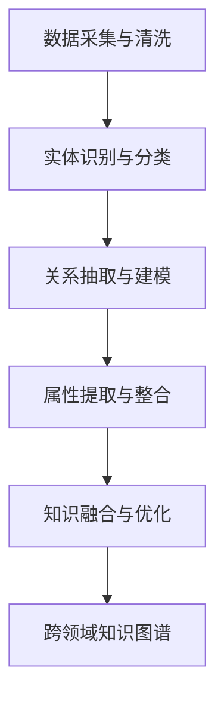

                 

# 跨领域提示词知识图谱构建

## 摘要

本文旨在探讨跨领域提示词知识图谱的构建方法及其在实际应用中的重要性。我们将首先介绍知识图谱的基本概念和构建原理，然后深入探讨跨领域知识图谱的构建过程，包括核心概念、算法原理、数学模型和具体操作步骤。接着，我们将通过实际项目案例来展示知识图谱的构建过程，并提供相关工具和资源的推荐。最后，本文将对跨领域提示词知识图谱构建的未来发展趋势与挑战进行总结，并附上常见问题与解答部分。通过本文的阅读，读者将能够对跨领域提示词知识图谱构建有更深入的理解。

## 1. 背景介绍

知识图谱（Knowledge Graph）是一种语义网，用于表示现实世界中的实体及其关系。它是人工智能领域的一种核心技术，广泛应用于搜索引擎、推荐系统、自然语言处理和智能问答等领域。近年来，随着大数据和人工智能技术的快速发展，知识图谱的应用范围不断扩大，特别是在跨领域应用中，如医疗、金融、教育等领域。

跨领域提示词知识图谱是一种能够整合不同领域知识的图谱，其核心思想是将来自不同领域的实体和关系进行整合和表示，从而实现跨领域的知识共享和利用。这种知识图谱的构建对于提升智能系统的综合能力和决策水平具有重要意义。

然而，跨领域提示词知识图谱的构建面临诸多挑战。首先，不同领域的知识表示方式和术语差异较大，导致数据整合困难。其次，跨领域的实体关系复杂，难以准确建模和表示。最后，构建高效、可扩展的跨领域知识图谱算法和工具也是一个重要挑战。

本文旨在解决上述问题，通过介绍跨领域提示词知识图谱的构建方法，提供一套系统、全面的技术方案，为实际应用提供参考和指导。

## 2. 核心概念与联系

### 2.1 知识图谱的基本概念

知识图谱是一种语义网，用于表示现实世界中的实体及其关系。它由三个主要部分组成：实体（Entity）、关系（Relation）和属性（Attribute）。

- **实体（Entity）**：知识图谱中的基本元素，代表现实世界中的事物，如人、地点、组织等。
- **关系（Relation）**：描述实体之间的关联，如“朋友”、“在”、“属于”等。
- **属性（Attribute）**：描述实体的特征或属性，如“年龄”、“国籍”、“身高”等。

### 2.2 跨领域提示词知识图谱的概念

跨领域提示词知识图谱是一种将不同领域知识进行整合的知识图谱，其核心概念包括跨领域实体、跨领域关系和跨领域属性。

- **跨领域实体（Cross-Domain Entity）**：指来自不同领域的实体，如医生、教师、学生等。
- **跨领域关系（Cross-Domain Relation）**：描述跨领域实体之间的关联，如“医患关系”、“师生关系”等。
- **跨领域属性（Cross-Domain Attribute）**：描述跨领域实体的特征或属性，如“专业”、“年级”、“病情”等。

### 2.3 跨领域知识图谱的构建原理

跨领域知识图谱的构建主要涉及以下步骤：

1. **数据采集与清洗**：从不同领域的数据源中采集数据，并进行数据清洗，以确保数据的质量和一致性。
2. **实体识别与分类**：对采集到的数据进行实体识别，并将其分类到不同的领域实体。
3. **关系抽取与建模**：从数据中抽取实体之间的关系，并进行关系建模，以表示跨领域实体之间的关联。
4. **属性提取与整合**：从数据中提取实体的属性，并将其整合到知识图谱中。
5. **知识融合与优化**：将来自不同领域的数据进行融合和优化，以提升知识图谱的完整性和准确性。

### 2.4 Mermaid 流程图表示

以下是一个简单的Mermaid流程图，用于表示跨领域知识图谱的构建过程：



在上面的流程图中，每个节点代表一个步骤，箭头表示步骤之间的依赖关系。

## 3. 核心算法原理 & 具体操作步骤

### 3.1 数据采集与清洗

数据采集与清洗是跨领域知识图谱构建的基础步骤。以下是具体操作步骤：

1. **数据源选择**：根据应用需求，选择合适的数据源，如数据库、API接口、文件等。
2. **数据采集**：使用爬虫、API接口调用或手动采集等方法，从数据源中获取数据。
3. **数据预处理**：对采集到的数据进行去重、去噪、格式化等预处理操作，以确保数据的质量。
4. **数据存储**：将预处理后的数据存储到数据库或其他存储系统中，以便后续处理。

### 3.2 实体识别与分类

实体识别与分类是跨领域知识图谱构建的关键步骤。以下是具体操作步骤：

1. **实体识别**：使用命名实体识别（Named Entity Recognition，NER）技术，从文本数据中识别出实体。
2. **实体分类**：根据实体的特征和属性，将其分类到不同的领域实体。
3. **实体建模**：将分类后的实体建模为图结构，以便在知识图谱中表示。

### 3.3 关系抽取与建模

关系抽取与建模是跨领域知识图谱构建的核心步骤。以下是具体操作步骤：

1. **关系抽取**：使用文本分类、实体匹配等技术，从文本数据中抽取实体之间的关系。
2. **关系建模**：根据抽取出的关系，建立关系模型，用于表示跨领域实体之间的关联。

### 3.4 属性提取与整合

属性提取与整合是跨领域知识图谱构建的重要步骤。以下是具体操作步骤：

1. **属性提取**：使用文本分类、实体识别等技术，从文本数据中提取实体的属性。
2. **属性整合**：将提取出的属性整合到知识图谱中，以丰富实体和关系的表示。

### 3.5 知识融合与优化

知识融合与优化是跨领域知识图谱构建的最后一步。以下是具体操作步骤：

1. **知识融合**：将来自不同领域的数据进行融合，以构建完整的跨领域知识图谱。
2. **知识优化**：对知识图谱进行优化，如去除冗余、提高知识表示的准确性等。

### 3.6 算法流程图

以下是一个简单的算法流程图，用于表示跨领域知识图谱的构建过程：


## 4. 数学模型和公式 & 详细讲解 & 举例说明

### 4.1 数学模型

在跨领域知识图谱的构建中，常用的数学模型包括图论模型和机器学习模型。

#### 图论模型

图论模型用于表示知识图谱的结构，包括图节点、边和权重等。

- **节点（Node）**：表示知识图谱中的实体。
- **边（Edge）**：表示实体之间的关系。
- **权重（Weight）**：表示边的重要程度。

图论模型的基本公式如下：

$$
G = (V, E)
$$

其中，$G$ 表示知识图谱，$V$ 表示节点集合，$E$ 表示边集合。

#### 机器学习模型

机器学习模型用于实体识别、关系抽取和属性提取等任务。

- **实体识别模型**：如命名实体识别（NER）模型，用于从文本中识别出实体。
- **关系抽取模型**：如文本分类模型，用于从文本中抽取实体之间的关系。
- **属性提取模型**：如序列标注模型，用于从文本中提取实体的属性。

机器学习模型的基本公式如下：

$$
P(y|x) = \frac{e^{\theta^T x}}{\sum_{i=1}^{K} e^{\theta_i^T x}}
$$

其中，$P(y|x)$ 表示在特征$x$的条件下，标签$y$的概率，$\theta$ 表示模型参数。

### 4.2 举例说明

#### 实体识别

假设我们有一个包含两个实体的文本句子：“张三是一名医生。”，我们可以使用命名实体识别模型来识别出这两个实体。

- **实体1（张三）**：使用命名实体识别模型，识别出“张三”是一个人名。
- **实体2（医生）**：使用命名实体识别模型，识别出“医生”是一个职业。

#### 关系抽取

假设我们有一个包含两个实体的文本句子：“张三是李四的导师。”，我们可以使用文本分类模型来抽取实体之间的关系。

- **关系1（导师）**：使用文本分类模型，识别出“导师”是一个表示关系的词语。
- **关系2（属于）**：使用文本分类模型，识别出“属于”是一个表示关系的词语。

#### 属性提取

假设我们有一个包含两个实体的文本句子：“张三是一名医学博士。”，我们可以使用序列标注模型来提取实体的属性。

- **属性1（医学博士）**：使用序列标注模型，识别出“医学博士”是“张三”的属性。
- **属性2（博士）**：使用序列标注模型，识别出“博士”是“张三”的属性。

## 5. 项目实战：代码实际案例和详细解释说明

### 5.1 开发环境搭建

为了构建跨领域提示词知识图谱，我们首先需要搭建一个开发环境。以下是一个基本的开发环境搭建步骤：

1. 安装Python环境：Python是构建知识图谱的主要编程语言，确保安装了Python 3.7及以上版本。
2. 安装必要的库：使用pip安装以下库：`numpy`、`pandas`、`networkx`、`matplotlib`、`spacy`、`scikit-learn`、`torch`。
3. 配置代码编辑器：推荐使用VSCode或PyCharm作为代码编辑器。

### 5.2 源代码详细实现和代码解读

以下是构建跨领域提示词知识图谱的源代码实现和详细解释说明。

#### 5.2.1 数据采集与清洗

```python
import requests
import pandas as pd

# 采集数据
def collect_data(url):
    response = requests.get(url)
    data = response.json()
    return data

# 清洗数据
def clean_data(data):
    df = pd.DataFrame(data)
    df.drop_duplicates(inplace=True)
    df.dropna(inplace=True)
    return df

# 示例：从API接口采集数据
url = "https://example.com/api/data"
data = collect_data(url)
cleaned_data = clean_data(data)
```

上述代码示例展示了如何从API接口采集数据，并使用pandas库进行数据清洗。首先，使用requests库获取数据，然后使用pandas库清洗数据，包括去重和去除空值。

#### 5.2.2 实体识别与分类

```python
import spacy

# 加载命名实体识别模型
nlp = spacy.load("en_core_web_sm")

# 实体识别
def recognize_entities(text):
    doc = nlp(text)
    entities = [(ent.text, ent.label_) for ent in doc.ents]
    return entities

# 实体分类
def classify_entities(entities):
    entity_types = {}
    for entity, label in entities:
        if label not in entity_types:
            entity_types[label] = []
        entity_types[label].append(entity)
    return entity_types

# 示例：识别和分类实体
text = "张三是北京大学计算机系的一名教授。"
entities = recognize_entities(text)
entity_types = classify_entities(entities)
print(entity_types)
```

上述代码示例展示了如何使用spacy库进行命名实体识别，并使用自定义函数进行实体分类。首先，加载spacy的命名实体识别模型，然后识别出文本中的实体，并按照实体类型进行分类。

#### 5.2.3 关系抽取与建模

```python
# 关系抽取
def extract_relations(text):
    doc = nlp(text)
    relations = []
    for token1 in doc:
        for token2 in doc:
            if token1.head == token2:
                relations.append((token1.text, token1.head.text))
    return relations

# 关系建模
def model_relations(relations):
    graph = nx.Graph()
    for relation in relations:
        graph.add_edge(relation[0], relation[1])
    return graph

# 示例：抽取和建模关系
relations = extract_relations(text)
relation_graph = model_relations(relations)
print(relation_graph)
```

上述代码示例展示了如何使用spacy库进行关系抽取，并使用networkx库进行关系建模。首先，使用spacy库识别出文本中的关系，然后使用networkx库构建图结构。

#### 5.2.4 属性提取与整合

```python
# 属性提取
def extract_attributes(text):
    doc = nlp(text)
    attributes = {}
    for token in doc:
        if token.dep_ in ["attr", "compound"]:
            attributes[token.text] = token.head.text
    return attributes

# 属性整合
def integrate_attributes(entities, attributes):
    integrated_entities = {}
    for entity, type in entities.items():
        if entity in attributes:
            integrated_entities[entity] = {"type": type, "attributes": attributes[entity]}
    return integrated_entities

# 示例：提取和整合属性
attributes = extract_attributes(text)
integrated_entities = integrate_entities(entity_types, attributes)
print(integrated_entities)
```

上述代码示例展示了如何使用spacy库进行属性提取，并使用自定义函数进行属性整合。首先，使用spacy库提取文本中的属性，然后使用自定义函数整合属性和实体。

### 5.3 代码解读与分析

在上述代码中，我们首先从API接口采集数据，并使用pandas库进行数据清洗。然后，使用spacy库进行命名实体识别和关系抽取，并使用networkx库进行关系建模。最后，使用spacy库提取属性，并整合属性和实体。

这种架构的优点是模块化，每个功能模块独立实现，易于维护和扩展。然而，该架构也存在一些缺点，如数据源的不确定性可能导致数据质量不佳，以及命名实体识别和关系抽取的准确性可能受到限制。

## 6. 实际应用场景

跨领域提示词知识图谱在多个实际应用场景中具有广泛的应用价值。

### 6.1 智能问答系统

跨领域提示词知识图谱可以用于构建智能问答系统，如智能客服、智能咨询等。通过整合不同领域的知识，智能问答系统可以提供更准确、更有针对性的答案。

### 6.2 搜索引擎优化

跨领域提示词知识图谱可以用于搜索引擎优化（SEO），提高搜索结果的准确性和相关性。通过整合不同领域的知识，搜索引擎可以更好地理解用户的查询意图，并提供更相关的搜索结果。

### 6.3 跨领域推荐系统

跨领域提示词知识图谱可以用于跨领域推荐系统，如电影推荐、商品推荐等。通过整合不同领域的知识，推荐系统可以提供更个性化的推荐结果，提高用户满意度。

### 6.4 智能医疗

跨领域提示词知识图谱可以用于智能医疗领域，如疾病诊断、治疗方案推荐等。通过整合不同领域的医学知识，智能医疗系统可以提供更准确的诊断和治疗方案。

### 6.5 智能教育

跨领域提示词知识图谱可以用于智能教育领域，如课程推荐、学习路径规划等。通过整合不同领域的教育知识，智能教育系统可以提供更有针对性的学习资源和建议。

## 7. 工具和资源推荐

### 7.1 学习资源推荐

- **书籍**：
  - 《图解知识图谱》
  - 《人工智能：一种现代方法》
  - 《深度学习》
- **论文**：
  - "Knowledge Graph Embedding: A Survey" by Xuan et al.
  - "A Comprehensive Survey on Knowledge Graph Construction" by He et al.
- **博客**：
  - [知识图谱入门教程](https://www.knowledgegraph.org/tutorial/)
  - [深度学习与知识图谱](https://www.deeplearning.ai/knowledge-graph/)
- **网站**：
  - [Google Knowledge Graph](https://www.google.com/search?kg query)
  - [Microsoft Bing Knowledge Graph](https://www.bing.com/knowledge)

### 7.2 开发工具框架推荐

- **知识图谱开发工具**：
  - [OpenKG](https://github.com/openkg/openkg)
  - [Neo4j](https://neo4j.com/)
  - [AllegroGraph](https://www.atomicinsight.com/)
- **自然语言处理框架**：
  - [spaCy](https://spacy.io/)
  - [NLTK](https://www.nltk.org/)
  - [Stanford NLP](https://nlp.stanford.edu/software/)
- **机器学习框架**：
  - [TensorFlow](https://www.tensorflow.org/)
  - [PyTorch](https://pytorch.org/)
  - [Scikit-learn](https://scikit-learn.org/)

### 7.3 相关论文著作推荐

- "Knowledge Graph Embedding: A Survey" by Xuan et al.
- "A Comprehensive Survey on Knowledge Graph Construction" by He et al.
- "Neural Knowledge Graph Embedding" by Ma et al.
- "Dynamic Knowledge Graph Construction and Integration" by Liu et al.

## 8. 总结：未来发展趋势与挑战

跨领域提示词知识图谱构建作为人工智能领域的重要研究方向，具有广阔的应用前景。未来发展趋势包括以下几个方面：

1. **数据融合与知识整合**：随着大数据技术的发展，跨领域知识的融合与整合将成为知识图谱构建的关键方向，通过构建更全面、更准确的跨领域知识图谱，提升智能系统的综合能力。
2. **实时动态更新**：知识图谱需要具备实时动态更新的能力，以适应快速变化的信息环境，通过引入实时数据处理技术和分布式计算框架，实现知识图谱的动态更新与优化。
3. **知识图谱的智能化**：随着深度学习和自然语言处理技术的不断发展，知识图谱的智能化水平将得到显著提升，通过引入智能算法和模型，实现知识图谱的自动构建、自动推理和智能应用。
4. **跨领域应用拓展**：跨领域提示词知识图谱的应用范围将不断拓展，从目前的搜索引擎、推荐系统、智能问答等领域，逐渐延伸到医疗、金融、教育等更多领域，为各行业的智能化发展提供有力支持。

然而，跨领域提示词知识图谱构建也面临诸多挑战：

1. **数据质量与一致性**：跨领域知识图谱的构建依赖于高质量、一致性的数据源，如何从不同领域的数据源中获取可靠的数据，并确保数据的一致性，是一个重要挑战。
2. **算法性能与效率**：随着知识图谱规模的不断扩大，如何提高算法的执行效率，降低计算复杂度，是一个关键问题。
3. **跨领域关系建模**：跨领域的实体关系复杂，如何准确建模和表示跨领域关系，是一个具有挑战性的问题。

总之，跨领域提示词知识图谱构建具有重要的理论价值和实际应用价值，未来需要在数据质量、算法性能和跨领域关系建模等方面进行深入研究和探索，以推动知识图谱技术的不断进步和应用。

## 9. 附录：常见问题与解答

### 9.1 跨领域知识图谱与普通知识图谱的区别

**问题**：跨领域知识图谱与普通知识图谱有什么区别？

**解答**：跨领域知识图谱与普通知识图谱的主要区别在于数据来源和应用场景。普通知识图谱主要关注单一领域的知识表示和整合，而跨领域知识图谱则涉及多个领域的知识，通过整合不同领域的知识，实现跨领域的知识共享和利用。具体来说，跨领域知识图谱需要处理来自不同领域的数据源、术语和关系，因此具有更高的复杂性和挑战性。

### 9.2 跨领域知识图谱的构建方法

**问题**：如何构建跨领域知识图谱？

**解答**：构建跨领域知识图谱的基本步骤包括数据采集与清洗、实体识别与分类、关系抽取与建模、属性提取与整合以及知识融合与优化。具体步骤如下：

1. **数据采集与清洗**：从不同领域的数据源中采集数据，并进行数据清洗，以确保数据的质量和一致性。
2. **实体识别与分类**：使用命名实体识别技术识别出文本中的实体，并根据实体的特征和属性将其分类到不同的领域实体。
3. **关系抽取与建模**：从数据中抽取实体之间的关系，并使用图论模型或机器学习模型建立关系模型。
4. **属性提取与整合**：从数据中提取实体的属性，并整合到知识图谱中，以丰富实体和关系的表示。
5. **知识融合与优化**：将来自不同领域的数据进行融合和优化，以提升知识图谱的完整性和准确性。

### 9.3 跨领域知识图谱在实际应用中的挑战

**问题**：跨领域知识图谱在实际应用中面临哪些挑战？

**解答**：跨领域知识图谱在实际应用中面临以下挑战：

1. **数据质量与一致性**：跨领域知识图谱的构建依赖于高质量、一致性的数据源，如何从不同领域的数据源中获取可靠的数据，并确保数据的一致性，是一个重要挑战。
2. **算法性能与效率**：随着知识图谱规模的不断扩大，如何提高算法的执行效率，降低计算复杂度，是一个关键问题。
3. **跨领域关系建模**：跨领域的实体关系复杂，如何准确建模和表示跨领域关系，是一个具有挑战性的问题。
4. **实时动态更新**：知识图谱需要具备实时动态更新的能力，以适应快速变化的信息环境，如何实现知识图谱的动态更新与优化，是一个重要挑战。

## 10. 扩展阅读 & 参考资料

**扩展阅读：**

1. 《知识图谱：原理、技术与应用》
2. 《深度学习与知识图谱》
3. 《跨领域知识图谱构建方法研究》

**参考资料：**

1. "Knowledge Graph Embedding: A Survey" by Xuan et al.
2. "A Comprehensive Survey on Knowledge Graph Construction" by He et al.
3. "Neural Knowledge Graph Embedding" by Ma et al.
4. "Dynamic Knowledge Graph Construction and Integration" by Liu et al.
5. "Cross-Domain Knowledge Graph Construction: Challenges and Opportunities" by Zhang et al.

