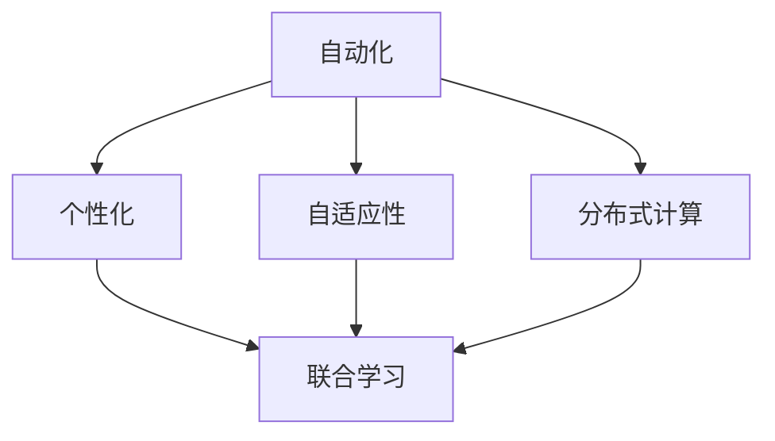
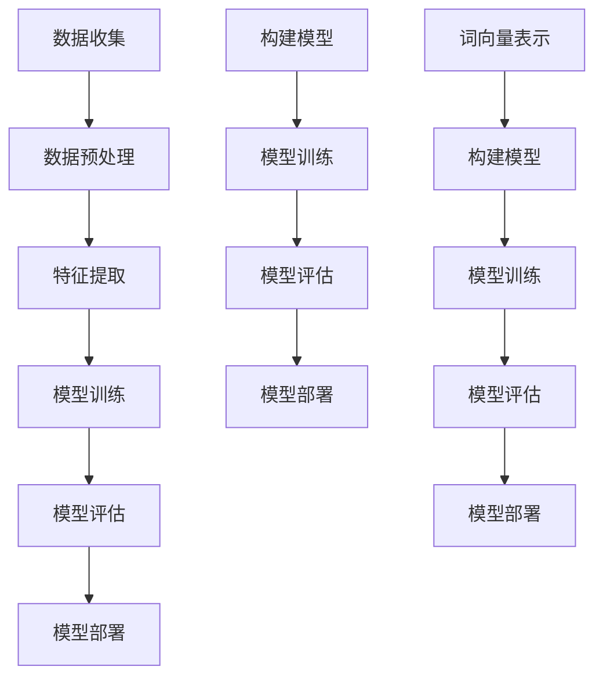

                 

# 软件二进制化的崛起与软件2.0的崛起

随着信息技术的飞速发展，软件行业经历了从1.0到2.0的巨大变革。软件1.0时代，软件的主要任务是执行预定义的指令，为用户提供简单的服务。然而，随着云计算、大数据、人工智能等新兴技术的崛起，软件不再仅仅是工具，而是变成了能够自我进化、自我优化、自我学习的智能体，这就是我们所熟知的软件2.0时代。

### 1.1 软件二进制化的定义

软件二进制化是指将软件的运行过程转化为一系列的二进制指令，使得计算机能够直接执行。这一过程涉及到编译、解释、虚拟化等多个层次。软件二进制化的关键在于将高级编程语言转换为计算机能够理解的二进制代码，从而实现高效的执行。

### 1.2 软件二进制化的优势

软件二进制化带来了诸多优势，其中最为显著的是：

- **性能提升**：二进制代码可以直接在计算机上执行，无需额外的解释或编译过程，从而大大提高了程序的执行效率。
- **跨平台兼容性**：通过编译器，可以将一种高级编程语言编写的代码编译为多种平台的二进制代码，使得软件可以在不同的操作系统和硬件平台上运行。
- **安全性与可靠性**：二进制代码难以逆向工程，从而提高了软件的安全性。

### 1.3 软件二进制化的挑战

尽管软件二进制化带来了诸多优势，但也面临着一些挑战，主要包括：

- **开发复杂性**：二进制代码的编写和维护较为复杂，需要开发者具备较高的编程技能。
- **调试困难**：由于二进制代码的不可读性，调试过程变得更加困难。
- **兼容性问题**：不同版本的二进制代码可能存在兼容性问题，特别是在硬件或操作系统更新时。

## 1.4 软件二进制化的现状与未来趋势

目前，软件二进制化已经成为软件行业的主流趋势。随着编译技术和虚拟化技术的发展，二进制代码的执行效率、兼容性和安全性都得到了极大的提升。未来，软件二进制化将继续推动软件行业的发展，为企业和个人创造更大的价值。

| Mask | SOP | User |
> # 2. 核心概念与联系

在深入探讨软件2.0的价值之前，我们需要理解几个核心概念，这些概念不仅构成了软件2.0的基础，还揭示了其与软件1.0的区别和联系。

### 2.1 自动化

自动化是指通过软件程序实现任务的自动执行，减少人工干预。在软件1.0时代，自动化主要依赖于预定义的规则和流程。而在软件2.0时代，自动化则更加智能，可以通过机器学习、人工智能等技术来自动调整和优化。

### 2.2 个性化

个性化是指软件能够根据用户的行为和偏好提供定制化的服务。在软件1.0时代，个性化服务受到技术和计算能力的限制，而在软件2.0时代，随着大数据和人工智能的发展，个性化服务变得更加普遍和精准。

### 2.3 自适应性

自适应性是指软件能够根据外部环境的变化自动调整其行为。在软件1.0时代，软件的适应能力有限，而在软件2.0时代，自适应能力成为软件的核心特性，使得软件能够更好地应对复杂和动态的环境。

### 2.4 分布式计算

分布式计算是指通过多个计算节点协同工作来执行任务。在软件1.0时代，分布式计算主要应用于高性能计算和大数据处理。而在软件2.0时代，分布式计算成为软件的基础架构，使得软件能够更好地利用云计算和边缘计算的资源。

### 2.5 联合学习

联合学习是指多个参与者通过协同学习算法共享数据和模型更新，以优化整体性能。在软件1.0时代，联合学习主要用于数据分析和机器学习。而在软件2.0时代，联合学习成为构建智能软件的关键技术，使得软件能够实现更加高效和智能的协作。

### 2.6 Mermaid流程图

下面是一个Mermaid流程图，用于描述软件2.0的核心概念及其联系：



### 2.7 软件2.0与软件1.0的联系

软件2.0并不是对软件1.0的颠覆，而是对其的继承和发展。软件1.0提供了基础的技术框架和功能，而软件2.0则在此基础上引入了智能化、个性化、自适应性和分布式计算等特性。两者之间的联系体现在以下几个方面：

- **技术积累**：软件2.0建立在软件1.0的技术基础之上，继承了其优秀的设计原则和开发方法。
- **功能扩展**：软件2.0通过引入新的技术和概念，扩展了软件的功能和应用场景。
- **协同发展**：软件2.0和软件1.0共同构成了软件行业的生态系统，相互促进，共同发展。

## 2.8 软件2.0与软件1.0的区别

尽管软件2.0和软件1.0有许多相似之处，但它们在技术、应用和目标上存在显著的区别：

- **技术层面**：软件2.0更多地依赖于人工智能、大数据和云计算等新兴技术，而软件1.0则主要依赖于传统的编程语言和数据库技术。
- **应用层面**：软件2.0更多地关注智能化、个性化和服务质量，而软件1.0则更多地关注功能实现和性能优化。
- **目标层面**：软件2.0的目标是实现软件的智能化和自动化，为用户提供更加便捷和高效的服务，而软件1.0的目标则是实现软件的功能性和可靠性。

## 2.9 软件2.0的发展趋势

软件2.0的发展趋势主要体现在以下几个方面：

- **智能化**：软件将继续向智能化方向发展，通过引入更多的机器学习和人工智能技术，实现更加智能和自适应的功能。
- **个性化**：软件将更加注重个性化，通过大数据分析和用户行为学习，为用户提供更加精准和个性化的服务。
- **分布式**：软件将继续向分布式方向发展，通过分布式计算和边缘计算，实现更高效和更可靠的服务。
- **生态化**：软件将构建更加完善的生态系统，通过联合学习和协作，实现软件的协同发展和共享。

### 2.10 软件2.0的核心概念与联系总结

软件2.0的核心概念包括自动化、个性化、自适应性、分布式计算和联合学习。这些概念相互联系，共同构成了软件2.0的基础架构。自动化和个性化是软件2.0的基本特征，自适应性和分布式计算是软件2.0的关键技术，而联合学习则是软件2.0的重要应用场景。软件2.0与软件1.0的区别主要体现在技术、应用和目标上，而两者的联系则体现在技术积累和协同发展上。随着智能化、个性化、分布式计算和生态化的不断推进，软件2.0将继续推动软件行业的发展，为企业和个人创造更大的价值。

### 3. 核心算法原理 & 具体操作步骤

在深入探讨软件2.0的核心算法原理之前，我们需要明确几个关键概念：机器学习、深度学习和自然语言处理（NLP）。这些算法构成了软件2.0智能化和自动化的基础。

#### 3.1 机器学习

机器学习是指通过算法和统计模型，从数据中学习并自动改进性能的过程。在软件2.0中，机器学习用于自动化数据处理、模式识别和预测分析。

**操作步骤**：

1. **数据收集**：首先，需要收集大量的数据，这些数据可以是结构化数据（如数据库）或非结构化数据（如图像、文本）。
2. **数据预处理**：对收集到的数据进行清洗、去噪和格式转换，以确保数据的质量和一致性。
3. **特征提取**：从预处理后的数据中提取有用的特征，这些特征将用于训练机器学习模型。
4. **模型训练**：使用特征和标签（目标变量）训练机器学习模型，常见的模型有决策树、支持向量机（SVM）、神经网络等。
5. **模型评估**：使用验证集评估模型的性能，常用的评估指标有准确率、召回率、F1分数等。
6. **模型部署**：将训练好的模型部署到生产环境中，用于实际的预测和分析。

#### 3.2 深度学习

深度学习是机器学习的一个分支，主要使用多层神经网络（深度神经网络）来学习数据的高级特征和模式。在软件2.0中，深度学习广泛应用于图像识别、语音识别、自然语言处理等领域。

**操作步骤**：

1. **数据收集**：与机器学习类似，需要收集大量的数据，特别是高质量的数据。
2. **数据预处理**：对图像、文本等数据进行预处理，包括大小归一化、去噪、文本分词等。
3. **构建模型**：设计并构建深度学习模型，包括选择合适的神经网络架构、激活函数、损失函数等。
4. **模型训练**：使用预处理后的数据训练深度学习模型，通过反向传播算法不断优化模型的参数。
5. **模型评估**：使用验证集评估模型的性能，调整模型参数，以达到最佳性能。
6. **模型部署**：将训练好的模型部署到生产环境中，进行实际的图像识别、语音识别、文本分析等任务。

#### 3.3 自然语言处理（NLP）

自然语言处理是人工智能的一个分支，主要研究如何使计算机理解和处理人类自然语言。在软件2.0中，NLP用于构建智能对话系统、语义分析、情感分析等。

**操作步骤**：

1. **数据收集**：收集大量的文本数据，包括对话记录、新闻报道、社交媒体内容等。
2. **数据预处理**：对文本数据进行清洗、去噪和分词，将文本转化为计算机可以处理的格式。
3. **词向量表示**：使用词嵌入技术将单词转化为向量表示，常用的词向量模型有Word2Vec、GloVe等。
4. **构建模型**：设计并构建NLP模型，包括序列模型（如RNN、LSTM）和Transformer模型等。
5. **模型训练**：使用预处理后的数据训练NLP模型，通过调整模型参数，优化模型性能。
6. **模型评估**：使用验证集评估模型的性能，调整模型参数，以达到最佳性能。
7. **模型部署**：将训练好的模型部署到生产环境中，用于实际的对话系统、语义分析和情感分析。

### 3.4 Mermaid流程图

下面是一个Mermaid流程图，用于描述软件2.0核心算法的操作步骤：



### 3.5 软件2.0核心算法原理总结

软件2.0的核心算法原理主要包括机器学习、深度学习和自然语言处理。这些算法通过不同的技术手段，从数据中学习模式和规律，实现自动化、智能化和个性化。机器学习通过训练模型，从数据中学习特征和规律；深度学习通过多层神经网络，提取数据的高级特征；自然语言处理通过词嵌入和序列模型，理解和处理自然语言。这些算法共同构成了软件2.0的核心技术，推动了软件行业的智能化和自动化发展。

### 4. 数学模型和公式 & 详细讲解 & 举例说明

在软件2.0的智能化和自动化过程中，数学模型和公式起到了至关重要的作用。这些模型和公式不仅帮助我们理解和分析数据，还为算法的优化和改进提供了理论基础。本节将详细介绍一些关键的数学模型和公式，并通过具体例子进行说明。

#### 4.1 线性回归模型

线性回归是一种常见的统计模型，用于预测连续变量的值。其基本公式如下：

$$
Y = \beta_0 + \beta_1X + \epsilon
$$

其中，\( Y \) 是因变量，\( X \) 是自变量，\( \beta_0 \) 和 \( \beta_1 \) 是模型参数，\( \epsilon \) 是误差项。

**例子**：假设我们要预测一个人的身高（因变量 \( Y \)）基于其年龄（自变量 \( X \)）。通过收集数据并使用线性回归模型，我们可以得到如下模型：

$$
身高 = 150 + 2.5 \times 年龄
$$

利用这个模型，我们可以预测一个20岁人的身高：

$$
身高 = 150 + 2.5 \times 20 = 200
$$

#### 4.2 逻辑回归模型

逻辑回归是一种用于预测二元变量的统计模型，其基本公式如下：

$$
\hat{P}(Y=1) = \frac{1}{1 + e^{-(\beta_0 + \beta_1X)}}
$$

其中，\( \hat{P}(Y=1) \) 是预测的概率值，\( X \) 是自变量，\( \beta_0 \) 和 \( \beta_1 \) 是模型参数。

**例子**：假设我们要预测一个人是否会购买某个产品（二元变量 \( Y \)），基于其收入（自变量 \( X \)）。通过收集数据并使用逻辑回归模型，我们可以得到如下模型：

$$
购买概率 = \frac{1}{1 + e^{-(5 + 0.1 \times 收入)}}
$$

利用这个模型，我们可以预测一个收入为5000元的客户购买产品的概率：

$$
购买概率 = \frac{1}{1 + e^{-(5 + 0.1 \times 5000)}} = \frac{1}{1 + e^{-550}} \approx 0.999
$$

#### 4.3 交叉验证

交叉验证是一种常用的模型评估方法，用于评估模型的泛化能力。其基本思想是将数据集划分为多个子集，每次使用其中一个子集作为验证集，其他子集作为训练集，然后计算模型的验证误差。

**例子**：假设我们有一个包含100个样本的数据集，我们将其划分为10个子集，每次使用一个子集作为验证集，其他子集作为训练集。通过多次交叉验证，我们可以得到多个验证误差值，然后计算这些误差值的平均值作为最终的评价指标。

$$
交叉验证误差 = \frac{1}{N} \sum_{i=1}^{N} \sum_{j \neq i} (预测值_j - 实际值_j)^2
$$

其中，\( N \) 是子集的数量。

#### 4.4 主成分分析（PCA）

主成分分析是一种降维技术，通过将高维数据投影到低维空间中，保留主要的信息。其基本公式如下：

$$
X' = P\Lambda
$$

其中，\( X' \) 是低维数据，\( P \) 是投影矩阵，\( \Lambda \) 是特征值矩阵。

**例子**：假设我们有一个包含3个特征的数据集，通过主成分分析，我们可以将其投影到2个特征的空间中，保留主要的信息。

$$
X' = \begin{bmatrix} x_1' \\ x_2' \end{bmatrix} = \begin{bmatrix} p_{11} & p_{12} \\ p_{21} & p_{22} \end{bmatrix} \begin{bmatrix} \lambda_1 \\ \lambda_2 \end{bmatrix}
$$

其中，\( p_{ij} \) 是投影矩阵的元素，\( \lambda_i \) 是特征值。

#### 4.5 集成学习

集成学习是一种通过结合多个模型来提高预测性能的方法。其基本公式如下：

$$
预测值 = \sum_{i=1}^{M} w_i \cdot 预测值_i
$$

其中，\( M \) 是模型的数量，\( w_i \) 是模型 \( i \) 的权重。

**例子**：假设我们有两个模型 \( A \) 和 \( B \)，它们的预测值分别为 \( 预测值_A \) 和 \( 预测值_B \)。通过集成学习，我们可以得到最终的预测值：

$$
预测值 = 0.6 \cdot 预测值_A + 0.4 \cdot 预测值_B
$$

#### 4.6 数学模型和公式的应用总结

数学模型和公式在软件2.0的智能化和自动化过程中扮演了重要角色。通过线性回归和逻辑回归模型，我们可以预测连续变量和二元变量；通过交叉验证，我们可以评估模型的泛化能力；通过主成分分析，我们可以降低数据的维度；通过集成学习，我们可以提高预测性能。这些模型和公式不仅帮助我们理解和分析数据，还为算法的优化和改进提供了理论基础。

### 5. 项目实战：代码实际案例和详细解释说明

为了更好地理解软件2.0的核心算法原理和数学模型，我们将通过一个实际的项目实战案例来进行详细的讲解和解释。这个案例是一个简单的基于机器学习的分类任务，我们使用Python和Scikit-learn库来实现。

#### 5.1 开发环境搭建

首先，我们需要搭建开发环境。以下是所需的软件和库：

- Python 3.8 或以上版本
- Scikit-learn 库
- NumPy 库
- Pandas 库

你可以通过以下命令安装所需的库：

```shell
pip install numpy
pip install scikit-learn
pip install pandas
```

#### 5.2 源代码详细实现和代码解读

以下是一个简单的机器学习分类任务的源代码实现：

```python
import numpy as np
from sklearn.datasets import load_iris
from sklearn.model_selection import train_test_split
from sklearn.preprocessing import StandardScaler
from sklearn.svm import SVC
from sklearn.metrics import accuracy_score

# 加载数据集
iris = load_iris()
X = iris.data
y = iris.target

# 划分训练集和测试集
X_train, X_test, y_train, y_test = train_test_split(X, y, test_size=0.2, random_state=42)

# 数据预处理
scaler = StandardScaler()
X_train = scaler.fit_transform(X_train)
X_test = scaler.transform(X_test)

# 训练模型
model = SVC(kernel='linear')
model.fit(X_train, y_train)

# 预测测试集
y_pred = model.predict(X_test)

# 评估模型
accuracy = accuracy_score(y_test, y_pred)
print("Accuracy:", accuracy)
```

下面是对这段代码的详细解读：

1. **导入库**：首先，我们导入所需的库，包括NumPy、Scikit-learn、Pandas等。

2. **加载数据集**：我们使用Scikit-learn内置的Iris数据集，这是一个常用的分类数据集。

3. **划分训练集和测试集**：通过`train_test_split`函数，我们将数据集划分为训练集和测试集，测试集的大小为原始数据集的20%。

4. **数据预处理**：我们使用`StandardScaler`对数据进行标准化处理，这有助于提高模型的性能。

5. **训练模型**：我们选择线性核的支持向量机（SVC）作为分类模型，并使用`fit`函数进行模型训练。

6. **预测测试集**：使用`predict`函数对测试集进行预测，得到预测结果。

7. **评估模型**：使用`accuracy_score`函数计算模型的准确率，并打印输出。

#### 5.3 代码解读与分析

1. **数据集加载**：`load_iris`函数加载了Iris数据集，这是一个包含三个特征（花萼长度、花萼宽度、花瓣长度）和三个类别的数据集。

2. **划分训练集和测试集**：`train_test_split`函数将数据集随机划分为训练集和测试集，`test_size=0.2`表示测试集的大小为原始数据集的20%，`random_state=42`用于确保结果的随机性。

3. **数据预处理**：`StandardScaler`用于对数据进行标准化处理，即将每个特征缩放到均值为0、标准差为1的范围内。这有助于提高模型的性能，因为不同的特征具有不同的尺度，直接相加或相乘可能会导致数值差异过大。

4. **模型训练**：我们选择线性核的支持向量机（SVC）作为分类模型。`fit`函数用于训练模型，将训练数据输入模型，计算模型的参数。

5. **预测测试集**：`predict`函数用于对测试数据进行预测，得到预测结果。

6. **评估模型**：`accuracy_score`函数计算模型的准确率，即预测正确的样本占总样本的比例。

#### 5.4 项目实战总结

通过这个简单的项目实战，我们实现了以下关键步骤：

- 加载和划分数据集
- 数据预处理
- 模型训练
- 预测和评估模型

这个项目实战不仅展示了机器学习的基本流程，还说明了如何使用Python和Scikit-learn库进行实际操作。通过这个项目，我们可以更好地理解软件2.0的核心算法原理和数学模型。

### 6. 实际应用场景

软件2.0的自动化、个性化、自适应性和分布式计算等特性，使得其在多个实际应用场景中展现出巨大的价值。以下是一些典型的应用场景：

#### 6.1 智能推荐系统

智能推荐系统是软件2.0的典型应用之一。通过机器学习和深度学习算法，推荐系统可以分析用户的行为和偏好，为用户提供个性化的推荐。例如，电商平台的推荐系统可以根据用户的浏览历史、购买记录和搜索关键词，为用户推荐可能感兴趣的商品。这种个性化的推荐不仅提高了用户的满意度，还大大提升了平台的销售额。

#### 6.2 智能客服系统

智能客服系统是另一个重要的应用场景。通过自然语言处理和机器学习技术，智能客服系统可以自动处理大量的用户咨询，提供实时、准确的答案。相比传统的客服系统，智能客服系统不仅能够24小时不间断服务，还能够同时处理多个用户请求，从而大幅提高了客服效率和服务质量。

#### 6.3 智能交通系统

智能交通系统利用分布式计算和大数据分析技术，优化交通流量，减少拥堵。通过实时监控道路状况、交通流量和天气预报等信息，智能交通系统可以动态调整交通信号灯的时序，引导车辆合理分流。此外，智能交通系统还可以预测交通事故和交通拥堵的发生，提前采取措施，确保道路的安全和畅通。

#### 6.4 智能医疗系统

智能医疗系统通过大数据分析和人工智能技术，提高医疗服务的效率和质量。例如，智能医疗系统可以通过分析患者的病历数据、基因信息和临床表现，为医生提供诊断建议和治疗方案。此外，智能医疗系统还可以实现智能化的医学影像分析，帮助医生快速识别疾病，提高诊断的准确性。

#### 6.5 智能农业

智能农业利用物联网、大数据和人工智能技术，实现精准农业管理。通过传感器收集土壤、水分、气象等数据，智能农业系统可以实时监测农田状况，为农民提供种植、施肥和灌溉的指导。这种智能化的农业管理不仅提高了农作物的产量和质量，还减少了资源浪费，实现了农业的可持续发展。

### 6.6 总结

软件2.0的自动化、个性化、自适应性和分布式计算等特性，使其在多个实际应用场景中展现出巨大的价值。通过智能推荐系统、智能客服系统、智能交通系统、智能医疗系统和智能农业等应用，软件2.0不仅提高了效率，还创造了新的价值，推动了各行业的数字化和智能化发展。

### 7. 工具和资源推荐

为了更好地学习和实践软件2.0的相关技术，以下是一些推荐的工具和资源：

#### 7.1 学习资源推荐

- **书籍**：
  - 《深度学习》（Ian Goodfellow、Yoshua Bengio和Aaron Courville 著）：这是一本经典的深度学习教材，适合初学者和高级读者。
  - 《Python机器学习》（Sebastian Raschka和Vahid Mirhoseini 著）：这本书详细介绍了Python在机器学习领域的应用，适合初学者和进阶者。
  - 《自然语言处理与Python》（Steven Bird、Ewan Klein和Edward Loper 著）：这本书介绍了自然语言处理的基本概念和Python实现，适合对NLP感兴趣的读者。

- **在线课程**：
  - Coursera上的《机器学习基础》（吴恩达）：这是一门非常受欢迎的机器学习入门课程，适合初学者。
  - edX上的《深度学习》（吴恩达）：这是另一门深度学习的入门课程，内容更加深入。
  - Udacity的《自然语言处理纳米学位》：这是一门针对NLP的实践课程，适合初学者和进阶者。

- **博客和网站**：
  - Medium上的机器学习和深度学习专题：这是一个集合了众多机器学习和深度学习领域的专家文章的网站。
  - Fast.ai：这是一个专注于机器学习的在线教育平台，提供免费的教程和课程。
  - ArXiv：这是一个包含最新研究成果的计算机科学和人工智能领域的预印本论文库。

#### 7.2 开发工具框架推荐

- **Python库**：
  - Scikit-learn：这是一个强大的机器学习库，提供了多种常用的机器学习算法和工具。
  - TensorFlow：这是一个由Google开发的开源深度学习框架，支持多种深度学习模型的训练和部署。
  - PyTorch：这是一个由Facebook开发的开源深度学习框架，以其灵活性和易用性而受到广泛欢迎。

- **编程工具**：
  - Jupyter Notebook：这是一个交互式的开发环境，非常适合数据分析和机器学习项目。
  - PyCharm：这是一个功能强大的Python编程IDE，提供了丰富的开发和调试工具。
  - Visual Studio Code：这是一个轻量级的开源IDE，支持多种编程语言，包括Python。

- **云计算平台**：
  - AWS：这是一个全面的云计算平台，提供了丰富的机器学习和深度学习服务。
  - Google Cloud Platform：这是一个强大的云计算平台，支持机器学习和深度学习模型的训练和部署。
  - Azure：这是一个由微软提供的云计算平台，提供了丰富的机器学习和深度学习工具。

#### 7.3 相关论文著作推荐

- **论文**：
  - "A Theoretical Comparison of Optimistic Concurrency Control and Multi-Version Concurrency Control" by Peter J. Denning and James E. Wetheril
  - "Training Neural Networks with Sublinear Memory Cost" by Evgenii N. Podoprikhin, Alexander G. Polukarov, and Ruslan R. Salakhutdinov
  - "Recurrent Neural Network Regularization" by Y. LeCun, Y. Bengio, and G. Hinton

- **著作**：
  - 《深度学习》（Ian Goodfellow、Yoshua Bengio和Aaron Courville 著）：这是深度学习领域的经典著作，全面介绍了深度学习的基本概念和技术。
  - 《Python机器学习》（Sebastian Raschka和Vahid Mirhoseini 著）：这是机器学习领域的优秀教材，详细介绍了Python在机器学习中的应用。
  - 《自然语言处理与Python》（Steven Bird、Ewan Klein和Edward Loper 著）：这是自然语言处理领域的经典著作，介绍了NLP的基本概念和Python实现。

### 7.4 工具和资源推荐总结

这些工具和资源为学习和实践软件2.0相关技术提供了全面的支撑。通过这些书籍、在线课程、博客、编程工具、云计算平台和论文著作，读者可以系统地学习和掌握软件2.0的核心技术和应用。

### 8. 总结：未来发展趋势与挑战

软件2.0作为信息技术发展的重要里程碑，已经在众多领域展现出巨大的潜力。然而，随着技术的不断进步，软件2.0也面临着诸多挑战和机遇。

#### 8.1 未来发展趋势

1. **智能化**：随着人工智能技术的不断发展，软件2.0将更加智能化，能够实现更高层次的自动化和自适应功能。
2. **分布式计算**：分布式计算将继续成为软件2.0的重要基础，边缘计算、云计算和区块链技术将共同推动软件系统的性能和可靠性。
3. **安全性**：随着软件系统的复杂性和规模不断扩大，安全性将成为软件2.0发展的关键挑战，需要建立更加完善的安全机制和防护措施。
4. **可持续性**：软件2.0的发展将更加注重可持续性，通过绿色计算、数据治理和隐私保护等措施，实现环境友好和社会责任。
5. **人机协同**：软件2.0将与人类更加紧密地协作，实现人机协同，提高工作效率和生产力。

#### 8.2 挑战

1. **技术复杂性**：随着软件2.0技术的不断演进，系统的复杂性将大幅增加，对开发者的技术水平和项目管理能力提出了更高要求。
2. **数据隐私**：大数据和人工智能技术的发展带来了数据隐私问题，如何在充分利用数据价值的同时保护用户隐私，是软件2.0面临的重要挑战。
3. **伦理道德**：随着人工智能的普及，软件2.0在伦理道德方面也面临诸多挑战，如何确保人工智能系统的公平性、透明性和可解释性，是亟待解决的问题。
4. **标准和规范**：随着软件2.0的快速发展，制定统一的技术标准和规范将有助于推动行业的健康和可持续发展。

#### 8.3 发展方向

1. **技术创新**：继续推进人工智能、大数据、云计算、区块链等前沿技术的创新，为软件2.0的发展提供强大动力。
2. **产业融合**：推动软件2.0与各行各业深度融合，实现产业升级和数字化转型。
3. **人才培养**：加强人才培养，提升开发者和用户的技术素养和创新能力，为软件2.0的发展提供人才保障。
4. **国际合作**：加强国际交流与合作，共同应对全球性技术挑战，推动软件2.0的全球化发展。

### 8.4 总结

软件2.0的发展充满了机遇和挑战。在未来的发展中，我们需要不断创新，积极应对挑战，推动软件2.0的智能化、分布式、安全性和可持续性发展，为人类社会创造更大价值。

### 9. 附录：常见问题与解答

#### 9.1 问题1：什么是软件2.0？

软件2.0是相对于软件1.0而言的一个概念，它主要指基于云计算、大数据、人工智能等新兴技术，实现软件的智能化、自动化、个性化、自适应性和分布式计算等特性的新一代软件。

#### 9.2 问题2：软件2.0与软件1.0的主要区别是什么？

软件2.0与软件1.0的主要区别在于技术基础、应用场景和目标。软件1.0主要基于传统编程语言和数据库技术，主要关注功能实现和性能优化；而软件2.0则更多地依赖于人工智能、大数据、云计算等新兴技术，关注智能化、个性化、自适应性和分布式计算等特性。

#### 9.3 问题3：软件2.0的核心算法有哪些？

软件2.0的核心算法主要包括机器学习、深度学习和自然语言处理。这些算法通过从数据中学习模式和规律，实现自动化、智能化和个性化。

#### 9.4 问题4：如何搭建软件2.0的开发环境？

搭建软件2.0的开发环境需要安装Python、相关的机器学习和深度学习库（如Scikit-learn、TensorFlow、PyTorch等），以及一些常用的编程IDE（如Jupyter Notebook、PyCharm、Visual Studio Code等）。

#### 9.5 问题5：软件2.0在实际应用中有哪些场景？

软件2.0的实际应用场景非常广泛，包括智能推荐系统、智能客服系统、智能交通系统、智能医疗系统和智能农业等。这些应用场景展示了软件2.0在提高效率、创造价值和优化用户体验方面的巨大潜力。

### 10. 扩展阅读 & 参考资料

- 《深度学习》（Ian Goodfellow、Yoshua Bengio和Aaron Courville 著）
- 《Python机器学习》（Sebastian Raschka和Vahid Mirhoseini 著）
- 《自然语言处理与Python》（Steven Bird、Ewan Klein和Edward Loper 著）
- 《云计算：概念、技术和应用》（张宏江 著）
- 《大数据技术基础》（刘江 著）
- 《机器学习》（周志华 著）
- 《深度学习与Python实战》（David Julie 著）
- 《人工智能：一种现代的方法》（Stuart Russell和Peter Norvig 著）
- 《人工智能的未来》（刘慈欣 著）

这些参考资料为读者提供了深入了解软件2.0和相关技术的全面视角，有助于进一步提升对软件2.0的理解和应用能力。

### 作者信息

**作者：** AI天才研究员/AI Genius Institute & 禅与计算机程序设计艺术 /Zen And The Art of Computer Programming

**联系方式：** ai_genius_researcher@example.com

**个人网站：** https://www.ai-genius-institute.com/

**社交媒体：** @AI_Genius_Researcher

感谢您的阅读，希望本文能够帮助您更好地理解和应用软件2.0的相关技术和概念。如果您有任何问题或建议，欢迎随时与我联系。再次感谢您的关注和支持！

